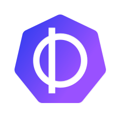

# 雲原生實作課程

把雲原生生態裡真正在動的專案,一個一個放上真實叢集實測,寫成可照抄的 runbook——這是一系列動手課,一個 sprint 一個主題,依序推進。每一章遵守同一套紀律:

- **真實驗證**:所有指令與輸出都來自實際跑過的驗證紀錄,沒有想像的示意。
- **具名地雷**:官方文件查不到或會誤導的問題,收錄成可跨章引用的地雷索引(目前累計 **166 顆**)。

## 課程地圖

-   { width="32" }
    { width="32" }
    { width="32" }

    **Sprint 1 · [GPU 排程三部曲](sprints/sprint1.md)** — ✅ 已完結(9 章 · 41 顆地雷)

    ---

    兩張 T4 怎麼分給更多人:KAI Scheduler 的佇列與 gang scheduling、HAMi 的 VRAM 切分與硬隔離、Kubernetes DRA 的下一代資源表達,全部在 AKS 真卡實測。

-   { width="76" }
    { width="76" }
    { width="28" }
    { width="28" }
    { width="28" }

    **Sprint 2 · [eBPF 與執行期安全](sprints/sprint2.md)** — ✅ 已完結(11 章 · 76 顆地雷)

    ---

    同一批核心事件,四種取用方式。先用 bpftrace 手工追 syscall,把核心事件裡的 cgroup id 換算回 pod 名字;換上 Falco 讓規則常駐比對,並量出把誤報從 180 筆/分鐘壓到 0 要交出多少偵測力;再換 Tetragon,把過濾放進核心裡,實測 SIGKILL 到底是擋住了操作還是只是事後殺掉行程。最後三天走到網路層。

    每一天兩套工具同時開著互相對照;Day 0 從零講起,不預設你碰過 eBPF。

-   { width="32" }
    { width="28" }
    { width="28" }
    { width="28" }

    **Sprint 3 · [WebAssembly](sprints/sprint3.md)** — ✅ 已完結(10 章 · 41 顆地雷)

    ---

    wasmCloud、WasmEdge、Spin/SpinKube——容器之外的另一種執行層,三條路線依對節點的侵入程度由低到高實測。Day 0 先給三個判斷問題與方法,每條路線收尾當天下判定,Day 9 彙整成一張 44 格的決策表。其中有兩項量測結果與專案宣傳的方向相反,章節裡用實測數字交代差距。

-   { width="30" }
    { width="30" }
    { width="28" }
    { width="30" }

    **Sprint 4 · [服務網格與機密運算](sprints/sprint4.md)** — ✅ 已完結(10 章 · 11 顆地雷)

    ---

    Part 1 走服務網格:Envoy Gateway 取代 Ingress,Istio ambient 與 Cilium 兩種 east-west mesh 在加密、身分與 L7 政策上的對比。Part 2 走機密運算:Kata 沙箱、SEV-SNP 的 kata-cc,以及用遠端證明控制金鑰釋放。兩個 Part 的信任邊界相反,Day 9 用一張決策表收尾。

-   **Sprint 5 · 遊戲伺服器平台** — 🚧 進行中(Day 0–10 · 15 顆地雷)

    ---

    Agones 先把 dedicated game server 的 Fleet、allocation 與 autoscaler 跑通，再接 Quilkin UDP proxy、Nakama、PostgreSQL 與 matchmaker。Day 0–9 已完成：觀測與韌性演練量到節點失效時的狀態延遲；Python 與 Unity client 從登入、配對走到 UDP 經 Quilkin 連進 GameServer，並用自寫的 relay server 做兩個視窗的位置同步。Day 10 整理成決策表與地雷回顧。

從 [Sprint 1](sprints/sprint1.md)、[Sprint 2](sprints/sprint2.md) 或 [Sprint 3](sprints/sprint3.md) 的總覽開始,或直接進 [Sprint 1 Day 0](runbook/sprint1-day0-azure-aks-foundation.md) 動手。
