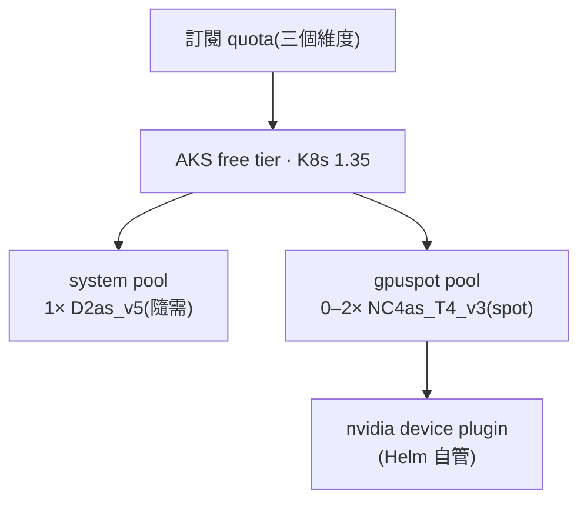

# Day 0: 環境建置——quota 申請、AKS 叢集與 T4 spot 節點池

{ align=right width="95" }

> Sprint 1 要在 AKS 上把 KAI Scheduler、HAMi、DRA 三套 GPU 排程機制各學一輪。但在碰到任何排程器之前,得先蓋出一個「有 GPU、夠便宜、隨時能收工」的叢集。本章從 quota 盤點開始,一路走到第一個 CUDA pod 跑出 `nvidia-smi`,並且把「收工歸零、開工復原」的循環驗證到可以放心執行。本章有一顆雷特別值得記住:**device plugin 裝好了、rollout status 回報成功,實際上卻一個 pod 都沒起**;還有一顆會讓你以為 quota 夠了,其實有三個維度在各自卡人。

!!! abstract "你在課程的哪裡"
    - **起點**:只需要一個 Azure 訂閱,和一台裝了 az、kubectl、helm 的機器。
    - **今天**:蓋出整個 sprint 共用的 AKS 叢集與 T4 spot pool。驗收:第一顆 CUDA pod 跑出 `nvidia-smi`,而且收工歸零、開工復原的循環實測可重複。
    - **Day 1**:安裝 KAI Scheduler,學佇列與配額。

!!! note "指令裡的佔位符"
    本課程的指令用 `<cluster>` 代表叢集名稱、`<resource-group>` 代表資源群組、`<subscription-id>` 代表訂閱 ID——照做時換成自己的值。

## 環境需求:一座 1.34 以上的叢集,和兩張便宜的卡

課程三個主題對環境的要求其實只有兩條。第一,DRA 的正式版 API 要 Kubernetes **1.34 以上**才有,所以叢集版本不能舊(本章步驟 4 會實測驗證這件事);第二,GPU 要能「隨開隨關」,學習型工作負載沒道理讓卡整天掛著計費。本課用 AKS 滿足這兩條——照著做時換成任何版本夠新的托管叢集都行,指令細節自行對應。

選 T4 的理由也單純:`Standard_NC4as_T4_v3` 是 Azure 上最便宜的完整 GPU VM,spot 價約 US$0.21/小時。HAMi 的 VRAM 切分不需要 MIG(Multi-Instance GPU,A100/H100 這類資料中心卡才有的硬體級分卡功能,把一張實體卡切成數張獨立的小卡),T4 完全夠用;KAI 的排程語意跟卡的型號無關;DRA 的最小驗證一張卡就能做。

## 原理與架構



幾個在動手前就要拍板的決定,以及背後的理由:

先說明一個之後每天都會出現的詞:**device plugin** 是 kubelet 的擴充機制,負責把節點上的特殊硬體(GPU、FPGA 之類)向叢集廣播成可以被排程的資源,例如 `nvidia.com/gpu: 1`。沒有它,節點上插著卡,Kubernetes 也看不到。

**GPU driver 誰管?**AKS 對 GPU node pool 提供幾種管理模式:全託管(driver + device plugin 都是 AKS 的)、只管 driver、或全部自理。本課程選「**AKS 管 driver、device plugin 自己用 Helm 管**」——因為 Day 3 的 HAMi 要用自己的 device plugin 接管 `nvidia.com/gpu`,Day 6 的 DRA driver 更是與傳統 device plugin 互斥。如果讓 AKS 託管 device plugin,到時候會跟自己裝的元件打架。這個決定牽動三個階段,必須在 Day 0 定案,不能到 Day 3 才發現要重建 node pool。

**Spot 的交易條件。**spot 節點約為隨需價的三折,代價是 Azure 隨時可以回收。對批次或實驗性工作這划算,但有兩件事要先知道:spot pool 會自動帶上 `kubernetes.azure.com/scalesetpriority=spot:NoSchedule` 的 taint,所有要排上去的 pod 都得聲明對應的 toleration;而 `--spot-max-price` 建立後不能改。另外 GPU pool 刻意**不開 cluster autoscaler**——Day 2 的 gang scheduling 示範需要「資源刻意不足」的情境,autoscaler 若自動擴節點,示範情境就不成立。

**成本紀律是架構的一部分。**free tier 的 control plane 不收費,常駐成本只有 system pool 一台 D2as_v5(約 NT$3.5/小時);GPU pool 用「開工 scale 到 2、收工 scale 到 0」的循環操作,兩張 T4 spot 開著時約 NT$13/小時。本章最後一步就是把這個循環實測一遍,確認 scale 歸零再拉回來之後,driver、標籤、device plugin 都會自己回來。

今天要走的路,八步:盤點 quota → 送申請 → 建 RG 與 AKS → 上叢集驗 DRA API → 開 GPU spot pool → 裝 device plugin → 第一顆 CUDA pod → 收工循環實測。前兩步是行政流程(而且可能要等幾個工作天),後六步是技術操作——等待期能先做什麼,步驟 2 的結尾會講。

## 步驟

### 步驟 1:盤點 quota——它是三個維度,不是一個數字

GPU VM 開不起來,十之八九是 quota。Azure 的 vCPU quota 至少有三個維度同時在管你,任何一個不夠都會擋:

```console
$ az vm list-usage --location japaneast --subscription <subscription-id> -o table | grep -E "NCASv3_T4|Low-priority|Total Regional vCPUs"
Total Regional Low-priority vCPUs         0               3
Total Regional vCPUs                      50              50
Standard NCASv3_T4 Family vCPUs           0               0
```

三行分別是:**spot 專用額度**(3,一台 NC4as 要 4,連一台都開不起)、**區域總 vCPU**(50/50,滿了)、**T4 家族額度**(0,GPU 家族預設就是 0,一定要申請)。GPU 節點的 vCPU 會同時吃家族額度與區域總額,所以三個都要過。

這裡的 50/50 有個陷阱:區域總額是被幾台**已停機(deallocated)的舊 lab VM** 佔住的。停機不代表還額度——詳見[地雷 2](#mine-2)。清掉舊資源後額度才有空間:

```console
$ az group delete -n <old-lab-rg> --subscription <subscription-id> --yes
$ az vm list-usage --location japaneast --subscription <subscription-id> -o table | grep "Total Regional vCPUs"
Total Regional vCPUs                      16              50
```

### 步驟 2:送 quota 申請

需要申請的兩項:`Standard NCASv3_T4 Family vCPUs` 調到 8 以上(兩台 NC4as_T4_v3),`Total Regional Low-priority vCPUs` 調到 8 以上(讓這兩台能用 spot 價)。建議一次多要一點(例如 16),免得之後再跑一次流程。

申請的路有三條,依你的訂閱型態而定:

1. **`az quota create`**:最快,但需要你的身分在該訂閱有 quota 寫入權限。訂閱掛在另一個 tenant、以 B2B guest 身分登入時,直接吃了 `Unauthorized`(見[地雷 3](#mine-3))。
2. **Portal 的 Quotas 頁**:搜尋 Quotas → Compute → 篩區域,勾選項目送出。多數自有訂閱走這條就通。
3. **透過代理商(CSP 訂閱)**:CSP 型訂閱的 quota 常常只有代理商能動,寫信給他們,附上訂閱名稱、訂閱 ID、區域、quota 項目與目標值。這條路徑要等人工處理,實測等了幾個工作天。

等待期不必空轉:kind + 模擬 GPU 的本機練習(Day 1 的前置)完全不需要真卡,可以先跑。

### 步驟 3:建 RG 與 AKS

所有課程資源集中在一個獨立的 resource group,收尾時 `az group delete` 一鍵全清,也不會誤傷訂閱裡的其他東西:

```console
$ az group create -n <resource-group> -l japaneast --subscription <subscription-id> --tags course=CloudNativePracticing sprint=1

$ az aks create -g <resource-group> -n <cluster> --subscription <subscription-id> \
    --tier free --kubernetes-version 1.35.6 \
    --nodepool-name system --node-count 1 --node-vm-size Standard_D2as_v5 \
    --generate-ssh-keys
```

版本選 1.35 而不是最新的 1.36,是保守考量:DRA 需要的是 1.34+,而 Day 1 要裝的 KAI Scheduler 官方文件沒有明說支援到哪個版本,拿次新版(N-1)踩到相容性問題的機率低一點。system pool 用最小的 D2as_v5 隨需節點——AKS 規定 system pool 不能用 spot。

### 步驟 4:上叢集,先立一條紀律,再驗一個地基

拉 kubeconfig:

```console
$ az aks get-credentials -g <resource-group> -n <cluster> --subscription <subscription-id>
```

這裡有一個值得先知道的風險:`az aks get-credentials` 會順手把 current-context 切到新叢集。如果你的 kubeconfig 裡還有別的叢集,而且別的終端機正在用,這一切就是事故的開端——本課程就真的發生過一次,詳見[地雷 4](#mine-4)。

```console
$ kubectl get nodes
NAME                             STATUS   ROLES    AGE   VERSION
aks-system-35459509-vmss000000   Ready    <none>   68s   v1.35.6
```

接著驗 Day 6–7 的地基:DRA 的 API 群組在不在。DRA 在上游 1.34 進 GA(現行官方文件標示 v1.35 stable),GA 功能理應預設開啟,但「理應」要用實測換成「確定」:

```console
$ kubectl api-resources | grep resource.k8s.io
deviceclasses            resource.k8s.io/v1    false   DeviceClass
resourceclaims           resource.k8s.io/v1    true    ResourceClaim
resourceclaimtemplates   resource.k8s.io/v1    true    ResourceClaimTemplate
resourceslices           resource.k8s.io/v1    false   ResourceSlice
```

四個 API 都在,而且是正式版 `v1`,不用開任何 feature gate。這一步值十秒鐘,卻讓後面兩天的課不必賭。

### 步驟 5:開 GPU spot pool

quota 核准後,開兩台 T4 spot,固定節點數、不開 autoscaler:

```console
$ az aks nodepool add -g <resource-group> --cluster-name <cluster> -n gpuspot \
    --subscription <subscription-id> \
    --node-count 2 --node-vm-size Standard_NC4as_T4_v3 \
    --priority Spot --eviction-policy Delete --spot-max-price -1 \
    --labels pool=gpu

$ kubectl get nodes -l pool=gpu
NAME                              STATUS   ROLES    AGE    VERSION
aks-gpuspot-21249019-vmss000000   Ready    <none>   102s   v1.35.6
aks-gpuspot-21249019-vmss000001   Ready    <none>   106s   v1.35.6
```

`--spot-max-price -1` 的意思是「跟著現價走,不因價格被回收」(容量不足仍可能被回收,這是 spot 的本質)。此時看節點會發現:taint 只有 spot 那條,而 `nvidia.com/gpu` 資源還不存在——AKS 裝好了 driver,但 device plugin 是我們自己的事,這正是步驟 6。

### 步驟 6:裝 device plugin——然後撞上 desired=0

用 NVIDIA 官方的 Helm chart,限定只跑在 GPU pool、並容忍 spot taint:

```console
$ helm repo add nvdp https://nvidia.github.io/k8s-device-plugin
$ helm upgrade -i nvdp nvdp/nvidia-device-plugin \
    -n nvidia-device-plugin --create-namespace \
    --set nodeSelector.pool=gpu \
    --set-json 'tolerations=[{"key":"kubernetes.azure.com/scalesetpriority","operator":"Equal","value":"spot","effect":"NoSchedule"},{"key":"nvidia.com/gpu","operator":"Exists","effect":"NoSchedule"}]'
```

裝完檢查,rollout 一切「成功」——但 GPU 資源就是不出現:

```console
$ kubectl -n nvidia-device-plugin rollout status ds/nvdp-nvidia-device-plugin
daemon set "nvdp-nvidia-device-plugin" successfully rolled out

$ kubectl -n nvidia-device-plugin get pods
No resources found in nvidia-device-plugin namespace.
```

DaemonSet 的 desired 是 0:一個 pod 都不打算跑,而「0 個裡面 0 個就緒」在 rollout status 眼中是圓滿達成。真正的原因藏在 chart 預設的 nodeAffinity 裡,完整的診斷過程與修法見[地雷 1](#mine-1)。結論是給 node pool 補一個 NFD 風格的標籤——注意要在 **pool 層級**補,節點重建時才會自動帶回來:

```console
$ az aks nodepool update -g <resource-group> --cluster-name <cluster> -n gpuspot \
    --subscription <subscription-id> \
    --labels pool=gpu "nvidia.com/gpu.present=true"

$ kubectl get nodes -l pool=gpu \
    -o jsonpath='{range .items[*]}{.metadata.name}: gpu={.status.allocatable.nvidia\.com/gpu}{"\n"}{end}'
aks-gpuspot-21249019-vmss000000: gpu=1
aks-gpuspot-21249019-vmss000001: gpu=1
```

兩台節點各廣告出一張 GPU,device plugin 的日誌也印出 `Detected platform: nvml`——AKS 預裝的 driver 有被正確找到。

### 步驟 7:第一個 CUDA pod

驗收整條鏈:排程器 → spot toleration → device plugin → driver → 真的卡。

```yaml
# gpu-smoke.yaml
apiVersion: v1
kind: Pod
metadata:
  name: gpu-smoke
spec:
  restartPolicy: Never
  nodeSelector:
    pool: gpu
  tolerations:
    - key: kubernetes.azure.com/scalesetpriority
      operator: Equal
      value: spot
      effect: NoSchedule
  containers:
    - name: cuda
      image: nvcr.io/nvidia/cuda:12.4.1-base-ubuntu22.04
      command: ["nvidia-smi"]
      resources:
        limits:
          nvidia.com/gpu: 1
```

```console
$ kubectl apply -f gpu-smoke.yaml
$ kubectl wait pod/gpu-smoke --for=jsonpath='{.status.phase}'=Succeeded --timeout=180s
$ kubectl logs gpu-smoke
+-----------------------------------------------------------------------------------------+
| NVIDIA-SMI 580.159.04             Driver Version: 580.159.04     CUDA Version: 13.0     |
|=========================================+========================+======================|
|   0  Tesla T4                       Off |   00000001:00:00.0 Off |                  Off |
| N/A   36C    P8             15W /   70W |       0MiB /  16384MiB |      0%      Default |
+-----------------------------------------+------------------------+----------------------+
```

Tesla T4、16 GB VRAM 、driver 580 系列。地基完工。

### 步驟 8:收工循環——scale 歸零,再拉回來驗一次

每次下課的標準動作是把 GPU pool 縮到 0(spot 節點刪掉就不計費)。但「縮得回去」只值一半,「拉回來一切如常」才算數——尤其我們在步驟 6 補的標籤,是不是真的會跟著新節點回來?實測一輪:

```console
$ kubectl delete pod gpu-smoke
$ az aks nodepool scale -g <resource-group> --cluster-name <cluster> -n gpuspot \
    --subscription <subscription-id> --node-count 0
$ az aks nodepool scale -g <resource-group> --cluster-name <cluster> -n gpuspot \
    --subscription <subscription-id> --node-count 2

$ kubectl get nodes -l pool=gpu \
    -o jsonpath='{range .items[*]}{.metadata.name}: gpu={.status.allocatable.nvidia\.com/gpu} labels-ok={.metadata.labels.nvidia\.com/gpu\.present}{"\n"}{end}'
aks-gpuspot-21249019-vmss000002: gpu=1 labels-ok=true
aks-gpuspot-21249019-vmss000003: gpu=1 labels-ok=true
```

注意節點名稱從 `vmss000000/000001` 變成了 `vmss000002/000003`——這是兩台全新的 VM,不是原機重開。pool 層級的標籤自動補上、device plugin 的 DaemonSet 自動排上、driver 隨新節點的映像就位,全程不需要人工介入。驗完把 pool 縮回 0,收工。

## 驗收 checkpoint

| 檢查項 | 指令 | 期待結果 |
|---|---|---|
| 三維度 quota 到位 | `az vm list-usage -o table` | T4 家族 ≥8、spot ≥8、區域總額有餘裕 |
| 叢集版本 | `kubectl get nodes` | v1.35.x,system 節點 Ready |
| DRA API | `kubectl api-resources \| grep resource.k8s.io` | 四個 `resource.k8s.io/v1` 資源 |
| GPU 資源廣告 | 節點 allocatable | 每台 GPU 節點 `nvidia.com/gpu: 1` |
| CUDA 煙霧測試 | `kubectl logs gpu-smoke` | `nvidia-smi` 印出 Tesla T4 |
| 收工循環 | scale 0 → 2 | 新節點自帶標籤、GPU 資源自動回來 |

## 地雷記錄

### 地雷 1:device plugin 的 rollout「成功」,desired 卻是 0 {#mine-1}

**症狀**:Helm 安裝正常、`rollout status` 回報 successfully rolled out,但 namespace 裡沒有任何 pod,節點也沒有 `nvidia.com/gpu` 資源。

**診斷**:看 DaemonSet 實際 render 出來的排程條件——

```console
$ kubectl -n nvidia-device-plugin get ds nvdp-nvidia-device-plugin \
    -o jsonpath='desired={.status.desiredNumberScheduled}{"\n"}affinity={.spec.template.spec.affinity}'
desired=0
affinity={"nodeAffinity":{"requiredDuringSchedulingIgnoredDuringExecution":{"nodeSelectorTerms":[
  {"matchExpressions":[{"key":"feature.node.kubernetes.io/pci-10de.present","operator":"In","values":["true"]}]},
  {"matchExpressions":[{"key":"feature.node.kubernetes.io/cpu-model.vendor_id","operator":"In","values":["NVIDIA"]}]},
  {"matchExpressions":[{"key":"nvidia.com/gpu.present","operator":"In","values":["true"]}]}]}}}
```

chart 預設帶了一組 nodeAffinity,要求節點有 NFD(Node Feature Discovery)風格的標籤才肯排。AKS 的素節點沒裝 NFD,三個條件全落空,DaemonSet 於是「合理地」認為全叢集沒有它該去的地方。而 desired=0 的 DaemonSet 在 rollout status 看來毫無問題——**檢查 DaemonSet 永遠要看 desired 數字,不能只看 rollout 結果**。

**修法**:補上三個條件之一的 `nvidia.com/gpu.present=true`。關鍵是用 `az aks nodepool update --labels` 在 pool 層級補,不要 `kubectl label node`——spot 節點會被回收重建、scale 歸零再回來也是全新 VM,節點層級的標籤活不過任何一次重建。注意 `--labels` 是整組覆蓋,原有的標籤要一起帶上。

### 地雷 2:quota 有三個維度,停機的 VM 還在佔額度 {#mine-2}

**症狀**:確認過 GPU 家族 quota 核准了,VM 還是開不出來;或反過來,區域總額看起來夠,GPU 就是起不來。

**原因**:`az vm list-usage` 裡至少三個維度同時生效——VM 家族額度、`Total Regional vCPUs`、spot 專用的 `Total Regional Low-priority vCPUs`。GPU 節點要同時通過家族與區域兩關,用 spot 再多一關。更陰的是:**已停機(deallocated)的 VM 在這份帳上仍然佔著區域額度**——實測案例:區域總額 50/50 全滿,佔額度的是幾台停機多月的 VM,刪掉 resource group 才拿回 34 個 vCPU。停機省的是計算費,不是 quota。

### 地雷 3:B2B guest 身分送不動 quota API {#mine-3}

**症狀**:`az quota create` 直接回 `(Unauthorized) Request failed`,連錯誤細節都不給。

**原因與繞法**:訂閱掛在別的 tenant、你的帳號是 B2B guest 時,quota 的 ARM API 常常不放行,而且 CSP 型訂閱的 quota 有時只有代理商後台能調。先用 Portal 的 Quotas 頁試,不行就直接找代理商,附齊四樣東西:訂閱名稱、訂閱 ID、區域、quota 項目與目標值。另外在 Portal 開 support request 時,**確認訂閱下拉選單選的是目標訂閱**——帳號下掛著多個訂閱時,預設選中的往往不是你要的那個。

### 地雷 4:kubectl 不帶 context,打到別人的叢集 {#mine-4}

**症狀**:指令下對了,叢集是錯的。

**原因**:current-context 是 kubeconfig 裡的一個共享可變狀態,`az aks get-credentials` 會改它,任何一個終端機、任何一個自動化腳本也都可能改它。真實案例:一次例行的 `kubectl get nodes` 沒帶 `--context`,打到了 kubeconfig 裡另一個生產叢集——那次只是唯讀查詢,沒造成損害,但同一個失誤配上 `delete` 就是事故。

**修法**:在多叢集環境裡工作時,把「kubectl 一律帶 `--context`、helm 一律帶 `--kube-context`」當成肌肉記憶,不依賴、也不去改 current-context。(本課的教學指令為了好讀沒有帶這個旗標,照做前請先確認 `kubectl config current-context` 指向的是你打算操作的叢集。)

## 帶得走的東西

- Azure 的 vCPU quota 至少三個維度同時在管:家族、區域總額、spot。查的時候三個都看,申請的時候想好未來量一次要足。
- 停機的 VM 仍佔區域 quota。清環境要刪資源,不是關機。
- 託管 K8s 的 GPU 棧是分層的:driver 一層、device plugin 一層、(未來的)DRA driver 一層。誰管哪層要在最開始拍板,因為換手等於重建 node pool。
- DaemonSet 的健康不能看 rollout status,要看 desired 數字——0 個目標的部署永遠「成功」。
- 會被重建的節點(spot、scale-to-0)身上不能放手工狀態,標籤、taint 都要下在 pool 層級。
- current-context 是共享可變狀態。顯式 `--context` 是一行的成本,換掉一整類事故。

## 延伸閱讀

想往下深挖,從這幾份開始:

- [Add an Azure Spot node pool to an AKS cluster](https://learn.microsoft.com/en-us/azure/aks/spot-node-pool) —— spot pool 的 taint/label 行為、限制與 max price 機制
- [Supported Kubernetes versions in AKS](https://learn.microsoft.com/en-us/azure/aks/supported-kubernetes-versions) —— 版本支援週期與 N-2 政策
- [NVIDIA device plugin for Kubernetes](https://github.com/NVIDIA/k8s-device-plugin) —— Helm 部署選項與 GFD 標籤機制
- [Dynamic Resource Allocation | Kubernetes](https://kubernetes.io/docs/concepts/scheduling-eviction/dynamic-resource-allocation/) —— DRA 概念與 API 物件(現行文件標示 v1.35 stable)

## 下一步

地基有了:一個 1.35 的叢集、兩張隨叫隨到的 T4、一套收工不燒錢的循環。Day 1 把第一位主角請上台——KAI Scheduler,NVIDIA 開源的批次排程器。先讓它以 secondary scheduler 的身分與預設排程器共存,跑通第一個 GPU 任務,然後建立兩個 Queue,看排程公平性怎麼在「線上推論」與「離線批次」之間分 GPU。

---

!!! quote ""
    Kubernetes 標誌為 CNCF 之官方資產,此處作社群教學用途。
