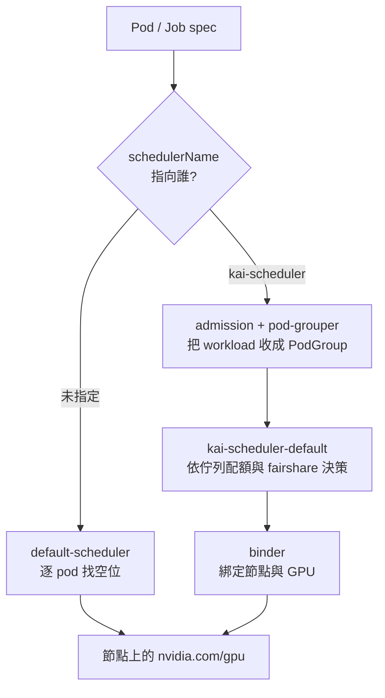

# Day 1: 安裝 KAI Scheduler——佇列、配額與第一顆走 KAI 的 GPU pod

{ align=right width="100" }

> 先想像一個下午:批次評估任務把叢集僅有的兩張 T4 全部吃光,線上推論的 pod 進不來,只能 Pending。`kubectl get pods` 沒有任何錯誤——預設排程器不覺得哪裡有問題,在它眼裡每顆 pod 都是獨立個體,先到先贏,後到的等著。今天要裝的 KAI Scheduler 就是來處理這件事的:兩層佇列、保底配額、閒置時互相借卡、必要時把借出去的收回來。本章會把上面那個下午在兩張 T4 上真實重演一次,而章裡的雷都長在「直覺跟實作相反」的位置:安裝指令的版本字串少一個字母就抓不到 chart;把 pod 丟進叫做 `inference-prod` 的佇列,它拿到的優先權其實是 `train`;而優先權調到最高的那顆,反倒是唯一卡在 Pending 的。

!!! abstract "你在課程的哪裡"
    - **Day 0**:AKS 叢集與兩張 T4 spot 已就緒,收工歸零的循環驗證過。
    - **今天**:裝 KAI Scheduler、建兩層佇列。驗收:一顆 GPU pod 由 KAI 排上、佇列間的公平分配與同佇列搶占各演一次。
    - **Day 2**:換一個維度——一組 pod 要嘛全上、要嘛全不上。

## 預設排程器是怎麼排一顆 pod 的

在講 KAI 之前,先把 kube-scheduler 的行為看清楚。每一顆還沒有節點的 pod,它都用同一套流程處理:

1. **過濾(Filter)**:先刷掉不合格的節點——資源不夠、taint 沒有對應 toleration、nodeSelector 對不上,都出局。
2. **打分(Score)**:對活下來的節點排名,挑一個最順眼的,例如剩餘資源多、映像已經在本機。
3. **繫結(Bind)**:把 pod 和節點寫在一起,之後就是 kubelet 的事了。

這套流程有兩個特徵,是今天整章的伏筆。第一,**決策單位是一顆 pod**:排程器眼裡沒有「這三顆是同一份訓練工作」的概念,每顆各排各的。第二,它並非不會搶占——原生的 PriorityClass 可以讓高優先權 pod 把低優先權 pod 擠下去,但粒度同樣是**一顆對一顆**。

還有一個容易被忽略的機制:pod spec 裡的 `schedulerName` 欄位。一個叢集其實可以同時跑好幾個排程器,pod 沒寫這欄就歸預設排程器管,寫了就歸指定的那位管。KAI 能與 kube-scheduler 並存,靠的正是這個內建機制——它不是取代預設排程器,而是並存的第二個排程器。

## 為什麼還要再裝一個排程器

先說句公道話:kube-scheduler 很擅長它被設計來做的事——排無狀態、彼此獨立、可以互相替換的服務,上面那套流程在那個世界裡運作得又快又穩。問題是 GPU 叢集要回答的是另一類問題——「推論組跟批次組各該分到幾張卡」「離峰時能不能讓批次多借兩張,尖峰再還回來」「一份訓練工作要 8 個 worker,只給 7 個算不算成功」。這些問題的主詞是「一組人」或「一份工作」,不是單一 pod,預設排程器沒有對應的概念可以表達。

KAI Scheduler 的來歷值得一提:它不是從零寫起的新專案,前身是 Run:ai 的商用排程引擎——NVIDIA 在 2024 年收購 Run:ai 之後,2025 年把引擎以 Apache 2.0 開源,同年 12 月進 CNCF sandbox(截至 2026-08 仍在 sandbox 階段)。也就是說,你今天裝的是一個在商用環境跑過多年的引擎,不是實驗品。它不取代 kube-scheduler,而是並存:沒指定 `schedulerName` 的 pod 照常由預設排程器處理,只有明講要走 KAI 的才進它的佇列體系。這個「並存」不是設定選項,是預設行為——也是它敢往已經在跑東西的叢集裡塞的原因。

本課程用的版本是 chart / appVersion `v0.16.8`,叢集是 Day 0 蓋的 AKS `<cluster>`(K8s 1.35.6),兩張 T4 spot。

## 原理與架構

送出的 pod 走哪條路,由 `spec.schedulerName` 這一個欄位決定:



右邊那條路比左邊多一站:KAI 把「決定放哪」跟「真正綁上去」拆成 scheduler 與 binder 兩個元件、兩個事件。追一顆卡住的 GPU pod 時,看它停在 `Scheduled` 還是 `Bound`,就能分辨是排程決策沒過還是資源綁定沒過。

### 七個元件各自在做什麼

Helm chart 只直接建立 `kai-operator`,其餘六個是 operator 讀 `Config` CR 之後才生出來的:

| Deployment | 職責 |
|---|---|
| `kai-operator` | 讀 `Config` CR,產生並維護下面六個元件 |
| `kai-scheduler-default` | 排程器本體(名字帶 `-default` 是對應 default SchedulingShard) |
| `binder` | 決策後真正把 pod 綁到 node,處理 GPU 資源綁定 |
| `admission` | mutating/validating webhook,攔截 workload 補 PodGroup 相關欄位 |
| `pod-grouper` | 從 workload(Deployment/Job/裸 Pod…)推導出 PodGroup |
| `podgroup-controller` | 維護 PodGroup 生命週期與狀態 |
| `queue-controller` | 維護 Queue 狀態、算配額與 fairshare |

只有 operator 與 scheduler 帶 `kai-` 前綴,其餘五個是裸名。查元件狀態要靠 namespace 篩,靠名字 grep 會漏。

### 佇列:quota 是保證下限,不是上限

把佇列想成部門的月度預算最容易懂:quota 是你的保底額度,誰都拿不走;這個月用不完的部分,別的部門可以先借去用;哪天你自己要用了,借出去的會被收回來。KAI 整套配額機制就是這個邏輯,只是把「錢」換成「卡」。

KAI 的 `Queue` 是階層式的,parent 底下掛 leaf,workload 只能掛在 leaf 上。每個 leaf 對每種資源給三個數字:

- **`quota`**:保證額度。這個佇列一定拿得到的量,別人搶不走。
- **`limit`**:硬上限。`-1` 表示不設限,可以在別人閒置時超額借用;**不填等於 0,等於完全不准超額**。
- **`overQuotaWeight`**:超額資源的分配權重。兩個佇列同時想借閒置的卡時,按這個比例分。

本章的階層只有三個節點,今天要看的行為從這裡都跑得出來:

| 佇列 | 角色 | GPU quota | GPU limit | queue priority |
|---|---|---|---|---|
| `cnp-root` | parent | -1(不設保證) | -1 | — |
| `inference-prod` | leaf,線上推論 | 1 | -1 | 200 |
| `batch-eval` | leaf,離線批次 | 1 | -1 | 100 |

兩張卡、兩個佇列各保證一張,剛好把保證額度分完,而 `limit: -1` 讓任一方在對方閒置時能把整座叢集借走。

### 兩套優先權,不要混在一起看

這是本章最容易踩的心智模型陷阱,先講在前面:

| | queue priority(`Queue.spec.priority`) | workload priority(PriorityClass) |
|---|---|---|
| 管什麼 | **超額資源**的分配先後 | 誰可以搶占誰、誰不會被搶占 |
| 對 quota 內的資源 | 完全無效,quota 內受保護 | 無關 |
| 本章的值 | 200 / 100 | `train` 50、`build-preemptible` 75、`build` 100、`inference` 125 |

KAI 裝完就自帶那四個 PriorityClass。分水嶺在 **100**:值 ≥100 的 workload 不可被搶占,代價是**只能用 quota 內的資源**;值 <100 的可被搶占,但能自由借用超額資源。步驟 6 與步驟 7 分別站在這條線的兩邊。

今天要走的路,八步:拉起 GPU pool 並趁等待裝 KAI → 驗證安裝 → 清點元件 → 建兩層佇列 → 第一顆走 KAI 的 GPU pod → 兩張卡佔滿後提交高優先佇列的工作 → 同佇列內的搶占 → 收尾。前三步是安裝與盤點,中間四步每一步都對應上面講過的一個概念。

## 步驟

### 步驟 1:先把 GPU pool 拉起來,等待時間拿去裝 KAI

Day 0 定下的紀律是收工把 GPU pool 縮到 0。開工第一件事就是拉回來:

```console
$ az aks nodepool scale \
    -g <resource-group> --cluster-name <cluster> -n gpuspot \
    --subscription <subscription-id> --node-count 2
```

這是同步阻塞指令,而且會塞很久。另開一個視窗查進度:

```console
$ az aks nodepool show -g <resource-group> --cluster-name <cluster> -n gpuspot \
    --subscription <subscription-id> \
    --query '{count:count, provisioningState:provisioningState, powerState:powerState.code, vmSize:vmSize}' -o json
{
  "count": 2,
  "powerState": "Running",
  "provisioningState": "Scaling",
  "vmSize": "Standard_NC4as_T4_v3"
}
```

`provisioningState: Scaling` 是進行中的正常狀態。本次從下指令到兩張卡真的可配置,總共約 **7 分鐘**(VM 佈建 + driver + kubelet 註冊)。這段時間不必乾等——KAI 的元件全部落在 system node,不需要 GPU 節點就位就能裝。

### 步驟 2:安裝 KAI v0.16.8——版本字串照抄,別自己整理

README 寫 `--version <VERSION>`,直覺會填 release 頁上的裸 semver。動手裝之前先用 `helm show chart` 驗一次比較省事:

```console
$ helm show chart oci://ghcr.io/kai-scheduler/kai-scheduler/kai-scheduler --version 0.16.8
Error: failed to perform "FetchReference" on source: ghcr.io/kai-scheduler/kai-scheduler/kai-scheduler:0.16.8: not found

$ helm show chart oci://ghcr.io/kai-scheduler/kai-scheduler/kai-scheduler --version v0.16.8
Pulled: ghcr.io/kai-scheduler/kai-scheduler/kai-scheduler:v0.16.8
apiVersion: v2
appVersion: v0.16.8
description: KAI Scheduler by NVIDIA
name: kai-scheduler
type: application
version: v0.16.8
```

看最後一行:chart 的 `version` 欄位本身就帶 `v`。多數 chart 的 version 是裸 semver,KAI 直接把 git release tag 當成 chart version,細節見[地雷 1](#mine-1)。

```console
$ helm upgrade -i kai-scheduler oci://ghcr.io/kai-scheduler/kai-scheduler/kai-scheduler \
    \
    -n kai-scheduler --create-namespace \
    --version v0.16.8 \
    --wait --timeout 10m
Release "kai-scheduler" does not exist. Installing it now.
Pulled: ghcr.io/kai-scheduler/kai-scheduler/kai-scheduler:v0.16.8
NAME: kai-scheduler
LAST DEPLOYED: Mon Aug  3 15:16:09 2026
NAMESPACE: kai-scheduler
STATUS: deployed
REVISION: 1
DESCRIPTION: Install complete
```

`STATUS: deployed` 之後立刻查 pod,會看到一半的元件還沒起來:

```console
$ kubectl -n kai-scheduler get pods
NAME                                     READY   STATUS              RESTARTS   AGE
admission-8f8cf9ffb-b4759                0/1     ContainerCreating   0          9s
binder-69b9dff55-ln5ww                   0/1     ContainerCreating   0          9s
kai-operator-58cb44c58c-rdfgk            1/1     Running             0          36s
kai-scheduler-default-745fc7dcf9-m48t5   1/1     Running             0          9s
pod-grouper-5f8ccd5b75-df7z4             0/1     ContainerCreating   0          9s
podgroup-controller-8854fdc49-6grwf      1/1     Running             0          9s
queue-controller-746cb94d99-tnsz5        0/1     ContainerCreating   0          9s
```

帶了 `--wait` 卻等不到——因為 Helm 只認得它自己建立的 `kai-operator`,其餘六個是 operator 二次生出來的,不在等待範圍內。詳見[地雷 2](#mine-2)。安裝後補一道自己的等待條件:

```console
$ kubectl -n kai-scheduler wait --for=condition=Available deploy --all --timeout=300s
deployment.apps/admission condition met
deployment.apps/binder condition met
deployment.apps/kai-operator condition met
deployment.apps/kai-scheduler-default condition met
deployment.apps/pod-grouper condition met
deployment.apps/podgroup-controller condition met
deployment.apps/queue-controller condition met
```

### 步驟 3:清點元件,順便看安裝帶進來了什麼

七個 Deployment 全部落在 system node(它們沒有 spot toleration,本來就上不了 GPU 節點)。2 vCPU 的 D2as_v5 撐不撐得住,查 request 就知道:

```console
$ kubectl -n kai-scheduler get deploy \
    -o custom-columns='NAME:.metadata.name,CPU_REQ:.spec.template.spec.containers[*].resources.requests.cpu,MEM_REQ:.spec.template.spec.containers[*].resources.requests.memory'
NAME                    CPU_REQ   MEM_REQ
admission               50m       256Mi
binder                  50m       200Mi
kai-operator            <none>    <none>
kai-scheduler-default   250m      512Mi
pod-grouper             50m       256Mi
podgroup-controller     50m       256Mi
queue-controller        50m       256Mi
```

加總約 500m CPU / 1.7 GiB,在 2 vCPU / 8 GB 的節點上綽綽有餘,全程沒有任何 Pending。這個規模的實驗叢集不必為 KAI 另外開一台 system node,也不必去調 replica 或壓低 request。

接著看它帶了哪些 CRD、哪些預設物件:

```console
$ kubectl get crd | grep -Ei 'run.ai|kai'
bindrequests.scheduling.run.ai                   2026-08-03T07:16:08Z
configs.kai.scheduler                            2026-08-03T07:16:07Z
podgroups.scheduling.run.ai                      2026-08-03T07:16:08Z
queues.scheduling.run.ai                         2026-08-03T07:16:08Z
schedulingshards.kai.scheduler                   2026-08-03T07:16:08Z
topologies.kai.scheduler                         2026-08-03T07:16:08Z

$ kubectl get queues
NAME                   PRIORITY   PARENT                 CHILDREN            DISPLAYNAME
default-parent-queue                                     ["default-queue"]
default-queue                     default-parent-queue

$ kubectl get priorityclass | grep -Ev 'system-'
build                     100          false            66s    PreemptLowerPriority
build-preemptible         75           false            66s    PreemptLowerPriority
inference                 125          false            66s    PreemptLowerPriority
train                     50           false            66s    PreemptLowerPriority
```

CRD 分屬兩個 API group:排程原語(Queue / PodGroup / BindRequest)在 `scheduling.run.ai`——Run:ai 血統的殘留;operator 自己的設定(Config / SchedulingShard / Topology)在 `kai.scheduler`。兩個 group 混在同一個 namespace 裡,寫 YAML 時 apiVersion 很容易挑錯。另外裝完就自帶一組 `default-parent-queue` → `default-queue` 階層,以及那四個 PriorityClass。

### 步驟 4:建立兩層佇列

依官方 queues 文件的 CRD schema(`scheduling.run.ai/v2`, kind `Queue`),parent `cnp-root` 加兩個 leaf。整份存成 `01-queues.yaml`——步驟 8 收尾時要拿同一份檔案刪回去:

```bash
cat > 01-queues.yaml <<'EOF'
apiVersion: scheduling.run.ai/v2
kind: Queue
metadata:
  name: cnp-root
spec:
  displayName: "CNP Sprint1 Root"
  resources:
    cpu:
      quota: -1
      limit: -1
      overQuotaWeight: 1
    memory:
      quota: -1
      limit: -1
      overQuotaWeight: 1
    gpu:
      quota: -1
      limit: -1
      overQuotaWeight: 1
---
apiVersion: scheduling.run.ai/v2
kind: Queue
metadata:
  name: inference-prod
spec:
  displayName: "Inference Prod"
  parentQueue: cnp-root
  priority: 200
  resources:
    cpu:
      quota: -1
      limit: -1
      overQuotaWeight: 1
    memory:
      quota: -1
      limit: -1
      overQuotaWeight: 1
    gpu:
      quota: 1
      limit: -1
      overQuotaWeight: 2
---
apiVersion: scheduling.run.ai/v2
kind: Queue
metadata:
  name: batch-eval
spec:
  displayName: "Batch Eval"
  parentQueue: cnp-root
  priority: 100
  resources:
    cpu:
      quota: -1
      limit: -1
      overQuotaWeight: 1
    memory:
      quota: -1
      limit: -1
      overQuotaWeight: 1
    gpu:
      quota: 1
      limit: -1
      overQuotaWeight: 1
EOF
```

```console
$ kubectl apply -f 01-queues.yaml
queue.scheduling.run.ai/cnp-root created
queue.scheduling.run.ai/inference-prod created
queue.scheduling.run.ai/batch-eval created

$ kubectl get queues
NAME                   PRIORITY   PARENT                 CHILDREN                          DISPLAYNAME
batch-eval             100        cnp-root                                                 Batch Eval
cnp-root                                                 ["inference-prod","batch-eval"]   CNP Sprint1 Root
default-parent-queue                                     ["default-queue"]
default-queue                     default-parent-queue
inference-prod         200        cnp-root                                                 Inference Prod
```

父子關係是**子指父的單向宣告**:只有 leaf 寫 `parentQueue: cnp-root`,`cnp-root` 自己完全不提子佇列,`CHILDREN` 欄是 queue-controller 反向算出來填的。所以建立順序不重要,但刪 parent 之前要自己確認底下沒有孤兒 leaf。

剛建立的佇列 status 是 `null`,不是空物件:

```console
$ kubectl get queue inference-prod -o json | jq '{spec:.spec, status:.status}'
{
  "spec": {
    "displayName": "Inference Prod",
    "parentQueue": "cnp-root",
    "priority": 200,
    "resources": {
      "cpu": {"limit": -1, "overQuotaWeight": 1, "quota": -1},
      "gpu": {"limit": -1, "overQuotaWeight": 2, "quota": 1},
      "memory": {"limit": -1, "overQuotaWeight": 1, "quota": -1}
    }
  },
  "status": null
}
```

沒有 workload 之前,queue-controller 不寫任何配額統計。想確認「quota 有沒有生效」不能看 queue status,得等 workload 進來後看 PodGroup 與 pod events。

這份 CRD 還有兩處容易寫錯。**單位**跟 pod spec 的 `resources` 完全不同:CPU 是 millicore(`1000` = 1 核)、memory 是 **MB**(10⁶ bytes,不是 MiB)、GPU 是張數,不能寫 `"2"` 或 `4Gi`。**0 值的語意**則是兩個欄位反向:`quota: 0`(或不填)是沒有保證資源,`limit: 0`(或不填)卻是完全不准超額——想借閒置資源就一定要明寫 `limit: -1`。

最後開一個 workload 專用 namespace——官方明令不要把 workload 丟進 `kai-scheduler` namespace:

```console
$ kubectl create namespace kai-lab
namespace/kai-lab created
```

### 步驟 5:第一顆走 KAI 的 GPU pod

回頭確認 GPU 節點的狀態。節點 `Ready` 不等於卡可用——本次中間有約 25 秒的空窗,kubelet 已就緒但 `allocatable` 還沒有 `nvidia.com/gpu`,因為 device plugin 還在 `ContainerCreating`。腳本化的等待條件要盯 allocatable,不能只盯 node Ready:

```console
$ kubectl get nodes -o json | jq -r '.items[]
    | select(.metadata.name|test("gpuspot"))
    | {name:.metadata.name, allocGPU:.status.allocatable["nvidia.com/gpu"]}'
{
  "name": "aks-gpuspot-21249019-vmss000004",
  "allocGPU": "1"
}
{
  "name": "aks-gpuspot-21249019-vmss000005",
  "allocGPU": "1"
}
```

走 KAI 排程只需要三個欄位:`spec.schedulerName: kai-scheduler`、`kai.scheduler/queue` label、以及 `nvidia.com/gpu` limit。GPU 節點有 spot taint,所以額外掛 toleration:

```bash
cat > 02-smoke-gpu-pod.yaml <<'EOF'
apiVersion: v1
kind: Pod
metadata:
  name: kai-smoke-nvidia-smi
  namespace: kai-lab
  labels:
    kai.scheduler/queue: inference-prod
spec:
  schedulerName: kai-scheduler
  restartPolicy: Never
  tolerations:
    - key: kubernetes.azure.com/scalesetpriority
      operator: Equal
      value: spot
      effect: NoSchedule
  containers:
    - name: main
      image: nvcr.io/nvidia/cuda:12.4.1-base-ubuntu22.04
      command: ["nvidia-smi"]
      resources:
        limits:
          nvidia.com/gpu: "1"
EOF
```

```console
$ kubectl apply -f 02-smoke-gpu-pod.yaml
$ kubectl -n kai-lab get pod kai-smoke-nvidia-smi -o wide
NAME                   READY   STATUS      RESTARTS   AGE   IP             NODE
kai-smoke-nvidia-smi   0/1     Completed   0          20s   10.244.1.214   aks-gpuspot-21249019-vmss000004

$ kubectl -n kai-lab logs kai-smoke-nvidia-smi
+-----------------------------------------+------------------------+----------------------+
| GPU  Name                 Persistence-M | Bus-Id          Disp.A | Volatile Uncorr. ECC |
|=========================================+========================+======================|
|   0  Tesla T4                       Off |   00000001:00:00.0 Off |                  Off |
| N/A   40C    P8             15W /   70W |       0MiB /  16384MiB |      0%      Default |
+-----------------------------------------+------------------------+----------------------+
```

排的人是不是 KAI,看事件的來源欄:

```console
$ kubectl -n kai-lab get events \
    --field-selector involvedObject.name=kai-smoke-nvidia-smi --sort-by=.lastTimestamp \
    -o custom-columns='TIME:.lastTimestamp,TYPE:.type,REASON:.reason,FROM:.source.component,MSG:.message'
TIME                   TYPE     REASON      FROM            MSG
2026-08-03T07:22:08Z   Normal   Scheduled   kai-scheduler   Successfully assigned pod kai-lab/kai-smoke-nvidia-smi to node aks-gpuspot-21249019-vmss000004 at node-pool default
2026-08-03T07:22:08Z   Normal   Bound       binder          Pod bound successfully to node aks-gpuspot-21249019-vmss000004
2026-08-03T07:22:09Z   Normal   Pulling     kubelet         Pulling image "nvcr.io/nvidia/cuda:12.4.1-base-ubuntu22.04"
2026-08-03T07:22:14Z   Normal   Started     kubelet         Container started
```

`Scheduled` 的來源是 `kai-scheduler` 而不是 `default-scheduler`,而且多了一則原生 K8s 沒有的 `Bound`——這就是前面那張圖多出來的那一站。

送出去的是一顆裸 Pod,PodGroup 是自動長出來的:

```console
$ kubectl -n kai-lab get podgroups -o json \
    | jq -r '.items[] | {name:.metadata.name, queue:.spec.queue, priority:.spec.priorityClassName, minMember:.spec.minMember}'
{
  "name": "pg-kai-smoke-nvidia-smi-9dd6446b-…",
  "queue": "inference-prod",
  "priority": "train",
  "minMember": 1
}
```

`queue` 從 label 帶過去了,但 `priorityClassName` 是 **`train`(50)**——放在名為 `inference-prod` 的佇列裡,拿到的卻是可被搶占的等級。為什麼會這樣,見[地雷 3](#mine-3)。

#### 沒裝 GPU Operator,整條路也走通了

官方 README 的 Prerequisites 明列需要 NVIDIA GPU-Operator,quickstart 的 GPU pod 段落再強調一次。本叢集只有 nvidia-device-plugin(Day 0 用 Helm 裝的 release `nvdp`),**沒有 GPU Operator**,而上面整條路徑照樣走完:pod 拿到整張 T4、`nvidia-smi` 正常輸出、KAI 正確記帳。

能確定的是:對「一顆 pod 吃一張完整 GPU」這種基本用法,device plugin 提供的 `nvidia.com/gpu` extended resource 就足夠。至於 README 為什麼把 GPU Operator 列成前置條件,目前只有一條線索——KAI 的 GPU sharing / fraction(把一張卡按比例分給多個容器)功能需要 runtime class 與 MPS(NVIDIA Multi-Process Service)或 time-slicing 設定,而那些正是 GPU Operator 帶進來的(OpenShift 段落的 `admission.gpuFractionRuntimeClassName` 參數指向同一個方向)。這條推測本章沒有驗證,Day 3 做 VRAM 切分時會撞到這條界線,屆時再回來補結論。

### 步驟 6:兩張卡佔滿之後,提交高優先佇列的工作

先讓 `batch-eval` 吃滿兩張 T4。它的 quota 只有 1 GPU,但送兩顆 `train` 優先權的 pod——一顆在 quota 內,一顆屬於超額借用。這份 `03-batch-eval-hogs.yaml` 也是後面幾步共用的範本:

```bash
cat > 03-batch-eval-hogs.yaml <<'EOF'
apiVersion: v1
kind: Pod
metadata:
  name: batch-hog-1
  namespace: kai-lab
  labels:
    kai.scheduler/queue: batch-eval
    priorityClassName: train
spec:
  schedulerName: kai-scheduler
  restartPolicy: Never
  tolerations:
    - key: kubernetes.azure.com/scalesetpriority
      operator: Equal
      value: spot
      effect: NoSchedule
  containers:
    - name: main
      image: nvcr.io/nvidia/cuda:12.4.1-base-ubuntu22.04
      command: ["bash", "-c"]
      args: ["nvidia-smi -L; sleep infinity"]
      resources:
        limits:
          nvidia.com/gpu: "1"
---
apiVersion: v1
kind: Pod
metadata:
  name: batch-hog-2
  namespace: kai-lab
  labels:
    kai.scheduler/queue: batch-eval
    priorityClassName: train
spec:
  schedulerName: kai-scheduler
  restartPolicy: Never
  tolerations:
    - key: kubernetes.azure.com/scalesetpriority
      operator: Equal
      value: spot
      effect: NoSchedule
  containers:
    - name: main
      image: nvcr.io/nvidia/cuda:12.4.1-base-ubuntu22.04
      command: ["bash", "-c"]
      args: ["nvidia-smi -L; sleep infinity"]
      resources:
        limits:
          nvidia.com/gpu: "1"
EOF
```

```console
$ kubectl apply -f 03-batch-eval-hogs.yaml
$ kubectl -n kai-lab get pods -o wide
NAME          READY   STATUS    RESTARTS   AGE   NODE
batch-hog-1   1/1     Running   0          7s    aks-gpuspot-21249019-vmss000004
batch-hog-2   1/1     Running   0          7s    aks-gpuspot-21249019-vmss000005

$ kubectl get queue batch-eval -o json | jq '.status'
{
  "allocated": {"nvidia.com/gpu": "2"},
  "requested": {"nvidia.com/gpu": "2"}
}
```

8 秒內兩顆都跑起來,`batch-eval` 拿到 quota 的兩倍。`inference-prod` 當下沒有任何 workload,閒置額度全被借走——over-quota 的用意就在這裡:不要讓卡空在那裡。

接著提交 `inference-prod` 的工作要卡,兩顆 `inference`(125)優先權的 pod。`04-inference-claimants.yaml` 就是上面那份範本換三個字串——pod 名字、佇列標籤、`priorityClassName`,其餘一字不動:

```bash
sed -e 's/batch-hog/infer-claim/' \
    -e 's/queue: batch-eval/queue: inference-prod/' \
    -e 's/priorityClassName: train/priorityClassName: inference/' \
    03-batch-eval-hogs.yaml > 04-inference-claimants.yaml
```

```console
$ kubectl apply -f 04-inference-claimants.yaml
$ kubectl -n kai-lab get pods -o wide
NAME            READY   STATUS        RESTARTS   AGE   NODE
batch-hog-1     1/1     Running       0          22s   aks-gpuspot-21249019-vmss000004
batch-hog-2     1/1     Terminating   0          22s   aks-gpuspot-21249019-vmss000005
infer-claim-1   0/1     Pending       0          9s    <none>
infer-claim-2   0/1     Pending       0          8s    <none>
```

37 秒後穩定下來:

```console
$ kubectl -n kai-lab get pods -o wide
NAME            READY   STATUS    RESTARTS   AGE   NODE
batch-hog-1     1/1     Running   0          50s   aks-gpuspot-21249019-vmss000004
infer-claim-1   1/1     Running   0          37s   aks-gpuspot-21249019-vmss000005
infer-claim-2   0/1     Pending   0          36s   <none>
```

結果是**一收回、一卡住**:`batch-eval` 超額借的那張卡在 1 秒內被回收(reclaim)還給 `inference-prod`,但第二顆 inference pod 沒有繼續去搶 `batch-hog-1`,永久停在 Pending。兩張卡回到「每個佇列各一張」的 quota 分配。

#### KAI 怎麼交代這個決定

驅逐事件掛在 PodGroup 上,不在 pod 上:

```console
$ kubectl -n kai-lab get events --sort-by=.lastTimestamp \
    -o custom-columns='TIME:.lastTimestamp,TYPE:.type,OBJ:.involvedObject.name,REASON:.reason,FROM:.source.component,MSG:.message'
2026-08-03T07:23:39Z  Normal  pg-batch-hog-2-a94044ee-…  Evict  kai-scheduler
  Pod kai-lab/batch-hog-2 was preempted by workload kai-lab/pg-infer-claim-2-8b80dcd8-….
  Batch Eval     uses <GPU: 2, ...> with a quota of <GPU: 1, ...>, fair-share of <GPU: 1, ...> and queue priority of <100>.
  Inference Prod uses <GPU: 0, ...> with a quota of <GPU: 1, ...>, fair-share of <GPU: 1, ...> and queue priority of <200>.
```

卡住那顆的事件講得更直白:

```console
2026-08-03T07:24:04Z  Warning  infer-claim-2  Unschedulable  kai-scheduler
  NonPreemptibleOverQuota: Non-preemptible workload is over quota. Workload requested 1 GPUs,
  but Inference Prod quota is 1 GPUs, while 1 GPUs are already allocated for non-preemptible pods.
  Use a preemptible workload to go over quota..
```

排程器日誌每輪都印出資源分割結果:

```console
$ kubectl -n kai-scheduler logs deploy/kai-scheduler-default
Resource division result for queue <Inference Prod>: Queue Priority: <200>,
  GPU: deserved: <1>, requested: <2>, maxAllowed: <Unlimited>, allocated: <1>, fairShare: <1>
Resource division result for queue <Batch Eval>: Queue Priority: <100>,
  GPU: deserved: <1>, requested: <1>, maxAllowed: <Unlimited>, allocated: <1>, fairShare: <1>

[preempt] Attempting to preempt for job: <kai-lab/pg-infer-claim-2-…>, priority: <125>, queue: <inference-prod>
[preempt] Job <kai-lab/pg-infer-claim-2-…> would have placed the queue resources over quota
[preempt] Didn't find a preemption strategy for job <kai-lab/pg-infer-claim-2-…>
```

事件訊息把 uses / quota / fair-share / queue priority 四個數字全列出來,不必翻日誌就能重建一次決策;日誌則多給了 `deserved`(依 quota 該得)、`fairShare`(依權重算出的公平份額)、`allocated`(實際拿到)三個欄位,是判讀配額爭議的關鍵。這個決定為什麼跟直覺不同,見[地雷 4](#mine-4) 與[地雷 5](#mine-5)。

順帶一提,每次建立 pod 都會先噴一則 `PodGrouperWarning ... Pod "batch-hog-2" not found`,那是 pod-grouper 的 informer 快取還沒同步到剛建立的 pod 造成的競態,1 秒後就正常排完,屬於無害噪音——但把 `Warning` 事件一律當失敗處理的 CI 或告警規則會一直誤報。

### 步驟 7:同佇列內的搶占,要先把資源佔到零

步驟 6 演的是**跨佇列的 reclaim**,不是 preemption。這一步兩顆 pod 都放在 `inference-prod`:受害者是 `train`(50,可被搶占),搶占者是 `inference`(125,不可被搶占)。

兩顆 pod 的差別只有名字與 `priorityClassName` 兩行,佇列、映像、資源需求全部相同——這樣才確定演出來的是優先權的作用,不是別的變因:

```bash
cat > 05-preempt-victim-train.yaml <<'EOF'
apiVersion: v1
kind: Pod
metadata:
  name: preempt-victim-train
  namespace: kai-lab
  labels:
    kai.scheduler/queue: inference-prod
    priorityClassName: train
spec:
  schedulerName: kai-scheduler
  restartPolicy: Never
  tolerations:
    - key: kubernetes.azure.com/scalesetpriority
      operator: Equal
      value: spot
      effect: NoSchedule
  containers:
    - name: main
      image: nvcr.io/nvidia/cuda:12.4.1-base-ubuntu22.04
      command: ["bash", "-c"]
      args: ["nvidia-smi -L; sleep infinity"]
      resources:
        limits:
          nvidia.com/gpu: "1"
EOF

sed -e 's/preempt-victim-train/preempt-preemptor-inference/' \
    -e 's/priorityClassName: train/priorityClassName: inference/' \
    05-preempt-victim-train.yaml > 06-preempt-preemptor-inference.yaml
```

先清空環境,只放一顆受害者(佔 vmss000004),讓 vmss000005 那張卡空著,然後送出搶占者:

```console
$ kubectl -n kai-lab delete pod --all
$ kubectl apply -f 05-preempt-victim-train.yaml
$ kubectl apply -f 06-preempt-preemptor-inference.yaml
$ kubectl -n kai-lab get pods -o wide
NAME                          READY   STATUS    RESTARTS   AGE   NODE
preempt-preemptor-inference   1/1     Running   0          10s   aks-gpuspot-21249019-vmss000005
preempt-victim-train          1/1     Running   0          29s   aks-gpuspot-21249019-vmss000004
```

搶占者直接去拿那張空卡,受害者毫髮無傷。搶占不是「優先權高就一定觸發」的動作,而是沒有其他辦法時的最後手段;只要還有閒置資源,排程器一律走正常配置路徑。想在測試環境重現搶占,得先把資源佔到零,否則永遠測不出來。

第二輪:補第二顆受害者把兩張卡佔滿,再送搶占者。第二顆受害者跟第一顆只差在名字:

```bash
sed 's/preempt-victim-train/preempt-victim-train-2/' \
    05-preempt-victim-train.yaml > 07-preempt-victim-train-2.yaml
```

```console
$ kubectl -n kai-lab delete pod preempt-preemptor-inference
$ kubectl apply -f 07-preempt-victim-train-2.yaml
$ kubectl -n kai-lab get pods -o wide
NAME                     READY   STATUS    RESTARTS   AGE   NODE
preempt-victim-train     1/1     Running   0          86s   aks-gpuspot-21249019-vmss000004
preempt-victim-train-2   1/1     Running   0          6s    aks-gpuspot-21249019-vmss000005

$ kubectl apply -f 06-preempt-preemptor-inference.yaml
$ kubectl -n kai-lab get pods -o wide
NAME                          READY   STATUS    RESTARTS   AGE    NODE
preempt-preemptor-inference   1/1     Running   0          39s    aks-gpuspot-21249019-vmss000005
preempt-victim-train          1/1     Running   0          2m9s   aks-gpuspot-21249019-vmss000004
```

`preempt-victim-train-2` 不見了,它的卡被搶占者接手。時間軸:

```console
07:27:46Z  Normal  pg-preempt-victim-train-2-851be242-…  Evict  kai-scheduler
  Pod kai-lab/preempt-victim-train-2 was preempted by higher priority workload
  kai-lab/pg-preempt-preemptor-inference-93f1e435-…
07:28:10Z  Normal  preempt-preemptor-inference  Pipelined  kai-scheduler
  Pod kai-lab/preempt-preemptor-inference was pipelined to node aks-gpuspot-21249019-vmss000005
07:28:17Z  Normal  preempt-preemptor-inference  Bound      binder
  Pod bound successfully to node aks-gpuspot-21249019-vmss000005
07:28:18Z  Normal  preempt-preemptor-inference  Started    kubelet
```

三個條件到齊才成立:同佇列、victim 可被搶占、搶占者優先權嚴格較高(125 > 50)。注意兩顆 `train` 只死了一顆——搶占者只需要 1 GPU,KAI 就只挑一個受害者,不會多殺。至於 `Evict` 到 `Bound` 中間那 31 秒,是[地雷 6](#mine-6)。

#### 分辨 reclaim 與 preemption

兩種機制的事件 `reason` 都是 `Evict`,光看 reason 分不出來:

| | 步驟 6(跨佇列 reclaim) | 步驟 7(同佇列 preemption) |
|---|---|---|
| 訊息用語 | `was preempted by workload <X>` | `was preempted by higher priority workload <X>` |
| 附帶資訊 | 兩個佇列的 uses / quota / fair-share / queue priority | 無配額數字 |
| 判定依據 | 佇列超額 + fair-share | workload 優先權高低 |

**有配額數字的是 reclaim,寫 `higher priority` 的是 preemption。**事後追查「我的 job 為什麼被砍」時,這是最快的分岔點。

### 步驟 8:收尾

刪測試 pod、測試 queue 與 lab namespace。KAI 的安裝保留下來,Day 2 直接接著用;GPU pool 則照 Day 0 的收工紀律縮回 0。

```console
$ kubectl -n kai-lab delete pod --all
$ kubectl delete -f 01-queues.yaml
$ kubectl delete namespace kai-lab

$ kubectl get queues
NAME                   PRIORITY   PARENT                 CHILDREN            DISPLAYNAME
default-parent-queue                                     ["default-queue"]
default-queue                     default-parent-queue

$ kubectl -n kai-scheduler get pods
NAME                                     READY   STATUS    RESTARTS   AGE
admission-8f8cf9ffb-b4759                1/1     Running   0          12m
binder-69b9dff55-ln5ww                   1/1     Running   0          12m
kai-operator-58cb44c58c-rdfgk            1/1     Running   0          13m
kai-scheduler-default-745fc7dcf9-m48t5   1/1     Running   0          12m
pod-grouper-5f8ccd5b75-df7z4             1/1     Running   0          12m
podgroup-controller-8854fdc49-6grwf      1/1     Running   0          12m
queue-controller-746cb94d99-tnsz5        1/1     Running   0          12m
```

三個測試佇列刪得乾淨、預設階層不受影響,七個元件全程 `RESTARTS 0`——包含兩次驅逐在內,沒有任何元件掛掉。PodGroup 隨 namespace 一起消失,不用另外清。剩下的就是 `az aks nodepool scale ... --node-count 0`,把兩張 T4 還回去停止計費。本次實驗從 GPU pool 拉起到清理完成,兩張 T4 spot 總共開了約 16 分鐘。

## 驗收 checkpoint

| 檢查項 | 指令 | 期待結果 |
|---|---|---|
| 七個元件就緒 | `kubectl -n kai-scheduler wait --for=condition=Available deploy --all` | 七行 `condition met`,不是 Helm 的 `STATUS: deployed` |
| 佇列階層成立 | `kubectl get queues` | `cnp-root` 的 `CHILDREN` 出現兩個 leaf 名字 |
| pod 走的是 KAI | pod events 的 `Scheduled` 來源欄 | `kai-scheduler`,且多一則來自 `binder` 的 `Bound` |
| GPU 真的到手 | `kubectl -n kai-lab logs kai-smoke-nvidia-smi` | `nvidia-smi` 印出 Tesla T4 / 16384MiB |
| 超額借用會被收回 | 佔滿兩張卡後送高優先佇列的 workload | 超額那顆在 1 秒內轉 `Terminating` |
| 決策可解釋 | `kubectl -n kai-lab get events` | `Evict` 訊息含 uses / quota / fair-share / queue priority |
| 同佇列搶占成立 | 零空卡時送 `inference`(125) | 一顆 `train`(50)被 `Evict`,且只死一顆 |

## 地雷記錄

### 地雷 1:`--version 0.16.8` 抓不到 chart {#mine-1}

**症狀**:`helm ... --version 0.16.8` 回 `FetchReference ... not found`,看起來像 registry 掛了或版本根本不存在。

**原因**:KAI 把 chart version 直接設成 git release tag `v0.16.8`(含 `v`),OCI artifact 的 tag 也是 `v0.16.8`。Helm 做的是精確字串比對,不會自動補 `v`。多數 chart 的 version 是裸 semver,這個直覺在這裡失效。

**修法**:`--version v0.16.8`。不確定時先用 `helm show chart oci://... --version <candidate>` 驗一次,拿到的輸出裡 `version:` 那一行就是唯一正解,別直接 install。

### 地雷 2:`helm --wait` 回傳成功不代表 KAI 已就緒 {#mine-2}

**症狀**:`helm upgrade -i --wait` 回 `STATUS: deployed`,但 `admission` / `binder` / `pod-grouper` / `queue-controller` 都還是 `ContainerCreating`。這時候馬上送 workload,會撞上 admission webhook 還沒起來的錯誤。

**原因**:KAI 是 operator 架構。Helm chart 安裝的是 `kai-operator` 加一個 `configs.kai.scheduler` CR,真正的排程元件由 operator 二次產生,Helm 完全看不到它們,`--wait` 自然等不到。

**修法**:安裝後補一道自己的等待條件,別信 Helm 的回傳。

```console
$ kubectl -n kai-scheduler wait --for=condition=Available deploy --all --timeout=300s
```

這條規則對所有 operator 型安裝都成立:Helm 的 `--wait` 只等它自己建立的資源。

### 地雷 3:丟進 `inference-prod` 佇列不等於拿到 inference 優先權 {#mine-3}

**症狀**:pod 放在名為 `inference-prod`、queue priority 200 的高優先佇列裡,PodGroup 的 `priorityClassName` 卻是 `train`(50),屬於可被搶占的等級。

**原因**:佇列優先權(`Queue.spec.priority`)與 workload 優先權(PriorityClass)是兩套完全獨立的系統。前者只決定超額資源的分配先後,後者才決定誰能搶占誰、誰不會被搶。沒指定 `priorityClassName` 的裸 Pod 一律預設 `train`;只有 Deployment、Knative Service 這類長駐型 workload 才預設 `inference`。

**修法**:要不可被搶占就明寫 `priorityClassName: inference`(或 `build`)。佇列名稱只是給人看的,不影響優先權——`inference-prod` 這個名字對排程器毫無意義。

### 地雷 4:queue priority 200 打不贏 quota 內的 100 {#mine-4}

**症狀**:`inference-prod` 佇列優先權 200、`batch-eval` 只有 100,兩顆 inference pod 卻只有一顆跑得起來,另一顆無限 Pending。直覺會以為優先權高就該把兩張卡都拿過來。

**原因**:佇列優先權**只作用在超額資源的分配順序**,對 quota 內的資源完全無效。`batch-hog-1` 佔的是 `batch-eval` 保證額度內的那張卡,受 quota 保護,任何佇列、任何優先權都動不了它。被回收的只有 `batch-hog-2`——它借的是超額的那一張。

**修法**:想讓 `inference-prod` 吃到兩張卡,要改的是 **quota 而不是 priority**(例如 `inference-prod` GPU quota 設 2、`batch-eval` 設 0)。把 quota 當成保證下限來設計,而不是當成上限,才對得上 KAI 的心智模型。

### 地雷 5:`priorityClassName: inference` 反而讓 pod 卡死 {#mine-5}

**症狀**:第二顆 inference pod 被判 `NonPreemptibleOverQuota`,事件訊息甚至反過來建議 "Use a preemptible workload to go over quota"。

**原因**:PriorityClass 值 ≥100 在 KAI 裡等於「不可被搶占」,代價是**只能用 quota 內的資源,永遠不准超額**。`inference`(125)踩到這條線:`inference-prod` 的 quota 只有 1 GPU 且已被第一顆佔滿,第二顆就再也拿不到卡——即使叢集裡明明還有一張正在跑低優先權的工作。反倒是 `train`(50)這種可被搶占的等級,能自由借用超額資源。

**修法**:這是 trade-off,不是 bug。要 SLA 保護就把 quota 開到尖峰用量(不可被搶占 + 足額 quota);要吞吐量就用 `train` 去借超額資源、接受隨時被回收。混用時心裡要清楚自己買的是哪一邊。

### 地雷 6:受害者被殺掉後,那張卡不會立刻交給搶占者 {#mine-6}

**症狀**:`Evict` 事件在 07:27:46 發出,搶占者卻到 07:28:17 才 `Bound`,中間空轉 31 秒;期間排程器日誌每秒重複印一次 `Attempting to allocate job: <pg-preempt-preemptor-inference-…>`,看起來像卡住了。

**原因**:驅逐是非同步的。KAI 只負責送出刪除,接下來要等 kubelet 跑完 graceful termination(預設 30 秒寬限期)、容器真正結束、device plugin 回收 GPU、節點資源狀態更新,排程器才能在下一輪把卡配出去。本例的受害者用 `sleep infinity` 且沒有攔 `SIGTERM`,bash 不會把訊號轉給 `sleep`,於是硬等滿 30 秒。

**修法**:不是 bug,但影響 SLA 估算——**高優先工作的啟動延遲 = 搶占決策時間 + 受害者的 `terminationGracePeriodSeconds`**。要縮短就得從受害者端下手:讓訓練工作正確處理 `SIGTERM`(做完 checkpoint 就退出),或針對可被搶占的 workload 調低 `terminationGracePeriodSeconds`。官方 quickstart 的 GPU pod 範例特地寫成 `trap 'exit 0' TERM; sleep infinity & wait`,就是為了避開這 30 秒。

## 帶得走的東西

- Helm 的 `--wait` 只等它自己建立的資源。operator 架構的元件是安裝完才二次長出來的,chart 既不知道也不會等——凡是 operator 型的安裝,收尾都要自己補一條 `kubectl wait`。
- KAI 的 quota 是保證下限,不是上限;`limit` 才是上限,而且漏寫等於 0、等於把佇列鎖死在保證額度裡。想讓某個佇列吃到更多卡,要動的是 quota 那個數字。
- 佇列優先權跟 workload 優先權是兩套系統,交會處只有一個:超額分配。前者排的是誰先借到閒置資源,後者管的是誰能砍誰。佇列名字取得再像業務單位,也不會改變 PodGroup 拿到哪個 PriorityClass。
- 不可被搶占是要付代價的。≥100 的 PriorityClass 換來不被砍,同時失去超額借用的權利——所以高優先權的工作反而更容易在叢集還有閒置卡的時候卡住。買保護等於買 quota,不是把 priority 數字調大。
- 搶占不是瞬間完成的事。決策送出後還要等受害者走完 graceful termination、容器結束、device plugin 收回卡,而這段長度掌握在受害者手上,不在排程器手上。
- 排程器的可觀測性可以寫在事件裡。KAI 把 deserved / fairShare / allocated / quota 四個數字直接印進 `Evict` 與 `Unschedulable` 訊息,不必翻日誌就能重建一次決策——評估任何批次排程器時,這是值得先看的一項。

## 延伸閱讀

想往下深挖,從這幾份開始:

- **[KAI Scheduler 專案首頁](https://github.com/NVIDIA/KAI-Scheduler)** —— 安裝指令、前置條件、功能總覽;本章的 Helm OCI 指令與 GPU Operator 那條 prerequisite 都出自這裡。
- **[Queue CRD 與階層佇列文件(v0.16.8)](https://github.com/NVIDIA/KAI-Scheduler/blob/v0.16.8/docs/queues/README.md)** —— `quota` / `limit` / `overQuotaWeight` 的完整語意,以及 CPU 用 millicore、memory 用 MB 的單位規定。
- **[Pod Priority and Preemption | Kubernetes](https://kubernetes.io/docs/concepts/scheduling-eviction/pod-priority-preemption/)** —— 原生的 PriorityClass 與搶占機制,對照著看能分辨哪些行為是 K8s 給的、哪些是 KAI 自己加的。
- **[KAI Scheduler 的 CNCF 專案頁](https://www.cncf.io/projects/kai-scheduler/)** —— 進 sandbox 的時間與社群活躍度資料,評估要不要放進正式環境時的判斷材料。

## 下一步

兩張卡、單顆 pod 的世界很單純:要一張給一張,不夠就排隊。但訓練工作不是這樣要資源的——8 個 worker 只湊到 7 個,那 7 張卡就是純浪費,而且還佔著別人的位置。Day 2 把 PodGroup 的 `minMember` 打開,看 gang scheduling 怎麼處理「全有或全無」,順便補上今天沒做完的兩題:只有兩個節點時 `minMember > 1` 會排成什麼樣子,以及搶占一組 workload 時,KAI 是砍整組還是砍單顆。

---

!!! quote ""
    KAI Scheduler 標誌為 CNCF artwork 之官方資產,此處作社群教學用途。
