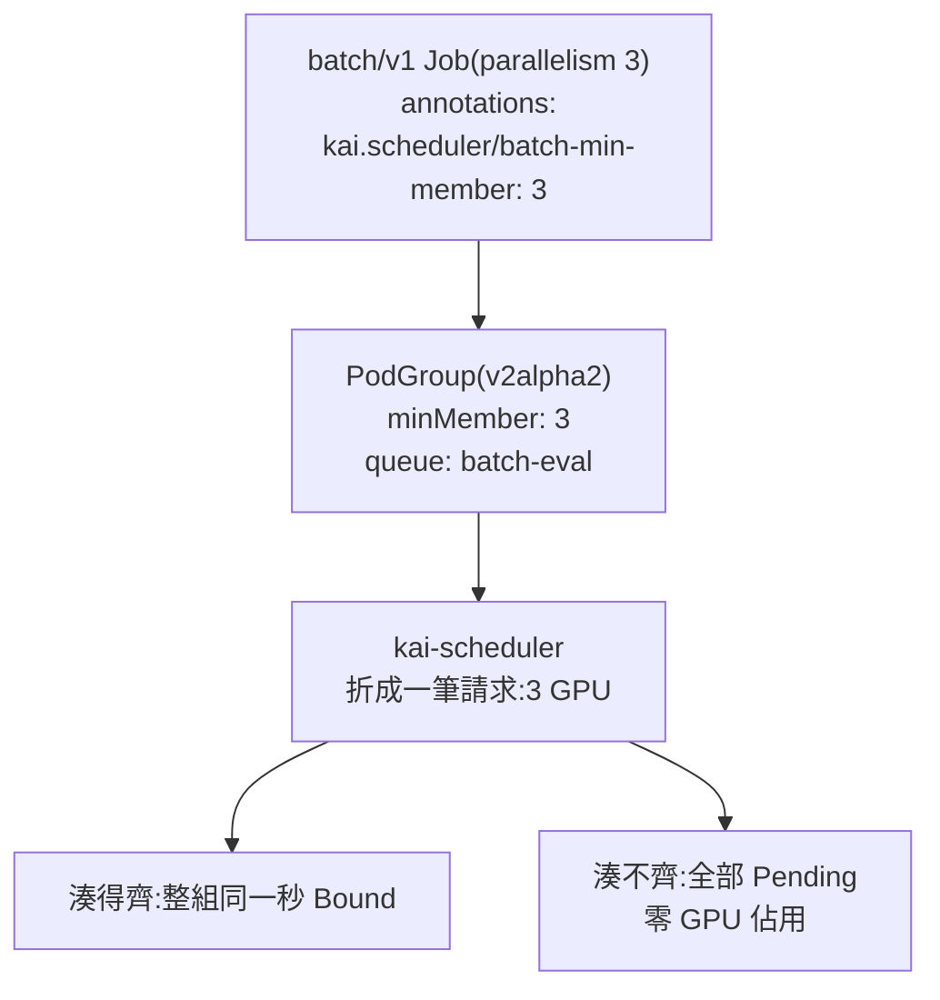
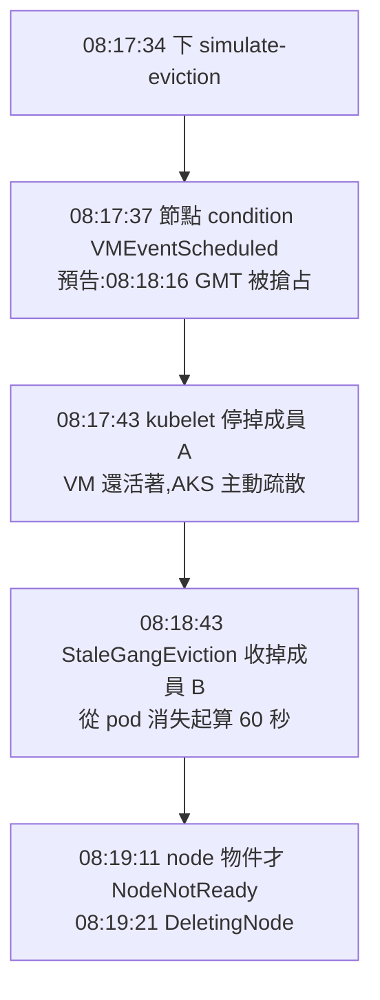

# Day 2: Gang Scheduling——一組 pod 的整組排程、搶占與 spot 回收

{ align=right width="100" }

> Day 1 收尾留了一道題:佇列和搶占處理的都是單顆 pod,但訓練工作不是單顆 pod——它是一組,缺一個都開不了工。今天就把這道題放上叢集:一份需要 3 顆 pod 的訓練工作,丟進只有 2 張卡的環境,先用預設排程器跑一次、看問題出在哪,再用 KAI 跑一次、比較差在哪裡。照著做的路上有幾顆雷,最陰的一顆長這樣:畫面上一切正常、沒有任何錯誤,但你以為有的保護,其實從頭到尾都沒生效。

!!! abstract "你在課程的哪裡"
    - **Day 1**:KAI 已就緒,佇列、quota 與兩套優先權的心智模型建好了。
    - **今天**:gang scheduling 的正反兩面。驗收:三缺一時全 Pending 且實體卡零佔用、搶占時整組同進退,外加一場親手觸發的 spot 回收時間軸。
    - **Day 3**:離開排程層,把一張卡真的切開。

## 原理與架構

Day 1 的 queue 與 priority 回答的是「兩個工作搶同一張卡,誰先拿到」。今天換一個維度:**一個工作需要 N 張卡才有意義,拿到 N-1 張等於零**。

分散式訓練的每一步都要在所有 worker 之間做一次 all-reduce,少一個 worker,集合通訊就湊不齊,整個 job 一步都跑不動。把這種工作交給「一顆一顆各排各的」排程器,結果是**半啟動死鎖**:前幾顆搶到卡、跑起來、卡在等待同伴,最後一顆永遠等不到資源。此時那幾張卡處於最糟的狀態——被佔著、有 pod 在上面、但對誰都沒有產出,包括佔著它的人。

這個問題的解法叫 **gang scheduling**——gang 字面上就是「一夥人」,意思是把 N 顆 pod 當一夥看待:湊得齊就一起上,湊不齊就全部退出、把卡還給別人,不留任何一顆單獨佔資源。**資源利用率反而更高**,因為那幾張卡至少能被別的工作用掉。

### 怎麼把一組 pod 宣告成 gang

KAI 的載體是 `PodGroup`,關鍵欄位是 `minMember`——低於這個數字就不排,也不留:



送 workload 之前先確認欄位——直接查就有,不必靠記憶:

```console
$ kubectl explain podgroup.spec --recursive
GROUP:      scheduling.run.ai
KIND:       PodGroup
VERSION:    v2alpha2

FIELD: spec <Object>

FIELDS:
  markUnschedulable	<boolean>
  minMember	<integer>
  minSubGroup	<integer>
  preemptibility	<string>
  enum: preemptible, non-preemptible
  priorityClassName	<string>
  queue	<string>
  schedulingBackoff	<integer>
  subGroups	<[]Object>
```

PodGroup 是 **`v2alpha2`**,而 Day 1 建立佇列時用的 Queue 是 **`v2`**——同一個 API group `scheduling.run.ai` 底下,兩個 kind 的版本並不同步。Day 1 步驟 3 清點元件時就看過 CRD 分屬 `scheduling.run.ai` 與 `kai.scheduler` 兩個 group;這裡再多一層:連同一個 group 內的版本也要個別確認。

### 組出一個 gang 的三種寫法

| 方式 | 怎麼寫 | 適用 |
|---|---|---|
| 隱式(預設) | 送 `batch/v1` Job,由 `pod-grouper` 自動產生 PodGroup | 最常見——但**預設不給原子性**,見[地雷 1](#mine-1) |
| `batch-min-member` 標註 | Job 資源上加 `kai.scheduler/batch-min-member: "N"` | 要「至少 N 個一起跑」,本章主線 |
| 外部 PodGroup | 自建 PodGroup + pod 標註 `pod-group-name`、`kai.scheduler/skip-podgrouper: "true"` | 多個 workload 併入同一組,或由外部 controller 管生命週期 |

### gang 不是一個開關,是四件事一起運作

排程器的 action 順序決定了後面每一則事件該怎麼判讀:

```console
$ kubectl -n kai-scheduler get cm kai-scheduler-default -o jsonpath='{.data.config\.yaml}'
actions: allocate, consolidation, reclaim, preempt, stalegangeviction
...
scenarioSearchBudgets:
  maxGeneratorSearchDuration:
    MultiNodeGang: 2m0s
    NodeLocalGreedy: 30s
tiers:
- plugins:
  ...
  - name: sg-nodelocalgreedy
  - name: sg-multinodegang
```

湊齊整組的邏輯由兩個 **scenario generator** plugin 撐起來:`sg-nodelocalgreedy`(先試單節點塞得下的貪婪解,預算 30 秒)與 `sg-multinodegang`(跨節點湊齊,預算 2 分鐘)。而 `stalegangeviction` 排在第五個 action——「組破了要收掉」是每輪排程週期的常規檢查,不是例外處理路徑。

那「破了多久才收」是多久?寬限期的預設值寫在原始碼(`cmd/scheduler/app/options/options.go`):

```go
defaultStalenessGracePeriod = 60 * time.Second
```

本叢集的 ConfigMap 沒有覆寫 `globalDefaultStalenessGracePeriod`,吃的就是這 60 秒。這給了後面一個**可證偽的預測**:手動殺掉一個成員之後,若 KAI 真的做整組收斂,動作應該在約 60 秒後發生,而不是立刻。負值代表永不驅逐——那是「寧可半殘也不要重跑」的生產選項。

### 今天要走的路

在同一組 2×T4 的叢集上跑四場演練:**湊不齊**(3 個成員搶 2 張卡)、**湊得齊**(2 個成員剛好吃滿)、**拆散 gang**(手動殺一顆、以及被搶占)、**對照組**(同樣的需求交給 default kube-scheduler)。最後用 `az vmss simulate-eviction` 模擬一次 Azure spot 回收,看真實的節點消失如何觸發同一條收斂路徑。

環境沿用 Day 1:AKS `<cluster>`(K8s v1.35.6)、KAI Scheduler v0.16.8、`gpuspot` pool 兩台 `Standard_NC4as_T4_v3`(各 1 張 T4)、佇列 `cnp-root` 底下 `inference-prod`(priority 200)與 `batch-eval`(priority 100),workload 全部丟在 `kai-lab` namespace。

## 步驟

### 步驟 1:送一個湊不齊的 gang——先確認它真的是 gang

最直覺的寫法是一個 `batch/v1` Job,`parallelism: 3`、`schedulerName: kai-scheduler`、掛好佇列標籤,不加任何額外標註,期待 `pod-grouper` 依 `parallelism` 產生 `minMember: 3`:

```bash
cat > 02-gang3-job.yaml <<'EOF'
apiVersion: batch/v1
kind: Job
metadata:
  name: gang3
  namespace: kai-lab
spec:
  parallelism: 3
  completions: 3
  backoffLimit: 0
  template:
    metadata:
      labels:
        kai.scheduler/queue: batch-eval
        priorityClassName: train
    spec:
      schedulerName: kai-scheduler
      restartPolicy: Never
      tolerations:
        - key: kubernetes.azure.com/scalesetpriority
          operator: Equal
          value: spot
          effect: NoSchedule
      containers:
        - name: main
          image: nvcr.io/nvidia/cuda:12.4.1-base-ubuntu22.04
          command: ["bash", "-c"]
          args: ["trap 'exit 0' TERM; nvidia-smi -L; sleep infinity & wait"]
          resources:
            limits:
              nvidia.com/gpu: "1"
EOF
```

```console
$ kubectl apply -f 02-gang3-job.yaml
$ kubectl -n kai-lab get pods -o wide
NAME          READY   STATUS    RESTARTS   AGE   NODE
gang3-5mvdw   1/1     Running   0          25s   aks-gpuspot-21249019-vmss000006
gang3-b5mgg   1/1     Running   0          25s   aks-gpuspot-21249019-vmss000007
gang3-fzwls   0/1     Pending   0          25s   <none>
```

2 個跑起來、1 個 Pending——這正是 gang scheduling 要消滅的半啟動死鎖,而且它是**在裝了 KAI 的叢集上**發生的。原因不在資源,在 PodGroup:

```console
$ kubectl -n kai-lab get podgroups -o json \
    | jq -c '.items[]|{name:.metadata.name,minMember:.spec.minMember,status:.status}'
{"name":"pg-gang3-d1c60636-...","minMember":1,
 "status":{"resourcesStatus":{"allocated":{"nvidia.com/gpu":"2"},"requested":{"nvidia.com/gpu":"3"}}}}
```

`minMember: 1`。完整的診斷與修法見[地雷 1](#mine-1);結論是 gang 的開關要明寫在 Job 上——把上面那份複製成 `02b-gang3-minmember-job.yaml`,在 **Job 自己的 `metadata`**(不是 pod template 的那個)補上標註:

```yaml
metadata:
  name: gang3
  namespace: kai-lab
  annotations:
    kai.scheduler/batch-min-member: "3"
```

只差這兩行,行為完全換一個樣子:

```console
$ kubectl -n kai-lab delete job gang3
$ kubectl apply -f 02b-gang3-minmember-job.yaml
$ kubectl -n kai-lab get pods -o wide
NAME          READY   STATUS    RESTARTS   AGE   NODE
gang3-7z29z   0/1     Pending   0          30s   <none>
gang3-8wtjf   0/1     Pending   0          30s   <none>
gang3-8zjvx   0/1     Pending   0          30s   <none>
```

三顆全部 Pending。PodGroup 的狀態把理由講得很完整:

```console
$ kubectl -n kai-lab get podgroups -o json | jq -c '.items[].status'
{"resourcesStatus":{"requested":{"nvidia.com/gpu":"3"}},
 "schedulingConditions":[{
   "reason":"Unschedulable","type":"UnschedulableOnNodePool","status":"True",
   "message":"PodSchedulingErrors: Resources were found for 2 pods while 3 are required for gang scheduling. Additional pods cannot be scheduled due to: no nodes with enough resources were found: 3 node(s) didn't have enough resources: GPUs.."}]}
```

兩個訊號要記住。第一,訊息直接點名 gang——「Resources were found for 2 pods while 3 are required for gang scheduling」:KAI 知道自己找得到 2 張卡,就是因為湊不到 3 才一顆都不放。第二,`resourcesStatus` 裡**只有 `requested: 3`,沒有 `allocated` 欄位**;對照剛才沒有 gang 時的 `allocated: 2`,這一欄的有無就是「有沒有佔卡」最快的訊號。

### 步驟 2:證明「零佔用」不是記帳好看,是卡真的空著

PodGroup 沒有 `allocated` 只是 KAI 自己的帳。要證明**實體 GPU 沒被鎖住**,就在 gang 卡住期間送一顆同佇列、同優先權、只要 1 張卡的無關 pod 進去插隊:

```bash
cat > 03-prober-pod.yaml <<'EOF'
apiVersion: v1
kind: Pod
metadata:
  name: gang-prober
  namespace: kai-lab
  labels:
    kai.scheduler/queue: batch-eval
    priorityClassName: train
spec:
  schedulerName: kai-scheduler
  restartPolicy: Never
  tolerations:
    - key: kubernetes.azure.com/scalesetpriority
      operator: Equal
      value: spot
      effect: NoSchedule
  containers:
    - name: main
      image: nvcr.io/nvidia/cuda:12.4.1-base-ubuntu22.04
      command: ["bash", "-c"]
      args: ["trap 'exit 0' TERM; nvidia-smi -L; sleep infinity & wait"]
      resources:
        limits:
          nvidia.com/gpu: "1"
EOF
```

```console
$ kubectl apply -f 03-prober-pod.yaml
$ kubectl -n kai-lab get pods -o wide
NAME          READY   STATUS    RESTARTS   AGE   NODE
gang-prober   1/1     Running   0          26s   aks-gpuspot-21249019-vmss000006
gang3-7z29z   0/1     Pending   0          66s   <none>
gang3-8wtjf   0/1     Pending   0          66s   <none>
gang3-8zjvx   0/1     Pending   0          66s   <none>
```

再從叢集角度清點誰真的握著 GPU:

```console
$ kubectl get pods -A -o json | jq -r '.items[]
    | select(.spec.nodeName!=null)
    | select([.spec.containers[].resources.limits["nvidia.com/gpu"]//empty]|length>0)
    | "\(.metadata.namespace)/\(.metadata.name)  node=\(.spec.nodeName)  phase=\(.status.phase)"'
kai-lab/gang-prober  node=aks-gpuspot-21249019-vmss000006  phase=Running
```

整個叢集只有探針 pod 一個 GPU 持有者。三個 gang 成員等了 66 秒,一張卡都沒碰——這就是 gang 換來的東西:與其讓 2 個成員佔著卡空轉等第 3 個,不如全部退出讓路。

排程器日誌則說明了它把這一組當成什麼:

```console
$ kubectl -n kai-scheduler logs deploy/kai-scheduler-default --since=110s | grep -iE "gang|pg-gang3"
allocate/allocate.go:84       Attempting to allocate job: <kai-lab/pg-gang3-d62ca3dd-...> of queue <Batch Eval>, resources: <[0 0 3 3 0 0 0]>
allocate/allocate.go:89       Could not allocate resources for job: <kai-lab/pg-gang3-d62ca3dd-...> of queue <batch-eval>
consolidation/consolidation.go:98   Attempting to consolidate running jobs in order to make room for job: <kai-lab/pg-gang3-d62ca3dd-...>
consolidation/consolidation.go:102  Can't consolidate for job: <kai-lab/pg-gang3-d62ca3dd-...>, not enough allocatable GPUs in the cluster
preempt/preempt.go:117        Attempting to preempt for job: <kai-lab/pg-gang3-d62ca3dd-...>, priority: <50>, queue: <batch-eval>, resources: <[0 0 3 3 0 0 0]>
preempt/preempt.go:105        Didn't find a preemption strategy for job <kai-lab/pg-gang3-d62ca3dd-...>
stalegangeviction/stalegangeviction.go:30  Enter StaleGangEviction ...
```

請求量印成 `resources: <[0 0 3 3 0 0 0]>`——**3 是整組的總和,不是單顆 pod 的 1**。從 allocate 到 preempt,排程器全程把它當成「一個要 3 GPU 的 job」處理,這就是 gang 的實作本質:把 N 顆 pod 摺疊成一筆不可分割的資源請求。另外每一輪都完整跑完五個 action,即使明知湊不齊也每秒重試一次。

### 步驟 3:湊得齊的時候,整組是同一秒上去的

把 gang 縮成 2 個成員(同樣帶 `kai.scheduler/batch-min-member: "2"`),剛好等於叢集的兩張 T4:

```bash
cat > 04-gang2-job.yaml <<'EOF'
apiVersion: batch/v1
kind: Job
metadata:
  name: gang2
  namespace: kai-lab
  annotations:
    kai.scheduler/batch-min-member: "2"
spec:
  parallelism: 2
  completions: 2
  backoffLimit: 0
  template:
    metadata:
      labels:
        kai.scheduler/queue: batch-eval
        priorityClassName: train
    spec:
      schedulerName: kai-scheduler
      restartPolicy: Never
      tolerations:
        - key: kubernetes.azure.com/scalesetpriority
          operator: Equal
          value: spot
          effect: NoSchedule
      containers:
        - name: main
          image: nvcr.io/nvidia/cuda:12.4.1-base-ubuntu22.04
          command: ["bash", "-c"]
          args: ["trap 'exit 0' TERM; nvidia-smi -L; sleep infinity & wait"]
          resources:
            limits:
              nvidia.com/gpu: "1"
EOF
```

```console
$ kubectl -n kai-lab delete job gang3
$ kubectl apply -f 04-gang2-job.yaml
$ kubectl -n kai-lab get pods -o wide
NAME          READY   STATUS    NODE
gang2-8n57n   1/1     Running   aks-gpuspot-21249019-vmss000006
gang2-d4psb   1/1     Running   aks-gpuspot-21249019-vmss000007
```

事件的秒數比 pod 列表更有資訊量。把 events 依 `lastTimestamp` 排序、取時間/物件/原因/來源四欄(篩法同 Day 1 用過的 `-o custom-columns` 寫法;事件時間為 UTC,`08:xx` 對應台灣時間 `16:xx`):

```console
08:04:25Z  gang2         SuccessfulCreate  job-controller
08:04:25Z  gang2         SuccessfulCreate  job-controller
08:04:26Z  gang2-d4psb   Scheduled         kai-scheduler
08:04:26Z  gang2-8n57n   Scheduled         kai-scheduler
08:04:26Z  gang2-d4psb   Bound             binder
08:04:26Z  gang2-8n57n   Bound             binder
08:04:27Z  gang2-d4psb   Started           kubelet
08:04:27Z  gang2-8n57n   Started           kubelet
```

兩顆的 `Scheduled` 與 `Bound` 落在**同一秒**,不是一前一後。gang 滿足時的排程是一次爆發:KAI 先在記憶體裡把整組的放置方案算完,確定兩個位置都有著落,才一起送出綁定。所以 PodGroup 的 `allocated` 是從「不存在」直接跳到 `2`,中間沒有 `1` 這個狀態。

### 步驟 4:拆散 gang——手動殺掉一個成員

兩顆正在跑,用 `--force --grace-period=0` 硬砍其中一顆(模擬節點失聯或 pod 意外死亡),看倖存者的命運:

```console
$ VICTIM=$(kubectl -n kai-lab get pods --no-headers -o custom-columns=':.metadata.name' | head -1)
$ kubectl -n kai-lab delete pod $VICTIM --force --grace-period=0
```

每 10 秒取樣一次 pod 與 PodGroup:

```text
--- t+10s 16:05:42 ---  gang2-d4psb 1/1 Running   {"mm":2,"alloc":{"nvidia.com/gpu":"1"},"req":{"nvidia.com/gpu":"1"}}
--- t+30s 16:06:04 ---  gang2-d4psb 1/1 Running   {"mm":2,"alloc":{"nvidia.com/gpu":"1"},"req":{"nvidia.com/gpu":"1"}}
--- t+50s 16:06:25 ---  gang2-d4psb 1/1 Running   {"mm":2,"alloc":{"nvidia.com/gpu":"1"},"req":{"nvidia.com/gpu":"1"}}
--- t+60s 16:06:35 ---  No resources found        {"mm":2,"alloc":null,"req":null}
```

```text
08:05:32Z  gang2-8n57n   Killing    kubelet         Stopping container main
08:05:57Z  pg-gang2-...  StaleJob   kai-scheduler   Job is stale. 1 pods are active, minMember is 2
08:06:32Z  gang2-d4psb   Killing    kubelet         Stopping container main
08:06:33Z  gang2         Completed  job-controller  Job completed

2026-08-03T08:06:32.680Z  INFO  stalegangeviction/stalegangeviction.go:80
  Evicted task: <kai-lab/gang2-d4psb> due its job being a stale job, its status: <Releasing>
```

原始碼推出的 60 秒預測完全命中:成員在 08:05:32 消失,倖存者在 08:06:32 被驅逐,剛好 60.0 秒。中間 KAI 先發 `StaleJob` 事件公告「1 pods are active, minMember is 2」,等滿寬限期才動手。這 60 秒是刻意留給短暫抖動(pod 重啟、節點瞬斷)的自癒空間——成員在 60 秒內回來,整組就不會被收掉。

KAI 的立場是**不容忍部分存活**:組破了就整組回收,把卡全部還出來。對分散式訓練這是正確的,少一個 worker 的 job 本來就跑不完,留著只是佔卡空轉。不過最後一行 `Job completed` 是個陷阱——被驅逐的 gang,Job controller 竟然當成正常完成,詳見[地雷 2](#mine-2)。

### 步驟 5:拆散 gang——搶占者只要一張卡

重新拉起 gang2 佔滿兩張卡,然後送一顆同佇列(`batch-eval`)、`inference`(125,不可被搶占)、**只要 1 張卡**的搶占者。搶占者就是探針 pod 換個名字、換個優先權:

```bash
sed -e 's/gang-prober/gang-preemptor/' \
    -e 's/priorityClassName: train/priorityClassName: inference/' \
    03-prober-pod.yaml > 05-gang-preemptor-inference.yaml
```

```console
$ kubectl apply -f 04-gang2-job.yaml
$ kubectl apply -f 05-gang-preemptor-inference.yaml
$ kubectl -n kai-lab get pods -o wide
NAME             READY   STATUS    NODE
gang-preemptor   1/1     Running   aks-gpuspot-21249019-vmss000006
```

10 秒後整個 gang 消失了,只剩搶占者:

```text
08:09:05Z  pg-gang2-5a370b1d-...  Evict  kai-scheduler
  Pod kai-lab/gang2-x9vkj was preempted by higher priority workload kai-lab/pg-gang-preemptor-c746b6fc-...
08:09:05Z  pg-gang2-5a370b1d-...  Evict  kai-scheduler
  Pod kai-lab/gang2-7bpkp was preempted by higher priority workload kai-lab/pg-gang-preemptor-c746b6fc-...
08:09:05Z  gang-preemptor  Pipelined  kai-scheduler
08:09:06Z  gang-preemptor  Bound      binder
```

兩則 `Evict` 在**同一秒**發出,訊息都是 `was preempted by higher priority workload`——這是 preempt action 幹的,不是 StaleGangEviction(若是後者要等 60 秒,訊息也會是 stale job)。也就是說 KAI 挑受害者時,**直接把整個 PodGroup 當成一個不可分割的受害單位**,而不是先殺一顆、再讓它因為缺員被 stale 收掉。搶 1 張卡賠掉整組的代價與規避方式,見[地雷 3](#mine-3)。

### 步驟 6:同樣的需求交給 default kube-scheduler

「為什麼不用預設排程器就好」這個問題,值得用完全相同的資源需求跑一次對照。拿掉 `schedulerName`、拿掉佇列標籤,其餘與步驟 1 相同:

```bash
cat > 06-default-sched-3pods.yaml <<'EOF'
apiVersion: batch/v1
kind: Job
metadata:
  name: nogang3
  namespace: kai-lab
spec:
  parallelism: 3
  completions: 3
  backoffLimit: 0
  template:
    spec:
      restartPolicy: Never
      tolerations:
        - key: kubernetes.azure.com/scalesetpriority
          operator: Equal
          value: spot
          effect: NoSchedule
      containers:
        - name: main
          image: nvcr.io/nvidia/cuda:12.4.1-base-ubuntu22.04
          command: ["bash", "-c"]
          args: ["trap 'exit 0' TERM; nvidia-smi -L; sleep infinity & wait"]
          resources:
            limits:
              nvidia.com/gpu: "1"
EOF
```

```console
$ kubectl apply -f 06-default-sched-3pods.yaml
$ kubectl -n kai-lab get pods -o wide
nogang3-jftr6 0/1 Pending  <none>
nogang3-pbcq4 1/1 Running  aks-gpuspot-21249019-vmss000007
nogang3-zd8fs 1/1 Running  aks-gpuspot-21249019-vmss000006
```

2 跑 + 1 卡住,兩張 T4 被佔住不放,直到有人手動介入。default-scheduler 給的理由是:

```text
FailedScheduling  0/3 nodes are available: 3 Insufficient nvidia.com/gpu.
  no new claims to deallocate, preemption: 0/3 nodes are available:
  1 Preemption is not helpful for scheduling, 2 No preemption victims found for incoming pod.
```

這段訊息**只講這一顆 pod 的處境**——沒有節點有足夠 GPU。它不知道還有兩顆兄弟 pod 正佔著卡,更不知道三顆是一個整體。KAI 的訊息則會把整組的缺口講出來。

還有一個容易被忽略的副作用:

```console
$ kubectl -n kai-lab get podgroups
No resources found in kai-lab namespace.
$ kubectl get queue batch-eval -o json | jq -c '.status'
{}
```

`pod-grouper` 沒有為這些 pod 建立 PodGroup,`batch-eval` 佇列的 `status` 是空物件——**KAI 的配額帳本完全看不到這 2 張已被吃掉的卡**。兩個排程器並存的叢集,KAI 的 queue 統計會低估實際用量,規劃 quota 時要把這塊盲區算進去。

搶占的部分也跑一次對照。刻意沿用 KAI 帶進來的 `train`(50)與 `inference`(125)兩個 PriorityClass——它們本來就是標準 K8s 物件,`preemptionPolicy: PreemptLowerPriority`,default-scheduler 認得:

兩顆受害者先把兩張 T4 佔滿,製造零空閒。注意優先權寫在 `spec.priorityClassName`,不是前面 KAI 那套 label:

```bash
cat > 07-default-sched-victim-train.yaml <<'EOF'
apiVersion: v1
kind: Pod
metadata:
  name: nogang-victim-1
  namespace: kai-lab
spec:
  # kube-scheduler only reads spec.priorityClassName, never KAI's label convention
  priorityClassName: train
  restartPolicy: Never
  tolerations:
    - key: kubernetes.azure.com/scalesetpriority
      operator: Equal
      value: spot
      effect: NoSchedule
  containers:
    - name: main
      image: nvcr.io/nvidia/cuda:12.4.1-base-ubuntu22.04
      command: ["bash", "-c"]
      args: ["trap 'exit 0' TERM; nvidia-smi -L; sleep infinity & wait"]
      resources:
        limits:
          nvidia.com/gpu: "1"
---
apiVersion: v1
kind: Pod
metadata:
  name: nogang-victim-2
  namespace: kai-lab
spec:
  priorityClassName: train
  restartPolicy: Never
  tolerations:
    - key: kubernetes.azure.com/scalesetpriority
      operator: Equal
      value: spot
      effect: NoSchedule
  containers:
    - name: main
      image: nvcr.io/nvidia/cuda:12.4.1-base-ubuntu22.04
      command: ["bash", "-c"]
      args: ["trap 'exit 0' TERM; nvidia-smi -L; sleep infinity & wait"]
      resources:
        limits:
          nvidia.com/gpu: "1"
EOF
```

搶占者是同一份規格的單顆 pod,只改名字與優先權:

```bash
sed -e '/^---$/,$d' -e 's/nogang-victim-1/nogang-preemptor/' \
    -e 's/priorityClassName: train/priorityClassName: inference/' \
    07-default-sched-victim-train.yaml > 08-default-sched-preemptor-inference.yaml
```

```console
$ kubectl apply -f 07-default-sched-victim-train.yaml
$ kubectl apply -f 08-default-sched-preemptor-inference.yaml
$ kubectl -n kai-lab get pods -o wide
nogang-preemptor 1/1 Running aks-gpuspot-21249019-vmss000007
nogang-victim-2  1/1 Running aks-gpuspot-21249019-vmss000006
```

```text
nogang-victim-1   Preempted  Preempted by pod d330a2f9-... on node aks-gpuspot-21249019-vmss000007
08:13:34Z  nogang-victim-1   Killing  kubelet  Stopping container main
08:13:35Z  nogang-preemptor  Started  kubelet
```

原生搶占正常運作,而且**只殺一顆**(victim-1 死、victim-2 活)。這正是與步驟 5 的關鍵對照:同樣是「搶 1 張卡」,default-scheduler 的受害者是單顆 pod、傷害最小,KAI 面對 gang 時收掉整組。另外 `Preempted` 事件把搶占者印成 UID 而不是名字,事後追查要多一步反查;KAI 的訊息則直接給 workload 名稱。

受害者 08:13:34 收到 `Killing`、搶占者 08:13:35 就 `Started`,**只花 1 秒**——Day 1 地雷 6 記錄的 31 秒空窗來自受害者沒有攔 `SIGTERM`、硬吃滿 30 秒寬限期;本日所有 pod 都寫了 `trap 'exit 0' TERM`,寬限期完全沒有發生。那個修法有效,代價是[地雷 2](#mine-2)。

把跑過的項目整理成對照表:

| 面向 | KAI Scheduler v0.16.8 | default kube-scheduler |
|---|---|---|
| 3 顆要 3 卡、只有 2 卡 | 加 `batch-min-member` 後三顆全 Pending、**零 GPU 佔用**,別的工作可用卡 | 2 跑 + 1 Pending,兩張卡被鎖住空轉 |
| gang 的預設行為 | **預設沒有**:裸 Job 的 PodGroup 是 `minMember: 1`,要明寫標註 | 無此概念 |
| 搶占受害者粒度 | 受害者是 **PodGroup(整組)**——搶 1 卡讓 2 成員 gang 全數被驅逐 | 受害者是**單顆 pod**——搶 1 卡只殺 1 顆 |
| 缺員後的處理 | `StaleGangEviction`:成員掉了 60 秒內沒回來就整組收掉 | 無。剩下的 pod 繼續佔著卡 |
| 排程器看到的單位 | 一個 job 一筆請求(`resources: <[0 0 3 3 0 0 0]>`,3 是整組總和) | 一顆 pod 一筆請求,彼此無關 |
| 失敗訊息的資訊量 | 點名 gang 與缺口:「Resources were found for 2 pods while 3 are required for gang scheduling」 | 只講單顆處境:「3 Insufficient nvidia.com/gpu」 |
| 混用時的帳 | 只記帳走 KAI 的 pod;default-scheduler 吃掉的卡在 queue `status` 中看不到 | —— |

上表只涵蓋本章實際跑過的項目。沒有測的不寫:default-scheduler 的 `PodDisruptionBudget` 與 `nodeAffinity` 進階場景、K8s SIG 的 Coscheduling plugin,以及 KAI 的 GPU sharing、多節點拓撲、`subGroups`。

### 步驟 7:讓 Azure 真的收走一台 spot 節點

前面的缺員是手動製造的。spot 節點被雲端商回收是**真實的**缺員來源,而整場 lab 都跑在 spot GPU 上。Azure 提供 `az vmss simulate-eviction` 可以隨時製造一次,不必等運氣。

AKS 的節點實體落在受管 resource group(`MC_<rg>_<cluster>_<region>`),先對出 VMSS 與實例編號:

```console
$ az vmss list -g MC_<resource-group>_<cluster>_japaneast \
    --subscription <subscription-id> \
    --query '[].{name:name,sku:sku.name,capacity:sku.capacity,priority:virtualMachineProfile.priority}' -o json
[
  {"capacity": 2, "name": "aks-gpuspot-21249019-vmss", "priority": "Spot", "sku": "Standard_NC4as_T4_v3"},
  {"capacity": 1, "name": "aks-system-35459509-vmss", "priority": null, "sku": "Standard_D2as_v5"}
]

$ az vmss list-instances -g MC_<resource-group>_<cluster>_japaneast \
    -n aks-gpuspot-21249019-vmss --subscription <subscription-id> \
    --query '[].{id:instanceId,name:osProfile.computerName}' -o json
[{"id": "6", "name": "aks-gpuspot-21249019-vmss000006"},
 {"id": "7", "name": "aks-gpuspot-21249019-vmss000007"}]
```

`virtualMachineProfile.priority: "Spot"` 是判斷 spot pool 最直接的欄位;instance id 與節點名稱尾碼一致,要打哪台可以直接對照,不必猜。

兩成員 gang 正在跑,砍掉其中一台的底層 VM:

```console
$ az vmss simulate-eviction \
    -g MC_<resource-group>_<cluster>_japaneast \
    -n aks-gpuspot-21249019-vmss --instance-id 6 \
    --subscription <subscription-id>
```

指令無輸出、立即返回。接下來的兩分鐘,四個系統依序動作:



節點 condition 的原文:

```text
2026-08-03T08:17:37Z  aks-gpuspot-21249019-vmss000006  VMEventScheduled
  Node condition VMEventScheduled is now: True, reason: VMEventScheduled,
  message: "Preempt Scheduled: Mon, 03 Aug 2026 08:18:16 GMT. DurationInSeconds: -1.
  For more information, see https://aka.ms/aks/scheduledevents EventId: 218E4ED7-..."
```

三層結論,順序很重要:

**Azure 有預告,而且 AKS 不會乾等。** 從 `VMEventScheduled`(08:17:37)到實際被搶占(08:18:16)有 **39 秒**預告期;AKS 收到 scheduled event 後 6 秒(08:17:43)就讓 kubelet 開始停容器。pod 是在 VM 還活著時被主動疏散的,不是隨 VM 一起被強制終止。這段時間就是 spot workload 寫 checkpoint 的**全部預算**。

**KAI 的 60 秒時鐘從「pod 消失」起算,不是從「節點消失」起算。** 成員在 08:17:43 沒了,倖存者在 08:18:43 被收掉,又是精準的 60 秒,與手動殺 pod 完全一致。KAI 對節點層級的故障沒有特殊處理路徑,它只看 PodGroup 的成員數——行為因此很好預測。

**節點物件比 VM 晚死很久。** VM 08:18:16 被搶占,K8s 的 node 物件到 08:19:11 才 `NotReady`、08:19:21 才被移除,落後將近 1 分鐘。這段期間 `kubectl get nodes` 仍顯示 `Ready`。**用 node Ready 狀態判斷 spot 節點還在不在,會慢一整分鐘**;要即時反應得盯 `VMEventScheduled` 這個 node condition。

節點沒了之後,pool 也沒有自己補回來:

```console
$ az aks nodepool show -g <resource-group> --cluster-name <cluster> -n gpuspot \
    --subscription <subscription-id> --query '{count:count,provisioningState:provisioningState}' -o json
{"count": 1, "provisioningState": "Succeeded"}
```

觀察超過 3 分鐘,`count` 停在 1 且狀態是 `Succeeded`——Azure 認為這就是穩定狀態。叢集就這樣少了一半 GPU,沒有任何告警,原因與修法見[地雷 4](#mine-4)。手動補回去的那道指令,還帶出了本章最後一顆雷([地雷 5](#mine-5)):兩個操作者對同一個 node pool 各下各的期望值時會發生什麼。

把 spot 與 gang 疊在一起,風險是**相乘不是相加**:任何一台被回收,整組就在 60 秒後被回收;pool 又不會自癒,於是重跑時可能連湊齊 `minMember` 的節點數都沒有,直接卡在 Pending。要在 spot 上跑分散式訓練,三件事缺一不可——**開 cluster autoscaler**、**39 秒內寫得完 checkpoint**、**gang 大小留餘裕**(別讓 `minMember` 剛好等於全部節點數)。

### 步驟 8:收尾

刪掉測試 workload、佇列與 namespace,KAI 保留安裝(Day 3–4 的 HAMi 實驗接著用)。佇列用的是 [Day 1 步驟 4](sprint1-day1-kai-queue-basics.md) 那份 `01-queues.yaml`,內容原封不動:

```console
$ kubectl -n kai-lab delete job --all
$ kubectl delete -f 01-queues.yaml
$ kubectl delete namespace kai-lab
job.batch "gang2" deleted
queue.scheduling.run.ai "cnp-root" deleted
queue.scheduling.run.ai "inference-prod" deleted
queue.scheduling.run.ai "batch-eval" deleted
namespace "kai-lab" deleted
```

GPU pool 照 Day 0 的紀律縮回 0(指令同 Day 0 步驟 8)。本日模擬回收又補過節點,縮容後更要回查 `count` 確認最終狀態,別只看指令的回傳值——理由見[地雷 5](#mine-5)。

## 驗收 checkpoint

| 檢查項 | 指令 | 期待結果 |
|---|---|---|
| PodGroup 真的有 gang | `kubectl -n kai-lab get podgroups -o json \| jq '.items[].spec.minMember'` | 等於成員數,**不是 1** |
| 湊不齊時零佔用 | 全叢集清點 `nvidia.com/gpu` 持有者 | 只有探針 pod,gang 成員一顆都不在 |
| 湊得齊時整組同時上 | `kubectl -n kai-lab get events` | 兩顆的 `Scheduled` 與 `Bound` 落在同一秒 |
| 缺員回收準時 | 砍一個成員後每 10 秒取樣 | 第 60 秒倖存者被驅逐,`allocated` 變 null |
| 搶占粒度 | 送 1 張卡的 `inference` 搶占者 | 兩則 `Evict` 同一秒,整個 PodGroup 消失 |
| 對照組失效模式 | 同需求交給 `default-scheduler` | 2 Running + 1 Pending,兩張卡鎖住 |
| spot 預告時間 | 節點 condition `VMEventScheduled` | 有 `Preempt Scheduled` 時間戳,約 39 秒後生效 |
| pool 會不會自癒 | `az aks nodepool show --query count` | 回收後停在 1——不會自己補 |

## 地雷記錄

### 地雷 1:裝了 KAI、Job 寫了 `parallelism: 3`,卻完全沒有 gang scheduling {#mine-1}

**症狀**:`batch/v1` Job 設 `parallelism: 3`、`schedulerName: kai-scheduler`、掛好佇列標籤,送上去卻是 2 個 Running + 1 個 Pending——半啟動死鎖照樣發生,跟沒裝 KAI 一模一樣。

**根因**:`pod-grouper` 對**裸 Job 的預設是 `minMember: 1`**,不是 `parallelism`。KAI 只把 Job 的 pod 歸進同一個 PodGroup 方便記帳,預設並不賦予原子性。PyTorchJob、JobSet 這類本身就帶「幾個 worker」語意的 CRD 才會自動推導出 gang;`batch/v1` Job 沒有這個語意。答案其實寫在官方 `docs/batch/README.md` 的第一段——「will be scheduled **separately**」——只是很容易讀過去。

**驗證法**:不要看 pod 跑不跑得起來,直接查 PodGroup:

```console
$ kubectl -n kai-lab get podgroups -o json | jq '.items[].spec.minMember'
```

這個數字是 1 就代表沒有 gang,不管 Job 寫了多少 `parallelism`。

**修法**:在 Job 的 `metadata.annotations` 加 `kai.scheduler/batch-min-member: "3"`——下在 **Job 資源本身**,不是 pod template。

### 地雷 2:被驅逐的 gang,Job 卻回報「成功完成」 {#mine-2}

**症狀**:整組被 StaleGangEviction 收掉之後,`kubectl get job` 顯示 `succeeded: 2`、condition `Complete / CompletionsReached`、事件是 `Job completed`。從 Job 的角度看,這是一次圓滿的執行——真正的工作一秒都沒做完。

**根因**:容器指令寫的是 `trap 'exit 0' TERM; sleep infinity & wait`,這是 Day 1 地雷 6 為了避開 30 秒寬限期而特地寫的。但收到 `SIGTERM` 就 `exit 0` 的代價是:被驅逐的 pod 對 Job controller 來說是**正常結束**(exit code 0 = Succeeded),於是 `completions: 2` 被判定達成,Job 標記為 Complete,也不會補建 pod。

**修法**:驅逐訊號要以**非零 exit code** 結束,Job 才會正確記為失敗並依 `backoffLimit` 重試:

```bash
# 143 = 128 + SIGTERM(15); exits fast but keeps the failure semantics
trap 'exit 143' TERM
```

監控上也不能只看 Job 的 `Complete` condition 判斷訓練是否真的跑完,要另外看 workload 自己的 checkpoint 或 metrics。

**教訓**:這與 Day 1 地雷 6 是一組取捨——優雅退出換來快速釋放 GPU,但會污染 Job 的成敗語意。兩個都要處理:**快速退出 + 非零 exit code**。

### 地雷 3:搶占 1 張卡,賠掉整個 gang——受害者粒度是「整組」不是「單顆」 {#mine-3}

**症狀**:搶占者只要 1 張 GPU,正在跑的是一個 2 成員 gang,結果兩個成員同時被驅逐,釋出 2 張卡卻只用掉 1 張,另一張空在那裡。

**根因**:KAI 的受害者選擇單位是 PodGroup(workload),不是 pod。gang 的原子性是雙向的——要嘛全上、要嘛全下。既然殺一顆就會讓整組變成 stale(無論如何都活不了),排程器索性整組一次回收。對照 Day 1 步驟 7:同樣搶 1 張卡,但當時的受害者是兩顆各自獨立的 `train` pod,就只死一顆。差別不在搶占者,在受害者有沒有 gang。

**代價**:搶占的爆炸半徑與受害 gang 的大小成正比。一個 8 卡 gang 會為了讓出 1 張卡而整組被驅逐,浪費 7 張卡的已完成計算。

**修法**:(1) 把 gang 型工作放進**獨立佇列並給足 quota**——quota 內的資源受保護,搶占進不來(Day 1 地雷 4 的機制反過來用);(2) gang 工作務必做 checkpoint,重跑成本才可控;(3) 需要細粒度搶占就別用 gang——但那等於放棄分散式訓練的正確性,通常不是選項。

### 地雷 4:spot 節點被回收後,node pool 不會自癒——容量默默永久減少 {#mine-4}

**症狀**:一台 spot 節點被 Azure 回收,`az aks nodepool show` 的 `count` 從 2 變成 1,`provisioningState: Succeeded`,看起來一切正常。叢集少了一半 GPU,沒有任何告警。

**根因**:本 pool **沒有開 cluster autoscaler**(Day 0 建立時刻意不開,免得它在 gang 示範中自動擴充節點)。沒有 autoscaler 就沒有任何元件負責「把 count 補回期望值」——VMSS 的 capacity 被 Azure 回收後直接下修,AKS 也把它當成新的期望值。`count` 這個欄位是**現況**,不是**目標**。

**修法**:(1) 生產環境的 spot pool 一定要開 cluster autoscaler(`--enable-cluster-autoscaler --min-count N --max-count M`),才會自動補節點;(2) 或搭配隨需 pool 做保底容量,spot 只吃尖峰;(3) 監控要盯 pool 的 `count` 與期望值的差,不能只盯節點 Ready。

### 地雷 5:兩個操作者動同一個 node pool——後寫入者靜默勝出,而 activity log 會晚幾分鐘才說實話 {#mine-5}

**症狀**:`nodepool scale --node-count 2` 下完,中途查到 `count: 2 / Updating`(真實進度),最後卻收斂成 `count: 0 / Succeeded`。要 2 拿到 0,平台還回報成功。

**根因(兩層)**:

1. **node pool 的 `count` 是宣告式的期望值,沒有鎖、也沒有版本檢查**。兩個操作者先後下 scale,AKS 一律接受,最後一次寫入直接覆蓋前一次——不報衝突、不警告,兩道指令都回 `Succeeded`。這裡是另一個操作者的停機流程下了 `--node-count 0`,把你的 2 蓋掉。
2. **Azure activity log 有數分鐘的傳播延遲**。事發當下查 log 只看得到自己那一道,對方的操作要 5 分鐘後才出現。「查了 log 沒看到別人,所以沒有別人」在事發後幾分鐘內不成立。而且兩人若共用同一組 Azure 憑證,`caller` 欄位完全相同,就算傳播完成也只能靠時間戳對照各自的操作紀錄。

**修法**:(1) 共用叢集約定**單一收放權責**(誰負責開關機),或用 tag 標記「實驗進行中」;(2) 事故追查時,activity log 等 5–10 分鐘再下結論,先問人再怪平台;(3) 自動化腳本 scale 後一律回查 `count` 與實際節點數——不是因為平台會吃掉請求,而是別人可能覆蓋你。

**教訓**:在分散式系統裡,「還沒出現」和「不存在」長得一模一樣。

## 帶得走的東西

- gang 的原子性是雙向的:「全上」的好處與「全下」的代價來自同一個機制。要前者就得為後者準備 checkpoint,沒有只享受一半的選項。
- 判斷「有沒有 gang」只有一個可靠依據:PodGroup 的 `spec.minMember`。pod 跑得起來不代表沒有 gang,跑不起來也不代表有——`parallelism` 更是完全無關。
- 半啟動死鎖的成本不是「慢」,是「卡被鎖住而且對誰都沒用」。全部退出讓路看起來像浪費,實際的叢集利用率反而更高。
- 排程器的自癒視窗是可查的常數,不是玄學:60 秒寫在原始碼的預設值裡,可以先預測再驗證——這種「先讀原始碼再下實驗」的順序,比事後解釋現象可靠得多。
- 兩個排程器並存,帳本就有盲區。KAI 的 queue `status` 只認自己排的 pod,別人吃掉的卡完全不記帳,規劃 quota 時會嚴重低估。
- 雲端 API 的宣告式欄位沒有版本檢查,最後一次寫入的人贏;而 activity log 有傳播延遲,查不到不等於沒發生。

## 延伸閱讀

想往下深挖,從這幾份開始:

- **[KAI Scheduler 的批次工作與 gang 標註](https://github.com/NVIDIA/KAI-Scheduler/blob/v0.16.8/docs/batch/README.md)** —— `kai.scheduler/batch-min-member` 的官方說明與三種組 gang 的寫法,對應本章地雷 1。
- **[KAI Scheduler 排程器啟動參數原始碼](https://github.com/NVIDIA/KAI-Scheduler/blob/v0.16.8/cmd/scheduler/app/options/options.go)** —— `defaultStalenessGracePeriod = 60 * time.Second` 與 `--default-staleness-grace-period` 旗標的定義處,60 秒預測的出處。
- **[Azure Scheduled Events](https://learn.microsoft.com/en-us/azure/virtual-machines/linux/scheduled-events)** —— spot 回收的 `Preempt` 事件、最短 30 秒預告時間,以及 VM 內查詢事件的 metadata 端點。
- **[Pod 優先權與搶占 | Kubernetes](https://kubernetes.io/docs/concepts/scheduling-eviction/pod-priority-preemption/)** —— 原生搶占如何挑受害者 pod、PodDisruptionBudget 與優雅終止的處理,對照本章 KAI 的整組粒度。

## 下一步

排程層的兩個問題到此收斂:Day 1 解決「誰先拿到卡」,Day 2 解決「一次要拿幾張才算數」。但兩天下來的資源單位始終是**一整張 T4**——一顆只需要 2 GB VRAM 的推論服務,照樣要佔掉 16 GB 的卡。Day 3 換 HAMi 接手,把單張卡切給多個容器共用,並驗證 VRAM 上限是**硬隔離**還是君子協定。順帶要收 Day 1 留下的懸案:GPU Operator 到底是不是必要條件——整張卡配置時證明不需要, VRAM 切分的場景是否不同,Day 3 驗證。

---

!!! quote ""
    KAI Scheduler 標誌為 CNCF artwork 之官方資產,此處作社群教學用途。
