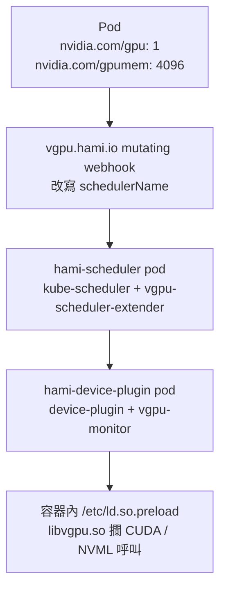

# Day 3: 安裝 HAMi——把一張 T4 切給多個容器的 VRAM 配額與硬隔離

{ align=right width="100" }

> Kubernetes 預設把 GPU 當一整顆蛋糕發放:要嘛整顆給你,要嘛不給,就算你只想要一片。前兩天送上叢集的每一顆 pod 都是這樣拿卡的——`nvidia.com/gpu: 1` 換一張 16 GB 的 T4,即使裡面跑的推論服務只用得到 2 GB,剩下的 14 GB 也一起鎖在它名下。今天把 device plugin 換掉,讓同一張 T4 同時服務多個容器,並且回答兩個問題:容器裡的 `nvidia-smi` 會看到多少 VRAM?宣告了 4 GB 配額、程式卻硬要吃 8 GB,擋不擋得住?路上有四顆雷,第一顆在拆掉舊 device plugin 的當下就會踩到——明明已經卸載乾淨,`kubectl describe node` 卻還在說這台機器上有一張卡可以用。

!!! abstract "你在課程的哪裡"
    - **Day 0–2**:排程層(誰先拿到卡)走完了,但卡還是整張整張發。
    - **今天**:HAMi 接管 device plugin,把一張 T4 切給多個容器。驗收:容器內只看得到 4096 MiB,超配的 OOM 只炸在自己容器裡。
    - **Day 4**:放置策略,以及把 HAMi 的隔離接到 KAI 上。

## 原理與架構

`nvidia.com/gpu` 是一個整數型的 extended resource:device plugin 回報幾張,節點就宣告幾張,pod 要幾張就整張整張地拿。這個設計對訓練工作剛剛好,一份訓練通常吃得下整張卡;對推論服務就很浪費,一個 2 GB 的模型佔著 16 GB 的 T4,利用率個位數,而後面還排著等卡的人。

要讓多個容器共用一張卡,兩件事得同時成立,少一件都不算數。

**第一件是排程層看得懂 VRAM 。** 節點必須有辦法宣告「這張卡還能接幾個租戶、還剩多少 VRAM 」,排程器也要能拿 VRAM 當過濾條件。否則排程器只會數張數:四顆各要 4 GB 的 pod 塞進同一張 16 GB 卡,它算得出來,第五顆進來時就爆了。

**第二件是執行層真的擋得住。** 只在排程階段記帳沒有用。容器跑起來之後,CUDA 程式看到的是整張實體卡,而 PyTorch、TensorFlow、vLLM 這類框架的記憶體規劃全部拿「卡的總容量」乘一個比例——看到 16 GB 就照 16 GB 規劃。配額若只存在排程器的帳本裡,第一個吃過頭的容器就會把鄰居擠死。

今天安裝的 **HAMi**(Heterogeneous AI Computing Virtualization Middleware,本課程用 chart / appVersion `2.9.0`)兩件都做。它自帶 device plugin,把一張實體卡宣告成多份 `nvidia.com/gpu`,並額外提供 `nvidia.com/gpumem`( VRAM ,MiB)與 `nvidia.com/gpucores`(算力,百分比)兩種配額;容器啟動時,它在容器內掛一個 `libvgpu.so` 攔截所有 CUDA 與 NVML 呼叫,配置量超過配額就直接回 out of memory。專案 2024 年 8 月進 CNCF sandbox,2026 年 7 月升格 incubating(截至 2026-08)。

### 送出一顆 pod 之後,四個地方會動



中間兩格值得先停一下。**HAMi 的排程器不是自己寫的排程器**,而是一顆標準的 `kube-scheduler` 外掛一個 extender:一般的 filter/score 照走內建邏輯,遇到 GPU 相關的資源才把決定權交給 extender。Day 1 的 KAI 走的是另一條路,七個元件、自己實作整套排程迴圈與佇列體系。兩種做法今天都在同一個叢集上跑著,步驟 6 會讓它們正面撞一次。

### 今天要走的路

環境沿用 Day 0 蓋的 AKS `<cluster>`(K8s v1.35.6)、`gpuspot` pool 兩台 `Standard_NC4as_T4_v3`(各一張 16 GB T4,spot),Day 1 裝的 KAI Scheduler v0.16.8 保留但前五步不參與。五段路:**換手**(拆掉 nvidia-device-plugin,看 GPU 資源怎麼消失)、**安裝**(補節點標籤、裝 HAMi)、**切分**(把一張 T4 分給多個容器,比對容器內外看到的數字)、**隔離**(讓其中一顆硬吃到爆,看鄰居有沒有事)、**邊界**(把 pod 指名交給 KAI 排,卻要 HAMi 的 VRAM )。workload 全部丟在 `hami-lab` namespace。

## 步驟

### 步驟 1:把舊的 device plugin 拆掉——卡還在,資源不見了

Day 0 到 Day 2 全程靠 helm release `nvdp` 提供 `nvidia.com/gpu`。HAMi 要自己接管這個資源名稱,兩套 device plugin 不能同時管同一張卡,所以第一件事是卸載舊的,順便驗證一件平常沒機會確認的事:device plugin 這一層能不能熱抽換。

```console
$ helm uninstall nvdp -n nvidia-device-plugin
release "nvdp" uninstalled
```

每 10 秒查一次兩台 GPU 節點的 `allocatable`:

```text
[11:08:31] uninstall 指令返回
[11:08:37] [{"n":"vmss000009","gpu":"0"},{"n":"vmss00000a","gpu":"1"}]
[11:08:47] [{"n":"vmss000009","gpu":"0"},{"n":"vmss00000a","gpu":"0"}]
```

6 秒第一台歸零,16 秒內兩台都歸零。kubelet 對 device plugin 斷線的反應很快,不必重啟節點;namespace 裡的物件也被 helm 清得乾淨:

```console
$ kubectl -n nvidia-device-plugin get all
No resources found in nvidia-device-plugin namespace.
```

同一台節點的另一個欄位,講的卻是另一套說法:

```console
$ kubectl get nodes -o json | jq '.items[]|select(.metadata.name|test("gpuspot"))
    |{name:.metadata.name, capacity:(.status.capacity|with_entries(select(.key|test("nvidia")))),
      allocatable:(.status.allocatable|with_entries(select(.key|test("nvidia"))))}'
{
  "name": "aks-gpuspot-21249019-vmss000009",
  "capacity":    { "nvidia.com/gpu": "1" },
  "allocatable": { "nvidia.com/gpu": "0" }
}
```

(另一台輸出完全相同。)`capacity` 還寫著 1,診斷與判讀方式見[地雷 1](#mine-1)。排程器站在哪一邊,丟一顆 `limits: {nvidia.com/gpu: 1}` 的 busybox 探針進去就知道:

```text
NAME          READY   STATUS    RESTARTS   AGE
nogpu-probe   0/1     Pending   0          13s

Events:
  Warning  FailedScheduling  13s  default-scheduler
  0/3 nodes are available: 1 node(s) didn't match Pod's node affinity/selector,
  2 Insufficient nvidia.com/gpu. no new claims to deallocate,
  preemption: 0/3 nodes are available: 3 Preemption is not helpful for scheduling.
```

訊息是 `Insufficient nvidia.com/gpu`,而不是「沒有這種資源」——資源鍵還在、值是 0,排程器只認 `allocatable`。叢集現在的狀態是:有 GPU 硬體、有 AKS 受管的驅動、沒有任何 device plugin。HAMi 可以乾淨地接上去。

### 步驟 2:把 HAMi 要的節點標籤補在 pool 層級

HAMi 的 device plugin DaemonSet 預設帶 `nvidiaNodeSelector: {gpu: "on"}`(chart values 寫死),官方文件教的也是 `kubectl label nodes <node> gpu=on`。這條在 AKS 上不能照抄:[Day 0 地雷 1](sprint1-day0-azure-aks-foundation.md#mine-1) 已經記過一次,spot 節點會被回收重建、pool 縮到 0 再拉回來也是全新 VM,節點層級的標籤活不過任何一次重建。標籤下在 pool 層級,而 `--labels` 是整組取代,既有的兩顆一定要一起帶上:

```console
$ az aks nodepool update -g <resource-group> --cluster-name <cluster> -n gpuspot \
    --subscription <subscription-id> \
    --labels pool=gpu "nvidia.com/gpu.present=true" gpu=on
{ "count": 2, "state": "Succeeded",
  "labels": { "gpu": "on", "kubernetes.azure.com/scalesetpriority": "spot",
              "nvidia.com/gpu.present": "true", "pool": "gpu" } }
```

```text
NAME                              GPU   POOL   PRESENT
aks-gpuspot-21249019-vmss000009   on    gpu    true
aks-gpuspot-21249019-vmss00000a   on    gpu    true

# 節點沒有被重建:creationTimestamp 仍是 2026-08-04T03:06:55Z,預熱用的 pod 也還活著
image-prepuller-p4294   1/1   Running   0   3m45s
```

38 秒完成,節點沒有重建,上面跑著的 pod 不受影響。改 pool 標籤不等於換節點,這讓「補一個標籤」從一次停機變成一次線上操作。回傳值裡多出來的 `kubernetes.azure.com/scalesetpriority=spot` 是 AKS 自己掛的系統標籤,不用也不能寫進 `--labels`,整組取代不會把它洗掉。輸出裡那組 `image-prepuller` 是一個不要 GPU 的 DaemonSet,趁開機空檔把幾 GB 的 `pytorch/pytorch:2.5.1-cuda12.4-cudnn9-runtime` 預先拉到兩台節點上,後面每顆測試 pod 都是秒開。

### 步驟 3:安裝 HAMi v2.9.0——整套只有三顆 pod

安裝值只改三件事,其餘沿用 chart 預設:

```bash
cat > 01-hami-values.yaml <<'EOF'
devicePlugin:
  # without this the DaemonSet never lands on the spot-tainted GPU nodes
  tolerations:
    - key: kubernetes.azure.com/scalesetpriority
      operator: Equal
      value: spot
      effect: NoSchedule

scheduler:
  # pin the control plane to the system pool
  nodeSelector:
    agentpool: system
  patch:
    nodeSelector:
      agentpool: system
EOF
```

保留預設的兩個值等一下會直接看到效果:`deviceSplitCount: 10`(每張實體卡切成 10 份)與 `deviceMemoryScaling: 1`(不超賣 VRAM )。

還有一個預設值要先驗。chart 的 kube-scheduler 映像 tag 是留空的,實際值由 `.Capabilities.KubeVersion` 推導,而 registry 預設指向 `registry.cn-hangzhou.aliyuncs.com`。叢集是 1.35.6,它就會去拉 `.../google_containers/kube-scheduler:v1.35.6`,而這個阿里雲 registry 跟不跟得上最新的 K8s minor 沒有保證。裝之前問一句 registry API 最省事:

```console
$ TOK=$(curl -s "https://dockerauth.cn-hangzhou.aliyuncs.com/auth?service=registry.aliyuncs.com:cn-hangzhou:26842&scope=repository:google_containers/kube-scheduler:pull" | jq -r .token)
$ curl -s -o /dev/null -w "%{http_code}\n" -H "Authorization: Bearer $TOK" \
    -H "Accept: application/vnd.docker.distribution.manifest.list.v2+json" \
    https://registry.cn-hangzhou.aliyuncs.com/v2/google_containers/kube-scheduler/manifests/v1.35.6
200
```

本次回 `200`(拿不存在的 `v9.99.9` 對照會回 `404`,證明這個探法測得出差別),預設值可用;若回 404,就改 `--set scheduler.kubeScheduler.image.registry=registry.k8s.io --set scheduler.kubeScheduler.image.repository=kube-scheduler`。另一條完全不碰叢集的路是 `helm template ... --kube-version 1.35.6 | grep image:`,把四個映像的最終字串印出來核對。

```console
$ helm repo add hami-charts https://project-hami.github.io/HAMi/ && helm repo update
$ helm install hami hami-charts/hami --version 2.9.0 \
    -n kube-system -f 01-hami-values.yaml
NAME: hami
NAMESPACE: kube-system
STATUS: deployed
REVISION: 1
NOTES:
Resource name: nvidia.com/gpu
```

安裝後 85 秒,三顆 pod 全部 Running:

```text
hami-device-plugin-k884s          2/2   Running   0   73s   aks-gpuspot-21249019-vmss00000a
hami-device-plugin-z46mx          2/2   Running   0   73s   aks-gpuspot-21249019-vmss000009
hami-scheduler-6cb48464bb-g8swb   2/2   Running   0   73s   aks-system-35459509-vmss000000
```

每顆都是兩個容器:device plugin 是 `device-plugin` 加 `vgpu-monitor`,scheduler 是 `kube-scheduler` 加 `vgpu-scheduler-extender`。對照 Day 1 步驟 3 清點過的 KAI 七個 Deployment,HAMi 的控制面小得多,落位也符合設計:資料面兩顆在 GPU 節點、控制面一顆在 system pool。

節點現在對外宣告什麼:

```json
{ "name": "aks-gpuspot-21249019-vmss000009",
  "capacity": { "nvidia.com/gpu": "10" }, "allocatable": { "nvidia.com/gpu": "10" } }
```

一張實體 T4 變成 10 份 `nvidia.com/gpu`。這個 10 是 `deviceSplitCount`,意思是「這張卡最多接幾個容器」,跟 VRAM 無關。而 `nvidia.com/gpumem` 與 `nvidia.com/gpucores` 一個都沒有出現在節點資源裡——它們在節點的 annotation 上:

```console
$ kubectl get node aks-gpuspot-21249019-vmss000009 -o json \
    | jq '.metadata.annotations|with_entries(select(.key|test("hami")))'
{
  "hami.io/node-handshake": "Requesting_2026-08-04 03:12:22",
  "hami.io/node-nvidia-register": "[{\"id\":\"GPU-76fd10c5-...-0f4a59e7e1cc\",\"count\":10,\"devmem\":16384,\"devcore\":100,\"type\":\"NVIDIA-Tesla T4\",\"mode\":\"hami-core\",\"health\":true,\"devicepairscore\":{}}]"
}
```

`devmem: 16384`、`devcore: 100`、卡的 UUID 與 `mode: hami-core` 全在這一行裡,這是全叢集唯一看得到實體卡規格的地方。 VRAM 的帳為什麼不走 kubelet、查餘額該去哪裡看,見[地雷 2](#mine-2)。

### 步驟 4:把一張 T4 切給多個容器

三顆 pod,各要 1 份 `nvidia.com/gpu` 加 4096 MiB VRAM ,用 `nodeSelector: kubernetes.io/hostname` 釘在同一台(也就是同一張卡):

```yaml
    - name: app
      image: pytorch/pytorch:2.5.1-cuda12.4-cudnn9-runtime
      resources:
        limits: { nvidia.com/gpu: 1, nvidia.com/gpumem: 4096 }
```

```text
[11:13:17] pod/slice-a created / pod/slice-b created / pod/slice-c created
[11:13:33] slice-a   1/1   Running   0   16s   aks-gpuspot-21249019-vmss000009
           slice-b   1/1   Running   0   16s   aks-gpuspot-21249019-vmss000009
           slice-c   1/1   Running   0   15s   aks-gpuspot-21249019-vmss000009
```

16 秒三顆全部 Running。是不是真的落在同一張實體卡,看 HAMi 寫回 pod 的 annotation:

```text
slice-a  hami.io/vgpu-devices-allocated = GPU-76fd10c5-...-0f4a59e7e1cc,NVIDIA,4096,0:;
slice-b  hami.io/vgpu-devices-allocated = GPU-76fd10c5-...-0f4a59e7e1cc,NVIDIA,4096,0:;
slice-c  hami.io/vgpu-devices-allocated = GPU-76fd10c5-...-0f4a59e7e1cc,NVIDIA,4096,0:;
```

同一顆 GPU UUID、各 4096 MiB。格式是 `<GPU-UUID>,<廠牌>,<VRAM MiB>,<算力 %>`,最後那個 0 表示沒有限制算力。三顆的 `spec.schedulerName` 也都變成了 `hami-scheduler`——manifest 裡沒寫這個欄位,是 webhook 改的。

#### 容器裡看到的是 4 GB,不是 16 GB

`slice-a` 容器內:

```text
+-----------------------------------------+------------------------+----------------------+
|   0  Tesla T4                       Off |   00000001:00:00.0 Off |                  Off |
| N/A   34C    P8             13W /   70W |       0MiB /   4096MiB |      0%      Default |
+-----------------------------------------+------------------------+----------------------+
===== torch view =====
name= Tesla T4 total_MiB= 4096
```

同一時刻,借旁邊一顆不要 GPU 的 pod 在宿主機端查同一張卡:

```text
memory.used [MiB], memory.total [MiB], utilization.gpu [%]
0 MiB, 16384 MiB, 0 %
```

同一張卡,兩種數字。三顆 pod 各自看到的都是 `0MiB / 4096MiB`,而且 `Processes` 區塊全是空的,彼此看不到對方的行程。

PyTorch 那一行 `total_MiB= 4096` 比 `nvidia-smi` 更關鍵。它走的是 `cudaGetDeviceProperties`,而框架的自動記憶體規劃——PyTorch 的 caching allocator、TensorFlow 的 memory growth、vLLM 的 `gpu_memory_utilization`——全部以這個數字為基準乘一個比例。容器若看到 16 GB,vLLM 照預設值 0.9 就會去要 14.4 GB,配額再怎麼寫都攔不住第一次配置。HAMi 把源頭改掉,框架的自動規劃自然落在配額之內,應用端一行程式都不用動。

#### 這個限制塞在哪裡(pod spec 裡完全看不到)

```console
$ kubectl -n hami-lab get pod slice-a -o json \
    | jq '.spec.containers[0]|{env,volumeMounts,resources}'
{
  "env": null,
  "volumeMounts": [],
  "resources": { "limits": { "nvidia.com/gpu": "1", "nvidia.com/gpumem": "4096" } }
}
```

`env` 是 `null`、vgpu 相關的 volumeMount 一個都沒有。但 exec 進去是另一個世界:

```console
$ kubectl -n hami-lab exec slice-a -- env | grep -iE "cuda|nvidia|vgpu"
CUDA_DEVICE_MEMORY_LIMIT_0=4096m
CUDA_DEVICE_MEMORY_SHARED_CACHE=/usr/local/vgpu/b0118c30-....cache
CUDA_DEVICE_SM_LIMIT=0
LIBCUDA_LOG_LEVEL=1
NVIDIA_VISIBLE_DEVICES=GPU-76fd10c5-...-0f4a59e7e1cc
$ kubectl -n hami-lab exec slice-a -- cat /etc/ld.so.preload
/usr/local/vgpu/libvgpu.so
```

這些是 device plugin 在 `Allocate()` 回應裡交給 kubelet 的,由容器執行期直接注入,不會回寫到 pod spec。所以要確認一顆 pod 有沒有真的被 HAMi 接管,`kubectl get pod -o yaml` 幫不上忙,只能 exec 進去看這兩樣。攔截點就是 `libvgpu.so` 被動態載入器掛在 CUDA 與 NVML 之前:`nvidia-smi` 之所以乖乖回報 4096,是因為它問的 `nvmlDeviceGetMemoryInfo` 也走過同一層。

#### VRAM 不夠時,排程階段就擋下來

同一張卡已經配出 3 × 4096 = 12288 MiB(實體 16384),再送一顆要 8192 MiB 的:

```text
NAME                   READY   STATUS    RESTARTS   AGE
mem-overcommit-probe   0/1     Pending   0          16s

Events:
  Warning  FilteringFailed   hami-scheduler   1 nodes CardInsufficientMemory(aks-gpuspot-21249019-vmss000009)
  Warning  FilteringFailed   hami-scheduler   no available node, 1 nodes do not meet
  Warning  FailedScheduling  hami-scheduler   0/3 nodes are available: 1 NodeUnfitPod, ...

# 同一時刻節點的帳本:
Allocated resources:
  Resource           Requests    Limits
  nvidia.com/gpu     3           3
```

`CardInsufficientMemory` 是 extender 自己發的事件,訊息直接點名哪一張卡不夠,比 default-scheduler 的 `Insufficient <resource>` 精準得多。而節點帳本只寫著切了三刀,「 VRAM 只剩 4096」這件事在上面完全查不到,這就是[地雷 2](#mine-2) 的實際後果。

#### 不指定節點時,HAMi 會把一張卡疊滿再換下一張

四顆 pod、各要 3000 MiB、不寫任何 `nodeSelector`,看它自己怎麼擺:

```text
NAME        STATUS    NODE
g-place-1   Running   aks-gpuspot-21249019-vmss000009
g-place-2   Running   aks-gpuspot-21249019-vmss000009
g-place-3   Running   aks-gpuspot-21249019-vmss000009
g-place-4   Running   aks-gpuspot-21249019-vmss000009

g-place-1 dev=GPU-76fd10c5-...-0f4a59e7e1cc,NVIDIA,3000,0:;   ← 四顆的 UUID 完全相同
node 000009:  nvidia.com/gpu  4  (4 顆 pod,共 12000 MiB)
node 00000a:  nvidia.com/gpu  0  (完全沒用到)
```

整組四顆疊在同一張實體 T4 上,另一台節點一張卡都沒碰,而且這是 HAMi 自己選的位置,不是釘上去的。chart 預設 `nodeSchedulerPolicy: binpack` 加 `gpuSchedulerPolicy: spread`——節點層面塞滿一台再換下一台,同一台有多張卡時才把 pod 分散到不同卡上。對 spot 叢集這個預設值有它的道理,集中使用讓空節點可以縮掉省錢;代價是風險也跟著集中,那台被回收,四個租戶一起死。要反過來就改 `scheduler.defaultSchedulerPolicy.nodeSchedulerPolicy=spread`。

這一輪測試的第一版用的是 `busybox:1.36`,四顆全部 `Failed`,原因見[地雷 3](#mine-3)。

### 步驟 5:超額配置只炸自己

配額寫得出來、排程階段擋得住,都還只是記帳。真正要驗的是執行期:一顆宣告 4096 MiB 的容器,程式硬要配置 8192 MiB 會怎樣,鄰居會不會被波及。

兩顆 pod 釘在同一台(也就是同一張卡),配額都是 4096 MiB:`iso-holder` 配置 3.00 GiB 並長期持有,每 15 秒回報一次還活著與資料校驗值;`iso-hog` 以 512 MiB 為單位一路加碼,目標 8192 MiB。

#### hog 的死法有兩層,兩層都要看

```text
budget check: total_MiB = 4096
HOG: allocated 512 MiB total
...
HOG: allocated 3584 MiB total
[HAMI-core ERROR (pid:1 thread=125213539699584 allocator.c:52)]: Device 0 OOM 4401922048 / 4294967296
HOG: FAILED at 4096 MiB
HOG: exception type = OutOfMemoryError
HOG: exception text = CUDA out of memory. Tried to allocate 512.00 MiB. GPU 0 has a total
capacity of 4.00 GiB of which 410.00 MiB is free. Including non-PyTorch memory, this process
has 3.60 GiB memory in use. ... If reserved but unallocated memory is large try
setting PYTORCH_CUDA_ALLOC_CONF=expandable_segments:True to avoid fragmentation.
```

上面那一層是 HAMi-core。分母 `4294967296` 正好是 4 GiB,也就是配額;分子 `4401922048` 約 4.10 GiB,是這次請求之後的累計量;`allocator.c:52` 是 `libvgpu.so` 裡做 OOM 檢查的位置。這個錯誤由攔截層送出,驅動並沒有參與。

下面那一層是 PyTorch:`GPU 0 has a total capacity of 4.00 GiB`。框架完全相信自己在一張 4 GB 的卡上,連建議都給得合情合理(叫你調 `expandable_segments` 避免碎片化)。應用端不需要知道自己被切了,這正是隔離該有的樣子。

還有一個數字要記住:實際拿到 3584 MiB(7 塊 512),第 8 塊被擋。差的約 512 MiB 是 CUDA context 本身的開銷,**配額是含 context 的總量**。要跑 4 GB 的模型,配額得開到 4.5–5 GB 才夠。

#### 撞的是自己的配額,不是卡的容量

把 hog 放慢(每塊之間停 2 秒),同時在宿主機端抽樣實體卡用量:

```text
[11:16:54] 實體卡 used=3193 MiB | hog:
[11:16:58] 實體卡 used=3807 MiB | hog: HOG: allocated 1024 MiB total
[11:17:02] 實體卡 used=4831 MiB | hog: HOG: allocated 2048 MiB total
[11:17:06] 實體卡 used=5855 MiB | hog: HOG: allocated 3072 MiB total
[11:17:10] 實體卡 used=6879 MiB | hog: HOG: allocated 3584 MiB total
[11:17:14] 實體卡 used=3193 MiB | hog: HOG: exception text = CUDA out of memory ...
```

hog 被拒絕的那一刻,實體卡是 **6879 / 16384 MiB,還空著 9.5 GB**,它照樣拿不到第 8 塊 512 MiB。硬隔離的全部意思就在這一行數字裡:上限來自容器的配額,卡上還剩多少對它不存在。少了這一層,這顆 pod 會一路吃到 16 GB,鄰居就沒得跑了。hog 退出後實體用量掉回 3193 MiB(holder 的 3 GiB 加 CUDA context), VRAM 乾淨釋放。

#### 鄰居毫髮無傷

```text
HOLDER: allocated 3.00 GiB, checksum= 1.0
HOLDER alive t=0s   reserved_MiB=3072 first_elem=1.0
...
HOLDER alive t=165s reserved_MiB=3072 first_elem=1.0

NAME           READY   STATUS      RESTARTS   AGE
iso-hog-slow   0/1     Completed   0          71s
iso-holder     1/1     Running     0          3m
```

跨越兩次鄰居 OOM(快版與慢版各一次),holder 的 `reserved_MiB` 一路是 3072、資料校驗值一路是 1.0、`RESTARTS 0`。沒有 Xid 錯誤、沒有 device reset,節點上其他 pod 也沒有任何一顆受影響。受害範圍精準地停在 hog 那一顆容器裡,兩次獨立測試結果一致。

### 步驟 6:把 pod 指名交給 KAI 排,卻要 HAMi 的 VRAM

叢集裡現在兩套系統都健康跑著:Day 1 裝的 KAI 七個元件全部 Running,今天裝的 HAMi 三顆 pod 全部 Running。一個很自然的期待是「用 KAI 的佇列管配額、用 HAMi 的切分省卡」。送一顆探針試試:

```yaml
spec:
  schedulerName: kai-scheduler        # explicitly ask for KAI
  containers:
    - resources:
        limits:
          nvidia.com/gpu: 1
          nvidia.com/gpumem: 4096     # but ask for HAMi's resource
```

```text
NAME              READY   STATUS    RESTARTS   AGE
collision-probe   0/1     Pending   0          20s

spec.schedulerName(webhook 跑完之後)= kai-scheduler
PodGroup: pg-collision-probe-50b46df6-...  ← KAI 接手了

Events:
  Warning  Unschedulable      kai-scheduler   Scheduling conditions were not met for pod
    hami-lab/collision-probe:
    MaxNodePoolResources: The pod hami-lab/collision-probe requires GPU: 1, CPU: 0 (cores),
    memory: 0 (GB), pods: 1, nvidia.com/gpumem: 4096000.
    No node in the default node-pool has nvidia.com/gpumem resources.
```

永遠 Pending。HAMi 的 webhook 沒有碰這顆 pod,KAI 接手了(PodGroup 都建出來了),然後 KAI 拿標準的節點資源帳本去找 `nvidia.com/gpumem`——那不是節點資源,自然找不到,完整診斷見[地雷 4](#mine-4)。除了這顆刻意製造的探針,整場實驗(3 顆切分 pod、4 顆放置測試 pod、3 顆隔離 pod)KAI 完全沒有介入:

```text
hami-lab namespace 的 PodGroup:              No resources found
iso-holder 的 labels/annotations:             只有 hami.io/*,沒有 kai/runai 的鍵
KAI admission log 提到 hami-lab 的行數: 0
KAI binder log 提到 hami 的行數:        0
KAI 七元件(跨 Day 1–3):                     全部 Running,RESTARTS 0,age 20h
```

`hami-lab` 這個 namespace 同時落在兩個 mutating webhook 的作用範圍內(KAI 的 `mutating-kai-admission` 排除 `kube-system` 與 `kai-scheduler`,HAMi 的 `vgpu.hami.io` 排除帶 `hami.io/webhook: ignore` 標籤的),實際上卻沒有打架:誰接手由 `schedulerName` 決定,而兩邊都不碰沒有 GPU 資源請求的 pod——步驟 2 那組預熱 DaemonSet 從頭到尾保持 `default-scheduler`,兩個 webhook 誰都沒有動它。

兩個 webhook 有一處設計正好相反,值得寫進監控規格:**KAI 的 `failurePolicy` 是 `Fail`**(webhook 掛掉就擋下所有建立 pod 的請求),**HAMi 是 `Ignore`**(webhook 掛掉 pod 照建,只是不會被切分)。後者在故障時很陰:pod 會以「沒有任何 VRAM 限制」的狀態跑起來,`kubectl get pods` 一片 Running,隔離其實已經失效,而且沒有任何告警。監控條件因此要寫成「pod 有沒有拿到 `hami.io/vgpu-devices-allocated` annotation」,只看 Running 看不出這件事。

### 步驟 7:GPU Operator 到底需不需要(結清 Day 1 的懸案)

Day 1 步驟 5 留了一個沒答完的問題:KAI 的 README 把 NVIDIA GPU Operator 列成前置條件,但整張卡配置在只有 device plugin 的叢集上照樣跑通,當時的推測是「KAI 的 GPU sharing/fraction 需要 runtime class 這類 Operator 帶進來的設定」。今天的環境正好能驗這個問題的另一半:

```console
$ kubectl get ds,deploy -A | grep -iE "nvidia|dcgm|nfd|node-feature|mig|gpu-feature"
# operator 類工作負載(driver / toolkit / dcgm / NFD / MIG manager):NONE

$ kubectl get node aks-gpuspot-21249019-vmss000009 -o json \
    | jq '[.metadata.labels|keys[]|select(test("feature.node|nvidia"))]'
[ "nvidia.com/gpu.present" ]     ← 這一顆是我們自己在 pool 層級掛的,不是 NFD 掛的
```

本日所有結果——一張卡切 10 份、四顆 pod 共用一張 T4、容器內看到 4096 MiB、超額配置在排程階段被擋、執行期被 HAMi-core 擋——全部在零 GPU Operator 的叢集上取得。**HAMi 這條路的 VRAM 切分與硬隔離,在 AKS 上不需要 NVIDIA GPU Operator**——Day 1 懸案的 HAMi 半邊就此結案;至於 Day 1 推測裡點名的 KAI 自家 fraction 與 runtime class,那是另一半,留給 Day 4 驗證。原因不難理解:HAMi 需要平台提供的只有兩樣,**NVIDIA 驅動**(AKS 受管,580.159.04)與 **nvidia-container-runtime**(AKS 的 GPU 節點預裝),而 device plugin 與 CUDA 攔截層本來就是它自己的東西,Operator 沒有插手的餘地。

即使如此,Operator 並非全無用武之地。本日觀察到的線索整理如下:

| 情境 | Operator 幫得上什麼 |
|---|---|
| 節點自動打標籤 | `gpu=on` 與 `nvidia.com/gpu.present` 今天是手動維護的,還得記得寫在 pool 層級。NFD 依 PCI vendor ID 自動辨識,換機型或換 pool 都不用改設定 |
| GPU 硬體指標 | 今天完全沒有 per-GPU 的使用率、溫度、功耗資料。HAMi 自己的 metrics 只涵蓋它的配額帳本,硬體層面得自己補 DCGM exporter |
| MIG | A100/H100 要切 MIG instance 得靠 Operator 的 MIG manager。T4 不支援 MIG,本日無從驗證 |
| 自建叢集 | 沒有受管驅動的環境,Operator 幾乎是唯一合理的解 |

兩者也不互斥:HAMi chart 留了 `devicePlugin.gpuOperatorToolkitReady` 開關(預設關閉,開了會去等 `/run/nvidia/validations`),這個開關存在本身就說明官方預期兩套可以並存。

### 步驟 8:收尾

刪掉測試 pod 與 `hami-lab` namespace;HAMi 與 KAI 都保留安裝(Day 4 要用),GPU pool 照 Day 0 的紀律縮回 0:

```console
$ kubectl -n hami-lab delete pod --all --grace-period=5
$ kubectl delete namespace hami-lab
$ az aks nodepool scale -g <resource-group> --cluster-name <cluster> -n gpuspot \
    --subscription <subscription-id> --node-count 0
$ az aks nodepool show -g <resource-group> --cluster-name <cluster> -n gpuspot \
    --subscription <subscription-id> --query '{count:count,state:provisioningState}' -o json
{
  "count": 0,
  "state": "Succeeded"
}
```

那道回查不是裝飾。[Day 2 地雷 5](sprint1-day2-gang-scheduling-preemption.md#mine-5) 的結論是「別人可能覆蓋你的期望值」,今天它擋下的是另一種誤判:scale 指令的輸出被拿去餵一段 JSON 解析,吐了一串 `JSONDecodeError`,光看那個畫面很容易判定 scale 失敗。回查才確認 pool 其實乖乖收掉了,炸掉的只是解析腳本。**回查防的不只是別人,也防自己看錯輸出。**

GPU 節點消失後,兩個 HAMi 元件的下場不同:

```text
hami-scheduler-6cb48464bb-g8swb   2/2   Running   0   12m       ← 在 system pool,不受影響
hami-device-plugin (DaemonSet)    DESIRED 0  CURRENT 0          ← 沒有 gpu=on 的節點,自然歸零
```

DaemonSet 的 `DESIRED` 直接歸零(nodeSelector `gpu=on` 找不到節點),scheduler 因為釘在 system pool 而完好,這正是安裝值把控制面與資料面分開放的用意。Day 4 開機後 DaemonSet 會自己長回來,不需要重裝;`gpu=on` 寫在 pool 層級,新節點一出生就帶著。本日 GPU 計費約 17 分鐘,和 Day 1 的 16 分鐘相近,遠低於 Day 2 的 28 分鐘。

## 驗收 checkpoint

| 檢查項 | 指令 | 期待結果 |
|---|---|---|
| device plugin 換手乾淨 | 卸載 nvdp 後每 10 秒查節點 `allocatable` | 16 秒內兩台歸零(`capacity` 仍是 1),裝 HAMi 後變 `10` |
| 多顆 pod 共用同一張卡 | pod 的 `hami.io/vgpu-devices-allocated` | 三顆同一個 GPU UUID,各 `4096` |
| 容器看到的是配額 | 容器內 `nvidia-smi` 與 `torch.cuda.get_device_properties` | `0MiB / 4096MiB`、`total_MiB= 4096`(宿主機 16384) |
| 注入點真的在 | `kubectl exec <pod> -- cat /etc/ld.so.preload` | `/usr/local/vgpu/libvgpu.so` |
| 兩階段都擋得住超配 | 卡上剩 4096 時送一顆要 8192 的;4096 配額的容器一路加碼配置 | 前者 Pending 且事件是 `CardInsufficientMemory`,後者噴 `HAMI-core ERROR ... allocator.c:52`,分母 `4294967296` |
| 鄰居不受牽連 | holder 的 log 與 `RESTARTS` | `reserved_MiB` 一路 3072、校驗值不變、`RESTARTS 0` |
| 預設放置策略 | 四顆不指定節點的 pod | 全部落在同一節點的同一張卡,另一台完全沒用到 |
| 零 GPU Operator | `kubectl get ds,deploy -A \| grep -iE "nvidia\|dcgm\|nfd\|mig"` | 沒有任何 operator 類工作負載 |

## 地雷記錄

### 地雷 1:device plugin 拆掉了,`capacity` 還在說這台機器有卡 {#mine-1}

**症狀**:`helm uninstall nvdp` 之後,`kubectl describe node` 的 Capacity 區塊依然寫著 `nvidia.com/gpu: 1`。只看 Capacity 會以為 device plugin 還活著、GPU 還能用。

**根因**:kubelet 對 device plugin 註冊的擴充資源有兩套帳。plugin 斷線時,kubelet 把 **allocatable 立刻歸零**(避免再排新 pod 上來),但 **capacity 的鍵值會保留**,要到 kubelet 重啟或節點重建才真正消失。「資源鍵還在」不等於「資源可用」。

**修法**:判斷 device plugin 是否健在,一律看 `allocatable`。一行版:

```console
$ kubectl get nodes -o json \
    | jq -r '.items[]|"\(.metadata.name) \(.status.allocatable["nvidia.com/gpu"] // "<absent>")"'
```

三種輸出要分清楚:`<absent>` 是這節點從來沒有 GPU 資源;`0` 是曾經有、現在 plugin 不在(或卡被佔滿);`>0` 才是真的可以排。

### 地雷 2:`nvidia.com/gpumem` 不是節點資源,`kubectl describe node` 查不到 VRAM 餘額 {#mine-2}

**症狀**:pod 明明寫了 `nvidia.com/gpumem: 4096` 也順利跑起來,但 `kubectl describe node` 的 Capacity、Allocatable、Allocated resources 三個區塊都找不到 `nvidia.com/gpumem` 這一行。想知道「這張卡還剩多少 VRAM 可以配」,用慣的 kubectl 指令全部失效。

**根因**:HAMi 的 device plugin 只向 kubelet 註冊 `nvidia.com/gpu` 一種擴充資源(值等於 `deviceSplitCount`)。 VRAM 與算力的帳完全不經過 kubelet:實體卡規格寫在節點 annotation `hami.io/node-nvidia-register`,已配出去的量記在 scheduler extender 的記憶體與各 pod 的 annotation 上。scheduler 的 configmap 把這件事講得很明白:

```yaml
managedResources:
- { ignoredByScheduler: true, name: nvidia.com/gpu }
- { ignoredByScheduler: true, name: nvidia.com/gpumem }
- { ignoredByScheduler: true, name: nvidia.com/gpucores }
```

`ignoredByScheduler: true` 的意思是「內建 kube-scheduler 不要拿這幾個資源做 fit 判斷」,全部交給 extender。內建排程器根本不知道 `gpumem` 是什麼,也就不可能把它算進節點帳本。

**修法**:查 VRAM 餘額要靠 HAMi 自己的資訊來源,三條路——各 pod 的 `hami.io/vgpu-devices-allocated` annotation 加總;extender 的 log(`kubectl -n kube-system logs deploy/hami-scheduler -c vgpu-scheduler-extender`)裡的 `Usedmem`;或 HAMi 的 metrics endpoint(chart 預設開在 NodePort 31993)。別拿 `kubectl describe node` 當 VRAM 容量規劃的依據,它只告訴你 `nvidia.com/gpu` 用掉幾份,那是切了幾刀,跟用掉幾 GB 是兩回事。

### 地雷 3:HAMi 管的容器一定要有 glibc——busybox/alpine 直接 exit 127 {#mine-3}

**症狀**:放置策略測試的第一版用 `busybox:1.36`,四顆 pod 全部 `Failed`,容器 `exitCode: 127`,log 只有一行:

```text
sh: error while loading shared libraries: libdl.so.2: cannot open shared object file: No such file or directory
```

排程完全成功(`FilteringSucceed` / `BindingSucceed` 都有、annotation 也正確配到卡),是容器一啟動就死。看事件會以為映像壞了。

**根因**:HAMi 對它管的每一個容器都寫入 `/etc/ld.so.preload = /usr/local/vgpu/libvgpu.so`。`libvgpu.so` 動態連結 glibc(需要 `libdl.so.2`),而 busybox 與 alpine 用的是 musl,根本沒有這個 so。動態載入器在 `main()` 之前就失敗,連 `sh` 都起不來,於是 127。

**修法**:(1) 凡是要吃 `nvidia.com/gpumem` 的映像,基底必須是 glibc(debian、ubuntu、conda 系;`pytorch/pytorch`、`nvidia/cuda` 都可以);(2) 真的要用輕量映像做非 GPU 的雜事,就不要在那顆 pod 上寫任何 HAMi 資源,沒有資源請求就不會被注入;(3) 追查時記住這個特徵組合:**排程成功 + 立刻 exit 127 + 找不到 `.so`**,幾乎一定是 preload 與 libc 不匹配,不必去查 GPU 驅動。

**教訓**:同一顆雷會不會爆,取決於 pod 有沒有真的排上去——本章那顆 busybox 的 `mem-overcommit-probe` 一路 Pending,沒進到啟動容器那一步,所以毫無症狀。

### 地雷 4:HAMi 的 webhook 只接 `default-scheduler` 的 pod,已指名別的排程器就整顆放生 {#mine-4}

**症狀**:pod 寫了 `schedulerName: kai-scheduler` 又要 `nvidia.com/gpumem`,結果永遠 Pending,KAI 抱怨 `No node in the default node-pool has nvidia.com/gpumem resources`。兩套東西都裝好了、都健康,pod 就是排不上。

**根因**:HAMi 的 mutating webhook(`vgpu.hami.io`)帶著 `forceOverwriteDefaultScheduler: true`,但這個 force 只在 `schedulerName == default-scheduler` 時生效——已經指名其他排程器的 pod,HAMi 一律不碰。於是這顆 pod 落到 KAI 手上,而 KAI 用的是標準的節點資源帳本,`nvidia.com/gpumem` 根本不是節點資源([地雷 2](#mine-2)),KAI 當然找不到。訊息裡的 `4096000` 是 KAI 把它當一般資源做了 milli 換算(4096 × 1000),數字看起來很怪但不是 bug,是單位慣例不同。

**修法**:目前這兩套不能靠「都裝著」自動合作。誰拿到 pod 由 `schedulerName` 決定,而兩邊對 `gpumem` 的理解完全不同。本章的做法是讓 HAMi 的 pod 保持 `default-scheduler`(不要寫 `schedulerName`,讓 HAMi webhook 去改),KAI 的 pod 走 KAI 的路,兩邊不交集。

**判讀技巧**:看到 `No node ... has <resource> resources` 這種訊息,先問「這個資源到底是不是節點資源」,再問「是誰在排這顆 pod」。本例兩個答案都不是直覺上的那個。

## 帶得走的東西

- device plugin 是可以熱抽換的一層。卸載舊的、裝新的,節點的 `allocatable` 十幾秒內就跟著改,不必重啟 kubelet 也不必重建節點。但判斷它在不在,只能看 `allocatable`,`capacity` 會留著一筆過期的舊帳。
- 讓框架看到「假的卡容量」,比在排程器記帳更根本。PyTorch、TensorFlow、vLLM 的記憶體規劃都以 `cudaGetDeviceProperties` 回報的總量為基準乘一個比例,改掉這個源頭,應用端一行程式不動就落在配額之內。
- 硬隔離的判準,是那個「卡上還空著 9.5 GB、容器卻拿不到 512 MiB」的瞬間。上限來自容器的配額而非卡的剩餘量,兩者分得開,隔離才算數。
- 規劃配額時記得含 CUDA context。4096 MiB 的配額實際只配得出約 3584 MiB,差的那半 GB 是 context 開銷,估算模型需求時要一起算進去。
- 有些狀態不在它「應該在」的地方: VRAM 餘額不在節點資源裡,隔離設定也不在 pod spec 裡。習慣用 `kubectl describe` 查一切的直覺在這裡有兩個破口,得改用 annotation 與 exec 補上。
- 監控要盯設定有沒有生效,而不只是 pod 有沒有跑起來。`failurePolicy: Ignore` 的 webhook 掛掉時,pod 照常 Running,隔離卻已經不存在,畫面上看不出任何異狀。

## 延伸閱讀

想往下深挖,從這幾份開始:

- **[HAMi GPU 虛擬化原理](https://project-hami.io/docs/core-concepts/gpu-virtualization)** —— `/etc/ld.so.preload` 的掛法、`dlsym` 劫持如何攔下 `cu*` 與 `nvml*` 呼叫,以及 `nvmlDeviceGetMemoryInfo` 被改寫後為什麼 `nvidia-smi` 只回報配額,對應本章步驟 4。
- **[HAMi 架構總覽](https://project-hami.io/docs/core-concepts/architecture)** —— mutating webhook 改寫 `schedulerName` 的判斷邏輯與 scheduler extender 的職責分工,對照本章[地雷 4](#mine-4) 的失效條件。
- **[HAMi-core:容器內的 GPU 資源控制器](https://github.com/Project-HAMi/HAMi-core)** —— `libvgpu.so` 的原始碼與 `CUDA_DEVICE_MEMORY_LIMIT` 等環境變數的定義處,本章那則 `allocator.c:52` OOM 訊息的出處。
- **[HAMi 成為 CNCF incubating 專案](https://www.cncf.io/blog/2026/07/15/hami-becomes-a-cncf-incubating-project/)** —— 專案成熟度歷程(2024-08 進 sandbox、2026-07 升 incubating)與採用情況,評估要不要放進正式環境時的判斷材料。

## 下一步

今天結束時,叢集裡兩套系統都健在:KAI 管得了佇列、配額與 gang,HAMi 切得動 VRAM 也擋得住超用。但[地雷 4](#mine-4) 已經先把結果講白了——它們各排各的,同一顆 pod 只能選一邊,兩套都裝著並不會自動變成「用 KAI 的佇列跑 HAMi 切出來的 vGPU」。Day 4 就從這個縫隙接下去:HAMi 官方為這件事準備了什麼機制,把它裝起來實際跑一次,看整合之後排程權責怎麼重新劃分、哪些設定得改,以及原本兩邊各自的行為會不會因此被改寫。

---

!!! quote ""
    HAMi 標誌為 CNCF artwork 之官方資產,此處作社群教學用途。
