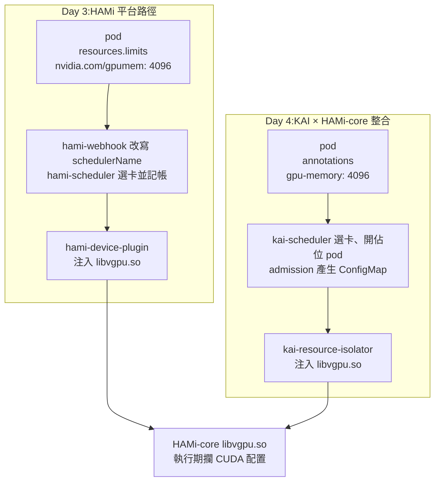
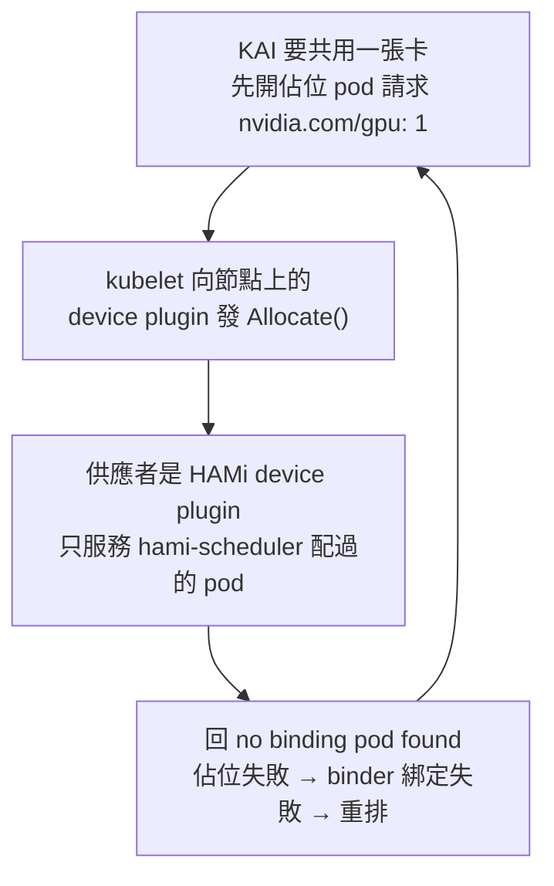

# Day 4: HAMi 放置策略與 KAI 官方整合——binpack、spread 與 HAMi-core

{ align=right width="100" }

> Day 3 收在一個沒解掉的狀態:HAMi 的 webhook 只改寫走預設排程器的 pod,所以 pod 一旦寫了 `schedulerName: kai-scheduler`, VRAM 切分的請求就沒有人接手——兩套元件都裝著、都健康,pod 卻永遠 Pending。今天照 HAMi 官方文件給的方式把 VRAM 隔離接到 KAI 上,把那個情境做對;路上順便回答 Day 3 留下的另外三題:同一組 pod 該集中還是分散、兩套帳本同時裝著會發生什麼、HAMi 拆得乾不乾淨。

!!! abstract "你在課程的哪裡"
    - **Day 3**:切分與硬隔離驗證過;結尾留了一個沒解的 Pending——pod 指名 KAI 又要 VRAM 配額,兩套元件都不接手。
    - **今天**:binpack 與 spread 的對照,然後照官方文件把那個 Pending 做對。驗收:KAI 排程的共卡 pod 在 T4 上跑通,隔離仍然成立。
    - **Day 5**:給這套帳本一個看得見的介面。

## 原理與架構

Day 3 建立的能力是「一張 T4 切給多個容器,而且 VRAM 上限是硬的」。切得動之後,兩個問題立刻跟上來:切好的份額要擺在哪一台節點,以及這套切分能不能交給 Day 1–2 那個會排佇列、會湊 gang 的排程器。

### 集中還是分散:同一組請求的兩種擺法

四顆各要 4096 MiB 的 pod,丟進兩台各一張 T4 的叢集,有兩個極端解:全部疊在同一張卡上(另一台完全空著),或平均攤到兩張卡。HAMi 的 scheduler extender 在選節點時會給每個候選節點打一個分數,分數的意義是「這台已經多滿」。往最高分的節點放就是集中,叫 **binpack**;往最低分的節點放就是分散,叫 **spread**。兩者共用同一個評分函式,差別只在取極值的方向。

政策分兩個層級,可調的範圍並不一樣:

| 政策 | 層級 | 效果 | 逐 pod 覆寫 |
|---|---|---|---|
| `binpack` | Node(挑哪一台節點) | 盡量塞進同一台 GPU 節點 | 可以,用 annotation |
| `spread` | Node | 盡量分散到不同 GPU 節點 | 可以,用 annotation |
| `numa-first` | GPU(同一台裡挑哪張卡) | 多卡配置時優先同 NUMA(v2.9.0 尚未實作) | 不行,只能全域設定 |

chart 的預設是 node 層級 `binpack` 加 GPU 層級 `spread`。換掉 node 層級政策有兩條路:改安裝值 `scheduler.defaultSchedulerPolicy.nodeSchedulerPolicy`,或在 pod 上寫 annotation `hami.io/node-scheduler-policy`。官方文件明講只有 node 層級能逐 pod 覆寫,「同一台裡挑哪張卡」沒有 annotation 這條路。

### 平台與函式庫:官方整合的是什麼

Day 3 那條路徑動用了 HAMi 的全套元件:webhook 改寫 `schedulerName`、`hami-scheduler` 選卡與記帳、`hami-device-plugin` 在容器起來時把一個叫 `libvgpu.so` 的動態函式庫送進去。真正在執行期攔下 CUDA 記憶體配置呼叫、讓 `nvidia-smi` 只看得到 4096 MiB 的,是最後那個函式庫,它在專案裡有自己的名字:**HAMi-core**。

官方的 KAI 整合文件開宗明義就把界線畫在這裡:

> The integration uses **HAMi-core directly, not the full HAMi platform**. KAI Scheduler keeps its own scheduling capability and brings in HAMi-core only for GPU memory isolation.

換句話說,整合借走的只有那個函式庫,排程、記帳、配額整組留在 KAI 手上。要裝的元件只有三個:

| 元件 | 做什麼 | 來自 |
|---|---|---|
| KAI 的 admission | 算出這顆 pod 分到多少 VRAM ,產生對應的 ConfigMap | KAI,要開 `global.gpuSharing` 與 `binder.plugins.hamicore.enabled` |
| `kai-resource-isolator` | DaemonSet 把 `libvgpu.so` 鋪到每台 GPU 節點;webhook 把它與 `/etc/ld.so.preload` 掛進 pod | HAMi 專案的獨立 chart |
| HAMi-core `libvgpu.so` | 執行期攔 CUDA 配置呼叫,強制上限 | 同上 |

這份清單裡沒有 `hami-scheduler`、沒有 `hami-device-plugin`、也沒有 HAMi 的 webhook。連要 VRAM 的寫法都換了一種:`resources.limits` 上的 `nvidia.com/gpumem` 退場,改由 pod 的 annotation `gpu-memory: "4096"`(單位 MiB,不帶字尾)接手。



兩條路的終點是同一個函式庫,起點的 API 介面卻完全不同:

| | HAMi 平台路徑(Day 3) | KAI × HAMi-core 路徑(Day 4) |
|---|---|---|
| 排程器 | `hami-scheduler`(webhook 自動改寫) | `kai-scheduler`(自己寫 `schedulerName`) |
| VRAM 怎麼要 | `resources.limits["nvidia.com/gpumem"]: 4096` | `metadata.annotations["gpu-memory"]: "4096"` |
| 佇列 | 無 | `labels["kai.scheduler/queue"]: default-queue` |
| 帳本在哪 | extender 的行程記憶體 + pod annotation | KAI 的節點/佇列帳本 + 佔位 pod |
| 隔離執行者 | HAMi-core | HAMi-core |

最後一列是今天最值得先記住的一行:兩條路換掉的是介面,隔離機制本身從頭到尾沒動過。

### 今天要走的路

四段。先在還裝著 HAMi 的叢集上跑放置策略對照(binpack 對 spread);接著裝上整合的兩個元件、送出官方文件形式的 pod,看它撞上什麼;第三段做共存探針,量出兩套系統同時在場時誰擋了誰;最後把 HAMi 平台整組卸掉、驗殘留、裝回原廠 device plugin,在乾淨基線上把同一份 YAML 重跑一次。環境沿用 Day 3:AKS `<cluster>`(K8s v1.35.6)、HAMi v2.9.0、KAI Scheduler v0.16.8、`gpuspot` pool 兩台 `Standard_NC4as_T4_v3`(各一張 T4),workload 全部放在 `day4-lab` namespace。

## 步驟

### 步驟 1:用一行 annotation 決定四顆 pod 疊在一張卡還是攤在兩張

先照 Day 0 的循環把 GPU pool 拉回兩台,並且回查 `count` 而不是只看指令回傳(理由是 Day 2 地雷 5)。從下指令到兩張卡可配置共 **5 分 51 秒**,而這段時間沒有任何 HAMi 的操作:

```text
12:21:39  node objects appear (NotReady): vmss00000b / vmss00000c
12:23:20  both nodes report nvidia.com/gpu = 10
hami-device-plugin   DESIRED 2  READY 2  NODE SELECTOR gpu=on  AGE 72m
  pod hami-device-plugin-4wc6v   AGE 83s   vmss00000b
```

DaemonSet 物件的 `AGE` 是 72 分鐘(Day 3 建立的),上面的 pod 只有 83 秒——節點是全新的 VM,而 `gpu=on` 這個標籤下在 pool 層級,一出生就帶著,DaemonSet 自己把資料面補了回去。控制面釘在 system pool、資料面跟著 GPU 節點生滅,跨日重開機的操作成本因此是零。

**對照組**先跑預設政策(`01-placement-default.yaml`):四顆 pod,各要 `nvidia.com/gpu: 1` 加 `nvidia.com/gpumem: 4096`,不寫 annotation。四顆只差編號,用迴圈生出四份文件:

```bash
for n in 1 2 3 4; do
  cat <<EOF
---
apiVersion: v1
kind: Pod
metadata:
  name: bp-$n
  namespace: day4-lab
  labels: { run: placement-default }
spec:
  restartPolicy: Never
  nodeSelector: { gpu: "on" }
  tolerations:
    - key: kubernetes.azure.com/scalesetpriority
      operator: Equal
      value: spot
      effect: NoSchedule
  containers:
    - name: c
      image: nvidia/cuda:12.9.2-base-ubuntu24.04
      command: ["bash", "-c", "nvidia-smi --query-gpu=memory.total --format=csv,noheader; sleep 3600"]
      resources:
        limits:
          nvidia.com/gpu: 1
          nvidia.com/gpumem: 4096
EOF
done > 01-placement-default.yaml
```

```text
12:23:45 apply -> 12:23:56  all four pods bound (11s)
bp-1..4  Running  aks-gpuspot-21249019-vmss00000c  SCHED hami-scheduler
         hami.io/vgpu-devices-allocated = GPU-7987a0bf-...,NVIDIA,4096,0:;

node ledger   vmss00000b  nvidia.com/gpu  0
              vmss00000c  nvidia.com/gpu  4
in-container  4096 MiB (all four)
```

四顆的 annotation 指向同一顆 GPU UUID,另一台節點一顆都沒有。順帶量到一件 Day 3 沒摸到的邊界:`4 × 4096 = 16384 MiB` 正好是 T4 的全部 `devmem`,HAMi 照樣一次排完——fit 判斷是「已用 + 請求 ≤ devmem」的閉區間,用到剛好不算超額。

**實驗組**(`02-placement-spread.yaml`)四顆 pod 的規格一模一樣,只多了一行:把上面那段迴圈的 `bp-$n` 改成 `sp-$n`、`placement-default` 改成 `placement-spread`,並在 `metadata` 底下補上 annotation,其餘一字不動。

```yaml
metadata:
  name: sp-$n
  namespace: day4-lab
  labels: { run: placement-spread }
  annotations:
    hami.io/node-scheduler-policy: "spread"
```

```text
12:24:53 apply -> 12:25:02  bound (9s)
sp-1, sp-3  Running  vmss00000b  →  GPU-845254fb-...
sp-2, sp-4  Running  vmss00000c  →  GPU-7987a0bf-...

node ledger   vmss00000b  nvidia.com/gpu  2
              vmss00000c  nvidia.com/gpu  2
```

兩次的差異全部攤開來看:

| | 預設(binpack) | annotation `spread` |
|---|---|---|
| 用到幾張實體卡 | 1 張(bp-1..4 全在 `vmss00000c`) | **2 張**(每台各 2 顆) |
| 該卡 VRAM 佔用 | 16384 / 16384 MiB(100%) | 各 8192 / 16384 MiB(50%) |
| 空節點 | 1 台(可以縮掉) | 0 台 |
| 單台 spot 被回收的爆炸半徑 | **4 個租戶同時中斷** | 2 個租戶 |
| 綁定耗時 | 11 秒 | 9 秒 |

extender 的日誌把機制講得比表格更白。同一個 `vgpu-scheduler-extender` 容器,兩輪的分數長這樣:

```text
# binpack round, when bp-4 arrives
score.go:185  "NodeFitPod" pod="day4-lab/bp-4" node="vmss00000c" score=10.5
score.go:185  "NodeFitPod" pod="day4-lab/bp-4" node="vmss00000b" score=0

# spread round, when sp-4 arrives
node_policy.go:82  node vmss00000b used 2, usedCore 0, usedMem 8192,
node_policy.go:63  node vmss00000c default score is 3.500000, computer override score is 3.500000
score.go:185  "NodeFitPod" pod="day4-lab/sp-4" node="vmss00000c" score=3.5
score.go:185  "NodeFitPod" pod="day4-lab/sp-4" node="vmss00000b" score=7
```

sp-4 最後去了分數低的 `vmss00000c`。annotation 沒有換掉評分函式,只換掉挑選方向——`computer override score` 那一行就是它生效的證據。

一行 annotation 就把「集中或分散」交到租戶手上,不必重裝、不必改全域值、不必重啟排程器。代價是這件事**由租戶自己宣告**:沒有任何機制阻止所有人都寫 `spread` 把節點撐開,也沒有機制阻止所有人都寫 `binpack` 把風險疊在同一台。在 spot 叢集上,這個旋鈕的一端是省錢、另一端是一台被回收要死幾個租戶,而 HAMi 不提供治理。要強制或改寫這個 annotation,得靠外部的 policy engine(OPA、Kyverno)。

### 步驟 2:裝上整合的兩個元件,並確認旗標真的落地

官方文件第一步是 `helm install kai-scheduler oci://ghcr.io/nvidia/kai-scheduler ...`,這個位址跑不動:

```console
$ helm show chart oci://ghcr.io/nvidia/kai-scheduler --version v0.16.8
Error: failed to perform "FetchReference" on source:
  GET "https://ghcr.io/v2/nvidia/kai-scheduler/manifests/v0.16.8":
  response status code 403: denied: requested access to the resource is denied
```

能用的是 Day 1 裝 KAI 時用的 `ghcr.io/kai-scheduler/kai-scheduler/kai-scheduler`,KAI 專案自己的 README 也是這個位址;文件裡的 `ghcr.io/nvidia/...` 是還沒開放的別名。Day 1 地雷 1 踩的是 chart 的**版本字串**,這次踩的是 chart 的**位址**——同一類問題的兩個位置,共同的處理方式都是先用 `helm show chart` 對一次再動手。

本叢集 Day 1 已經有 v0.16.8,所以改成 `helm upgrade` 疊上整合值(`07-kai-integration-values.yaml`,此刻的內容是 `global.gpuSharing: true` 加 `binder.plugins.hamicore.enabled: true`;檔案裡另有一行 `admission.gpuFractionRuntimeClassName: ""`,那是[地雷 1](#mine-1) 的修法——照完整檔案操作會直接跳過那顆雷):

```bash
cat > 07-kai-integration-values.yaml <<'EOF'
global:
  gpuSharing: true
binder:
  plugins:
    hamicore:
      enabled: true
EOF
```

```console
$ helm upgrade kai-scheduler \
    oci://ghcr.io/kai-scheduler/kai-scheduler/kai-scheduler --version v0.16.8 \
    -n kai-scheduler -f 07-kai-integration-values.yaml --wait --timeout 8m
12:26:03 -> 12:26:43 (40s)   STATUS: deployed   REVISION: 2
```

接著要確認兩個旗標真的生效,而這裡有一個查錯位置的陷阱。helm 值寫的是 `global.gpuSharing`,但它在 `Config` CR 裡不在 `spec.global` 底下:

```text
spec.global.gpuSharing          = None    # looking here suggests it never applied
spec.admission.gpuSharing       = True    # where the value actually lands
spec.binder.plugins             = {"hamicore": {"enabled": true}}
```

最可靠的是略過 CR 直接看 Deployment 的啟動參數,那是元件真正吃到的東西:

```text
admission:  ... "--gpu-sharing-enabled=true", "--hami-core-enabled=true",
                "--gpu-fraction-runtime-class-name", "nvidia"
binder:     ... --plugins {"gpusharing":{"enabled":true,"priority":100,...},
                           "hamicore":{"enabled":true,"priority":50}, ...}
```

第二個元件是 node 端的 isolator:

```console
$ helm install kai-resource-isolator \
    oci://docker.io/projecthami/kai-resource-isolator \
    --namespace kai-resource-isolator --create-namespace --version 1.0.0-chart
12:27:25 -> 12:27:41 (16s)

kai-resource-isolator-libsync-plrf6   1/1  Running   ← DaemonSet,desired 3
kai-resource-isolator-libsync-qqmvz   1/1  Running
kai-resource-isolator-libsync-wfq6t   1/1  Running
kai-resource-isolator-webhook-...                 1/1 Running
```

`desired 3` 而叢集只有兩台 GPU 節點——這個 DaemonSet 沒有 nodeSelector、tolerations 又是 `Exists/NoSchedule`,所以連沒有卡的 system 節點也鋪了一份。三台的叢集看不出差別,節點數量一多就得自己補 nodeSelector,否則每台機器都會多一個沒用途的常駐 pod。

裝完之後,叢集裡針對 pod 的 mutating webhook 變成三個:

| webhook | failurePolicy | 排除條件 |
|---|---|---|
| `vgpu.hami.io` | **Ignore** | namespace 或 pod 帶 `hami.io/webhook: ignore` |
| `vgpu.lib.kai-resource-isolator.io` | **Ignore** | namespace 或 pod 帶 `kai-resource-isolator.io/webhook: ignore` |
| `admission.kai-scheduler.svc` | **Fail** | namespace 為 `kube-system` 或 `kai-scheduler` |

`failurePolicy` 的差異決定故障時的樣子:兩個 `Ignore` 的 webhook 掛掉,pod 照樣建得出來,只是不再被改寫(於是隔離悄悄消失);`Fail` 的那個掛掉,除了它自己排除的 `kube-system` 與 `kai-scheduler`,其他 namespace 都建不出 pod。這三行是後面兩顆地雷的舞台。

### 步驟 3:送出官方文件形式的 pod——連撞兩顆地雷

測試 pod(`03-kai-hami-integrated.yaml`)完全照文件寫,兩顆共卡的 pod 只差編號:

```bash
for n in 1 2; do
  cat <<EOF
---
apiVersion: v1
kind: Pod
metadata:
  name: kai-shared-$n
  namespace: day4-lab
  labels:
    kai.scheduler/queue: default-queue
    run: kai-integrated
  annotations:
    gpu-memory: "4096" # unit is MiB, no suffix
spec:
  schedulerName: kai-scheduler
  restartPolicy: Never
  nodeSelector: { gpu: "on" }
  tolerations:
    - key: kubernetes.azure.com/scalesetpriority
      operator: Equal
      value: spot
      effect: NoSchedule
  containers:
    - name: c
      image: nvidia/cuda:12.9.2-base-ubuntu24.04
      command: ["bash", "-c", "nvidia-smi; sleep 3600"]
EOF
done > 03-kai-hami-integrated.yaml
```

第一次 apply,pod 根本沒建出來:

```console
$ kubectl apply -f 03-kai-hami-integrated.yaml
Error from server (Forbidden): error when creating "03-kai-hami-integrated.yaml":
  pods "kai-shared-1" is forbidden: pod rejected: RuntimeClass "nvidia" not found
```

`kubectl get pods` 查不到任何東西,因為物件在 API server 就被擋下了。原因與修法見[地雷 1](#mine-1);清空那個旗標之後重跑 `helm upgrade`(REVISION 3,12:28:38 → 12:29:19),確認 args 變成 `"--gpu-fraction-runtime-class-name", ""`,pod 這次建得出來——然後一路 Pending:

```text
12:34:34 apply -> 12:41:43  still Pending (7m)

Events:
  Warning  Unschedulable  2m8s (x300 over 7m8s)  kai-scheduler
    no nodes with enough resources were found:
      3 node(s) didn't have enough resources: GPU memory.
      3 node(s) didn't have enough resources: GPUs.

proportion.go:256  Total allocatable resources are
  <CPU: 7.511 (cores), memory: 50.122 (GB), Gpus: 20>, number of nodes: <3>
```

這一段的診斷歷時 8 分鐘,順序值得完整記錄。第一個訊號是排程器的日誌跟自己的事件互相矛盾:`Gpus: 20` 表示卡明明看得見(兩台 × HAMi 切的 10 份),事件卻說 GPU memory 不夠。第二步是把請求量往下砍,4096 改成 2000、1000,結果一樣 Pending;這條路死掉本身就是資訊,問題與請求量無關。於是問題換成「KAI 是從哪裡知道一張卡有多少 VRAM 的」,答案在原始碼裡的一個 fallback 常數(見[地雷 2](#mine-2))。手動補上節點標籤之後(12:42:43),排程立刻過了——接著撞上今天最硬的一顆:

```text
Events:
  Normal   Scheduled     kai-scheduler  Successfully assigned day4-lab/kai-shared-1 to vmss00000b
  Warning  BindingError  binder  Failed to bind pod day4-lab/kai-shared-1 to node ...:
    failed to reserve GPUs for pod <day4-lab/kai-shared-1> in gpu group <9e3ffaf1-...>:
    admission webhook "vgpu.hami.io" denied the request: pod has node assigned
```

HAMi 的 webhook 正在拒絕 KAI 的 GPU 佔位 pod。依步驟 2 那張表把佔位 pod 的 namespace 排除掉:

```console
$ kubectl label namespace kai-resource-reservation hami.io/webhook=ignore --overwrite
```

佔位 pod 這次建得出來,死在下一關:

```text
gpu-reservation-c6186a984b5142b0   0/1   UnexpectedAdmissionError   vmss00000b

Message: Pod was rejected: Allocate failed due to rpc error: code = Unknown desc =
         no binding pod found on node aks-gpuspot-21249019-vmss00000b, which is unexpected
```

這句話的發話者是 **HAMi 的 device plugin**。要看懂它,得先做一次共存探針。

### 步驟 4:共存探針——量出兩套帳本同時在場時發生什麼

原本的問題是「兩套帳本會不會把同一張卡重複賣出去」。`05-coexistence-probe.yaml` 用 `nodeSelector: kubernetes.io/hostname` 把兩顆 pod 釘在 `vmss00000b`(該節點只有一張卡,所以必然同卡):一顆走 HAMi 平台路徑(`nvidia.com/gpumem` 資源),一顆走 KAI 整合路徑(`gpu-memory` annotation)。`<node-a>` 換成自己叢集裡任一台 GPU 節點的 hostname(`kubectl get nodes` 查得到),兩顆一定要寫同一台:

```bash
cat > 05-coexistence-probe.yaml <<'EOF'
apiVersion: v1
kind: Pod
metadata:
  name: coex-kai
  namespace: day4-lab
  labels:
    kai.scheduler/queue: default-queue
    run: coexistence
  annotations:
    gpu-memory: "4096"
spec:
  schedulerName: kai-scheduler
  restartPolicy: Never
  nodeSelector:
    kubernetes.io/hostname: <node-a>
  tolerations:
    - key: kubernetes.azure.com/scalesetpriority
      operator: Equal
      value: spot
      effect: NoSchedule
  containers:
    - name: c
      image: pytorch/pytorch:2.5.1-cuda12.4-cudnn9-runtime
      command:
        - python
        - -c
        - |
          import torch, time
          print("visible total MiB:", torch.cuda.get_device_properties(0).total_memory // 1024 // 1024, flush=True)
          x = torch.empty(3 * 1024 * 1024 * 1024, dtype=torch.uint8, device="cuda")
          print("held 3 GiB", flush=True)
          while True:
              time.sleep(30)
---
apiVersion: v1
kind: Pod
metadata:
  name: coex-hami
  namespace: day4-lab
  labels:
    run: coexistence
spec:
  restartPolicy: Never
  nodeSelector:
    kubernetes.io/hostname: <node-a>
  tolerations:
    - key: kubernetes.azure.com/scalesetpriority
      operator: Equal
      value: spot
      effect: NoSchedule
  containers:
    - name: c
      image: pytorch/pytorch:2.5.1-cuda12.4-cudnn9-runtime
      command:
        - python
        - -c
        - |
          import torch, time
          print("visible total MiB:", torch.cuda.get_device_properties(0).total_memory // 1024 // 1024, flush=True)
          x = torch.empty(3 * 1024 * 1024 * 1024, dtype=torch.uint8, device="cuda")
          print("held 3 GiB", flush=True)
          while True:
              time.sleep(30)
      resources:
        limits:
          nvidia.com/gpu: 1
          nvidia.com/gpumem: 4096
EOF
```

```text
12:43:43 apply
coex-hami   Running   aks-gpuspot-21249019-vmss00000b   SCHED hami-scheduler
coex-kai    Pending   <none>                            SCHED kai-scheduler
```

`coex-hami` 9 秒就跑起來,annotation 完整(`hami.io/bind-phase: success`、`hami.io/vgpu-devices-allocated: GPU-845254fb-...,NVIDIA,4096,0:;`)。`coex-kai` 的事件則是一個無窮迴圈:`Scheduled` → `BindingError` → `Scheduled` → …,而 `kai-resource-reservation` 裡的佔位 pod 每一輪都以 `UnexpectedAdmissionError` 收場。因果鏈只有四步:



關鍵在第三步:節點上 `nvidia.com/gpu` 這個資源只有一個供應者,Day 3 已經把原廠 device plugin 換成 HAMi 的。HAMi 的 `Allocate()` 只認自家排程器蓋過章的 pod——它會去找對應的 `hami.io/vgpu-devices-to-allocate` 待綁定紀錄,KAI 的佔位 pod 沒有,於是被拒。完整記錄見[地雷 3](#mine-3)。

原本擔心的重複賣沒有發生,而且只要 HAMi 還是 `nvidia.com/gpu` 的唯一供應者,就發生不了:整場實驗 `coex-hami` 毫髮無傷地跑著,KAI 那顆從頭到尾一個裝置都沒拿到。以故障模式而言,拒絕服務比靜默超賣安全得多——前者第一分鐘就叫,後者要等兩個租戶同時吃滿才炸。

不過同一時間還量到另一件事:KAI 報告的叢集總量是 `Gpus: 20`(`number of nodes: <3>`)。實體只有 2 張 T4,KAI 看到的是 20 張——它照單全收 `nvidia.com/gpu` 的 allocatable,而那個數字是 HAMi 的 `deviceSplitCount: 10`。假設沒有上面那道鎖,KAI 會拿著「20 張卡」的帳本去算佇列配額與 fair-share。兩套系統對「一張卡」的定義差 10 倍,這種錯誤比誰先搶到卡難查得多,因為每個系統各自看起來都自洽。

### 步驟 5:各抓一次 metrics,看兩套系統各自看得見什麼

不裝任何監控堆疊,兩邊各 port-forward 一次就夠。先看 HAMi:

```console
$ kubectl -n kube-system port-forward deploy/hami-scheduler 19993:9395
$ curl -s http://127.0.0.1:19993/metrics | grep -v '^#'
hami_gpu_memory_limit_bytes{device_uuid="GPU-845254fb-...",node="vmss00000b"}      1.7179869184e+10
hami_gpu_memory_allocated_bytes{device_uuid="GPU-845254fb-...",node="vmss00000b"}  4.294967296e+09
hami_gpu_memory_allocated_bytes{device_uuid="GPU-7987a0bf-...",node="vmss00000c"}  0
hami_node_gpu_memory_allocated_ratio{device_uuid="GPU-845254fb-...",node="vmss00000b"} 0.25
hami_resource_quota_used{namespace="day4-lab",quota_name="nvidia.com/gpumem"}  20480
hami_resource_quota_used{namespace="hami-lab",quota_name="nvidia.com/gpumem"}  16096
```

Day 3 有一個沒回答完的問題:`nvidia.com/gpumem` 不是節點資源,`kubectl` 查不到任何餘額,那 VRAM 到底剩多少要去哪裡看?答案在這裡,而且是 per-device 的完整帳:`hami_gpu_memory_limit_bytes` 對上 `hami_gpu_memory_allocated_bytes` 就是「這張卡還剩多少」,`hami_node_gpu_memory_allocated_ratio = 0.25` 精準對上 `coex-hami` 的 4096/16384。

但最後兩行不能信。`hami-lab` 是 Day 3 結束時就刪掉的 namespace,`day4-lab` 的實際持有量也只有 4096 MiB——這是[地雷 4](#mine-4)。

KAI 那邊:

```console
$ kubectl -n kai-scheduler port-forward deploy/kai-scheduler-default 18080:8080
$ curl -s http://127.0.0.1:18080/metrics | grep -v '^#'
kai_e2e_scheduling_latency_milliseconds                                        1
kai_action_scheduling_latency_milliseconds{action="allocate"}                  0
kai_plugin_scheduling_latency_milliseconds{plugin="gpupack",...}               0
kai_queue_fair_share_gpu{queue_name="default-queue"}                        0.78
kai_queue_gpu_usage{queue_name="default-queue"}                                0
```

兩邊的世界觀不重疊。HAMi 出的是裝置維度——哪張卡、剩多少 VRAM 、幾個容器在共用;KAI 出的是佇列與排程行為維度——佇列的 fair-share、各 action 的延遲、plugin 耗時。想同時知道「哪張卡快滿了」跟「哪個佇列被餓著」,兩套都得抓,沒有一套涵蓋另一套。順帶一提 `kai_queue_gpu_usage = 0` 而 `fair_share_gpu = 0.78`:此刻 KAI 的 pod 全部卡在互鎖裡,配額算得出來,卡一張也沒到手。

### 步驟 6:卸載 HAMi 平台,並且真的驗殘留

互鎖那顆地雷把卸載從「日程安排」變成「前置條件」:不把 HAMi 平台拆掉,KAI 路徑根本驗不了。先用 `helm get manifest hami -n kube-system` 盤點 release 管得到什麼——共 19 個物件:Deployment `hami-scheduler`、DaemonSet `hami-device-plugin`、兩個 Service、三個 ConfigMap、兩個 ServiceAccount、MutatingWebhookConfiguration `hami-webhook`,以及一組 ClusterRole/ClusterRoleBinding/Role/RoleBinding(含掛到 `system:kube-scheduler` 與 `system:volume-scheduler` 的兩條 binding)。**CRD 一個也沒有**——HAMi 完全不用 CRD,帳本就在 extender 記憶體與 pod annotation 裡,這也解釋了為什麼它的配額只能從 metrics 讀。

namespace 裡另有一個 helm manifest 上看不到的東西:`secret/hami-scheduler-tls`,webhook 憑證,由 chart 的 helm hook job 產生。安裝時由 hook 生出來、release 不認得的物件,是殘留的高風險區。

```console
$ helm uninstall hami -n kube-system
release "hami" uninstalled            # 12:48:48 -> 12:48:49, one second
```

第一個要驗的是「新 pod 還會不會被改寫」——送一顆走 `default-scheduler`、資源欄寫著 HAMi 資源的 pod:

```bash
cat > 06-post-uninstall-probe.yaml <<'EOF'
apiVersion: v1
kind: Pod
metadata:
  name: post-uninstall-probe
  namespace: day4-lab
spec:
  restartPolicy: Never
  nodeSelector: { gpu: "on" }
  tolerations:
    - key: kubernetes.azure.com/scalesetpriority
      operator: Equal
      value: spot
      effect: NoSchedule
  containers:
    - name: c
      image: nvidia/cuda:12.9.2-base-ubuntu24.04
      command: ["bash", "-c", "nvidia-smi; sleep 600"]
      resources:
        limits:
          nvidia.com/gpu: 1
          nvidia.com/gpumem: 4096
EOF
```

`schedulerName` 保持 `default-scheduler`(沒被改寫)、沒有任何 `hami.io/*` annotation、沒有 `CUDA_DEVICE_MEMORY_LIMIT` 環境變數、volumeMounts 只剩 serviceaccount。事件則是:

```text
Warning  FailedScheduling  default-scheduler
  0/3 nodes are available: 1 node(s) didn't match Pod's node affinity/selector,
  2 Insufficient nvidia.com/gpu, 2 Insufficient nvidia.com/gpumem.
```

最後那行是 `default-scheduler` 講的,它老老實實把 `nvidia.com/gpumem` 當成一般擴充資源去比對節點帳本,然後說不夠。Day 3 從正面講過這個資源不是節點資源,這裡是從反面再看一次:沒有 HAMi 的 extender,這個資源名就只是一個永遠不會被滿足的字串。第二個要驗的是殘留清單:

| 類別 | 卸載後狀態 |
|---|---|
| MutatingWebhookConfiguration `hami-webhook` | 已刪 |
| ClusterRole/ClusterRoleBinding(含 `system:kube-scheduler` 那兩條) | 已刪 |
| Deployment/DaemonSet/Service/ConfigMap/ServiceAccount | 已刪 |
| CRD | 本來就沒有 |
| `secret/hami-scheduler-tls`(kube-system) | **殘留** |
| 節點 annotation `hami.io/node-handshake` | **殘留** |
| 節點 annotation `hami.io/node-nvidia-register` | **殘留**(整串卡規格) |
| 節點 `capacity: nvidia.com/gpu: 10` | **殘留**(`allocatable` 已歸 0) |

下半張表就是[地雷 5](#mine-5)。

### 步驟 7:裝回原廠 device plugin,把同一份 YAML 重跑一次

卸載後節點上沒有任何 device plugin,`allocatable` 是 0。依互鎖那顆地雷的結論,把原廠 `nvidia-device-plugin` 裝回來,安裝值只加 spot toleration 與 `gpu=on` nodeSelector:

```bash
cat > 08-nvdp-values.yaml <<'EOF'
tolerations:
  - key: kubernetes.azure.com/scalesetpriority
    operator: Equal
    value: spot
    effect: NoSchedule
nodeSelector:
  gpu: "on"
EOF
```

```text
12:50:12 helm upgrade -i nvdp nvdp/nvidia-device-plugin --version 0.19.3
12:50:39 both DaemonSet pods Running
12:50:56 vmss00000b / vmss00000c   capacity {'nvidia.com/gpu': '1'}   allocatable {'nvidia.com/gpu': '1'}
```

一張實體卡等於 1,HAMi 報的是 10。這一行的差別就是互鎖的全部根源。現在一字未改地重送 `03-kai-hami-integrated.yaml`:

```text
12:51:16 apply -> 12:51:30  both Running (14s)

kai-shared-1 / kai-shared-2         Running  vmss00000b  SCHED kai-scheduler
gpu-reservation-65ccb3d920befca0    Running  vmss00000b  (kai-resource-reservation namespace)
```

Day 3 那個情境到此結案:當時「`schedulerName: kai-scheduler` 加 VRAM 切分等於永遠 Pending」,現在同樣的意圖在官方整合下 14 秒就上線。促成這件事的是整個 API 介面被換掉——VRAM 請求從 resource 搬到 annotation,而 HAMi 的 webhook 從頭到尾沒有接手任何一顆 KAI 的 pod。

容器裡看到的是切片:

```console
$ kubectl -n day4-lab logs kai-shared-1
[HAMI-core Msg(43:...:libvgpu.c:870)]: Initializing.....
|   0  Tesla T4                       Off |   00000001:00:00.0 Off |                  Off |
| N/A   37C    P8             13W /   70W |       0MiB /   4259MiB |      0%      Default |
```

`4259MiB` 而不是 16384,這個數字的來歷留到步驟 8。第一行的 `[HAMI-core Msg ... libvgpu.c]` 跟 Day 3 一模一樣——同一個函式庫,只是這次由 `kai-resource-isolator` 送過來。兩顆 pod 的 `NVIDIA_VISIBLE_DEVICES` 也指向同一顆 UUID,確認它們共用同一張實體卡。

最值得看的是 pod spec 上的 `resources: {}`——共卡的 pod 完全沒有寫任何 GPU 資源請求。整條鏈是這樣接起來的:

| 步驟 | 誰做 | 做了什麼(現場證據) |
|---|---|---|
| 1 | KAI scheduler | 決定放哪台、跟誰共卡;建 PodGroup |
| 2 | KAI binder | 在 `kai-resource-reservation` 建佔位 pod,**那顆才是真正請求 `nvidia.com/gpu: 1` 的** |
| 3 | KAI admission | 產生 ConfigMap,pod 上蓋 annotation `runai/shared-gpu-configmap`、label `runai-gpu-group` |
| 4 | isolator webhook | 掛上 `hostPath /usr/local/vgpu` 與 `subPath: ld.so.preload` 兩個 volumeMount |
| 5 | isolator libsync | 把 `libvgpu.so` 鋪到節點的 `/usr/local/vgpu` |
| 6 | HAMi-core `libvgpu.so` | 執行期攔 CUDA 配置,強制上限 |
| — | HAMi 平台 | 完全沒有參與(已卸載) |

第 2 列是理解整條路徑的鑰匙:`nvidia.com/gpu` 這個整數資源仍然要有人請求,只是請求者換成了另一個 namespace 裡的佔位 pod。第 3 列產出的 ConfigMap 就是 KAI 算出來的配額,而容器內三個位置可以交叉驗證:

```console
$ kubectl -n day4-lab get cm kai-shared-1-...-shared-gpu-0 -o jsonpath='{.data}'
{"CUDA_DEVICE_MEMORY_LIMIT":"4259m","GPU_PORTION":"0.26",
 "NVIDIA_VISIBLE_DEVICES":"GPU-845254fb-...","RUNAI_NUM_OF_GPUS":"0.26"}

$ env | grep -E "CUDA_DEVICE|GPU_PORTION"
CUDA_DEVICE_MEMORY_LIMIT=4259m
GPU_PORTION=0.26
$ cat /etc/ld.so.preload
/usr/local/vgpu/libvgpu.so
$ ls -la /usr/local/vgpu
-rw-r--r-- 1 root root     27 ld.so.preload
-rw-r--r-- 1 root root 684856 libvgpu.so
-rwxr-xr-x 1 root root 684264 libvgpu.so.v2.9.0
```

跟 Day 3 的對照值得記下來:HAMi 平台路徑的 `CUDA_DEVICE_MEMORY_LIMIT_0` 是容器執行期才注入的,pod spec 裡看不到,要 exec 進去才查得到;KAI 路徑把同一個值放在一個 `kubectl get cm` 就讀得到的 ConfigMap 裡。隔離效果相同,可觀測性差一截。

### 步驟 8:驗隔離,順便量換算的代價

`04-kai-overalloc.yaml` 帶同樣的 `gpu-memory: "4096"`,程式以 512 MiB 為單位一路加碼到 8192:

```bash
cat > 04-kai-overalloc.yaml <<'EOF'
apiVersion: v1
kind: Pod
metadata:
  name: kai-hog
  namespace: day4-lab
  labels:
    kai.scheduler/queue: default-queue
    run: kai-integrated
  annotations:
    gpu-memory: "4096"
spec:
  schedulerName: kai-scheduler
  restartPolicy: Never
  nodeSelector: { gpu: "on" }
  tolerations:
    - key: kubernetes.azure.com/scalesetpriority
      operator: Equal
      value: spot
      effect: NoSchedule
  containers:
    - name: c
      image: pytorch/pytorch:2.5.1-cuda12.4-cudnn9-runtime
      command:
        - python
        - -c
        - |
          import torch, time
          print("visible total MiB:", torch.cuda.get_device_properties(0).total_memory // 1024 // 1024, flush=True)
          blocks = []
          got = 0
          for i in range(16):
              try:
                  blocks.append(torch.empty(512 * 1024 * 1024, dtype=torch.uint8, device="cuda"))
                  got += 512
                  print(f"OK  +512MiB  total={got}MiB", flush=True)
              except Exception as e:
                  print(f"FAIL at total={got + 512}MiB -> {type(e).__name__}: {e}", flush=True)
                  break
              time.sleep(0.5)
          print("final held MiB:", got, flush=True)
          time.sleep(600)
EOF
```

```text
12:52:32 apply -> 12:52:43  finished

visible total MiB: 4259
OK  +512MiB  total=512MiB
...
OK  +512MiB  total=4096MiB
[HAMI-core ERROR (pid:1 thread=... allocator.c:52)]: Device 0 OOM 4938792960 / 4465885184
FAIL at total=4608MiB -> OutOfMemoryError: CUDA out of memory. Tried to allocate 512.00 MiB.
  GPU 0 has a total capacity of 4.16 GiB of which 61.00 MiB is free.
final held MiB: 4096
```

分母 `4465885184` bytes 正好是 4259 MiB,也就是 `CUDA_DEVICE_MEMORY_LIMIT`。而錯誤字串 `allocator.c:52` 與 Day 3 那顆超額 pod 一字不差——執行隔離的是同一份 HAMi-core 程式碼,換掉的只有把它送進容器的人。同卡的兩個鄰居 `kai-shared-1`、`kai-shared-2` 全程 `Running`、`RESTARTS 0`,沒有被波及。

三顆 pod 各 0.26,加起來 0.78。送第四顆:

```text
12:53:22   kai-fourth   Pending   <none>
  Normal  Pipelined  0s (x20 over 19s)  kai-scheduler
    Pod day4-lab/kai-fourth was pipelined to node aks-gpuspot-21249019-vmss00000b
```

排不上。同樣是「四顆 × 4096 MiB 一張 T4」,步驟 1 的 HAMi 路徑塞得剛剛好,KAI 路徑只塞得下三顆——每張卡少賣一個租戶,原因見[地雷 6](#mine-6)。

### 步驟 9:把叢集還原成整合前

刪 workload、拆兩個 chart,KAI 用 `--reset-values` 把今天疊上去的值整組丟掉;今天臨時打在節點與 namespace 上的標籤要拆,卸載殘留的三刀也一併補上:

```console
$ kubectl -n day4-lab delete pod --all --grace-period=5
$ helm uninstall kai-resource-isolator -n kai-resource-isolator
$ helm uninstall nvdp -n nvidia-device-plugin
$ helm upgrade kai-scheduler \
    oci://ghcr.io/kai-scheduler/kai-scheduler/kai-scheduler --version v0.16.8 \
    -n kai-scheduler --reset-values --wait --timeout 8m
$ kubectl label node <gpu-nodes> nvidia.com/gpu.memory- nvidia.com/gpu.count-
$ kubectl label namespace kai-resource-reservation hami.io/webhook-
$ kubectl delete namespace day4-lab
$ kubectl -n kube-system delete secret hami-scheduler-tls
$ kubectl delete ns kai-resource-isolator nvidia-device-plugin
$ kubectl annotate node <gpu-nodes> hami.io/node-handshake- hami.io/node-nvidia-register-
```

還原結果:

```text
12:54:30  REVISION: 4   STATUS: deployed   USER-SUPPLIED VALUES: null

Config CR:  admission.gpuSharing                  = False
            admission.gpuFractionRuntimeClassName = nvidia   # chart default is back
            binder.plugins                        = null
```

`gpuFractionRuntimeClassName` 回到 `nvidia`,代表[地雷 1](#mine-1) 是 chart 的常駐預設值,而不是一次性的意外;下次在這座叢集開 KAI 的 GPU sharing 會再撞一次。KAI 的七個元件裡有五個跨 Day 1–4 都沒重啟過(`RESTARTS 0`,AGE 21h),只有 admission 與 binder 因為本次 upgrade 重建。

最後 GPU pool 縮回 0 並回查(12:55:20 下達,12:56:32 回查得到 `{"count": 0, "state": "Succeeded"}`)。本日 GPU 計費約 35 分鐘,是四天裡最長的一次(Day 1 約 16 分、Day 2 約 28 分、Day 3 約 17 分),超出的部分幾乎全在步驟 3 那 8 分鐘。

## 驗收 checkpoint

| 檢查項 | 指令 | 期待結果 |
|---|---|---|
| annotation 換掉了擺法 | 四顆帶 `spread` 的 pod,看 `hami.io/vgpu-devices-allocated` | 出現兩個不同的 GPU UUID,兩台節點各 2 顆 |
| 整合旗標真的落地 | 看 `admission` Deployment 的 args(不看 `Config` CR 的 `spec.global`) | 有 `--gpu-sharing-enabled=true` 與 `--hami-core-enabled=true`,且 `--gpu-fraction-runtime-class-name` 是空字串 |
| KAI 知道卡有多大 | `kubectl get node -l gpu=on -o json \| jq '.items[].metadata.labels'` | 有 `nvidia.com/gpu.memory: "16384"`,不是缺項 |
| 節點回到原廠帳本 | `kubectl get node -o json \| jq '.items[].status.capacity'` | `nvidia.com/gpu: 1`,不是 10 |
| 共卡 pod 真的被切 | `kubectl -n day4-lab logs kai-shared-1` | `nvidia-smi` 顯示 4259MiB,首行有 `[HAMI-core Msg` |
| 隔離攔得住 | 超額配置到 8192 MiB | `allocator.c:52 ... OOM`,同卡鄰居 `RESTARTS 0` |
| 卸載乾淨 | 查節點 annotation 與 `kube-system` 的 secret | `hami.io/node-nvidia-register` 與 `hami-scheduler-tls` 都查不到 |

## 地雷記錄

### 地雷 1:KAI 幫共卡 pod 蓋上 `runtimeClassName: nvidia`,AKS 沒有這個 RuntimeClass,pod 在 API server 就被擋下 {#mine-1}

**症狀**:`kubectl apply` 直接回 `Forbidden ... RuntimeClass "nvidia" not found`。pod 物件根本沒建成,狀態欄裡不會出現 Pending 或 CrashLoop,`kubectl get pods` 什麼都查不到,很容易誤判成 YAML 寫錯。

**根因**:KAI chart 的 `admission.gpuFractionRuntimeClassName` 預設值就是 `nvidia`(`values.yaml` 第 203 行),admission 會把它蓋到每顆共卡 pod 上。這個 RuntimeClass 通常由 NVIDIA GPU Operator 或原廠 device plugin 建立,AKS 兩者都沒有,`kubectl get runtimeclass` 只有 `runc` 與 `kata-vm-isolation`。KAI 的 GPU sharing 文件在講 binder 佔位 pod 的 Runtime Class 時,把同一個假設寫得很直白:「By default, KAI Scheduler uses the `nvidia` Runtime Class, which is typically configured by the NVIDIA device plugin.」——那一段的主角是佔位 pod 的孿生旗標,不是 admission 這個預設,但「預設用 nvidia、預期由 device plugin 建好」的假設兩處相同。

**修法**:`--set admission.gpuFractionRuntimeClassName=""`。清空就好,AKS GPU 節點的預設 runtime 本來就吃得到卡(Day 3 整天沒用過 `runtimeClassName`)。文件另外提到一個孿生旗標 `binder.resourceReservation.runtimeClassName` 管佔位 pod,但 v0.16.8 的 `values.yaml` 裡它沒有預設值,本次佔位 pod 也確實沒被擋過——**可設的旗標與已設的預設是兩件事**,讀 chart 文件時要分清楚。

**教訓**:在託管 K8s(AKS/EKS/GKE)上裝任何 NVIDIA 生態的元件,先跑一次 `kubectl get runtimeclass`。這些 chart 幾乎都預設你跑著 GPU Operator。

### 地雷 2:KAI 不知道一張卡有多少 VRAM 時當成 100 MiB,任何 `gpu-memory` 請求都排不上 {#mine-2}

**症狀**:`gpu-memory: "4096"` 的 pod 永遠 Pending,事件寫 `didn't have enough resources: GPU memory`,但同一個排程器的日誌又報告 `Gpus: 20`——卡明明在。改小到 2000、1000 一樣不行。

**根因**:KAI 從節點標籤 `nvidia.com/gpu.memory` 取得「每張卡多少 MiB」,標籤不存在就 fallback:

```go
DefaultGpuMemory = 100 // The default value is 100 because it allows all the calculation of
                       // (memory = fractional * GpuMemory) to work, if it was 0 the result will always be zero too
GpuMemoryLabel   = "nvidia.com/gpu.memory"
```

這顆標籤平常由 GPU Feature Discovery 打上(GPU Operator 或原廠 device plugin 的 GFD 模式)。本叢集沒有 Operator,原廠 plugin 在 Day 3 已經被換掉,而 HAMi 的 device plugin 不打這顆標籤——它把卡規格寫在 annotation `hami.io/node-nvidia-register` 裡,KAI 看不懂。於是 KAI 認為每張卡只有 100 MiB。

**修法**:`kubectl label node <gpu-nodes> nvidia.com/gpu.memory=16384 nvidia.com/gpu.count=1 --overwrite`。要長期存活得寫到 node pool 層級(`az aks nodepool update --labels`),否則節點重建就沒了——與 Day 0 訂下的「會被重建的節點身上不放手工狀態」同一條紀律。

**教訓**:fallback 成一個能算數的小數字,是會沉默失敗的設計:它不報錯,只讓請求永遠塞不下。看到「資源 A 有、衍生資源 B 沒有」的排程訊息,要去找 B 是從哪個標籤或 annotation 推導出來的,而不是反覆調整 A 的請求量。

### 地雷 3:HAMi 平台與 KAI×HAMi-core 整合不能並存——不是搶資源,是 device plugin 拒絕服務 {#mine-3}

**症狀**:兩套都裝好、都健康,`gpu-memory` annotation 的 pod 在 `Scheduled` 與 `BindingError` 之間無限迴圈;`kai-resource-reservation` 裡的佔位 pod 一路 `UnexpectedAdmissionError`。錯誤字串 `no binding pod found on node <X>, which is unexpected` 完全看不出這是跨專案衝突。

**根因**:節點上 `nvidia.com/gpu` 只能有一個 device plugin 供應者。HAMi 平台裝著的時候供應者是 HAMi,而 HAMi 的 `Allocate()` 只服務自家排程器蓋過章的 pod;KAI 的佔位 pod 不帶那個印章,於是被拒。前面還有一層前哨戰:HAMi 的 mutating webhook 會先以 `pod has node assigned` 拒掉佔位 pod(KAI 的 binder 是帶著 `nodeName` 建 pod 的),要靠 `kubectl label namespace kai-resource-reservation hami.io/webhook=ignore` 才過得去,而過了 webhook 只是換一個地方死。

**修法**:二選一,不要都裝。官方文件那句 "uses HAMi-core directly, not the full HAMi platform" 講的就是這件事,只是它預設你的叢集本來是乾淨的。要走 KAI 路徑,節點上必須是原廠的 `nvidia-device-plugin`(或 GPU Operator),HAMi 平台整組卸掉,只留 `kai-resource-isolator` 送過去的 `libvgpu.so`。

**教訓**:評估兩套 GPU 方案能不能並存,第一個要問的是「誰在宣告 `nvidia.com/gpu`」。這個問題比比較功能表有用得多,而且答案唯一。

### 地雷 4:`hami_resource_quota_used` 是幽靈帳,namespace 刪掉一小時了數字還掛著 {#mine-4}

**症狀**:`hami_resource_quota_used{namespace="hami-lab"} = 16096`,但 `kubectl get ns hami-lab` 回 `NotFound`(Day 3 收工就刪了)。`day4-lab` 同樣灌水:metric 說 20480 MiB,實際只有一顆 pod 持有 4096 MiB。

**根因**:這個 metric 記在 scheduler extender 的行程記憶體裡,而 `hami-scheduler` 這顆 pod 從 Day 3 起就沒重啟過(`RESTARTS 0`)。namespace 層級的累計值沒有跟著 pod 與 namespace 的刪除完整回收。同一支 `/metrics` 上,device 層級的數字是準的——`hami_gpu_memory_allocated_bytes` 是 4.29e9,正好 4096 MiB,另一張卡 0。

**修法**:容量儀表板用 `hami_gpu_memory_allocated_bytes`、`hami_node_gpu_overview` 這類 device 維度指標;`hami_resource_quota_used` 只能當粗略參考,不要拿來做配額告警或計費。真的需要 namespace 維度,就自己從 pod 的 `hami.io/vgpu-devices-allocated` annotation 加總。

### 地雷 5:`helm uninstall hami` 之後,節點上整份卡規格 annotation 還在,`capacity` 也還說有 10 張卡 {#mine-5}

**症狀**:release 刪乾淨了、webhook 沒了、pod 全消失,但 `kubectl get node -o json` 裡 `hami.io/node-nvidia-register` 原封不動(整串 UUID、`devmem 16384`、`mode hami-core`),`capacity.nvidia.com/gpu` 還是 10,只有 `allocatable` 變 0。下一套 GPU 方案接手時,任何讀 `capacity` 或掃節點 annotation 的工具都會被騙。

**根因**:兩件事各有各的原因。annotation 是 device plugin 直接寫在 node 物件上的,不是 helm 建立的資源,helm 不知道要收;`capacity` 則是 Day 3 已經記過的同一個 kubelet 行為——device plugin 消失後只有 `allocatable` 歸零,`capacity` 要等節點重啟才更新。

**修法**:卸載後補三刀。

```console
$ kubectl -n kube-system delete secret hami-scheduler-tls
$ kubectl annotate node <gpu-nodes> \
    hami.io/node-handshake- hami.io/node-nvidia-register-
# capacity only clears on node recreation; this pool scales to 0, next boot is a fresh VM
```

**教訓**:驗「卸載乾不乾淨」不能只看 `helm list` 跟 namespace,要分四類各查一次:cluster 級物件(webhook/RBAC/CRD)、別的 namespace 裡的殘留、寫在 node 物件上的 label 與 annotation、以及空掉的 namespace 本身。這次第三類全數殘留,第四類也是——`helm uninstall` 不會刪掉當初 `--create-namespace` 建的 namespace。

### 地雷 6:`gpu-memory` 會被換算成兩位小數的 GPU 比例,進位之後每張卡少塞一個租戶 {#mine-6}

**症狀**:要 4096 MiB,容器裡 `nvidia-smi` 顯示 4259 MiB(多了 163 MiB)。四顆同樣的 pod 在 HAMi 路徑塞得進一張 T4,在 KAI 路徑第四顆永遠 `Pipelined`。

**根因**:KAI 內部不存 MiB,存的是兩位小數的 GPU fraction。`4096 / 16384 = 0.25`,實際算出來是 `GPU_PORTION = 0.26`(帶進位餘裕),再乘回卡的總 VRAM 得到 `CUDA_DEVICE_MEMORY_LIMIT = 4259m`。量化單位是 0.01 張卡而且向上取整,於是 `1 / 0.26 = 3.8`,一張卡只放得下三顆。官方文件自己有警告這件事,舉的例子是 15360 MiB 的卡上要 4096 會變成 0.27 與 4147m。

**修法**:容量規劃用 fraction 反推,不要用 MiB 直覺——先決定一張卡要切幾份(3 份寫 0.33、4 份寫 0.25),再乘總 VRAM 回推該寫多少 MiB,或乾脆直接用 `gpu-fraction` annotation。另外節點標籤 `nvidia.com/gpu.memory` 的值直接決定換算基準([地雷 2](#mine-2)),標錯等於全叢集配額算錯,要跟 `nvidia-smi` 的實際值對齊。

**教訓**:HAMi 平台以 MiB 精確記帳,要 4096 就是 4096,一張卡切滿不浪費;KAI 換到比例之後多付 4% 的餘裕,換來一份 `kubectl` 查得到的配額紀錄。精度與可觀測性在這裡是對立的,選型時要知道自己買的是哪一邊。

## 帶得走的東西

- 放置策略是一行 annotation 的事,代價卻寫在爆炸半徑上。spot 叢集上,binpack 與 spread 的距離就是「省一台機器」與「一次死四個租戶」的距離,而選擇權預設在租戶手上——HAMi 不提供治理,要管就得外掛 policy engine。
- 節點上 `nvidia.com/gpu` 只能有一個供應者。這條限制決定了任兩套 GPU 方案能不能並存,而且判斷只要一個問題:誰在宣告這個資源。
- fallback 到一個算得動的小數字,是最難查的一種失敗。它不報錯、不告警,只是讓某類請求永遠排不上;看到「資源有、衍生資源沒有」的訊息,順著推導鏈往上找標籤,別在請求量上打轉。
- 精度與可觀測性在這兩條路上剛好相反。HAMi 記到 MiB 但帳本藏在行程記憶體,KAI 只記到 0.01 張卡卻把結果寫成一個 ConfigMap;兩邊的 metrics 也毫無交集,一邊只講裝置、一邊只講佇列。哪一邊比較痛,取決於你平常是在做容量規劃還是在追一顆跑錯的 pod。
- 卸載乾不乾淨不能只看 `helm list`。寫在 node 物件上的 label 與 annotation、安裝 hook 生出來的 secret、`--create-namespace` 留下的空殼,helm 一個都不認得,而下一套方案會被它們騙。

## 延伸閱讀

想往下深挖,從這幾份開始:

- **[HAMi 官方的 KAI Scheduler 整合指南](https://project-hami.io/docs/next/userguide/kai-scheduler/how-to-use-kai-scheduler)** ——(HAMi 文件站僅 next 版本收錄此頁,對應版本路徑不存在,截至 2026-08)本章整合路徑的依據,包含 `gpu-memory` annotation 的寫法與 fraction 換算的警告,以及那句劃界的 "not the full HAMi platform"。
- **[HAMi 排程政策文件](https://project-hami.io/docs/userguide/nvidia-device/scheduling-policy)** —— `binpack`/`spread` 的 node 與 GPU 兩個層級、預設值,以及「只有 node 層級能逐 pod 覆寫」的規定。
- **[KAI Scheduler GPU Sharing 說明(v0.16.8)](https://github.com/NVIDIA/KAI-Scheduler/blob/v0.16.8/docs/gpu-sharing/README.md)** —— `gpu-fraction` 與 `gpu-memory` 兩種要法、佔位 pod 機制、`nvidia` RuntimeClass 預設值的出處,對應本章地雷 1。
- **[KAI Scheduler 節點資訊原始碼(v0.16.8)](https://github.com/NVIDIA/KAI-Scheduler/blob/v0.16.8/pkg/scheduler/api/node_info/node_info.go)** —— `DefaultGpuMemory = 100` 與 `GpuMemoryLabel` 的定義處,地雷 2 的根因就在這幾行。

## 下一步

到今天為止,宣告一張 GPU 的方式看過三種:整張卡的 `nvidia.com/gpu: 1`、HAMi 的 `nvidia.com/gpumem: 4096`、KAI 的 `gpu-memory` annotation。三種寫法有同一個祖先——device plugin 只能把裝置報成一個整數計數的擴充資源,凡是「多少 VRAM 」「哪一張」「要不要同 NUMA」這類條件,都只能繞路塞進資源名、annotation 或節點標籤裡。今天最花時間的兩顆地雷都長在這條繞路上:換算基準寄生在一顆標籤上,而整數資源的供應者只能有一個。

不過在往下一層去之前,Day 5 先處理一個更貼身的問題:HAMi 的帳本散在 annotation、節點物件與 metrics 三處,連「現在哪張卡快滿了」都要下三道指令——先給這套帳本一個看得見的介面。至於取代這整條繞路的 Dynamic Resource Allocation,Day 6 用模擬裝置學概念、Day 7 回到這座叢集用真卡驗證。

---

!!! quote ""
    HAMi 標誌為 CNCF artwork 之官方資產,此處作社群教學用途。
