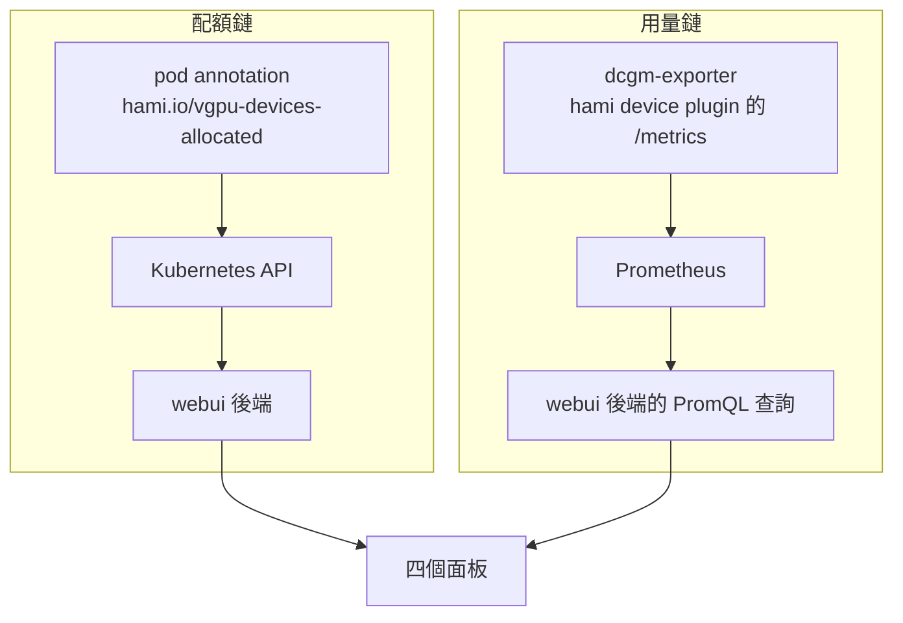
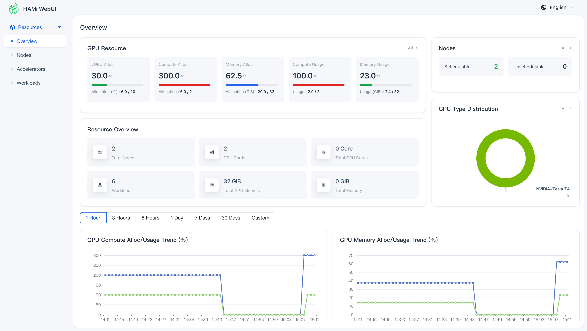
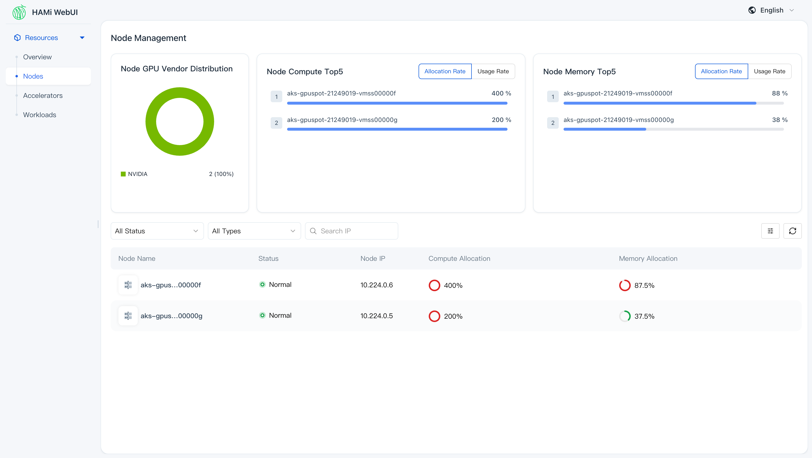
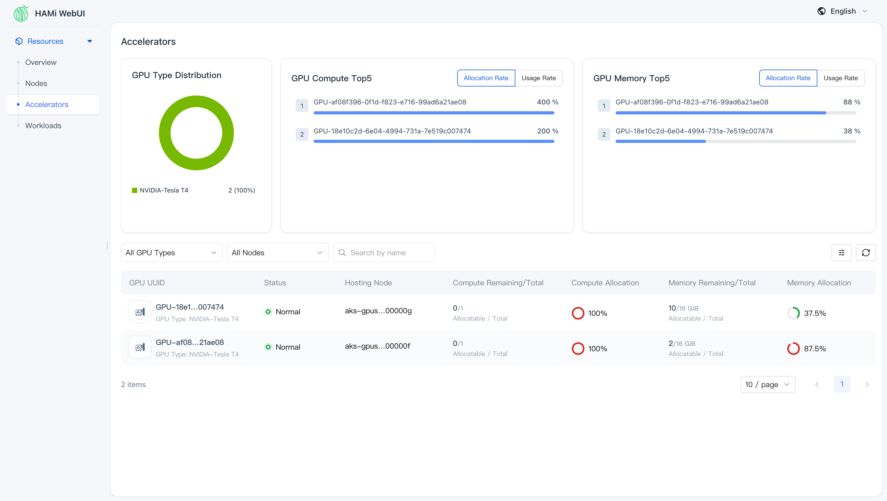
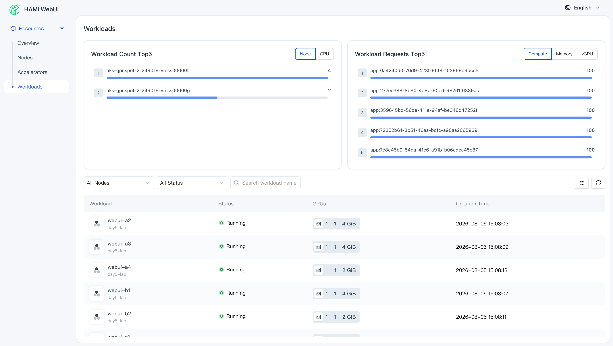
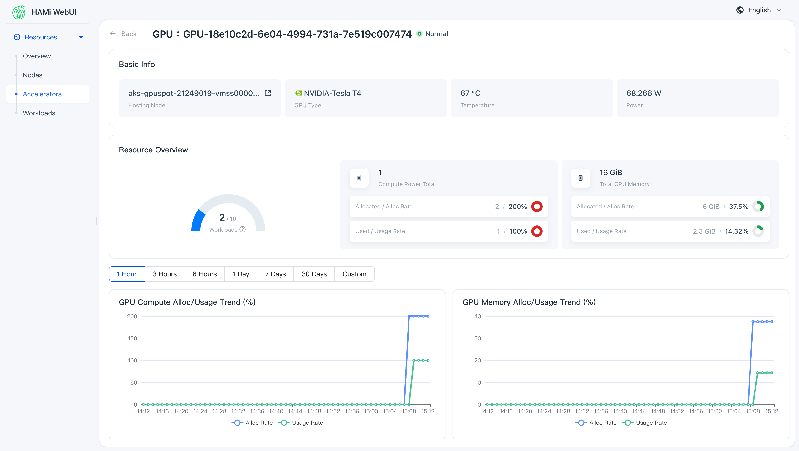

# Day 5: 安裝 HAMi-WebUI——GPU 配額與用量的儀表板

{ align=right width="100" }

> Day 4 結束時,「誰拿了多少 VRAM 」這件事散在三個地方:pod 的 `hami.io/vgpu-devices-allocated` annotation、節點的 `hami.io/node-nvidia-register`,以及 scheduler extender 那支只能 port-forward 才讀得到的 `/metrics`。三處都要自己 `kubectl` 或 `curl` 撈一次才拼得出全貌,而其中一處還掛著一個刪掉一小時的 namespace 的舊數字。今天把這些數字接到一個現成的網頁介面上,讓「哪張卡剩多少、哪顆 pod 佔了哪一塊」變成打開就看得到的一頁。路上會遇到裝任何觀測介面都躲不掉的同一個問題:畫面上顯示 0,到底是真的沒人用,還是資料根本沒送到。

!!! abstract "你在課程的哪裡"
    - **Day 3–4**:切卡會了,但帳本散在 annotation、節點物件與 metrics 三處。
    - **今天**:裝 HAMi-WebUI 和一套剝到最小的 Prometheus。驗收:四個面板都有真資料,配額鏈與用量鏈都接通。
    - **Day 6**:離開 device plugin 的整數世界,學下一代的資源表達。

## 原理與架構

Day 3 到 Day 4 為止,查一次帳的成本是這樣的:`kubectl get pod -o jsonpath` 撈 annotation 知道誰配到哪張卡、`kubectl get node -o json` 撈 `capacity` 與 `hami.io/node-nvidia-register` 知道卡本身多大、再 port-forward 一次 `hami-scheduler` 的 9395 埠讀 device 維度的 metrics。三道指令、三種輸出格式,而且每加一台節點就要重來一次。這種查法拿來追一顆跑錯的 pod 還行,拿來回答「現在整座叢集的卡滿了沒」就不夠用。

HAMi 官方為這件事另外開了一個子專案。它跟 HAMi 本體不在同一個 repo、不在同一條版本線、也不是 HAMi chart 的一部分——是獨立的 chart、獨立的 release,名字叫 **HAMi-WebUI**(本課程用 chart / appVersion `1.2.0`)。它把上面那三道指令的結果包成一組 HTTP API,前面接一個 SPA 前端,分成四個面板:

| 面板 | 回答的問題 |
|---|---|
| Overview | 整座叢集配出去多少、實際用掉多少 |
| Nodes | 哪一台節點的卡快滿了 |
| Accelerators | 每一張實體卡的配額、用量、溫度、功耗 |
| Workloads | 每一顆 pod 拿了哪張卡的哪一塊 |

### 真正的前置條件:一整套 Prometheus Operator

官方安裝文件的前置條件寫著「Prometheus > 2.8.0」,照字面讀會以為叢集裡有一顆 Prometheus 就夠了。把 chart 拉下來讀 `templates/` 會看到另一件事:chart 產出三份 **ServiceMonitor**(webui 自己、HAMi device plugin、dcgm-exporter),而 ServiceMonitor 是 `monitoring.coreos.com/v1` 的 CRD。沒有 Prometheus Operator,這個 CRD 就不存在,三份物件建不出來,`helm install` 在第一次 apply 就會失敗。

所以真正的前置條件是一整套 Prometheus Operator。chart 給了兩條路:

| 路 | 開關 | 意思 |
|---|---|---|
| (a) 外接 | `externalPrometheus.enabled=true` 加 `address` | 叢集裡已經有 Prometheus Operator 那一套,指過去 |
| (b) 自帶 | `kube-prometheus-stack.enabled=true` | 用 subchart 現拉一套 |

本叢集一套都沒有,所以只剩 (b);剩下的自由度是「這套 stack 能剝到多小」,步驟 2 會把它剝到只有兩顆 pod。

### 配額與用量走的是兩條不同的鏈

畫面上每個數字都有出處,而出處分成兩群——今天大半的地雷都長在其中一群上。



配額鏈短、同步、一裝就對:HAMi 排程當下寫進 pod annotation 的數字,後端讀一次 Kubernetes API 就拿得到。用量鏈長:節點上的 exporter 產生指標、Prometheus 定期抓走、後端再下 PromQL 把它算成每張卡與每顆 pod 的用量。長鏈的每一環都有自己的失敗方式,而它們共用同一種外顯症狀——**畫面顯示 0**。DaemonSet 沒鋪到 GPU 節點是 0,標籤被改名讓查詢命中不到是 0,後端連不上 Prometheus 也是 0,真的沒人用卡當然還是 0。這四種情況在畫面上長得一模一樣,分辨它們的方法卻各不相同,步驟 4 與步驟 5 就是在做這件事。

### 今天要走的路

環境沿用 Day 0 蓋的 AKS `<cluster>`(K8s v1.35.6)、`gpuspot` pool 兩台 `Standard_NC4as_T4_v3`(各一張 16 GB T4,spot)、system pool 一台 2 vCPU 的 `Standard_D2as_v5`,Day 1 裝的 KAI Scheduler v0.16.8 全程保留但不參與。六段:重裝 HAMi 並驗 Day 4 留下的殘留、把 WebUI 連同它剝小的 Prometheus 裝起來、佈六顆不對稱的切卡負載、不開瀏覽器先用 curl 驗資料、把用量那條鏈接通、最後逐頁走讀畫面。收尾附一段真實 spot 回收的觀測案例——兩台 GPU 節點被 Azure 平台收走,前後過程完整留在趨勢圖上,拿來看這個介面在節點消失時顯示什麼剛剛好。workload 全部放在 `day5-lab` namespace。

## 步驟

### 步驟 1:重裝 HAMi,順便驗一次 Day 4 的殘留清單

照 Day 0 的開機循環把 GPU pool 拉回兩台:

```bash
az aks nodepool scale -g <resource-group> --cluster-name <cluster> -n gpuspot \
  --subscription <subscription-id> --node-count 2
```

```text
11:44:44  scale 0→2 下達
11:49:56  兩台 Ready(5 分 12 秒)
          aks-gpuspot-21249019-vmss00000d
          aks-gpuspot-21249019-vmss00000e
```

[Day 4 地雷 5](sprint1-day4-hami-kai-integration.md#mine-5) 記錄了 `helm uninstall hami` 之後留在叢集裡的四樣東西,今天正好是「下一次」,逐項回查:

```text
hami 相關 secret         → 一個都沒有(Day 4 結束時已刪 hami-scheduler-tls)
namespace                → 只剩 default／kai-*／kube-*,空殼 ns 已清
webhook                  → 只剩 mutating-kai-admission 加 AKS 自己的三個
節點 hami.io/* annotation → 兩台都是空的
節點 nvidia.com/gpu       → capacity 與 allocatable 都不存在
```

五項全乾淨,但原因分兩種。secret 與空 namespace 是 Day 4 結束時手動刪的;節點 annotation 與 `capacity` 這兩項則是因為節點根本是新的——Day 4 那兩台 `…00000b`／`…00000c` 連同殘留一起被 scale-to-0 銷毀,今天開起來的是 `…00000d`／`…00000e`。

這給了一條在 spot 或可縮放節點池上很省事的規則:**寫在 node 物件上的髒東西,把池子縮到 0 就免費清掉了**。長生命週期的固定節點沒有這個機制,那些 annotation 會一直留著,誤導下一套方案。

裝 HAMi 之前沿用 Day 3 那道映像存在性預檢,先問一次阿里雲 registry 有沒有對應 K8s 版本的 `kube-scheduler`:

```bash
TOK=$(curl -s "https://dockerauth.cn-hangzhou.aliyuncs.com/auth?service=registry.aliyuncs.com:cn-hangzhou:26842&scope=repository:google_containers/kube-scheduler:pull" | jq -r .token)
curl -s -o /dev/null -w "%{http_code}\n" -H "Authorization: Bearer $TOK" \
  -H "Accept: application/vnd.docker.distribution.manifest.list.v2+json" \
  https://registry.cn-hangzhou.aliyuncs.com/v2/google_containers/kube-scheduler/manifests/v1.35.6
```

回 `200`,預設值可用。安裝值 `01-hami-values.yaml` 與 Day 3 一字未改(device plugin 帶 spot toleration,scheduler 與 patch job 釘 system pool):

```bash
cat > 01-hami-values.yaml <<'EOF'
devicePlugin:
  tolerations:
    - key: kubernetes.azure.com/scalesetpriority
      operator: Equal
      value: spot
      effect: NoSchedule

scheduler:
  nodeSelector:
    agentpool: system
  patch:
    nodeSelector:
      agentpool: system
EOF

helm install hami hami-charts/hami --version 2.9.0 \
  -n kube-system -f 01-hami-values.yaml
```

```text
11:50:27  install 下達
11:50:44  install 返回(17 秒)
11:51:00  hami-device-plugin ×2 ContainerCreating／hami-scheduler 已 2/2 Running
11:51:40  兩台節點 allocatable nvidia.com/gpu = 10   ← install 到切片就緒共 73 秒

hami.io/node-nvidia-register =
  [{"id":"GPU-3a42fadb-…","count":10,"devmem":16384,"devcore":100,
    "type":"NVIDIA-Tesla T4","mode":"hami-core","health":true}]
```

同一份值,換到全新的節點上、在 KAI 已經佔著一個 admission webhook 的叢集裡,73 秒把兩張 T4 切成 20 份 vGPU。

### 步驟 2:把 WebUI 連同一套剝到最小的 Prometheus 裝起來

`helm pull hami-webui/hami-webui --version 1.2.0 --untar` 之後,`Chart.yaml` 的相依講得很白:

```yaml
dependencies:
- name: dcgm-exporter          version: 3.5.0    condition: dcgm-exporter.enabled          # default true
- name: kube-prometheus-stack  version: 62.6.0   condition: kube-prometheus-stack.enabled  # default false
```

chart 自己的 values 已經先關掉 alertmanager、grafana、nodeExporter、defaultRules 與 kubernetesServiceMonitors。要跑起來還得改三個設定,兩個是打開(否則根本裝不成)、一個是關掉:

```bash
cat > 02-hami-webui-values.yaml <<'EOF'
nodeSelector:
  agentpool: system

kube-prometheus-stack:
  enabled: true
  crds:
    enabled: true                      # chart default false; without it there is no ServiceMonitor CRD
  kubeStateMetrics:
    enabled: false
  prometheusOperator:
    enabled: true                      # chart default false; without it nobody reconciles the Prometheus CR
    admissionWebhooks:
      enabled: false
    tls:
      enabled: false
    nodeSelector:
      agentpool: system
  prometheus:
    prometheusSpec:
      nodeSelector:
        agentpool: system
      retention: 6h
      resources:
        requests:
          cpu: 100m
          memory: 400Mi
        limits:
          memory: 1Gi
EOF
```

這是安裝當下的版本。[地雷 1](#mine-1) 的 `externalPrometheus`、[地雷 3](#mine-3) 的 `hamiServiceMonitor.honorLabels`、[地雷 4](#mine-4) 的 `dcgm-exporter.tolerations`(連同一段明寫整卡視野的 `dcgm-exporter.extraEnv`:`NVIDIA_VISIBLE_DEVICES=all` 與 `NVIDIA_DRIVER_CAPABILITIES=all`)都是踩到對應地雷之後才補上的修正——照這一版裝,才會依序撞到那三顆雷。

chart 內建的 `prometheus.prometheusSpec.serviceMonitorSelector.matchLabels.jobRelease=hami-webui-prometheus` 保留不動。這一行是 stack 剝小之後仍然安全的關鍵:這顆 Prometheus 只撿本 chart 打了那個標籤的三份 ServiceMonitor,不會去掃整座叢集的每一個 Service,所以它的記憶體用量與叢集規模無關。

裝完的相依足跡:

| 元件 | 數量／落位 | 說明 |
|---|---|---|
| `hami-webui`(fe + be) | 1 pod／2 容器,system pool | 前端 node server:3000、後端 Go:8000 |
| `hami-webui-kube-prometheus-operator` | 1 pod,system pool | 只為了 reconcile 那顆 Prometheus |
| `prometheus-hami-webui-kube-prometheus-prometheus-0` | 1 pod／2 容器,system pool | 單副本、emptyDir、6h retention |
| `hami-webui-dcgm-exporter` | DaemonSet 2 pod,GPU 節點 | 真實使用率／溫度／功耗 |
| CRD | 10 個(kube-prometheus-stack 的) | 隨 release 生滅 |

多出來的常駐 pod 共 4 顆,其中 2 顆在 GPU 節點上,system pool 沒有加開節點。

```bash
helm repo add hami-webui https://project-hami.github.io/HAMi-WebUI && helm repo update hami-webui
helm install hami-webui hami-webui/hami-webui --version 1.2.0 \
  -n kube-system -f 02-hami-webui-values.yaml
```

```text
11:51:16  install 下達
11:51:30  install 返回(14 秒)
11:51:35  五份物件全部建立,三份 ServiceMonitor 也在
11:51:58  operator 1/1、prometheus 2/2、dcgm-exporter 2 顆 Running
11:52:15  hami-webui 2/2 Running
```

pod 全綠,Prometheus 五個 target 也全部 `up`,但後端 log 每秒噴一行 `no such host`——chart 算給後端的 Prometheus 位址與 subchart 實際建出來的 Service 名字對不上,詳見[地雷 1](#mine-1)。把位址改成明寫的那一版之後 `helm upgrade` 成功、ConfigMap 也確實更新了,後端卻繼續噴同一個舊 host 的錯([地雷 2](#mine-2))。補一道 `kubectl -n kube-system rollout restart deploy/hami-webui` 才算數,而這道 restart 又卡了三分鐘([地雷 6](#mine-6))——2 vCPU 的 system pool 裝得下這三套,卻放不下任何一次預設策略的滾動更新。

### 步驟 3:佈六顆配額不對稱的切卡負載

畫面上有東西可看的前提是負載本身有層次。六顆 pod 的 VRAM 配額刻意做成不對稱,兩張卡的滿度差一倍:

| 節點 | pod | VRAM 配額(MiB) | 卡上合計 |
|---|---|---|---|
| `…00000d` | webui-a1 / a2 / a3 / a4 | 4096 / 4096 / 4096 / 2048 | 14336 / 16384,4/10 vGPU |
| `…00000e` | webui-b1 / b2 | 4096 / 2048 | 6144 / 16384,2/10 vGPU |

每顆容器持續跑 4096×4096 的 matmul 並常駐一塊 VRAM ,用量那條鏈才有真實數字可算,而不是零負載的空殼。manifest 用 `nodeSelector: kubernetes.io/hostname` 把 pod 釘在指定節點上,而節點名每次重建都會變,所以檔案裡寫的是佔位符,套用前先換掉:

六顆的規格只差四個值(名字、節點、常駐 VRAM、配額),用一張表配一段迴圈生出來:

```bash
while read -r name node hold mem; do
  cat <<EOF
---
apiVersion: v1
kind: Pod
metadata:
  name: $name
  namespace: day5-lab
  labels: { demo: hami-webui }
spec:
  restartPolicy: Never
  nodeSelector: { kubernetes.io/hostname: $node }
  tolerations:
    - key: kubernetes.azure.com/scalesetpriority
      operator: Equal
      value: spot
      effect: NoSchedule
  containers:
    - name: app
      image: pytorch/pytorch:2.5.1-cuda12.4-cudnn9-runtime
      env: [{ name: HOLD_MIB, value: "$hold" }]
      command: ["python", "-u", "-c", "import torch,os,time\nprint('total_MiB =', torch.cuda.get_device_properties(0).total_memory//1024//1024, flush=True)\nhold = torch.empty(int(os.environ['HOLD_MIB'])*1024*1024//4, dtype=torch.float32, device='cuda')\nhold.fill_(1.0)\na = torch.randn(4096,4096, device='cuda'); b = torch.randn(4096,4096, device='cuda')\ni = 0\nwhile True:\n    for _ in range(20):\n        c = a @ b\n    torch.cuda.synchronize(); i += 1\n    if i % 20 == 0:\n        print('iter', i, 'reserved_MiB', torch.cuda.memory_reserved()//1024//1024, flush=True)\n    time.sleep(0.2)\n"]
      resources:
        limits:
          nvidia.com/gpu: 1
          nvidia.com/gpumem: $mem
EOF
done > 03-webui-workloads.yaml <<'TABLE'
webui-a1 NODE_A_PLACEHOLDER 1024 4096
webui-a2 NODE_A_PLACEHOLDER 1024 4096
webui-a3 NODE_A_PLACEHOLDER 1024 4096
webui-a4 NODE_A_PLACEHOLDER 512  2048
webui-b1 NODE_B_PLACEHOLDER 1024 4096
webui-b2 NODE_B_PLACEHOLDER 512  2048
TABLE
```

兩個佔位符換成自己叢集當下的兩台 GPU 節點 hostname(`kubectl get nodes` 查),再送進 `kubectl`:

```bash
sed -e 's/NODE_A_PLACEHOLDER/aks-gpuspot-21249019-vmss00000d/' \
    -e 's/NODE_B_PLACEHOLDER/aks-gpuspot-21249019-vmss00000e/' 03-webui-workloads.yaml | \
kubectl apply -f -
```

```text
11:52:10  apply(映像已由 prepuller DaemonSet 預熱)
11:52:59  六顆全部 Running(49 秒)

容器裡看到的是切片:
  webui-a1  total_MiB = 4096      webui-a4  total_MiB = 2048
  webui-b1  total_MiB = 4096

pod annotation(HAMi 的帳本):
  webui-a1  GPU-3a42fadb-…,NVIDIA,4096,0:;
  webui-a4  GPU-3a42fadb-…,NVIDIA,2048,0:;
  webui-b1  GPU-361043c7-…,NVIDIA,4096,0:;
```

### 步驟 4:不開瀏覽器,先用 curl 把數字對一次

畫面對不對,先不看畫面。前端與後端各開一個埠(`3000` 與 `8000`),兩邊直接打都會給人錯覺:對前端打 `/api/v1/nodes` 回 200 加一整頁 HTML,那是 SPA 的 fallback;對後端打 `/v1/nodes` 回 404。兩邊都有回應,兩邊都不是答案。

真正的路由表要從兩個地方湊出來:後端的 proto 定義(`server/api/v1/*.proto`)給路徑與方法,前端容器裡的 proxy 設定給前綴。

```yaml
# /apps/dist/config/production/proxy.js, inside the frontend container
vgpu:
  target: 'http://127.0.0.1:8000'
  pathRewrite: { '^/api/vgpu': '' }
```

| 瀏覽器實際打的路徑(:3000) | 後端路由 | 方法 | 用途 |
|---|---|---|---|
| `/api/vgpu/v1/summary` | `/v1/summary` | POST | 首頁統計 |
| `/api/vgpu/v1/nodes` | `/v1/nodes` | POST | 節點列表 |
| `/api/vgpu/v1/gpus` | `/v1/gpus` | POST | 顯卡列表 |
| `/api/vgpu/v1/containers` | `/v1/containers` | POST | 任務列表 |
| `/api/vgpu/v1/monitor/query/instant-vector` | 同左 | POST | 圖表用的 PromQL 代打 |
| `/health_check` | —(前端自己) | GET | 存活探測 |

全部是 POST,而且請求體不能是空物件——送 `{}` 會回 500,看起來像伺服器故障([地雷 5](#mine-5))。帶上空的 `filters` 就通了:

```bash
kubectl -n kube-system port-forward svc/hami-webui 13000:3000
curl -s -X POST -H 'Content-Type: application/json' -d '{"filters":{}}' \
  http://127.0.0.1:13000/api/vgpu/v1/summary
```

```json
{"vgpuUsed":6,"vgpuTotal":20,"coreUsed":600,"coreTotal":200,
 "memoryUsed":20480,"memoryTotal":32768,"gpuCount":2,"nodeCount":2}
```

六顆任務、20 份 vGPU 用掉 6 份、32768 MiB 配出 20480 MiB、兩張卡兩台節點,跟步驟 3 的表格逐格對得上(4096×3 + 2048 + 4096 + 2048 = 20480)。節點與顯卡兩個端點也一樣:

```json
{"list":[
 {"name":"aks-gpuspot-21249019-vmss00000d","ip":"10.224.0.5","isSchedulable":true,"isReady":true,
  "type":["NVIDIA-Tesla T4"],"cardCnt":1,
  "vgpuUsed":4,"vgpuTotal":10,"memoryUsed":14336,"memoryTotal":16384,
  "osImage":"Ubuntu 24.04.4 LTS","kubeletVersion":"v1.35.6"},
 {"name":"aks-gpuspot-21249019-vmss00000e","ip":"10.224.0.6",
  "vgpuUsed":2,"vgpuTotal":10,"memoryUsed":6144,"memoryTotal":16384, …}]}

{"list":[
 {"uuid":"GPU-361043c7-…","nodeName":"…00000e","vgpuUsed":2,"vgpuTotal":10,
  "memoryUsed":6144,"memoryTotal":16384,"mode":"hami-core","health":true},
 {"uuid":"GPU-3a42fadb-…","nodeName":"…00000d","vgpuUsed":4,"vgpuTotal":10,
  "memoryUsed":14336,"memoryTotal":16384,"mode":"hami-core","health":true}]}
```

`mode: "hami-core"` 這個欄位是 Day 3 與 Day 4 一路追的那個 `libvgpu.so` 攔截模式,它一路傳到了 UI 上。任務列表要多帶一個 `pageSize`:

```bash
curl -s -X POST -H 'Content-Type: application/json' \
  -d '{"filters":{},"pageSize":{"pageSize":50,"pageNo":1}}' \
  http://127.0.0.1:13000/api/vgpu/v1/containers
```

```text
count = 6
 webui-a1  …00000d  ns=day5-lab  mem= 4096  cores=100  success  GPU-3a42fadb…
 webui-a2  …00000d  ns=day5-lab  mem= 4096  cores=100  success  GPU-3a42fadb…
 webui-a3  …00000d  ns=day5-lab  mem= 4096  cores=100  success  GPU-3a42fadb…
 webui-a4  …00000d  ns=day5-lab  mem= 2048  cores=100  success  GPU-3a42fadb…
 webui-b1  …00000e  ns=day5-lab  mem= 4096  cores=100  success  GPU-361043c7…
 webui-b2  …00000e  ns=day5-lab  mem= 2048  cores=100  success  GPU-361043c7…
```

到這裡為止,配額鏈完整驗過一遍,而且是逐格對帳,不是看畫面猜。這個做法在沒有瀏覽器的環境(跳板機、CI)一樣能用,而且比截圖精確。

### 步驟 5:把用量那條鏈接通

上面那份任務列表裡,`cores` 與 `mem` 都是配額。用量在另一組欄位,而它們此刻全是 0。Prometheus 五個 target 全部 `up`:

```text
hami-webui-dcgm-exporter    10.244.1.250:9400  up
hami-webui-dcgm-exporter    10.244.2.44:9400   up
hami-device-plugin-monitor  10.244.1.143:9394  up
hami-device-plugin-monitor  10.244.2.201:9394  up
hami-webui                  10.244.0.135:8000  up
```

而且 `hami_vgpu_memory_used_bytes` 在 Prometheus 裡查得到真實數值。指標有、target 有、後端也活著,數字卻是 0——問題出在後端那句 PromQL 的標籤條件與實際存進 Prometheus 的標籤對不上,原因與修法見[地雷 3](#mine-3)。打開 `hamiServiceMonitor.honorLabels` 約 90 秒後,同一組指標長出真值:

```text
webui-a1 => 1410.1 MiB    webui-a2 => 1410.1 MiB    webui-a3 => 1410.1 MiB
webui-a4 =>  898.1 MiB    webui-b1 => 1410.1 MiB    webui-b2 =>  898.1 MiB
hami_container_core_util:webui-a1/a3/a4 = 100、b1/b2 = 96
```

用量鏈上另一環是 dcgm-exporter,它負責溫度、功耗與整卡使用率。chart 預設的 `nodeSelector` 剛好對上我們的節點標籤,`tolerations` 卻是空的,而 GPU 節點帶著 spot taint——這一環壞掉的方式特別安靜,連 Pending pod 都不會有([地雷 4](#mine-4))。本次的安裝值已經先補上 toleration,所以沒有實際發作,另用一份探針 DaemonSet 把它的樣子複現出來。透過 UI 自己的 PromQL 代打端點查整卡使用率:

```bash
curl -s -X POST -H 'Content-Type: application/json' -d '{"query":"DCGM_FI_DEV_GPU_UTIL"}' \
  http://127.0.0.1:13000/api/vgpu/v1/monitor/query/instant-vector
```

```text
aks-gpuspot-…00000d  gpu 0 => 100
aks-gpuspot-…00000e  gpu 0 => 100
```

兩張卡都被 matmul 壓在 100%。至此節點、顯卡、任務三個層級都有真實數字,可以看畫面了。

看之前先記一件事,免得誤讀首頁:`/v1/summary` 回的是 `coreUsed=600 / coreTotal=200`,也就是 300%。六顆 pod 都沒有寫 `nvidia.com/gpucores`,HAMi 對未宣告的 pod 一律以 100 計(等於不限制),UI 就把六個 100 加起來,分母則是卡數。**算力那一欄在沒有明寫 `gpucores` 的叢集裡是「請求數 × 100」**,拿它做容量規劃會得到很奇怪的結論; VRAM 那一欄才是硬帳。

### 步驟 6:四個面板逐頁走讀

以下五張畫面取自同一組工作負載的第二輪佈署,節點是 `…00000f`／`…00000g`,配額組成與前面完全相同,只有節點名與 GPU UUID 換了。為什麼會有第二輪,下一節說明。



*Overview:上排把「配出去多少」與「實際用掉多少」分成兩組並排,下方兩張趨勢圖記著本日的回收事件。*

第一排五張卡就是兩條資料鏈的分界線。左邊三張是配額鏈:`vGPU Alloc 30.0%`(6/20)、`Compute Alloc 300.0%`(6/2,就是上面那個「請求數 × 100」)、`Memory Alloc 62.5%`(20.0/32 GiB)。右邊兩張是用量鏈:`Compute Usage 100.0%`(2.0/2)、`Memory Usage 23.0%`(7.4/32 GiB)。兩條鏈並排在同一排的好處是斷線一眼看得出來——右邊歸零而左邊正常,問題一定在 Prometheus 那一段,不必先懷疑 HAMi。`Resource Overview` 六格則與 `/v1/summary` 逐格對得上;其中 `Total CPU Cores` 與 `Total Memory` 是 0,這兩格與 GPU 無關,而本次剝掉的 node-exporter 與 kube-state-metrics 正是這類指標的供應者。



*Nodes:兩張 Top5 排行榜直接指出負載偏在哪一台,清單只留五個欄位。*

`Node Compute Top5` 與 `Node Memory Top5` 是排行榜而非總量:`…00000f` 是 400%／88%,`…00000g` 是 200%／38%。同一組 pod 刻意分得不平均,這裡就直接看得到偏斜。下方清單只有五欄——名稱、狀態、IP、兩個分配率,節點頁要回答的問題只有「哪台快滿了」,再細的東西在卡片頁。



*Accelerators:排行榜右上角的 Allocation／Usage 切換,切的就是兩條資料鏈。*

排行榜右上角那組 `Allocation Rate`／`Usage Rate` 按鈕值得停一下:同一份排行榜、同一組卡,切換的是資料來源。`GPU Compute Top5` 的 400% 與 200% 沿用步驟 5 那條規則:一張卡上四顆 pod 各記 100 得到 400,另一張兩顆得到 200,分母都是一張卡。這個數字不代表卡被佔用了四倍,只代表卡上有四顆 pod 而且都沒宣告算力上限。`GPU Memory Top5` 的 88% 與 38% 才是硬帳,對應清單裡 `Memory Remaining/Total` 的 `2/16 GiB` 與 `10/16 GiB`,也就是 14336/16384 與 6144/16384。



*Workloads:六顆 pod 各自拿到幾張卡、幾份 vGPU、多少 VRAM ,以及那個 400% 拆開之後的樣子。*

清單每一列的 `GPUs` 欄有三個數字:整卡數、vGPU 份數、 VRAM 配額,`webui-a2` 是 `1 / 1 / 4 GiB`,`webui-a4` 是 `1 / 1 / 2 GiB`,與 manifest 一致。右上 `Workload Requests Top5` 切到 `Compute` 之後全部是 100,這就是 400% 拆開來的樣子;順帶一提這份排行榜列的是容器 ID 而不是 pod 名稱,要對到具體哪顆 pod 得回清單查。



*卡片詳情:配額與用量在同一格上下並排,溫度與功耗則整格依賴 dcgm-exporter。*

`Basic Info` 的 `67 °C` 與 `68.266 W` 只有 dcgm-exporter 供得出來,這兩格空白就等於[地雷 4](#mine-4)。`Resource Overview` 把四個數字上下並排:算力 `Allocated 2 / 200%` 對 `Used 1 / 100%`, VRAM `Allocated 6 GiB / 37.5%` 對 `Used 2.3 GiB / 14.32%`。同一格裡看配額與用量的落差,是這個介面比 `kubectl` 好用的地方——配額吃掉 37.5%,實際只用 14.32%,超配的空間有多大一目瞭然。左邊那個 `2 / 10 Workloads` 儀表的分母 10,則是 HAMi 的 `deviceSplitCount`。

### 步驟 7:讀一次真實 spot 回收在畫面上留下的痕跡

驗證做完約一個半小時後,兩台 GPU spot 節點被 Azure 回收。Day 2 那次是 `az vmss simulate-eviction` 模擬出來的,這次是平台自己發起的。

| 時間(CST) | 發生的事 |
|---|---|
| 13:54:04 | 受管 resource group 的 activity log 出現 `Microsoft.Compute/virtualMachineScaleSets/evictSpotVM/action`,平台發起,沒有任何人下過指令 |
| 14:44 前後 | 第二台也走了,趨勢圖上兩條線同時落到 0 |
| 其後 | pool 的 `count` 收斂為 0、`provisioningState: Succeeded`;放叢集的那個 resource group,activity log 上一道操作都沒有 |
| 15:08 | scale 回 2,新節點 `…00000f`／`…00000g` |

第一台走掉之後、第二台還在的那段時間,Accelerators 頁上只剩一張卡,配額與用量都照常更新——一半的叢集不見了,而畫面本身沒有任何異常標記。這是[Day 2 地雷 4](sprint1-day2-gang-scheduling-preemption.md#mine-4) 的自然重演:pool 沒有開 cluster autoscaler,沒有人負責把 `count` 補回期望值;而放叢集的 resource group 上零 ARM 操作,只查這個 resource group 的 activity log 不會有任何線索。當時那條結論是用模擬做出來的,這次沒有人動手,結果一模一樣。

回頭看 Overview 那兩張趨勢圖,整段過程都在上面:

- 14:11 到 14:43 之間,`Compute Alloc` 是 200%、`Memory Alloc` 是 37.5%——那是只剩一張卡、上面掛兩顆 pod 的中間態,不是正常值。
- 14:44 兩條線一起掉到 0,並且在 0 上維持了二十多分鐘。
- 15:08 之後跳到 300% 與 62.5%,六顆 pod 全部回來。

一張圖上同時看得到三個狀態,是這種缺口最有用的地方:光看當下的數字沒辦法分辨「本來就這麼少」和「剛剛掉下去」,而趨勢圖把時間軸補上了。卡片詳情頁則是另一種痕跡——那張卡的兩條線在 15:08 之前完全是平的 0,因為節點重建之後 GPU UUID 是新的,舊卡的歷史不會跟著搬過來。**要看事件跨越回收前後,得看叢集或節點層級的圖,不要看單卡的圖。**

復原本身很快:pool scale 回 2,HAMi 的 device plugin 靠 pool 層級的 `gpu=on` 標籤自動接手,`vgpuTotal` 立刻回到 20,控制面一個字都不用改。要重來一次的是那六顆 workload。`03-webui-workloads.yaml` 裡的 `NODE_A_PLACEHOLDER`／`NODE_B_PLACEHOLDER` 是刻意的佔位符,沒有先 `sed` 換成當下的 hostname 就直接 apply,得到的是六顆永遠 Pending 的 pod,而 `hami-scheduler` 給的事件只有一句 `didn't match Pod's node affinity/selector`——它不會告訴你那個 hostname 已經不存在了。

這是把 pod 用 `kubernetes.io/hostname` 釘死在 spot 節點上的天然代價。這裡刻意這樣寫,是為了讓兩張卡的配額不對稱、畫面有層次;正式環境要指定放置位置,用 pool 層級的標籤(`agentpool`、`gpu=on`)或[Day 4 步驟 1](sprint1-day4-hami-kai-integration.md) 那組 `hami.io/node-scheduler-policy` annotation,兩者都活得過節點重建。

### 步驟 8:縮回 0,並確認畫面歸零是預期行為

GPU pool 縮回 0,WebUI 與 HAMi 兩個 release 都留著。控制面全部釘在 system pool,資料面(device plugin、dcgm-exporter)跟著 GPU 節點生滅,所以跨日重開機的操作成本是零——這一點從 Day 3 到今天沒變過。

縮容之後 UI 上節點、顯卡、任務會全部歸零,配額鏈與用量鏈同時斷在同一個地方(節點沒了,device plugin 與 exporter 也沒了)。這是預期行為,不是安裝壞掉。另外 `hami-webui` 的 Deployment 上帶著一道手動 patch 的 `maxSurge: 0`,下一次 `helm upgrade` 會把它打回預設值,要記得重下([地雷 6](#mine-6))。

## 驗收 checkpoint

| 檢查項 | 指令 | 期待結果 |
|---|---|---|
| 三份 ServiceMonitor 真的建出來 | `kubectl -n kube-system get servicemonitor` | webui／hami／dcgm 三份都在,缺任一份就是 CRD 沒開 |
| 後端連得到 Prometheus | `kubectl -n kube-system get cm hami-webui-config -o yaml` 對照 `get svc` | ConfigMap 裡的 host 與實際 Service 名稱逐字相同 |
| dcgm-exporter 鋪到每台 GPU 節點 | `kubectl -n kube-system get ds hami-webui-dcgm-exporter` | `DESIRED` 等於 GPU 節點數,不是 0 |
| 配額鏈正確 | `curl -X POST -d '{"filters":{}}' …/v1/summary` | `memoryUsed` 等於各 pod 配額總和(本課 20480/32768) |
| 用量鏈正確 | 任務列表的用量欄位 | 六顆都是非 0(本課 1410.1／898.1 MiB),全 0 就去查 `honorLabels` |
| 整卡使用率有讀數 | `curl -X POST -d '{"query":"DCGM_FI_DEV_GPU_UTIL"}' …/monitor/query/instant-vector` | 每張卡一筆,壓力測試下為 100 |
| 算力那一欄看得懂 | Overview 的 `Compute Alloc` | 等於「有 GPU 的 pod 數 × 100 ÷ 卡數」,不是實際佔用比例 |

## 地雷記錄

### 地雷 1:自帶的 Prometheus 裝好了,後端卻連不上——那個位址是 chart 用舊規則算出來的 {#mine-1}

**症狀**:所有 pod `Running`、Prometheus 五個 target 全 `up`,UI 打得開、節點與任務清單也對,只有跟用量有關的數字全是 0。後端 log 每秒一行:

```text
Error querying Prometheus: Post "http://hami-webui-kube-prometh-prometheus.kube-system.svc.cluster.local:9090/api/v1/query":
dial tcp: lookup ... no such host
```

**根因**:`externalPrometheus.enabled=false` 時,chart 的 `templates/configmap.yaml` 用一段寫死的字串去湊自帶 Prometheus 的位址:

```text
printf "http://%s-kube-prometh-prometheus.%s.svc.cluster.local:9090" (fullname) (namespace)
```

但 subchart(kube-prometheus-stack)實際建出來的 Service 叫 `...-kube-prometheus-prometheus`。`kube-prometh` 對 `kube-prometheus`——chart 抄的是舊版的名稱截斷規則,subchart 早就換了。兩邊都不會報錯,因為 ConfigMap 裡那只是一段文字。

**修法**:即使用的就是自帶那一套,也改走外接開關,把位址明寫出來:

```yaml
externalPrometheus:
  enabled: true
  address: "http://hami-webui-kube-prometheus-prometheus.kube-system.svc.cluster.local:9090"
```

**教訓**:pod 全綠與元件互相找得到是兩件事。裝完任何有內部呼叫的套件,先看被呼叫端的 log,或把 `kubectl get cm <x>-config -o yaml` 算出來的位址跟 `kubectl get svc` 的實際名字對一次。這種名字漂移在「chart 內嵌 subchart」的組合裡特別常見,因為兩邊的版本各自演進。

### 地雷 2:`helm upgrade` 改了 ConfigMap,pod 完全不知道 {#mine-2}

**症狀**:位址改完 `helm upgrade` 成功(REVISION 2),`kubectl get cm hami-webui-config` 也確實是新位址,後端卻繼續噴同一個舊 host 的錯誤,pod 的 `AGE` 也沒歸零。

**根因**:後端的設定是以檔案掛進去的(`--conf /apps/config/config.yaml`),而 chart 的 Deployment 沒有 `checksum/config` 這類 annotation。pod template 一個字都沒變,Kubernetes 認為沒事發生,不重建 pod,容器裡那份設定還是啟動當下讀進去的。

**修法**:`kubectl -n kube-system rollout restart deploy/hami-webui`。

**教訓**:這是同一條通用規則的另一個面貌——改了 ConfigMap 或 Secret 就要自己重啟消費者。判斷方式很機械:`helm get manifest` 看 Deployment 的 pod template 裡有沒有任何會隨設定改變的欄位(annotation 或 env),沒有就一定要手動 rollout。

### 地雷 3:每個任務的用量永遠是 0——Prometheus 把標籤改了名 {#mine-3}

**症狀**:位址修好、target 全 `up`、`hami_vgpu_memory_used_bytes` 在 Prometheus 裡查得到真實數值(1.38 GiB),但後端輸出的 `hami_container_memory_used` 與 `hami_container_core_util` 每一筆都是 0。UI 上每個任務的用量欄位因此全空,只有配額是對的。

**根因**:後端對 Prometheus 下的查詢長這樣:

```text
avg(hami_vgpu_memory_used_bytes{device_uuid="GPU-…", namespace="day5-lab", pod="webui-a1", container="app"})
```

但 chart 的 `hamiServiceMonitor.honorLabels` 預設 `false`。Prometheus 抓 HAMi device plugin 的 metrics 時,會把 exporter 自己帶的 `namespace`／`pod` 標籤改名成 `exported_namespace`／`exported_pod`,再把 `namespace`／`pod` 換成「被抓的那顆 pod」:

```text
{ namespace="kube-system", pod="hami-device-plugin-l9d9m",
  exported_namespace="day5-lab", exported_pod="webui-a1", container="app" } => 1478624256
```

查詢條件與實際標籤永遠對不上,命中 0 筆,後端老實地寫 0。

**修法**:

```yaml
hamiServiceMonitor:
  honorLabels: true
```

套下去約 90 秒後(Prometheus 重載加上後端下一輪計算),六顆任務的用量全部出現真值。

**教訓**:「數字是 0」跟「查不到資料」在 Prometheus 這條鏈上長得一模一樣。分辨方法是把後端那句 PromQL 原封不動貼到 Prometheus 自己查一次:查得到,問題在後端;查不到,就去比對 exporter 輸出的標籤與存進去之後的標籤。只要看到 `exported_` 前綴,就是 `honorLabels` 在作用。

### 地雷 4:dcgm-exporter 的 `tolerations` 預設是空的,在 spot GPU pool 上一顆都不裝 {#mine-4}

**症狀**:配額都對,真實使用率、溫度、功耗全空。chart 的 `dcgm-exporter.nodeSelector` 預設就是 `gpu: "on"`,剛好對上我們的節點標籤,看起來什麼都不用改。

**根因**:`tolerations` 預設 `[]`,而 GPU 節點帶著 `kubernetes.azure.com/scalesetpriority=spot:NoSchedule`。DaemonSet 遇到不能容忍的 taint 不會產生 Pending pod,它直接把那些節點算成「不需要」。複製一份同樣 `nodeSelector: gpu=on`、不帶 toleration 的 DaemonSet 上去驗證:

```text
NAME               DESIRED   CURRENT   READY   NODE SELECTOR
toleration-probe   0         0         0       gpu=on
```

`DESIRED` 就是 0。`kubectl get pods` 什麼都看不到,`kubectl describe` 也沒有事件,沒有任何東西會提醒你少裝了。

**修法**:補上與 HAMi device plugin 同一段 toleration。

```yaml
dcgm-exporter:
  tolerations:
    - { key: kubernetes.azure.com/scalesetpriority, operator: Equal, value: spot, effect: NoSchedule }
```

**教訓**:驗 DaemonSet 不要看 pod,要看 `DESIRED` 對不對——應該有 N 台就要是 N。`0` 與「有 Pending」是完全不同的病:前者代表排程器根本沒被問到,後者才是資源不夠。這條與 [Day 0 地雷 1](sprint1-day0-azure-aks-foundation.md#mine-1) 是同一個判準的兩次應用。

### 地雷 5:資料 API 全是 POST,而且 `filters` 不可省略——送 `{}` 回 500 {#mine-5}

**症狀**:`curl -X POST -d '{}' …/v1/nodes` 回 `{"code":500,"reason":"UNKNOWN","message":"unknown request error"}`。500 看起來像伺服器壞了,於是開始查後端 log、查 Prometheus、查 RBAC,而那些地方都沒問題。

**根因**:proto 定義的請求體是 `GetAllNodesReq { Filters filters = 1; }`。送 `{}` 時 `filters` 是 nil,後端沒有防呆就往下取值。送 `{"filters":{}}` 立刻 200。

**修法**:所有列表端點一律帶空的 `filters` 物件;`/v1/containers` 另外要 `pageSize`:

```bash
curl -s -X POST -H 'Content-Type: application/json' \
  -d '{"filters":{},"pageSize":{"pageSize":50,"pageNo":1}}' \
  http://127.0.0.1:13000/api/vgpu/v1/containers
```

**教訓**:對 gRPC-gateway 或 Kratos 這類「proto 產生 HTTP」的服務,500 常常是請求體結構不合,而不是伺服器故障。與其猜,直接去 repo 讀 `.proto`——路由、方法、每個欄位的名字都在裡面,比翻文件快。順帶一提 `/v1/monitor/summary` 在 v1.2.0 回 `501 method Summary not implemented`,那是官方還沒實作。

### 地雷 6:2 vCPU 的 system pool 塞得下這三套,卻塞不下任何一次滾動更新 {#mine-6}

**症狀**:`rollout restart deploy/hami-webui` 之後卡了三分鐘,新 pod 一直 Pending,舊 pod 好好地跑著,`rollout status` 直接 timeout。

```text
0/3 nodes are available: 1 Insufficient cpu, 2 node(s) had untolerated taint(s).
preemption: 0/3 nodes are available: 1 No preemption victims found for incoming pod.
```

**根因**:裝完 HAMi、WebUI 與 Prometheus 之後,system 節點的 CPU requests 是 1779m / 1900m(93%)。Deployment 預設的 RollingUpdate 是 `maxSurge: 25%`,單副本時等於「先起新的、再殺舊的」,而 webui 一顆就要 250m。兩份同時存在放不下,新的排不進去,舊的不會被殺,於是互相卡住。裝的當下完全看不出來,要等第一次更新才發作。

**修法**:兩選一。加開一台 system 節點(每台約 NT$3.5/hr),或把策略改成先殺後起:

```bash
kubectl -n kube-system patch deploy hami-webui \
  -p '{"spec":{"strategy":{"type":"RollingUpdate","rollingUpdate":{"maxSurge":0,"maxUnavailable":1}}}}'
```

本次採後者,代價是更新期間有幾十秒空窗,對觀測介面完全可以接受。這道 patch 是 `kubectl` 直接下的,下一次 `helm upgrade` 會被打回預設值,要重下一次。

**教訓**:單節點控制面要看的不是「還剩多少」,而是「最大的那顆 pod 能不能複製一份」。判準寫成一行:`最大 pod 的 requests × 2 ≤ 剩餘可配置量`,不成立就代表所有預設 RollingUpdate 都會卡住。

## 帶得走的東西

- 觀測介面上的 0 有很多種來源。今天遇到的就有四種:後端連不上 Prometheus、標籤被改名讓查詢命中不到、DaemonSet 靜默沒鋪、以及真的沒人用卡。要分辨它們,得先知道每個數字走的是哪一條鏈——短鏈(annotation 到 Kubernetes API)出問題會整片壞掉很明顯,長鏈(exporter 到 Prometheus 到 PromQL)出問題只會安靜地少一塊。
- 前置條件寫「需要 Prometheus」時,先確認需要的是一顆 Prometheus 還是一整套 Operator。判斷方法很直接:去 chart 的 `templates/` 看有沒有 CRD 型別的物件。有 ServiceMonitor 就代表要 Operator,而這件事很少寫在前置條件那一段。
- 內嵌 subchart 的 chart 有一類特有的老化方式:父 chart 用寫死的規則去猜子 chart 建出來的資源名稱,子 chart 改版之後就對不上,而兩邊都不會報錯。裝完先把設定裡算出來的位址跟 `kubectl get svc` 對一次,比讀完整份 values 划算。
- 儀表板上的比率不一定是佔用率。HAMi 的算力欄在沒有明寫 `gpucores` 的叢集裡是請求數的加總,400% 只代表卡上有四顆 pod, VRAM 欄才是真正會擋住下一顆 pod 的那本帳。拿任何一個新介面做容量決策之前,先找一個已知答案的場景把數字對過。
- spot 節點被回收之後,趨勢圖比即時數字有用。當下的數字沒辦法告訴你叢集本來就這麼小還是剛剛少了一半,而缺口的形狀會。不過歷史是綁在物件身上的:節點重建之後 GPU UUID 就換了,單卡那張圖看不到回收前的自己。

## 延伸閱讀

想往下深挖,從這幾份開始:

- **[HAMi-WebUI 專案首頁](https://github.com/Project-HAMi/HAMi-WebUI)** —— 本章主題的原始碼,後端 `server/api/v1/*.proto` 的路由定義與 `server/internal/exporter/exporter.go` 的 PromQL 查詢都在裡面,對應[地雷 3](#mine-3) 與[地雷 5](#mine-5)。
- **[HAMi-WebUI Helm 安裝指南](https://github.com/Project-HAMi/HAMi-WebUI/blob/main/docs/installation/helm/index.md)** —— 官方的前置條件(Prometheus > 2.8.0)與 `externalPrometheus.address` 的寫法,本章步驟 2 兩條路的出處。
- **[Prometheus scrape_config 設定說明](https://prometheus.io/docs/prometheus/latest/configuration/configuration/)** —— `honor_labels` 的完整定義,包含「設為 false 時衝突標籤會被改名成 `exported_<原名>`」這句話,[地雷 3](#mine-3) 的根因就在這一段。
- **[NVIDIA dcgm-exporter](https://github.com/NVIDIA/dcgm-exporter)** —— `DCGM_FI_DEV_GPU_UTIL` 等指標的定義與 DaemonSet 部署方式,卡片詳情頁的溫度、功耗、整卡使用率全部由它供應。

## 下一步

今天畫面上每一個 GPU 相關的數字,追到底都是同一組東西撐起來的:一個整數型的擴充資源 `nvidia.com/gpu`、幾條寫在 pod annotation 裡的自訂字串、外加一支 exporter 把執行期的真實狀況補上。Day 3 到 Day 5 一路看到的限制也都長在這個基礎上——VRAM 要靠資源名或 annotation 夾帶、卡的規格要靠節點標籤推導、一個節點上的 `nvidia.com/gpu` 只能有一個供應者,而 UI 想講清楚「這顆 pod 拿了哪張卡的哪一塊」,得自己把三個來源拼起來。

Kubernetes 為此準備了一套新的表達方式,叫 Dynamic Resource Allocation。裝置不再是節點上的一個整數,而是可以被描述、被挑選、被宣告用途的物件。Day 6 先在不燒 GPU 的環境把它的概念與物件模型走一遍,看它把今天這些繞路各自搬到了哪裡。

---

!!! quote ""
    HAMi 與 HAMi-WebUI 標誌為該專案之官方資產,此處作社群教學用途。
