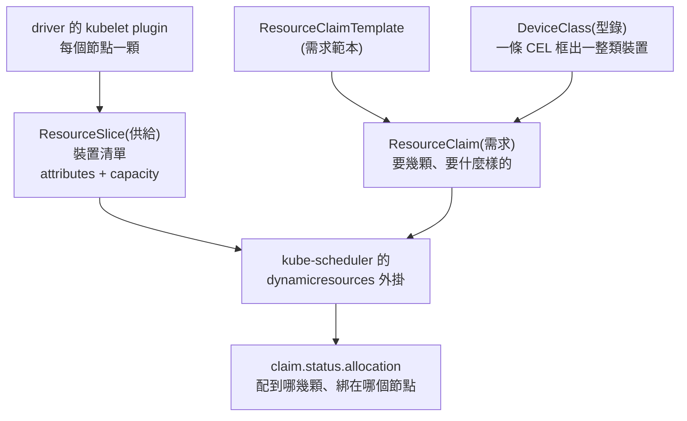

# Day 6: DRA 基礎——用模擬裝置學 ResourceClaim、DeviceClass 與 CEL

{ align=right width="95" }

> Day 0 到 Day 5,叢集裡的卡從頭到尾是同一種東西:節點上一個叫 `nvidia.com/gpu` 的整數。要表達「我只要 4 GB」,HAMi 得另外發明 `nvidia.com/gpumem` 這個資源名,再配一支攔在 CUDA 前面的函式庫才擋得住([Day 3](sprint1-day3-hami-memory-isolation.md));要把同一個數字交給另一套排程器,得先換算成兩位小數的卡比例,進位誤差直接吃掉一個租戶的位置([Day 4 地雷 6](sprint1-day4-hami-kai-integration.md#mine-6))。整數能表達「幾顆」,表達不了「哪一顆」——挑 VRAM 大於某個門檻的卡、排掉某個世代的型號、讓兩顆 pod 明確持有同一顆裝置,這些在 `resources.limits` 那一格裡寫不出來,只能推給節點標籤、annotation 與自訂資源名去繞。Kubernetes 1.34 把另一套表達方式收成正式版:Dynamic Resource Allocation(DRA)。裝置在這套 API 裡是有屬性、可以被查詢語言挑選、可以被具名持有的物件。今天不開真卡,用官方的模擬 driver 把四個 API 物件與 CEL 選擇器整套走一遍。

!!! abstract "你在課程的哪裡"
    - **Day 0–5**:device plugin 世界的排程與切分都走過了,它的表達力天花板也撞過了。
    - **今天**:用模擬 driver 走完 DRA 的四個 API 與 CEL 選擇器。驗收:條件式挑裝置、排除特定型號、兩顆 pod 具名共用同一個裝置,全部演過。
    - **Day 7**:同一套 API,換真卡。

## 原理與架構

### 四個物件:誰供貨、誰分類、誰下單、誰代下單

DRA 的 API 全在 `resource.k8s.io/v1` 這個群組底下,核心只有四個型別,分工乾淨到可以各用一句話講完。

- **ResourceSlice——供給。**節點上的 driver 自己 publish 的物件,內容是「這台節點有哪些裝置、每顆的屬性(`attributes`)與容量(`capacity`)是什麼」。叢集層級的物件,但每一份都掛著 `nodeName`。
- **DeviceClass——型錄。**叢集層級,內容是一條 CEL 表達式,把符合條件的裝置框成一類。管理員先定義「這叢集有哪幾種裝置可以被要求」,使用者才在需求裡引用類別名稱。
- **ResourceClaim——需求。**namespace 層級,內容是「我要幾顆、要什麼樣的」。它同時也是持有憑證:`status.allocation` 記著配到哪幾顆,`status.reservedFor` 記著誰正在用。
- **ResourceClaimTemplate——需求範本。**同樣是 namespace 層級,但它不會被引用,而是**被實體化**:每一顆引用它的 pod 都生出一份專屬的 ResourceClaim。



pod 這一端的寫法也是兩段式,跟 device plugin 只有一格 `resources.limits` 明顯不同:pod 層的 `spec.resourceClaims` 宣告這顆 pod 會用到哪些 claim、各自從哪來(具名 claim 或 template),容器層的 `resources.claims` 再按名字引用。宣告來源與實際使用分開,是後面「兩顆 pod 指向同一個 claim」這種寫法能成立的前提。

### CEL 是挑裝置的語言

DeviceClass 與 ResourceClaim 裡的選擇條件都寫成 CEL(Common Expression Language)表達式,對每一顆候選裝置各求值一次,回傳 true 才留下。能比對的東西有三種:內建欄位 `device.driver`、driver 宣告的屬性 `device.attributes['<網域>'].<鍵>`、以及容量 `device.capacity['<網域>'].<鍵>`。屬性與容量都用「網域」分鍵,而網域就是 driver 名——這個設計是為了讓多個 driver 在同一顆節點上各自命名而不撞名,步驟 4 造異質性靠的就是這件事。

### 為什麼今天用一台 CPU 節點就夠

官方 quickstart 走的是 kind:本機起一個容器叢集、本機 build 映像、`kind load` 進去。本課程改走另一條路——在既有的 AKS `<cluster>` 上臨時開一個 CPU spot 節點池 `drasim`,跑 **kubernetes-sigs/dra-example-driver v0.4.0**。

換得動的理由在於這支 driver 的性質:它管的裝置是**模擬**出來的,不碰任何實體硬體,`numDevices: 8` 就憑空 advertise 八顆。而 DRA 從 ResourceSlice 發佈、CEL 過濾、排程器配置、到 kubelet 呼叫 driver 準備裝置,整條路徑對真卡與模擬裝置完全相同,差別只在最後一步注入容器的內容——真卡注入 `/dev/nvidia*` 與函式庫掛載,模擬裝置注入幾個環境變數。今天要學的是前面那整條路。

代價是一台 `Standard_D2as_v5`(2 vCPU／8 GB)spot 節點,japaneast 實際單價 US$0.020698／hr(約 NT$0.66／hr),`gpuspot` 全程 0 台。時間也省:CPU spot 節點 1 分 52 秒 Ready,而 Day 1 到 Day 5 每次把 GPU pool 拉起來都要五分鐘上下,差在 GPU 節點開機要跑 driver 安裝與裝置初始化。

### 今天要走的路

八段:查證映像拉不拉得到再開節點、問 apiserver 哪些 DRA 功能是開的、裝 driver 讀出第一份 ResourceSlice、把同一份 chart 換個名字再裝一次造出異質性、六組示範把核心 API 走一遍、回頭看節點物件上留下了什麼、卸載後盯著 ResourceSlice 何時消失、最後刪掉節點池結帳。KAI Scheduler v0.16.8、HAMi v2.9.0、HAMi-WebUI v1.2.0 全程留在叢集裡但不參與,步驟 6 會確認有沒有互相干擾。

## 步驟

### 步驟 1:先確認映像拉得到,再開節點

官方 quickstart 的 `./demo/build-driver.sh` 是在本機 build 映像再塞進 kind。本課程既沒有本機 docker、叢集也不是 kind,所以動手前的第一個判斷題是:有沒有一個公開、叢集拉得到的映像?答案若是沒有,今天就該停在這裡,而不是在叢集裡即興搞 in-cluster build。

chart 的 `values.yaml` 給了倉庫位址 `registry.k8s.io/dra-example-driver/dra-example-driver`,`tag` 留空時取 `Chart.yaml` 的 `appVersion`(`v0.4.0`)。直接對 registry 打 manifest,不必先拉整包映像:

```console
$ curl -sSL -o /dev/null -w "%{http_code} %{content_type}\n" \
    "https://registry.k8s.io/v2/dra-example-driver/dra-example-driver/manifests/v0.4.0" \
    -H "Accept: application/vnd.oci.image.index.v1+json, application/vnd.docker.distribution.manifest.list.v2+json"
200 application/vnd.docker.distribution.manifest.list.v2+json
```

回的是 manifest list,裡面三個平台(amd64／arm64／ppc64le),而第一個轉址落在 `asia-east1-docker.pkg.dev/v2/k8s-artifacts-prod/images/…`——`registry.k8s.io` 是官方的多雲映像前端,日本區的叢集拉的是亞太節點。**映像已公開發佈且匿名可拉,不需要任何本機 build**,kind 那條路是為了離線開發,不是唯一的路。

節點池照 Day 0 的規格開,只是換成 CPU:

```console
$ az aks nodepool add -g <resource-group> --cluster-name <cluster> -n drasim \
    --subscription <subscription-id> --node-count 1 --node-vm-size Standard_D2as_v5 \
    --priority Spot --eviction-policy Delete --spot-max-price -1 --labels pool=drasim --no-wait
16:02:01  下達 add
16:03:53  節點 Ready(1 分 52 秒):aks-drasim-30601265-vmss000000  v1.35.6
          labels: pool=drasim / kubernetes.azure.com/scalesetpriority=spot
          taints: kubernetes.azure.com/scalesetpriority=spot:NoSchedule
          allocatable: cpu=1900m  memory=5930728Ki  pods=250
```

後面所有 `nodeSelector` 與 toleration 都照這組標籤與汙點寫。

### 步驟 2:問 apiserver 哪些 DRA 功能是開的

DRA 的核心在 1.34 進 GA,但周邊功能有一大半還在 alpha,而**託管叢集不給改 feature gate**。AKS 沒有 apiserver 的 pod 可以 `describe`,也看不到啟動參數,唯一問得出真實狀態的地方是 metrics 端點:

```console
$ kubectl get --raw /metrics | grep 'kubernetes_feature_enabled' | grep -i DRA | sort
kubernetes_feature_enabled{name="DRAAdminAccess",stage="BETA"} 1
kubernetes_feature_enabled{name="DRAConsumableCapacity",stage="ALPHA"} 0
kubernetes_feature_enabled{name="DRADeviceBindingConditions",stage="ALPHA"} 0
kubernetes_feature_enabled{name="DRADeviceTaintRules",stage="ALPHA"} 0
kubernetes_feature_enabled{name="DRADeviceTaints",stage="ALPHA"} 0
kubernetes_feature_enabled{name="DRAExtendedResource",stage="ALPHA"} 0
kubernetes_feature_enabled{name="DRAPartitionableDevices",stage="ALPHA"} 0
kubernetes_feature_enabled{name="DRAPrioritizedList",stage="BETA"} 1
kubernetes_feature_enabled{name="DRAResourceClaimDeviceStatus",stage="BETA"} 1
kubernetes_feature_enabled{name="DRASchedulerFilterTimeout",stage="BETA"} 1
```

規則一目瞭然:beta 的一律 1、alpha 的一律 0。這張表直接決定今天能示範什麼——`gpuPartitions` 要 `DRAPartitionableDevices`、裝置分食容量要 `DRAConsumableCapacity`、用 `resources.limits` 要裝置要 `DRAExtendedResource`,三個都是 0,全部用不上;留下能用的是 `DRAResourceClaimDeviceStatus`(把裝置實況寫回 claim status)、`DRAPrioritizedList` 與 `DRAAdminAccess`。

**這一步的順序不能顛倒。**先裝好 driver 再回頭想示範怎麼配,會發現想做的多半做不了,而失敗的形狀是「設定寫了但什麼都沒發生」,查起來很費工([地雷 1](#mine-1))。

### 步驟 3:裝 driver,讀出第一份 ResourceSlice

安裝值的重點,每一行都對得上步驟 2 那張表:

```bash
cat > 01-dra-driver-values.yaml <<'EOF'
deviceProfile: "gpu"

image:
  repository: registry.k8s.io/dra-example-driver/dra-example-driver
  tag: "v0.4.0"
  pullPolicy: IfNotPresent

gpuDeviceStatus: true                # DRAResourceClaimDeviceStatus is BETA=1 here
gpuAllowMultipleAllocations: false   # needs DRAConsumableCapacity, which is 0

deviceClass:
  extendedResourceName: ""           # needs DRAExtendedResource, which is 0

kubeletPlugin:
  numDevices: 8
  gpuPartitions: 0                   # needs DRAPartitionableDevices, which is 0
  nodeSelector:
    pool: drasim
  tolerations:
    - key: kubernetes.azure.com/scalesetpriority
      operator: Equal
      value: spot
      effect: NoSchedule
  containers:
    plugin:
      resources:
        requests:
          cpu: 50m
          memory: 64Mi

controller:
  plugins: []

webhook:
  enabled: false
EOF
```

兩件事先講清楚。第一,`controller.plugins: []` 是 chart 預設值,而這個空清單會讓整份 `templates/controller-deployment.yaml` 不被渲染——模板外層包著 `{{- if .Values.controller.plugins }}`。這個 chart 的 controller 只服務 BindingConditions(本叢集該 gate 是 0),**不是 DRA 的必要元件**;整套 driver 只剩一個 per-node 的 DaemonSet,全部落在 `drasim` 上,system pool 一顆 pod 都沒多,[Day 5 地雷 6](sprint1-day5-hami-webui.md#mine-6) 那個 2 vCPU 塞不下滾動更新的問題今天不構成阻礙。第二,`numDevices: 8` 是唯一能調的裝置數量旋鈕,而且是**每個節點各 8 顆**。

```console
$ helm install dra-example-driver /tmp/dra-example-driver/deployments/helm/dra-example-driver \
    -n dra-example-driver --create-namespace \
    -f 01-dra-driver-values.yaml --wait --timeout 5m
16:04:22 → 16:04:29(7 秒)   STATUS: deployed   REVISION: 1

$ kubectl -n dra-example-driver get pods -o wide
dra-example-driver-kubeletplugin-dfqb4   1/1   Running   aks-drasim-30601265-vmss000000
$ kubectl get deviceclass ; kubectl get resourceslices
gpu.example.com   35s
NAME                                       NODE                             DRIVER            POOL
00000-gpu.example.com-aks-drasim-…-fffzn   aks-drasim-30601265-vmss000000   gpu.example.com   aks-drasim-…
```

七秒裝完。chart 建的那個 DeviceClass 內容只有一條 CEL——`device.driver == 'gpu.example.com'`,把這個 driver 的全部裝置框成一類。ResourceSlice 才是今天要讀懂的東西,八顆裝置結構相同,節錄第一顆與池資訊:

```yaml
spec:
  driver: gpu.example.com
  nodeName: aks-drasim-30601265-vmss000000
  pool: { generation: 1, name: aks-drasim-30601265-vmss000000, resourceSliceCount: 1 }
  devices:
  - name: gpu-0
    attributes:
      driverVersion: { version: 1.0.0 }
      index:         { int: 0 }
      model:         { string: LATEST-GPU-MODEL }
      uuid:          { string: gpu-a6fe3131-… }
    capacity: { compute: { value: "100" }, memory: { value: 80Gi } }
```

整理成表,右欄就是後面每一條 CEL 的素材:

| 位置 | 鍵 | 型別 | 值 | CEL 寫法 |
|---|---|---|---|---|
| `attributes` | `index` | int | 0–7 | `device.attributes['gpu.example.com'].index` |
| `attributes` | `uuid` | string | `gpu-<uuid>`,每顆不同 | `device.attributes['gpu.example.com'].uuid` |
| `attributes` | `model` | string | `LATEST-GPU-MODEL`(全部一樣) | `device.attributes['gpu.example.com'].model` |
| `attributes` | `driverVersion` | version | `1.0.0`(全部一樣) | `device.attributes['gpu.example.com'].driverVersion` |
| `capacity` | `memory` | quantity | `80Gi`(全部一樣) | `device.capacity['gpu.example.com'].memory` |
| `capacity` | `compute` | quantity | `100`(全部一樣) | `device.capacity['gpu.example.com'].compute` |
| 內建欄位 | `driver` | string | driver 名 | `device.driver` |

### 步驟 4:同一份 chart 裝兩次,造出兩個屬性網域

八顆裝置只有 `index` 與 `uuid` 會變,其餘全同。這不是設定沒調對,是原始碼寫死的——`internal/profiles/gpu/gpu.go` 裡 `memoryPerGPU` 固定 `80Gi`、`computePerGPU` 固定 `100`,而屬性表只有兩個欄位隨迴圈變:

```go
"model":         { StringValue:  ptr.To("LATEST-GPU-MODEL") },   // constant
"driverVersion": { VersionValue: ptr.To("1.0.0") },              // constant
```

把 chart 的旋鈕逐項對上步驟 2 那張 gate 表,能用與不能用切得很乾淨。可用的是 `numDevices`(每節點幾顆)、`deviceProfile`(裝置形狀,但 `net`／`cpu` 依賴 consumable capacity)、`driverName`(換 driver 名等於換屬性網域與 DeviceClass 名)、`gpuDeviceStatus`(把裝置實況寫回 claim status);不可用的三個各卡在一個 alpha gate 上:

| 旋鈕 | 效果 | 卡在哪個 gate |
|---|---|---|
| `kubeletPlugin.gpuPartitions` | 一顆切成 N 份,partition 與整顆的 memory 不同 | `DRAPartitionableDevices` |
| `gpuAllowMultipleAllocations` | 裝置可被多個 claim 依容量分食 | `DRAConsumableCapacity` |
| `deviceClass.extendedResourceName` | 讓 pod 用 `resources.limits` 要裝置 | `DRAExtendedResource` |

`gpuPartitions` 本來是**單一 driver 內**唯一能造出容量差異的路(partition 拿 `80Gi / N`、整顆拿 `80Gi`),偏偏就是被關掉的那一個(見[地雷 1](#mine-1))。裝置層造不出差異,就把差異做到 driver 層:同一份 chart、同一個 profile,只換 `driverName` 為 `retro-gpu.example.com`、`numDevices` 改成 3,再裝一次。

第二份值檔跟第一份的差別只有三處:多一行 `driverName`、裝置數改成 3、拿掉兩個本來就用不上的 alpha 開關。

```bash
cat > 02-dra-driver-retro-values.yaml <<'EOF'
deviceProfile: "gpu"
driverName: "retro-gpu.example.com"

image:
  repository: registry.k8s.io/dra-example-driver/dra-example-driver
  tag: "v0.4.0"
  pullPolicy: IfNotPresent

gpuDeviceStatus: true

kubeletPlugin:
  numDevices: 3
  nodeSelector:
    pool: drasim
  tolerations:
    - key: kubernetes.azure.com/scalesetpriority
      operator: Equal
      value: spot
      effect: NoSchedule
  containers:
    plugin:
      resources:
        requests:
          cpu: 50m
          memory: 64Mi

controller:
  plugins: []

webhook:
  enabled: false
EOF
```

```console
$ helm install retro-gpu … -f 02-dra-driver-retro-values.yaml --wait
16:05:42  STATUS: deployed

$ kubectl get resourceslices -o json | jq -r '.items[] | .spec.driver as $d |
    .spec.devices[] | "\($d)\t\(.name)\tmodel=\(.attributes.model.string)\tmem=\(.capacity.memory.value)"'
gpu.example.com         gpu-0 … gpu-7   model=LATEST-GPU-MODEL   mem=80Gi     (8 顆)
retro-gpu.example.com   gpu-0 … gpu-2   model=LATEST-GPU-MODEL   mem=80Gi     (3 顆)
```

同一顆節點上現在有 11 顆裝置、2 個 driver、2 個 DeviceClass。注意兩個 driver 的裝置名字**都叫 `gpu-0`**:DRA 的裝置識別是 `(driver, pool, device)` 三元組,名字只在 pool 內唯一,這也是為什麼 claim status 裡永遠三個欄位一起寫。兩個 kubelet plugin 能在同一顆節點共存,實測有兩個前提:DaemonSet 沒有用 `hostNetwork`(`templates/kubeletplugin.yaml` 裡沒有這個欄位,兩個 metrics port 8080 不會撞),以及 driver 名是靠 `DRIVER_NAME` 環境變數傳進去的,兩個實例各自向 kubelet 註冊成不同的 driver。

### 步驟 5:六組示範,把核心 API 走一遍

所有測試 pod 都釘在 `drasim`(`nodeSelector: pool=drasim` 加 spot toleration),映像用 `registry.k8s.io/e2e-test-images/busybox:1.36.1-1`——同樣先 `curl` 驗過 manifest 回 200 才寫進檔案,Docker Hub 的 `ubuntu:22.04` 在課程環境有 rate limit 風險。容器進來先 `env | sort` 再睡著,**driver 注入了什麼,看 pod log 就好**。

#### 5a. 最小可行:一份 template、一顆 pod、一顆裝置

```yaml
apiVersion: resource.k8s.io/v1
kind: ResourceClaimTemplate
metadata: { namespace: dra-3a, name: single-gpu }
spec:
  spec:
    devices:
      requests:
        - { name: gpu, exactly: { deviceClassName: gpu.example.com } }
---
kind: Pod
spec:
  containers:
    - name: ctr0
      resources: { claims: [ { name: gpu } ] }                  # container level: which claim
  resourceClaims:
    - { name: gpu, resourceClaimTemplateName: single-gpu }      # pod level: where it comes from
```

`pod0` 起來之後,namespace 裡多出一份叫 `pod0-gpu-mpm8x` 的 ResourceClaim,狀態是 `allocated,reserved`。名字的組成是 `<pod 名>-<claim 名>-<隨機碼>`,證明 template 是被實體化出來的,不是被引用。claim 的 status 分三塊,各自有不同的寫入者:

```yaml
status:
  allocation:                          # written by the scheduler
    devices:
      results:
      - { device: gpu-0, driver: gpu.example.com, pool: aks-drasim-…, request: gpu }
    nodeSelector:                      # the claim is now pinned to this node
      nodeSelectorTerms:
      - matchFields:
        - { key: metadata.name, operator: In, values: [ aks-drasim-30601265-vmss000000 ] }
  devices:                             # written by the driver, needs gpuDeviceStatus
  - device: gpu-0
    driver: gpu.example.com
    data: { driverVersion: { version: 1.0.0 }, model: { string: LATEST-GPU-MODEL }, uuid: { string: gpu-a6fe3131-… } }
  reservedFor:                         # who currently holds it
  - { name: pod0, resource: pods }
```

`allocation` 裡那段 `nodeSelector` 是排程器回填的:claim 一旦配置成功,就綁死在提供裝置的那顆節點上。pod 裡看得到的則是 driver 注入的環境變數:

```console
$ kubectl -n dra-3a logs pod0 | grep -E 'GPU_DEVICE|DRA_RESOURCE'
DRA_RESOURCE_DRIVER_NAME=gpu.example.com
GPU_DEVICE_0=gpu-0
GPU_DEVICE_0_SHARING_STRATEGY=TimeSlicing
GPU_DEVICE_0_TIMESLICE_INTERVAL=Default
GPU_DEVICE_GPU_0_RESOURCE_CLAIM=f8bb6f0b-…
```

做這件事的是 **CDI(Container Device Interface)**:driver 在 `NodePrepareResources` 回傳 CDI device ID,containerd 據此改寫容器規格。真卡 driver 在這一步注入 `/dev/nvidia*` 節點與函式庫掛載,模擬 driver 注入幾個環境變數,機制相同,只有 payload 不同。

#### 5b. CEL 門檻:可滿足與不可滿足各一顆

兩份 template 只差一個數字。`quantity()` 與 `.compareTo()` 是 Kubernetes CEL 的量詞擴充,**不能直接寫 `>= '40Gi'`**,那是字串比較。

```yaml
# gpu-mem-40gi:  80Gi >= 40Gi  → all 8 devices qualify
- cel: { expression: "device.capacity['gpu.example.com'].memory.compareTo(quantity('40Gi')) >= 0" }
# gpu-mem-160gi: 80Gi < 160Gi  → none qualify
- cel: { expression: "device.capacity['gpu.example.com'].memory.compareTo(quantity('160Gi')) >= 0" }
```

```console
$ kubectl -n dra-3b get pods,resourceclaims
pod/pod-ok             1/1   Running       resourceclaim/pod-ok-gpu-j2fhr           allocated,reserved → gpu-1
pod/pod-impossible     0/1   Pending       resourceclaim/pod-impossible-gpu-kh2gk   pending → (無)

$ kubectl -n dra-3b describe pod pod-impossible | tail -5
Warning  FailedScheduling  default-scheduler
  0/2 nodes are available: 1 cannot allocate all claims,
  1 node(s) didn't match Pod's node affinity/selector.
  still not schedulable, preemption: 0/2 nodes are available:
  2 Preemption is not helpful for scheduling.
```

`cannot allocate all claims` 就是 `dynamicresources` 這個排程外掛的全部回覆,資訊量比 device plugin 時代的 `Insufficient nvidia.com/gpu` 還少([地雷 2](#mine-2))。

#### 5c. 排除式選擇:把某個世代的裝置整批篩掉

先自建一個**跨 driver** 的 DeviceClass `mixed-gpu.example.com`,選擇器寫 `device.driver == 'gpu.example.com' || device.driver == 'retro-gpu.example.com'`,把步驟 4 造出來的異質性框進同一類。三顆 pod 各測一種排除法:

| pod | 選擇器 | 預期 | 實際 |
|---|---|---|---|
| `pod-not-retro` | `mixed` 類別加 `device.driver != 'retro-gpu.example.com'` | 只能拿到新型號 | Running,配到 `gpu.example.com/gpu-2` |
| `pod-not-bleeding-edge` | `model != 'BLEEDING-EDGE-GPU'`(排掉不存在的型號) | 8 顆全合格 | Running,配到 `gpu-3` |
| `pod-not-latest` | `model != 'LATEST-GPU-MODEL'`(排掉唯一存在的型號) | 全被排掉 | Pending |

```console
$ kubectl -n dra-3c get resourceclaims -o json | jq -r '.items[] |
    "\(.metadata.name)\t\(.status.allocation.devices.results // [] | map("\(.driver)/\(.device)") | join(","))"'
pod-not-bleeding-edge-gpu-xfs9w   gpu.example.com/gpu-3
pod-not-latest-gpu-rpcd4          (空)
pod-not-retro-gpu-24pkg           gpu.example.com/gpu-2
```

`pod-not-retro` 這一列的意義最大:候選集裡確實有 11 顆裝置、其中 3 顆屬於被排除的 driver,最後落在合格的那 8 顆裡。**不需要事先給節點貼標籤、不需要把不同世代的卡分到不同節點池,一條 CEL 就在裝置層級解決。**device plugin 那套要做同一件事,粒度只到節點。

#### 5d. 一個 request 要兩顆

`exactly` 裡加上 `allocationMode: ExactCount` 與 `count: 2`,一個 request 就會展開成兩筆配置結果:

```console
$ kubectl -n dra-3d get resourceclaims -o json | jq …
pod-two-gpus-q6z79   gpu.example.com/gpu-4@req=gpus,gpu.example.com/gpu-5@req=gpus

$ kubectl -n dra-3d logs pod-two | grep GPU_DEVICE
GPU_DEVICE_4=gpu-4
GPU_DEVICE_4_SHARING_STRATEGY=TimeSlicing
GPU_DEVICE_4_TIMESLICE_INTERVAL=Default
GPU_DEVICE_5=gpu-5
GPU_DEVICE_5_SHARING_STRATEGY=TimeSlicing
GPU_DEVICE_5_TIMESLICE_INTERVAL=Default
GPU_DEVICE_GPU_4_RESOURCE_CLAIM=7ba5eeb3-…
GPU_DEVICE_GPU_5_RESOURCE_CLAIM=7ba5eeb3-…
```

兩顆不同的裝置、同一個 claim UID,而兩筆 `results` 的 `request` 欄位都是 `gpus`——這是 `count` 的展開,不是兩個 request。

#### 5e. 共享與獨佔的左右對照

這一組是 device plugin 表達不出來的語意,所以證據做成左右兩邊同時跑。左邊一個**具名 ResourceClaim** `shared-gpu`,兩顆 pod 都寫 `resourceClaimName: shared-gpu`;右邊一份 **ResourceClaimTemplate**,兩顆 pod 各自實體化一份。

```console
$ kubectl -n dra-3e get pods
own-a 1/1 Running    own-b 0/1 Pending    share-a 1/1 Running    share-b 1/1 Running

$ kubectl -n dra-3e get resourceclaims -o json | jq …
own-a-gpu-z6rlc   gpu-7   reservedFor=own-a
own-b-gpu-j5qrn   (空)    reservedFor=(空)
shared-gpu        gpu-6   reservedFor=share-a,share-b

$ kubectl -n dra-3e logs share-a | grep GPU_DEVICE
GPU_DEVICE_6=gpu-6
GPU_DEVICE_GPU_6_RESOURCE_CLAIM=a88a00a8-…
$ kubectl -n dra-3e logs share-b | grep GPU_DEVICE
GPU_DEVICE_6=gpu-6
GPU_DEVICE_GPU_6_RESOURCE_CLAIM=a88a00a8-…
```

兩顆 pod 拿到同一顆 `gpu-6`,而且是**同一個 claim UID**——不是各自被配到剛好相同的裝置,是同一個 claim 物件被兩顆 pod 同時 reserve。`own-b` 的 Pending 把對照做得更完整,當下全叢集的帳本:

```text
dra-3a/pod0-gpu-mpm8x                    gpu-0            pods=pod0
dra-3b/pod-ok-gpu-j2fhr                  gpu-1            pods=pod-ok
dra-3b/pod-impossible-gpu-kh2gk          (空)
dra-3c/pod-not-retro-gpu-24pkg           gpu-2            pods=pod-not-retro
dra-3c/pod-not-bleeding-edge-gpu-xfs9w   gpu-3            pods=pod-not-bleeding-edge
dra-3c/pod-not-latest-gpu-rpcd4          (空)
dra-3d/pod-two-gpus-q6z79                gpu-4, gpu-5     pods=pod-two
dra-3e/shared-gpu                        gpu-6            pods=share-a, share-b    ← 2 顆 pod 吃 1 顆
dra-3e/own-a-gpu-z6rlc                   gpu-7            pods=own-a               ← 1 顆 pod 吃 1 顆
dra-3e/own-b-gpu-j5qrn                   (空)             pods=(空)                ← 沒得配了
```

`gpu-0` 到 `gpu-7` 全滿。`share-a` 加 `share-b` 兩顆 pod 只花掉**一顆**裝置;`own-a` 加 `own-b` 要花掉**兩顆**,第八顆被 `own-a` 拿走之後 `own-b` 就 Pending。同樣兩顆 pod,共享寫法的裝置消耗量是獨佔寫法的一半,而差別只在 manifest 裡一個欄位名:`resourceClaimName` 對 `resourceClaimTemplateName`。

#### 5f. 生命週期:誰跟著 pod 走,誰要自己收

先刪掉 template 產生的那份 claim 的消費者,claim 跟著 pod 一起消失,原因寫在物件上:

```console
16:09:26 $ kubectl -n dra-3a delete pod pod0
16:09:38 $ kubectl -n dra-3a get resourceclaims
          No resources found in dra-3a namespace.

$ kubectl -n dra-3d get resourceclaim pod-two-gpus-q6z79 -o json | jq '{finalizers, owner}'
{ "finalizers": [ "resource.kubernetes.io/delete-protection" ],
  "owner": [ { "kind": "Pod", "name": "pod-two", "controller": true } ] }
```

template 產生的 claim 帶著一個指向 pod 的 ownerReference,pod 一死就被垃圾回收;`delete-protection` finalizer 則保證裝置先被 unprepare 才真的刪掉。`gpu-0` 一釋放,剛才卡住的 `own-b` 立刻補上,而 kubelet plugin 的 log 把整條因果鏈記了下來:

```text
08:09:27.254  "UnprepareResourceClaims is called" numClaims=1                     ← pod0 走
08:09:27.699  "Preparing claim" namespace="dra-3e" name="own-b-gpu-j5qrn"         ← own-b 接手
08:09:27.724  "Returning newly prepared devices for claim" devices=[{"DeviceName":"gpu-0",
              "CDIDeviceIDs":["k8s.gpu.example.com/gpu=common",
                              "k8s.gpu.example.com/gpu=fc30f0da-…-gpu-0"]}]
```

0.5 秒內完成交接。這段 log 也攤開了 CDI 的兩段式 device ID:一個 `common`(所有裝置共用的容器編輯),一個 `<claimUID>-<device>`(該次配置專屬)。具名 claim 那一邊要另外看,兩個消費者逐一離開:

```console
16:09:49 $ kubectl -n dra-3e delete pod share-a
          shared-gpu   gpu-6   reservedFor=share-b       ← 還在,因為 share-b 還活著
16:09:58 $ kubectl -n dra-3e delete pod share-b
          shared-gpu   pending   allocation: NULL   reservedFor=(空)
```

具名 claim 沒有指向任何 pod 的 ownerReference,它是使用者自己建的,所以物件不會消失;但只要 `reservedFor` 清空,配置就被釋放,`status.allocation` 變回 `null`、狀態回到 `pending`。營運上的差別因此很好記:**template 寫法的 claim 生命週期等於 pod 的生命週期,不留垃圾;具名 claim 忘了刪,漏掉的是一個 API 物件,不是一顆裝置**。

### 步驟 6:回頭看節點物件,裡面什麼都沒有

八顆裝置正被佔用的當下,節點物件長這樣:

```console
$ kubectl describe node aks-drasim-30601265-vmss000000
Capacity / Allocatable:  只有 cpu、ephemeral-storage、hugepages-1Gi、hugepages-2Mi、memory、pods 六項

Non-terminated Pods:          (16 in total)
  Namespace   Name                    CPU Requests  CPU Limits  Memory Requests  Memory Limits
  dra-3a      pod0                    0 (0%)        0 (0%)      0 (0%)           0 (0%)
  dra-3b      pod-ok                  0 (0%)        0 (0%)      0 (0%)           0 (0%)
  dra-3c/3d/3e   pod-not-bleeding-edge / pod-not-retro / pod-two / own-a / share-a / share-b …
```

11 顆裝置、8 顆已配置,`Capacity` 與 `Allocatable` 裡一個字都沒有;八顆正在用裝置的 pod,在節點的資源帳本上全部是 `0 (0%)`([地雷 3](#mine-3))。三種方案並排,差異一目瞭然——三欄都是本課程的實測:

| | 資源在節點物件上長什麼樣 | 查「誰佔了什麼」看哪裡 |
|---|---|---|
| device plugin(Day 0／3) | `Capacity` 與 `Allocatable` 都有 `nvidia.com/gpu: 1`,`Allocated resources` 直接算給你看 | `describe node` 就夠 |
| HAMi(Day 3–4) | 一樣是擴充資源(`nvidia.com/gpu`、`nvidia.com/gpumem`),切卡帳本另外塞在 `hami.io/*` annotation | `describe node` 加解析 annotation 加 WebUI |
| DRA(本日) | 完全不出現,節點物件上零痕跡 | `kubectl get resourceslices`(供給)加 `kubectl get resourceclaims -A`(需求) |

[Day 3 地雷 2](sprint1-day3-hami-memory-isolation.md#mine-2) 記過 `nvidia.com/gpumem` 查不到餘額,那還只是少一行;DRA 這裡是整套資源都不在節點物件上。排程器那一側能拿到的線索同樣少:AKS 是託管控制面,`kube-scheduler` 沒有 pod 可看,`kubectl -n kube-system get pods` 撈 scheduler 只撈得到 Day 3 裝的 `hami-scheduler`。所以 `dynamicresources` 外掛的 trace 在託管叢集上唯一看得到的形式,就是 pod 事件那一行 `cannot allocate all claims`;真正詳細的一手紀錄在 kubelet plugin 那邊,5f 引的 `UnprepareResourceClaims` → `Preparing claim` → `Returning newly prepared devices` 就是。**在託管 K8s 上診斷 DRA,driver 的 DaemonSet log 比排程器事件有用得多。**

至於共存:KAI Scheduler、HAMi、HAMi-WebUI 全程 Running,本日所有 pod 都走預設的 `default-scheduler`,`gpuspot` 維持 0 台,沒有任何干擾。DRA 走的是 `resource.k8s.io` 這一整套獨立的 API 與獨立的排程外掛,跟擴充資源那條路沒有交集,這正是它們能在同一叢集共存的原因。

### 步驟 7:卸載,並確認 ResourceSlice 什麼時候才真的消失

刪掉測試負載之後,`resourceclaims` 全叢集歸零,但 chart 建的兩個 DeviceClass 還在——driver 還沒卸。接著卸兩個 release,並在卸載前後各數一次 ResourceSlice:

```console
16:15:37 $ kubectl get resourceslices --no-headers | wc -l
         2                                        ← 卸載前
16:15:37 $ helm uninstall dra-example-driver retro-gpu -n dra-example-driver
         release "dra-example-driver" uninstalled / release "retro-gpu" uninstalled

16:15:52 $ kubectl get resourceslices           ← 卸載後 15 秒
00000-gpu.example.com-aks-drasim-…-fffzn   gpu.example.com         …
00000-retro-gpu.example.com-…bz8xc         retro-gpu.example.com   …   ← 兩份都還在
16:15:52 $ kubectl get deviceclass ; kubectl -n dra-example-driver get pods
No resources found                          ← DeviceClass 與 DaemonSet 都立刻沒了

16:17:13 $ kubectl get resourceslices
No resources found                          ← 卸載後約 95 秒,自己清掉了
```

DeviceClass 與 DaemonSet 是 helm 管的,`uninstall` 一下就走;ResourceSlice 不是 helm 建的,它是 kubelet plugin 在執行期自己 publish 的,helm 的 release manifest 裡根本沒有這個物件,所以會清,但不同步([地雷 4](#mine-4))。

中間那段窗口另補一項驗證:在 ResourceSlice 還在、driver 已經沒了的狀態下,重建一個指向 `gpu.example.com` 的 DeviceClass 與 claim,會不會配到一顆不存在的裝置?結果是 `ghost-pod` 排在 Pending,claim 停在 `pending`,事件同樣是那句 `cannot allocate all claims`,沒有配置成功。不過這裡要誠實標一句:**這只證明「到觀察的時候不會配」,沒有證明「窗口內任一時刻都不會配」**,因為 slice 消失的確切時刻沒有量到,只知道落在 15 秒到 95 秒之間。

殘留照 Day 4 的做法逐項回查:`get deviceclass,resourceslices` 零筆、`get clusterrole,clusterrolebinding | grep -i dra` 零筆(chart 的 RBAC 隨 uninstall 清掉)、兩種 webhook 設定也都零筆(`webhook.enabled=false`,本來就沒建)。

### 步驟 8:刪掉 `drasim`,結清今天的帳

`drasim` 不在 Day 0 那套收工歸零循環的涵蓋範圍內(那套指令只管 `gpuspot`),所以這一步必須自己做完:

```console
16:17:43 $ az aks nodepool delete -g <resource-group> --cluster-name <cluster> -n drasim \
             --subscription <subscription-id>
16:18:19   (36 秒,exit 0)
16:18:24 $ az aks nodepool list … -o table
Name     KubernetesVersion   VmSize                 Count   ProvisioningState   Mode
system   1.35.6              Standard_D2as_v5       1       Succeeded           System
gpuspot  1.35.6              Standard_NC4as_T4_v3   0       Succeeded           User
```

| 成本項目 | 數字 |
|---|---|
| 實際 spot 單價 | US$0.020698／hr(Azure Retail Prices API 現查)≈ NT$0.66／hr |
| 存活時間 | 16:02:01 建立 → 16:18:19 刪除完成,16 分 18 秒(0.27 hr) |
| 本日節點成本 | US$0.0056 ≈ NT$0.18 |
| 對照:同規格隨選價 | US$0.112／hr(spot 是隨選的 18.5%) |
| GPU pool 成本 | US$0(`gpuspot` 全程 0 台) |

11 顆模擬裝置、2 個 driver DaemonSet、6 組示範、12 顆測試 pod,整套走完不到 NT$0.2 的機器錢。

## 驗收 checkpoint

| 檢查項 | 指令 | 期待結果 |
|---|---|---|
| 映像不必自己 build | `curl -o /dev/null -w "%{http_code}" https://registry.k8s.io/v2/dra-example-driver/dra-example-driver/manifests/v0.4.0` | `200`,且回的是 manifest list |
| 知道哪些 DRA 功能是開的 | `kubectl get --raw /metrics \| grep kubernetes_feature_enabled \| grep -i DRA` | 每個 gate 一行 0 或 1;AKS 上 beta 全 1、alpha 全 0 |
| driver 有把裝置 advertise 出來 | `kubectl get resourceslices` | 每個 driver 每個節點一份,`POOL` 欄是節點名 |
| 屬性讀得出來、兩個 driver 互不干擾 | `kubectl get resourceslices -o yaml` | 兩份 slice、兩個 DRIVER 值(裝置數 8 與 3),每顆裝置有 `index`／`uuid`／`model`／`driverVersion` 與 `memory`／`compute` |
| CEL 選得到也選得掉 | `kubectl -n dra-3b get pods` | `pod-ok` Running、`pod-impossible` Pending |
| 共享語意成立 | `kubectl -n dra-3e get resourceclaims -o yaml` | `shared-gpu` 的 `reservedFor` 有兩筆,裝置只有一顆 |
| 節點物件上查不到裝置 | `kubectl describe node <drasim 節點>` | `Capacity`／`Allocatable` 沒有任何 DRA 字樣,消費 pod 全是 `0 (0%)` |
| driver 真的走乾淨 | `kubectl get resourceslices` | `helm uninstall` 之後多等一輪,`No resources found` 才算數 |
| 節點池刪掉了 | `az aks nodepool list … -o table` | 清單只剩 `system` 與 `gpuspot` |

## 地雷記錄

### 地雷 1:能造出裝置差異的旋鈕,全部依賴被關掉的 alpha gate {#mine-1}

**症狀**:driver 裝好、8 顆裝置都在,`kubectl get resourceslices -o yaml` 攤開來卻發現每顆的 `model`、`driverVersion`、`memory`、`compute` 完全相同,只有 `index` 與 `uuid` 會變。CEL 練習沒有素材可挑——寫得出語法,分不出裝置。回頭翻 chart values 找旋鈕,三個能造出差異的(`kubeletPlugin.gpuPartitions`、`gpuAllowMultipleAllocations`、`deviceClass.extendedResourceName`)在託管叢集上全部不能用。

**根因**:兩層。第一層在原始碼,`internal/profiles/gpu/gpu.go` 把 `model` 與 `driverVersion` 寫成常數、`memoryPerGPU` 與 `computePerGPU` 也是固定值,gpu profile 的模擬裝置是刻意同質的。第二層在 feature gate,唯一能在單一 driver 內造出容量差異的 `gpuPartitions` 依賴 `DRAPartitionableDevices`,而 AKS 1.35 把 DRA 的 alpha gate 全部設 0,不給改。

**修法**:把異質性做到 driver 層,同一份 chart、同一個 profile,只換名字再裝一次:

```bash
helm install retro-gpu <chart> -n dra-example-driver \
  -f 02-dra-driver-retro-values.yaml --wait
```

值檔裡除了 `driverName: retro-gpu.example.com` 與裝置數 3,還帶著 `drasim` 的 nodeSelector 和 spot toleration——只用 `--set` 帶前兩項的話,DaemonSet 會排不上節點。裝完之後,同一顆節點上就有兩個屬性網域、兩個 DeviceClass、11 顆可區分的裝置,`device.driver != X` 這條 CEL 也有了作用對象。

**教訓**:託管叢集上做 DRA,順序是「先問 gate,再設計示範」。`kubectl get --raw /metrics | grep kubernetes_feature_enabled` 是唯一問得出真實狀態的方法,而它應該跑在 `helm install` 之前,不是之後。

### 地雷 2:`cannot allocate all claims` 不說是哪個 claim、哪條 selector、篩掉幾顆 {#mine-2}

**症狀**:pod Pending,事件只有一行 `0/2 nodes are available: 1 cannot allocate all claims`。

**根因**:`dynamicresources` 排程外掛目前就只回這一句。device plugin 世界的 `Insufficient nvidia.com/gpu` 至少講明缺哪一種資源;這一句連 claim 名字都不給。結果是 CEL 打錯字(屬性名寫錯、網域寫錯)跟裝置真的不夠,事件長得一模一樣。

**修法**:只能自己拆。把多條 selector 拆成單條逐一測,確認是哪一條把候選集清空;或直接 `kubectl get resourceslices -o yaml` 把裝置屬性攤開,跟表達式逐字對。屬性存在與否比表達式對錯更常是元兇,先確認網域名(driver 名)有沒有寫對。

**教訓**:這是 DRA 現階段最大的可觀測性缺口。設計 claim 的時候就要預留除錯路徑——把複雜條件拆成幾條獨立的 selector,失敗時能二分;全部塞進一條長表達式,出事只能重寫。

### 地雷 3:DRA 的裝置不是擴充資源,所有算節點餘量的工具都看不見它 {#mine-3}

**症狀**:節點上 11 顆裝置、8 顆已配置,`kubectl describe node` 的 `Capacity` 與 `Allocatable` 一個字都沒有,八顆正在用裝置的 pod 在 `Non-terminated Pods` 區塊全部顯示 `0 (0%)`。

**根因**:DRA 的裝置根本不走擴充資源那條路,`node.status.capacity` 與 `node.status.allocatable` 裡沒有它。`describe node`、`kubectl top`、以及任何讀 `node.status.allocatable` 的儀表板、autoscaler、配額工具,都看不到 DRA 的供給與消耗。

**修法**:供給端讀 `ResourceSlice`、需求端讀 `ResourceClaim`,兩邊自己 join:

```bash
kubectl get resourceslices -o json | jq '[.items[].spec.devices[]] | length'
kubectl get resourceclaims -A -o json | \
  jq '[.items[].status.allocation.devices.results // [] | length] | add'
```

**教訓**:遷移到 DRA 的時候容量儀表板要整套重寫,這件事要進遷移計畫,不能留到上線後才發現。[Day 3 地雷 2](sprint1-day3-hami-memory-isolation.md#mine-2) 的 `nvidia.com/gpumem` 查不到餘額只是少一行,還能靠 annotation 補;DRA 是整套資源都不在節點物件上,補不了,只能換查法。

### 地雷 4:`helm uninstall` 不會帶走 ResourceSlice,清理是非同步的 {#mine-4}

**症狀**:`helm uninstall` 回報兩個 release 都卸乾淨,DeviceClass 與 DaemonSet 當場消失,`kubectl get resourceslices` 卻還列著兩份裝置清單。15 秒後還在,約 95 秒後才自己不見。

**根因**:ResourceSlice 是 kubelet plugin 在執行期 publish 的物件,不在 helm release 的 manifest 裡,`uninstall` 碰不到它;真正負責清掉它的是控制面在 driver 消失後的回收,而那是非同步的。

**修法**:判斷 driver 是否真的走乾淨,看 ResourceSlice,不要看 helm release——`kubectl get resourceslices` 多等一輪再確認一次。

**教訓**:這個窗口在換 driver 版本或換 driver 廠商時會現身,「裝置清單還在、driver 已經不在」的狀態本次最長觀察到 95 秒。chart 的 `values.yaml` 裡那個 `maxSurge: 1` 註解明講是為了 seamless rolling update,講的就是這件事:滾動更新讓新舊 plugin 有重疊時間,窗口才不會變成空窗。

## 帶得走的東西

- 裝置從整數變成物件之後,多出來的不是欄位,是**表達力**。`resources.limits: nvidia.com/gpu: 1` 只能講「幾顆」,而 ResourceSlice 的 `attributes` 加一條 CEL 可以講「 VRAM 至少 40 GiB 而且不是 retro 那個世代的那幾顆」。過去要靠節點標籤、節點池切分、自訂資源名去繞的需求,現在有一個放得下它們的地方。
- 共享與獨佔的差別,在 DRA 裡是 manifest 上一個欄位名。兩顆 pod 寫 `resourceClaimName` 指同一個具名 claim,就真的持有同一顆裝置、同一個 claim UID;各自寫 `resourceClaimTemplateName`,就各拿各的。同樣兩顆 pod,前者的裝置消耗量是後者的一半。
- 託管叢集上任何 alpha 功能,能力邊界都由 apiserver 說了算。`kubectl get --raw /metrics | grep kubernetes_feature_enabled` 這一句問得出的答案,決定的是示範怎麼設計,而不是裝完之後拿來解釋失敗。查在前面省下的是重做,查在後面得到的只是理由。
- DRA 的可觀測性目前往兩端集中:排程失敗只有一句 `cannot allocate all claims`,kubelet plugin 的 log 卻把 prepare 與 unprepare 的每一步連同 CDI device ID 都記下來。託管 K8s 拿不到 `kube-scheduler` 的 log,所以診斷路徑要反過來走,從 driver 的 DaemonSet 往回推。
- 概念驗證不需要真硬體。模擬 driver 與真卡 driver 在 ResourceSlice、CEL、排程配置、CDI 注入這四段上走同一條路,差別只在最後注入容器的是環境變數還是裝置節點。今天整套走完花掉 NT$0.18,同樣的內容搬到 GPU 節點上做,光是等節點開機就多五分鐘。

## 延伸閱讀

想往下深挖,從這幾份開始:

- **[Kubernetes 官方文件:Dynamic Resource Allocation](https://kubernetes.io/docs/concepts/scheduling-eviction/dynamic-resource-allocation/)** —— 四個 API 物件的權威定義與 `resource.k8s.io/v1` 的欄位說明,本章「原理與架構」那四條的出處。
- **[kubernetes-sigs/dra-example-driver 原始碼](https://github.com/kubernetes-sigs/dra-example-driver)** —— 本章用的模擬 driver。`internal/profiles/gpu/gpu.go` 是[地雷 1](#mine-1) 那兩個常數的所在,`deployments/helm/` 則是本章所有安裝值的對照本。
- **[Kubernetes v1.34: DRA has graduated to GA](https://kubernetes.io/blog/2025/09/01/kubernetes-v1-34-dra-updates/)** —— 官方部落格,說明核心 GA 的範圍與同期各項周邊功能的階段,對照步驟 2 那張 gate 表讀最有感。
- **[Kubernetes CEL 參考:quantity 函式庫](https://kubernetes.io/docs/reference/using-api/cel/)** —— `quantity()` 與 `compareTo()` 的完整定義,5b 那條 memory 門檻為什麼不能寫成字串比較,答案在這一頁。

## 下一步

今天所有結論都建立在一個前提上:裝置是 driver 憑空生成的。ResourceSlice 裡的 `80Gi` 沒有一顆實體晶片對應,CDI 注入的也只是幾個環境變數,所以「配置成功」就是全部——沒有 driver 版本要對、沒有節點上的執行期要配合、也沒有裝置初始化會失敗。

Day 7 把同一組 API 換到真的 T4 上。四個物件不變、CEL 不變、共享語意不變,變的是供貨那一端從模擬換成硬體:ResourceSlice 裡的屬性要真的查出來、注入容器的要換成裝置節點與函式庫、而 `gpuspot` 那條每次都要等五分鐘的開機路徑也回來了。前六天累積的整數世界怎麼跟這套新模型在同一顆節點上相處,是那一天要當場量出來的東西。

---

!!! quote ""
    Kubernetes 標誌為 CNCF 之官方資產,此處作社群教學用途。
