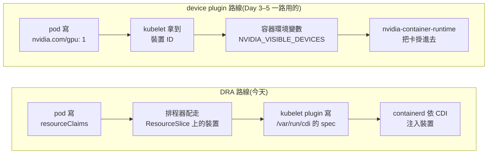

# Day 7: 在 Tesla T4 上實測 DRA——安裝 dra-driver-nvidia-gpu 與驗證配置

{ align=right width="95" }

> Day 6 用模擬裝置把 DRA 的 API 語意走完了:DeviceClass 描述一類裝置、ResourceSlice 是節點端的供給表、ResourceClaim 是一次具體的需求、CEL 選擇器決定哪一顆裝置合格。那套練習裡的每一顆「裝置」都是 driver 記在自己記憶體裡的數字,容器裡什麼都不會多出來。今天換成 NVIDIA 官方的真硬體 driver,配置一張實體 Tesla T4,並且回答一個官方文件沒有正面寫過的問題:T4 這種 Turing 世代的老卡,在 DRA 這條路上到底能不能動。這個問題只有兩種收場——能動,就把證據攤開讓人自己判斷;不能動,就把卡在哪一步、錯誤訊息長什麼樣原樣記下來。兩種結果都要寫,寫不出答案才是失敗。

!!! abstract "你在課程的哪裡"
    - **Day 6**:DRA 的 API 語意在模擬裝置上走通了。
    - **今天**:NVIDIA 真硬體 driver 配 Tesla T4。驗收:一顆 ResourceClaim 配到實體卡,容器裡 `nvidia-smi` 的 UUID 與 ResourceSlice 宣告的一致。
    - **Day 8**:三套機制都摸過了,把分工邊界一次講清楚。

## 原理與架構

### 同一套 API,兩種 driver

DRA 的 API 是 Kubernetes 定的,driver 只負責兩件事:把節點上有什麼裝置寫成 ResourceSlice,以及在 pod 起來之前把被配到的裝置準備好。這兩件事可以做得很假、也可以做得很真,Day 6 與今天正好是兩端:

| | `dra-example-driver` v0.4.0 | `dra-driver-nvidia-gpu` v0.4.1 |
|---|---|---|
| 裝置從哪來 | 值檔裡的 `numDevices` 說幾顆就幾顆 | NVML(NVIDIA Management Library)列舉節點上實際插著的卡 |
| 屬性怎麼填 | driver 自己編出來的固定字串 | `productName`、`architecture`、`cudaComputeCapability`、`capacity.memory` 全部向硬體問 |
| 容器裡拿到什麼 | 什麼都沒有,claim 純粹是帳面上的配置 | 裝置節點、函式庫路徑、hook 全部注入,`nvidia-smi` 看得到卡 |
| 同節點共存 | 沒有限制 | **不得與 classic device plugin 同節點** |

第三列是今天所有實作的重點,第四列決定了叢集要怎麼切。

### 容器要拿到一張卡,得有人動手改容器

一顆容器要能用 GPU,光是排程器說「這張卡歸你」沒有用:`/dev/nvidia0` 這類裝置節點要掛進去、driver 的函式庫路徑要補上、幾個建立時期的 hook 要跑。過去的做法是 `nvidia-container-runtime` 讀環境變數 `NVIDIA_VISIBLE_DEVICES`,裡面寫哪些裝置 ID 就掛哪些卡。新的做法是:誰知道要掛什麼,誰就寫一份宣告檔放進 runtime 讀得到的目錄,runtime 照著改容器,不必再認得任何廠商的環境變數。這份宣告檔的格式叫 **Container Device Interface(CDI)**,`dra-driver-nvidia-gpu` 走的就是這條路。



驗的方法很單純:如果新路線真的成立,容器裡的 `NVIDIA_VISIBLE_DEVICES` 就不該是一串裝置 ID。

### 隔離不是衛生習慣,是安裝條件

叢集裡還留著 Day 3 到 Day 5 的東西:HAMi 的 device plugin(選 `gpu=on` 的節點)、HAMi-WebUI 的 dcgm-exporter、Day 5 的映像預熱 DaemonSet(選 `pool=gpu`)。這些元件與 DRA driver 都會動同一組 `/dev/nvidia*`,誰先誰後不可預期,所以官方對 DRA 只有一條硬性要求:**classic device plugin 與 DRA 的 kubelet plugin 不得共用一個節點**。這條規則不必自己去文件裡挖,chart 會在安裝前擋下來:

```console
$ helm template dra-driver-nvidia-gpu \
    oci://registry.k8s.io/dra-driver-nvidia/charts/dra-driver-nvidia-gpu --version 0.4.1
Error: execution error at (dra-driver-nvidia-gpu/templates/validation.yaml:42:4):
… when 'resources.gpus.enabled=true' this DRA driver cannot be deployed alongside the standard
GPU device plugin on the same node. To avoid potential collisions between these two components,
we will not allow this default to take effect until KEP 5004 has reached GA in upstream Kubernetes.
… you must also:    --set 'gpuResourcesEnabledOverride=true'
```

所以今天的隔離是設計而不是順手打掃:另外開一個節點池 `gpudra`,上面**只貼 `pool=gpudra` 一個標籤**,刻意不貼 `pool=gpu`、不貼 `nvidia.com/gpu.present`,讓既有元件的 selector 一個都對不上,自己避開這台機器。

### 今天要走的路

環境沿用 Day 0 蓋的 AKS `<cluster>`(K8s v1.35.6),新開一台 `Standard_NC4as_T4_v3` spot(4 vCPU／28 GB／一張 16 GB Tesla T4)當 `gpudra`,原本的 `gpuspot` 全天維持 0 台,KAI、HAMi、HAMi-WebUI 三套全程不碰。九段:開池並驗四項隔離、裝 driver、走讀真卡的 ResourceSlice、跑今天的判定關卡、用真屬性寫 CEL、一個 claim 兩顆 pod 共用同一張卡、claim 的生命週期與稽核、對照 `describe node` 與舊寫法的相容橋樑、最後卸載加刪池。所有工作負載都是一次性的,收工時連 namespace 一起刪。

## 步驟

### 步驟 1:開一個只貼一個標籤的 GPU 池,並驗四項隔離

```bash
az aks nodepool add -g <resource-group> --cluster-name <cluster> -n gpudra \
  --subscription <subscription-id> \
  --node-count 1 --node-vm-size Standard_NC4as_T4_v3 \
  --priority Spot --eviction-policy Delete --spot-max-price -1 \
  --labels pool=gpudra --no-wait
```

```text
16:25:39  下達 add
16:30:30  節點 Ready(4 分 51 秒)
          aks-gpudra-34911544-vmss000000   Ready   v1.35.6
          Ubuntu 24.04.4 LTS / kernel 6.8.0-1062-azure / containerd 2.3.2-2
```

GPU 節點開機比 CPU spot 節點慢三分鐘左右,多出來的時間是 driver 安裝與裝置初始化。四項隔離全部要過才能往下走。

**第一項是標籤**,它直接決定步驟 2 的值檔怎麼寫:

```console
$ kubectl get node aks-gpudra-34911544-vmss000000 -o json | jq .metadata.labels
accelerator=nvidia                         ← AKS 自己貼的
kubernetes.azure.com/accelerator=nvidia    ← AKS 自己貼的
kubernetes.azure.com/scalesetpriority=spot
pool=gpudra                                ← 我們貼的,唯一一個
(沒有 nvidia.com/gpu.present;也沒有任何 feature.node.kubernetes.io/* ——叢集沒裝 NFD)
```

**第二項是汙點**:只有 `kubernetes.azure.com/scalesetpriority=spot:NoSchedule` 那一個,AKS 不會替 GPU 池自動加 `nvidia.com/gpu` 汙點。**第三項是節點上有沒有 classic device plugin 落地**:`kubectl get pods -A -o wide | grep aks-gpudra` 只列出 AKS 自己的六個系統 DaemonSet(CNI、ip-masq、node-manager、兩個 CSI、kube-proxy);HAMi 的 `hami-device-plugin` 與 Day 5 的映像預熱 DaemonSet 在這台機器上的 `DESIRED` 都是 0。隔離成立。

**第四項是節點的資源帳**,這是今天全天的對照基準:

```console
$ kubectl get node aks-gpudra-34911544-vmss000000 -o jsonpath='{.status.allocatable}'
{"cpu":"3860m","ephemeral-storage":"133788111446","hugepages-1Gi":"0",
 "hugepages-2Mi":"0","memory":"23467240Ki","pods":"250"}
```

一台插著實體 T4 的機器,在 Kubernetes 的資源帳上完全看不到那張卡。這正是 DRA 要的狀態:卡不再是節點上的一個擴充資源,而是 ResourceSlice 裡的一顆裝置。

再往下一層,用一顆 privileged pod `chroot` 進 host,把 chart 文件列的五項前置條件逐項量過:

```text
NVIDIA-SMI 580.159.04   Driver Version: 580.159.04   CUDA Version: 13.0   Tesla T4  0MiB / 16384MiB
/dev/nvidia0  /dev/nvidiactl  /dev/nvidia-uvm  /dev/nvidia-uvm-tools  /dev/nvidia-caps/…
$ containerd config dump | grep -i cdi
    enable_cdi = true
    cdi_spec_dirs = ['/etc/cdi', '/var/run/cdi']
```

| 官方要求 | AKS 現況 | 判定 |
|---|---|---|
| Kubernetes ≥ 1.34.2 | 1.35.6 | 過 |
| `DynamicResourceAllocation` gate | 1.34 起預設開,實測 `kubernetes_feature_enabled{name="DynamicResourceAllocation"} 1` | 過 |
| NVIDIA driver ≥ v565 | 580.159.04 | 過,有餘裕 |
| runtime 啟用 CDI | containerd 2.3.2,`enable_cdi = true` | 過 |
| **有人幫 GPU 節點貼上識別標籤(官方假設是 NFD)** | 沒裝 NFD,AKS 也不貼 `nvidia.com/gpu.present` | **不過** |

不過的那一項與硬體無關,它是「chart 預期有別人先認出哪些節點有 GPU」。**Node Feature Discovery(NFD)** 就是做這件事的元件:它在每台機器上探測 PCI 裝置、CPU 指令集這類硬體特徵,把結果寫成 `feature.node.kubernetes.io/*` 標籤讓其他元件用 selector 挑節點。AKS 沒有這個元件,所以步驟 2 得自己補上這一段。

順帶記一筆 CDI 的查法。AKS 的 containerd 設定檔本身完全沒有寫任何 CDI 相關的鍵,`enable_cdi = true` 是 containerd 2.x 的預設值。所以「這個叢集支不支援 CDI」的正確查法是 `containerd config dump`(讀生效值),不是 `cat /etc/containerd/config.toml`(讀寫死的值)——後者會讓人以為 CDI 沒開。那份設定檔裡另一行是 `default_runtime_name = "nvidia-container-runtime"`,這也解釋了 [Day 4 地雷 1](sprint1-day4-hami-kai-integration.md#mine-1):AKS 上沒有 `nvidia` 這個 RuntimeClass 物件,因為 GPU 節點根本不需要有人指名。

### 步驟 2:裝 driver——四個值要改,其中一個是 helm 的型別語意

動手前先讀 chart,三件事決定值檔怎麼寫。

**第一,GPU 功能預設是關的,而且鎖在一個名字不直覺的值上。** `values.yaml` 裡是兩道鎖:`resources.gpus.enabled` 預設就是 `true`,但被 `gpuResourcesEnabledOverride: false` 壓著。只設前者沒有任何意義,真正的鎖是後者,而且它擋下來時會把整段理由印出來(原理段那份輸出)。

**第二,ComputeDomain 要關掉。** 那是 GB200 那種多節點 NVLink fabric 的東西,T4 沒有。關掉它同時省掉一整個 controller Deployment,整套 driver 只剩一個落在 `gpudra` 的 DaemonSet,system pool 一顆 pod 都不會多——[Day 5 地雷 6](sprint1-day5-hami-webui.md#mine-6) 那個 2 vCPU 的擁擠控制面今天完全不構成問題。

**第三,kubelet plugin 的 nodeAffinity 綁死在五種標籤上**,而且是 `requiredDuringScheduling`:NFD 貼的 `feature.node.kubernetes.io/pci-10de.present`、`…/pci-0302_10de.present`、`…/pci-0300_10de.present`、`…/cpu-model.vendor_id`,加上 GPU Operator 貼的 `nvidia.com/gpu.present`。AKS 兩套都沒有,節點雖然有 `accelerator=nvidia`,但那不在清單上,詳見[地雷 2](#mine-2)。值檔(`day7-manifests/01-dra-nvidia-values.yaml`)因此長這樣:

```bash
cat > 01-dra-nvidia-values.yaml <<'EOF'
gpuResourcesEnabledOverride: true    # master switch; without it there are no GPU resources

resources:
  gpus:
    enabled: true
  computeDomains:
    enabled: false                   # no MNNVL hardware here; also drops the controller

nvidiaDriverRoot: /                  # AKS ships the driver in the host root via the VHD

logVerbosity: "4"

kubeletPlugin:
  affinity: null                     # see mine 1: {} would be coalesced back to the default
  nodeSelector:
    pool: gpudra
  tolerations:
  - key: nvidia.com/gpu
    operator: Exists
    effect: NoSchedule
  - key: kubernetes.azure.com/scalesetpriority
    operator: Equal
    value: spot
    effect: NoSchedule
EOF
```

`nvidiaDriverRoot: /` 是預設值,剛好對 AKS 是正確的(文件另外提醒 GKE 要改成 `/home/kubernetes/bin/nvidia`、由 GPU Operator 管理的要改成 `/run/nvidia/driver`)。AKS 走 VHD 內建 driver,維持 `/` 即可。

第一次安裝,helm 說成功:

```console
$ helm install dra-driver-nvidia-gpu oci://registry.k8s.io/dra-driver-nvidia/charts/dra-driver-nvidia-gpu \
    --version 0.4.1 --create-namespace --namespace dra-driver-nvidia-gpu \
    -f 01-dra-nvidia-values.yaml --wait --timeout 6m
16:33:25 → 16:33:32(7 秒)   STATUS: deployed   REVISION: 1

$ kubectl -n dra-driver-nvidia-gpu get ds
NAME                                   DESIRED  CURRENT  READY  NODE SELECTOR
dra-driver-nvidia-gpu-kubelet-plugin   0        0        0      pool=gpudra
```

`--wait --timeout 6m` 在七秒內回報 deployed,但一顆 pod 都沒有。三個 DeviceClass 倒是建出來了(`gpu.nvidia.com`／`mig.nvidia.com`／`vfio.gpu.nvidia.com`),ResourceSlice 一份都沒有——沒有 plugin 在跑,就沒有人去寫供給表。

診斷從 DaemonSet 的 pod template 讀回三個欄位開始。第一版值檔寫的是 `affinity: {}`:

```console
$ kubectl -n dra-driver-nvidia-gpu get ds dra-driver-nvidia-gpu-kubelet-plugin \
    -o jsonpath='{.spec.template.spec.affinity}'
{"nodeAffinity":{"requiredDuringSchedulingIgnoredDuringExecution":{"nodeSelectorTerms":[
  {"matchExpressions":[{"key":"feature.node.kubernetes.io/pci-10de.present",…}]}, … 五條原封不動 … ]}}}

$ …'{.spec.template.spec.nodeSelector}'   →  {"pool":"gpudra"}                        ← 生效了
$ …'{.spec.template.spec.tolerations}'    →  [{"key":"nvidia.com/gpu",…}, …]          ← 也生效了
```

同一份值檔,`nodeSelector` 與 `tolerations` 都覆蓋成功,唯獨 `affinity` 原封不動。看起來像隨機,其實由型別決定,見[地雷 1](#mine-1)。改成 `affinity: null` 之後:

```console
$ helm upgrade dra-driver-nvidia-gpu … -f 01-dra-nvidia-values.yaml
16:34:39 → 16:34:44   REVISION: 2

NAME                                   DESIRED  CURRENT  READY  NODE SELECTOR
dra-driver-nvidia-gpu-kubelet-plugin   1        1        0      pool=gpudra
16:35:17  pod 1/1 Running(33 秒:init container 掃 driver root,主容器起 NVML)
```

是 `1/1` 而不是文件範例裡的 `2/2`,因為 ComputeDomain 關掉了,只剩 `gpus` 那個容器。今天兩次失敗全部發生在這一步,之後每一項都是一次過。

### 步驟 3:走讀 ResourceSlice——真卡到底 advertise 了什麼

```console
$ kubectl get resourceslice -o wide
NAME                                                       NODE                            DRIVER
00000-gpu.nvidia.com-aks-gpudra-34911544-vmss000000-2ff44  aks-gpudra-34911544-vmss000000  gpu.nvidia.com
```

這份供給表的內容是今天最該記住的一段:

```yaml
spec:
  driver: gpu.nvidia.com
  nodeName: aks-gpudra-34911544-vmss000000
  pool: { generation: 1, name: aks-gpudra-34911544-vmss000000, resourceSliceCount: 1 }
  devices:
  - name: gpu-0
    attributes:
      type:                  { string: gpu }
      uuid:                  { string: GPU-bf5809e7-… }
      productName:           { string: Tesla T4 }
      brand:                 { string: Nvidia }
      architecture:          { string: Turing }
      cudaComputeCapability: { version: 7.5.0 }
      driverVersion:         { version: 580.159.4 }
      cudaDriverVersion:     { version: 13.0.0 }
      addressingMode:        { string: HMM }
      resource.kubernetes.io/pciBusID: { string: '0001:00:00.0' }
    capacity:
      memory: { value: 16Gi }
```

寫選擇器時,廠商自己的屬性掛在 driver 名稱底下(`device.attributes['gpu.nvidia.com'].productName`)、容量掛在 `device.capacity['gpu.nvidia.com'].memory`,而 `pciBusID` 這種跨廠商的標準鍵掛在 `device.attributes['resource.kubernetes.io'].pciBusID`。寫下第一條選擇器之前,有三個細節要先知道:

1. `driverVersion` 是 `580.159.4`,不是 `nvidia-smi` 印的 `580.159.04`。driver 把 NVML 回來的字串丟進 semver 再取回字串,前導零被吃掉了,見[地雷 6](#mine-6)。
2. `cudaComputeCapability` 是三段式的 `7.5.0`;NVML 給的是兩段的 `7.5`,同樣被補了一段。這兩個屬性都是 version 型,CEL 裡該用版本比較而不是字串等於。
3. `memory` 是整數的 `16Gi`,來自 `nvmlDeviceGetMemoryInfo` 回報的 total(16384 MiB),不像有些工具會先扣掉保留區讓人看到 15.x。

另外,v0.4.1 有 `resource.kubernetes.io/pciBusID`,但**沒有** `pcieRoot`。整份 plugin log 只有一行警告,講的就是這件事:

```text
W0805 08:45:31.616654 nvlib.go:543] error getting PCIe root for device 0, continuing without attribute:
  failed to resolve PCIe Root Complex for PCI Bus ID 0001:00:00.0:
  symlink target for PCI Bus ID 0001:00:00.0 is invalid: it must start with devices/pci:
  devices/LNXSYSTM:00/LNXSYBUS:00/ACPI0004:00/MSFT1000:00/47505500-…/pci0001:00/0001:00:00.0
```

driver 的處理很得體:印一行警告然後繼續,不中斷。代價是供給表上少了一個屬性,而少的那個正好是拓樸感知選擇器要用的,見[地雷 4](#mine-4)。

### 步驟 4:今天的判定關卡——整卡配置在 T4 上到底能不能動

`day7-manifests/02-gate-claimtemplate-pod.yaml` 的關鍵在於這顆 pod **完全沒有任何 `resources.limits` 或 `resources.requests` 提到 `nvidia.com/*`**,claim 本身就是請求:

```bash
cat > 02-gate-claimtemplate-pod.yaml <<'EOF'
apiVersion: v1
kind: Namespace
metadata:
  name: dra-gate
---
apiVersion: resource.k8s.io/v1
kind: ResourceClaimTemplate
metadata:
  namespace: dra-gate
  name: single-gpu
spec:
  spec:
    devices:
      requests:
      - name: gpu
        exactly:
          deviceClassName: gpu.nvidia.com
---
apiVersion: v1
kind: Pod
metadata:
  namespace: dra-gate
  name: gate-smi
spec:
  restartPolicy: Never
  nodeSelector:
    pool: gpudra
  tolerations:
  - key: kubernetes.azure.com/scalesetpriority
    operator: Equal
    value: spot
    effect: NoSchedule
  containers:
  - name: ctr
    image: nvcr.io/nvidia/cuda:12.6.2-base-ubuntu24.04
    command: ["bash", "-c"]
    args:
    - |
      echo "===== nvidia-smi -L ====="; nvidia-smi -L
      echo "===== nvidia-smi ====="; nvidia-smi
      echo "===== NVIDIA env ====="; env | grep -i -E 'nvidia|gpu|cuda' | sort
      echo "===== /dev/nvidia* ====="; ls -l /dev/nvidia* 2>&1
    resources:
      claims:                             # the only "request" in this pod
      - name: gpu
  resourceClaims:
  - name: gpu
    resourceClaimTemplateName: single-gpu
EOF
```

映像先確認過可匿名拉取才寫進 manifest(NGC 要先向 `nvcr.io/proxy_auth` 換一個匿名 token,再打 manifest 拿到 200);Docker Hub 上的同名映像在課程環境有流量限制的風險。

```text
16:35:30  apply
16:35:50  容器開始執行,gate-smi 0/1 Completed
===== nvidia-smi -L =====
GPU 0: Tesla T4 (UUID: GPU-bf5809e7-…)
===== nvidia-smi =====
| NVIDIA-SMI 580.159.04  |  0  Tesla T4  Off | 00000001:00:00.0 Off | 0MiB / 16384MiB | 8% |
===== NVIDIA env =====
NVIDIA_DRIVER_CAPABILITIES=compute,utility
NVIDIA_VISIBLE_DEVICES=void            ← 注意這一行
LD_LIBRARY_PATH=/usr/local/nvidia/lib:/usr/local/nvidia/lib64
===== /dev/nvidia* =====
/dev/nvidia0  /dev/nvidiactl  /dev/nvidia-uvm  /dev/nvidia-uvm-tools  /dev/nvidia-caps/…
```

**通過。** 三條互相獨立的證據:

1. **UUID 對得起來。** ResourceSlice 的 `uuid` 屬性是 `GPU-bf5809e7-…`,容器裡 `nvidia-smi -L` 印的是同一個字串。這不是「剛好看得到一張卡」,是被配置的那一張。
2. **`NVIDIA_VISIBLE_DEVICES=void`。** 舊路線就是靠這個變數帶裝置 ID 讓 runtime 掛卡;這裡它被明確設成 `void`(等於「什麼都不要掛」),卡卻在容器裡。注入走的是 CDI,不是舊的環境變數路徑。
3. **裝置節點實際存在**於容器的 `/dev` 底下。

配置結果回寫在 claim 的 status 上(這份取自步驟 5 的長駐 pod,格式相同):

```yaml
status:
  allocation:
    devices:
      results: [ { device: gpu-0, driver: gpu.nvidia.com, pool: aks-gpudra-…, request: gpu } ]
    nodeSelector:
      nodeSelectorTerms:
      - matchFields: [ { key: metadata.name, operator: In, values: [aks-gpudra-34911544-vmss000000] } ]
  reservedFor:
  - { name: pod-mem-ok, resource: pods }
```

`allocation.nodeSelector` 用 `matchFields: metadata.name` 把 pod 釘死在那台節點上。裝置配置反過來約束排程,這個方向是 device plugin 沒有的。

CDI 那一段也有實體:driver 為每個 claim 在節點上寫一份宣告檔,檔名是 `/var/run/cdi/k8s.gpu.nvidia.com-claim_<claim UID>.yaml`,近 20 KB:

```yaml
cdiVersion: 0.5.0
kind: k8s.gpu.nvidia.com/claim
devices:
- name: b3f7d9bb-…-gpu-0            # <claimUID>-<deviceName>
  containerEdits:
    deviceNodes: [ { path: /dev/nvidia0, major: 195, permissions: rwm } ]
containerEdits:
  env: [ NVIDIA_VISIBLE_DEVICES=void ]   # switch off the legacy path to avoid double injection
  deviceNodes: [ /dev/nvidia-uvm, /dev/nvidia-uvm-tools, /dev/nvidiactl ]
  hooks:
  - { hookName: createContainer, path: /var/lib/kubelet/plugins/gpu.nvidia.com/nvidia-cdi-hook,
      args: [nvidia-cdi-hook, create-symlinks] }
```

`/var/run/cdi` 在裝 driver 之前根本不存在(步驟 1 量過:`ls: cannot access '/var/run/cdi'`),是 driver 建的;而 containerd 的 `cdi_spec_dirs` 預設就包含它。這條鏈能接上靠的是 containerd 2.x 的預設值剛好對——containerd 1.x 的叢集要自己把 `enable_cdi` 打開。

到這裡今天的主要問題有答案了:**Tesla T4 上的整卡 DRA 配置完全正常,沒有任何 Turing 或 T4 專屬的阻礙。**

### 步驟 5:用真屬性寫 CEL,可滿足與不可滿足各跑一次

`day7-manifests/03-a-cel-real-attributes.yaml` 的兩個 template 只差門檻,而門檻用的是真卡的 `capacity.memory`(16Gi):

```bash
cat > 03-a-cel-real-attributes.yaml <<'EOF'
apiVersion: v1
kind: Namespace
metadata:
  name: dra-3a
EOF

# gpu-mem-8gi:  16Gi >= 8Gi  -> satisfiable / gpu-mem-24gi: 16Gi < 24Gi -> unsatisfiable
while read -r tpl threshold; do
  cat <<EOF
---
apiVersion: resource.k8s.io/v1
kind: ResourceClaimTemplate
metadata:
  namespace: dra-3a
  name: $tpl
spec:
  spec:
    devices:
      requests:
      - name: gpu
        exactly:
          deviceClassName: gpu.nvidia.com
          selectors:
          - cel:
              expression: "device.capacity['gpu.nvidia.com'].memory.compareTo(quantity('$threshold')) >= 0"
EOF
done >> 03-a-cel-real-attributes.yaml <<'TABLE'
gpu-mem-8gi  8Gi
gpu-mem-24gi 24Gi
TABLE

while read -r pod tpl; do
  cat <<EOF
---
apiVersion: v1
kind: Pod
metadata:
  namespace: dra-3a
  name: $pod
spec:
  restartPolicy: Never
  nodeSelector:
    pool: gpudra
  tolerations:
  - key: kubernetes.azure.com/scalesetpriority
    operator: Equal
    value: spot
    effect: NoSchedule
  containers:
  - name: ctr
    image: nvcr.io/nvidia/cuda:12.6.2-base-ubuntu24.04
    command: ["bash", "-c"]
    args: ["nvidia-smi -L; trap 'exit 0' TERM; sleep 9999 & wait"]
    resources:
      claims:
      - name: gpu
  resourceClaims:
  - name: gpu
    resourceClaimTemplateName: $tpl
EOF
done >> 03-a-cel-real-attributes.yaml <<'TABLE'
pod-mem-ok         gpu-mem-8gi
pod-mem-impossible gpu-mem-24gi
TABLE
```

```console
16:43:32  pod/pod-mem-ok          1/1  Running   resourceclaim/pod-mem-ok-gpu-x4j2c          allocated,reserved
          pod/pod-mem-impossible  0/1  Pending   resourceclaim/pod-mem-impossible-gpu-vppgv  pending
$ kubectl -n dra-3a logs pod-mem-ok
GPU 0: Tesla T4 (UUID: GPU-bf5809e7-…)
```

不可滿足那顆的排程器事件全文:

```text
Warning  FailedScheduling  default-scheduler
  0/2 nodes are available: 1 cannot allocate all claims,
  1 node(s) didn't match Pod's node affinity/selector.
  still not schedulable, preemption: 0/2 nodes are available:
  2 Preemption is not helpful for scheduling.
```

**與模擬 driver 的訊息一字不差。** 換了真硬體、換了另一個 driver 實作、換了另一種失敗原因( VRAM 門檻不夠,而不是裝置全部用完),事件文字完全相同——這追認了 [Day 6 地雷 2](sprint1-day6-dra-simulated-devices.md#mine-2):那是 `dynamicresources` 排程外掛本身的行為,不是模擬 driver 太陽春。訊息不會告訴你是哪一個 claim、哪一條 selector 沒過、幾顆裝置被篩掉,追查路線也因此不變:把 `kubectl get resourceslice -o yaml` 的屬性攤開,逐條 selector 自己對。

### 步驟 6:一個 claim、兩顆 pod、同一張實體 T4

`day7-manifests/03-b-sharing-one-claim-two-pods.yaml` 用的是**具名** `ResourceClaim`(不是 template),兩顆 pod 都寫 `resourceClaimName: shared-t4`:

```bash
cat > 03-b-sharing-one-claim-two-pods.yaml <<'EOF'
apiVersion: v1
kind: Namespace
metadata:
  name: dra-3b
---
apiVersion: resource.k8s.io/v1
kind: ResourceClaim
metadata:
  namespace: dra-3b
  name: shared-t4
spec:
  devices:
    requests:
    - name: gpu
      exactly:
        deviceClassName: gpu.nvidia.com
EOF

for pod in share-a share-b; do
  cat <<EOF
---
apiVersion: v1
kind: Pod
metadata:
  namespace: dra-3b
  name: $pod
spec:
  restartPolicy: Never
  nodeSelector:
    pool: gpudra
  tolerations:
  - key: kubernetes.azure.com/scalesetpriority
    operator: Equal
    value: spot
    effect: NoSchedule
  containers:
  - name: ctr
    image: nvcr.io/nvidia/cuda:12.6.2-base-ubuntu24.04
    command: ["bash", "-c"]
    args: ["nvidia-smi -L; nvidia-smi --query-gpu=uuid,name,memory.total --format=csv; trap 'exit 0' TERM; sleep 9999 & wait"]
    resources:
      claims:
      - name: gpu
  resourceClaims:
  - name: gpu
    resourceClaimName: shared-t4
EOF
done >> 03-b-sharing-one-claim-two-pods.yaml
```

```console
16:44:04  apply
16:44:21  share-a 1/1 Running   share-b 1/1 Running   resourceclaim/shared-t4 allocated,reserved
$ kubectl -n dra-3b logs share-a     # share-b prints the exact same lines
GPU 0: Tesla T4 (UUID: GPU-bf5809e7-…)
uuid, name, memory.total [MiB]
GPU-bf5809e7-…, Tesla T4, 16384 MiB
```

claim 這一邊沒有 ownerReference(具名 claim 不屬於任何 pod),`reservedFor` 有兩筆——`share-a` 與 `share-b` 各一。兩顆 pod、一個 claim、一張實體 T4,同時執行。這件事在 device plugin 的世界裡表達不出來:`nvidia.com/gpu: 1` 是整數計數,兩顆 pod 各要一份就是要兩張卡。

至於「共享」在實作上是什麼,driver 端的處理最清楚。同一個 claim 的第二顆 pod 進來時,driver 不重新準備裝置(以下取自帶 TimeSlicing 設定的那一組,行為與上面這組相同):

```text
08:46:15.607  Returning newly prepared devices for claim 'dra-ts/shared-t4-ts:…': [gpu-0 …]
08:46:15.627  Skip prepare: claim already in PrepareCompleted state: dra-ts/shared-t4-ts:…
08:46:15.627  Returning newly prepared devices for claim 'dra-ts/shared-t4-ts:…': [gpu-0 …]
```

所以共享就是**同一份 CDI 宣告檔被注入兩個容器**——步驟 4 看到的 `/var/run/cdi` 底下確實只有一份以 claim UID 命名的檔案,不是兩份。

#### 兩層 feature gate:一層 AKS 鎖著,一層 AKS 管不到

v0.4.1 的 GPU 共享策略(TimeSlicing、MPS)是透過 claim 的 **opaque config** 指定的:claim 除了寫「我要一顆裝置」,還可以夾帶一段只有該廠商 driver 看得懂的參數。這條管道被 driver 自己的 feature gate 擋著——`TimeSlicingSettings`、`MPSSupport`、`DynamicMIG`、`PassthroughSupport` 四個都是 alpha 且預設 false,只有 `IMEXDaemonsWithDNSNames` 是 beta 且預設 true。

關鍵區別是:**這些是 driver 程序自己的旗標,不是 apiserver 的。** [Day 6 地雷 1](sprint1-day6-dra-simulated-devices.md#mine-1) 記的是「AKS 把 DRA 的 alpha gate 全部設 0,而且改不了」,那句話管得到的只有 `resource.k8s.io` 這組 API 的行為;driver 端的 gate 是 chart 的一個值,想開就開——`helm upgrade … --set featureGates.TimeSlicingSettings=true` 花 37 秒(含 DaemonSet 重啟)走到 REVISION 3,plugin log 的 `Feature gates: map[string]bool{…, "TimeSlicingSettings":true, …}` 確認旗標落地。claim 因此可以帶著廠商參數(`day7-manifests/04-timeslicing-config.yaml`):

```bash
cat > 04-timeslicing-config.yaml <<'EOF'
apiVersion: v1
kind: Namespace
metadata:
  name: dra-ts
---
apiVersion: resource.k8s.io/v1
kind: ResourceClaim
metadata:
  namespace: dra-ts
  name: shared-t4-ts
spec:
  devices:
    requests:
    - name: gpu
      exactly:
        deviceClassName: gpu.nvidia.com
    config:
    - requests: ["gpu"]
      opaque:
        driver: gpu.nvidia.com
        parameters:
          apiVersion: resource.nvidia.com/v1beta1
          kind: GpuConfig
          sharing:
            strategy: TimeSlicing
            timeSlicingConfig:
              interval: Long
EOF

for pod in ts-a ts-b; do
  cat <<EOF
---
apiVersion: v1
kind: Pod
metadata:
  namespace: dra-ts
  name: $pod
spec:
  restartPolicy: Never
  nodeSelector:
    pool: gpudra
  tolerations:
  - key: kubernetes.azure.com/scalesetpriority
    operator: Equal
    value: spot
    effect: NoSchedule
  containers:
  - name: ctr
    image: nvcr.io/nvidia/cuda:12.6.2-base-ubuntu24.04
    command: ["bash", "-c"]
    args: ["nvidia-smi -L; nvidia-smi --query-gpu=compute_mode --format=csv; trap 'exit 0' TERM; sleep 9999 & wait"]
    resources:
      claims:
      - name: gpu
  resourceClaims:
  - name: gpu
    resourceClaimName: shared-t4-ts
EOF
done >> 04-timeslicing-config.yaml
```

```console
16:46:28  ts-a 1/1 Running   ts-b 1/1 Running   resourceclaim/shared-t4-ts allocated,reserved
$ kubectl -n dra-ts logs ts-a
GPU 0: Tesla T4 (UUID: GPU-bf5809e7-…)
compute_mode
Default
```

設定被接受、兩顆 pod 都起來、plugin log 沒有任何錯誤,但容器裡看到的 `compute_mode` 仍然是 `Default`。這是預期的:TimeSlicing 的 interval 調的是 GPU 排程器的時間片長度,不會動 compute mode(那要 MPS 或 EXCLUSIVE_PROCESS 才會變),從容器裡看不出差別。要看到 compute mode 變化得開 `MPSSupport`,那需要 driver 在節點上另外起一個 MPS 背景程式,今天沒做,誠實記在這裡。

可驗證的結論是:**opaque config 這條管道在 AKS 上是通的**——claim 帶著廠商專屬參數送進 driver,driver 收得到也認得。這是 DRA 相對 device plugin 最大的表達力差距之一:device plugin 只能在 DaemonSet 的設定裡做全節點一致的設定,沒有逐 claim 的旋鈕。

### 步驟 7:claim 的生命週期,與跑完之後查不到的那筆帳

**具名 claim,消費者逐一離開**(接續步驟 6);**template 產的 claim,pod 一死就整個消失**:

```console
16:44:50 $ kubectl -n dra-3b delete pod share-a
16:44:51   shared-t4:  state=gpu-0   reservedFor=share-b      ← 還配著,因為 share-b 還在
16:44:52 $ kubectl -n dra-3b delete pod share-b
16:44:57   shared-t4   pending   allocation=(null)  reservedFor=(空)   ← 物件還在,配置被收回

16:47:26   NAME                   STATE   OWNER        FINALIZER
           owner-tmpl-gpu-jhdnp   gpu-0   owner-tmpl   resource.kubernetes.io/delete-protection
16:47:41 $ kubectl -n dra-3c delete pod owner-tmpl
16:47:49 $ kubectl -n dra-3c get resourceclaims
           No resources found in dra-3c namespace.
```

kubelet plugin 那邊的回收只有一行:`Unprepare: regular GPU: noop`。`noop` 是因為整卡配置不需要在硬體上做任何回復動作(不像 MIG 要拆 instance、MPS 要收背景程式),**整卡 DRA 的回收成本是零**,所以交接可以那麼快。

兩種 claim 的行為與模擬 driver 完全一致:template 產的 claim 有指向 pod 的 ownerReference 加上 `delete-protection` finalizer,pod 死就被回收;具名 claim 沒有 owner,物件留著但 `reservedFor` 清空之後配置自動釋放。「忘了刪 claim」漏掉的是 API 物件,不是裝置——這條營運結論在真硬體上一樣成立。不過真跑一次一次性的工作負載會撞到一個時序問題:步驟 4 的 `gate-smi` 完成之後 pod 物件還在,claim 卻已經不見了,詳見[地雷 5](#mine-5)。

### 步驟 8:`describe node` 上的隱形,與那座沒接上的橋

在 `pod-mem-ok` 正持有那張 T4 的當下:

```console
$ kubectl describe node aks-gpudra-34911544-vmss000000
Capacity:     cpu: 4       memory: 28740840Ki   pods: 250
Allocatable:  cpu: 3860m   memory: 23467240Ki   pods: 250
Non-terminated Pods:                                        CPU Requests  Memory Requests
  dra-3a                 pod-mem-ok                         0 (0%)        0 (0%)
  dra-driver-nvidia-gpu  dra-driver-nvidia-gpu-kubelet-…    0 (0%)        0 (0%)
Allocated resources:     cpu 335m (8%)    memory 526Mi (2%)
```

一台插著 Tesla T4、而且那張卡此刻正被一顆 pod 獨佔的機器:`Capacity` 沒有 GPU、`Allocatable` 沒有 GPU、`Allocated resources` 沒有 GPU,持卡的那顆 pod 每一欄都是 `0 (0%)`。[Day 6 地雷 3](sprint1-day6-dra-simulated-devices.md#mine-3) 是在模擬裝置上記的,今天在真硬體上原封不動重現。

一句話的對照:device plugin 的世界裡,「這台機器還剩幾張卡」是 `kubectl describe node` 一眼看得到的減法;DRA 的世界裡,那個數字在 node 物件上根本不存在,要拿 ResourceSlice(供給)與 ResourceClaim(需求)自己算。這對 Day 1 到 Day 5 建立的整套工具鏈是硬傷:HAMi-WebUI 的容量頁、KAI 的 queue quota 計算、任何讀 `node.status.allocatable['nvidia.com/gpu']` 的儀表板或 autoscaler,在純 DRA 節點上都會一致地回答「這台沒有 GPU」。[Day 3 地雷 2](sprint1-day3-hami-memory-isolation.md#mine-2) 是同一個病的較輕版本——那時只有 VRAM 餘額查不到,現在整張卡都查不到。

官方對這件事其實準備了一座橋:chart 的 DeviceClass 模板在 `resource.k8s.io/v1` 的叢集上會多寫一個 `extendedResourceName: nvidia.com/gpu`,讓還在用 `resources.limits: nvidia.com/gpu: 1` 舊寫法的工作負載也能被 DRA 接住。但它依賴 `DRAExtendedResource`,而 AKS 上這個 alpha gate 是 0。用一個獨立的探針物件驗(避免污染主線):

```console
$ kubectl apply -f - <<'EOF'
apiVersion: resource.k8s.io/v1
kind: DeviceClass
metadata: { name: extres-probe.example.com }
spec:
  selectors: [ { cel: { expression: "device.driver == 'nonexistent.example.com'" } } ]
  extendedResourceName: example.com/probe-gpu
EOF
deviceclass.resource.k8s.io/extres-probe.example.com created      ← 建立成功,沒有任何警告
$ kubectl get deviceclass extres-probe.example.com -o jsonpath='{.spec}'
{"selectors":[{"cel":{"expression":"device.driver == 'nonexistent.example.com'"}}]}
                                          ← extendedResourceName 不見了
```

欄位蒸發了,而且沒有任何人提醒,見[地雷 3](#mine-3)。

### 步驟 9:卸載時序與刪池

先刪工作負載的 namespace,再卸 driver,順便量一次供給表消失要多久:

```console
16:48:06 $ helm uninstall dra-driver-nvidia-gpu -n dra-driver-nvidia-gpu
          release "dra-driver-nvidia-gpu" uninstalled
16:48:09   still 1 slice(s), elapsed 3s
16:48:25   still 1 slice(s), elapsed 19s
16:48:38   ResourceSlice gone (elapsed 32s)

$ kubectl get resourceslice,deviceclass
No resources found
```

三個 DeviceClass 是 chart 的物件,隨 uninstall 立即消失;ResourceSlice 不是 chart 產的(是 kubelet plugin 在執行期建的),它要等 apiserver 這一端發現「沒有 driver 在續約」才回收,今天量到 32 秒。這追認了 [Day 6 地雷 4](sprint1-day6-dra-simulated-devices.md#mine-4),同時把數字補上:模擬 driver 當時約 95 秒,真 driver 32 秒,差別在兩者的註冊與續約週期設定不同。營運上的意義沒變——卸載後有一段「供給表還在、但沒有 driver 能準備裝置」的窗口,這段時間送進來的 claim 會被排程器成功配置,然後卡在 kubelet 那一端。要換 driver 版本或搬遷 driver,先確認 slice 歸零再讓新工作負載進來。

最後刪掉節點池。`gpudra` 不在 Day 0 那套收工歸零循環的涵蓋範圍裡(那套指令只碰 `gpuspot`),所以這一步要自己做、自己驗:

```console
16:48:49 $ az aks nodepool delete -g <resource-group> --cluster-name <cluster> \
             -n gpudra --subscription <subscription-id> --no-wait
16:49:26 $ az aks nodepool list …  →  只剩 system 與 gpuspot(Count 0),gpudra 不在清單上
16:49:37 $ az aks nodepool show … -n gpudra  →  rpc error: code = NotFound desc = Agent Pool not found
16:49:37 $ kubectl get nodes  →  只剩 aks-system-35459509-vmss000000
```

帳算起來:節點從下達 add 到確認消失存活 23 分 47 秒(0.396 小時),`NC4as_T4_v3` 的 spot 現價是 US$0.2059/hr(向 Azure Retail Prices API 現查,不是估的),本日 GPU 節點成本 **US$0.082,約 NT$2.6**。同規格隨選價 US$0.71/hr,spot 是它的 29%。今天沒有做 classic 與 DRA 的併排比較,`gpuspot` 全程 0 台,那部分成本是 0。

## 驗收 checkpoint

| 檢查項 | 指令 | 期待結果 |
|---|---|---|
| 隔離成立 | `kubectl get pods -A -o wide \| grep <gpudra 節點>` | 只有 AKS 系統 DaemonSet;HAMi device plugin 的 `DESIRED` 是 0 |
| 節點帳上沒有 GPU | `kubectl get node <n> -o jsonpath='{.status.allocatable}'` | 沒有 `nvidia.com/gpu` 這個鍵 |
| kubelet plugin 真的落地 | `kubectl -n dra-driver-nvidia-gpu get ds` | `DESIRED` 是 1 而不是 0——0 代表 affinity 沒清掉 |
| 供給表帶著真屬性 | `kubectl get resourceslice -o yaml` | `productName: Tesla T4`、`capacity.memory: 16Gi` |
| 整卡配置成立且走 CDI | pod 內 `nvidia-smi -L` 與 `env \| grep NVIDIA_VISIBLE_DEVICES` | UUID 與 ResourceSlice 的 `uuid` 屬性逐字相同;環境變數等於 `void`,而 `/dev/nvidia0` 仍在容器裡 |
| 不可滿足的 claim 停在門口 | `kubectl -n dra-3a get pod,resourceclaim` | claim 是 `pending`、pod 是 `Pending`,不是配置到一半 |
| 共享成立 | 兩顆 pod 的 `nvidia-smi -L` 與 claim 的 `reservedFor` | 兩顆印出同一個 UUID,`reservedFor` 有兩筆 |
| 收尾乾淨 | `kubectl … get resourceslice,deviceclass` 與 `az aks nodepool show … -n gpudra` | uninstall 之後 32 秒內 `No resources found`;節點池回 `Agent Pool not found`,而不是 Count=0 |

## 地雷記錄

### 地雷 1:`affinity: {}` 清不掉 chart 預設值,而 DaemonSet desired=0 時 `--wait` 照樣秒回成功 {#mine-1}

**症狀**:`helm install --wait --timeout 6m` 在七秒內回報 `STATUS: deployed`,DeviceClass 也建好了,但 kubelet plugin 的 DaemonSet 是 `DESIRED 0`、ResourceSlice 一份都沒有。值檔裡的 `nodeSelector` 與 `tolerations` 都生效了,只有 `affinity` 是 chart 的原始五條。

**根因**:兩件事疊在一起。helm 合併使用者值與 chart 預設值時,對 **map 走遞迴合併**:`{}` 沒有任何鍵,於是「一個鍵都不覆蓋」,結果是整份預設值原封不動保留;而 **list 是整份取代**,所以 `tolerations` 蓋得掉。同一份值檔裡兩種行為看起來像隨機,其實由型別決定。另一半是 `--wait`:DaemonSet 的 `DESIRED` 是 0 時,「0 個 pod 全部就緒」在計數上成立,helm 立刻回報成功。

**修法**:要刪掉一整組 map 型的預設值,唯一的寫法是 YAML 的 `null`(`kubeletPlugin.affinity: null`)——helm 把 null 當成「刪除這個鍵」。

**教訓**:這是 [Day 0 地雷 1](sprint1-day0-azure-aks-foundation.md#mine-1) 在 helm 這一層的翻版。`--wait` 保證不了「東西真的在跑」,它只保證「該就緒的都就緒了」;安裝完永遠要自己數一次 `DESIRED` 對不對。

### 地雷 2:chart 認 GPU 節點的五種標籤,AKS 一種都不貼 {#mine-2}

**症狀**:值檔的 `nodeSelector` 明明寫對了節點,DaemonSet 還是 `DESIRED 0`,而且沒有錯誤訊息、沒有 Pending pod、`kubectl describe` 也沒有事件。

**根因**:kubelet plugin 的 DaemonSet 用 `requiredDuringScheduling` 的 nodeAffinity 綁死在四種 NFD 標籤(`feature.node.kubernetes.io/pci-10de.present` 這一類)與一種 GPU Operator 標籤(`nvidia.com/gpu.present`)上。AKS 的 N 系列節點自己貼的是 `accelerator=nvidia` 與 `kubernetes.azure.com/accelerator=nvidia`,不在這五個之內。官方把 NFD 列為前置需求、並建議用 GPU Operator 一次裝好,等於標準安裝路徑預設叢集裡已經有其中一套。

**修法**:走 standalone helm 這條路就得自己接上「誰認得出 GPU 節點」這一段。兩選一:把 affinity 清掉改用自己的 `nodeSelector`(本課的做法,配合專用節點池),或者裝 NFD 讓那五個條件其中之一成立。

**教訓**:chart 的預設值裡藏著它對生態系的假設。安裝前先讀一次 DaemonSet 模板的 affinity 與 nodeSelector,比裝完之後對著 `DESIRED 0` 猜快得多。同一份 chart 的品質是不均勻的——會擋的地方(`gpuResourcesEnabledOverride`)擋得清清楚楚,不擋的地方一聲不吭。

### 地雷 3:`DeviceClass.extendedResourceName` 被靜默丟棄,物件建立成功但欄位蒸發 {#mine-3}

**症狀**:`helm install` 一切成功、DeviceClass 也在,但把物件讀回來會發現 `extendedResourceName` 這個欄位不見了(步驟 8 的探針量的就是這件事)。麻煩的是後果:舊寫法的 pod(`resources.limits: nvidia.com/gpu: 1`)丟進去之後停在 Pending,事件說 `Insufficient nvidia.com/gpu`,而在那之前沒有任何一步報過錯。

**根因**:chart 在 `resource.k8s.io/v1` 的叢集上會把 `extendedResourceName: nvidia.com/gpu` 寫進 `gpu.nvidia.com` 這個 DeviceClass,讓舊寫法能被 DRA 接住。這個欄位由 `DRAExtendedResource` 控制,而 AKS 上這個 alpha gate 是 0。apiserver 對「未啟用的功能對應的欄位」走的是標準行為:直接剝掉,不報錯、不警告。

**修法**:沒有繞道可走,只能承認橋不存在——在 AKS 上遷移到 DRA,所有工作負載都得同時改寫成 `resourceClaims` 語法,不能新舊並行。要確認一個欄位有沒有存活,唯一的方法是建完之後讀回來比對:`kubectl get deviceclass gpu.nvidia.com -o jsonpath='{.spec}'`。

**教訓**:「apply 成功」不代表「欄位存在」。在托管叢集上用到任何 alpha 欄位之前,先寫一個丟得起的探針物件建起來再讀回來,不要拿正式物件試。

### 地雷 4:Azure 的 GPU 走 VMBus 透傳,`pcieRoot` 屬性拿不到 {#mine-4}

**症狀**:ResourceSlice 上有 `resource.kubernetes.io/pciBusID`,但沒有 `pcieRoot`;plugin log 有一行 `error getting PCIe root for device 0, continuing without attribute`。

**根因**:driver 解析 PCIe Root Complex 的方式是讀 `/sys` 的 symlink,並要求路徑以 `devices/pci` 開頭。Azure 的 N 系列把 GPU 以 Hyper-V 的 VMBus 透傳給 guest,路徑長成 `devices/LNXSYSTM:00/…/MSFT1000:00/<GUID>/pci0001:00/…`,開頭是 ACPI 節點而不是 `pci`,解析因此失敗。

**修法**:沒有修法,這是虛擬化層的性質。driver 的處理是印一行警告然後繼續,不影響任何整卡配置的功能。

**教訓**:單卡機器不受影響,但多卡機器上「把兩顆 GPU 配在同一個 PCIe root 底下以取得最短路徑」這類拓樸感知的選擇器,在 Azure 上寫不出來。這不是 T4 的限制,是 Azure 虛擬化層的限制,會影響 Azure 上所有 N 系列。挑雲上機型做多卡訓練時,先問清楚 PCIe 拓樸屬性拿不拿得到。

### 地雷 5:template 產的 claim 在 pod 一進終態就被刪掉,不等 pod 被回收 {#mine-5}

**症狀**:一次性的 pod(`restartPolicy: Never`)跑完之後 `Completed`,pod 物件還在,但 `kubectl -n dra-gate get resourceclaims` 已經是 `No resources found`。pod 的 `status.resourceClaimStatuses` 還留著名字(`gate-smi-gpu-pcq9k`),claim 本體卻不存在。

**根因**:kube-controller-manager 的 resourceclaim controller 在 pod 進入終態時就主動刪除 template 產生的 claim,為的是盡快釋放裝置,不等 pod 被回收。

**修法**:想留下「這個任務當時拿到哪一顆裝置」這筆帳,有三條路:在 pod 還活著時抓、改用具名 claim(它不隨 pod 消失)、或把裝置身分從容器內印進 log——今天每一顆 pod 都跑 `nvidia-smi -L`,就是這個作用。

**教訓**:Job 與 CronJob 跑完之後沒辦法再用 `kubectl get resourceclaim` 做事後查核。這對稽核是個退步:device plugin 的世界裡,看 pod 的 `resources` 欄位就知道它要過幾張卡,而且那個欄位跟著 pod 物件一起留著。

### 地雷 6:`driverVersion` 被 semver 正規化,`580.159.04` 變成 `580.159.4` {#mine-6}

**症狀**:`nvidia-smi` 印的是 `580.159.04`、`/proc/driver/nvidia/version` 印的也是 `580.159.04`,但 ResourceSlice 上的 `driverVersion` 屬性是 `580.159.4`。拿字串比對寫的選擇器永遠不成立。

**根因**:driver 把 NVML 回傳的字串 parse 成 semver 再取回字串(`cmd/gpu-kubelet-plugin/deviceinfo.go`),前導零在這一趟被吃掉了。`cudaComputeCapability` 同理:NVML 給 `7.5`,semver 補成 `7.5.0`。

**修法**:這兩個屬性都是 **version 型**,CEL 裡本來就該用版本比較而不是字串等於。要寫版本下限就用版本比較的寫法,不要寫 `== '580.159.04'`。

**教訓**:錯誤的選擇器不會有人告訴你錯在哪——它只會讓 pod 停在 Pending,而事件文字就是 [Day 6 地雷 2](sprint1-day6-dra-simulated-devices.md#mine-2) 那句什麼都沒說的話。寫任何屬性選擇器之前,先把 ResourceSlice 原樣印出來,照著上面的字元寫,不要照著 `nvidia-smi` 的輸出寫。

## 帶得走的東西

- helm 的值覆蓋語意由型別決定:map 走遞迴合併,所以 `{}` 等於「什麼都不改」;list 走整份取代。要清掉 chart 預設的一整組 map,只有 `null` 一條路。這與哪個 chart 無關,遇到「我明明覆蓋了卻沒生效」先問這個欄位是 map 還是 list。
- 「安裝成功」有三層:helm 說 deployed、物件建出來、pod 真的在跑。`--wait` 只保證前兩層,而且在 `DESIRED 0` 的 DaemonSet 上連第三層的假象都給得出來。驗收要看 `DESIRED` 的絕對數字對不對,不是看有沒有紅字。
- DRA 把裝置從節點上的一欄整數換成一張供給表,代價是所有既有的容量工具一致失準——不是顯示錯,是顯示「沒有 GPU」。要在 DRA 節點上回答「還剩幾張卡」,得自己拿 ResourceSlice 減掉 ResourceClaim,而這件事今天沒有現成工具做。
- 托管叢集上,apiserver 的 feature gate 與 driver 自己的 feature gate 是兩件事:前者鎖死了就沒得談(相容橋樑因此不存在),後者只是 chart 的一個值,想開就開。判斷一個功能能不能用,先問它的旗標長在哪一端。
- 廠商專屬的參數在 DRA 裡有正式位置(claim 的 opaque config),而且是逐 claim 的。device plugin 時代這類旋鈕只能做成全節點一致的設定,想讓兩顆 pod 用不同的共享策略就得分節點——這是兩套機制在表達力上最實際的差距。

## 延伸閱讀

想往下深挖,從這幾份開始:

- **[dra-driver-nvidia-gpu 專案首頁](https://github.com/kubernetes-sigs/dra-driver-nvidia-gpu)** —— 本章主角的原始碼與 chart,README 開宗明義寫著 GPU kubelet plugin 在 chart 裡預設是關的,對應步驟 2 的兩道鎖。
- **[dra-driver-nvidia-gpu v0.4.1 的前置條件文件](https://github.com/kubernetes-sigs/dra-driver-nvidia-gpu/blob/v0.4.1/docs/prerequisites.md)** —— Kubernetes ≥ 1.34.2、driver ≥ v565、runtime 啟用 CDI,以及那句把 NFD 列為需求的話,步驟 1 那張五項對照表的出處。
- **[deviceinfo.go(v0.4.1)](https://github.com/kubernetes-sigs/dra-driver-nvidia-gpu/blob/v0.4.1/cmd/gpu-kubelet-plugin/deviceinfo.go)** —— ResourceSlice 上每個屬性怎麼組出來的,`driverVersion` 與 `cudaComputeCapability` 走 semver 那兩行就在這裡,[地雷 6](#mine-6) 的根因。
- **[Container Device Interface 規格](https://github.com/cncf-tags/container-device-interface/blob/main/SPEC.md)** —— `containerEdits`、`deviceNodes`、`hooks`、`env` 各欄位的定義,步驟 4 那份 `/var/run/cdi` 宣告檔照著讀就懂。

## 下一步

三套機制到今天為止都親手摸過了:KAI 管的是「誰先排、能不能整組一起排」,HAMi 管的是「一張卡怎麼切給多個容器、切完會不會互相踩」,DRA 管的是「裝置怎麼被描述、被挑選、被交到容器手上」。三者的邊界在實作上並不像介紹文那樣互斥——KAI 與 HAMi 今天全程在同一座叢集裡跑著,只是被標籤隔在另一邊;而 DRA 收掉的那些能力( VRAM 切分、逐 claim 的共享策略)有一部分正是 HAMi 現在提供的。

Day 8 把這三套放在同一張表上比:哪一層的問題該交給誰、哪些組合可以並存、哪些組合會像 Day 4 那樣互相拒絕服務,以及在 AKS 這種不給改 feature gate 的托管叢集上,今天這條 DRA 路線離正式環境還差什麼。

---

!!! quote ""
    Kubernetes 標誌為 CNCF 之官方資產,此處作社群教學用途。
