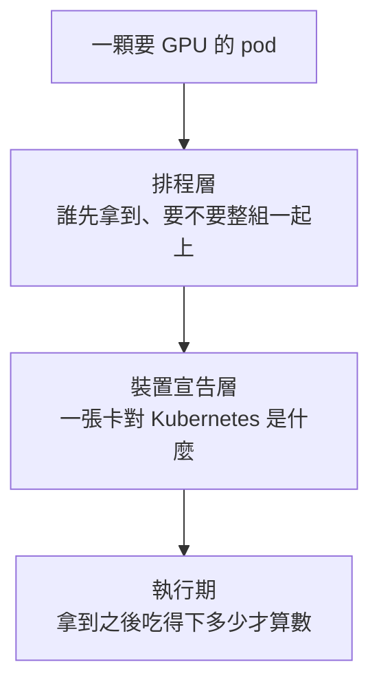
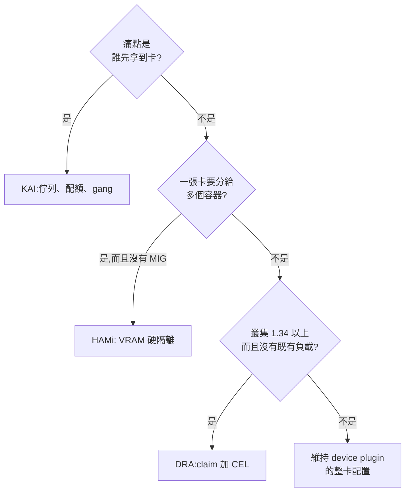

# Day 8: KAI、HAMi、DRA 分工決策表——場景選型與導入建議

{ align=right width="95" }

> Day 1 開場的問題只有一句:兩張 T4 被批次工作吃光,線上推論的 pod 進不來,這兩張卡該怎麼分。八天下來,答案散成三套東西——KAI 決定誰先拿到卡、HAMi 決定拿到之後能用掉多少、DRA 換掉「一張卡就是節點上的一個整數」這個前提。三套都裝過、都撞過牆之後,要回答的就不再是哪一套比較好,而是什麼情況下該用哪一套,以及這些結論能不能帶回自家那座版本較舊的叢集。今天不開新的 lab,只把八天量到的數字收斂成一張表,再把這張表撐得住的建議寫成清單。

!!! abstract "你在課程的哪裡"
    - **Day 0–7**:三套機制全部實測完畢,36 顆地雷在手。
    - **今天**:不動手。八天量到的數字收斂成一張分工決策表、幾道場景選型題,和一份帶回自家叢集的建議清單。
    - **接下來**:Sprint 1 到此完結,下一段的方向在章末。

## 三套機制,一句話版本

三套東西掛在同一顆 pod 的不同位置上。先看它們各自站在哪一層:



這張圖有一個地方要先講明白:DRA 不是只站在中間那層。它把裝置的描述搬進 `resource.k8s.io` 這組 API,配置動作則由 kube-scheduler 內建的 `dynamicresources` 外掛完成——換句話說它同時改寫了上面兩層,只是沒有碰最下面那層——這也是後面的決策表裡,DRA 的「隔離硬度」那一格只能寫成「沒有內建」的原因。

八天的內容隔得有點久,先用一行一天把量到的東西喚回來:

| Day | 主題 | 這一天最該記住的 |
|---|---|---|
| [0](sprint1-day0-azure-aks-foundation.md) | 環境奠基與成本紀律 | quota 有三個維度;`rollout status` 成功不代表 DaemonSet 有 pod |
| [1](sprint1-day1-kai-queue-basics.md) | KAI 安裝與佇列基礎 | quota 是保證下限;要更多卡就調 quota,不是調 priority |
| [2](sprint1-day2-gang-scheduling-preemption.md) | Gang scheduling 與搶占 | 湊不齊就整組不上、零 GPU 佔用;搶占的受害單位是整組 |
| [3](sprint1-day3-hami-memory-isolation.md) | HAMi VRAM 切分與硬隔離 | 容器撞的是自己的配額,不是卡的剩餘量 |
| [4](sprint1-day4-hami-kai-integration.md) | 放置策略與 KAI 官方整合 | 一個節點上的 `nvidia.com/gpu` 只能有一個供應者 |
| [5](sprint1-day5-hami-webui.md) | HAMi-WebUI 觀測介面 | 配額鏈與用量鏈是兩條鏈,壞了都顯示 0 |
| [6](sprint1-day6-dra-simulated-devices.md) | 用模擬裝置走完 DRA 的四個 API | 共享是一級公民;裝置在節點物件上隱形 |
| [7](sprint1-day7-dra-aks-real-gpu.md) | 真卡 DRA on AKS | T4 上整卡配置可用;坑幾乎都出在 chart 對平台的假設 |

### KAI Scheduler:排程層的公平與原子性

它回答的是主詞不是單一 pod 的問題——「這一組人該分到幾張卡」「這份訓練要八個 worker,給七個算不算數」。最能說明它價值的證據是 Day 2 那次三成員的 gang:叢集只有兩張卡、工作要三張,結果三顆 pod 全部 Pending,而且**一張卡都沒佔**。當下送一顆不相干、只要一張卡的探針 pod 進去,它照樣跑起來:

```text
NAME          READY   STATUS    RESTARTS   AGE   NODE
gang-prober   1/1     Running   0          26s   aks-gpuspot-21249019-vmss000006
gang3-7z29z   0/1     Pending   0          66s   <none>
gang3-8wtjf   0/1     Pending   0          66s   <none>
gang3-8zjvx   0/1     Pending   0          66s   <none>
```

PodGroup 上的狀態把理由講得很清楚:`Resources were found for 2 pods while 3 are required for gang scheduling`。與其讓兩個成員佔著卡等第三個(那兩張卡對誰都沒用),不如整組退出讓路,卡還能被別人利用。

### HAMi:device plugin 層的切分與硬隔離

它把一張實體卡對外宣告成十份,並且用 `libvgpu.so` 在 CUDA 呼叫層攔下超額配置。最有說服力的一組數字在 Day 3——一顆配額 4096 MiB 的容器以 512 MiB 為單位一路加碼,同時在宿主機端抽樣實體卡的用量:

```text
[11:17:02] 實體卡 used=4831 MiB | hog: HOG: allocated 2048 MiB total
[11:17:06] 實體卡 used=5855 MiB | hog: HOG: allocated 3072 MiB total
[11:17:10] 實體卡 used=6879 MiB | hog: HOG: allocated 3584 MiB total
[11:17:14] 實體卡 used=3193 MiB | hog: HOG: exception text = CUDA out of memory ...
```

被擋下的那一刻,實體卡是 **6879 / 16384 MiB——還空著 9.5 GB**,它照樣拿不到第八塊 512 MiB。攔截層自己印出來的那一行更直接:

```text
[HAMI-core ERROR (pid:1 ... allocator.c:52)]: Device 0 OOM 4401922048 / 4294967296
```

分母 `4294967296` 正好是 4 GiB 配額。上限是容器的配額,不是卡的剩餘量——「硬隔離」四個字的全部意思就在這一行。而同一張卡上的鄰居跨越兩次 OOM,`RESTARTS 0`、資料校驗值不變。

### DRA:資源表達的下一代基礎

它把裝置從「節點上的一個整數」變成可以被描述、被篩選、被具名宣告的物件。Day 6 的帳本把差別攤得很開:左邊兩顆 pod 共用一個具名 claim,右邊兩顆各自用 template 要一顆。

```text
own-a     1/1   Running
own-b     0/1   Pending      ← 最後一顆裝置被 own-a 拿走了
share-a   1/1   Running
share-b   1/1   Running

shared-gpu        gpu-6   reservedFor=share-a, share-b     ← 一顆裝置、兩個持有者
own-a-gpu-z6rlc   gpu-7   reservedFor=own-a
own-b-gpu-j5qrn   -       reservedFor=-
```

同樣兩顆 pod,共享寫法的裝置消耗量是獨佔寫法的一半——這是 `resources.limits` 那個整數欄位寫不出來的語意。到了 Day 7 換上真卡,整卡 DRA 配置在 Tesla T4 上驗證通過:ResourceSlice 宣告的那個 GPU UUID(`GPU-bf5809e7-…`),就是 pod 裡 `nvidia-smi -L` 印出來的那一張,而容器內的 `NVIDIA_VISIBLE_DEVICES` 是 `void`——證明卡是靠 CDI 掛進去的,不是舊的環境變數路徑。

## 分工決策表

三張表分三個問題看:這是什麼、怎麼用怎麼看、值不值得押。表格只放能橫向比較的值,條件與例外寫在表格下方;**沒測過的東西不進表格**,集中在後面的「沒測到的部分」。

### 這是什麼

| 維度 | KAI Scheduler v0.16.8 | HAMi v2.9.0 | DRA(K8s 1.35.6) |
|---|---|---|---|
| **解決的問題** | 搶卡的先後與回收 | 一張卡分給多人 | 裝置差異的表達 |
| **作用層** | 排程層 | device plugin 層 | Kubernetes API 層 |
| **分卡能力** | 無 | 有 | 無 |
| **執行期隔離** | 無 | 有 | 無 |

三個「無」都有但書。KAI 自己不分卡也不做執行期隔離,但官方整合可以把 HAMi-core 掛上去借用——兩條路最後吐出的 OOM 錯誤字串一字不差(Day 4)。DRA 這一版只驗得到整卡:一顆 claim 獨佔一張,或兩顆 pod 共用同一顆 claim(仍是整張卡),而共用時兩邊在容器裡看到的都是完整的 16384 MiB,誰先吃光誰贏(Day 7)。只有 HAMi 是兩件都自己做:一張 T4 對外宣告成十份,容器內掛 `libvgpu.so` 攔 CUDA 呼叫,超額當場拿到 OOM 而鄰居無事(Day 3)。

作用層的差別決定了後面所有事:KAI 是一整套自己的排程器(七個 Deployment),HAMi 是一顆標準 kube-scheduler 外掛一個 extender(三顆 pod),DRA 不是誰的產品,是 Kubernetes 內建的 API,廠商只補一支 kubelet plugin。

### 怎麼用、怎麼看

| 維度 | KAI Scheduler | HAMi | DRA |
|---|---|---|---|
| **表達單位** | 整數張數 | MiB | claim + CEL 條件 |
| **選擇粒度** | 節點 | 節點上的卡 | 單一裝置 |
| **事件資訊量** | 高 | 中 | 低 |
| **帳本位置** | ConfigMap 與 metrics | extender 記憶體與 annotation | ResourceSlice 與 ResourceClaim |
| **`describe node`** | 看得到張數 | 只看得到刀數 | 看不到 |

事件資訊量的落差最有感:KAI 把「誰用了多少、quota 多少、fair-share 多少、佇列優先權多少」四個數字直接印在事件訊息裡,不必翻日誌就能重建一次決策;DRA 的另一端只有一句 `cannot allocate all claims`,不說是哪個 claim、哪條 selector、篩掉幾顆——CEL 打錯字跟裝置真的不夠,事件文字一模一樣([Day 6 地雷 2](sprint1-day6-dra-simulated-devices.md#mine-2))。

帳本位置決定半夜查得到查不到。HAMi 的配額只活在 extender 的記憶體與 pod annotation 裡,節點物件上看不到 VRAM 餘額([Day 3 地雷 2](sprint1-day3-hami-memory-isolation.md#mine-2)),namespace 維度的 metric 還是幽靈帳([Day 4 地雷 4](sprint1-day4-hami-kai-integration.md#mine-4));DRA 更徹底,持卡的 pod 在 `describe node` 上每一欄都是 `0 (0%)`([Day 6 地雷 3](sprint1-day6-dra-simulated-devices.md#mine-3)),而 template 產的 claim 在 pod 一進終態就被刪掉,事後查不到它拿了哪一顆([Day 7 地雷 5](sprint1-day7-dra-aks-real-gpu.md#mine-5))。

### 值不值得押

| 維度 | KAI Scheduler | HAMi | DRA |
|---|---|---|---|
| **成熟度(截至 2026-08)** | CNCF sandbox | CNCF incubating | K8s 內建穩定功能 |
| **元件版本** | v0.16.8 | v2.9.0 | driver v0.4.x |
| **AKS 要補設定** | 要 | 要 | 要 |
| **AKS 有功能限制** | 無 | 無 | 有 |

三個都要補一點東西才會動:KAI 要清空 RuntimeClass 預設值、補上 VRAM 節點標籤([Day 4 地雷 1](sprint1-day4-hami-kai-integration.md#mine-1)、[地雷 2](sprint1-day4-hami-kai-integration.md#mine-2));HAMi 的節點標籤必須下在 pool 層級,而且裝之前要先驗映像 tag 存在(Day 3);DRA 要自己補 GPU 節點標籤([Day 7 地雷 2](sprint1-day7-dra-aks-real-gpu.md#mine-2))。差別在最後一列:前兩者補完就沒事,DRA 的限制是平台給的——alpha 開關全關,新舊寫法之間沒有並行的橋([Day 7 地雷 3](sprint1-day7-dra-aks-real-gpu.md#mine-3)),拓樸屬性在 Azure 也拿不到([地雷 4](sprint1-day7-dra-aks-real-gpu.md#mine-4)),補不了。

### 本課驗到的共存形狀

「能不能一起裝」的答案取決於範圍是節點還是叢集。下表只列實際跑過的組合:

| 組合 | 同節點 | 結果 |
|---|---|---|
| KAI + HAMi 平台 | 是 | ❌ 互相鎖死 |
| KAI + HAMi-core(搭原廠 device plugin) | 是 | ✅ 14 秒跑起來 |
| DRA driver + 原廠 device plugin | 是 | ❌ 官方禁止 |
| DRA 獨立節點池,KAI 與 HAMi 留原池 | 否 | ✅ 三套零干擾 |
| 不要 GPU 的 pod | — | ✅ 三套都不接手 |

第一列的鎖死細節見 [Day 4 地雷 3](sprint1-day4-hami-kai-integration.md#mine-3);第三列是 chart 在 `helm template` 階段就擋下來的硬性要求。倒數第二列是這門課實際採用的形狀,也是最務實的一種:**互斥發生在節點層,不在叢集層**。要在同一座叢集裡評估新機制,開一個貼著不同標籤的節點池,比在既有節點上疊裝安全得多。

## 場景選型

表格給的是屬性,選型要看情境。動手挑之前,三個問題按順序問一次就能收斂大半:



這張圖不是分類法,是提問順序——三個答案並不互斥。實務上最常見的其實是前兩個都「是」,於是兩套一起用,而那正是 Day 4 花整天在處理的組合。下面四個情境都能在課裡找到對應的實測。

### 線上推論與離線批次搶同一批卡

用 KAI 的佇列與配額,而且要把 quota 當成保證下限來設計。Day 1 的實測是這樣的:`batch-eval` 的 GPU quota 只有 1,但在 `inference-prod` 完全閒置時,它借到了兩張卡跑滿;`inference-prod` 一送工作進來,超額借走的那張在一秒內被回收,而 quota 內的那張誰也動不了。回收事件把整個決策攤開來:

```text
Evict  Pod kai-lab/batch-hog-2 was preempted by workload kai-lab/pg-infer-claim-2-...
  Batch Eval     uses <GPU: 2, ...> with a quota of <GPU: 1, ...>, fair-share of <GPU: 1, ...> and queue priority of <100>.
  Inference Prod uses <GPU: 0, ...> with a quota of <GPU: 1, ...>, fair-share of <GPU: 1, ...> and queue priority of <200>.
```

四個數字一次列完,不必翻日誌就能重建「為什麼是這一顆被砍」。事後有人來問工作為什麼消失時,這段訊息就是答案本身。

要讓某個佇列吃到更多卡,**要改的是 quota,不是 priority**——佇列優先權只作用在超額資源的分配順序上([Day 1 地雷 4](sprint1-day1-kai-queue-basics.md#mine-4))。另一個代價也要先知道:把工作標成不可被搶占的等級,換來的是「只能用 quota 內的資源」,叢集裡明明還有低優先權的工作在跑,它也拿不到([Day 1 地雷 5](sprint1-day1-kai-queue-basics.md#mine-5))。要 SLA 就把 quota 開到尖峰用量,要吞吐量就讓它去借超額、並接受隨時被收回。

### 消費級卡上要塞多個模型

先問一句:這批卡有沒有 MIG(Multi-Instance GPU,A100/H100 這類資料中心卡的硬體級分卡功能;消費級卡與 T4 都沒有)。沒有的話, VRAM 硬隔離就是目前唯一能做到「多租戶同卡且不互相吃掉」的路,而 HAMi 是課裡唯一驗成的實作。走哪一條路則看叢集現況。

**沒有排程器包袱、只想要密度**,用 HAMi 平台:Day 4 的對照組四顆各 4096 MiB 的 pod 剛好把一張 T4 的 16384 MiB 填滿,不浪費一滴。**已經在用 KAI 的佇列治理、想把切卡接進去**,走官方整合:同樣四顆 pod 只塞得下三顆,因為 KAI 內部把 VRAM 量化成兩位小數的 GPU 比例,4096 MiB 進位成 0.26,容器實得 4259 MiB,一張卡就只夠三份([Day 4 地雷 6](sprint1-day4-hami-kai-integration.md#mine-6))。

這筆帳換來的是可觀測性:HAMi 平台的配額只存在 extender 記憶體與 pod annotation 裡,KAI 路徑的那個數字躺在一個 `kubectl get cm` 就查得到的 ConfigMap。密度與可查性的取捨,不是誰比較好。

### 分散式訓練

用 gang,而且要記得 gang 的原子性是雙向的。好處在 Day 2 量得很清楚:湊不齊的三成員工作零 GPU 佔用,卡還能被別人用;湊得齊時兩顆 pod 的 `Scheduled` 與 `Bound` 落在同一秒,不是逐顆遞進。

代價是搶占的爆炸半徑。搶占者只要一張卡,兩個成員在同一秒一起被驅逐,釋出兩張卻只用掉一張:

```text
08:09:05Z  Evict  Pod kai-lab/gang2-x9vkj was preempted by higher priority workload ...
08:09:05Z  Evict  Pod kai-lab/gang2-7bpkp was preempted by higher priority workload ...
```

受害者的選擇單位是整組,不是單顆([Day 2 地雷 3](sprint1-day2-gang-scheduling-preemption.md#mine-3))。所以 gang 型工作要放進獨立佇列並給足 quota——quota 內的資源受保護,搶占進不來,這是把 Day 1 那條機制反過來用。

跑在 spot 上還要再加三件事,缺一不可:**開 cluster autoscaler**(被回收的節點不會自己補回來)、**在 39 秒的預告期內寫完 checkpoint**、**gang 大小留餘裕**(別讓 `minMember` 剛好等於全部節點數,否則重跑時連湊齊都湊不齊)。

### 全新叢集,版本已經在 1.34 以上

可以直接從 DRA 起手,理由有三個層次。表達力上,篩選粒度從節點降到裝置:Day 6 用一條 `device.driver != 'retro-gpu.example.com'` 就把「排除某個世代的卡」演完了,不必事先貼節點標籤、不必分開節點池。語意上,共享是一級公民,同一個具名 claim 被兩顆 pod 持有是正常寫法而不是繞路。可行性上,Day 7 在真的 Tesla T4 上驗過整卡配置,沒有任何老卡專屬的阻礙。

混卡叢集最直接受益的是選擇條件寫得出來。真卡 driver 在 ResourceSlice 上 advertise 的屬性裡,這四個最常拿來當篩選依據:

```yaml
attributes:
  productName:           { string: Tesla T4 }   # 型號,可以直接字串比對
  architecture:          { string: Turing }     # 世代,適合寫成「排掉太舊的」
  cudaComputeCapability: { version: 7.5.0 }     # version 型,要用版本比較不是字串比較
capacity:
  memory:                { value: 16Gi }        # 用 quantity() 與 compareTo() 比大小
```

`driverVersion` 這一項要小心,它被 semver 正規化過,`580.159.04` 會變成 `580.159.4`,想用字串比對必定失敗([Day 7 地雷 6](sprint1-day7-dra-aks-real-gpu.md#mine-6))。

缺口也要一起看,而且都不小:

- **稽核與容量要整套重寫。** 節點物件上看不到裝置,所有讀 `node.status.allocatable` 的儀表板、autoscaler、配額工具都會一致地看不見裝置;一次性工作跑完之後 claim 已經被刪,事後查不到它當時拿了哪一顆裝置——想留下這筆帳,得在 pod 還活著時抓,或者把裝置身分印進容器 log。
- **除錯還很陽春。** `cannot allocate all claims` 這句話在模擬 driver 與真 driver 上逐字相同,所以那是排程外掛本身的行為,不是哪個 driver 太簡單。
- **生態有版本落差。** 核心 API 已經穩定,但廠商 driver 還在 v0.4.x,而 chart 幾乎都預設你已經跑著 GPU Operator 或 NFD。

## 帶回自家叢集:導入建議清單

**以下只是建議,不是可以直接照貼的變更。** 底下每一條都是「課程環境量到什麼、據此建議做什麼」,沒有任何一條在生產環境驗證過;真要導入,每一條都得走自己的變更流程、在維護窗口內做,並且先在測試環境重驗。

建議適不適用,取決於環境的形狀。以下以一個常見情境為例:一座自管的 Kubernetes 叢集,版本還停在 **1.26** 沒升;節點上混著不同世代的消費級顯示卡(因此沒有 MIG 可用);KAI Scheduler 之前裝過但沒真的用起來,版本不明;工作負載是線上推論服務加上離線批次任務,兩者搶同一批卡。如果你的環境不是這樣,對照著調整每一條建議的前提。

### 把已經裝著的 KAI 用對,三步

**第一步,先把佇列樹與配額設計出來。** 依線上推論與離線批次這兩種流量各開一個 leaf queue,共用一個 parent。形狀大致是這樣(欄位語意與單位規定見 Day 1:CPU 是 millicore、memory 是 MB、GPU 是張數):

```yaml
# Queue(scheduling.run.ai/v2)的 spec 片段;這是建議的形狀,不是實際套用過的設定
spec:
  parentQueue: sona-root
  priority: 200
  resources:
    gpu: {quota: <尖峰同時在線的卡數>, limit: -1, overQuotaWeight: 2}   # 線上推論
---
spec:
  parentQueue: sona-root
  priority: 100
  resources:
    gpu: {quota: 0, limit: -1, overQuotaWeight: 1}                      # 離線批次
```

兩件事不能省。`limit` 一定要明寫 `-1`,漏寫等於把佇列鎖死在 quota 內、對方閒置時也借不到卡。要調整分配就調 quota;調 priority 沒有用,quota 內的資源受保護,任何佇列、任何優先權都動不了([Day 1 地雷 4](sprint1-day1-kai-queue-basics.md#mine-4))。

**第二步,決定哪些工作不可被搶占。** 線上推論用不可被搶占的等級換 SLA,但必須同時把 quota 開到尖峰用量,否則會出現最違反直覺的那個結果:優先權最高的 pod 反而是唯一卡在 Pending 的那顆,因為它不准超額([Day 1 地雷 5](sprint1-day1-kai-queue-basics.md#mine-5))。離線批次反過來,用可被搶占的等級去借超額資源,接受隨時被回收——搭配 SQS 這種可重投的佇列模型,回收的代價本來就低。

**第三步,gang 只給訓練與批次,而且要自己打開。** 裸的 `batch/v1` Job 就算寫了 `parallelism: 3`,`pod-grouper` 產出的 PodGroup 預設仍是 `minMember: 1`,行為跟完全沒裝 KAI 一模一樣([Day 2 地雷 1](sprint1-day2-gang-scheduling-preemption.md#mine-1))。要 gang 就在 Job 上明寫 `kai.scheduler/batch-min-member`,而驗證方法只有一個可靠:

```bash
kubectl -n <ns> get podgroups -o json | jq '.items[].spec.minMember'
```

這個數字是 1 就代表沒有 gang,不管 Job 寫了多少 parallelism。還有一個配套要一起做:被驅逐的成員如果以 exit code 0 結束,Job controller 會把整份工作記成「成功完成」,真正的計算一秒都沒做([Day 2 地雷 2](sprint1-day2-gang-scheduling-preemption.md#mine-2))。

### HAMi 對消費級混卡的價值與前置

那批卡全部沒有 MIG,而 VRAM 硬隔離不需要 MIG——這正是 HAMi 值得評估的原因,也是 Day 3 那組 6879 / 16384 MiB 的數字在講的事:一顆容器撞的是自己的配額,不是卡的剩餘量,而鄰居跨越兩次 OOM 完全沒事。

混卡叢集要多做一件課程環境沒有的功課:每張卡的 VRAM 不同,配額不能用同一個數字套全部,得按卡型分別設計。HAMi 把每張卡的規格寫在節點 annotation 的 `devmem` 欄位裡,那是唯一看得到實體規格的地方:

```bash
kubectl get node <gpu-node> -o json | jq -r '.metadata.annotations["hami.io/node-nvidia-register"]'
```

三個前置條件要先確認:

- **容器基底必須是 glibc。** HAMi 會對它管的每個容器寫入 `/etc/ld.so.preload`,而 `libvgpu.so` 動態連結 glibc;musl 系的 busybox 或 alpine 會在 `main()` 之前就死於 exit 127,看起來像映像壞了([Day 3 地雷 3](sprint1-day3-hami-memory-isolation.md#mine-3))。
- **監控要盯 annotation,不能只盯 Running。** HAMi 的 mutating webhook 是 `failurePolicy: Ignore`,webhook 掛掉時 pod 照樣建得起來、看起來一切正常,實際上隔離已經失效而且沒有任何告警——要監的是 pod 有沒有拿到 `hami.io/vgpu-devices-allocated` annotation。
- **配額要含 CUDA context 的開銷。** Day 3 那顆 4096 MiB 的容器實際只拿得到約 3584 MiB,差額約 512 MiB 是 context 本身吃掉的;要跑 4 GB 的模型,配額得開到 4.5 GB 以上。

### 版本差異的 caveat

課程跑的是 KAI v0.16.8 與 HAMi v2.9.0。既有環境上的 KAI 是什麼時候裝的、什麼版本,往往沒人說得準,所以**上面每一條都必須先查明版本、在測試環境用同版本重驗一次才能照抄**。

這不是形式上的免責。光是 chart 版本字串帶不帶 `v` 前綴這種小事,就足以讓一份升級腳本整個抓不到 chart([Day 1 地雷 1](sprint1-day1-kai-queue-basics.md#mine-1));而預設 PriorityClass 的數值、`pod-grouper` 對裸 Job 的預設行為、佇列 CRD 的 apiVersion,全都是會隨版本移動的東西。第一件該做的事其實只有兩道唯讀查詢:先問出正式環境上那套 KAI 的實際版本與 `Config` CR 內容,再決定要不要對齊到課程用的版本。

```bash
helm list -A -o json | jq -r '.[] | select(.chart | test("kai")) | "\(.name) \(.chart) \(.app_version)"'
kubectl get configs.kai.scheduler -A -o yaml     # operator 實際套用的設定,不是 values 檔
```

### DRA 在 1.26 上摸不到,但可以先在別的地方練

MicroK8s 1.26 連 `resource.k8s.io` 這組 API 都沒有,而真卡 driver 的官方前置條件是 Kubernetes v1.34.2 以上。升級是一個獨立專案,在那之前 DRA 對這類叢集只有規劃意義。

真要先練手,現成的場地是手邊任何一座版本夠新的測試叢集,或是本課這種按需開關的節點池——Day 6 用一台 CPU spot 節點把整套物件模型走完,機器成本不到 NT$0.2;Day 7 的真卡驗證用一台 T4 spot、二十三分鐘,約 NT$2.6。

要先知道的是:**指令不能直接搬**。Day 7 卡住的每一件事都不是硬體問題,而是 chart 假設你已經有 GPU Operator 或 NFD 幫忙認出 GPU 節點;driver root 路徑各平台也不同,AKS 是預設的 `/`,GKE 要改成 `/home/kubernetes/bin/nvidia`,由 GPU Operator 管理的環境則是 `/run/nvidia/driver`。這三個路徑的差別,足以讓同一份 values 檔在另一個平台上完全裝不起來。

## 沒測到的部分

清單不是遺憾,是地圖——把邊界標出來,下次要往哪走才有依據。八天下來沒碰到的東西分三類。

**硬體給的邊界**。T4 不支援 MIG,所以整個 sprint 沒有任何一張卡切得出 MIG instance;每台機器只有一張卡,單節點多卡的拓樸與 NUMA 親和性也就無從驗起(HAMi 的 `numa-first` 政策在 v2.9.0 本來也還沒實作)。要補這塊得換 A100 或 H100 等級的卡,成本是另一個量級。

**平台給的邊界**。AKS 把 DRA 的 alpha 開關全部關著,所以 partitionable devices(把一張卡切成多份裝置)、consumable capacity(依容量分食一顆裝置)、以及用 `resources.limits` 直接要 DRA 裝置這三條路,在這座叢集上一條都走不到。MPS 也屬於這類:opaque config 送得進 driver 也被接受,但容器裡的 `compute_mode` 仍然是 `Default`,等於沒生效。

**時間與範圍給的邊界**。KAI 這邊沒測整合路徑下的佇列搶占與 gang(兩張卡的環境讓多節點 gang 拓樸沒有發揮空間)、也沒測 `gpu-fraction` 這種寫法;HAMi 這邊沒驗算力切分 `nvidia.com/gpucores` 的實際精度(只確認資源名存在)、VRAM 超賣、以及混卡叢集上不同 `devmem` 的配額行為;還有一個沒嘗試過的組合是三套工具同時裝在**同一個節點**上——因為 device plugin 那一層本來就互斥,試了也只會複製 Day 4 的鎖死結果。

## 雲廠商差異備忘

八天的所有指令都綁在同一座 AKS 上。下面這些是量到的平台特性,不是三套機制本身的性質——換一個平台就得重驗。

| 在 AKS 上量到的 | 為什麼會這樣 | 換平台要重驗什麼 |
|---|---|---|
| 沒有 `nvidia` 這個 RuntimeClass | AKS 的 GPU 節點預設 runtime 本來就是 `nvidia-container-runtime`,不需要另外指名 | 跑 GPU Operator 的叢集會建出這個物件,KAI 的預設值反而是對的,不必清空 |
| `nvidia.com/gpu.memory`、`nvidia.com/gpu.present`、`feature.node.kubernetes.io/pci-*` 一個都不打 | 叢集沒有 NFD、也沒有 GPU Operator | 裝了 GPU Operator 的叢集這些標籤自動就有,Day 4 與 Day 7 那兩顆標籤地雷不會發生 |
| 節點層級的標籤活不過任何一次重建,要下在 pool 層級 | spot 回收與 pool 縮放拿到的都是全新 VM | on-prem 的固定節點沒有這個問題,但反過來說,寫在 node 物件上的髒 annotation 也不會被自動清掉 |
| DRA 的 alpha gate 全部關閉,而且改不了 | 托管控制面不開放 apiserver 的 `--feature-gates` | 自管控制面(MicroK8s、kubeadm)可以自己開 |
| `pcieRoot` 屬性拿不到 | Azure 的 N 系列用 Hyper-V VMBus 把 GPU 透傳給 guest,`/sys` 的路徑不以 `devices/pci` 開頭 | 裸機 on-prem 不會有這個問題,拓樸感知的選擇器在那裡寫得出來 |
| spot 節點被回收後容量默默減少,不會自癒 | node pool 的 `count` 是宣告式的現況,沒有 autoscaler 就沒有人負責補回期望值 | 這是 AKS node pool 的行為;其他平台的 spot 或 preemptible 語意要各自確認 |
| HAMi chart 的 kube-scheduler 映像預設走阿里雲鏡像站 | chart 的預設值,tag 由 `.Capabilities.KubeVersion` 推導 | 網路受限或有映像政策的環境要換 registry,而且要在安裝前先驗 tag 存在 |

有兩行探測在任何平台上都該排在「裝之前」,而不是「裝壞之後」:

```bash
kubectl get --raw /metrics | grep kubernetes_feature_enabled | grep -i DRA   # DRA 能做到哪裡
kubectl get runtimeclass                                                     # chart 預設要的那個存不存在
```

最後一句提醒:本課指令裡的 `az aks nodepool`、`agentpool` 標籤、spot toleration,全部是 AKS 的形狀。搬到 GKE 或 MicroK8s 之前,先把這幾樣換掉,再談後面的事。

## 地雷回顧

八天累積的具名地雷不必一顆一顆重看,但其中三群有跨章的共同結構,值得單獨拎出來。

### 假成功家族:工具說成功,東西沒起來

這一群第一次出現是在 Day 0——device plugin 的 `rollout status` 回報成功,DaemonSet 的 desired 卻是 0([Day 0 地雷 1](sprint1-day0-azure-aks-foundation.md#mine-1))。之後它換了好幾種樣子回來。

`helm upgrade -i --wait` 回報 `STATUS: deployed`,而一半的元件還在 `ContainerCreating`,因為真正的元件是 operator 二次產生的,Helm 看不到([Day 1 地雷 2](sprint1-day1-kai-queue-basics.md#mine-2))。被驅逐的 gang 因為成員以 exit code 0 結束,Job 被判定 `Complete`([Day 2 地雷 2](sprint1-day2-gang-scheduling-preemption.md#mine-2))。`helm upgrade` 改好了 ConfigMap 也回報成功,但 Deployment 的 pod template 一個字都沒動,容器裡那份設定還是舊的([Day 5 地雷 2](sprint1-day5-hami-webui.md#mine-2))。到了 Day 7,`helm install --wait --timeout 6m` 在七秒內回報 deployed,而 DaemonSet 的 desired 是 0([Day 7 地雷 1](sprint1-day7-dra-aks-real-gpu.md#mine-1))。

共同的判準只有一句:回傳值證明的是「指令有跑完」,不是「東西在跑」。安裝之後永遠要自己數一次——Deployment 數 `Available`、DaemonSet 數 `DESIRED`、gang 數 `spec.minMember`、設定改完數 pod 的 `AGE` 有沒有歸零。

### 帳本家族:看不見的配額與對不上的數字

GPU 這一層有一個共通的形狀:真正決定「還能不能再排一顆」的那本帳,通常不在 `kubectl describe node` 上。

HAMi 的 VRAM 餘額只存在 extender 記憶體與 pod annotation 裡,節點帳本只寫「切了幾刀」([Day 3 地雷 2](sprint1-day3-hami-memory-isolation.md#mine-2))。就算去讀 metrics,namespace 維度那組是幽靈帳——namespace 刪掉一小時了,數字還掛在上面,只有 device 維度的可信([Day 4 地雷 4](sprint1-day4-hami-kai-integration.md#mine-4))。接上 WebUI 之後,每個任務的用量整片顯示 0,原因是 Prometheus 把 exporter 帶的標籤改了名,後端那句 PromQL 永遠命中不到([Day 5 地雷 3](sprint1-day5-hami-webui.md#mine-3))。換到 DRA,裝置根本不是擴充資源,持卡的 pod 在節點帳本上每一欄都是 `0 (0%)`([Day 6 地雷 3](sprint1-day6-dra-simulated-devices.md#mine-3));而一次性工作跑完之後,連那筆配置紀錄都被主動刪掉([Day 7 地雷 5](sprint1-day7-dra-aks-real-gpu.md#mine-5))。

判準同樣是一句:每一個數字都要能說出它是哪一本帳算出來的。看到 0,先問這是「真的沒人用」還是「資料沒送到」——這兩件事在畫面上長得一模一樣。

### spot 家族:便宜的代價都寫在回收那一刻

spot 的三種風險在課裡都撞到了。

一台被回收之後,pool 的 `count` 從 2 變 1 而狀態是 `Succeeded`,叢集就這樣少了一半 GPU,沒有任何告警——沒開 cluster autoscaler 就沒有人負責補([Day 2 地雷 4](sprint1-day2-gang-scheduling-preemption.md#mine-4))。兩個操作者對同一個 node pool 各下各的期望值時,後寫入者靜默勝出,而 activity log 有數分鐘的傳播延遲,「查了 log 沒看到別人」在事發後幾分鐘內根本不成立([Day 2 地雷 5](sprint1-day2-gang-scheduling-preemption.md#mine-5))。

第三種風險沒有編號。Day 5 的 WebUI 上線一個半小時後,兩台 GPU 節點被 Azure 平台真的收走,趨勢圖上留下一段完整的缺口,而畫面本身沒有任何異常標記——[Day 5 那一段](sprint1-day5-hami-webui.md)把 Day 2 用模擬做出來的結論,用一次自然發生的事件重演了一遍。

三者合起來的結論很直接:spot 上跑 gang 是風險相乘而不是相加,而 spot 上跑觀測介面,要先知道畫面歸零可能只是節點不見了。

## 帶得走的東西

- 三套機制不是競品,是三個不同的層。同一顆 pod 可以同時被排程層決定去哪、被裝置宣告層決定拿到什麼、被執行期決定吃得下多少。八天裡撞到的互斥全部發生在同一個地方——一個節點上的裝置供應者只能有一位:`nvidia.com/gpu` 只能由一個 device plugin 提供,而 DRA 的 kubelet plugin 與 classic device plugin 同樣不得共節點。
- 「一張卡」是一個會變的數字。原廠 device plugin 說 1,HAMi 說 10,KAI 隔著 HAMi 的帳本看到的是 20,DRA 則說節點上根本沒有這個資源。任何跨系統的容量計算,第一件事是問清楚對方的「一張」是什麼。
- 隔離要落在執行期才算數。KAI 決定誰拿到卡,HAMi-core 決定拿到之後吃不吃得下;兩條完全不同的整合路徑,最後執行隔離的是同一份 `libvgpu.so`,連超額時吐出來的 `allocator.c:52` 錯誤字串都一字不差。決定隔離強度的不是誰排的程,是誰在容器裡攔 CUDA 呼叫。
- 精度與可觀測性是一組取捨。HAMi 以 MiB 精確記帳,一張卡切滿不浪費,但帳本藏在 extender 的記憶體裡;KAI 存的是兩位小數的比例,每張卡少塞一個租戶,但那個數字躺在一個查得到的 ConfigMap。選型時要知道自己在買哪一邊,而不是問哪一邊比較好。
- 托管平台的邊界要用查的,不是用猜的。一行 feature gate 查詢就把 DRA 在這座叢集上能做什麼圈出來,一行 `kubectl get runtimeclass` 就避開一顆讓 pod 連建都建不出來的地雷。
- 沒有任何一個現成工具會替你回答「這台機器還剩幾張卡」。device plugin 時代那個 `describe node` 的減法,在 HAMi 上只剩一半真相,在 DRA 上完全消失。要這個數字,就得自己決定它從哪本帳算。

## 延伸閱讀

想往下深挖,從這幾份開始:

- **[Dynamic Resource Allocation | Kubernetes](https://kubernetes.io/docs/concepts/scheduling-eviction/dynamic-resource-allocation/)** —— DeviceClass、ResourceClaim、ResourceSlice 的官方定義,以及 CEL 篩選與裝置共享這兩項能力的說明,決策表「表達力」那一列的出處。
- **[HAMi 官方的 KAI Scheduler 整合指南](https://project-hami.io/docs/next/userguide/kai-scheduler/how-to-use-kai-scheduler)** ——(HAMi 文件站僅 next 版本收錄此頁,對應版本路徑不存在,截至 2026-08)官方對這個整合的劃界(用的是 HAMi-core 函式庫而不是 HAMi 平台)、`gpu-memory` annotation 的寫法,以及比例換算的警告,對應決策表「與其他機制的相容」那一列。
- **[DRA Driver for NVIDIA GPUs 的前置條件](https://github.com/kubernetes-sigs/dra-driver-nvidia-gpu/blob/v0.4.1/docs/prerequisites.md)** —— Kubernetes 版本下限、driver 版本、CDI、NFD 與各平台的 driver root 路徑差異,導入建議裡「指令不能直接搬」那一段的依據。
- **[KAI Scheduler 的 CNCF 專案頁](https://www.cncf.io/projects/kai-scheduler/)** —— 進 sandbox 的日期與社群活躍度資料,決策表「成熟度」那一列的來源。
- **[HAMi 成為 CNCF incubating 專案](https://www.cncf.io/blog/2026/07/15/hami-becomes-a-cncf-incubating-project/)** —— TOC 通過的公告與專案定位說明,與上一條並讀就看得出兩個專案的成熟度差在哪裡。

## 下一步

Sprint 1 到這裡收尾。整個 sprint 從一張 quota 申請單開始,結束在一張需要自己填的決策表——中間每一格的數字都來自同一座只有兩張 T4 的 AKS 叢集,換一個平台、換一批卡,都得重新量一次。

下一組主題往更下面一層走。卡分好了、工作跑起來了之後,誰在看它們在節點上實際做了什麼:eBPF 與執行期安全是 roadmap 的下一站。

---

!!! quote ""
    Kubernetes 標誌為 CNCF 之官方資產,此處作社群教學用途。
