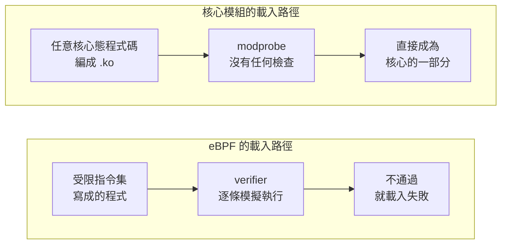
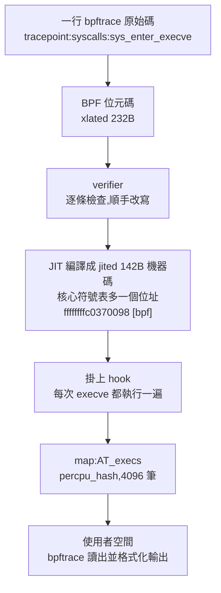
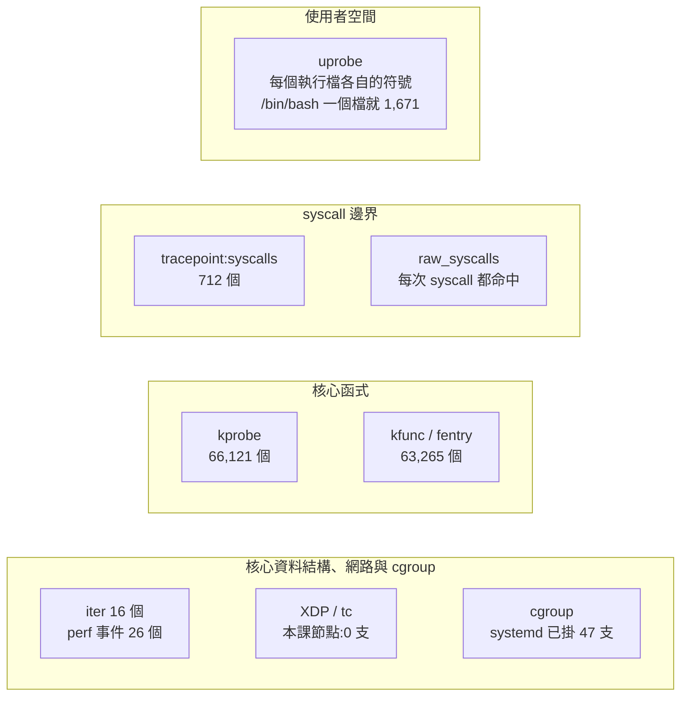
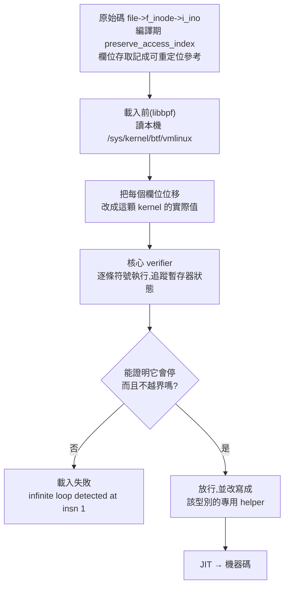

# Day 0: eBPF 是什麼——程式進入核心的路徑、掛載點種類,以及核心如何把關

{ align=right width="130" }
{ align=right width="130" }

> 這一章不裝任何東西,也不改叢集的設定,目的只有一個:讓你能對別人解釋什麼是 eBPF。它是這個 sprint 後面每一個工具(Falco、Tetragon、Cilium)共同的地基,而那些工具的說明書都預設你已經知道這件事。今天用四個問題把它拆開——程式怎麼進到核心裡、能掛在哪些位置、誰在保證它不會把機器弄壞、以及為什麼同一支程式換一台機器還能跑——每個問題都配一張圖和一組在真實節點上量到的數字。最後留兩行指令給你親手驗證,其餘時間只要讀。

!!! abstract "你在課程的哪裡"
    - **起點**:不需要 Sprint 1 的 GPU 排程知識。會用 `kubectl` 開一顆 pod、看得懂 `ls -l` 的輸出就夠。
    - **今天**:用四張圖把 eBPF 拆開,每張圖都配一組在真實節點上量到的數字。驗收:親手跑一行指令,看到「我剛剛在另一顆 pod 裡執行的那個檔案」出現在輸出裡。
    - **Day 1**:同一支工具,換成三支現成的追蹤腳本。

!!! note "指令裡的佔位符"
    指令用 `<cluster>` 代表你的 kubectl context 與叢集名稱、`<resource-group>` 代表資源群組、`<subscription-id>` 代表訂閱 ID——照做時換成自己的值。

## 原理與架構

### 先講清楚:eBPF 是什麼

作業系統分成兩塊。**核心**(kernel)是最底層那一塊,直接管硬體:CPU 給誰用、記憶體怎麼配、封包怎麼進出網卡、檔案在磁碟上的哪裡——所謂「Linux」指的就是這個核心。你寫的程式則跑在上面那一塊,叫**使用者空間**(user space)。

這兩塊是隔開的。使用者空間的程式不能直接碰硬體,想開一個檔案、送一個封包,都得請核心代勞,而這種請求叫 **system call**(系統呼叫)。你的容器、你的 `kubectl`、你的 nginx,每做一件實事都在下 system call。

現在假設你想知道「這台機器上到底是誰在開哪些檔案」,或是想在某個行為發生的當下擋下它。核心沒有現成功能可以回答你,而以前只有兩條路可以走:改核心原始碼重新編譯(不切實際),或是寫一個**核心模組**載進去。模組可行,但它載入之後就是核心的一部分,寫錯一行的代價是整台機器停擺。

eBPF 是第三條路:**你把一小段程式送進核心,核心先逐條檢查它安不安全,通過了才讓它掛在你指定的位置上執行。** 它跑在核心裡,所以看得到核心看得到的一切、速度也快;但它被關在一個受限的框框裡,所以出事的是你的程式,不是整台機器。

換個說法:核心模組像是把你的程式碼直接焊上主機板;eBPF 則是插一張要過安檢的擴充卡——安檢不過就插不進去,插進去之後也只能做被允許的事。

不過這個比喻只講到「怎麼裝進去」。更貼近它平常怎麼運作的比喻是**瀏覽器與 JavaScript**:網頁上的 JavaScript 跑在瀏覽器裡面,但它不能直接改瀏覽器的記憶體,只能呼叫瀏覽器開放的那組 API,而且只能在瀏覽器允許的事件上執行。eBPF 之於核心就是這個關係——核心提供一套執行環境、一組 helper 函式,以及一批**它自己決定要開在哪裡**的掛載點。所以正確的說法不是「核心切了一塊空間給 eBPF」,而是**核心多長出了一套受控的擴充介面**。

三個詞先記著,本章後面會一直用到:

| 詞 | 意思 |
|---|---|
| **掛載點(hook)** | 程式可以掛上去的位置,例如「每次有人開檔案的時候」 |
| **verifier(檢查器)** | 核心裡負責安檢的那一關,不通過就載入失敗 |
| **map** | 核心裡的程式與外面的你之間傳遞資料的容器 |

這套機制不是什麼前沿實驗——**你的 Kubernetes 節點現在就跑著幾十支 eBPF 程式,而且不是你放的**。下一節就把那份清單印出來。

### 它不是一次出現的,而這決定了本 sprint 的工具長什麼樣

你其實早就用過它的前身。每次打 `tcpdump 'tcp port 443'`,那個過濾條件會被編成一段小程式送進核心,由核心決定每個封包要不要交給你——這就是 1990 年代的 **BPF**(封包過濾器),後來稱作 cBPF(classic BPF)。它的功能就只有這麼多:封包進來,回答要或不要。

`bpf()` 這個系統呼叫在 **Linux 3.18(2014 年)** 進到核心,把它擴充成 extended BPF,也就是 eBPF。之後每一版核心陸續加東西,而**加的順序決定了今天有哪些工具**:

| 後來加進來的能力 | 讓誰得以存在 |
|---|---|
| kprobe、tracepoint 這類追蹤掛點 | bpftrace、BCC 這類即時追蹤工具([Day 1](sprint2-day1-bpftrace-basics.md)) |
| cgroup 相關掛點 | 以容器與工作負載為單位的管制([Day 2](sprint2-day2-bpftrace-kubernetes.md) 的 pod 身分就靠 cgroup) |
| XDP、TC 這類網路路徑掛點 | Cilium 這種把資料路徑換掉的 CNI(Day 7–9) |
| BTF 與 CO-RE | 同一份程式換一顆 kernel 還能跑,不必在每台機器上重編 |
| LSM 掛點 | 從「看得到」變成「攔得住」,也就是 [Day 6](sprint2-day6-tetragon-enforcement.md) 的攔截 |

所以這個 sprint 的四個工具不是隨便挑的,它們各自站在這條累積線的不同段上。**看懂這張表,後面每一天在學什麼就有位置可放。**

### 節點上已經在跑的 BPF 程式

本課的節點是 AKS 的 Ubuntu 24.04(kernel `6.8.0-1062-azure`),一台剛開出來、沒有裝過任何觀測工具的托管節點。

**先說明這些輸出是從哪裡來的。** 托管的 Kubernetes 不給你節點的 SSH,想站到節點的視角只有一條標準路:開一顆**特權 pod**,再從它跳進節點的命名空間。完整做法是本章[步驟 1](#step-1) 要做的事,這裡先看結果就好。原始指令長這樣:

```console
$ kubectl -n ebpf-lab exec ebpf-lab-xxxxx -- \
    nsenter -t 1 -m -- bpftool prog list
```

前面那一長串的意思是「在特權 pod 裡,借用節點 1 號行程的檔案系統視角,執行 `bpftool`」。`bpftool` 是核心專案自己附的管理工具,節點上內建一支,容器裡反而裝不起來([地雷 2](#mine-2))。**接下來的區塊為了好讀,一律只寫 `bpftool` 本身,前面那段前綴請自行補上。**

先數核心裡已經載入了幾支 BPF 程式(`grep -c` 在這裡的作用是數「以編號開頭」的行,一行就是一支程式):

```console
$ bpftool prog list | grep -cE '^[0-9]+:'
52
$ bpftool prog list | grep -oE '^[0-9]+: [a-z_]+' | awk '{print $2}' | sort | uniq -c | sort -rn
     41 cgroup_device
      6 cgroup_skb
      1 tracing
```

分類那次取樣比計數那次晚了一會兒,總數會差幾支——41 支 `cgroup_device` 加 6 支 `cgroup_skb` 都是 systemd 掛的,另外那支 `tracing` 不是,它是核心自帶的(這台機器上 prog id 2,開機就在)。看 systemd 掛在哪:

```console
$ bpftool cgroup tree | head -7
CgroupPath
ID       AttachType      AttachFlags     Name
/sys/fs/cgroup/system.slice/systemd-networkd.service
    284      cgroup_device   multi           sd_devices
/sys/fs/cgroup/system.slice/systemd-udevd.service
    277      cgroup_inet_ingress multi        sd_fw_ingress
    276      cgroup_inet_egress  multi        sd_fw_egress
```

`sd_devices` 是每個 service 的裝置存取控制,`sd_fw_ingress`／`sd_fw_egress` 是每個 service 的防火牆。這些程式隨開機載入,不需要任何人啟用:**在這座叢集決定要不要導入 eBPF 之前,systemd 已經用它管著裝置存取與每個 service 的封包進出**。網路那一層今天則是空的——`ip -d link show` 在 `lo`、`eth0`、`azv*` 上都找不到 XDP 程式,`tc filter show dev eth0 ingress` 也沒有輸出,Azure CNI 的資料路徑不走 eBPF。這個「零」是 Day 7 換上 Cilium 之後最好的對照基準,先記著。

### 今天要走的路

四個主題依序展開,每個配一張圖與一組實測數字;動手的兩行指令留到最後。

1. **核心模組與 eBPF 的差異**——在 eBPF 之前,把程式碼放進核心只有核心模組一種做法,而載入時不經過任何檢查。
2. **eBPF 程式的生命週期**——從一行原始碼,到核心符號表裡一個有位址的函式,中間經過哪幾道手續。
3. **掛載點的種類與分布**——這台機器上量到 133,022 個掛載點,分佈在使用者空間到網路路徑的哪幾層,以及掛在不同位置的開銷差異。
4. **verifier 的檢查機制**——它會拒絕什麼、憑什麼拒絕,以及同一份位元碼為什麼換一顆 kernel 還能跑(BTF 與 CO-RE)。

### 一、核心模組與 eBPF 的差異:載入前有沒有檢查

核心模組(kernel module)是把程式碼放進核心的傳統做法:編一個 `.ko`,`modprobe` 一下,它就成為核心的一部分。這台機器上載入著 82 個,而且沒有上鎖(`modules_disabled=0`),還能繼續載。實際載一個看看——`dummy` 是核心自帶的假網路裝置模組,載入與卸載都無害:

```console
$ lsmod | tail -n +2 | wc -l
82
$ modprobe dummy
(沒有任何輸出)
$ lsmod | grep '^dummy'
dummy                  16384  0
$ rmmod dummy
(沒有任何輸出)
```

一行指令載入完成,全程沒有任何檢查。而模組裡的程式碼是**完整的核心態程式碼**:它可以讀寫任何記憶體、可以停用中斷、可以讓整台機器 panic。`modprobe` 到程式碼進入核心之間,沒有任何驗證環節。

同一顆容器裡,換成 eBPF 的載入路徑。下面這支程式只有一條指令:直接 `exit`,比合法版本少了「把 r0 設成 0」那一行,核心的回覆是 `errno = 13`:

```console
## R1 沒設定回傳值就 exit(r0 未初始化)
0: R1=ctx() R10=fp0
0: (95) exit
R0 !read_ok
```

一個完整的核心模組進得去,一支一行、只是少寫一個回傳值的 BPF 程式進不去。**把程式碼放進核心這件事本身,核心模組早就做得到;eBPF 增加的是載入前的逐條檢查。**



下半段那條路徑的代價寫在第一格:eBPF 的指令集是**受限的**,能做的事遠少於核心模組。整個 Sprint 2 的工具都在這個限制下運作,換到的是「裝壞了不會整台停擺」。

### 二、eBPF 程式的生命週期:從原始碼到核心裡的一個位址

用一行最普通的 bpftrace 觀察整段流程。掛上探針的那一刻,核心裡的程式從 52 支變成 55 支:

```console
$ bpftool prog list | grep -A1 -E '^[0-9]+: (tracepoint|perf_event)'
470: tracepoint  name tracepoint_syscalls_sys_enter_openat  tag afe1b01453072a6e  gpl
	xlated 232B  jited 142B  memlock 4096B  map_ids 46
471: tracepoint  name tracepoint_syscalls_sys_enter_execve  tag afe1b01453072a6e  gpl
	xlated 232B  jited 142B  memlock 4096B  map_ids 45
472: perf_event  name 1  tag 8c75940e7e21306d  gpl
	xlated 192B  jited 117B  memlock 4096B  map_ids 47
```

**一行 bpftrace 產生三支獨立的核心程式**(兩個 tracepoint 加一個計時用的 perf_event)。欄位就是這一節要講的整條鏈:`xlated 232B` 是 **BPF 位元碼**的長度,`jited 142B` 是它被 **JIT 編譯**成 x86-64 機器碼之後的長度,兩個數字並排就是「JIT 真的發生了」最短的證據;`map_ids 45` 指向它用的 map,資料靠這個回到使用者空間;`tag afe1b01453072a6e` 則是位元碼內容的雜湊。

JIT 產生的機器碼會登記進核心的符號表:

```console
$ grep bpf_prog /proc/kallsyms | grep -i execve
ffffffffc0370098 t bpf_prog_afe1b01453072a6e_tracepoint_syscalls_sys_enter_execve	[bpf]
```

`ffffffffc0370098` 是一個真的核心位址,`[bpf]` 標明它的來源,而符號名裡的 `afe1b01453072a6e` 正是上面那個 tag。整段流程於是可以逐格對上:**bpftrace 的一行原始碼 → 232 bytes 的位元碼 → verifier → JIT → 核心程式碼段裡一個有位址的原生函式**。



圖的最後兩格是資料回到使用者空間的路徑,也是**最影響腳本寫法的一段**。核心裡的程式不能直接 `printf` 給終端機,它只能寫進 map,由使用者空間去讀:

```console
$ bpftool map list | grep -E '^[0-9]+:'
46: percpu_hash  name AT_opens         flags 0x0
48: ringbuf      name ringbuf          flags 0x0
$ bpftool map show id 56
56: percpu_hash  name AT_opens  flags 0x0
	key 16B  value 8B  max_entries 4096  memlock 427008B
```

bpftrace 把腳本裡的 `@opens` 轉成 map 名 `AT_opens`(`@` 換成 `AT_`),而那個 `ringbuf` 是它送 `printf` 輸出用的管道——**同一支程式同時用了兩種回傳機制:聚合走 map,逐筆事件走 ring buffer**。規格那四個欄位各有含意:`key 16B` 是因為 key 存的是行程名,而 Linux 的 `TASK_COMM_LEN` 就是 16;`value 8B` 是一個 `u64` 計數器;`max_entries 4096` 表示 map 有上限,**第 4,097 個不同的行程名會被丟掉**,這是 Day 1 寫腳本時第一個會踩到的限制;`memlock 427008B` 則說明一個計數器 map 就鎖住了 417 KB 核心記憶體。

map 裡的原始位元組:

```console
$ bpftool map dump id 56
key:
63 6f 6e 74 61 69 6e 65  72 64 00 00 00 00 00 00
value (CPU 00): 84 00 00 00 00 00 00 00
value (CPU 01): b6 02 00 00 00 00 00 00
```

`63 6f 6e 74 61 69 6e 65 72 64` 是 `containerd`——map 裡沒有字串型別,只有固定寬度的位元組,16 bytes 的 key 補零到底。而 `value (CPU 00)` 與 `value (CPU 01)` 兩行是 `percpu_hash` 的本體:**每顆 CPU 各持有一份計數器,核心裡的遞增完全不必上鎖**,等使用者空間要看的時候才把各 CPU 加總。兩顆 vCPU 的機器就是兩行,這是 eBPF 便宜的關鍵設計之一。

同一份資料的第三種形式,是 bpftrace 結束時輸出的彙總(`@opens[kubelet]: 1759`、`@opens[containerd-shim]: 10499`)。程式的 `map_ids` 欄位指向 map、`bpftool map dump` 看到位元組、bpftrace 看到「行程名 → 次數」,三者是同一塊記憶體的三種視角——**map 是核心與使用者空間之間唯一的共享記憶體**。這整段流程何時被拆掉則由檔案描述子決定:程式的生命週期跟著 fd 走,不跟著終端機走,詳見[地雷 6](#mine-6)。

### 三、掛載點的種類與分布:133,022 個位置,以及各自的開銷

先講一件會被下面那個數字誤導的事:**你不能說「我要在核心第 12345 行插一支程式」。** 掛載點是一份**核心自己決定要開在哪裡**的清單——`kprobe`、`tracepoint`、`XDP`、`TC`、`cgroup`、`LSM` 這幾類,而且每一類能拿到什麼參數、能呼叫哪些 helper 都是規定好的。所以 eBPF 做得到多少,上限不在你會不會寫程式,**在核心開了哪些門**。

清單很長,但它是一份清單,不是「任意位置」。這台機器上可用的掛載點,bpftrace 可以直接列出來:

```console
$ bpftrace -l | wc -l
133022
$ bpftrace -l | awk -F: '{print $1}' | sort | uniq -c | sort -rn
  66121 kprobe
  63265 kfunc
   2153 tracepoint
   1441 rawtracepoint
     16 iter
     14 software
     12 hardware
```

| 類別 | 數量 | 掛在什麼上 | 穩定性 |
|---|---|---|---|
| `kprobe` | 66,121 | 核心函式進入點 | 不穩定 |
| `kfunc` | 63,265 | 核心函式(帶型別) | 不穩定 |
| `tracepoint` | 2,153 | 靜態掛點 | 穩定 |
| `rawtracepoint` | 1,441 | 靜態掛點(低階) | 穩定 |
| `iter` | 16 | 核心資料結構 | 穩定 |
| `software` | 14 | perf 軟體事件 | 穩定 |
| `hardware` | 12 | CPU 計數器 | 看 CPU |

「穩定」這一欄講的是跨 kernel 版本會不會消失。`kprobe` 與 `kfunc` 掛的是核心的內部函式,函式改名、被編譯器 inline 掉,探針就找不到目標;`tracepoint` 是核心開發者刻意留下的掛點,算 ABI 的一部分,不會隨手拿掉。`hardware` 那 12 個是 CPU 的效能計數器(cache-misses、instructions 之類),換一種 CPU 就換一組。而 `kfunc` 與 `kprobe` 的差別是型別:`kfunc` 走 BTF 拿參數型別,所以你能寫 `args.file->f_inode`,`kprobe` 只給你一串暫存器。

`uprobe` 沒出現在上表,因為它**不是固定數量的**——你指定哪個執行檔,就有那個執行檔的符號數:

```console
$ bpftrace -l 'uprobe:/bin/bash:*' | wc -l
1671
```

光是 `/bin/bash` 一個檔案就有 1,671 個使用者空間掛點,這個數字標出了核心層與使用者空間層的分界。

靜態掛點的分布,依子系統拆開來看:

```console
$ bpftrace -l 'tracepoint:*' | awk -F: '{print $2}' | sort | uniq -c | sort -rn | head -5
    712 syscalls
    188 cfg80211
    136 sunrpc
    113 ext4
     91 kvm
```

三分之一在 `syscalls`。這也解釋了為什麼執行期安全工具幾乎都從 syscall 下手——那裡的掛點最密、最穩定,而且是所有容器共用的同一條路。順帶一個交叉驗證:`bpftrace -l 'tracepoint:*'` 數到的 2,153,跟從核心的 tracefs 直接讀(`wc -l < /sys/kernel/debug/tracing/available_events`)完全一樣,**工具的清單就是核心的清單,不是它自己編的**。



#### 掛載點的位置決定開銷

掛載點不只有「掛得到／掛不到」的差別,執行開銷也不同。量法很直接:在一顆非特權 pod 裡跑固定工作負載,同節點另一顆 pod 掛不同的探針,各量三輪。

```bash
dd if=/dev/zero of=/dev/null bs=512 count=2000000    # 2M reads + 2M writes = 4M syscalls
```

| 狀態 | 三輪(秒) | 平均 | 相對 A |
|---|---|---|---|
| A. 無追蹤 | 2.43434 / 2.39734 / 2.44853 | 2.427 | — |
| B. 輕量:只掛 `sys_enter_execve` | 2.52514 / 2.51548 / 2.51326 | 2.518 | +3.8% |
| C. 重量:`raw_syscalls:sys_enter` | 3.72147 / 3.94398 / 3.78143 | 3.816 | +57.2% |
| D. 回到無追蹤 | 2.51958 / 2.39927 / 2.40542 | 2.441 | +0.6% |

B 掛的探針在 `execve` 上,而 `dd` 一次 `execve` 都沒呼叫;C 掛的 `raw_syscalls:sys_enter` 則是每次 syscall 都命中,而 `dd` 恰好是純 syscall 迴圈——這是刻意挑的最壞情況,真實工作負載不會有這種比例。D 回到 A 的水準(差 0.6%),所以 C 的 57% 不是機器自己變慢。由 C 與 A 的差可以算出單位成本:(3.816 − 2.427) 秒 ÷ 4,000,000 次 = **每次 syscall 約 347 奈秒**,裡面包含進入 tracepoint、跑完 JIT 過的 29 條指令、取得行程名、以及 percpu hash 的查表與遞增。被測次數另有一份獨立佐證:重量追蹤自己數到 `@s[dd]: 12000144`,而三輪 × 400 萬 = 1,200 萬,誤差 144 次是 `dd` 自己開檔收尾的量。

**這組數字是量級指標,不是 benchmark**:量的是牆鐘時間不是 CPU 時間,沒有隔離排程干擾,機器只有 2 vCPU——B 的 +3.8% 有一部分很可能就是 bpftrace 行程本身在跟 `dd` 搶 CPU(那支探針理論上一次都不該被觸發)。57% 這個數字本身不重要,重要的是**開銷正比於命中次數**這條性質:掛在冷門事件上幾乎免費,掛在每次 syscall 上很貴,中間是連續光譜。Day 1 挑 probe、Day 3 之後寫規則,取捨都落在這條光譜上。

### 四、verifier 的檢查機制:逐條模擬,以及 BTF 帶來的跨 kernel 可攜性

#### verifier 拒絕的四種程式

要觀察 verifier 的判定,得先繞過工具本身的保護。用 bpftrace 幾乎寫不出被 verifier 拒絕的程式:無界迴圈會被 LLVM 當成未定義行為直接消掉、超長字串會被前端擋在編譯之前(`'BPFTRACE_MAX_STRLEN' 512 exceeds the current maximum of 200 bytes`)、解參考一個亂數位址則會被包裝成「試著讀,失敗就回 0」的 helper 呼叫。這對日常使用是好事,但也表示**光用 bpftrace 看不到 verifier**;要看得到,得自己組位元碼直接呼叫 `bpf(BPF_PROG_LOAD)`,而這條路徑上有兩顆雷([地雷 3](#mine-3)、[地雷 4](#mine-4))。先送一支合法的兩行程式當對照組:

```console
## V0 合法對照組:r0 = 0; exit —— 載入成功,prog fd = 3
--- kernel verifier log ---
processed 2 insns (limit 1000000) max_states_per_insn 0 total_states 0 peak_states 0 mark_read 0
```

`limit 1000000` 標出了模擬的上限:**verifier 最多模擬一百萬條指令,超過就放棄**。接著是四則拒絕訊息:

| 送進去的程式 | 核心的回覆 | errno |
|---|---|---|
| 沒設回傳值就 `exit` | `R0 !read_ok` | 13 |
| 條件永遠不成立的迴圈 | `infinite loop detected at insn 1` | 22 |
| 寫 `r10-600`(stack 只有 512 B) | `invalid write to stack R10 off=-600 size=8` | 13 |
| 寫入唯讀的 frame pointer | `frame pointer is read only` | 13 |

第一則的 `R0 !read_ok` 意思是「r0 這個暫存器不可讀」,因為程式從未寫入過它——這一行證明 **verifier 逐一追蹤每個暫存器的狀態**。第三則連 `size=8` 都納入計算,而 512 這個上限也解釋了前面 bpftrace 那句字串長度限制的由來:**512 是 verifier 對 BPF stack 的規定,不是 bpftrace 自己的設計**。

第二則的軌跡把判定過程攤開(原始輸出繞了四圈,這裡節錄三圈):

```console
## R2b 真正的無界迴圈:條件永遠不成立,但出口指令可達 —— 被拒絕,errno = 22
--- kernel verifier log ---
0: R1=ctx() R10=fp0
0: (b7) r0 = 0                        ; R0_w=0
1: (25) if r0 > 0xa goto pc+1         ; R0_w=0
2: (05) goto pc-2
1: (25) if r0 > 0xa goto pc+1         ; R0_w=0
2: (05) goto pc-2
1: (25) if r0 > 0xa goto pc+1         ; R0=0
2: (05) goto pc-2
infinite loop detected at insn 1
cur state: R0=0 R1=ctx() R10=fp0
old state: R0_rw=P0 R1=ctx() R10=fp0
processed 10 insns (limit 1000000) max_states_per_insn 0 total_states 1 peak_states 1 mark_read 1
```

這是**符號執行**:每行後面的 `; R0_w=0` 是 verifier 對暫存器狀態的推論。繞了幾圈之後 `cur state` 與 `old state` 完全相同,代表狀態沒有前進、迴圈不會結束,於是判 `infinite loop detected at insn 1`。

同樣的 back-edge、同樣的跳躍指令,只把計數器改成真的會遞增,結果相反:

```console
## R2c 有界迴圈對照組:同樣的 back-edge,但計數器真的會增加 —— 載入成功
--- kernel verifier log ---
processed 37 insns (limit 1000000) max_states_per_insn 1 total_states 2 peak_states 2 mark_read 1
```

通過,處理了 37 條指令。所以 verifier 的規則從來就不是「不准有迴圈」,而是**「你得讓我證明它會停」**;判準是每繞一圈狀態有沒有前進。這條規則也決定了 eBPF 程式的寫法風格:所有迴圈都要有編譯期看得出來的上界。

#### verifier 的改寫:通用 helper 換成專用實作

把載入成功的程式 dump 出來,內容已經不是原本送進去的位元碼:

```console
$ bpftool prog dump xlated id 488
int64 tracepoint_syscalls_sys_enter_execve(int8 * var1):
   0: (b7) r1 = 0
   ...
   7: (85) call bpf_get_current_comm#249920
   8: (18) r1 = map[id:68]
  11: (85) call htab_percpu_map_lookup_elem#295936
  12: (15) if r0 == 0x0 goto pc+4
  ...
  28: (95) exit
```

腳本裡的一行 `@opens[comm] = count()`,展開後是 29 條指令。兩處改寫看得很清楚:原本「使用某個 map」被換成 `r1 = map[id:68]`,也就是指向該 map 的直接指標;原本呼叫通用的 `bpf_map_lookup_elem`,被換成 `htab_percpu_map_lookup_elem`——verifier 判定這個 map 是 percpu hash,於是把通用 helper 換成該型別的專用實作,省掉一層間接呼叫。**載入這一步同時完成兩件事:檢查,以及最佳化。**另外還有一項前提:verifier 的嚴格程度**隨呼叫者的權限浮動**,同一段位元碼在特權容器裡放行、在非特權情境下會被拒絕,而 Sprint 2 後面要裝的執行期安全工具全都跑在特權容器裡,見[地雷 5](#mine-5)。

#### BTF 與 CO-RE:核心內建的型別表

第二個主題是同一支程式跨 kernel 執行的機制。舊做法是在目標機器上裝 kernel headers、當場編譯,每換一顆 kernel 就重編一次;現行做法則是核心自己帶著一份型別表:

```console
$ ls -l /sys/kernel/btf/vmlinux
-r--r--r-- 1 root root 6035000 Aug  6 03:25 /sys/kernel/btf/vmlinux
$ ls /sys/kernel/btf/ | wc -l
83
$ bpftool btf dump file /sys/kernel/btf/vmlinux format raw | grep -cE '^\[[0-9]+\]'
138057
$ ... | grep -oE '^\[[0-9]+\] [A-Z_]+' | awk '{print $2}' | sort | uniq -c | sort -rn | head -4
  62382 FUNC
  33108 FUNC_PROTO
  16220 PTR
  11714 STRUCT
```

光是 6 MB 的 `vmlinux` 這一份,就有 13.8 萬個型別定義(另外 82 份核心模組各有自己的 BTF,這裡沒有計入)。其中 `FUNC` 62,382 個,對照前一節 `kfunc` 的 63,265 個掛點——**兩者數的是同一批函式**(掛點那個數字含模組):BTF 裡有幾個函式,就有幾個 fentry 掛點。BTF 的另一個用途是還原成 C 標頭檔:

```console
$ bpftool btf dump file /sys/kernel/btf/vmlinux format c | head -8
#ifndef __VMLINUX_H__
#define __VMLINUX_H__

#ifndef BPF_NO_PRESERVE_ACCESS_INDEX
#pragma clang attribute push (__attribute__((preserve_access_index)), apply_to = record)
#endif

typedef unsigned char __u8;

$ ... | grep -A4 '^struct task_struct {'
struct task_struct {
	struct thread_info thread_info;
	unsigned int __state;
	unsigned int saved_state;
	void *stack;
```

這份輸出就是 `vmlinux.h`,由執行中的核心當場產生:下半段那幾行是**這台機器上** `struct task_struct` 的實際欄位順序,來源是核心本身,不是文件或 headers。上半段那行 `#pragma clang attribute push (__attribute__((preserve_access_index)))` 則是 **CO-RE(Compile Once, Run Everywhere)的機制本體**——它要求編譯器把每一個結構欄位的存取記成「可重定位的參考」,而不是寫死的位移;載入前再由 libbpf 依當下這顆 kernel 的 BTF 把位移改成正確的值。同一支程式能跑在不同 kernel 上,靠的就是這個機制。

CO-RE 在使用端的樣子,就是這一行 bpftrace:

```console
$ bpftrace -e 'kfunc:vmlinux:vfs_read {
      printf("%s reads fd on inode %d\n", comm, args.file->f_inode->i_ino); exit(); }'
Attaching 1 probe...
containerd reads fd on inode 55
```

`args.file->f_inode->i_ino` 是三層結構成員存取,而這顆容器裡**沒有裝 kernel headers、沒有 `#include`、沒有編譯步驟**,型別全部從 `/sys/kernel/btf/vmlinux` 讀來。



跨 kernel 的情境不必跨雲或跨發行版,同一座叢集裡就存在:這座 AKS 的兩個 node pool,一個是 kernel `6.8.0-1059-azure`、BTF 6,033,733 bytes,另一個是 `6.8.0-1062-azure`、BTF 6,035,000 bytes,md5 完全不同——**相隔 11 天建立的兩個 pool,已經構成「同一支程式要跑在不同 kernel 上」的條件**,細節見[地雷 8](#mine-8)。

#### verifier 保證什麼、不保證什麼

把第三節與第四節的結果並排,會得到本章最需要記住的一句話:**verifier 保證這支程式會結束、不會越界,但它不保證這支程式便宜。**

第三節那個 +57% 的實驗,程式本身完全合法、verifier 一句話都沒說——它只是被掛在每次 syscall 都命中的位置上。一支通過檢查的程式,掛在每秒觸發幾十萬次的掛載點上,照樣可以讓整台機器變得很難用。**安全與便宜是兩件事,而 verifier 只管前面那件。**

還有一個放大係數要一起講:**eBPF 是節點核心層級的東西**。一支寫得太貴的程式不會只拖慢掛它的那個 pod,而是拖慢那顆節點上的每一個 pod。這就是它的取捨——**因為在核心裡所以比 sidecar 快;也正因為在核心裡,出錯時波及的範圍比 sidecar 大。** 這條性質在 [Day 5](sprint2-day5-tetragon-basics.md) 與 [Day 6](sprint2-day6-tetragon-enforcement.md) 會變成很具體的帳單。

最後一件要說清楚的:**verifier 是一道安全邊界,不是數學上沒有漏洞的證明。** 它本身是核心裡最複雜的元件之一,歷史上出過權限提升與記憶體越界的漏洞。這跟瀏覽器的 JavaScript 引擎、JVM、WebAssembly 執行環境是一樣的處境——有沙箱不等於沙箱實作永遠沒有 bug。所以載入 eBPF 需要特權(`CAP_BPF`、`CAP_PERFMON` 這類能力),而多數發行版預設禁止非特權使用者載入;本章[步驟 1](#step-1) 與[地雷 7](#mine-7) 量到的就是這件事在 Kubernetes 上的長相:**一般 pod 掛不上探針,做這件事的元件一定是特權 DaemonSet。**

## 步驟

動手的部分只有三段:確認前提、執行一行 bpftrace、確認核心無殘留。

### 步驟 1:部署特權 pod,確認 BTF 與 debugfs 兩項前提 {#step-1}

先開一個 CPU 節點池(eBPF 完全不需要 GPU):

```console
$ az aks nodepool add -g <resource-group> --cluster-name <cluster> -n ebpf \
    --subscription <subscription-id> \
    --node-count 2 --node-vm-size Standard_D2as_v5 \
    --priority Spot --eviction-policy Delete --spot-max-price -1 \
    --labels pool=ebpf
11:24:41  兩台同時 Ready(1 分 39 秒),Ubuntu 24.04.4 LTS / kernel 6.8.0-1062-azure
```

探針要跑在特權容器裡。最小可行的寫法只有四個要素:`privileged: true`、`hostPID: true`,以及 `/sys` 與 `/sys/kernel/debug` 兩個 hostPath。

```bash
cat > 01-ebpf-lab-daemonset.yaml <<'EOF'
apiVersion: v1
kind: Namespace
metadata:
  name: ebpf-lab
---
apiVersion: apps/v1
kind: DaemonSet
metadata:
  name: ebpf-lab
  namespace: ebpf-lab
  labels:
    app: ebpf-lab
spec:
  selector:
    matchLabels:
      app: ebpf-lab
  template:
    metadata:
      labels:
        app: ebpf-lab
    spec:
      hostPID: true
      nodeSelector:
        pool: ebpf
      tolerations:
      - key: kubernetes.azure.com/scalesetpriority
        operator: Equal
        value: spot
        effect: NoSchedule
      containers:
      - name: probe
        image: mcr.microsoft.com/mirror/docker/library/ubuntu:24.04
        command: ["sleep", "infinity"]
        securityContext:
          privileged: true
        resources:
          requests:
            cpu: 50m
            memory: 128Mi
        volumeMounts:
        - name: sys
          mountPath: /sys
        - name: debugfs
          mountPath: /sys/kernel/debug
      volumes:
      - name: sys
        hostPath:
          path: /sys
          type: Directory
      - name: debugfs
        hostPath:
          path: /sys/kernel/debug
          type: Directory
EOF
```

映像走 MCR 上的 Ubuntu 官方映像而不是 Docker Hub 本尊,理由跟 Sprint 1 選 NGC 一樣:課程環境不該卡在匿名拉取的速率限制上,而且從 Azure 拉 MCR 是同一朵雲內。另外開一顆沒有任何特權的 `trace-target`,步驟 2 要在它裡面製造被追蹤的動作——同一個映像、同一組 nodeSelector 與 toleration,差別只在少了 `hostPID`、`privileged` 與那兩個 hostPath:

```bash
cat > 02-target-pod.yaml <<'EOF'
apiVersion: v1
kind: Pod
metadata:
  name: trace-target
  namespace: ebpf-lab
  labels:
    app: trace-target
spec:
  nodeSelector:
    pool: ebpf
  tolerations:
  - key: kubernetes.azure.com/scalesetpriority
    operator: Equal
    value: spot
    effect: NoSchedule
  containers:
  - name: target
    image: mcr.microsoft.com/mirror/docker/library/ubuntu:24.04
    command: ["sleep", "infinity"]
    resources:
      requests:
        cpu: 50m
        memory: 64Mi
EOF
```

```console
$ kubectl apply -f 01-ebpf-lab-daemonset.yaml -f 02-target-pod.yaml
$ kubectl -n ebpf-lab get pods -o wide
NAME             READY   STATUS    NODE
ebpf-lab-g2g4r   1/1     Running   aks-ebpf-80832270-vmss000001
ebpf-lab-rq6sg   1/1     Running   aks-ebpf-80832270-vmss000000
trace-target     1/1     Running   aks-ebpf-80832270-vmss000001
```

四秒,兩顆節點都 Running。接著逐項確認三個前提:

```console
$ kubectl -n ebpf-lab exec ebpf-lab-g2g4r -- ls -l /sys/kernel/btf/vmlinux
-r--r--r-- 1 root root 6035000 Aug  6 03:25 /sys/kernel/btf/vmlinux
$ ... -- mount | grep -c debugfs
2
$ ... -- wc -l < /sys/kernel/debug/tracing/available_events
2153
$ ... -- apt-get install -y bpftrace && bpftrace --version
bpftrace v0.20.2
```

BTF 在、debugfs 掛得進來、tracepoint 清單讀得到,bpftrace 裝在容器的可寫層裡、節點一個字都沒改。核心組態這一側也對得上:`CONFIG_DEBUG_INFO_BTF=y`、`CONFIG_BPF_JIT_ALWAYS_ON=y`、`CONFIG_BPF_LSM=y` 全部是 y。`JIT_ALWAYS_ON` 有個看得見的後果——網路上教學常見的那句「先確認 `net.core.bpf_jit_enable=1`」在這裡沒有對象,因為 JIT 被編成永遠開、不可關,**那個 sysctl 檔案根本不存在**。

這一步有兩顆雷,是這一天最容易踩的兩顆:節點上其實有一支現成的 `bpftrace`,但它是 2019 年的版本([地雷 1](#mine-1));而把 `bpftool` 一起寫進同一行 `apt-get`,會讓整條指令失敗([地雷 2](#mine-2))。本課後面所有 `bpftool` 輸出都是用 `nsenter -t 1 -m -- bpftool …` 借節點內建那支取得的,不在容器裡裝。

### 步驟 2:用一行 bpftrace 追蹤另一顆 pod 的 execve

要讓「這筆事件來自我的操作」可判定,不能隨便執行 `ls`——節點上本來就有其他行程一直在跑 `ls`。做法是造一個這台機器上不可能有第二份的檔名,然後在**另一顆 pod** 裡執行它:

```bash
MARK="day0-gate-$(date '+%H%M%S')"        # a filename nothing else on this node has
# A: the privileged pod attaches the probe
bpftrace -e 'tracepoint:syscalls:sys_enter_execve {
    printf("%-6d %-16s -> %s\n", pid, comm, str(args.filename)); }' -o /tmp/gate.out
# B: another pod on the same node runs that file
cp /bin/echo /tmp/$MARK && /tmp/$MARK hello-from-trace-target
```

```console
$ kubectl -n ebpf-lab exec ebpf-lab-g2g4r -- grep -n 'day0-gate-112742' /tmp/gate.out
32:7826   bash             -> /tmp/day0-gate-112742
```

這一行輸出同時說明三件事。**探針的作用範圍跨容器**:探針跑在 `ebpf-lab-g2g4r`,被記錄的動作發生在 `trace-target`;兩顆 pod 各有各的 namespace 與 cgroup,而 eBPF 掛的是核心的 syscall 進入點——那是所有容器共用的同一段程式碼。**PID 是節點視角的 7826**,不是容器裡看到的號碼。**`comm` 是 `bash`**,因為 `execve` 進入的那一刻行程還是原本的自己,檔名才是新的。

同一份 22 秒的輸出裡總共 61 筆 `execve`,其餘都是節點自身的活動,包括 `7793 kubelet -> /usr/sbin/ip6tables` 與 `7794 kubelet -> /usr/sbin/iptables`。**一顆 pod 裡的一行指令,記錄得到 kubelet 呼叫 iptables。**這是「探針的觀測範圍是整台機器」的直接證據,也是 Day 2 之後每一天都要處理的安全命題:能掛探針的容器,看得到節點上所有行程的動作。相反的情況也量過一次——把同一份工作交給沒有特權的 pod,失敗訊息具有誤導性,見[地雷 7](#mine-7)。

### 步驟 3:確認核心無殘留,並把節點池歸零

```console
（bpftrace 結束後,兩顆節點各查一次）
--- 節點 A ---
bpftrace 行程=0   prog 總數=52   tracepoint 程式=0   AT_ 開頭的 map=0
--- 節點 B ---
bpftrace 行程=0   prog 總數=53   tracepoint 程式=0   AT_ 開頭的 map=0
```

兩顆節點的 tracepoint 程式與 `AT_` map 都歸零,沒有殘留。總數本身兩顆並不相同(52 與 53),而且會隨節點上其他元件起落浮動——**驗收要看的是自己掛的那一類程式有沒有收乾淨,不是總數回到某個特定數字**。相較於 Sprint 1 那一整組「卸載之後 annotation 與 capacity 還留著」的地雷,這裡收得乾淨,原因是程式的生命週期綁在 fd 上,行程結束核心就回收——前提是行程真的結束了([地雷 6](#mine-6))。

```console
$ kubectl delete ns ebpf-lab
namespace "ebpf-lab" deleted

$ az aks nodepool scale -g <resource-group> --cluster-name <cluster> \
    -n ebpf --subscription <subscription-id> --node-count 0
11:47:21   完成(1 分 09 秒)
```

節點池定義保留、節點數歸零,Day 1 直接接手。本日兩台 spot 節點總共存活 24 分 19 秒,實際單價 US$0.0207／hr／台,機器錢是 **US$0.0168(約 NT$0.54)**。

## 誠實的差距

- **開銷那組數字是量級指標,不是 benchmark。** 量的是牆鐘時間不是 CPU 時間、沒有隔離排程干擾、機器只有 2 vCPU——輕量那一組的 +3.8% 有一部分很可能是 bpftrace 行程本身在跟受測程式搶 CPU(那支探針理論上一次都不該被觸發)。可信的是「開銷正比於命中次數」這條性質,不是 57% 這個數字本身。
- **verifier 只測了四種拒絕情境。** 那四支程式是手工組位元碼直接呼叫載入介面寫出來的,涵蓋未初始化暫存器、無界迴圈、越界存取與堆疊讀取;verifier 實際的檢查範圍遠大於此,本章沒有窮舉。
- **跨 kernel 的可攜性只驗過一個很窄的情境。** 對照組是同一座叢集裡相隔 11 天建立的兩個節點池,kernel 只差三個小版本。跨發行版、跨雲、跨主要版本的 CO-RE 行為本章沒有測。
- **BPF LSM 只確認「開著」,沒有掛過。** 開機參數與工具回報都說它可用,但本章沒有實際載入任何 LSM 程式——那要到 [Day 6](sprint2-day6-tetragon-enforcement.md) 的攔截才會用到。

## 驗收 checkpoint

| 檢查項 | 指令 | 期待結果 |
|---|---|---|
| 核心有 BTF | `ls -l /sys/kernel/btf/vmlinux` | 一個約 6 MB 的唯讀檔(本課 6,035,000 bytes) |
| 特權 pod 掛得到 debugfs | `mount \| grep -c debugfs` | ≥1(本課 2) |
| tracepoint 清單讀得到 | `wc -l < /sys/kernel/debug/tracing/available_events` | 本課 2,153,且與 `bpftrace -l 'tracepoint:*'` 相同 |
| 用的是容器裡那支 bpftrace | `bpftrace --version` | `v0.20.2`,不是節點內建的 `v0.9.4` |
| 掛載點數量對得上量級 | `bpftrace -l \| wc -l` | 十萬量級(本課 133,022) |
| **本日 gate** | `grep day0-gate-<時間> /tmp/gate.out` | 有一行 `bash -> /tmp/day0-gate-<時間>`,PID 是節點視角 |
| JIT 真的發生 | `bpftool prog show` 加 `grep bpf_prog /proc/kallsyms` | `xlated`／`jited` 兩個長度都在,且 kallsyms 有對應 tag 的位址 |
| 離開時核心是乾淨的 | `bpftool prog list` 篩 tracepoint 與 `AT_` map | 自己掛的 tracepoint 程式與 map 都歸零(總數會隨其他元件浮動,不能當判準) |

## 地雷記錄

### 地雷 1:節點內建的 bpftrace 可能很舊,基本功能正常卻少掉一整類掛載點 {#mine-1}

**症狀**:在節點上直接執行 `bpftrace`,它跑得起來、列得出探針、印得出事件;但寫 `kfunc:` 的腳本一律回 `ERROR: Invalid provider: 'kfunc'`。

**根因**:AKS 的 Ubuntu 節點映像裡有一支 VHD 建置時放進去的 `/usr/local/bin/bpftrace`(`dpkg -S` 查不到,不是套件裝的),版本比套件庫落後很多。基本功能都在,缺的是後來才加的 probe 型別——`kfunc` 這類要 BTF/CO-RE,舊版的年代還沒有這條路線。同一顆 kernel、同一份 BTF,換一支工具就少掉一整類可觀測面。

**修法**:一律在容器裡安裝、一律先 `bpftrace --version` 確認版本再開始。這條要當肌肉記憶,因為問題出在 PATH 順序——`/usr/local/bin` 在多數 `PATH` 裡排在 `/usr/bin` 前面,用 `nsenter` 或 `chroot` 進節點除錯時,執行到的會是那支舊的,不是剛裝的新版。

### 地雷 2:`ubuntu:24.04` 沒有 `bpftool` 套件,而 `apt-get install` 是全有全無 {#mine-2}

**症狀**:一行安裝兩個套件,結果兩個都沒裝上。

```console
$ apt-get install -y -qq bpftrace bpftool linux-tools-common
E: Package 'bpftool' has no installation candidate
$ bpftrace --version
bash: line 1: bpftrace: command not found      ← bpftrace 也沒裝上
```

**根因**:兩層。第一層是 Debian 有獨立的 `bpftool` 套件,**Ubuntu 24.04 沒有**(`apt-cache policy bpftool` 回 `Candidate: (none)`),它被放在 `linux-tools-common` 的包裝腳本加 `linux-tools-<kernel>` 的實體裡。第二層才是真正的陷阱:`apt-get install A B` 只要 B 沒有候選版本就**整條指令失敗,A 也不會裝**;而 `-qq` 模式下輸出看起來是一串正常的 `Setting up …`,錯誤只有一行夾在中間。

**修法**:不要在容器裡裝 `bpftool`。節點上已經有一支能跑的 `/usr/sbin/bpftool`(v7.4.0／libbpf v1.4),特權 pod 加上 `hostPID: true` 之後,`nsenter -t 1 -m -- bpftool …` 直接就能用。

### 地雷 3:verifier log 空白代表程式沒進到 verifier,錯的是呼叫方式 {#mine-3}

**症狀**:自己組位元碼呼叫 `bpf(BPF_PROG_LOAD)`,連「`r0 = 0; exit`」這種不可能錯的兩行程式都被拒,`errno = 14 (Bad address)`,而 kernel verifier log 是空的。

**根因**:問題在 syscall 的呼叫方式。Python 的 `ctypes` 在**沒有設 `argtypes`** 時會把整數引數當成 32-bit `int` 傳,於是 `bpf_attr` 的位址被截成低 32 位,核心 `copy_from_user` 讀不到,直接回 `EFAULT`。**修法**是補一行:

```python
libc.syscall.argtypes = [ctypes.c_long, ctypes.c_long, ctypes.c_void_p, ctypes.c_ulong]
```

**教訓**:這裡有一條通用的判準——**verifier log 有內容,代表程式已進到 verifier,問題在程式;log 空白加上 `EFAULT`／`EINVAL`,代表程式還沒進到 verifier,問題在呼叫方式**。自己寫 loader、或除錯任何 libbpf 包裝時都適用。

### 地雷 4:verifier 只回報第一個否決點,不一定是你想測的那一個 {#mine-4}

**症狀**:要測無界迴圈,寫成 `ja -1`(跳回自己),拿到的卻是 `unreachable insn 2`;要測越界 stack 寫入,寫了 `*(u64*)(r10-600) = r0` 但漏了先設 `r0`,拿到的是 `R0 !read_ok`。兩次都沒拿到目標訊息。

**根因**:verifier 有前置檢查。自跳讓後面的 `exit` 永遠到不了,控制流圖檢查先擋下,迴圈偵測邏輯沒有執行到;第二例則是暫存器狀態先不合格,越界寫入還沒被檢查到。**修法**是把程式改到「除了要測的那個錯誤以外,其餘都合法」。

**教訓**:**verifier log 的最後一行是它遇到的第一個否決點,不一定是程式裡唯一、甚至最嚴重的問題**。修掉一個再跑,可能出現完全不同的下一個。除錯 BPF 載入失敗時,把這當成預設前提,可以省下不少重跑。

### 地雷 5:讀沒寫過的 stack 在特權下直接放行——verifier 的嚴格程度跟權限有關 {#mine-5}

**症狀**:送一支讀取未初始化 stack 的程式(`r0 = *(u64*)(r10-8)`,那段 stack 從來沒被寫過),預期會拿到 `invalid read from stack`,實測**載入成功**:

```console
## R3 讀沒寫過的 stack(r10-8)—— 載入成功,prog fd = 3
--- kernel verifier log ---
processed 2 insns (limit 1000000) …
```

**根因**:送出這支程式的 pod 是特權的(`CapEff: 000001ffffffffff`,41 個 capability 全有),核心因此認定它本來就能取得核心位址(`allow_ptr_leaks`),讀未初始化的 stack 只是讀到殘值,不構成資訊洩漏,於是放行。同一段位元碼在非特權情境下會被拒絕。

**教訓**:「verifier 保證安全」這句話有前提。它保證的是核心不會因此崩潰或被非法存取,而**保護強度隨呼叫者的權限浮動**。Falco 與 Tetragon 這類元件全部跑在特權容器裡,適用的正是最寬鬆的那一組規則——「裝了 eBPF 工具等於有 verifier 保護等於安全」這條推論在此不成立。

### 地雷 6:終止 bpftrace 的父行程,BPF 程式仍留在核心裡 {#mine-6}

**症狀**:一支包在 `timeout 32` 裡的 bpftrace,訊號送到了 `timeout` 而不是 bpftrace 本身。五分鐘後:

```console
$ ps -eo pid,ppid,etime,comm,args | grep bpftrace
  11752    6273       05:19 bpftrace   bpftrace -e tracepoint:syscalls:sys_enter_openat …
$ nsenter -t 1 -m -- bpftool prog list | grep -A2 '^470:'
470: tracepoint  name tracepoint_syscalls_sys_enter_openat  tag afe1b01453072a6e  gpl
	loaded_at 2026-08-06T03:32:21+0000  uid 0        ← 早該在 32 秒後結束
```

那個 32 秒的 `timeout` 早就過了,三支程式仍掛在核心上,每一次 `openat` 都還會執行到它們。`pkill -x bpftrace` 之後,`prog list` 才回到 52。**根因**是 BPF 程式的生命週期取決於還有誰持有那個 fd,與終端機、shell、Ctrl-C 都無關:行程還在,fd 就還在,程式就還掛著。

**教訓**:一支沒收掉的追蹤程式會持續在整台機器的每一次 syscall 上加一段開銷,而從 Kubernetes 這一側看不出異狀——`kubectl get pod` 是 Running、容器沒有錯誤、CPU 只是略高。Day 2 把 bpftrace 帶進 Kubernetes 時,這是收尾紀律的重點;常駐的偵測元件用 DaemonSet 管生命週期,而不是讓人手動啟動一支 bpftrace,原因也在這裡。

### 地雷 7:非特權容器讀得到 BTF 卻掛不上探針,錯誤訊息說的是「tracepoint not found」 {#mine-7}

**症狀**:同一個映像、同一個 namespace,只差沒有 `privileged`、沒有 hostPID、沒有 hostPath:

```console
$ ls -l /sys/kernel/btf/vmlinux
-r--r--r-- 1 root root 6035000 Aug  6 03:40 /sys/kernel/btf/vmlinux     ← 讀得到
$ ls /sys/kernel/debug
(空的)
$ bpftrace -l | head -2
hardware:backend-stalls:
hardware:branch-instructions:                  ← 只剩 hardware:
$ bpftrace -e 'tracepoint:syscalls:sys_enter_execve { printf("%s\n", comm); }'
ERROR: Unknown error -1: couldn't set RLIMIT_MEMLOCK for bpftrace.
stdin:1:1-37: ERROR: tracepoint not found: syscalls:sys_enter_execve
```

**根因**:三個條件同時成立。`/sys/kernel/btf/vmlinux` 是 `-r--r--r--`,又位於每個容器都自動掛載的 `/sys` 底下,所以**任何容器都讀得到 BTF**;但沒有 hostPath 就沒有 debugfs,bpftrace 因此列不出任何 tracepoint(只剩走 perf 的那 12 個 `hardware:`);於是掛探針失敗時,訊息寫的是「tracepoint not found」,**字面上指向核心而不是指向權限**。依照這句話追下去會去查 kernel 版本、查雲廠商文件、懷疑託管節點的映像被拿掉了什麼,實際原因只是這顆 pod 沒有掛 debugfs。前面那行 `RLIMIT_MEMLOCK` 警告同樣誤導:現代核心改用 memcg 計費,它建議的 `ulimit -l 8192` 沒有作用。

**判準**:先看 `ls /sys/kernel/debug` 有沒有內容,再看 `bpftrace -l | wc -l` 是不是只剩十幾行。兩者都成立時,問題在權限與掛載,不在 kernel。另外兩個容易誤讀的旗標:`kernel.unprivileged_bpf_disabled = 2`(Ubuntu 預設)的意思是「非特權 BPF 已關閉,但 root 可以再打開」,不是不可逆的 `1`;而這台機器實測 `kernel.perf_event_paranoid = 4`,比上游文件列出的最高值還嚴——查「這台機器能不能用 perf 類探針」時,要以實測值為準。

### 地雷 8:同一座叢集的兩個 node pool,kernel 與 BTF 不一樣 {#mine-8}

**症狀**:同一座 AKS、同一個 Kubernetes 版本、同一個 Ubuntu 24.04、同一天在跑,兩個 node pool 卻是:

```console
（system pool,node image 202607.09.0）
6.8.0-1059-azure   6033733   d504cbf3e69ff93ece1d9f3c56f39924  /sys/kernel/btf/vmlinux
（ebpf pool,node image 202607.20.0）
6.8.0-1062-azure   6035000   6f631a7b3710f60599990d4c856f423c  /sys/kernel/btf/vmlinux
```

不同的 node image(差 11 天)、不同的 kernel、不同的 BTF(md5 完全不同)。

**根因**:node image 在**建立 pool 的當下**釘住,AKS 不會回頭把既有 pool 追平到最新映像。

**後果分兩層。除錯層**:同一支腳本在 A 節點正常、在 B 節點行為不同,這件事在同一座叢集裡就會發生,而 `kubectl get nodes` 的預設欄位不顯示 kernel 與 node image,要自己指定欄位:

```console
$ kubectl get nodes \
    -o custom-columns='NODE:.metadata.name,KERNEL:.status.nodeInfo.kernelVersion,IMAGE:.metadata.labels.kubernetes\.azure\.com/node-image-version'
NODE                             KERNEL             IMAGE
aks-ebpf-80832270-vmss000000     6.8.0-1062-azure   AKSUbuntu-2404gen2containerd-202607.20.0
aks-system-35459509-vmss000001   6.8.0-1059-azure   AKSUbuntu-2404gen2containerd-202607.09.0
```

**概念層**:這就是 BTF 存在的理由,而且不必舉跨雲、跨發行版的例子。不過「靠 BTF 跨 kernel」有兩種形態,可攜的東西不同:上圖畫的 libbpf 路線是編譯一次產出一份目的檔,載入時依本機 BTF 修正欄位位移,搬得動的是**編譯後的位元碼**;bpftrace 走的是另一條,它在每顆節點上對著該節點的 BTF 重新編譯一次,搬得動的是**原始碼**。兩條路都不必在機器上裝 kernel headers,但只有前者是「一份目的檔到處跑」。Sprint 2 後面幾天的 DaemonSet 會同時落在這兩種 kernel 上,Day 1 會把 bpftrace 這一條實際量一次。

## 帶得走的東西

- 核心模組一直都能把程式碼送進核心——`modprobe dummy` 一行載入完成,全程零檢查。eBPF 增加的是載入前的逐條檢查,代價是指令集受限。整個 Sprint 2 的工具都在這組取捨下運作。
- verifier 的規則可以濃縮成一句:程式必須能被證明會停。同一個 back-edge,計數器不動就判 `infinite loop detected`,計數器會遞增就以 37 條指令通過。它同時還會改寫程式——`bpftool prog dump xlated` 印出來的已經不是送進去的位元碼,通用 helper 被換成該 map 型別的專用實作。
- 掛載點的密度差三個數量級,開銷也是。133,022 個位置裡,掛在冷門事件上幾乎免費,掛在每次 syscall 上是 +57%,單位成本本課實測約 347 ns。選 probe 就是在這條光譜上選位置。
- BTF 把核心的型別表變成一個可以 `ls -l` 的檔案,CO-RE 讓欄位位移在載入時才決定。跨 kernel 的情境並不遙遠:同一座叢集、相隔 11 天建立的兩個 node pool,kernel 與 BTF 就已經不同。
- **verifier 保證程式會結束,不保證程式便宜。** 那支害機器慢 57% 的程式完全合法,verifier 一句話都沒說——它只是被掛在每次都命中的位置上。而 eBPF 是節點核心層級的,寫得太貴不會只拖慢自己那顆 pod,是拖慢整顆節點:**因為在核心裡所以比 sidecar 快,也因為在核心裡所以出錯時波及更廣。**
- 最後一項與工具無關:能掛探針的容器,觀測範圍是整台機器。本課的輸出裡,一顆 pod 裡的一行指令就記錄到 kubelet 呼叫 iptables——這條性質是後面每一天權限討論的起點。

## 延伸閱讀

想往下深挖,從這幾份開始:

- **[eBPF 官方導論:What is eBPF?](https://ebpf.io/what-is-ebpf/)** —— verifier、JIT、hook、map 四個部件的權威定義,本章四張圖的骨架都對得上這一頁。
- **[Linux 核心文件:eBPF verifier](https://docs.kernel.org/bpf/verifier.html)** —— 逐條符號執行、暫存器狀態追蹤與 state pruning 的一手說明;本章那幾則拒絕訊息背後的規則寫在這裡。
- **[Linux 核心文件:BTF(BPF Type Format)](https://docs.kernel.org/bpf/btf.html)** —— `/sys/kernel/btf/vmlinux` 裡那 13.8 萬個型別的格式定義,以及 `FUNC`、`STRUCT` 這些種類各自編碼了什麼。
- **[BPF CO-RE 參考指南(Andrii Nakryiko,2021-10)](https://nakryiko.com/posts/bpf-core-reference-guide/)** —— libbpf 作者寫的 CO-RE 手冊,`preserve_access_index` 與載入時欄位重定位的細節,配著本章那段 `vmlinux.h` 讀最清楚。

## 下一步

今天這四張圖,明天會在三支現成的腳本上各出現一次。Day 1 走 bpftrace 的三支經典工具:`execsnoop` 掛在 syscall 邊界那一層(與本章 gate 用的是同一個 tracepoint)、`opensnoop` 把結果聚合進 map、`tcpconnect` 則把探針移到核心的網路函式,對應本章表格裡「不穩定」那一欄。讀懂一支 `.bt` 腳本的四個部分——probe 掛哪裡、filter 篩什麼、map 存什麼、print 印什麼——之後,改寫一支「誰在寫這個目錄」的腳本,就是 Day 1 的驗收。

---

!!! quote ""
    eBPF 標誌為 eBPF 專案之官方資產,此處作社群教學用途。
