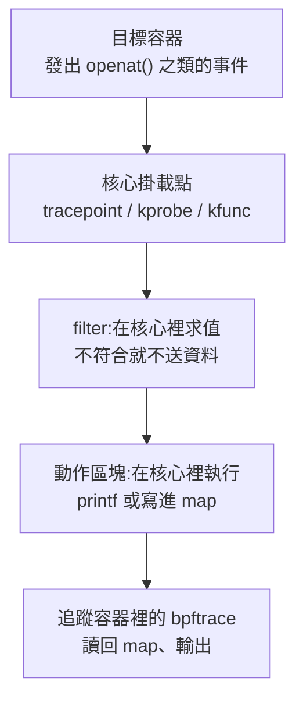

# Day 1: bpftrace 三支經典工具與第一支自寫的 `.bt` 腳本——語法結構、各工具的限制,與追出目錄的寫入者

{ align=right width="150" }
{ align=right width="150" }

> [Day 0](sprint2-day0-ebpf-concepts.md) 把環境釘好了:特權容器裡的 bpftrace 列得出 133,022 個掛載點,核心自帶的 BTF 也驗過在。但掛載點多不等於問得出答案。今天要問三個具體問題——這台機器剛剛執行了什麼、誰開了哪些檔案、這顆容器連去哪裡——三支現成工具各自只答得出一半,而且每一半的邊界都是量出來的,不是抄來的。剩下那一半自己寫:本章最後那支腳本會在同一份輸出裡指名容器內與節點上兩個寫入者,而它之所以不能用最直覺的寫法,是因為 bpftrace 把還原路徑的那個函式關掉了。

!!! abstract "你在課程的哪裡"
    - **Day 0**:eBPF 的概念與環境就緒——特權 DaemonSet、容器內自己裝的 bpftrace、核心自帶的 BTF,以及「在 A 容器追得到 B 容器」的第一次驗證。
    - **今天**:跑三支經典工具並量出各自的邊界、拆解一支 `.bt` 腳本的語法、自己寫一支「誰在寫這個目錄」。驗收:自寫腳本在同一份輸出裡指名容器內與節點上兩個寫入者的 PID、comm 與路徑。
    - **Day 2**:核心看得到一切,卻不知道事件屬於哪一顆 pod——把事件接回 Kubernetes 物件。

## `.bt` 腳本的結構

bpftrace 的語言骨架是跟 awk 借的。awk 的 `BEGIN {} /pattern/ {action} END {}` 換成 bpftrace 就是「掛在哪裡 / 什麼條件下 / 做什麼」,三段式,不多也不少。所以讀一支 `.bt` 之前,先看清楚一個事件從發生到印出來要經過哪幾層:



中間那兩層是 eBPF 追蹤便宜的原因:條件判斷與聚合都發生在核心裡,不符合條件的事件連一個位元組都不會送到使用者空間。

以下以 `/usr/sbin/opensnoop.bt` 為例,它 46 行裡把每一個語法元素都用到一次,而且步驟 2 就會實際跑它。**每一段都是那支腳本的原文。**

### `BEGIN`:程式掛上去之前跑一次

```awk
BEGIN
{
	printf("Tracing open syscalls... Hit Ctrl-C to end.\n");
	printf("%-6s %-16s %4s %3s %s\n", "PID", "COMM", "FD", "ERR", "PATH");
}
```

`BEGIN` 不是探針,它在所有探針掛上之前執行一次,慣例用途就是印表頭與初始化;對應的 `END` 在收工時跑一次。

### 探針型別加目標:冒號分隔,可以一次掛多個

```awk
tracepoint:syscalls:sys_enter_open,
tracepoint:syscalls:sys_enter_openat
{
	@filename[tid] = args.filename;
}
```

`tracepoint` 是**探針型別**,代表掛在核心靜態定義的追蹤點上;同一個位置也可以寫 `kprobe:`(動態掛核心函式)、`kfunc:`(BTF 型別化的函式進入點)、`uprobe:`(使用者空間函式)。冒號後面的 `syscalls:sys_enter_openat` 是**目標**——tracepoint 的目標是「類別:名稱」,`kprobe` 的目標就是函式名(`kprobe:tcp_connect`)。

逗號把同一個動作區塊掛到多個探針上,這裡一次處理 `open` 與 `openat` 兩個 syscall。至於 `args.filename`,那是這個 tracepoint 的參數;tracepoint 的參數格式由核心自己公布在 `/sys/kernel/debug/tracing/events/…/format`,跨核心版本相對穩定,這是官方工具偏好 tracepoint 勝於 kprobe 的原因。

### 動作區塊與 map:跨探針傳遞狀態

`@filename[tid] = args.filename;` 這一行就是 **map**。

`@` 開頭的是 map:全域、活在核心裡的雜湊表、能被使用者空間讀回來;`$` 開頭的是區域變數,只活在這一次探針執行裡。`[tid]` 是 key,用執行緒 id 當 key 是 bpftrace 最常見的慣用法——**把「進入時知道的東西」寄放起來,等「離開時」再取出來**。原因就寫在這支腳本的形狀裡:`sys_enter_openat` 知道檔名但不知道結果,`sys_exit_openat` 知道結果但拿不到檔名。

沒有宣告、沒有型別、沒有大小:bpftrace 從第一次賦值推導型別並自動建 map。

這是 map 的「暫存」用法。另一種用法是聚合,步驟 3 自寫的腳本用的就是 `@bytes[comm, pid] = sum(args.count);`——`sum()` 是聚合函式,同族還有 `count()`、`avg()`、`hist()`、`lhist()`,key 可以是多個欄位組成的 tuple。聚合在核心裡累加,使用者空間只在最後拿一次結果,這是 bpftrace 統計百萬級事件不會塞爆管線的原因。

### filter:探針與動作之間的判斷式

```awk
tracepoint:syscalls:sys_exit_open,
tracepoint:syscalls:sys_exit_openat
/@filename[tid]/
{
	$ret = args.ret;
	$fd = $ret >= 0 ? $ret : -1;
	$errno = $ret >= 0 ? 0 : - $ret;

	printf("%-6d %-16s %4d %3d %s\n", pid, comm, $fd, $errno,
	    str(@filename[tid]));
	delete(@filename[tid]);
}
```

`/…/` 是 filter(官方文件叫 predicate),在動作區塊之前求值,為假就整個事件跳過。這裡的條件 `/@filename[tid]/` 讀作「這個 tid 有寄放過檔名嗎」——沒有進入紀錄的離開事件直接丟掉,避免追蹤剛啟動時只抓到後半段的孤兒事件。

其餘幾樣一次看完:`$ret`、`$fd`、`$errno` 是區域變數,三元運算子照 C 的寫法;`str()` 把核心裡的指標讀成字串(底層是 `bpf_probe_read_str`),所以 map 存的是指標,印的時候才解參考;`delete()` 把用完的 key 拿掉,不刪的話 map 會一路長大,而 map 有容量上限。

### `END`:收尾

腳本的最後一段只有 `END { clear(@filename); }`。`clear()` 清掉整個 map,這一步不是為了釋放核心記憶體(程式一結束核心就收回了),而是為了不要在收工時把整張 map 印出來——bpftrace 預設會在結束時把所有還活著的 map dump 出來,而 `@filename` 是內部用的暫存,印出來只是雜訊。

### 本章環境與步驟

環境沿用 Day 0 蓋好的 AKS `<cluster>`(K8s 1.35.6):`ebpf` pool 兩台 `Standard_D2as_v5` spot(kernel 6.8.0-1062-azure),另外借 system pool 上那台 kernel 6.8.0-1059-azure 的節點當對照。工作負載一律丟在 `ebpf-lab` namespace,追蹤跑在特權 pod `ebpf-lab-przdr`,被追蹤的動作發生在同一顆節點的 `trace-target`。

六個步驟:確認 bpftrace 的版本與來源 → 三支經典工具各驗一次 → 自己寫一支腳本(本日驗收) → 同一支腳本丟到兩顆不同 kernel 上比對位元碼 → bcc 的實測對照 → 收尾歸零。

## 步驟

### 步驟 1:確認 bpftrace 的版本與來源

若叢集曾停機(成本紀律的常態),重新啟動後 `az` 會一路順暢,但 `kubectl` 可能連不上,而且錯誤訊息會把你指向完全錯的方向——診斷與正解見[地雷 1](#mine-1)。`ebpf` pool 兩台 spot 就緒後,三顆節點都在:

```console
$ kubectl get nodes -o custom-columns='NODE:…,KERNEL:…,IMAGE:…'
NODE                             KERNEL             IMAGE
aks-ebpf-80832270-vmss000002     6.8.0-1062-azure   AKSUbuntu-2404gen2containerd-202607.20.0
aks-ebpf-80832270-vmss000003     6.8.0-1062-azure   AKSUbuntu-2404gen2containerd-202607.20.0
aks-system-35459509-vmss000002   6.8.0-1059-azure   AKSUbuntu-2404gen2containerd-202607.09.0
```

Day 0 記過的那組 kernel 落差原封不動地回來了,重開機沒有把 system pool 追平——步驟 4 就靠這個落差。順帶一個小提醒:`az aks stop` 再 `start` 之後,三台的 VMSS 實例編號全部換過,節點名字不是穩定識別。

DaemonSet 逐字重用 Day 0 的檔案,`trace-target` 多掛一個 hostPath 監看目錄(步驟 3 要用)——容器內的掛載路徑刻意跟節點路徑寫成同一個:

```yaml
# 02-target-pod.yaml:Day 0 那份的 containers[0] 與 spec 各補一段
    volumeMounts:
    - name: watch
      mountPath: /var/log/day1-watch
  volumes:
  - name: watch
    hostPath:
      path: /var/log/day1-watch
      type: DirectoryOrCreate
```

另外在 system pool 上多放一顆特權 pod(步驟 4 要用),要求量刻意壓到最低——那台只有 2 vCPU,還住著 Sprint 1 留下的常駐元件:

```bash
cat > 05-ebpf-lab-system.yaml <<'EOF'
apiVersion: v1
kind: Pod
metadata:
  name: ebpf-lab-system
  namespace: ebpf-lab
  labels:
    app: ebpf-lab-system
spec:
  hostPID: true
  nodeSelector:
    kubernetes.azure.com/agentpool: system
  containers:
  - name: probe
    image: mcr.microsoft.com/mirror/docker/library/ubuntu:24.04
    command: ["sleep", "infinity"]
    securityContext:
      privileged: true
    resources:
      requests:
        cpu: 10m
        memory: 64Mi
    volumeMounts:
    - name: sys
      mountPath: /sys
    - name: debugfs
      mountPath: /sys/kernel/debug
    - name: watch
      mountPath: /var/log/day1-watch
  volumes:
  - name: sys
    hostPath:
      path: /sys
      type: Directory
  - name: debugfs
    hostPath:
      path: /sys/kernel/debug
      type: Directory
  - name: watch
    hostPath:
      path: /var/log/day1-watch
      type: DirectoryOrCreate
EOF
```

```console
$ kubectl -n ebpf-lab get pods -o wide
NAME              READY   STATUS    AGE   NODE
ebpf-lab-548l5    1/1     Running   19s   aks-ebpf-80832270-vmss000002
ebpf-lab-przdr    1/1     Running   19s   aks-ebpf-80832270-vmss000003
ebpf-lab-system   1/1     Running   19s   aks-system-35459509-vmss000002
trace-target      1/1     Running   19s   aks-ebpf-80832270-vmss000003
```

19 秒四顆全部 Running。裝完 bpftrace(兩顆 pod 並行 23 秒,含 `apt-get update`)之後,第一件事是確認手上這支是哪一支:

```console
$ kubectl -n ebpf-lab exec ebpf-lab-przdr -- which -a bpftrace
/usr/bin/bpftrace
/bin/bpftrace                         ← 同一個檔案(/bin 是 /usr/bin 的 symlink)

$ kubectl -n ebpf-lab exec ebpf-lab-przdr -- bpftrace --version
bpftrace v0.20.2
$ kubectl -n ebpf-lab exec ebpf-lab-przdr -- bpftrace -l | wc -l
133022                                ← 與 Day 0 量到的數字相同

$ kubectl -n ebpf-lab exec ebpf-lab-przdr -- \
    nsenter -t 1 -m -- bash -lc 'which -a bpftrace; /usr/local/bin/bpftrace --version'
/usr/local/bin/bpftrace
bpftrace v0.9.4                       ← 節點上那支,還在
```

Day 0 記過節點內建一支 2019 年的 v0.9.4,而且它在 PATH 裡排在前面。這件事每天都要複驗一次,因為它不會壞掉,只會少東西。容器裡的 PATH 摸不到節點那支,所以「一律在容器裡自己裝」這條紀律本身就是防呆;但只要用 `nsenter` 或 `chroot` 進節點除錯,v0.9.4 立刻又是預設值。

### 步驟 2:execsnoop、opensnoop、tcpconnect 各驗一次

Ubuntu 的 bpftrace 套件把 Brendan Gregg 那套工具直接裝進 `/usr/sbin`,`dpkg -L bpftrace | grep -c '\.bt$'` 數出 **39 支**現成的 `.bt`。今天挑三支,驗法一律相同:追蹤跑在 `ebpf-lab-przdr`,動作發生在 `trace-target`,而且動作要有一個節點上不可能有第二份的名字。

#### `execsnoop`:新行程的執行

被追蹤的那一段刻意把四種情況一次做完——正常執行、20 個參數、不存在的檔案、shell 內建指令:

```bash
# MARK=d1x-122216, run inside trace-target
printf '#!/bin/bash\necho hello-from-target\n' > /tmp/$MARK.sh
chmod +x /tmp/$MARK.sh
/tmp/$MARK.sh
/tmp/$MARK.sh a01 a02 … a20
/tmp/$MARK-does-not-exist
```

22 秒共 337 行,其中屬於這一段的:

```console
04:22:25.829588 13685   9942    /usr/bin/runc --root /run/containerd/runc/k8s.io … exec … af6ba13cacfa…
04:22:25.835088 13694   13685   /usr/bin/runc init
04:22:25.841195 13698   13685   bash -c
printf '#!/bin/bash\necho hello-from-target\n' > /tmp/d1x-122216.sh
chmod +x /tmp/d1x-122216.sh
/tmp/d1x-122216.sh
/tmp/d1x-122216.sh a01 a02 … a20
/tmp/d1x-122216-does-not-exist 2>/dev/null; echo "failed-exec rc=$?"

04:22:25.848495 13704   13698   chmod +x /tmp/d1x-122216.sh
04:22:25.849329 13705   13698   /tmp/d1x-122216.sh
04:22:25.850823 13706   13698   /tmp/d1x-122216.sh a01 a02 a03 a04 a05 a06 a07 a08 a09 a10 a11 a12 a13 a14 a15
04:22:25.852292 13707   13698   /tmp/d1x-122216-does-not-exist
```

欄位是 `TIME`(到微秒)、`PID`、`PPID`、`ARGS`。`PPID` 從 `curtask` 走 `real_parent` 拿,所以 `runc exec → bash -c → 各個子指令` 的父子鏈連得起來(13685 → 13698 → 13704/13705/13706/13707)。

同一份輸出演完四個邊界:

1. **分不出成功與失敗**。最後一行 `/tmp/d1x-122216-does-not-exist` 印得跟成功的一模一樣,但那次 exec 的 rc 是 127。腳本第 8 行的註解自己承認了:`Note that the return value is not currently traced, so the exec() may have failed.`
2. **argv 會被截斷**。傳了 20 個參數,輸出停在 `a15`——`join()` 只吐 argv[0] 加 15 個,第 16 個以後直接消失,而且沒有任何截斷標記。
3. **一個事件不等於一行**。`bash -c` 那筆的 argv 裡有換行,`join()` 原樣吐出,於是一個事件變成 6 行。任何 `wc -l`、任何逐行解析的收集器都會在這裡算錯。
4. **看不到 shell 內建指令**。`printf '…' > /tmp/…` 沒有出現在輸出裡,因為 `printf` 是 bash 內建,根本沒有 execve。「這台機器上跑過什麼」用 execsnoop 只答得出「開了哪些新行程」。

還有一件事:整份輸出裡唯一出現容器識別碼的字串是 `runc --root … exec … af6ba13cacfa…`,而那是 runc 自己的命令列參數,不是 execsnoop 提供的欄位。

#### `opensnoop`:檔案開啟

```bash
# MARK=d1o-122309, run inside trace-target
echo 'day1 opensnoop payload' > /tmp/$MARK.txt
cat /tmp/$MARK.txt
cat /tmp/$MARK-missing.txt
cd /tmp && cat ./$MARK.txt
```

```console
PID    COMM               FD ERR PATH
14885  bash                3   0 /tmp/d1o-122309.txt
14891  cat                 3   0 /tmp/d1o-122309.txt
14892  cat                -1   2 /tmp/d1o-122309-missing.txt
14893  cat                 3   0 ./d1o-122309.txt
```

第一行的 comm 是 `bash` 不是 `echo`:重導向由 shell 自己做,開檔的是 shell。第三行 `FD=-1 ERR=2`(ENOENT)說明 opensnoop 分得出成功與失敗,因為它掛了 `sys_enter_*` 與 `sys_exit_*` 兩端——這正是 execsnoop 沒做的事。

第四行才是它的邊界:`./d1o-122309.txt`。**它給你的是使用者傳進 `openat()` 的那個字串,不是解析後的絕對路徑。** 同一個檔案,換個工作目錄就換一個字串;要判斷「有沒有人碰某個目錄」,光靠 opensnoop 會漏掉所有用相對路徑進來的存取。

#### `tcpconnect`:對外連線

為了讓事件的歸屬無可爭議,這次連 `comm` 都造一個唯一的:把 `/bin/bash` 複製成 `d1t-122357` 再用它連線,並且刻意加一筆一定被拒絕的連線與一次 DNS 查詢。

```console
TIME     PID      COMM             SADDR            SPORT  DADDR         DPORT
04:24:07 15852    d1t-122357       10.244.1.238     36088  1.1.1.1       80
04:24:07 15853    d1t-122357       127.0.0.1        56778  127.0.0.1     9
```

第二行是被拒絕的連線,照樣有一行。腳本第 10 行寫明了:`All connection attempts are traced, even if they ultimately fail.`——`kprobe:tcp_connect` 掛在送出 SYN 之前,握手成不成功它不知道;要區分就得再掛一支追 `tcp_set_state` 或回傳值。

它的邊界在整份 97 行輸出裡:**符合 DNS(port 53)的行數是 0**。`getent ahostsv4` 的查詢走 UDP,而 `tcpconnect` 只掛 `tcp_connect`。「這個 pod 連去哪裡」如果只看 tcpconnect,所有 DNS 查詢、所有 QUIC 流量都不存在。倒是 `SADDR` 那欄的 `10.244.1.238` 剛好就是 `trace-target` 的 pod IP——三支工具裡唯一能反推到 pod 的欄位,但那是網路命名空間的副產品,不是工具提供的身分。

#### 三支工具的共同盲點

| | `execsnoop` | `opensnoop` | `tcpconnect` |
|---|---|---|---|
| 掛載點 | `tracepoint:syscalls:sys_enter_exec*` | `sys_enter/exit_open(at)` | `kprobe:tcp_connect` |
| 分得出成功／失敗 | 否 | 是(`ERR` 欄) | 否 |
| 一個事件一行 | 否 | 是 | 是 |
| 22 秒閒置節點的事件數 | 337 | 24,350 | 97 |
| 容器／pod 身分 | 無 | 無 | 只有 pod IP |

三支的「目標值可不可信」各有各的走樣,沒辦法擺進同一欄比:execsnoop 的 argv 截在第 16 個參數;opensnoop 給的是原樣字串,相對路徑不還原;tcpconnect 的 IP 可信,但只涵蓋 TCP。

事件密度那一列值得單獨記住:同樣 22 秒、同一台幾乎閒置的 2 vCPU 節點,開檔比執行行程密集約 70 倍(約 1,100 筆/秒),這決定了哪一種追蹤可以整天開著、哪一種只能臨場開。至於最後一列——**沒有一支工具說得出「這是哪個 pod」**——那不是三支工具寫得不好,是它們掛的位置比容器更低一層。要把事件接回 Kubernetes 物件,得自己補 cgroup id 或 namespace 的對應,那是 Day 2 的題目。

### 步驟 3:自寫腳本,追出指定目錄的寫入者

本日驗收的要求是自寫腳本抓得到指定目錄的寫入者 PID 與 comm。這裡再加碼兩項:路徑也要印出來,而且容器內與節點上兩種寫入都要指名。監看目標選 `/var/log/day1-watch`,用 hostPath 掛進 `trace-target`,容器內外刻意用同一個路徑。

#### `path()` 在編譯階段就被擋下

最直覺的寫法是掛 `vfs_write`,再用 `path()` 把 `struct file` 還原成路徑:

```console
$ kubectl -n ebpf-lab exec ebpf-lab-przdr -- \
    bpftrace -e 'kfunc:vmlinux:vfs_write { printf("%d %s %s\n", pid, comm, path(args.file->f_path)); exit(); }'
stdin:1:59-82: ERROR: BPF_FUNC_d_path not available for your kernel version
```

訊息說「你的 kernel 版本沒有」,但核心的說法不一樣,兩邊直接衝突,診斷見[地雷 3](#mine-3)。實務上的正解不是等它修好,而是自己把路徑組出來——而那個寫法順便把一件事演給你看。

#### 從 dentry 鏈自己組出路徑

核心裡沒有「路徑字串」這種東西,只有一條 dentry 鏈:每個 dentry 有自己的名字與 parent 指標,一路指到掛載點根部。`path()` 做的事就是把這條鏈走完再組成字串。既然它被關掉,就自己走:

```bash
cat > whowrites.bt <<'EOF'
#!/usr/bin/env bpftrace
/*
 * whowrites.bt - who is writing into a watched directory?
 *
 * Prints PID, comm and the path for every write whose immediate parent
 * directory is WATCHDIR. Reconstructs the path by walking the dentry chain
 * instead of calling path(): bpftrace 0.20.2 reports `dpath: no` and refuses
 * path() everywhere, even though the kernel exports bpf_d_path.
 */

#define WATCHDIR "day1-watch"
#define WATCHLEN 11

BEGIN
{
	printf("watching writes into .../%s\n", WATCHDIR);
	printf("%-9s %-7s %-16s %-8s %s\n", "TIME", "PID", "COMM", "BYTES", "PATH");
}

kfunc:vmlinux:vfs_write
/strncmp(str(args.file->f_path.dentry->d_parent->d_name.name), WATCHDIR, WATCHLEN) == 0/
{
	$d = args.file->f_path.dentry;
	time("%H:%M:%S ");
	printf("%-7d %-16s %-8d /%s/%s/%s/%s\n", pid, comm, args.count,
	    str($d->d_parent->d_parent->d_parent->d_name.name),
	    str($d->d_parent->d_parent->d_name.name),
	    str($d->d_parent->d_name.name),
	    str($d->d_name.name));
	@bytes[comm, pid] = sum(args.count);
}

END
{
	printf("\n-- bytes written per (comm, pid) --\n");
}
EOF
```

三個設計決定,每一個都對應前面拆解過的一個語法元素:

- **filter 只比對直屬父目錄的名字**。`WATCHDIR` 是 `day1-watch`、`WATCHLEN` 是 11(含結尾的 NUL),所以是精確比對而非前綴比對。過濾在核心裡做,不符合的寫入連送都不送。
- **用 `kfunc:` 而不是 `kprobe:`**。`kfunc` 走 BTF,參數有型別,可以直接寫 `args.file->f_path.dentry`;同樣的事用 `kprobe` 得自己寫 `((struct file *)arg0)`,還要先 `#include` 對的標頭檔。Day 0 量到的那批「舊版少掉的掛載點」,實際價值就在這裡。
- **聚合用 `@bytes[comm, pid] = sum(args.count)`**,key 是 `(comm, pid)` 組成的 tuple。

#### 兩個寫入者,一份輸出

一邊從 `trace-target` 容器裡寫,一邊用 `nsenter` 進節點的 mount namespace 寫,兩邊都先把 `dd` 複製成唯一的名字:

```bash
# (a) inside trace-target
cp /bin/dd /tmp/d1w-pod-122627
/tmp/d1w-pod-122627 if=/dev/zero of=/var/log/day1-watch/from-pod.bin bs=4096 count=1
echo 'plain shell redirect from pod' > /var/log/day1-watch/from-pod.txt

# (b) on the node itself
nsenter -t 1 -m -- bash -c 'cp /bin/dd /tmp/d1w-nod-122627;
  /tmp/d1w-nod-122627 if=/dev/zero of=/var/log/day1-watch/from-node.bin bs=8192 count=1'
```

```console
watching writes into .../day1-watch
TIME      PID     COMM             BYTES    PATH
04:26:37 19878   d1w-pod-122627   4096     /var/log/day1-watch/from-pod.bin
04:26:37 19871   bash             30       /var/log/day1-watch/from-pod.txt
04:26:37 19899   d1w-nod-122627   8192     /var/log/day1-watch/from-node.bin

-- bytes written per (comm, pid) --
@bytes[bash, 19871]: 30
@bytes[d1w-pod-122627, 19878]: 4096
@bytes[d1w-nod-122627, 19899]: 8192
```

PID、comm、路徑三項齊全,容器內(19878)與節點上(19899)兩個寫入者都被指名,位元組數也對得上——`echo` 那行的 30 bytes 就是那句字串加換行。

兩件小事先講完:中間那一行的 comm 是 `bash` 不是 `echo`,跟 opensnoop 那邊是同一個道理;`@bytes` 的 tuple key 在收工時自己印了出來,那是聚合式 map 的預設行為,也解釋了 `opensnoop.bt` 為什麼要在 `END` 裡 `clear()`。

真正重要的是第三件:**兩個寫入者的路徑字串一模一樣**。節點上的 `/var/log/day1-watch` 與容器裡的 `/var/log/day1-watch` 走的是同一條 dentry 鏈,所以輸出裡沒有任何欄位分得出「這是從容器裡寫的」還是「這是從節點上寫的」。這跟三支經典工具的盲點是同一件事的另一面:eBPF 給你的是核心的視角,容器身分要自己接。就算 hostPath 在容器裡掛在別的路徑,dentry 鏈仍然是節點的那一條——真正該記住的是,路徑是檔案系統的視角,不是行程的視角。

### 步驟 4:一座叢集、兩顆 kernel、同一支腳本

`ebpf` pool 是 kernel 6.8.0-1062,system pool 是 6.8.0-1059,兩份 BTF 的大小與 md5 都不同。把**同一個 md5 的 `.bt` 檔案**丟到兩顆節點上跑:

| | `ebpf` pool | `system` pool |
|---|---|---|
| kernel | 6.8.0-1062-azure | 6.8.0-1059-azure |
| node image | 202607.20.0 | 202607.09.0 |
| `/sys/kernel/btf/vmlinux` | 6,035,000 bytes | 6,033,733 bytes |
| BTF md5 | `6f631a7b…f423c` | `d504cbf3…39924` |
| bpftrace | v0.20.2 | v0.20.2 |
| 腳本 md5 | `e398f627…7182` | `e398f627…7182` |
| 載入結果 | 成功掛上,抓到寫入 | 成功掛上,抓到寫入 |

兩邊各自抓到自己節點上的寫入:

```console
(ebpf pool,寫入來自 trace-target)
04:28:37 23237   d1c-tgt-122825   2048     /var/log/day1-watch/core2-pod.bin

(system pool,寫入來自該節點上的 pod)
04:28:37 26707   d1c-sys-122825   2048     /var/log/day1-watch/core2-sys.bin
```

同一份腳本、一個字元沒改、兩顆節點都沒裝 kernel headers。(bpftrace 其實在每顆節點上各自編譯了一次,只是編譯的輸入是本機 BTF 而不是 headers——這個區別在本節末尾展開。)

#### 比對兩邊載進核心的位元碼

「能跑」只是及格。真正的問題是核心手上那份程式一不一樣,所以趁兩邊都掛著的時候,用節點的 bpftool 量:

```console
(ebpf pool)                                (system pool)
842: tracing  name vfs_write               652: tracing  name vfs_write
     tag 069eb0688ab16f62  gpl                  tag 069eb0688ab16f62  gpl
     xlated 2584B  jited 1739B                  xlated 2584B  jited 1739B
     map_ids 105,106,104                        map_ids 121,122,120
     btf_id 109                                 btf_id 87
```

`tag` 完全相同。BPF 的 tag 是核心對指令串算出來的雜湊(計算時會把 map fd 的立即值遮掉),所以兩顆不同 kernel 上載入的是同一串指令;xlated 2584B、jited 1739B 也分毫不差。

再把兩邊完整的 xlated dump 拉回來逐行比對,各 318 行,只有 14 行不同:

```diff
  48: (18) r1 = map[id:109]        →   48: (18) r1 = map[id:125]
  54: (85) call bpf_ringbuf_output#340416  →  #340176
  73: (85) call bpf_get_current_pid_tgid#249424  →  #249184
 303: (18) r1 = map[id:108]        →  303: (18) r1 = map[id:124]
 307: (85) call htab_percpu_map_lookup_elem#295936  →  #295696
```

14 行全部落在兩類。一類是 map id,那是這一次載入時核心配給的編號,跟程式邏輯無關。另一類是 helper 呼叫偏移,每一組差**剛好 240**——兩顆 kernel 是不同的建置,helper 函式在核心映像裡的位址整體位移了 240 bytes,核心在載入時自己把呼叫目標改掉了。其餘 304 行的 opcode 與運算元完全一致。

#### 這組數字的適用範圍

證明了:一份未修改的 `.bt`,在同一座叢集的兩顆不同 kernel(不同 BTF)上都跑得起來,產生的位元碼指令串完全相同,差異只有載入時由核心填的位址與編號。舊做法(bcc 加 kernel headers)要在兩顆節點上各自準備一份與該 kernel 相符的 headers,少一份就編不出來;這裡兩顆節點都不需要 headers,型別全部來自核心自帶的 BTF。

沒證明的部分必須講清楚,否則兩個很像的概念會被混為一談:**這不等於 libbpf 那種「一份編好的 `.o` 檔搬到別的 kernel 直接載入」的 CO-RE。bpftrace 是在每顆節點上對著該節點的 BTF 重新編譯一次的**,它的可攜性在原始碼層,不是目的檔層。今天兩邊位元碼會一模一樣,是因為腳本用到的那幾個結構欄位(`struct file` 的 `f_path`、`dentry` 的 `d_parent` 與 `d_name`、`vfs_write` 的參數)在兩顆 kernel 的 BTF 裡偏移相同;如果其中一顆改了欄位順序,同一份原始碼一樣會跑,但位元碼就會不同——那才是 BTF 驅動編譯的真正價值。

### 步驟 5:bcc 的實測對照

課程選 bpftrace 不選 bcc,常見的理由是「bcc 依賴 kernel headers 編譯,雲端節點裝不了」與「bcc 要編譯器、bpftrace 不用」。兩句都在這座叢集上被推翻,所以理由得換成量得出來的那幾項。

#### 安裝的體積與時間

```console
$ apt-get install -y bpfcc-tools
1 upgraded, 22 newly installed, 0 to remove
Need to get 13.9 MB of archives.
  完成(9.2 秒)
```

9.2 秒、13.9 MB,比預期便宜太多。回頭查那 22 個套件是什麼,答案改掉了原本的結論:新裝的絕大多數是 Python 3 執行環境,而 LLVM 18(約 120 MB)早就在了,是 bpftrace 自己裝進來的。完整證據與這句話該怎麼改寫,見[地雷 7](#mine-7)。

#### 在容器裡執行的前置條件

先不作弊,乾淨的容器裡直接跑:

```console
$ execsnoop-bpfcc
sh: 1: modprobe: not found
chdir(/lib/modules/6.8.0-1062-azure/build): No such file or directory
Unable to find kernel headers. Try rebuilding kernel with CONFIG_IKHEADERS=m (module)
or installing the kernel development package for your running kernel version.
Exception: Failed to compile BPF module <text>
```

失敗順序把它的假設全講出來了:先試 `modprobe kheaders`(容器裡沒有 modprobe),再試 `/lib/modules/$(uname -r)/build`(容器的檔案系統裡沒有),然後放棄。節點上明明有 `/usr/src/linux-headers-6.8.0-1062-azure`,把它接進容器的第一次嘗試踩了[地雷 4](#mine-4);改用 symlink 之後就跑得起來:

```console
$ ln -sfn /proc/1/root/usr/src/linux-headers-$KV /lib/modules/$KV/build
$ execsnoop-bpfcc
PCOMM            PID     PPID    RET ARGS
date             29421   978       0 /usr/bin/date +%s
flock            29422   978       0 /usr/bin/flock -e 10
```

那 headers 究竟是安裝期需求還是執行期需求?把 symlink 移開再試一次就知道,答案改寫了整個維運結論,見[地雷 6](#mine-6)。

#### 啟動延遲與輸出差異

兩支同名工具,量到第一個位元組落地為止(兩邊都要先編譯、過 verifier、掛上探針才會有輸出,所以是對等比較):

| 回合 | `execsnoop.bt`(bpftrace) | `execsnoop-bpfcc`(bcc) |
|---|---|---|
| 1 | 148 ms | 2,622 ms |
| 2 | 158 ms | 2,182 ms |
| 3 | 157 ms | 2,110 ms |
| 中位數 | 157 ms | 2,182 ms |

約 14 倍。對「臨場診斷」這個用途,這個差距是體感等級的:出事的時候你會連下十次不同的 one-liner,bpftrace 是按下去就有,bcc 是每次等兩秒。

同一段動作(唯一命名的腳本加一個必定失敗的 exec),bcc 版的輸出:

```console
PCOMM            PID     PPID    RET ARGS
bash             39632   9925      0 /usr/bin/bash -c \nprintf '#!/bin/bash\necho bcc-side\n' > /tmp/d1b-123744.sh; chmod +x /tmp/d1b-123744.sh\n/tmp/d1b-123744.sh\n/tmp/d1b-123744-does
chmod            39638   39632     0 /usr/bin/chmod +x /tmp/d1b-123744.sh
d1b-123744.sh    39639   39632     0 /tmp/d1b-123744.sh
```

多了一個 `RET` 欄,換行被跳脫成 `\n` 所以一個事件永遠是一行——這兩項都比 bpftrace 版好用。但失敗的那個 exec 整行不見了,而那個差異會讓兩份清單導出相反的結論,見[地雷 2](#mine-2)。

把三輪量測收成一張表:

| | bpftrace | bcc |
|---|---|---|
| 型別來源 | `/sys/kernel/btf/vmlinux` | kernel headers |
| 是否需要編譯器 | 需要(`Depends: libllvm18`) | 需要(`Depends: libllvm18`) |
| 乾淨映像的安裝體積 | 約 190 MB(含 LLVM 18) | 約 190 MB(含 LLVM 18) |
| 啟動時間(中位數) | 157 ms | 2,182 ms |
| 失敗的 exec | 全印 | 預設全藏 |
| 在容器裡能不能直接跑 | 能 | 不能 |

型別來源那一列是三項差別裡影響最深的:BTF 由核心自己提供,永遠跟執行中的 kernel 同版;kernel headers 是外掛的套件,節點升級 kernel 而 headers 沒跟上時,所有 bcc 工具會在下一次啟動時集體失效。課程該用的理由是這三列,不是「bcc 編不動」——它在 2026-08 的 AKS 上編得動。

### 步驟 6:收尾——先量再刪

Day 0 記過一件事:BPF 程式跟著 fd 走,不跟著終端機走。今天多了一個 bcc 版本的實例([地雷 5](#mine-5)),所以殘留檢查要在刪除之前做:

```console
--- ebpf-lab-przdr (vmss000003, kernel 6.8.0-1062) ---
bpftrace 行程=0  bcc 行程=0  prog 總數=53  tracing=1  tracepoint=0  kprobe=0
--- ebpf-lab-548l5 (vmss000002, kernel 6.8.0-1062) ---
bpftrace 行程=0  bcc 行程=0  prog 總數=48  tracing=1  tracepoint=0  kprobe=0
--- ebpf-lab-system (system pool, kernel 6.8.0-1059) ---
bpftrace 行程=0  bcc 行程=0  prog 總數=135 tracing=1  tracepoint=0  kprobe=0
```

那個 `tracing=1` 要交代清楚,否則會被當成殘留:

```console
$ kubectl -n ebpf-lab exec ebpf-lab-przdr -- \
    nsenter -t 1 -m -- bpftool prog list | grep ' tracing '
2: tracing  name hid_tail_call  tag 7cc47bbf07148bfe  gpl   ← prog id 2,開機就在
```

是核心自帶的 `hid_tail_call`,兩顆 kernel 上都是同一個 tag。同一份清單 `grep -c vfs_write` 的結果是 0,今天載入的程式一個不剩。

還有一個量測細節值得記住:`ebpf` pool 的基線在一天內從 52 漂到 53,漂進來的那一個是 `cgroup_device`,而節點上光這一類就有 46 個,容器起落就會增減。**「prog 總數回到當天最初的數字」不是可靠的驗收條件,要看的是「自己掛的那一類程式歸零」。**

接著刪 namespace(45 秒)、把 `ebpf` pool 縮回 0(1 分 10 秒)並用 `nodepool list`、`nodepool show`、`kubectl get nodes` 三重驗證,最後停掉整座叢集(2 分 04 秒),三個 pool 的定義都保留給 Day 2。節點側的 hostPath 目錄不會跟著 pool 縮容消失,要自己 `rm -rf /var/log/day1-watch`。

`ebpf` pool 從下達 scale 到確認歸零共存活 26 分 14 秒(0.437 hr),spot 單價 US$0.0207/hr/台,本日兩台合計 **US$0.0181**,約新台幣 0.58 元;同規格隨需價是 US$0.112/hr/台。

## 誠實的差距

- **`path()` 為什麼被關掉,本課只到推測為止。** 章內對核心允許清單的解釋是合理的推論,**沒有直接量到**;能確定的只有「擋下來的是 bpftrace 自己的能力偵測,不是核心」。
- **`SIGINT` 停不掉編譯中的 bcc 工具,根因也是推論。** 對直譯器訊號處理的解釋沒有進一步驗證,只有「行程會變成孤兒繼續跑」這個現象是實測的。
- **三支工具都只在單一節點、單一容器的情境下測過。** 多節點、跨命名空間、高事件率下的行為(尤其是 map 上限與事件遺失)本章沒有碰。
- **沒有 pod 身分這件事不是缺陷,是分工。** 它是 [Day 2](sprint2-day2-bpftrace-kubernetes.md) 的題目,不是這一章沒做完。

## 驗收 checkpoint

| 檢查項 | 指令 | 期待結果 |
|---|---|---|
| 用到的是容器裡那支 bpftrace | `kubectl -n ebpf-lab exec ebpf-lab-przdr -- bpftrace --version` 與 `bpftrace -l \| wc -l` | `v0.20.2` 與 `133022`(節點上那支仍是 v0.9.4) |
| execsnoop 抓得到失敗的 exec | 在輸出裡找 `-does-not-exist` | 有一行,而且跟成功的長得一樣 |
| opensnoop 分得出成功與失敗 | 看不存在檔案那一筆的 `FD`／`ERR` | `-1` 與 `2`(ENOENT) |
| tcpconnect 看不到 DNS | 對整份輸出數 port 53 的行數 | `0` |
| **本日驗收:自寫腳本指名兩個寫入者** | `whowrites.bt` 的輸出 | 容器內 PID 19878／4096 bytes、節點上 PID 19899／8192 bytes,路徑都還原成 `/var/log/day1-watch/…` |
| 同一支腳本在兩顆 kernel 上等價 | 兩邊 `bpftool prog show` 的 `tag` 與 xlated 大小 | `069eb0688ab16f62`、2584B,318 行 dump 只差 14 行 |
| 收工無殘留 | `bpftool prog list \| grep -c vfs_write` | `0`(`tracing=1` 是核心自帶的 `hid_tail_call`) |

## 地雷記錄

### 地雷 1:叢集停機期間 API server 的 DNS 紀錄會消失,工作站把那個 NXDOMAIN 快取起來 {#mine-1}

**症狀**:`az aks start` 完成、`az aks show` 回報 `Running`,`kubectl` 卻一直說 `no such host`。同一個名字用 `nslookup` 與 `dig` 查都解得到,`dscacheutil` 與 Python 的 `socket.getaddrinfo()` 都解不到,`curl` 的 `%{http_code}` 是 000。等 5 分鐘、關掉 sandbox 重試、換 `GODEBUG=netdns=cgo`,三次都一樣。

**根因**:AKS 停機時會撤掉 API server FQDN 的 A 紀錄。工作站在停機期間只要有任何一支程式問過那個名字(例如上一輪收工前的 `kubectl`),macOS 的 mDNSResponder 就會把「查無此名」記下來。叢集起來之後 A 紀錄回來了,TTL 只有 60 秒,但**負向快取不吃那個 TTL**。難查的地方在於兩類工具走不同的解析路徑:`nslookup` 與 `dig` 自己組封包直接問 DNS 伺服器,繞過系統解析器,所以永遠回報解析成功;`kubectl`、`curl`、Python 走 `getaddrinfo()`,讀到的是快取,所以永遠回報找不到主機。於是排除方向會集中在叢集狀態、kubeconfig 與網路,唯獨不會懷疑自己的工作站。

**修法**:不用 sudo 的正解是繞過名字解析,而不是繞過 TLS 驗證。

```bash
IP=$(dig +short <api-fqdn> | head -1)
kubectl \
  --server "https://$IP:443" --tls-server-name <api-fqdn> get nodes
```

`--tls-server-name` 讓 SNI 與憑證驗證仍然用 FQDN,只有連線目標換成 IP,安全性一點都沒放掉。要根治就是 `sudo killall -HUP mDNSResponder`,但那需要 sudo。

**教訓**:這條跟 eBPF 無關,卻直接來自本課程的成本紀律——頻繁停開叢集,就會反覆種下這顆雷。

### 地雷 2:同名的 execsnoop,兩個實作對失敗的 exec 預設行為相反 {#mine-2}

**症狀**:同一段動作(執行一個不存在的檔案),bpftrace 版的 `execsnoop.bt` 印出一行,bcc 版的 `execsnoop-bpfcc` 什麼都沒有。兩份輸出擺在一起,會以為其中一支漏抓了事件。

**根因**:`execsnoop.bt` 掛的是 `sys_enter_exec*`,拿不到回傳值,所以成功與失敗印得一模一樣(rc=127 的那一次照樣有一行)。`execsnoop-bpfcc` 掛了進入與離開兩端,拿得到回傳值,於是預設只印成功的,失敗的要加 `-x` 才看得到。

**修法**:bcc 版要看失敗的 exec 就加 `-x`(`--fails`);bpftrace 版要區分成敗,得自己再掛一支追離開端。任何文件或監控規格示範 execsnoop 時,一定要指名是哪一個實作。

**教訓**:兩份「這台機器跑過什麼」的清單,在「有人嘗試執行但失敗了」這一類事件上結論完全相反——而那一類事件正是入侵偵測最在意的(打錯路徑的攻擊工具、被權限擋下的提權嘗試)。

### 地雷 3:`path()` 被 bpftrace 全域關掉,錯誤訊息卻推給「你的 kernel 版本」 {#mine-3}

**症狀**:任何用到 `path()` 的腳本在編譯階段就被擋掉,訊息是 `ERROR: BPF_FUNC_d_path not available for your kernel version`。換成核心允許清單內的掛載點(`security_file_permission`)再試,一模一樣。

**根因**:兩邊的說法直接衝突。`bpftool feature probe kernel` 列得出 `bpf_d_path`(kernel 6.8,這個 helper 從 5.10 就在),但 `bpftrace --info` 的能力表寫著 `dpath: no`:

```console
$ nsenter -t 1 -m -- bpftool feature probe kernel | grep -i d_path
	- bpf_d_path                                ← 核心說有

$ bpftrace --info | sed -n '/Kernel helpers/,/^$/p'
  dpath: no                                     ← bpftrace 說沒有
```

也就是說,擋下來的是 bpftrace 自己的能力偵測,不是核心。至於偵測為什麼失敗,最可能的解釋是 `bpf_d_path` 有核心允許清單(`btf_allowlist_d_path`,只有 `vfs_truncate`、`dentry_open`、`security_file_permission` 等少數函式可以呼叫),而 bpftrace 的偵測程式沒有掛在清單內的函式上,載入失敗就被記成「helper 不存在」——**這一層沒有直接量到,標記為推測**。

**修法**:不要等它修好,也不要去升級 kernel(換成 6.12 也一樣)。路徑自己從 dentry 鏈走出來,見步驟 3 的腳本。錯誤訊息指名的元件不一定是有問題的元件,兩個獨立的能力探測給出相反答案時,先確認是誰在做判斷。

### 地雷 4:`mount --bind /proc/1/root/…` 綁到的是容器自己的目錄 {#mine-4}

**症狀**:特權容器加上 `hostPID: true` 之後,`ls /proc/1/root/lib/modules/…` 明明讀得到節點上的東西,`mount --bind /proc/1/root/lib/modules /lib/modules` 也回報成功、`mount` 列表確實多一筆,但掛進去之後 `ls /lib/modules/` 是空的。

**根因**:`mount --bind` 不是由核心解析那條路徑。util-linux 的 `mount` 會先對來源做 `realpath()`,而 `/proc/1/root` 是一個 magic symlink,`readlink` 出來就是 `/`。於是 `/proc/1/root/lib/modules` 被正規化成 `/lib/modules`——容器自己的那一個。指令回報成功、掛載列表也多了一筆,只有 `ls` 是空的才看得出綁錯。

**修法**:臨時除錯改用 symlink(`ln -sfn /proc/1/root/usr/src/linux-headers-$KV /lib/modules/$KV/build`),核心解析 symlink 時不會做 `realpath` 那一步;要寫進 manifest 就老實用 hostPath 把 `/lib/modules` 與 `/usr/src` 掛進來。

### 地雷 5:`kill -INT` 停不掉正在編譯的 `execsnoop-bpfcc`,它會變成孤兒繼續跑 {#mine-5}

**症狀**:量啟動延遲的腳本在偵測到第一個位元組之後送 `SIGINT`,bpftrace 每次都正常結束,`execsnoop-bpfcc` 卻繼續寫輸出;`ps -eo pid,etime,args` 抓到 `30868  04:04  /usr/bin/python3 /usr/sbin/execsnoop-bpfcc`,訊號送出去四分鐘後還在跑。

**根因(推測)**:合理的解釋是 CPython 的訊號處理。`SIGINT` 只會設一個旗標,要等直譯器回到位元組碼邊界才丟 `KeyboardInterrupt`,而那時它正卡在 `libbcc` 的 clang 編譯裡——那是一次 ctypes 呼叫,兩秒起跳。這條推論沒有進一步驗證。

**修法**:收工紀律因此不同,bpftrace 可以 `SIGINT`,bcc 工具要準備好 `SIGKILL`。另外 `pkill -9 -f "execsnoop-bpfcc"` 會把自己那一行 `bash -c` 也殺掉(pattern 出現在自己的命令列裡),整個 `kubectl exec` 回 137;要嘛寫成 `pkill -f "[e]xecsnoop-bpfcc"`,要嘛就別用 `-f`。

### 地雷 6:bcc 要 kernel headers 是執行期需求,不是安裝期需求 {#mine-6}

**症狀**:同一支已經裝好、剛剛才跑成功的 `execsnoop-bpfcc`,只要把 `/lib/modules/$(uname -r)/build` 移開就立刻再度失敗,移回去又立刻正常。

**根因**:bcc 的工具每次啟動都把內嵌的 C 原始碼重新編譯一次,headers 是那一刻才讀的。安裝時它一個 header 都不需要。

**修法**:把 headers 當執行期相依管理——節點做 kernel 升級時,headers 套件必須同一批換到新版本。營運上的後果很具體:headers 沒跟上時,所有 bcc 工具會在下一次啟動時集體失效,而且不是安裝失敗,是本來好好的東西突然不能跑。bpftrace 沒有這個問題,它讀的是核心自己就地提供的 `/sys/kernel/btf/vmlinux`,永遠跟執行中的 kernel 同版。

### 地雷 7:「bcc 要編譯器、bpftrace 不用」是錯的——兩邊都依賴 LLVM {#mine-7}

**症狀**:在已經裝了 bpftrace 的容器裡加裝 bcc,只多下載 13.9 MB、9.2 秒完成,跟「bcc 很重」的說法對不上。

**根因**:`apt-cache depends` 兩行並排就結束了這個爭論:

```console
$ apt-cache depends bpftrace | grep -iE 'llvm|clang'
  Depends: libclang1-18
  Depends: libllvm18
$ apt-cache depends libbpfcc | grep -iE 'llvm|clang'
  Depends: libclang-cpp18
  Depends: libllvm18
```

兩支工具都在執行期把原始碼編成 BPF 位元碼,bpftrace 只是把編譯器藏在單一執行檔背後而已。而 13.9 MB 這個數字之所以小,正是因為 bpftrace 已經先把 LLVM 18(`dpkg-query` 顯示安裝後約 120 MB)拖進來了;在一個乾淨的 `ubuntu:24.04` 裡,bcc 那一整疊接近 190 MB。

**修法**:選型理由改用量得出來的三項——型別來源(BTF 或 kernel headers)、啟動時間(157 ms 或 2,182 ms)、同名工具的預設行為差異(見[地雷 2](#mine-2))。一句經得起複誦、卻經不起 `apt-cache depends` 的說法,比沒有說法更危險。

## 帶得走的東西

- 每一支追蹤工具的答案都有形狀,而形狀由掛載點決定。掛在 `sys_enter` 就分不出成敗,掛 `tcp_connect` 就看不到 UDP,掛 execve 就看不到 shell 內建指令。看到輸出之前先問「它掛在哪」,比看完輸出再猜可靠。
- 核心裡沒有路徑字串,只有一條 dentry 鏈。`path()` 這類 helper 是把鏈走完的便利品,不是路徑的來源;便利品被關掉時,鏈還在那裡可以自己走。
- 同一個檔案在容器裡與在節點上,eBPF 給的是同一條路徑。核心視角沒有容器這個概念,任何「這是哪顆 pod」的答案都得從別的地方接上來。
- 事件密度是選型參數。同一台閒置節點上開檔比執行行程多 70 倍,「整天開著」與「臨場開」是兩種不同的工具設計,選錯的代價是把節點的 CPU 餵給自己的追蹤器。
- 可攜性有兩層,別混著講。原始碼層的可攜(同一份 `.bt` 在每顆節點對著自己的 BTF 重編)與目的檔層的可攜(一份 `.o` 搬著走)產生的結果可以一模一樣,但適用場景差很遠。同理,選型理由要能用一行指令驗證才算數——「依賴編譯器」「裝不起來」這類說法,`apt-cache depends` 一查就知道成不成立。

## 延伸閱讀

想往下深挖,從這幾份開始:

- **[bpftrace v0.20.2 參考手冊](https://github.com/bpftrace/bpftrace/blob/v0.20.2/docs/reference_guide.md)** —— 本課程用的版本自帶的語法權威:探針型別、filter、map 與聚合函式、`str()` 與 `path()` 的定義都在這裡,對應本章的腳本解剖段。
- **[bpftrace 的完整入門(Brendan Gregg,2019)](https://www.brendangregg.com/blog/2019-08-19/bpftrace.html)** —— 這套工具作者的第一手介紹,含 one-liner 教學與隨附工具導覽,末段對 bpftrace 與 bcc 的分工判斷可以跟本章步驟 5 的量測對照著讀。
- **[bcc 官方教學](https://github.com/iovisor/bcc/blob/master/docs/tutorial.md)** —— bcc 那一族工具的定位與逐支輸出範例(`execsnoop`、`opensnoop`、`tcpconnect` 都在前幾節),可以跟本章步驟 5 量到的啟動時間與預設行為差異對照著看。
- **[BPF CO-RE:編譯一次,到處執行(Andrii Nakryiko,2020)](https://nakryiko.com/posts/bpf-portability-and-co-re/)** —— libbpf 作者解釋 BTF 與 CO-RE 如何取代 bcc 的執行期編譯,是本章步驟 4 那條「原始碼層可攜不等於目的檔層可攜」界線的另一端。

## 下一步

今天量到的每一個限制都還在工具層,補得回來——argv 截斷可以換工具,DNS 看不到可以多掛一支探針。只有一件事補不回來:三支經典工具加上自寫的那支,沒有任何一個欄位說得出事件屬於哪一顆 pod,而自寫腳本裡容器內外寫入者的路徑字串完全相同,原因也擺在那裡了——核心不知道 Kubernetes 是什麼。Day 2 就從這個缺口接下去:cgroup id 與各種 namespace 在核心裡長什麼樣、怎麼從一個事件反查回 pod,以及這條對應在節點上要付出多少維護成本。

---

!!! quote ""
    bpftrace 標誌為 bpftrace 專案之官方資產,此處作社群教學用途。
