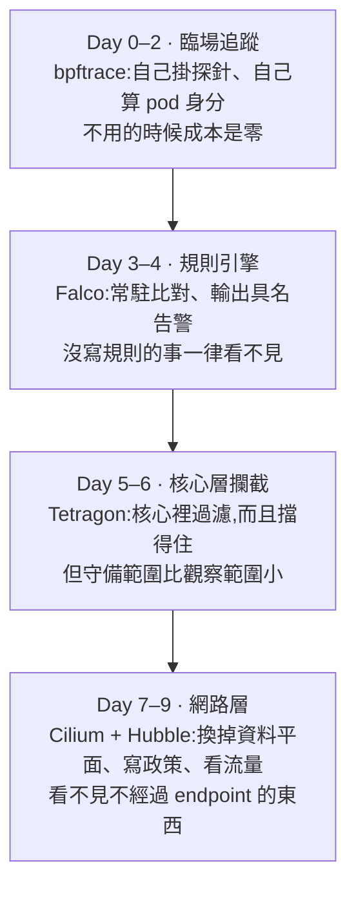

# Day 10: Sprint 2 總結——一套工具的盲點,就是它的執行點

{ align=right width="110" }
{ align=right width="110" }

> 十天下來,同一批核心事件被四套工具用四種方式取用過。這一頁不動手,把散在十章裡的實測數字收攏成一張分工表——而收攏的過程會浮出一件各章各自看不到的事:**每一套工具看不見的東西,跟它把程式掛在哪裡,是同一件事的兩面。**

!!! abstract "你在課程的哪裡"
    - **Day 0–9**:eBPF 的地基、bpftrace 的臨場追蹤、Falco 的規則引擎、Tetragon 的核心層攔截、Cilium 的網路資料平面與 Hubble 的流量觀測。十個動手日、十章、76 顆地雷。
    - **今天**:不動手。把四套工具的位置、成本、失效形狀擺成一張表,每一格都要能追溯到某一天的某一個量測。
    - **接下來**:這一頁最後給三條可以自己走下去的路。

## 走過的路

| Day | 主題 | 最重要的一件事 |
|---|---|---|
| [0](sprint2-day0-ebpf-concepts.md) | eBPF 是什麼 | verifier 保證程式會結束,**不保證程式便宜**——那支害機器慢 57% 的程式完全合法 |
| [1](sprint2-day1-bpftrace-basics.md) | bpftrace 三支經典工具 | 三支工具加自寫的那支,**沒有任何一個欄位說得出事件屬於哪顆 pod** |
| [2](sprint2-day2-bpftrace-kubernetes.md) | 接回 Kubernetes | cgroup id 換算回 pod 名字的五步鏈,**整條不碰 API server** |
| [3](sprint2-day3-falco-basics.md) | Falco 與出廠規則 | 出廠只有 **25 條**規則,而閒置 8 分 28 秒 **0 筆告警** |
| [4](sprint2-day4-falco-custom-rules.md) | 自訂規則與誤報調校 | 誤報 180 筆/分調到 0,**代價是兩條外洩通道,而且量得出來** |
| [5](sprint2-day5-tetragon-basics.md) | Tetragon 與 TracingPolicy | 核心層過濾是真的(3000 次不符合,**0 筆出核心**),但底層 sensor 同窗口匯出 6016 筆 |
| [6](sprint2-day6-tetragon-enforcement.md) | 從偵測到攔截 | SIGKILL 真的**擋住**了外洩(5/5、0 位元組),而理由是掛勾點在操作之前 |
| [7](sprint2-day7-cilium-kubeproxy.md) | Cilium 與 kube-proxy replacement | 動手換掉之前,**kube-proxy 有一大半工作早就不是它在做了** |
| [8](sprint2-day8-cilium-network-policy.md) | CiliumNetworkPolicy | 網路政策**只會放寬不會收緊**;一條無效的政策是 fail-open |
| [9](sprint2-day9-hubble.md) | Hubble | 緩衝區只留**兩三分鐘**,而它看不見這座叢集最大的政策破口 |

## 開始與結束

| | Sprint 開始時 | Sprint 結束時 |
|---|---|---|
| 對 eBPF 的認識 | 一個聽過的名詞 | 說得出載入路徑、verifier 拒絕什麼、CO-RE 為什麼能跨 kernel |
| 看得到的事件身分 | 只有 pid 與 comm | pod、namespace、容器內 pid、image digest、workload kind |
| 偵測的形式 | 人盯著終端機 | 常駐規則引擎,具名告警帶 MITRE 分類 |
| 能不能擋 | 不能 | 能,而且量過「擋住」與「事後殺掉」的差別 |
| 網路的可見度 | Service 是個黑盒 | 看得到 socket LB 的翻譯、政策的逐條命中計數、L7 的兩段連線 |
| 對成本的認識 | 「裝一下而已」 | 每節點 CPU 與記憶體、事件量、緩衝深度、變更代價,全部有數字 |
| 對這些工具的信任 | 官方文件說什麼就是什麼 | **驗收條件是量測,不是 `kubectl apply` 的退出碼** |

## 四套工具的分工表

每一格都對應到某一天的某一個量測,點得進去。

### 位置與交付物

| | bpftrace | Falco | Tetragon | Cilium + Hubble |
|---|---|---|---|---|
| 形態 | 臨場,用完就走 | 常駐 DaemonSet | 常駐 DaemonSet | 資料平面本身 |
| 掛在哪 | 自選探針 | syscall | syscall、LSM | pod veth、socket、endpoint |
| **交付什麼** | 原始事件 | **判斷**(規則名、嚴重度、MITRE) | **紀錄與動作** | **管制與流量圖** |
| 沒設定時 | 什麼都沒有 | [25 條出廠規則](sprint2-day3-falco-basics.md#mine-2) | [底層 sensor 永遠開著](sprint2-day5-tetragon-basics.md#mine-5) | 全通 |
| 要人再判斷嗎 | 是 | 否 | **是** | 是 |

### 同樣四個偏離動作,誰看到什麼

Day 5 讓 Falco 與 Tetragon 同時開著跑同一批動作,這是那次的結果:

| 動作 | Falco | Tetragon |
|---|---|---|
| 有終端機的 fork shell | 2 筆具名告警 | 18 筆無名事件 |
| **無終端機的 web shell** | **1 筆**(出廠規則靜音,靠自訂規則) | 18 筆,**與上一列組成完全相同** |
| `nsenter` 進目標 pod | 2 筆,**pod 認錯** | 34 筆,**pod 認錯** |
| 直接讀敏感檔 | 1 筆 | 8 筆 |
| **總數** | **6** | **78** |

那個「無終端機」的格子是分工的縮影:**Falco 有一個 Tetragon 沒有的欄位([tty](sprint2-day5-tetragon-basics.md#mine-7)),Tetragon 有一個 Falco 沒有的保證——它不做判斷,所以不會判斷錯。**

### 成本

| | 每節點 CPU / 記憶體 | requests | QoS | priority | 變更一條規則 |
|---|---|---|---|---|---|
| Falco | 14–24m / 84–90Mi | `100m/512Mi`([超額 4–7 倍](sprint2-day3-falco-basics.md#mine-7)) | Burstable | **0** | [71 秒滾動更新](sprint2-day4-falco-custom-rules.md#mine-1) |
| Tetragon(monitor-only) | 5–11m / 83–120Mi | `{}` | **BestEffort** | **0** | **2 秒內,不重啟** |
| Tetragon(**攔截狀態**) | **16–34m / 164–224Mi** | `{}` | **BestEffort** | **0** | 同上 |
| Cilium agent(初裝) | 23–30m / 85–102Mi | `{}`([借來的](sprint2-day7-cilium-kubeproxy.md#mine-5)) | Burstable | **2000001000** | — |
| Cilium agent(**跑完政策實驗**) | 22m / **216Mi** | 同上 | Burstable | **2000001000** | — |
| Hubble relay + UI | 11m / 48Mi(兩顆合計) | `{}` | **BestEffort** | **0** | — |

**四套工具裡只有 Cilium 的 chart 替你設了 `priorityClassName`**,而那是因為它不是監控、是網路本身。其餘三套在滿載節點上都是搶佔演算法第一個挑中的。

### 失效形狀——這一列比效能欄位重要

| | 元件掛掉的時候 | 有沒有指標會叫 |
|---|---|---|
| Falco | 少看到事件 | **不會**([DaemonSet 顯示 READY 3/3,而一顆節點斷了 55 秒](sprint2-day3-falco-basics.md#mine-1)) |
| Falcosidekick | **事件照抓,但沒人收到** | **不會**([Falco 全綠](sprint2-day4-falco-custom-rules.md#mine-6)) |
| Tetragon agent | **BPF 程式留在核心裡繼續跑,沒人讀 ring buffer** | **不會**([攔截情境下還會繼續殺行程](sprint2-day6-tetragon-enforcement.md#mine-8)) |
| Cilium agent | 節點斷網 | 會(所以它才是 `system-node-critical`) |
| Hubble | 看不到東西 | 不會,而且它**最容易在節點壓力最大時消失** |

## 主題句:盲點就是執行點

整個 sprint 只問了一個問題四次,而四次答案都不一樣——**從特權容器用 `nsenter` 進另一顆 pod 做壞事**。把四個答案排在一起,工具的差異就不再是功能表的比較,而是架構的推論:

| 工具 | 執行點綁在哪 | `nsenter` 的結果 | 出處 |
|---|---|---|---|
| bpftrace | **cgroup**(過濾器綁 pod slice) | **完全看不到** | [Day 2 地雷 2](sprint2-day2-bpftrace-kubernetes.md#mine-2) |
| Falco | 全節點探針,身分事後靠 cgroup 反查 | 看得到,**pod 認錯** | [Day 3 地雷 5](sprint2-day3-falco-basics.md#mine-5) |
| Tetragon | 全節點探針,身分在核心裡記 cgroup id | 看得到,**pod 認錯**(機制完全不同,答案相同) | [Day 5 地雷 6](sprint2-day5-tetragon-basics.md#mine-6) |
| Tetragon 攔截 | **cgroup** | **完整繞過**(rc=0,讀走 502 位元組,零攔截事件) | [Day 6 步驟 4](sprint2-day6-tetragon-enforcement.md#step-4) |
| Cilium 政策 | **網路命名空間**(veth) | **繞不過,而且自投羅網**(鑽進去權限更少) | [Day 8 地雷 8](sprint2-day8-cilium-network-policy.md#mine-8) |
| Hubble | **endpoint** | 看得到,但**逐欄記在受害者身上** | [Day 9 探針 B](sprint2-day9-hubble.md#probe-b) |

**三個結論從這張表直接讀得出來:**

**一、「在核心裡做」不會讓 pod 歸屬變準,因為 pod 不是核心的概念。** Falco 是使用者空間事後打執行期的 socket 反查,Tetragon 是 BPF 在 `execve` 當下就把 cgroup id 寫進 map——機制差得很遠,**錯誤一模一樣**。根因在更下面:`nsenter` 換命名空間、不換 cgroup。無論在核心裡記得多早,記到的都是發起者的 cgroup。

**二、擋得住的範圍,永遠等於執行點能界定的範圍。** Tetragon 的攔截綁 cgroup,所以換 cgroup 就繞過;Cilium 的政策綁 netns,所以 `nsenter -n` 反而是自投羅網。**兩者都不是 bug,是各自執行點的直接推論。**

**三、觀察範圍與攔截範圍不對稱,而那個差就是攻擊面。** Day 6 有一次攻擊 Falco 看到了、Tetragon 的底層 sensor 也逐行記下了,**而 Tetragon 的攔截沒有觸發**——同一套軟體,看得見的部分跟擋得住的部分不是同一個範圍。只裝攔截的話,那次攻擊是完全靜默的成功。

### 地雷回顧:健康指標全綠而東西沒在運作

這是第二個貫穿全 sprint 的形狀,在十章裡出現了七次,而且七次的「綠燈」都不一樣:

| 教訓 | 地雷(綠的是什麼 → 實際狀態) | 出處 |
|---|---|---|
| `kubectl get ds` READY 3/3 | 一顆節點 55 秒沒有監控 | [Day 3 地雷 1](sprint2-day3-falco-basics.md#mine-1) |
| `helm upgrade` STATUS: deployed | 規則用了淘汰欄位,可能永遠不報 | [Day 4 地雷 2](sprint2-day4-falco-custom-rules.md#mine-2) |
| `kubectl apply` created,CRD 無 status | **策略根本沒載入** | [Day 5 地雷 4](sprint2-day5-tetragon-basics.md#mine-4) |
| pod Running,RESTARTS 那個「1」 | 冷啟動 panic,**31 秒沒有任何攔截** | [Day 6 地雷 1](sprint2-day6-tetragon-enforcement.md#mine-1) |
| ARM 回 `Succeeded` | taint 一個字都沒改 | [Day 7 地雷 7](sprint2-day7-cilium-kubeproxy.md#mine-7) |
| `kubectl get cnp` 列得出來 | 政策無效,**fail-open** | [Day 8 地雷 3](sprint2-day8-cilium-network-policy.md#mine-3) |
| pod 1/1 Running、RESTARTS 0、無事件 | 82 秒輸出全錯的靜默故障 | [Day 6 步驟 5](sprint2-day6-tetragon-enforcement.md#step-5) |

**共通的解法只有一句:驗收條件要問執行者本身,不要問管理平面。** Falco 問啟動日誌有沒有 warning 區塊、Tetragon 問 `tetra tracingpolicy list` 的 `STATE`、Cilium 問 agent 的 `endpoint list` 與 policy map 的逐條計數器,網路政策問 `.status.conditions` 的 `Valid`。

## 帶得走的判斷

**什麼時候用哪一個**,只用量到的東西講:

- **臨場追蹤(bpftrace)**:回答「現在這一秒發生什麼」。成本是人的注意力——[必須剛好在看](sprint2-day2-bpftrace-kubernetes.md)。適合診斷一個正在發生的具體問題,不適合當防線。
- **規則引擎(Falco)**:回答「有沒有已知壞事」。誤報低、可全叢集共用,**代價是沒寫規則的事一律看不見**。它交付的是**判斷**,所以它是唯一一個「有人會被叫醒」的工具。
- **核心層攔截(Tetragon)**:回答「這個動作不准發生」。範圍能被界定清楚時很強(成分固定的工作負載命名空間),範圍界定不了時無效。**攔截交付的是「這個動作沒有發生」,不是「這個攻擊者被處理了」**——五次攔截成功對攻擊者的代價只是五個行程。
- **網路層(Cilium + Hubble)**:回答「誰可以跟誰講話」,而且做得到 HTTP 方法這一層。它是唯一一個**繞不過**的執行點,但它的稽核軌跡**沒有行程身分**。

**四套之間最重要的一句話**:偵測與攔截不能互相取代。**攔截不能取代偵測,因為守備範圍比較小;偵測不能取代攔截,因為告警不會讓 `read()` 失敗。** Day 6 那一格 Falco 的告警與 Tetragon 的攔截在**同一毫秒**發生,一個留下紀錄,一個留下 0 位元組。

## 誠實的差距——這份清單是地圖,不是遺憾

**沒有教到的:**

- **k8saudit 沒有做。** Falco 除了 syscall 還能吃 Kubernetes 稽核日誌,但受管叢集沒有本機稽核日誌,官方路徑需要額外的常駐雲端資源。
- **Falcosidekick UI 跳過了。** 它需要一台帶特定模組的 Redis,而當時那座叢集的節點已經吃緊。**這是本 sprint 唯一一個「有 UI 卻沒教」的缺口。**
- **`ingressDeny` / `egressDeny` 沒有測。** [Day 8 地雷 5](sprint2-day8-cilium-network-policy.md#mine-5) 的結論是「加規則永遠不會收緊」,而 Cilium 有一組 deny 規則可以表達「即使有人允許也要擋」。整層沒碰。
- **`Signal` 配 `Override` 沒有試。** 那是官方對「要確保操作不完成」的建議寫法,本課分別測了兩個動作,沒有測併用。

**留在環境裡沒有堵的洞:**

- **host firewall 從頭到尾沒開。** [Day 8 地雷 9](sprint2-day8-cilium-network-policy.md#mine-9):任何 `hostNetwork` pod 完全豁免所有網路政策,而 [Day 9 探針 C](sprint2-day9-hubble.md#probe-c) 證明 Hubble 也看不出那是繞過。**這是本課環境最大的破口,而且是開著的。** 它的修補位置在 admission 層(誰能建 hostNetwork pod),不在網路層。
- **DNS 外洩通道沒有關。** FQDN 政策擋掉的域名照樣被解析並進快取。要關得把比對樣式收成明確清單,而那跟 FQDN 政策的初衷打架。
- **Hubble 沒有接出去。** 緩衝區只留兩三分鐘,所以「事後去查」在出廠設定下不成立;而一旦落地,落下去的就是含認證標頭的原文([Day 9 地雷 4](sprint2-day9-hubble.md#mine-4))。

**規模上的限制:**

- **叢集最多三顆節點、最少一顆。** Cilium 那三天是**單節點**,所以 Hubble relay 最重要的功能(跨節點聚合)等於沒測;規則與政策的數量也都在個位數,線性成長的代價還沒開始顯現。
- **沒有長時間運行。** 最長的連續攔截狀態是十幾分鐘。所有「記憶體隨叢集歷史成長」的觀察都只涵蓋數小時。
- **延遲的宣稱只有一項站得住。** [Day 7 明確放棄](sprint2-day7-cilium-kubeproxy.md)(負載不對等、雜訊大於訊號),[Day 8 的 L7 成本敢講](sprint2-day8-cilium-network-policy.md#step-6)(訊號是雜訊的 20 倍)。**同一門課裡兩種結論並存是刻意的。**

## 三條可以自己走下去的路

**一、不換 CNI 也能走 eBPF 資料平面。** Day 7 為了自管 Cilium 新建了一座叢集,因為 `--network-plugin none` 只能在建立時指定。如果你的叢集不能重建,[Calico 的 eBPF 資料平面](https://docs.tigera.io/calico/latest/operations/ebpf/enabling-ebpf)是另一條路——它可以在**既有叢集**上啟用,而且同樣會取代 kube-proxy。拿它跟本課 Day 7 的數字對照,是一個現成的比較題。

**二、把 Falco 的規則庫打開。** [Day 3](sprint2-day3-falco-basics.md#mine-2) 量到出廠只有 25 條,而[官方規則庫](https://github.com/falcosecurity/rules)明講 stable 是唯一預設綁進去的,另外還有 incubating 與 sandbox 兩級。裝上去之後重跑一次 Day 3 的閒置量測,就會知道「Falco 很吵」這個名聲到底屬於哪一級。

**三、把兩條資料線接起來。** 本 sprint 最明確的一個缺口:[Hubble 說不出一條 flow 是哪個行程發的](sprint2-day9-hubble.md),而 Tetragon 說得出。這兩份資料在本課的四套工具裡**沒有任何一個地方會合**。要回答「這條被擋的連線是哪支程式打的」,得自己把 Tetragon 的行程事件與 Hubble 的 flow 用時間與五元組對起來——這是一個真實存在、而且值得做的整合題。

## 結語

Day 0 的第一個問題是「什麼是 eBPF」,而那一章的答案是:核心多長出了一套受控的擴充介面,程式送進去之前會被逐條檢查。

十個動手日之後,最後一個動作是在瀏覽器上點開一筆流量,看到 `Verdict: dropped` 和它下面那行 `Unknown drop reason`。

中間這一段學到的東西,如果只能留一句,是這個:**這些工具沒有一個能看見全部,而它們各自看不見的部分不是缺陷,是它們把程式掛在哪裡的直接後果。** 知道一套工具的執行點在哪,就知道它的盲點在哪——**這比記住任何一條規則語法都有用,因為規則語法會改版,而這個推論不會。**

---

!!! quote ""
    eBPF 標誌為 eBPF 專案之官方資產,此處作社群教學用途。
