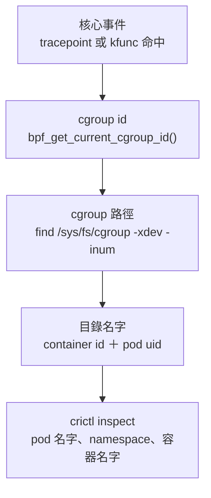
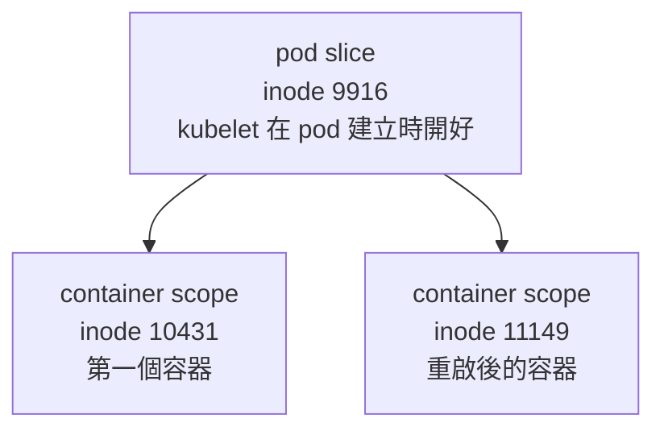

# Day 2: 把核心事件接回 Kubernetes——cgroup id 到 pod 名字的對應鏈,與只追一顆 pod 的過濾器

{ align=right width="95" }

> [Day 1](sprint2-day1-bpftrace-basics.md) 的結論是三支經典工具加上自寫的那支,沒有任何一個欄位說得出事件屬於哪一顆 pod。補起這個缺口只需要一個等式:bpftrace 印出來的 `cgroup` 就是節點上那個 cgroup 目錄的 inode 號碼,於是核心事件可以沿著檔案系統走回 container id 與 pod uid,整條鏈不碰 API server。有了身分,過濾器才有東西可以掛,而掛在哪一層決定它抓不抓得到容器啟動——掛在容器那一層的永遠遲到,掛在 pod 那一層的來得及。今天的驗收是替一顆 nginx 做出一份啟動行為基線,一頁列完它開了哪些檔案、連去哪裡。

!!! abstract "你在課程的哪裡"
    - **Day 0**:eBPF 的載入路徑、掛載點種類與 verifier 的檢查,以及「能掛探針的容器,觀測範圍是整台機器」。
    - **Day 1**:`execsnoop`、`opensnoop`、`tcpconnect` 各自的邊界,加一支自寫的 `.bt`;共同盲點是沒有 pod 身分。
    - **今天**:把核心事件接回 Kubernetes 物件,再用 pod 身分把噪音濾掉。驗收:指名一顆 pod,列出它啟動期間開啟的檔案與對外連線,而且清單要短到一頁看得完。
    - **Day 3**:今天這套手工做法辦不到的七件事,交給常駐的規則引擎 Falco。

## cgroup v2、pod slice,與核心事件裡的那個 id

### 節點上的 cgroup 是一棵目錄樹

cgroup v2 只有單一階層:掛在 `/sys/fs/cgroup` 底下,每一個 cgroup 就是一個目錄,`mkdir` 一下就多一個子 cgroup,而每個行程恰好屬於其中一個。Kubernetes 沒有另外發明什麼,它只是在這棵樹上多開幾層——kubelet 替每一顆 pod 開一層目錄,容器執行期再在那層底下替每個容器各開一層。

本課節點是 AKS 的 Ubuntu 24.04(kernel `6.8.0-1062-azure`、containerd 2.3.2-2),cgroup v2 搭 systemd driver。以基線對象 `baseline-nginx` 為例,從根到容器一共五層:

| 層 | cgroup 目錄 | inode(＝cgroup id) | 這一層代表什麼 |
|---|---|---|---|
| 0 | `/sys/fs/cgroup` | 1 | 根 |
| 1 | `kubepods.slice` | 6780 | 所有 pod |
| 2 | `kubepods-burstable.slice` | 7068 | 該 QoS 等級的 pod |
| 3 | `kubepods-burstable-podda6a…e1.slice` | **9916** | pod slice,一個 pod 一個 |
| 4 | `cri-containerd-ceab0423….scope` | **10431** | container scope,一個容器一個 |

第 3 層與第 4 層的差別是今天所有結果的前提:pod slice 由 kubelet 在 pod 建立時開好,活到 pod 被刪除;container scope 跟著容器生滅,容器重啟一次就換一個目錄、換一個 inode。

### 核心給的身分只有一個數字,而那個數字就是 inode

bpftrace 的 `cgroup` builtin 是 `bpf_get_current_cgroup_id()` 的包裝,回傳目前工作所在 cgroup 的 kernfs node id。這是核心那端能給的全部——沒有 pod 名字,沒有 namespace,只有一個 64-bit 數字。

接得起來的原因在檔案系統這一側:cgroup v2 的 `/sys/fs/cgroup` 是 kernfs,而 kernfs 把 `kn->id` **原封不動當成 inode 號碼**放進 `inode->i_ino`。核心事件裡那個數字,因此可以直接拿去查目錄。

### systemd cgroup driver 把身分編進了目錄名字

走回檔案系統之後,剩下的資訊不必再查任何服務,因為目錄名字本身就是識別碼:

- leaf `cri-containerd-<64 hex>.scope` 的中段是 **container id**
- 上一層 `kubepods-<qos>-pod<uid,破折號換成底線>.slice` 的中段是 **pod uid**

最後一哩用節點上的 `crictl` 把 container id 換成 pod 名字。整條鏈五步,終點是 Kubernetes 物件,起點是一個核心事件:



這條鏈完全在節點上跑完,**沒有任何一步需要 API server**。對常駐的偵測元件來說這不是效率問題而是可用性問題:API server 不通的時候,節點上的偵測不該跟著失效。

### 今天要走的路

七個步驟:部署基線對象 → 把上面那條鏈跑通並拿任意事件驗證 → 走一次 pid 那條路並說明為什麼不選它 → 把過濾掛到 pod slice 上、寫出今天的核心腳本 → 量過濾前後的差距 → 做出 nginx 的啟動基線(本日驗收)→ 用三個刻意的偏離測試基線,再誠實列出這套做法辦不到的事。

## 步驟

### 步驟 1:替基線對象挑一個映像

環境同前章,`ebpf` pool 兩台 `Standard_D2as_v5` spot(1 分 40 秒)。接著的 `kubectl` 一如預期連不上,那是 [Day 1 的地雷 1](sprint2-day1-bpftrace-basics.md#mine-1) 又一次發作,但**這次快取的是區域網路的 DNS 轉發器,不是工作站**:Day 1 那次 `nslookup` 說解得到、`getaddrinfo()` 說沒有,今天連 `nslookup` 都回 NXDOMAIN,只有直接問公用 DNS 才解得到。同一顆地雷、不同的快取層,症狀相反而解法相同——用 `--server` 加 `--tls-server-name` 繞過名字解析。順帶兩件值得記住的事實:API server 的 IP 每次停機再開都會換,VMSS 實例編號也是,所以那條繞道指令不能寫死進腳本。

DaemonSet 逐字重用 Day 1 的檔案,基線對象改用 nginx。第一次套用直接 `ImagePullBackOff`:

```console
$ kubectl -n ebpf-lab describe pod baseline-nginx | tail -3
Failed to pull image "mcr.microsoft.com/mirror/docker/library/nginx:1.27":
  failed to resolve image: … not found
```

錯誤訊息看起來像 tag 打錯字,實際上是 MCR 那個 mirror 的更新節奏問題,診斷與查證方式見[地雷 1](#mine-1)。基線對象的完整定義:

```bash
cat > 02-nginx-baseline.yaml <<'EOF'
# nginx is picked over a synthetic sleep-pod because its startup is genuinely
# non-trivial: /docker-entrypoint.sh execs a chain of shell helpers before the
# master process ever reads nginx.conf. The proxy_pass location gives the pod a
# real upstream dependency, so a warm-up request produces an outbound TCP
# connection inside the startup window.
#
# QoS is deliberately Burstable (requests only, no limits) so the pod lands in
# kubepods-burstable.slice; a Guaranteed pod sits one level higher in the cgroup
# tree and the level numbers quoted below would not match.
apiVersion: v1
kind: ConfigMap
metadata:
  name: nginx-baseline-conf
  namespace: ebpf-lab
data:
  default.conf: |
    server {
        listen 8080;
        server_name _;

        location / {
            return 200 "day2 baseline subject\n";
        }

        # real upstream dependency, literal IP so no resolver is needed
        location /up {
            proxy_pass http://1.1.1.1/;
            proxy_connect_timeout 3s;
        }
    }
---
apiVersion: v1
kind: Pod
metadata:
  name: baseline-nginx
  namespace: ebpf-lab
  labels:
    app: baseline-nginx
spec:
  nodeSelector:
    pool: ebpf
  tolerations:
  - key: kubernetes.azure.com/scalesetpriority
    operator: Equal
    value: spot
    effect: NoSchedule
  containers:
  - name: nginx
    image: mcr.microsoft.com/mirror/docker/library/nginx:1.25
    ports:
    - containerPort: 8080
    resources:
      requests:
        cpu: 50m
        memory: 64Mi
    volumeMounts:
    - name: conf
      mountPath: /etc/nginx/conf.d
  volumes:
  - name: conf
    configMap:
      name: nginx-baseline-conf
EOF
```

改成 1.25 之後 19 秒起來:

```console
$ kubectl -n ebpf-lab get pods -o wide
NAME             READY   STATUS    NODE
baseline-nginx   1/1     Running   aks-ebpf-80832270-vmss000005
ebpf-lab-dt5b9   1/1     Running   aks-ebpf-80832270-vmss000004
ebpf-lab-v6dtk   1/1     Running   aks-ebpf-80832270-vmss000005    ← 與 nginx 同節點
```

bpftrace 的版本每天複驗:容器裡 `v0.20.2`,節點上 2019 年那支 `v0.9.4` 還在 `/usr/local/bin`。

### 步驟 2:從一個核心事件走到 pod 名字

先看核心那端給了什麼。在 `baseline-nginx` 裡執行一個節點上不可能有第二份的檔名,同節點的追蹤 pod 掛一支 execve 探針:

```console
$ bpftrace -e 'tracepoint:syscalls:sys_enter_execve {
    printf("EXEC cgroup=%d pid=%d comm=%s file=%s\n", cgroup, pid, comm, str(args.filename)); }'
…
EXEC cgroup=10431 pid=16585 comm=bash file=/tmp/d2m-140816
```

`cgroup` 與走結構體拿到的是同一個欄位,一行就驗得完:

```console
$ bpftrace -e 'tracepoint:syscalls:sys_enter_execve {
    printf("leaf_builtin=%d leaf_curtask=%d\n", cgroup, curtask->cgroups->dfl_cgrp->kn->id); exit(); }'
leaf_builtin=3670 leaf_curtask=3670
```

拿 10431 去查目錄,再把查到的路徑 `stat` 回來對照:

```console
$ find /sys/fs/cgroup -xdev -inum 10431 -print -quit
/sys/fs/cgroup/kubepods.slice/kubepods-burstable.slice/
  kubepods-burstable-podda6a37ba_5d51_4c09_ab10_229b628ad4e1.slice/
  cri-containerd-ceab0423d28c4fed5cf0ea2a41ba5fe4e6fe95b0a88d4081fe0a09833ffd4964.scope
$ stat -c %i <上面那條路徑>
10431                                        ← 對得起來
```

兩個識別碼已經在路徑裡了:container id 是 `ceab0423d28c…4964`,pod uid 是把底線換回破折號的 `da6a37ba-…-229b628ad4e1`(uid 中段省略)。最後一步交給節點上的 `crictl`:

```console
$ nsenter -t 1 -m -- crictl inspect ceab0423d28c…4964 | grep io.kubernetes
"io.kubernetes.container.name": "nginx",
"io.kubernetes.pod.name": "baseline-nginx",
"io.kubernetes.pod.namespace": "ebpf-lab",
"io.kubernetes.pod.uid": "da6a37ba-…-229b628ad4e1"
```

API server 那邊的兩個欄位對得上——這一步只是交叉驗證,鏈子本身不需要它:

```console
$ kubectl -n ebpf-lab get pod baseline-nginx \
    -o jsonpath='{.status.containerStatuses[*].containerID}'
containerd://ceab0423d28c4fed5cf0ea2a41ba5fe4e6fe95b0a88d4081fe0a09833ffd4964
```

#### 拿沒碰過的事件驗一次

上面那條鏈是對著自己造的事件走的,說服力有限。把它包成 `04-cgroup-to-pod.sh`——四步全部在節點上完成,一步都不碰 API server:

```bash
cat > 04-cgroup-to-pod.sh <<'EOF'
#!/bin/bash
# Turn a kernel-side cgroup id into a Kubernetes pod name.
# Run INSIDE the privileged ebpf-lab pod (needs hostPID and the node's /sys).
set -u
CGID="${1:?usage: cgroup-to-pod.sh <cgroup-id>}"

echo "== 1. cgroup id -> cgroup path (kernfs id == cgroupfs inode number)"
CGPATH=$(find /sys/fs/cgroup -xdev -inum "$CGID" -print -quit 2>/dev/null)
[ -n "$CGPATH" ] || { echo "no cgroup with inode $CGID on this node"; exit 1; }
echo "$CGPATH"

echo "== 2. cgroup path -> container id"
LEAF=$(basename "$CGPATH")
case "$LEAF" in
  cri-containerd-*.scope) CID=${LEAF#cri-containerd-}; CID=${CID%.scope} ;;
  docker-*.scope)         CID=${LEAF#docker-};         CID=${CID%.scope} ;;
  *) CID="" ;;
esac
echo "leaf=$LEAF"
echo "container id=${CID:-<none: this cgroup is not a container scope>}"

echo "== 3. cgroup path -> pod uid (the systemd cgroup driver encodes it in the slice name)"
POD_SLICE=$(dirname "$CGPATH")
SLICE=$(basename "$POD_SLICE")
UID_RAW=$(echo "$SLICE" | sed -n 's/^kubepods-\(besteffort-\|burstable-\)\?pod\(.*\)\.slice$/\2/p')
POD_UID=$(echo "$UID_RAW" | tr '_' '-')
echo "pod slice=$SLICE"
echo "pod uid=${POD_UID:-<none>}"
echo "pod slice cgroup id=$(stat -c %i "$POD_SLICE")"

echo "== 4. container id -> pod name/namespace, no API server (crictl on the node)"
if [ -n "$CID" ]; then
  nsenter -t 1 -m -- crictl inspect "$CID" 2>/dev/null \
    | grep -E '"io.kubernetes.pod.(name|namespace|uid)"|"io.kubernetes.container.name"' \
    | sed 's/^ *//'
fi
EOF
chmod +x 04-cgroup-to-pod.sh
```

包好之後改用節點上本來就在發生的事件。先看 6 秒內的 execve 落在哪些 cgroup:

```console
$ bpftrace -e 'tracepoint:syscalls:sys_enter_execve { @[cgroup, comm] = count(); }
               interval:s:6 { exit(); }'
@[3670, aznfswatchdogv4]: 8
@[6514, kubelet]: 2
@[9856, node-problem-de]: 14
…
```

三個 id 丟進腳本,三個都不是 pod:

```console
cgroup 9856 → /sys/fs/cgroup/system.slice/node-problem-detector.service
cgroup 6514 → /sys/fs/cgroup/system.slice/kubelet.service
cgroup 3670 → /sys/fs/cgroup/system.slice/aznfswatchdogv4.service
(leaf 不是 cri-containerd-*.scope → 腳本回報「這個 cgroup 不是容器」)
```

這正是應該有的答案。一顆閒置 AKS 節點上的 execve 幾乎全是節點常駐服務,同一條鏈順手把「這是節點的事,不是 pod 的事」也答出來,而且直接給出 systemd unit 的名字——**回答「不是 pod」跟回答「是哪顆 pod」同樣重要**,不然節點自身的活動會被算進某顆 pod 頭上。

再從 cgroup 樹上隨機挑一個容器 scope:

```console
$ find /sys/fs/cgroup/kubepods.slice -name 'cri-containerd-*.scope' | shuf -n 1 | xargs stat -c %i
8465
$ ./04-cgroup-to-pod.sh 8465
container id = e76bf071ce8d…a796
pod uid      = 21902a52-…-38647038fde4
"io.kubernetes.pod.name": "csi-azuredisk-node-l8b5k"
"io.kubernetes.pod.namespace": "kube-system"
"io.kubernetes.container.name": "liveness-probe"

$ kubectl get pod -A … | grep 21902a52-
kube-system csi-azuredisk-node-l8b5k 21902a52-…-38647038fde4          ← 對上
$ kubectl -n kube-system get pod csi-azuredisk-node-l8b5k \
    -o jsonpath='{.status.containerStatuses[*].name}'
azuredisk liveness-probe node-driver-registrar                        ← 三個容器,命中第二個
```

一顆從沒碰過的 kube-system pod,連是它三個容器裡的哪一個都指得出來。

### 步驟 3:pid 反查身分的兩個破綻

`cgroup` 不是唯一的路。核心事件同時給了 `pid`,而 `/proc/<pid>/` 底下什麼都有。這條路值得走完,因為走完才知道該選哪一條。

追蹤器 pod 開了 `hostPID: true`,所以它跟節點共用 PID 命名空間,nginx 則有自己的:

```console
host pid 1        : pid:[4026531836]
this lab shell    : pid:[4026531836]          ← 追蹤器與節點同一個 pidns
nginx master 13581: pid:[4026532393]          ← nginx 自己一個

$ grep -E '^NSpid|^NStgid' /proc/13581/status
NStgid: 13581  1
NSpid:  13581  1                              ← 節點看到 13581,容器裡自己是 1
```

`nsenter` 進得去,而且進去之後確實是那個容器:

```console
$ nsenter -t 13581 -m -u -p -- sh -c 'hostname; ls /etc/nginx/conf.d'
baseline-nginx
default.conf
```

四個訊號都說「我在容器裡」,但**行程的 cgroup 成員身分完全沒有變**——這是[地雷 2](#mine-2),而它同時是後面偏離測試裡最重要的一個對照組。

第二個破綻跟權限無關,是時間差。用 pid 反查身分是在使用者空間讀 `/proc/<pid>/cgroup`,而核心事件一秒可以來上萬筆,行程可能比你的 `open()` 還短命:

```console
(pod 內跑 5 次 /usr/bin/true,bpftrace 全部抓到;此處節錄頭尾)
37651 bash /usr/bin/true
…
37655 bash /usr/bin/true

(收到事件之後立刻回頭查 /proc)
pid 37651: /proc/37651 GONE
…
pid 37655: /proc/37655 GONE            ← 5/5 全部來不及
```

兩條路擺在一起比:

| | cgroup id | pid → `/proc` |
|---|---|---|
| 取得位置 | 核心裡(`bpf_get_current_cgroup_id()`) | 使用者空間 |
| 能不能在核心裡過濾 | 能,不符合的事件一個位元組都不送 | 不能,一定要先撈出來 |
| 短命行程 | 不受影響 | 本課 5/5 查無此 pid |
| 識別碼會不會重複使用 | 不會 | 會 |
| 看得見 `nsenter` 進來的動作 | 看不見 | 看得見 |
| 解析成本 | 一次 `find -inum`,之後可快取 | 每個事件一次 `open()` ＋ `read()` |

前四列讓 DaemonSet 型的追蹤器只能選 cgroup:**以 cgroup id 為主鍵、pid 只當輔助欄位**。第五列是誠實的代價,它要靠節點層的存取控制補,追蹤器補不了。

### 步驟 4:過濾掛在 pod slice 上,以及三顆語言層的地雷

#### 為什麼不是掛在容器那一層

「追蹤某個容器」最直覺的寫法是 `/cgroup == <container scope id>/`。容器已經在跑的時候它很好用,但拿來抓啟動行為就會撞上先後順序的問題:要過濾的那個 cgroup 是容器建立時才產生的,容器建立之前沒有那個號碼可以填。往上一層就沒有這個問題:



同一顆 pod、同一個 pod slice,容器重啟之後 container id 從 `ceab0423…4964` 換成 `2572577c…2ed3`、leaf 的 cgroup id 從 10431 換成 11149,而 9916 兩次都一樣。掛在 leaf 上的過濾器不只抓不到啟動,重啟之後還會**不報錯地從此不吐資料**,細節與正解見[地雷 3](#mine-3)。核心那端只要一個指標跳躍:

```awk
curtask->cgroups->dfl_cgrp->kn->parent->id
```

#### 今天的核心腳本

`05-podtrace.bt` 三類事件全部**在核心裡**用 pod slice id 過濾,`$1` 是命令列傳進來的那個 id:

```bash
cat > 05-podtrace.bt <<'EOF'
#!/usr/bin/env bpftrace
/*
 * podtrace.bt - everything one pod does, and nothing else.
 *
 *   bpftrace podtrace.bt <pod-slice-cgroup-id>
 *
 * The filter is written out four times instead of hiding behind a #define on
 * purpose: one #define anywhere in this file makes bpftrace 0.20.2 lose
 * `struct task_struct` and refuse to compile.
 *
 * Known limits: exactly one level up, so a workload running its own cgroup
 * manager sits too deep to match; and this is cgroup membership, not namespace
 * membership, so work done through `nsenter -t <pid>` from the node stays in
 * the caller's cgroup and is invisible here.
 */

BEGIN
{
	printf("# podtrace: pod slice cgroup id = %d\n", $1);
	printf("# CLASS TIME PID COMM DETAIL\n");
}

tracepoint:syscalls:sys_enter_execve
/curtask->cgroups->dfl_cgrp->kn->parent->id == $1/
{
	printf("EXEC %s %-7d %-16s %s\n", strftime("%H:%M:%S", nsecs), pid, comm,
	    str(args.filename));
}

tracepoint:syscalls:sys_enter_openat
/curtask->cgroups->dfl_cgrp->kn->parent->id == $1/
{
	@fn[tid] = args.filename;
}

tracepoint:syscalls:sys_exit_openat
/@fn[tid]/
{
	$ret = args.ret;
	printf("OPEN %s %-7d %-16s %-4d %s\n", strftime("%H:%M:%S", nsecs), pid,
	    comm, $ret >= 0 ? 0 : - $ret, str(@fn[tid]));
	delete(@fn[tid]);
}

kfunc:vmlinux:tcp_connect
/curtask->cgroups->dfl_cgrp->kn->parent->id == $1/
{
	$sk = args.sk;
	$dport = bswap($sk->__sk_common.skc_dport);
	printf("CONN %s %-7d %-16s tcp %s:%d\n", strftime("%H:%M:%S", nsecs), pid,
	    comm, ntop($sk->__sk_common.skc_daddr), $dport);
}

kfunc:vmlinux:udp_sendmsg
/curtask->cgroups->dfl_cgrp->kn->parent->id == $1 && args.sk->__sk_common.skc_daddr != 0/
{
	$sk = args.sk;
	$dport = bswap($sk->__sk_common.skc_dport);
	printf("CONN %s %-7d %-16s udp %s:%d\n", strftime("%H:%M:%S", nsecs), pid,
	    comm, ntop($sk->__sk_common.skc_daddr), $dport);
}

END
{
	clear(@fn);
}
EOF
```

`OPEN` 沿用 Day 1 解剖過的 enter／exit 配對:進入時把檔名寄放在 `@fn[tid]`,離開時取出來連同 errno 一起印。連線那邊掛了 `tcp_connect` 與 `udp_sendmsg` 兩支 `kfunc`,而 **UDP 是刻意加的**。Day 1 量到 `tcpconnect.bt` 對 DNS 是 0 筆,因為解析器走 UDP;一份看不見 DNS 的基線是有洞的基線,今天補上。

寫這支腳本撞了三顆語言層的地雷,共同點是它們都不會直接說「你錯了」:一個 `#define` 會讓 bpftrace 忘記 `struct task_struct`,而錯誤訊息指著你的 filter([地雷 4](#mine-4));課本寫法的手寫位元組交換在自我指派時是空操作,印出來的 port 看起來完全合法([地雷 5](#mine-5));`time()` 接 `printf()` 是兩次輸出,會被別的 CPU 插進中間,197 行只壞 1 行([地雷 6](#mine-6))。三顆都修掉之後,腳本才有資格拿去做基線。

### 步驟 5:同一個窗口,量過濾前後的差距

為了讓「同一個窗口」不是嘴上說說,`06-noise-compare.sh` 從 `05-podtrace.bt` **自動生出未過濾版本**(用 sed 把 predicate 那幾行刪掉),兩支同時掛、同時停:

```console
$ ./06-noise-compare.sh 9916 30
predicates left in unfiltered variant: 0
ARMED 06:15:01
STOPPED 06:15:32
all   total=50334  EXEC=971  OPEN=48966  CONN=397  distinct-comm=99
one   total=1036   EXEC=124  OPEN=652    CONN=260  distinct-comm=12
```

期間 nginx pod 跑一段固定的工作負載:20 輪讀設定檔、DNS 查詢、對外 TCP,以及打自己的 `/up` 讓 nginx 去 proxy。

| | 未過濾 | pod slice 過濾 | 倍數 |
|---|---|---|---|
| 事件總數 | 50,334 | 1,036 | 48.6× |
| EXEC | 971 | 124 | 7.8× |
| OPEN | 48,966 | 652 | 75.1× |
| CONN | 397 | 260 | 1.5× |
| 不同 comm | 99 | 12 | 8.3× |
| 輸出位元組 | 4,556,335 | 62,385 | 73.0× |

`CONN` 那一列的倍數特別小,因為工作負載本身就是這 31 秒裡少數會對外連線的東西;`OPEN` 則相反,節點上的開檔幾乎全是別人的。未過濾那邊的前幾名把噪音的來源說得很清楚:

```console
14613 containerd-shim      5579 awk       4731 jq        3997 curl
 2493 containerd           2096 kubelet   1860 cat       1791 sed
 1516 check_scheduled       887 bash       807 check_spot_evic
```

**沒有一個是使用者的工作負載。** 過濾之後剩下的 12 個 comm 全部說得出來歷:`bash`、`getent`、`cat`、`sleep`、`head`、`nginx`、`seq`、`date` 是工作負載本身,`runc:[…]`、`6`、`runc` 是 `kubectl exec` 的機制。連線目標也短到可以直接讀:

```console
200  udp 10.0.0.10:53        ← kube-dns
 40  tcp 1.1.1.1:80          ← 20 次自己連 ＋ 20 次 nginx proxy
 20  tcp 127.0.0.1:8080      ← 打自己
```

Day 1 那個「22 秒 24,350 行、只能臨時開不能整天開」的結論,在有了 pod 身分之後換了一個樣子:整天開著也只有一頁。

### 步驟 6:nginx 的啟動行為基線(本日驗收)

計畫允許自選對象,挑 nginx 有三個理由,每一個都影響基線好不好讀。第一,啟動真的有事情發生——官方映像的 `/docker-entrypoint.sh` 會 `find` 加 `sort` 列出 `/docker-entrypoint.d/` 底下的腳本再一支支跑,是一條貨真價實的 exec 鏈,不是 `sleep infinity` 那種假工作負載。第二,檔案清單短到人看得完;Python 應用光是 import 掃描就動輒開幾百個檔,基線會變成技術上正確、實際上沒人讀的東西。第三,可以給它一個真的外部依賴:設定檔裡放一條 `location /up { proxy_pass http://1.1.1.1/; }`,暖機請求一打,nginx 自己就會對外連線,連線那一欄才不會是空的。用字面 IP 而不是網域是刻意的,省掉 resolver 之後,基線裡那一筆連線的來源無可爭議。

#### 在容器還不存在的時候抓到它的啟動

這就是把過濾掛在 pod slice 上的用途:

```
1. 先讓 pod 跑起來(pod slice 誕生,id = 9916)
2. 拿 pod slice id 架好 05-podtrace.bt        ← 容器還是舊的那個
3. kubectl exec -- kill -TERM 1               ← nginx master 結束,容器跟著結束
4. kubelet 在同一個 pod slice 裡重建容器       ← 全新的 container scope,全新的啟動
5. 從另一顆 pod 打一次暖機請求(不走 kubectl exec,避免把 runc 的雜訊算進來)
6. 收工
```

第 4 步之後 leaf id 換成新的一個,pod slice 還是 9916,過濾器一路沒斷:

```console
14:18:10 armed
14:18:11 TERM sent
14:18:2x RESTARTS=2  containerID=containerd://012ac94da423…b667
14:18:27 warm-up: HTTP/1.1 301 Moved Permanently        ← 1.1.1.1 回的,證明 proxy 真的連出去了
         lines=204  (198 筆事件,0 行畸形)
```

#### 基線本身

完整內容在 `08-nginx-startup-baseline.md`。窗口定義是「entrypoint 執行 → 第一個請求服務完畢」,基線本體 87 筆事件。

執行的程式共 12 支,排成一條讀得出前因後果的鏈:

```
/docker-entrypoint.sh                                    ← runc 執行的第一支
  ├─ /usr/bin/find ×2  /usr/bin/sort                     ← 列出 /docker-entrypoint.d/
  ├─ 10-listen-on-ipv6-by-default.sh → basename, touch
  ├─ 20-envsubst-on-templates.sh     → basename, awk
  ├─ 30-tune-worker-processes.sh     → basename
  └─ /usr/local/sbin/nginx → /usr/local/bin/nginx → /usr/sbin/nginx
```

最後那三行不是三支不同的程式,**是 PATH 搜尋**:`exec nginx` 依序試三個目錄,前兩次 ENOENT,第三次才成功。[Day 1 的地雷 2](sprint2-day1-bpftrace-basics.md#mine-2) 講的「掛在 `sys_enter` 就分不出成敗」在這裡有了實例——光看 EXEC 事件會以為這個容器啟動了三個 nginx。

開啟的檔案共 32 個相異路徑,挑幾個值得指著講的:

| 路徑 | errno | 開檔者 | 為什麼值得看 |
|---|---|---|---|
| `/etc/nginx/nginx.conf` | 0 | `nginx` | 主設定檔,理所當然 |
| `/etc/nginx/conf.d/default.conf` | 0 | `nginx` | 掛進去的 ConfigMap |
| `/etc/nginx/conf.d/default.conf` | 30 | `touch` | errno 30 ＝ EROFS |
| `/docker-entrypoint.d/15-local-resolvers.envsh` | 0 | `docker-entrypoi` | 被讀了,但沒有出現在 exec 清單裡 |
| `/etc/localtime`、`/etc/nsswitch.conf`、`/etc/passwd`、`/etc/group` | 0 | `nginx` | libc 起手式 |
| `/var/log/nginx/{access,error}.log`、`/var/run/nginx.pid` | 0 | `nginx` | 唯一會被寫的三個檔 |
| `/usr/lib/ssl/openssl.cnf` | 0 | `nginx` | 即使沒設定 TLS 也會讀 |
| `/sys/devices/system/cpu/online` | 0 | `nginx` | worker 數量是這樣決定的 |

第三列與第四列是基線自己抓到的兩件事,而且兩件都不是刻意安排的。`10-listen-on-ipv6-by-default.sh` 想 `touch` 設定檔,ConfigMap 掛載是唯讀檔案系統,於是失敗——容器沒有因此結束、沒有寫進 log、`kubectl get pod` 一切正常,官方 entrypoint 就這樣靜默失敗,只有 syscall 那一層看得到。`15-local-resolvers.envsh` 則是被讀了但沒被執行(它沒有執行權限),而**這件事只有把開檔清單與執行清單並排才看得出來**,任何單一工具都答不出。

對外連線只有一筆——`tcp 1.1.1.1:80  by nginx`,沒有 DNS,因為設定檔寫的是字面 IP。這份只有一筆的連線清單,正好是下一步最好的對照組。

三個數字收在基線檔案的結尾——`distinct binaries 12`、`distinct files 32`、`distinct outbound peers 1`。**驗收通過**:給定 pod 名字 `baseline-nginx`,列得出它啟動期間開啟的 32 個檔案與 1 個對外連線,整份基線一頁看得完。

不過**原始擷取不等於基線**。204 行原始輸出裡有 106 筆是 runc 與 containerd 建立容器的機制,那是每一顆 pod 都一模一樣的東西,`07-baseline-build.sh` 把它們數出來然後丟掉,再依窗口裁切成 87 筆。丟不丟這一層本身就是設計決定:丟了清單才讀得完,不丟才抓得到「有人在 runc 那一層動手腳」。這份基線選擇丟掉,並且把這個選擇寫在檔案裡。

### 步驟 7:基線抓得到什麼、抓不到什麼

有了基線,故意做三件不在基線裡的事,看它們現不現形。同一顆 pod、同一個過濾器、同一支腳本。

```bash
wc -l < /etc/shadow                        # a file nginx never opens
exec 3<>/dev/tcp/<public-dns-a>/53         # a peer not in the baseline
id
```

`<public-dns-a>` 與後面的 `<public-dns-b>` 是兩個公共 DNS 服務的位址,寫成佔位符;它們唯一的作用是不在基線清單上,而兩次用不同的位址,是為了分辨事件來自哪一次。`09-deviation-check.sh` 的內容就是三個 `comm -13`:

```console
== new binaries (in live, not in baseline) ==
  /usr/bin/bash
  /usr/bin/id
  /usr/bin/wc

== new files (in live, not in baseline) ==
  /dev/tty
  /etc/shadow
  /lib/x86_64-linux-gnu/libtinfo.so.6

== new peers (in live, not in baseline) ==
  tcp <public-dns-a>:53
```

三件事全部現形,而且多現形了兩件沒特別去做的:`/dev/tty` 與 `libtinfo.so.6`。那兩個是**互動式 shell 的指紋**——bash 起來會找終端機、會載入終端機控制函式庫,而一個只跑 nginx 的容器一輩子不會碰它們。基線的價值在這裡具體化了:不需要事先想到「有人會 exec 進來」這條規則,只需要知道「這不在清單上」。

這一段還帶出一顆語意層的地雷,它會精準刪掉整個偵測情境裡唯一重要的那一筆事件,見[地雷 7](#mine-7)。

#### 同一組動作走 `nsenter`

同樣讀 `/etc/shadow`、同樣連一個新位址,但這次從節點上的追蹤器 pod `nsenter` 進去:

```console
$ nsenter -t <nginx master pid> -m -u -p -n -- bash -c \
    'wc -l < /etc/shadow; exec 3<>/dev/tcp/<public-dns-b>/53 && echo connected-<public-dns-b>-via-nsenter'
19
connected-<public-dns-b>-via-nsenter                        ← 動作確實成功了
```

同一份擷取裡:

```console
<public-dns-b> 的筆數 : 0
/etc/shadow 的筆數    : 1        ← 只有 kubectl exec 那一筆
```

一筆都沒有。這是[地雷 2](#mine-2) 的實測後果:以 cgroup 為範圍的追蹤器對 `nsenter` 完全無感。這不是 bpftrace 的問題,是「pod 範圍」這個概念本身的邊界——拿得到節點 root 的人不在 pod 裡。

#### 這套做法辦不到的七件事

今天的東西能用,但它離「執行期防護」還有距離,而且差在哪裡要講得具體:

| 缺什麼 | 今天的實況 |
|---|---|
| 沒有持久化 | 輸出是某顆 pod 的 `/tmp/*.out`;pod 被重排、節點被 spot 回收,證據就不見了 |
| 沒有告警 | 偏離要有人執行 `09-deviation-check.sh` 才會被看到,沒有 webhook、沒有分級、沒有去重 |
| 沒有規則引擎 | 「規則」是三個 `comm -13`,寫不出「連到私有網段以外才算」「一分鐘內超過 N 次才算」「這個 namespace 例外」 |
| 必須剛好在看 | 探針要先掛好,掛上去之前發生的事完全不存在;為了抓啟動還得刻意讓容器重啟一次 |
| 一次一顆 pod | 過濾器是單一 cgroup id,要監控整個 namespace 得自己維護「pod → cgroup id」並在 pod 生滅時更新 |
| 基線是一張快照 | 沒有「允許但罕見」這個概念;暖機請求沒去 DNS,於是任何一次 DNS 查詢都會被判成偏離 |
| 看不見 `nsenter` | 見上一節 |

前四列是常駐偵測要解的(持久化、告警路由、規則語言、開機即掛載),第五列是「容器身分應該由執行期提供,而不是自己算」,第六列是規則調校的問題,第七列則是**前面幾種都解不掉的**,它要靠節點層的存取控制。這張表就是 Day 3 之後幾天的規格。

#### 收尾

BPF 程式的殘留檢查在刪除之前做。掛著的時候 5 支,`SIGINT` 之後 5 支收回:

```console
--- WHILE ATTACHED ---
prog total=58
  558: tracepoint  name tracepoint_syscalls_sys_enter_execve    tag 5e916e4355a4d258
  559: tracepoint  name tracepoint_syscalls_sys_enter_openat    tag 694a0f58b7ffa490
  560: tracepoint  name tracepoint_syscalls_sys_exit_openat     tag db7ad05e995636f3
  561: tracing     name udp_sendmsg                             tag ca8c55774b92e4cd
  562: tracing     name tcp_connect                             tag 06e1380de587f59b
--- AFTER SIGINT ---
prog total=53
  2:   tracing     name hid_tail_call                          tag 7cc47bbf07148bfe
bpftrace procs=0
```

總數停在 53 而不是最初的 52,多出來那一支是隨容器生滅漂進來的 `cgroup_device`;`tracing=1` 是核心自帶的 `hid_tail_call`,Day 1 記過同一個 tag。**驗收條件寫成「自己掛的那幾類歸零」,不是「總數回到最初的基線值」。** 兩顆節點的最終狀態一致,節點 `/tmp` 也沒有留下東西。

接著刪 `ebpf-lab` namespace(11 秒)、把 `ebpf` pool 縮回 0(1 分 10 秒)並用 `nodepool list`、`nodepool show`、`kubectl get nodes` 三重驗證,最後停掉整座叢集(2 分 04 秒),三個 pool 的定義都留給 Day 3。`ebpf` pool 從下達 scale 到確認歸零共存活 22 分 10 秒(0.369 hr),spot 單價 US$0.0207/hr/台,本日兩台合計 **US$0.0153**,約新台幣 0.49 元;同規格隨需價是 US$0.112/hr/台。

## 驗收 checkpoint

| 檢查項 | 指令 | 期待結果 |
|---|---|---|
| cgroup id 就是 inode | `find /sys/fs/cgroup -xdev -inum <id>` 再 `stat -c %i` 查到的路徑 | 兩個數字相同 |
| 鏈子走得到 pod 名字 | `./04-cgroup-to-pod.sh <任一 container scope inode>` | 印出 pod 名字、namespace、容器名字,且 pod uid 與 `kubectl` 查到的相同 |
| 節點端事件不會被誤判成 pod | 拿 `system.slice` 底下服務的 cgroup id 跑同一支腳本 | 回報「不是容器」並給出 systemd unit 名字 |
| pod slice 的 id 跨重啟不變 | 容器重啟前後各 `stat` 一次 pod slice 目錄 | 兩次相同(container scope 的 id 會換) |
| 過濾發生在核心裡 | 同一窗口同時跑過濾與未過濾兩份 | 事件數與輸出位元組都差一到兩個數量級(本課 50,334→1,036、4.56 MB→62 KB) |
| **本日驗收:啟動基線** | `08-nginx-startup-baseline.md` | 12 支執行檔、32 個相異檔案、1 個對外連線,一頁看得完 |
| 基線抓得到偏離 | `./09-deviation-check.sh` | 三個刻意的動作全部出現在 new binaries／files／peers 三段裡 |
| `nsenter` 的動作看不見 | 在同一份擷取裡數目標位址的筆數 | `0` |
| 收工無殘留 | `bpftool prog list` 篩自己掛的 tracepoint 與 tracing 程式 | 都歸零(總數會隨其他元件浮動,不能當判準) |

## 地雷記錄

### 地雷 1:MCR 的 Docker Hub mirror 是逐個映像凍結的,而 kubelet 只回 `not found` {#mine-1}

**症狀**:`mcr.microsoft.com/mirror/docker/library/nginx:<tag>` 拉不到,訊息是 `failed to resolve image: … not found`,跟 tag 打錯字一模一樣。

**根因**:課程用 `mcr.microsoft.com/mirror/docker/library/*` 拉映像,繞開 Docker Hub 的匿名拉取限制。但那個 mirror **不是整體同步的**——`curl -s https://mcr.microsoft.com/v2/<repo>/tags/list` 一問就知道,有些 repo 停在好幾年前的 tag,上游有的新版本它沒有。難查的地方在錯誤訊息:它與拼錯 tag、與沒有權限三種情況長得一樣,於是你會去檢查字串和 registry 權限,唯獨不會懷疑「這個 tag 在上游存在,但 mirror 沒有」。

**修法**:部署前先查 `curl -s https://mcr.microsoft.com/v2/<repo>/tags/list`,不要等 CI 失敗才發現。

**教訓**:任何為了避開速率限制而把 registry 換成 mirror 的做法,都繼承了那個 mirror 的更新節奏;拿它跑正式工作負載,等於把版本鎖在它最後一次同步的那一天。

### 地雷 2:`nsenter` 換的是命名空間,不是 cgroup {#mine-2}

**症狀**:`nsenter -t <pid> -m -u -p -n` 之後,`hostname` 是目標容器的、檔案系統是目標容器的、網路也是目標容器的,四個訊號都說「我在裡面」。但 `/proc/self/cgroup` 印出來的還是呼叫端自己的路徑:

```console
$ cat /proc/self/cgroup                       (追蹤器 pod 自己)
0::/kubepods.slice/…/kubepods-burstable-pod22e306e7_…_975bb8cee3a2.slice/cri-containerd-14acd5ee….scope

$ nsenter -t 13581 -m -u -p -- cat /proc/self/cgroup
0::/kubepods.slice/…/kubepods-burstable-pod22e306e7_…_975bb8cee3a2.slice/cri-containerd-14acd5ee….scope
                                              ↑ 還是追蹤器自己的,不是 nginx 的

$ nsenter -t 13581 -m -u -p -C -- cat /proc/self/cgroup
0::/../../kubepods-burstable-pod22e306e7_…slice/cri-containerd-14acd5ee….scope
                                              ↑ 加 -C 只換視角,成員身分沒動
```

**根因**:`nsenter` 根本沒有「加入某個 cgroup」的選項。加上 `-C`(cgroup namespace)也沒用,那只換掉路徑的顯示方式——變成相對於新根的 `/../../…`——成員身分一樣沒動。要真的變成成員,得自己把 pid 寫進目標 cgroup 的 `cgroup.procs`。

**修法與後果**:兩個。一是記帳:在 `nsenter` 裡跑的 CPU 與記憶體全部算進**呼叫端 pod 的 limit**,壓力測試會壓到錯的對象。二是偵測,而這一個是安全問題——**任何以 cgroup 為範圍的追蹤器,都看不見經由 `nsenter` 進入容器的動作**;步驟 7 的實測是同一組動作走 `kubectl exec` 全部現形、走 `nsenter` 一筆都沒有。

**教訓**:拿得到節點 root 的人,繞過 pod 範圍的監控只要多打七個字元。這個缺口不在追蹤器裡,補也不該補在追蹤器裡。

### 地雷 3:container scope 的 cgroup id 每次重啟都會換,只有 pod slice 活得跟 pod 一樣久 {#mine-3}

**症狀**:用 `/cgroup == <container scope id>/` 追一個容器,抓不到它的啟動;容器 crash 重啟之後,過濾器**不報錯,只是從此一筆都不吐**。

**根因**:容器每重啟一次,container scope 就是一個新目錄、一個新的 cgroup id:

```console
(第一次)  container id ceab0423…4964   leaf cgroup id 10431
(重啟後)  container id 2572577c…2ed3   leaf cgroup id 11149
          pod slice cgroup id           9916  ← 兩次都一樣
```

抓不到啟動則是先後順序的問題:要過濾的那個 cgroup 是容器建立時才產生的,建立之前你不可能知道那個號碼;等查到號碼再去掛探針,entrypoint 早就跑完了。

**修法**:往上一層。pod slice 由 kubelet 在 pod 建立時就開好,容器重啟多少次都不會動它,核心那端只要一個指標跳躍:

```awk
curtask->cgroups->dfl_cgrp->kn->parent->id     ← 這個 task 所屬 pod 的 slice id
```

於是可以先架好過濾器,再讓容器重啟,把完整的啟動過程抓下來。

**教訓**:這個寫法**剛好只往上一層**。容器裡自己跑 systemd、或巢狀容器,工作會落在 pod slice 底下第二層以後,這個過濾器就漏掉了——選錨點是在「活得夠久」與「涵蓋得夠深」之間取捨,不是選一個永遠對的答案。

### 地雷 4:`.bt` 檔裡出現一個 `#define`,bpftrace 0.20.2 就會忘記 `struct task_struct` {#mine-4}

**症狀**:把那條指標鏈包成 `#define PODCG …`,整支腳本編不過,而錯誤訊息指著用到它的那一行:

```console
/tmp/podtrace.bt:45:1-23: ERROR: Unknown struct/union: 'struct task_struct'
/PODCG == $1/
```

一模一樣的運算式寫成 one-liner 就沒事。逐項拆開之後結論很乾淨:

```console
T1  one-liner,filter 裡用 curtask                     → Attaching 1 probe...  ✅
T2  .bt 檔,有 #define                                 → Unknown struct/union  ❌
T3  .bt 檔,把 #define 展開成原文                       → Attaching 1 probe...  ✅
```

**根因**:bpftrace 只有在程式含 `#include`／`#define` 時才會叫起 C 前處理器;一旦叫起來,型別解析就改走 ClangParser 那條路,而 **BTF 裡的 `struct task_struct` 不會被自動帶進去**。[Day 1](sprint2-day1-bpftrace-basics.md) 那支 `whowrites.bt` 也有 `#define` 卻沒事,因為它用的是 `kfunc` 的 `args.file`,型別直接來自探針自己的 BTF 簽章,不需要查 `struct task_struct`。**兩者的差別不是「有沒有 BTF」,是「型別從哪裡來」**;不講清楚這一點,會得到「Day 1 可以、Day 2 不行」的迷信。

看起來最直覺的補救也失敗:

```console
#include <linux/sched.h>   →  /usr/include/linux/sched.h:93: error: unknown type name '__aligned_u64'
```

那是 uapi 標頭,裡面沒有核心內部的 `task_struct`;而真要走 kernel headers,就等於把 [Day 1 的地雷 6](sprint2-day1-bpftrace-basics.md#mine-6) 那整包執行期依賴請回來。

**修法**:需要 `curtask` 的腳本就不要用 `#define`,把運算式原文寫出來。重複四次很醜,但它會編、會跑,而且不會在下一版靜默改行為。

### 地雷 5:自己指派給自己的位元組交換是無聲的空操作 {#mine-5}

**症狀**:port 印出來全是離譜的數字,`10.0.0.10:13568`、`1.1.1.1:20480`。13568 就是 0x3500,正是 53 沒有交換過的樣子。腳本裡是課本寫法:

```awk
$dport = $sk->__sk_common.skc_dport;
$dport = ($dport >> 8) | (($dport << 8) & 0xff00);     ← 這一行什麼都沒做
```

**根因**:一支探針、四種寫法、一行輸出定案(連線目標固定 `1.1.1.1:80`):

```console
raw=20480  newvar_shift=80  selfassign_shift=20480  selfassign_bswap=80
```

原值 20480;用新變數接得到 80,正確;指派回同一個變數得到 20480,錯,而且沒有任何警告;`bswap()` 指派回同一個變數得到 80,正確。對照組排除了「自我指派本身不行」這個解釋:`BEGIN { $x = 5; $x = $x + 1; }` 得到 6,`$y = 0x5000; $y = ($y >> 8) | …` 得到 80。**只有當變數的型別來自結構體的 16-bit 欄位時才會這樣**,`kprobe` 加型別轉換與 `kfunc` 加 BTF 兩種寫法都一樣。

**修法**:一律用 `bswap()`。Ubuntu 內建的 `/usr/sbin/tcpconnect.bt` 沒中招,因為它寫的是 `$dport = bswap($dport);`。

**教訓**:它給你的是一個看起來很像 port 的數字。20480、13568、44403 都在合法範圍內,不會爆、不會空白、不會出現在任何錯誤訊息裡,只有在剛好知道自己連的是 80 的時候才會發現。網路上大量 bpftrace 教學片段用的正是那個手寫 shift 寫法。

### 地雷 6:同一個動作區塊裡的 `time()` 與 `printf()` 會被別的 CPU 插隊 {#mine-6}

**症狀**:第一次抓到的基線裡,197 行有 1 行長這樣:

```console
OPEN 06:16:19 OPEN 06:16:19 29710   sort             0    /etc/ld.so.cache
```

**根因**:`time("OPEN %H:%M:%S ")` 後面接 `printf(…)` 是官方工具的常見寫法(`opensnoop.bt`、`tcpconnect.bt` 都這樣寫),讀起來也很自然,但那是**兩次獨立的輸出**。兩顆 CPU 同時命中探針時,一邊的 `time()` 會落在另一邊的 `time()` 與 `printf()` 之間。

**修法**:把時間塞進同一個 `printf`——`printf("OPEN %s …", strftime("%H:%M:%S", nsecs), …)`。改完之後重抓,180 筆 OPEN 全部 6 個欄位,0 行畸形。

**教訓**:它不會壞得夠明顯。197 行只壞 1 行,肉眼看不出來,但任何逐行解析的東西都會多出一筆欄位錯位的資料——而「行為基線」正是最不能忍受這種錯位的用途,因為它要拿去比對。

### 地雷 7:`execve` 事件裡的 `comm` 是舊行程的名字 {#mine-7}

**症狀**:第一版的分類器用 `comm` 判斷事件屬於工作負載還是容器執行期(`comm ~ /^runc/` 就丟掉),結果 `kubectl exec` 起的那個 shell **整筆消失**。

**根因**:

```console
EXEC 06:20:09 35665   runc:[2:INIT]    /usr/bin/bash
```

`execve` 進入點觸發時新映像還沒載入,`comm` 仍然是舊的 `runc:[2:INIT]`。於是「丟掉 runc 的事件」這條看起來很合理的規則,**精準地刪掉了「有人在這個容器裡開了一個 shell」這一筆**,而那是整個偵測情境裡唯一重要的事件。

**修法**:分類要看對欄位。`EXEC` 事件看**被執行的那個檔案**(只有 `/proc/self/fd/*` 那種 runc 自我重執行才算機制),其他事件才看 `comm`。改完之後 `/usr/bin/bash` 立刻出現在偏離清單第一行。

**教訓**:`comm` 與 argv[0] 描述的是同一個行程在兩個不同時刻的樣子。Day 1 那份 execsnoop 輸出裡 `bash -c` 那筆之所以長得怪,原因也在這裡。

## 帶得走的東西

- 核心裡的 cgroup id 與檔案系統上的 inode 是同一個數字,所以「核心事件 → 節點上的路徑」不需要任何服務參與。這條性質不是 Kubernetes 給的,是 kernfs 給的;Kubernetes 做的只是把 container id 與 pod uid 編進目錄名字,讓最後兩步變成字串處理。
- 過濾器要掛在活得夠久的那一層。leaf 的 id 跟著容器生滅,pod slice 的 id 跟著 pod;掛錯一層不會噴出任何錯誤,只會從某個時刻起不再吐資料,而這種靜默失效比噴錯難查得多。掛對之後省下的量是一到兩個數量級,而且省掉的幾乎都是別人的事件——未過濾那份的前三名 containerd-shim、awk、jq,沒有一個屬於被追蹤的工作負載。
- 基線的價值不在於你想得到的規則,而在於「不在清單上」這個判準本身。`/dev/tty` 與 `libtinfo.so.6` 沒有人為它們寫過規則,卻直接指出有人開了互動式 shell。
- 監控範圍是一個定義,不是一個保證。選了 cgroup 當範圍,就等於接受「不在這個 cgroup 裡的動作看不見」;`nsenter` 那幾個字元就落在範圍外,而邊界要靠節點層的存取控制守。

## 延伸閱讀

想往下深挖,從這幾份開始:

- **[Linux 核心文件:cgroup v2](https://docs.kernel.org/admin-guide/cgroup-v2.html)** —— 統一階層的定義:每個 cgroup 是一個目錄、子 cgroup 用建目錄產生、每個行程恰好屬於一個 cgroup,以及 `cgroup.procs` 這個成員清單檔案。本章「要真的加入某個 cgroup 得把 pid 寫進 `cgroup.procs`」這句話的出處。
- **[Kubernetes 官方文件:About cgroup v2](https://kubernetes.io/docs/concepts/architecture/cgroups/)** —— kubelet 與容器執行期都要設成 systemd cgroup driver 這項前提就列在這一頁,同時說明 kubelet 會自行偵測節點跑的是不是 v2、不需要額外設定。本章那棵 `kubepods*.slice` 目錄樹的成因。
- **[crictl 使用說明(cri-tools)](https://github.com/kubernetes-sigs/cri-tools/blob/master/docs/crictl.md)** —— `crictl` 走 CRI API、連的是節點上的 `unix:///run/containerd/containerd.sock`,`inspect` 的定位寫成「顯示一或多個容器的狀態」。本章最後一哩不必碰 API server,原因就在這個連線目標。
- **[bpftrace v0.20.2 參考手冊](https://github.com/bpftrace/bpftrace/blob/v0.20.2/docs/reference_guide.md)** —— 本課版本自帶的定義:`cgroup`(目前行程的 cgroup id)與 `curtask` 在變數那一節,兩顆地雷的正解 `bswap()` 與 `strftime()` 在函式那一節。

## 下一步

今天的過濾器要人架、要人看、要人比對,而且一次只認一顆 pod。步驟 7 那張表把缺口逐條列出來了,前四列——沒有持久化、沒有告警、沒有規則語言、必須剛好在看——正好就是常駐偵測元件存在的理由。[Day 3](sprint2-day3-falco-basics.md) 換上 Falco:同樣是 syscall 那一層的事件,但容器身分由執行期提供而不是自己算,規則寫成檔案而不是三個 `comm -13`,輸出送得出節點。值得對照的是今天量到的那組數字——一顆 pod 一頁清單,換成整座叢集的規則之後,噪音會回來多少。

---

!!! quote ""
    Kubernetes 標誌為 CNCF 之官方資產,此處作社群教學用途。
