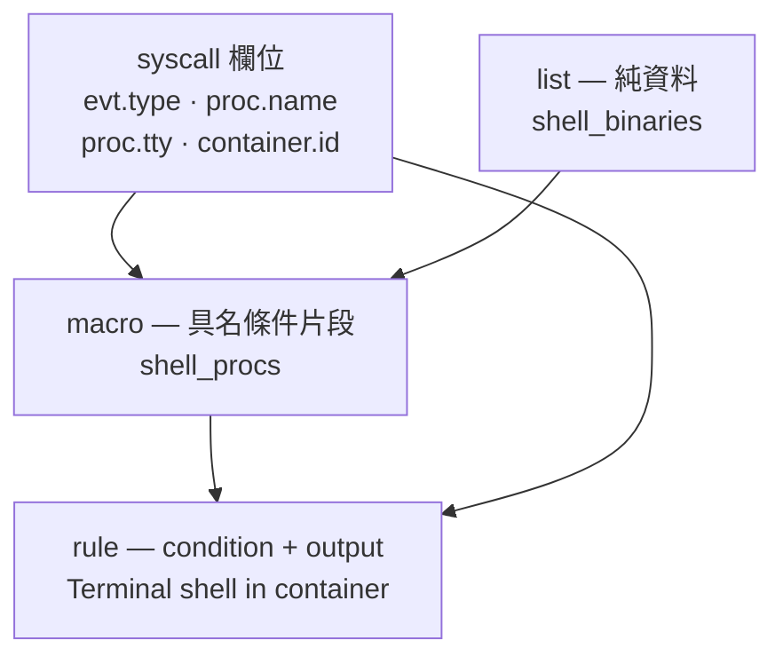

# Day 3: 裝上 Falco,讀懂它預設帶的規則

{ align=right width="95" }

> Day 2 的過濾器要人架、要人看、要人比對,而且一次只認一顆 pod。今天換上一個常駐元件:同樣是 syscall 那一層的事件,但容器身分由執行期提供、規則寫成檔案、輸出送得出節點。裝完之後最重要的事不是看它報什麼,是先讀懂它憑什麼報——規則語言看不懂,就不知道自己買到了多寬的保障。

!!! abstract "你在課程的哪裡"
    - **Day 0–2**:知道 eBPF 程式怎麼掛進核心、會用 bpftrace 追 syscall,也會把核心事件裡的 cgroup id 換算回 pod 名字,並替一顆 pod 手工建立行為基線。
    - **今天**:在叢集上裝 Falco,拆解一條預設規則的完整結構,觸發它並指出告警裡哪個欄位認出了 pod;然後把同樣的偏離動作拿去跟 Day 2 的手工基線對打。
    - **Day 4**:今天會找到預設規則的兩個具體空白,下一章自己寫規則把它們補起來。

## 常駐元件與隨用工具,差在哪裡

Day 2 結尾列過手工做法辦不到的七件事。今天要關掉的是其中四件——沒有持久化、沒有告警、沒有規則語言、必須剛好在看。Falco 用一個 DaemonSet 換掉這四件:每顆節點一份、全時間執行、規則寫在檔案裡、告警印到標準輸出。

代價也很具體。Day 2 那套是「要用的時候才進去跑」,不用的時候成本是零;Falco 是常駐的,節點上每一個 `execve` 都要進使用者空間比對規則,不管最後報不報警。這筆帳步驟 6 會量出實際數字。

今天走六步:

| 步驟 | 做什麼 | 為什麼排在這 |
|---|---|---|
| 1 | 選 driver | 選錯的話後面全部白做,而預設值不會告訴你它選了什麼 |
| 2 | 安裝 | 要先知道它裝出了哪些東西,才知道出事時該看哪一個 |
| 3 | 讀預設規則 | **今天的重心**;讀不懂規則語言,Day 4 寫不出規則 |
| 4 | 觸發一條規則 | 驗收:告警裡哪個欄位認出了 pod |
| 5 | 跟 Day 2 的基線對打 | 同樣的偏離動作,兩種方法各抓到什麼 |
| 6 | 量噪音與資源 | 「裝一下 Falco」實際上要付什麼 |

## 步驟 1: 選 driver,而且不要讓它自己決定

Falco 需要一個 driver 把 syscall 事件從核心送到使用者空間。三個選項,受管的 AKS 節點上只有一個走得通:

| driver | 怎麼運作 | 在受管節點上 |
|---|---|---|
| `kmod` | 載入一個 out-of-tree 核心模組 | 不可行——節點映像不讓你插自己的模組 |
| `ebpf`(legacy) | 安裝時在節點上現場編譯 eBPF probe | 要對著節點的 GLIBC 編,節點映像換版就可能編不出來 |
| `modern_ebpf` | CO-RE:一份預先編好的 probe,靠 BTF 在載入時自我重定位 | 可行——[Day 0](sprint2-day0-ebpf-concepts.md) 已經確認節點有 BTF |

Helm chart 的預設值是 `kind: auto`。auto 的問題不在於它一定選錯,而在於**它選了什麼要事後才知道**。所以把它釘死:

```bash
cat > falco-values.yaml <<'EOF'
driver:
  enabled: true
  kind: modern_ebpf

# Without a tty, Falco's stdout is block-buffered and alerts sit in the buffer.
tty: true

# The lab node pool is Spot and carries a NoSchedule taint; the chart's default
# tolerations only cover control-plane nodes.
tolerations:
  - key: kubernetes.azure.com/scalesetpriority
    operator: Equal
    value: spot
    effect: NoSchedule
EOF
```

第三項不加會怎樣值得先說:DaemonSet 會**安安靜靜地只跑在沒有 taint 的節點上**,`kubectl get ds` 顯示 `DESIRED 1 / READY 1`,看起來完全健康——而你要觀察的那幾顆節點上根本沒有 Falco。這種失敗不報錯,只會讓實驗一直沒有資料。

## 步驟 2: 安裝,以及它到底裝出了什麼

```console
$ helm repo add falcosecurity https://falcosecurity.github.io/charts && helm repo update
$ helm install falco falcosecurity/falco --version 9.1.0 \
      -n falco --create-namespace -f falco-values.yaml --wait --timeout 8m
NAME: falco
STATUS: deployed
CHART: falco-9.1.0
APP VERSION: 0.44.1
```

30 秒從指令到 `--wait` 返回。裝出來的是一個 DaemonSet,每個 pod 三個容器:

```console
$ kubectl -n falco get ds falco -o wide
NAME    DESIRED   CURRENT   READY   CONTAINERS                       IMAGES
falco   3         3         3       falco,falcoctl-artifact-follow   falcosecurity/falco:0.44.1,
                                                                     falcosecurity/falcoctl:0.13.0
```

| 容器 | 角色 |
|---|---|
| `falcoctl-artifact-install`(init) | 開機前把規則檔與 plugin 從 OCI registry 拉下來,放進 emptyDir |
| `falco` | 本體:載入 eBPF probe、讀規則、比對事件、吐告警 |
| `falcoctl-artifact-follow`(sidecar) | 常駐盯著 registry,規則有新版就下載換上 |

**規則不在映像裡**,是開機時從 registry 拉的,而且會驗簽:

```console
$ kubectl -n falco logs -l app.kubernetes.io/name=falco -c falcoctl-artifact-install --tail=20
{"msg":"Artifact successfully installed","name":"ghcr.io/falcosecurity/rules/falco-rules:5",
 "digest":"sha256:36d143c0…","directory":"/rulesfiles","type":"rulesfile"}
{"msg":"Verifying signature for artifact","ref":"…/plugins/plugin/container@sha256:f3d531f3…"}
{"msg":"Signature successfully verified!"}
```

所以規則的版本是 `falco-rules:5`,跟 Falco 本體的 0.44.1 是**兩條獨立的版本線**。之後追查「為什麼這條規則沒報」的時候,要問的是規則版本,不是 Falco 版本。

### driver 的證據

`kind: modern_ebpf` 只是意圖,不是事實。事實要從 Falco 自己的啟動日誌拿:

```console
$ kubectl -n falco logs -l app.kubernetes.io/name=falco -c falco --tail=30
… Falco version: 0.44.1 (x86_64)
… Loaded plugin 'container@0.7.1' from file /usr/share/falco/plugins/libcontainer.so
… Loading rules from:
…    /etc/falco/falco_rules.yaml | schema validation: ok
… The chosen syscall buffer dimension is: 8388608 bytes (8 MBs)
… Opening 'syscall' source with modern BPF probe.        ← 這一行就是證據
… One ring buffer every '2' CPUs.
… [libs]: libpman: disabled BPF iterators (not running in the root PID namespace…)
```

第二個佐證是 Falco 自己算出來的最終設定檔——values 經過模板之後長什麼樣,看這個最準:

```console
$ kubectl -n falco exec <falco-pod> -c falco -- cat /etc/falco/falco.yaml
engine:
  kind: modern_ebpf
  modern_ebpf:
    buf_size_preset: 4
    cpus_for_each_buffer: 2
```

`buf_size_preset: 4` 對上日誌裡的 8 MB:**每兩顆 CPU 一個 ring buffer**,2 vCPU 的節點就是一個 8 MB 的環形緩衝區。這個數字決定事件洪峰時會不會掉事件。

最後那行 `disabled BPF iterators` 不是錯誤:Falco 跑在 pod 的 PID namespace 裡,所以放棄用 BPF iterator 掃既有行程表,改用 `/proc`。功能沒少,只是啟動時多花一點時間建表。

### 從安裝到第一筆告警

這個數字要分兩種問法回答,而且兩個答案差很多:

| 問法 | 本課環境 |
|---|---|
| `helm install` → 掛上 probe、開始比對事件 | **26 秒** |
| `helm install` → 日誌出現第一筆**告警** | **12 分 27 秒** |

第二個數字看起來很難看,其實是本章最好的消息:中間那 12 分鐘什麼都沒發生,因為預設規則集在正常運作的叢集上真的不叫。第一筆告警出現的時間,就是有人動手的時間。步驟 6 有完整量測。

## 步驟 3: 讀懂預設規則 {#step-3}

### 先數一數手上有幾條

```console
$ kubectl -n falco exec <falco-pod> -c falco -- ls -la /etc/falco/
-rw-r--r--  root     root      2909  falco.yaml
-rw-r--r--  nonroot  nonroot  63642  falco_rules.yaml
```

只有一個規則檔,63 KB。倒出來數(截至 2026-08,規則版本 `falco-rules:5`):

| 項目 | 數量 |
|---|---|
| `- rule:` | **25** |
| `- macro:` | **87** |
| `- list:` | **49** |
| `enabled: false` | 0(25 條全開) |
| maturity 標籤 | 25 條全部是 `maturity_stable` |

25 條的全貌:

```text
 1 Directory traversal monitored file read      14 Packet socket created in container
 2 Read sensitive file trusted after startup    15 Redirect STDOUT/STDIN to Network Connection in Container
 3 Read sensitive file untrusted                16 Linux Kernel Module Injection Detected
 4 Run shell untrusted                          17 Debugfs Launched in Privileged Container
 5 System user interactive                      18 Detect release_agent File Container Escapes
 6 Terminal shell in container                  19 PTRACE attached to process
 7 Contact K8S API Server From Container        20 PTRACE anti-debug attempt
 8 Netcat Remote Code Execution in Container    21 Find AWS Credentials
 9 Search Private Keys or Passwords             22 Execution from /dev/shm
10 Clear Log Activities                         23 Drop and execute new binary in container
11 Remove Bulk Data from Disk                   24 Disallowed SSH Connection Non Standard Port
12 Create Symlink Over Sensitive Files          25 Fileless execution via memfd_create
13 Create Hardlink Over Sensitive Files
```

優先級分布是 CRITICAL 3、WARNING 11、NOTICE 7、INFO 1。

25 這個數字為什麼重要,見[地雷 2](#mine-2)。更值得先看的是這 25 條的**取捨形狀**:全部都在描述**已知的攻擊手法**——載入核心模組、`release_agent` 容器逃逸、`memfd_create` 無檔案執行、翻找私鑰、清日誌。沒有一條在管「這個容器今天做了以前沒做過的事」。那正是 Day 2 手工基線在做的事,而 Falco 預設不做。步驟 5 會把這件事量出來。

### 完整解剖一條規則

拿等一下要觸發的那條。以下逐字取自執行中容器裡的 `/etc/falco/falco_rules.yaml`:

```yaml
- rule: Terminal shell in container
  desc: >
    A shell was used as the entrypoint/exec point into a container with an attached terminal.
    Parent process may have legitimately already exited and be null (read container_entrypoint macro).
    Common when using "kubectl exec" in Kubernetes. …
  condition: >
    spawned_process
    and container
    and shell_procs
    and proc.tty != 0
    and container_entrypoint
    and not user_expected_terminal_shell_in_container_conditions
  output: A shell was spawned in a container with an attached terminal |
    evt_type=%evt.type user=%user.name user_uid=%user.uid user_loginuid=%user.loginuid
    process=%proc.name proc_exepath=%proc.exepath parent=%proc.pname command=%proc.cmdline
    terminal=%proc.tty exe_flags=%evt.arg.flags
  priority: NOTICE
  tags: [maturity_stable, container, shell, mitre_execution, T1059]
```

五個欄位各有各的角色:

| 欄位 | 角色 |
|---|---|
| `condition` | **要不要報**。一個布林運算式,欄位取自當下這個事件 |
| `output` | **報什麼**。`%` 開頭的都是欄位取值,事件發生時填入 |
| `priority` | **多嚴重**。決定 Falco 要不要輸出,以及下游怎麼路由 |
| `tags` | **怎麼分類**。這裡同時帶了成熟度、作用範圍與 MITRE ATT&CK 對應 |
| `desc` | 給人看的。這條的 `desc` 特別值得讀——它自己就寫明了 `container_entrypoint` 這個坑 |

### condition 怎麼一路收斂到 syscall 欄位

`condition` 裡的五個名字沒有一個是欄位,全是 macro。把它們展開:

```yaml
- macro: spawned_process
  condition: (evt.type in (execve, execveat))

- macro: container
  condition: (container.id != host)

- macro: shell_procs
  condition: (proc.name in (shell_binaries))
- list: shell_binaries
  items: [ash, bash, csh, ksh, sh, tcsh, zsh, dash]

- macro: container_entrypoint
  condition: (not proc.pname exists or proc.pname in (runc:[0:PARENT], runc:[1:CHILD], runc,
              docker-runc, exe, docker-runc-cur, containerd-shim, systemd, crio, conmon))

- macro: user_expected_terminal_shell_in_container_conditions
  condition: (never_true)
- macro: never_true
  condition: (evt.num=0)
```

展開後的完整條件是這樣:

```text
evt.type in (execve, execveat)                       ← 有人執行了一支新的執行檔
and container.id != host                             ← 而且是在某個容器裡
and proc.name in (ash,bash,csh,ksh,sh,tcsh,zsh,dash) ← 被執行的是 shell
and proc.tty != 0                                    ← 而且接著一個終端機
and (not proc.pname exists or proc.pname in (runc, containerd-shim, …))
                                                     ← 而且它的父行程是容器執行期
and not (evt.num = 0)                                ← 使用者自訂例外(預設永不成立)
```

三層結構,這是整個 Falco 規則語言的形狀:



`list` 是純資料(不含邏輯),`macro` 是具名的條件片段(可以互相引用),`rule` 是最終判斷。87 個 macro 對 25 條 rule,比例接近 3.5 比 1——**Falco 的規則庫主要不是規則,是為了讓規則讀得懂而存在的字彙表**。

至於欄位本身,來源分成兩類,這個區分在 Day 4 寫規則時很要緊:

| 欄位家族 | 從哪來 | 例子 |
|---|---|---|
| `evt.*` / `proc.*` / `fd.*` / `user.*` | **核心事件本身**,probe 直接送上來 | `evt.type=execve`、`proc.tty=34816`、`fd.name=/etc/shadow` |
| `container.*` / `k8s.*` | **container plugin 事後查出來的**,靠行程的 cgroup 反查容器執行期 | `container.id`、`k8s.pod.name` |

[Day 2](sprint2-day2-bpftrace-kubernetes.md) 是自己動手做第二類:`cgroup` builtin 拿到 inode、`find -inum` 找出路徑、從路徑裡挖出 container id 與 pod uid、`crictl inspect` 換成 pod 名字。Falco 把這整條鏈包成了 `container@0.7.1` 這個 plugin,結果就是 `output` 裡的一個 `%container.id`。

這也預告了它的極限:**第二類欄位仍然是靠 cgroup 查出來的,所以 [Day 2 的地雷 2](sprint2-day2-bpftrace-kubernetes.md#mine-2)(`nsenter` 換的是命名空間,不是 cgroup)在 Falco 身上同樣成立。** 步驟 5 會驗這件事。

而 `proc.tty != 0` 這一行預告了另一件事:它讓「有沒有終端機」變成報不報警的分水嶺,而終端機是**呼叫端**決定的。這變成[地雷 3](#mine-3)。

## 步驟 4: 觸發第一條規則

部署一顆被觀察的 pod。這裡沿用 [Day 2](sprint2-day2-bpftrace-kubernetes.md) 的 `baseline-nginx`,兩章比的才是同一個東西:

```bash
kubectl create namespace ebpf-lab
cat > baseline-nginx.yaml <<'EOF'
apiVersion: v1
kind: Pod
metadata:
  name: baseline-nginx
  namespace: ebpf-lab
spec:
  containers:
    - name: nginx
      image: mcr.microsoft.com/mirror/docker/library/nginx:1.25
      resources:
        requests:
          cpu: 20m
          memory: 32Mi
EOF
kubectl apply -f baseline-nginx.yaml
```

接著開一個帶終端機的 shell,再讀一次 `/etc/shadow`:

```console
$ script -q /dev/null kubectl -n ebpf-lab exec -it baseline-nginx -- bash -c 'echo "tty=$(tty)"; id'
tty=/dev/pts/0
uid=0(root) gid=0(root) groups=0(root)

$ kubectl -n ebpf-lab exec baseline-nginx -- bash -c 'cat /etc/shadow > /dev/null'
```

`script -q /dev/null` 那一層不是裝飾,拿掉就不會報——原因見[地雷 3](#mine-3)。

Falco 的輸出(JSON 版):

```json
{
  "time": "2026-08-06T10:25:54.090901419Z",
  "rule": "Terminal shell in container",
  "priority": "Notice",
  "source": "syscall",
  "hostname": "<node-a>",
  "tags": ["T1059","container","maturity_stable","mitre_execution","shell"],
  "output_fields": {
    "evt.type": "execve",
    "proc.name": "bash",
    "proc.exepath": "/usr/bin/bash",
    "proc.pname": "containerd-shim",
    "proc.cmdline": "bash -c echo \"tty=$(tty)\"; id",
    "proc.tty": 34816,
    "user.name": "root", "user.uid": 0, "user.loginuid": -1,
    "container.id": "0cee1cad9371",
    "container.name": "nginx",
    "container.image.repository": "mcr.microsoft.com/mirror/docker/library/nginx",
    "container.image.tag": "1.25",
    "k8s.pod.name": "baseline-nginx",
    "k8s.ns.name": "ebpf-lab"
  }
}
```

```json
{
  "time": "2026-08-06T10:25:54.539171208Z",
  "rule": "Read sensitive file untrusted",
  "priority": "Warning",
  "tags": ["T1555","container","filesystem","host","maturity_stable","mitre_credential_access"],
  "output_fields": {
    "evt.type": "openat",
    "fd.name": "/etc/shadow",
    "proc.name": "cat", "proc.pname": "bash", "proc.cmdline": "cat /etc/shadow",
    "proc.aname[2]": "containerd-shim", "proc.aname[3]": "systemd",
    "container.id": "0cee1cad9371", "k8s.pod.name": "baseline-nginx", "k8s.ns.name": "ebpf-lab"
  }
}
```

一個動作,兩條規則。每個欄位都對得回剛才做的事:

| 告警欄位 | 值 | 對應哪個動作 |
|---|---|---|
| `evt.type` | `execve` | `bash -c …` 這個執行動作本身 |
| `proc.name` / `proc.exepath` | `bash` / `/usr/bin/bash` | 執行的是 bash,命中 `shell_binaries` |
| `proc.cmdline` | `bash -c echo "tty=$(tty)"; id` | **逐字就是打進去的那一串** |
| `proc.tty` | `34816` | `script(1)` 配出來的 pty。34816 = 136×256+0,major 136、minor 0,對上容器裡 `tty` 回報的 `/dev/pts/0` |
| `proc.pname` | `containerd-shim` | `kubectl exec` 的行程是 containerd 生的,命中 `container_entrypoint` |
| `user.loginuid` | `-1` | **沒有互動式登入**——這是 `kubectl exec` 與「有人 SSH 進節點」最直接的區分訊號 |
| `fd.name` | `/etc/shadow` | 第二條規則抓到的那次 `openat` |
| `proc.aname[2]` / `[3]` | `containerd-shim` / `systemd` | 祖先鏈,往上兩層與三層 |

**認出 pod 的是這四個欄位**:

```text
container.id   = 0cee1cad9371      ← container plugin 從行程的 cgroup 反查出來的
container.name = nginx             ← pod spec 裡的容器名
k8s.pod.name   = baseline-nginx    ← pod 名字
k8s.ns.name    = ebpf-lab          ← namespace
```

而 `hostname` 指出是哪顆節點上的 Falco 報的。**pod 身分是 Falco 自己查的**——從頭到尾沒有告訴過它任何 pod 的名字。Day 2 走五個步驟的那條鏈子,在這裡是一次 plugin 呼叫。

順帶收一個 Day 2 的伏筆:[Day 2 的地雷 7](sprint2-day2-bpftrace-kubernetes.md#mine-7) 發現 `kubectl exec` 起的 bash,`execve` 事件裡的 `comm` 是**舊**行程的名字 `runc:[2:INIT]`。Falco 用的是 `proc.name`(新行程的名字)與 `proc.pname`(父行程),**避開了那顆地雷**。規則語言把「哪個欄位在什麼時候可信」這件事替你決定好了,這是規則引擎相對於手寫探針的價值之一。

## 步驟 5: 跟 Day 2 的手工基線正面對照

同樣四個偏離動作,Day 2 用 bpftrace 加手刻基線比對,今天用 Falco 預設規則。

| 偏離動作 | Day 2 手工基線 | Falco 0.44.1 預設規則 |
|---|---|---|
| 容器內開互動式 shell | 抓到 | 抓到,具名 `Terminal shell in container` |
| 讀 `/etc/shadow` | 抓到 | 抓到,具名 `Read sensitive file untrusted` |
| 對 8.8.8.8:53 建立連線 | 抓到 | **沒報** |
| 經 `nsenter` 進容器做同樣的事 | **一筆都沒有** | 有報,但指向錯的 pod |

前兩列 Falco 完勝,而且勝在**說得出名字**。Day 2 的產出是「多了一個沒見過的檔案 `/etc/shadow`」,需要人去判斷這是不是壞事;Falco 的產出是「`Read sensitive file untrusted`,MITRE T1555,credential access」——分類、嚴重度、對應的攻擊技法都是現成的。

後兩列才是今天的重點,分別是[地雷 4](#mine-4) 與[地雷 5](#mine-5)。

### 兩種偵測哲學

第三列那個「沒報」不是漏抓,是設計。回頭看 25 條規則,跟網路有關的只有三條:連 API server、netcat 反向 shell、非標準埠的 SSH——**三條都在描述具體的已知手法,沒有一條在描述「這個容器以前沒連過這裡」**。

| | 抓什麼 | 誤報 | 漏抓 | 要維護什麼 |
|---|---|---|---|---|
| **基線比對**(Day 2) | 沒見過的行為 | 高 | 低,但只在抓過基線的那顆 pod 上 | 每個工作負載一份基線,改版就要重抓 |
| **規則引擎**(Day 3) | 已知壞的行為 | 低 | **高——沒寫規則的事一律看不見** | 規則庫,但可以全叢集共用 |

Day 2 列的七件缺失裡,「基線沒有『允許但罕見』的概念」這一件 **Falco 沒有關掉,而且方向相反**:Falco 連「罕見」這個概念都沒有,它只有「這件事在不在清單上」。**兩種方法互補而不互相取代**,這是今天最該帶走的一句話,也是 Day 4 要動手寫規則的理由。

## 步驟 6: 噪音與資源的真實數字

### 閒置告警率

量測窗口 **8 分 28 秒**,三顆節點(其中一顆跑著 Sprint 1 完整的 KAI、HAMi、Prometheus 堆疊),期間沒有任何人為動作:

```console
$ ./falco-alerts.sh | wc -l
0
```

**0 筆。** 整場實驗(約 15 分鐘、三顆節點)的全部告警是:

```console
$ ./falco-alerts.sh --rules
   4 Terminal shell in container
   2 Read sensitive file untrusted
```

6 筆,每一筆都對得上一個明確的人為動作,沒有一筆是背景噪音。

抽告警的腳本很短,後面幾章都會用到:

```bash
cat > falco-alerts.sh <<'EOF'
#!/usr/bin/env bash
# Pull JSON alerts out of every Falco pod's stdout.
#   --rules   histogram by rule name instead of raw lines
#   --since   passed straight to kubectl logs (default 1h)
set -euo pipefail
SINCE=1h; MODE=raw
while [ $# -gt 0 ]; do
  case "$1" in
    --rules) MODE=rules ;;
    --since) SINCE="$2"; shift ;;
  esac
  shift
done
LINES=$(kubectl -n falco logs -l app.kubernetes.io/name=falco -c falco \
          --since="$SINCE" --prefix=false 2>/dev/null | grep '"rule"' || true)
if [ "$MODE" = rules ]; then
  echo "$LINES" | sed -n 's/.*"rule":"\([^"]*\)".*/\1/p' | sort | uniq -c | sort -rn
else
  echo "$LINES"
fi
EOF
chmod +x falco-alerts.sh
```

這個數字的適用範圍要老實講:**15 分鐘、三顆節點、工作負載很單純的實驗室叢集,不能外推到生產環境。** 真實叢集會有 CI 跑腳本、備份工具讀檔案、健康檢查開 shell。`Run shell untrusted` 的 `desc` 自己就寫了 "This rule can be noisier… Allocate time to tune this rule",光是它的排除清單就佔了規則檔三十幾行。

但這個數字仍然推翻了一個具體的誤解:**「Falco 一裝下去就淹沒在告警裡」對預設的 25 條 stable 規則不成立**,那個名聲屬於另外幾套要自己加裝的規則集。

### 資源:實測與保留

`kubectl top` 每兩分鐘取樣一次,跨越整個閒置窗口:

| | CPU | 記憶體 |
|---|---|---|
| chart `requests` | 100m | 512Mi |
| chart `limits` | 1000m | 1Gi |
| **實測(閒置)** | **14–24m** | **84–90Mi**(含 sidecar 約 110Mi) |
| 超額倍數 | 約 4–7 倍 | 約 5–6 倍 |

兩個方向的觀察:

- **CPU 隨節點忙碌程度走。** 跑著 Sprint 1 整套東西的那顆節點,Falco 用量穩定比閒置節點高 50% 到 100%。這很合理——Falco 的工作量正比於節點上發生的 syscall 數量,跟有沒有告警無關。**沒有告警不等於沒有成本**,每一個 `execve` 都要進使用者空間比對 25 條規則。
- **記憶體幾乎不動。** 全程平坦,因為主要是 ring buffer(8 MB)與行程表這些預先配置好的結構。

換算到規模:一座 100 節點的叢集,Falco 預設會**保留** 10 vCPU 與 51.2 GB 記憶體,實際用掉大約 2 vCPU 與 11 GB。這就是「裝一下 Falco」的真實帳單,而它跟 Day 2 那種「要用的時候才進去跑 bpftrace」的隨用做法是完全不同量級的承諾。反過來說,Day 2 那套的成本是**人的注意力**——必須剛好在看——那個成本才是真正貴的。

## 誠實的差距

- **閒置零告警不能外推。** 那是 15 分鐘、三顆節點、工作負載很單純的實驗室數字。真實叢集的 CI、備份、健康檢查都會踩到 `Read sensitive file untrusted` 與 `Run shell untrusted`。
- **k8saudit 不在本章範圍。** Falco 除了 syscall 之外還能吃 Kubernetes 稽核日誌,但受管的 AKS 沒有本機稽核日誌,官方路徑要接 Event Hub 加 Storage Account,是實打實的常駐費用。本課只教 syscall 規則。
- **提高 priority 的效果沒有實測。** [地雷 1](#mine-1) 的結論是「priority 不會變出 CPU」,那是從節點的可配置資源推出來的;把 Falco 設成 `system-node-critical` 之後誰被踢掉,沒有實際做過——因為代價是 Sprint 1 的元件。
- **只驗了一種 driver。** `kmod` 與 legacy `ebpf` 在受管節點上走不通的說法來自官方文件與節點映像的限制,沒有實際驗證。

## 驗收 checkpoint

| 驗證 | 判準 | 本課環境的結果 |
|---|---|---|
| driver 真的是 modern eBPF | Falco 啟動日誌出現 `Opening 'syscall' source with modern BPF probe.`,且容器內 `falco.yaml` 的 `engine.kind` 是 `modern_ebpf` | 兩項都成立 |
| DaemonSet 覆蓋到所有目標節點 | `kubectl get ds falco` 的 DESIRED 等於節點數,不是 1 | DESIRED 3 / READY 3 |
| 規則載入無誤 | 啟動日誌每一個規則檔後面都跟著 `schema validation: ok` | `falco_rules.yaml \| schema validation: ok` |
| **規則命中並指名 pod** | 告警的 `rule` 是具名規則,且 `k8s.pod.name` 等於被操作的那顆 pod | `Terminal shell in container` + `Read sensitive file untrusted`,兩筆都是 `baseline-nginx` |
| 預設規則集的實際規模 | 數 `- rule:` 的出現次數 | 25 條(87 macro / 49 list) |
| 閒置噪音 | 無人操作的窗口內告警數 | 8 分 28 秒 × 3 節點 = 0 筆 |

## 地雷記錄

### 地雷 1:chart 不設 priorityClass,Falco 在滿載節點上是第一個被踢的 {#mine-1}

裝完 40 秒後,某顆節點上的 Falco pod 不見了:

```console
$ kubectl -n falco get events --sort-by=.lastTimestamp
Normal    Preempted          pod/falco-d82mq   Preempted by pod c240c0d4-… on node <node-system>
Normal    Killing            pod/falco-d82mq   Stopping container falco
Warning   FailedScheduling   pod/falco-jl5kz   0/3 nodes are available: 1 Insufficient cpu,
                                               2 node(s) didn't satisfy plugin(s) [NodeAffinity]
```

**根因**是兩件事疊起來。第一,那顆節點的可配置 CPU 已經被吃掉 99%:

```console
$ kubectl describe node <node-system>
Allocatable:  cpu: 1900m
Allocated resources:
  cpu     1885m (99%)
```

第二,**誰該讓位是 priority 決定的**,而 Falco chart 預設不設 `priorityClassName`:

```console
$ kubectl get pods -A --field-selector spec.nodeName=<node-system> \
    -o 'custom-columns=NAME:.metadata.name,PRIO:.spec.priorityClassName,PVAL:.spec.priority'
NAME                        PRIO                   PVAL
falco-jl5kz                 <none>                 0            ← Falco
coredns-648978f94d-5nzrt    system-node-critical   2000001000
csi-azuredisk-node-hvn8c    system-node-critical   2000001000
…
```

priority 0 比每一個系統元件都低,在滿載的節點上它是搶佔演算法第一個挑中的犧牲者。

**這次的破洞是 55 秒**(搶佔它的那顆 pod 跑完就走)。但要看清楚這個失敗的形狀:**破洞剛好開在整座叢集最忙、最該被監控的那顆節點上**,而 `kubectl get ds falco` 在事發當下顯示 `DESIRED 3 CURRENT 3 READY 3`——DaemonSet 的健康指標不會告訴你有一顆節點斷了監控。

**修法**沒有漂亮的:提高 priority 不會變出 CPU,只是換一個受害者——在這座叢集上把 Falco 設成 `system-node-critical`,代價是踢掉 KAI 或 HAMi 的元件。誠實的結論是**這顆節點的規格不夠跑 Falco**。「每個節點多 100m CPU、512Mi 記憶體」聽起來很少,但在 2 vCPU 的節點上那是全部容量的 5%,而且是保留量不是用量([地雷 7](#mine-7))。

### 地雷 2:預設只有 25 條規則,而規則版本是另一條版本線 {#mine-2}

**症狀**:寫好一個測試動作、確信 Falco 應該要報,結果什麼都沒有,於是開始懷疑安裝壞了。

**根因**:Falco 的規則走成熟度分級(stable、incubating、sandbox),**預設只裝 stable 這 25 條**,其餘要另外 `falcoctl artifact install`。絕大多數「Falco 沒報」的情況,只是它沒有那條規則。

再往下一層:規則的版本(`falco-rules:5`)跟 Falco 本體的版本(0.44.1)是**兩條獨立的版本線**,由 init 容器從 OCI registry 拉取。升級 Falco 不等於升級規則,反之亦然。

**修法**:先確認手上有哪些規則,再判斷是不是 Falco 的問題:

```console
$ kubectl -n falco exec <falco-pod> -c falco -- \
    grep -c '^- rule:' /etc/falco/falco_rules.yaml
25
```

### 地雷 3:`kubectl exec -t` 配不到終端機,規則就靜靜地不報 {#mine-3}

**症狀**:用看起來很合理的寫法觸發,零告警。

```console
$ kubectl -n ebpf-lab exec -t baseline-nginx -- bash -c 'id; hostname'
uid=0(root) gid=0(root) groups=0(root)
baseline-nginx
```

指令成功、bash 確實在容器裡執行了,Falco 一筆都沒有。

**根因**不在 Falco。直接去問終端機:

```console
$ kubectl -n ebpf-lab exec -t baseline-nginx -- bash -c 'echo "tty=$(tty)"'
tty=not a tty                      ← -t 沒有生效
```

`kubectl` 的 TTY 是 `-i` 與 `-t` **一起**才會協商成功的:`-t` 要求配置終端機,但 kubectl 需要 client 端的 stdin 本身是終端機才會把這個要求送出去。腳本、CI、自動化工具的 stdin 都不是終端機,於是 `-t` 被靜靜地降級。`proc.tty` 保持 0,規則 `condition` 的第四行不成立,不報——**而且沒有任何一行日誌說明發生了這件事**。

**修法**:在本機先包一層 pty,`-it` 才有東西可協商。

```console
$ script -q /dev/null kubectl -n ebpf-lab exec -it baseline-nginx -- bash -c 'echo "tty=$(tty)"'
tty=/dev/pts/0
```

**教訓**:這顆地雷的殺傷力在方向——它讓「規則沒報」看起來像 Falco 的問題,其實是觸發方式的問題。照文件寫自動化測試來驗證 Falco 裝好沒的人都會踩到,然後得出「Falco 不可靠」的結論,而 Falco 從頭到尾都是對的。反過來也要記住:**真人在終端機打 `kubectl exec -it` 一定會被抓,腳本裡的 `exec` 不會。**

### 地雷 4:預設規則沒有任何一條在管「新的對外連線」 {#mine-4}

**症狀**:從容器連一個沒連過的位址,連線成功,Falco 零告警。

```console
$ kubectl -n ebpf-lab exec baseline-nginx -- bash -c 'exec 3<>/dev/tcp/8.8.8.8/53 && echo connect-ok'
connect-ok

$ ./falco-alerts.sh --since 20s --rules
（空）
```

**根因**:這不是漏抓,是規則集的取捨。25 條裡跟網路有關的三條(`Contact K8S API Server From Container`、`Netcat Remote Code Execution in Container`、`Disallowed SSH Connection Non Standard Port`)**全都在描述具體的已知手法**,沒有一條在描述「這個容器以前沒連過這裡」。而 Day 2 的手工基線抓得到,因為基線的本質就是「沒見過」。

**修法**:規則引擎只看得見寫進規則的事,所以缺的規則要自己寫——[Day 4](sprint2-day4-falco-custom-rules.md) 補的就是這個洞。

### 地雷 5:`nsenter` 進容器,Falco 看得見但認錯 pod {#mine-5}

**症狀**:從一個特權 pod 用 `nsenter` 進到目標容器裡讀敏感檔,Falco 有報,但告警指向的是**呼叫端**。

```console
$ script -q /dev/null kubectl -n ebpf-lab exec -it <privileged-pod> -- \
      nsenter -t <nginx-pid> -m -u -i -n -p /bin/bash -c 'hostname; cat /etc/shadow > /dev/null'
baseline-nginx           ← hostname 回報的是 nginx 容器
```

```text
Warning  Read sensitive file untrusted
    file=/etc/shadow  proc=cat  pname=bash
    k8s.pod.name  = <privileged-pod>     ← 呼叫端的 pod
    container.name = probe               ← 呼叫端的容器
```

**兩件事同時為真。** 第一,**Falco 看見了**——[Day 2 那次是徹底的零筆](sprint2-day2-bpftrace-kubernetes.md#mine-2),Falco 至少報了一條。來源是架構差異:bpftrace 那套把過濾器掛在 pod 的 cgroup 上(在核心裡就過濾掉,所以省),Falco 收全節點的事件再到使用者空間比對(所以貴)。**只要事件不需要事先指定範圍,就沒有「範圍外」可以躲。**

第二,**但它認錯了 pod**。根因就是[步驟 3](#step-3) 埋的伏筆:`container.*` 與 `k8s.*` 不是核心事件帶上來的,是 container plugin 用行程的 cgroup 反查的,而 `nsenter` 換的是命名空間、不換 cgroup。行程的 cgroup 仍屬於特權 pod,所以查出來就是特權 pod。

**後果很具體**:告警指向的是攻擊的發起端,不是受害端。調查員照著 `k8s.pod.name` 去看,會看到一個什麼都沒有的容器,而真正被翻的那顆 pod 在告警裡完全沒出現。

好消息是**訊號沒有消失,只是被貼錯標籤**——`proc.name`、`pname`、`fd.name` 全都在,而且「一個特權容器裡冒出 `nsenter`」本身就是極強的指標。預設 25 條沒有任何一條在看 `nsenter`。

### 地雷 6:`container_entrypoint` 讓 shell 規則只抓得到第一層 {#mine-6}

**症狀**:同一次 `kubectl exec` 裡發生兩次 `bash` 的 `execve`,Falco 只報一筆。

**根因**:`Terminal shell in container` 的 `condition` 第五行是 `container_entrypoint`,展開後要求 `proc.pname` 是 runc、containerd-shim、conmon 這類容器執行期行程。字面意思是:**只有容器執行期直接生出來的 shell 才算數。**

驗證這件事有一個陷阱要先繞開。用巢狀 `bash -c` 測會得到「兩筆都報」的假答案:

```console
$ script -q /dev/null kubectl exec -it baseline-nginx -- bash -c 'bash -c "echo inner-shell-ran"'
Terminal shell in container   proc=bash pname=runc              cmd=bash -c bash -c "echo inner-shell-ran"
Terminal shell in container   proc=bash pname=containerd-shim   cmd=bash -c echo inner-shell-ran
```

**這個實驗是無效的**:`bash -c '<單一指令>'` 會被 bash 的 implicit exec 最佳化掉,外層 bash 直接 `execve` 成內層 bash 而不是 fork,所以內層的父行程仍然是容器執行期行程。要真的 fork,加一個 `&`:

```console
$ script -q /dev/null kubectl exec -it baseline-nginx -- \
      bash -c 'bash -c "echo forked-shell-ran" & wait; echo done'
forked-shell-ran
done

$ ./falco-alerts.sh --since 25s
Terminal shell in container   proc=bash pname=runc   cmd=bash -c bash -c "echo forked-shell-ran" & wait; echo done
--- 1 alert(s); 2 bash execve happened ---
```

**兩次 `execve`,一筆告警。** 被 fork 出來的那個 shell,父行程是 bash(不在 `container_entrypoint` 的名單裡),規則不成立。

另一條 shell 規則 `Run shell untrusted` 補不上這個洞,它自己也把這種情況排除掉了:

```yaml
  condition: >
    spawned_process and shell_procs and proc.pname exists
    and protected_shell_spawner                        ← 父行程要在特定應用程式清單裡
    and not proc.pname in (shell_binaries, …)          ← shell 生 shell 明確排除
```

**後果**:`kubectl exec` 進去會被抓,但那是攻擊者最不需要用的路徑。真正的入侵路徑——web shell、被入侵的 entrypoint、任何已經取得容器內執行權的東西——再開 shell 時,這條規則一筆都不會報。前面 `nsenter` 那次沒觸發這條規則也是同一個原因,它的 `proc.pname` 是 `nsenter`。

**這不是 bug**。`desc` 裡 Falco 自己就寫了 "Parent process may have legitimately already exited and be null (read container_entrypoint macro)",而且建議這條規則與其當作獨立規則,不如當作稽核用的通用規則,配合同容器、同 tty 的其他告警一起看。這是為了壓低誤報而刻意收窄的條件——**規則引擎的偵測範圍就是 `condition` 那幾行字,不多也不少。**

### 地雷 7:那個 request 不是用量,是保留量 {#mine-7}

**症狀**:節點看起來還有餘力(實際 CPU 用量不高),Falco 卻排不進去。

**根因**:**Kubernetes 排程看的是 `requests`,不是實際用量。** Falco 實際只用 14m,但它向排程器要 100m;節點只剩十幾 m 可配置,於是排不進去、被搶佔。這就是[地雷 1](#mine-1) 的直接成因。

**修法與代價**:把 request 調成貼近實測(例如 50m)在這座叢集上就排得進去,但代價是事件洪峰時 Falco 沒有 CPU 餘裕,可能開始掉事件——`buf_size_preset: 4` 的 8 MB ring buffer 滿了就丟。這是一個要按叢集情況判斷的取捨,不是有標準答案的設定。

## 帶得走的東西

- **規則引擎的偵測範圍,就是 `condition` 那幾行字,不多也不少。** 讀不懂規則語言的人,不知道自己買到的保障有多寬——`Terminal shell in container` 看起來在管「容器裡有人開 shell」,實際上只管「容器執行期直接生的、帶終端機的第一層 shell」,而那個限制就寫在條件的第四、五行。
- **基線抓「沒見過」,規則抓「已知壞」,兩者互補而不互相取代。** 基線誤報高、要逐個工作負載維護,但抓得到你沒想到的事;規則誤報低、可全叢集共用,但沒寫規則的事一律看不見。真實的防守兩邊都要。
- **`container.*` 與 `k8s.*` 是查出來的,不是核心送上來的。** 這一個事實同時解釋了 Falco 的方便(pod 身分變成一個欄位)與它的極限(`nsenter` 會讓告警貼錯標籤)。凡是靠 cgroup 反查身分的工具,都繼承同一組限制。
- **「沒有告警」不等於「沒有成本」。** Falco 的 CPU 用量正比於節點上發生的 syscall 數量,跟報不報警無關。閒置零告警的那 8 分鐘裡,它一樣在每一個 `execve` 上比對 25 條規則。
- **DaemonSet 全綠不代表全節點都在監控。** 被搶佔的那 55 秒,`kubectl get ds` 從頭到尾顯示 READY 3/3。監控元件的健康,要用它自己的輸出來驗,不是用它的部署狀態。

## 延伸閱讀

想往下深挖,從這幾份開始:

- **[Falco 規則的三個基本元件](https://falco.org/docs/concepts/rules/basic-elements/)** —— 官方對 rule、macro、list 的定義,以及 `condition`／`output`／`priority`／`tags` 各自的角色,對得上步驟 3 的解剖。
- **[核心事件來源與 driver 選擇](https://falco.org/docs/concepts/event-sources/kernel/)** —— 說明 modern eBPF probe 需要 BTF 與 ring buffer 支援,以及它靠 CO-RE 免去逐核心版本編譯,正是步驟 1 釘死 `modern_ebpf` 的依據。
- **[預設規則清單與成熟度分級](https://falco.org/docs/reference/rules/default-rules/)** —— 官方明載「預設只載入 stable 規則」,incubating 與 sandbox 要另外安裝,這是地雷 2 的一手來源。
- **[事件與條件可用的欄位總表](https://falco.org/docs/reference/rules/supported-fields/)** —— 寫規則時查欄位名稱用;`evt.*`／`proc.*` 與 `container.*`／`k8s.*` 分屬不同來源,在這裡看得最清楚。
- **[Falco Helm chart 的參數表](https://github.com/falcosecurity/charts/tree/master/charts/falco)** —— `driver.kind` 預設 `auto`、`customRules` 的用法都在這份 README 的參數表裡,Day 4 會直接用到。

## 下一步

今天找到兩個具體的空白:預設規則不管「沒連過的對外連線」([地雷 4](#mine-4)),也抓不到「容器裡已經在跑的東西再開 shell」([地雷 6](#mine-6))。兩個都不是 bug,是規則寫死的取捨——而規則是可以自己寫的。[Day 4](sprint2-day4-falco-custom-rules.md) 用今天學到的 `list`、`macro`、`rule` 三層結構,一條一條把這兩個洞補起來,然後面對寫規則真正困難的部分:誤報,以及調校誤報要付出的偵測力。

---

!!! quote ""
    Falco 標誌為 Falco 專案之官方資產(CNCF artwork),此處作社群教學用途。
