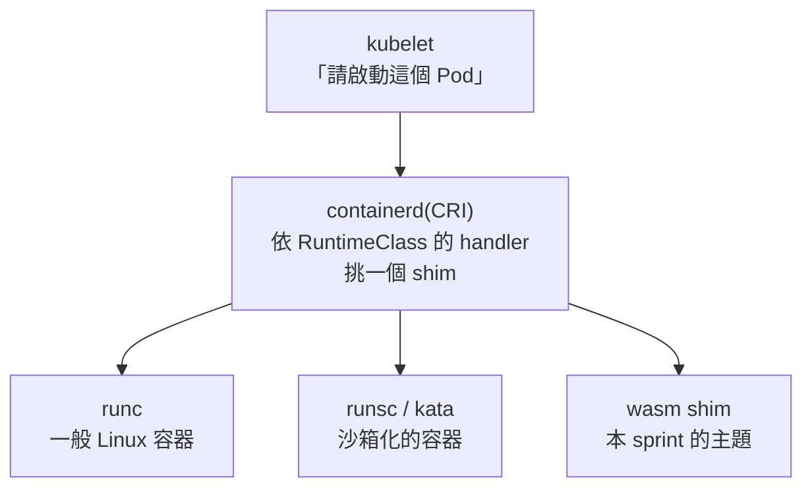

# Day 0: wasm 是什麼,以及為什麼它會出現在 Kubernetes 上

{ align=right width="95" }

> 這一章不裝任何東西,也不碰叢集,只回答兩個問題:WebAssembly 是什麼,以及 Kubernetes 用什麼機制執行它。第二個問題對維運與 SRE 比較有用——多數人不是沒聽過 wasm,而是把它當成應用開發那一側的技術,因此不會在規劃平台時考慮它。

!!! abstract "你在課程的哪裡"
    - **Sprint 1–2**:都在既有的執行模型裡優化——誰先拿到 GPU、誰能執行什麼 syscall、誰能連誰。前提始終是「工作負載是容器」。
    - **今天**:第一次動到那個前提。不碰叢集,只把兩件事講清楚:wasm 是什麼,以及 Kubernetes 用什麼機制執行它。
    - **Day 1**:把今天講的機制真的建出來,並實地驗證 Krustlet 與 WASI node pool 這兩條已退場的路,今天各是什麼狀態。

## 今天要走的路

三段,順序是刻意的:

| 段 | 回答什麼 | 給誰 |
|---|---|---|
| 一 | wasm 是什麼、為什麼會被發明 | 沒接觸過的人 |
| 二 | **Kubernetes 用什麼機制執行 wasm** | 維運與 SRE |
| 三 | 為什麼要費這個事,以及它現在不適合什麼 | 兩者 |

第二段是重點:知道 wasm 是什麼,跟知道它可以放進叢集,是兩件事。

## 一、wasm 是什麼

### 起點:瀏覽器裡的效能問題

事情的起點是一個很實際的問題:**網頁想跑重運算的東西,而 JavaScript 不夠快。** 早期的嘗試叫 asm.js——把 JavaScript 砍成一個嚴格的子集,讓引擎可以像編譯語言那樣最佳化它。能用,但終究是在用文字格式假裝自己是機器碼。

WebAssembly 把那個想法做成正式的東西。官方的定義只有一句:

> **一個以堆疊為基礎的虛擬機的二進位指令格式。**

而它的標準是在 W3C 的社群群組與工作群組裡制定的,參與者包含所有主要瀏覽器的代表。**這不是某一家的技術。**

### 第一個常見誤解:它不是一種語言

**沒有人「用 wasm 寫程式」。** 官方文件把它稱作「**可攜的編譯目標**」——你用 Rust、Go、C 寫,編譯成 wasm。

這件事跟 JVM bytecode 是同一種關係:沒有人用 bytecode 寫程式,大家寫 Java 或 Kotlin 然後編譯過去。**所以「要不要學 wasm」這個問題本身問錯了**,該問的是「我現有的程式編得成 wasm 嗎」。

### 第二個關鍵:它預設什麼都不能做

這一點是它後來能離開瀏覽器的主要原因。

瀏覽器不敢讓一個網頁隨便碰你的檔案系統。所以 wasm 從設計的第一天起,執行環境就是**記憶體安全的沙箱**,而且預設**沒有任何能力**:不能開檔、不能連網、連讀環境變數都不行——**除非宿主明確給它**。

換個角度說:**它不是後來補上沙箱的執行期,而是預設零能力、由宿主逐項授權的執行期。** 對要在多租戶叢集上執行他人程式碼的場景,這個預設值的方向是對的。

### WASI:把宿主從瀏覽器換成作業系統

沙箱與授權模型都在 wasm 本身,與宿主是誰無關。把宿主從瀏覽器換成作業系統,需要的是一組標準化的系統介面,那就是 **WASI(WebAssembly System Interface)**。

官方對它的描述把能力模型講得比 wasm 本身還清楚:

> WASI 應用執行在一個**能力式的沙箱**裡:一個 wasm 模組或元件**啟動時不具備任何環境權限,只能做宿主明確授予的事**。

所以 WASI 定義的東西不是「一堆 API」,而是「**宿主可以授予哪些能力,以及怎麼授予**」。而官方明說它的目標是**從瀏覽器到雲端到嵌入式裝置都能跑**。

### Component Model:跨語言的元件互通

最後一塊拼圖是讓不同語言編出來的 wasm 互相呼叫。官方把它定義成「一套用來建構可互通的 WebAssembly 函式庫、應用程式與環境的架構」,而它要解的問題是**互通與組合**——元件可以被組起來、被散佈,而且跨語言。

這一段後面不會深入,但它解釋了為什麼 Day 2 的 wasmCloud 會用「元件」而不是「應用程式」這個詞。

### 與 Sprint 2 的 eBPF 對照

[Sprint 2 Day 0](sprint2-day0-ebpf-concepts.md) 講 eBPF 的時候,用了一個比喻:**瀏覽器之於 JavaScript,就像核心之於 eBPF**——受限的執行環境,加上一組宿主開放的 API,程式不能直接碰宿主的記憶體。

wasm 這裡**不是比喻**。它就是那個瀏覽器沙箱本人,只是宿主從瀏覽器換成了作業系統。

**兩章並排,是同一個心智模型的兩個實例**:一個把受控執行環境放進核心,一個把它從瀏覽器搬到伺服器。

## 二、wasm 在 Kubernetes 上的執行路徑 {#step-2}

### 為什麼這個選項通常不會被考慮

如果你是維運或 SRE,你的心智模型大概是這樣的:

```text
工作負載 = 容器 = OCI 映像 + Linux 的命名空間與 cgroup
```

而 wasm 在這個模型裡沒有位置。它被歸到「瀏覽器的東西」或「某個語言的執行期」——**屬於應用開發那一側,不屬於基礎設施**。

**問題不在於沒聽過,而在於分類。** 被歸到應用開發那一側的東西,不會出現在平台選型的候選清單上。

所以再解釋一次 wasm 是什麼沒有用。要處理的是上面那個模型裡的一條假設。

### 工作負載不一定是 Linux 容器

> **Kubernetes 從來沒有規定工作負載必須是 Linux 容器。**

它規定的是:kubelet 透過 CRI 請容器執行期啟動一個東西。而在 containerd 那一層,**`runc` 只是眾多 shim 的其中一個**。

這件事在 Kubernetes 裡有一個正式的名字,叫 **RuntimeClass**,而且它**在 v1.20 就已經是 stable**——不是實驗功能,是你叢集裡現在就有的東西。

```yaml
apiVersion: node.k8s.io/v1
kind: RuntimeClass
metadata:
  name: myclass
handler: myconfiguration   # 對應到 CRI 那一側的設定名稱
```

那個 `handler` 對應到節點上 containerd 設定檔裡的一段。Kubernetes 官方文件寫的是這個路徑:

```text
[plugins."io.containerd.grpc.v1.cri".containerd.runtimes.${HANDLER_NAME}]
```

!!! warning "這個路徑會隨 containerd 大版本改變"
    上面那一行是 **containerd 1.x** 的 plugin ID,而多數教學文章沿用的也是它。containerd 2.x 把 CRI 拆成兩個 plugin,路徑變成 `io.containerd.cri.v1.runtime`。**貼錯不會報錯——containerd 會安靜忽略不認識的 plugin 設定**,而 Pod 端的症狀跟「shim 沒裝好」一模一樣。[Day 1](sprint3-day1-three-generations.md) 會在真實節點上把當前的路徑量出來。

整個機制就這三步:節點上宣告一個執行體、叢集裡宣告一個 RuntimeClass 指向它、pod 用 `runtimeClassName` 挑它。



### 同一個機制:gVisor 與 Kata Containers

Kubernetes 官方對 RuntimeClass 的用途是這樣寫的:**在不同 pod 之間切換 RuntimeClass,以在效能與安全之間取得平衡**——例如把需要高度資訊安全保證的工作負載,排到一個使用硬體虛擬化的容器執行期上。

那說的就是 **gVisor 與 Kata Containers**。gVisor 的 Kubernetes 文件講得更直白:**設定了 `gvisor` 這個 RuntimeClass 的 pod,會以 `runsc` 執行**。

**用過 gVisor 或 Kata,就已經用過「不是所有 pod 都由 runc 啟動」這件事。** wasm 換掉的是同一個位置上的執行體,RuntimeClass 機制、shim 介面、節點設定檔的位置都一樣。

**沒有新的 Kubernetes 概念要學。** 你要學的是那個 shim 裡面裝的東西不一樣。

### 走到今天之前,已經有兩條路收掉了

wasm 進 Kubernetes 不是第一次被嘗試。**你搜尋時會撞到前兩條路的教學**(它們的官網和文章都還在線上),所以先把名字、年份、結局講清楚:

| 做法 | 是什麼 | 結局 |
|---|---|---|
| **Krustlet**(2019–2021) | 用 Rust 寫的「假 kubelet」,繞過 CRI 直接向 API server 註冊成節點 | 2021 年停止維護,從未發過正式版 |
| **AKS 的 WASI node pool**(2021–2025) | 雲廠商替你把 shim 裝好,包成受管的預覽功能 | 2025-05-05 起無法再建立,微軟導向 SpinKube |
| **RuntimeClass + containerd shim** | 節點裝 shim、叢集宣告 RuntimeClass——跟 gVisor/Kata 同一條路 | 現行做法,本 sprint 的主軸 |

三條擺在一起有一條規律:**活下來的,是唯一沒有另外發明機制的**——Krustlet 自己冒充 kubelet,WASI node pool 把安裝藏進受管功能,只有現行做法走 Kubernetes 本來就開好的那扇門。細節與證據留到 Day 1。

## 三、它解決什麼問題,以及不適合什麼

前兩段回答了「這是什麼」與「這放得進來」,還缺最後一個問題。

**wasm 值得考慮的方向有四個**,而本章刻意**不給數字**——Day 5 會在同一顆節點上用同一支程式把三種執行方式量出來,結論到那時候才有資格下:

| 方向 | 為什麼可能有差 |
|---|---|
| 冷啟動 | 沒有作業系統要開機,也沒有映像層要掛載 |
| 產物大小 | 一個 wasm 模組對一個容器映像 |
| 單節點密度 | 同一份記憶體能塞下幾個租戶 |
| 跨架構 | 同一份產物在 amd64 與 arm64 上都能跑,不用交叉編譯 |

### 不適合的情況

**截至 2026-08,下列情況不適合用 wasm:**

- **需要完整 POSIX 的工作負載。** WASI 給的是一組刻意收窄的能力,不是一個作業系統。
- **要跑既有的二進位檔。** 沒有原始碼、編不成 wasm,這條路就走不通。
- **依賴成熟生態系的東西。** 函式庫、除錯工具、可觀測性整合都還在長,跟容器那邊差一大截。
- **想找一個穩定不變的技術基礎。** 這個生態系的汰換率很高——Day 1 會看到 Krustlet 與 AKS 的 WASI node pool 在五年內先後退場,而截至 2026-08,連現行做法的其中一個關鍵元件都出現了停滯訊號(Day 6–8 有實測)。

看不懂這四條也沒關係,先記住最典型的使用時機就好:**當你的系統需要執行「不是你們自己寫的程式碼」——例如開放客戶自訂規則、讓第三方開發外掛——而你不放心給它完整權限,這時候才輪得到 wasm。**

!!! example "把這個時機放進一個具體的需求裡"
    **收到的需求**:你做一套電商 SaaS,大客戶提出「訂單成立前,要先跑我們自己的風控規則;規則邏輯是商業機密,不方便交給你們實作」。

    **傳統的兩條路,各卡在哪**:

    - **第一個直覺:請客戶自己架個服務,你在下單流程呼叫它。** 可行,但規則是在客戶那邊跑的——每張訂單多一次跨網路往返,客戶得自己部署、自己顧著它別掛;接的客戶一多,你下單流程的延遲和故障率,就交在一排你管不到的服務手上。
    - **第二個直覺:把程式碼收進來,包成容器自己跑。** 省掉了網路往返,但換來兩個問題:容器裡的程式能做的事,跟你自己部署的服務一樣多——程式是客戶寫的,出了事卻算在你的環境頭上;而且每個客戶都要常駐一顆容器,幾百個客戶就是幾百顆 pod,常駐的卻只是一段幾秒鐘就跑完的規則。

    **改用 wasm**:客戶把規則編譯成 wasm 模組上傳,你的服務在收單流程裡直接載入執行,只授權兩件事——訂單資料進、判定結果出。開檔案?沒授權就做不到。連網路?同樣做不到。幾百個客戶的模組可以載進同一個行程,不用每個客戶開一顆 pod。

    **跟傳統差在哪**:回頭看,前面兩條路卡的其實是同一個兩難——把客戶的邏輯**隔在外面**,安全,但每單多一次網路往返,客戶還得自己維運服務;**收進來**,快,但容器裡的程式跟你自己的服務能做的事一樣多,你只能信任它。**wasm 把這個兩難拆掉了:客戶的邏輯直接在你的服務裡面跑,呼叫它跟呼叫自己的程式一樣直接;但它被關在沙箱裡,只拿得到你交給它的能力。** 呼叫成本降下來,能力邊界還守得住。

    所以下次客戶又說「這段邏輯我們自己寫,你們負責執行」,別急著在 webhook 跟容器之間硬選——**先評估 wasm。**

**這門課的立場是:值得知道它能做什麼、邊界在哪裡,而不是「你應該把工作負載搬過去」。**

### 帶著三個問題走完這個 sprint {#three-questions}

這個 sprint 的終點不是「學會三套工具」,是**替你自己的環境回答要不要用**。判斷的問題現在就給,後面每一天的實測都在替它們收集證據:

| 問題 | 誰來回答 |
|---|---|
| **一、wasm 工作負載要不要長得像一般的 Kubernetes 工作負載?**(Deployment、Service、kubectl 那一套要不要能用) | 三條路線在這一題上答案不同,Day 2–8 逐條驗 |
| **二、你的動機是不是冷啟動或部署密度?**(「wasm 比容器快、比容器省」的說法,實測會怎麼說) | Day 5 用同一支程式、同一顆節點量 |
| **三、你選的工具明年還在嗎?** | 方法就在下一節,每條路線收尾那天各查一次 |

### 第三題的方法:怎麼判斷一個開源專案還活著 {#health-method}

五條,查任何工具都適用,每條都有它防的坑:

1. **治理狀態**——基金會階段、有沒有封存或遷移訊號。repo 的 `archived` 欄位比官網誠實:官網關站要人動手,封存標記是一鍵的事。
2. **release 節奏,配著第 4 條讀**——單獨看發版日期會排錯序:只依賴穩定介面的元件,停更三年未必出事;貼著快速演進面(例如 containerd 的設定結構)走的元件,月月發版也可能追不上。
3. **default branch 的最後一筆非機器人 commit,加近 13 週逐週分布**——不要用 GitHub 的 `pushed_at`,它把 dependabot 推到自己分支的自動升級也算進去;總和也會騙人,52 週 481 個 commit 可以最後 7 週全是零,**看連續零,不看總和**。
4. **它依賴哪些介面,那些介面演進多快**——這條決定第 2 條怎麼解讀。
5. **下游採用的一手證據**——雲廠商文件、真實使用量;不是官網自己列的採用名單。另一個少有人用的訊號:**一個確定性的 bug 在上游安靜多久,就說明那條路徑的真實流量有多小**,比星星數誠實。

這套方法查過本課的每一個工具,結論記在各路線收尾那天;連續零的判讀要克制——七八週的零可能只是暑假,**判定成趨勢至少要隔一季再量一次**。

## 誠實的差距

- **本日沒有任何實測。** 它不碰叢集,所以沒有驗證紀錄可以引用。**每一個事實陳述都改以一手來源支撐**(見延伸閱讀),生死與版本相關的陳述一律標「截至 2026-08」。
- **wasm 的內部機制沒有展開。** 線性記憶體模型、堆疊機器的指令集、JIT 與 AOT 的差別,整個 sprint 都不會碰——它們是執行期實作者的題目,不是平台維運者的。
- **Component Model 只點到為止。** 它還在演進,後面用到它的地方只有 Day 2 的名詞解釋。
- **第三段那四個方向都還沒有數字。** 現在它們只是「值得量的東西」,不是結論。Day 5 之後如果量不出差異,課程會照實說量不出來——[Sprint 2 對延遲宣稱的紀律](sprint2-day7-cilium-kubeproxy.md)在這裡同樣適用。

## 驗收 checkpoint

今天沒有指令可以跑,所以驗收是兩個你要能自己回答的問題。

| 驗證 | 判準 |
|---|---|
| **第一問** | 同一支程式打包成容器與打包成 wasm,**啟動路徑與隔離邊界各差哪幾步**?(提示:一個要準備檔案系統與命名空間,一個要準備一個沒有任何能力的沙箱再逐項授權) |
| **第二問** | **Kubernetes 從來沒有規定工作負載必須是 Linux 容器——那條「規定」實際上寫在哪一層?** 而你要在哪兩個地方各做一次宣告,才能讓一個 pod 用別的執行體啟動? |
| 名詞自查 | 能不能用一句話說清楚:wasm 不是___、WASI 定義的是___、RuntimeClass 的 `handler` 對應到___ |

第二問答得出來,表示這一章的主要內容已經吸收。

## 帶得走的東西

- **wasm 不是語言,是編譯目標。** 所以該問的不是「要不要學 wasm」,是「我現有的程式編不編得成 wasm」。
- **它天生什麼都不能做。** 不是後來加上沙箱,是預設零能力、由宿主逐項授權——而這個預設值的方向,正好是多租戶平台想要的方向。
- **Kubernetes 沒有規定工作負載必須是 Linux 容器。** 那個假設寫在你的習慣裡,不在 Kubernetes 的規格裡。真正的介面是 CRI,而 `runc` 只是眾多 shim 之一。
- **gVisor 與 Kata 用的是同一個機制。** 同一個 RuntimeClass、同一個 shim 介面,換掉的只是執行體本身——**沒有新的 Kubernetes 概念要學。**
- **判斷工具生死的五條檢查清單。** 拿去查你手上的任何依賴,`pushed_at` 和逐週分布給你的答案常常不一樣。
- **新技術能不能活下來,跟它有沒有發明新機制高度相關。** wasm 進 Kubernetes 的三條路裡,活下來的是唯一沿用既有機制的那一條。這條規律不只適用於 wasm。

## 延伸閱讀

想往下深挖,從這幾份開始:

- **[WebAssembly 官方站台](https://webassembly.org/)** —— 「以堆疊為基礎的虛擬機的二進位指令格式」「可攜的編譯目標」「記憶體安全的沙箱執行環境」這三個定義的出處,也說明了標準是在 W3C 的社群群組與工作群組裡制定的。
- **[WASI 官方站台](https://wasi.dev/)** —— 能力式沙箱那句話的一手來源:模組啟動時不具備任何環境權限,只能做宿主明確授予的事。
- **[Kubernetes RuntimeClass 文件](https://kubernetes.io/docs/concepts/containers/runtime-class/)** —— 第二段的全部依據:v1.20 起 stable、`handler` 如何對應到 containerd 設定檔的 runtimes 區段,以及官方對「在效能與安全之間取捨」這個用途的說明。
- **[gVisor 的 Kubernetes 快速上手](https://gvisor.dev/docs/user_guide/quick_start/kubernetes/)** —— 「同一個機制」的證據:設定了 `gvisor` RuntimeClass 的 pod 會以 `runsc` 執行。
- **[Component Model 指南](https://component-model.bytecodealliance.org/)** —— 元件模型要解的互通與組合問題,Day 2 的名詞背景。

## 下一步

今天講的機制都還停留在紙上。[Day 1](sprint3-day1-three-generations.md) 把 RuntimeClass 真的建到叢集裡,並且逐一驗證 Krustlet、AKS 的 WASI node pool 與現行的 RuntimeClass + shim 這三條路——包括對已退役的受管功能下指令,看今天會得到什麼。

而 Day 1 之後的順序是刻意排的:**依照對節點的侵入程度,由低到高**。先做完全不用改節點的那一條,最後才動 containerd——**這樣前面的量測才不會被後面的改動污染**,而最後一天也才有一個乾淨的基準可以驗「拆得掉嗎」。

---

!!! quote ""
    WebAssembly 標誌為 WebAssembly 專案之官方資產(CC0 1.0),此處作社群教學用途。
