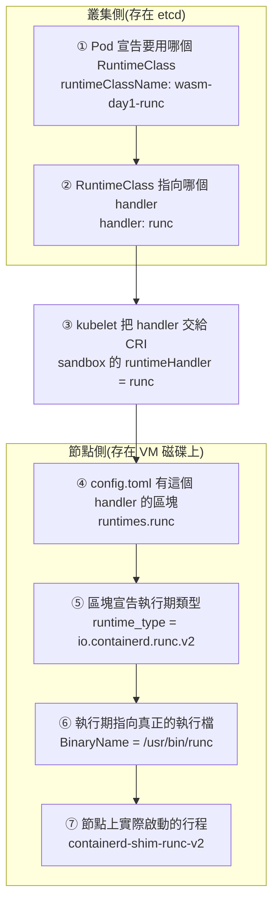

# Day 1: RuntimeClass 的七層實測,以及兩條已經退場的路

{ align=right width="88" }

> [Day 0](sprint3-day0-wasm-concepts.md) 在紙上說了兩件事:RuntimeClass 的 `handler` 對應到節點 containerd 設定裡的一段,而 wasm 進 Kubernetes 的路上,Krustlet 與 AKS 的 WASI node pool 已經先後退場。今天把兩件事都驗出來——包括對那個已退役的功能下一次指令,看它今天實際回什麼。

!!! abstract "你在課程的哪裡"
    - **Day 0**:wasm 是什麼、Kubernetes 用什麼機制執行它。全部是概念,沒有碰過叢集。
    - **今天**:建一座新叢集,把 RuntimeClass 從 Pod spec 一路追到節點上的 shim 行程;順便確認已退役的 WASI node pool 確實叫不動了。驗收是那條追蹤鏈能完整指出來。
    - **Day 2**:第一條路線 wasmCloud,而它的賣點是**完全不用改節點**——今天存下來的節點基準,就是那天的對照組。

## 今天要走的路

| 步驟 | 做什麼 | 為什麼排在這 |
|---|---|---|
| 1 | 對已退役的 WASI node pool 下指令 | 舊教學不會下架,**今天的錯誤訊息是網路上查不到的** |
| 2 | 確認 Krustlet 的現況 | 它的官網還活著,而 repo 已經五年沒動 |
| 3 | 原始節點上有什麼 | **這份基準 Day 8 要拿來驗「拆得乾淨嗎」** |
| 4 | 建 RuntimeClass,追完七層 | 驗收 |

## 步驟 1: 對已退役的 WASI node pool 下指令,看它今天回什麼

AKS 的 WASI node pool 是 [Day 0 那張表](sprint3-day0-wasm-concepts.md)裡「雲廠商代管」的那條路。微軟的封存文件說 2025-05-05 起無法建立新的 WASI node pool。**文件寫的東西不算數,要下指令。**

先看工具那一側。核心 `az` CLI **完全沒有** `--workload-runtime` 這個參數。但那份文件本來就要你裝 `aks-preview` 擴充套件,裝了之後:

```console
$ az aks nodepool add --help | grep -A4 workload-runtime
    --workload-runtime : Determines the type of workload a node can run.
                         Defaults to OCIContainer.  Allowed values:
                         KataCcIsolation, KataMshvVmIsolation,
                         KataVmIsolation, OCIContainer, WasmWasi
                                                       ^^^^^^^^^
```

**`WasmWasi` 還在合法值清單裡**,而且 `--help` 裡還附著一個現成範例。照舊教學走的人,會一路走到最後一步才撞牆:

```console
$ az aks nodepool add -g <resource-group> --cluster-name <cluster> \
    -n mywasipool --node-count 1 --node-vm-size Standard_D2as_v5 \
    --workload-runtime WasmWasi

ERROR: (InvalidWorkloadRuntimeSettingError) The agent pool mywasipool has a deprecated workload
runtime WasmWasi. WebAssembly System Interface (WASI) node pools (preview) are no longer supported
on AKS. For more information on the retirement, see https://aka.ms/aks/wasi-retirement. If you'd
like to run WebAssembly (WASM) workloads, you can deploy SpinKube to Azure Kubernetes Service.
Code: InvalidWorkloadRuntimeSettingError
```

**這段訊息值得逐字讀,有三個資訊:**

**它有一個 `Code`。** `InvalidWorkloadRuntimeSettingError` 代表拒絕發生在 ARM 的資源驗證階段,不是 CLI 的參數檢查——**換 SDK、換 Terraform、直接打 REST,都會拿到同一段**。

**措辭用現在式描述一個不存在的資源。** 「該 agent pool **有**一個已淘汰的執行期」——聽起來像 pool 已經建出來了。沒有:

```console
$ az aks nodepool list -g <resource-group> --cluster-name <cluster> -o table
Name    Prov       Count
system  Succeeded  1        ← 只有這一個
```

這是「先建物件再驗證」的實作痕跡,而它會讓人誤以為要去清理殘留。

**它主動給了遷移方向。** 那個方向是 SpinKube,也就是本 sprint Day 6–7 要走的路。

### 那個 feature flag 還在,但註冊它救不了任何事

```console
$ az feature list --namespace Microsoft.ContainerService \
    --query "[?contains(name,'Wasm')].{name:name,state:properties.state}" -o table
Name                                            State
microsoft.ContainerService/WasmNodePoolPreview  NotRegistered
```

旗標還掛在 ARM 的清單上。**這裡刻意不去註冊它**,兩個理由:

註冊 feature flag 是**訂閱層級**的異動,會影響同一訂閱底下所有叢集可用的 API 介面,包含正式環境。為了一個已退場的預覽功能付這個代價不划算。

而且**從錯誤碼可以推論註冊了也沒用**:拒絕的 `Code` 是「這個值已淘汰」,不是 feature gate 沒開時慣用的「功能未啟用」。**擋你的是值,不是權限。**

**這一點是推論,不是實測**——要實測就得動訂閱層級的設定。

## 步驟 2: Krustlet——官網還活著,repo 五年沒動

Krustlet 是 wasm 進 Kubernetes 最早的嘗試(Day 0 那張表的第一條路):一個假裝自己是 kubelet 的行程,繞過 CRI 直接向 API server 註冊成節點。這裡**不部署它**,只確認它現在是什麼狀態——因為你搜尋時遲早會撞到它。

```console
$ gh api repos/krustlet/krustlet/releases --jq '.[] | "\(.tag_name)\t\(.published_at)"'
v1.0.0-alpha.1   2021-07-27T17:06:02Z
v0.7.0           2021-03-24T21:57:49Z
...
```

**最後一個 release 是 2021-07-27,而且九個 release 全部標記為 prerelease**——這個專案從來沒有發過正式版。

```console
$ gh api repos/krustlet/krustlet --jq '{archived,pushed_at,stars}'
{ "archived": false, "pushed_at": "2023-10-02T18:41:06Z", "stars": 3605 }

$ gh api repos/krustlet/krustlet/commits/main --jq '.files[].filename'
README.md
```

**這個 repo 歷史上的最後一次提交只改了一個檔案:README。** 內容是:

> ⚠️ This project is currently not actively maintained.

而**就在那句話下面三行**,README 仍然寫著:

> 📯 Krustlet 1.0 coming soon!

兩句話同時掛在首頁上,相隔兩年。

### 為什麼這是讀者防雷的重點

```console
$ curl -s -o /dev/null -w "%{http_code}\n" https://krustlet.dev/
200
$ curl -s -o /dev/null -w "%{http_code}\n" https://docs.krustlet.dev/intro
200
```

**官網與文件站今天都回 200,站上沒有任何停止維護的標示,3605 顆星也還在。** 搜尋引擎會把一個看起來完整的教學站排在前面,而那個 repo 的最後一次提交是五年前的訃聞。

**判定一個專案的生死不能看官網,要看 release 與 commit。**

### 一份文件裡兩段互相抵消的指示

那份封存的 AKS 文件裡有一段給 Krustlet 使用者的遷移指引:

> 如果你還在用基於 Krustlet 的 WASI node pool,**可以建立一個新的 WASI node pool** 來遷移到 containerd shim。

而同一頁最上面的警告是:

> 2025 年 5 月 5 日起,你將無法建立新的 WASI node pool。

**Krustlet 的使用者被指引搬去 WASI node pool,而 WASI node pool 已經關門。** 兩條退場的路,一條指向另一條。

## 步驟 3: 原始節點上有什麼

要看節點,需要一顆特權 pod 再跳進節點的命名空間——這個做法 [Sprint 2 Day 0](sprint2-day0-ebpf-concepts.md) 建立過,這裡直接沿用。

```bash
cat > node-shell.yaml <<'EOF'
apiVersion: v1
kind: Pod
metadata:
  name: node-shell
  namespace: wasmlab
spec:
  hostPID: true          # so nsenter -t 1 reaches the node's PID 1
  hostNetwork: true
  containers:
    - name: shell
      image: mcr.microsoft.com/cbl-mariner/base/core:2.0
      command: ["sleep", "infinity"]
      securityContext:
        privileged: true
      volumeMounts:
        - { name: host, mountPath: /host }
  volumes:
    - name: host
      hostPath: { path: / }
EOF
kubectl apply -f node-shell.yaml
```

```console
$ kubectl -n wasmlab exec node-shell -- nsenter -t 1 -m -- containerd --version
containerd github.com/containerd/containerd/v2 2.3.3-2

$ kubectl -n wasmlab exec node-shell -- nsenter -t 1 -m -- ls /etc/containerd/
config.toml
kubenet_template.conf          ← 沒有 conf.d/,預設是單一檔案
```

那個 **2.3.3** 立刻推翻了 Day 0 引用的設定路徑,見[地雷 1](#mine-1)。

### 預設設定全文,22 行

```toml
version = 2
oom_score = -999
[plugins."io.containerd.cri.v1.images"]
  [plugins."io.containerd.cri.v1.images".pinned_images]
    sandbox = "mcr.microsoft.com/oss/v2/kubernetes/pause:3.6"
  …
[plugins."io.containerd.cri.v1.runtime".containerd]
    default_runtime_name = "runc"
    [plugins."io.containerd.cri.v1.runtime".containerd.runtimes.runc]
      runtime_type = "io.containerd.runc.v2"
    [plugins."io.containerd.cri.v1.runtime".containerd.runtimes.runc.options]
      BinaryName = "/usr/bin/runc"
      SystemdCgroup = true
    [plugins."io.containerd.cri.v1.runtime".containerd.runtimes.untrusted]
      runtime_type = "io.containerd.runc.v2"
    [plugins."io.containerd.cri.v1.runtime".containerd.runtimes.untrusted.options]
      BinaryName = "/usr/bin/runc"
[metrics]
  address = "0.0.0.0:10257"
```

**把這份存起來。Day 8 要拿它逐字比對,驗證 Day 6 裝的 shim 拆得乾淨。**

### 有幾個 handler

**兩個**:`runc` 與 `untrusted`。而且它們的 `runtime_type` 與 `BinaryName` 完全一樣——`untrusted` 是 Kubernetes 早年一個 pod annotation 留下來的相容性入口,跟 `runc` 指向同一個執行體,差別只在 `runc` 多了 `SystemdCgroup = true`。

同一件事**完全不碰節點也問得到**:

```console
$ kubectl get node -o jsonpath='{.items[0].status.runtimeHandlers}' | python3 -m json.tool
[ { "name": "",          "features": {…} },
  { "name": "runc",      "features": {…} },
  { "name": "untrusted", "features": {…} } ]
```

三筆,多出來的空字串是**不指定 `runtimeClassName` 時走的預設路徑**。

**這行指令是 Day 6 最好用的驗收工具**:shim 裝成功的話,這裡會多一筆。

而節點上真正存在的 shim 執行檔只有一個:

```console
$ ls -la /usr/bin/containerd-shim* /usr/bin/runc
-rwxr-xr-x 1 root root  8805376 /usr/bin/containerd-shim-runc-v2
-rwxr-xr-x 1 root root 10015640 /usr/bin/runc
```

**兩個 handler、一個 shim 二進位檔。** handler 是設定裡的名字,shim 是磁碟上的東西——Day 6 要做的正是「放一個新的二進位檔進去,再加一段設定指向它」,而這兩件事今天各自看得清楚。

叢集那一側也有東西是預設就在的,而且其中一個是壞的,見[地雷 2](#mine-2)。

## 步驟 4: 驗收——RuntimeClass 的兩半 {#step-4}

### 第一半:handler 對得上

```bash
cat > runtimeclass-runc.yaml <<'EOF'
apiVersion: node.k8s.io/v1
kind: RuntimeClass
metadata:
  name: wasm-day1-runc
handler: runc          # this handler DOES exist on the node
EOF

cat > pod-runc.yaml <<'EOF'
apiVersion: v1
kind: Pod
metadata:
  name: pod-runc-handler
  namespace: wasmlab
spec:
  runtimeClassName: wasm-day1-runc
  containers:
    - name: app
      image: mcr.microsoft.com/cbl-mariner/base/core:2.0
      command: ["sleep", "infinity"]
EOF
kubectl apply -f runtimeclass-runc.yaml -f pod-runc.yaml
```

刻意不用叢集預設的那個 `runc` RuntimeClass——**要證明的是這個物件自己建得出來**,而 Day 6 的 wasm 版本除了 handler 名字以外長得一模一樣。

**但 Pod 跑起來不算證明**,因為不指定 `runtimeClassName` 它也會跑起來。要證明的是「它是經由 `runc` 這個 handler 被啟動的」,所以要問 CRI:

```console
$ nsenter -t 1 -m -- crictl pods --namespace wasmlab -o json | …
pod-runc-handler         SANDBOX_READY  runtimeHandler='runc'
pod-untrusted-handler    SANDBOX_READY  runtimeHandler='untrusted'
node-shell               SANDBOX_READY  runtimeHandler=''        ← 沒指定的那顆
```

三種狀態同框。最後那顆的 `runtimeHandler` 是**空字串**——kubelet 根本沒把 handler 傳給 CRI,containerd 自己套用 `default_runtime_name`。**「用預設」與「明確指定 runc」在 CRI 層是兩條不同的路徑,即使結果一樣。**

### 七層,完整串起來

這就是 Day 0 只在紙上講、今天要指出來的那條線。前兩層住在叢集(etcd),第 ③ 層是 kubelet 把 handler 交給 CRI 時、在節點側查到的執行狀態,第 ④–⑦ 層則落在節點的設定、磁碟與行程裡——**「叢集宣告、節點執行」這條分界後面幾天會反覆出現**:



七層各自在哪裡驗、實測值是什麼:

| 層 | 怎麼驗 | 實測值 |
|---|---|---|
| ① Pod 的宣告 | `kubectl get pod -o yaml` 看 `runtimeClassName` | `wasm-day1-runc` |
| ② RuntimeClass 的 `handler` | `kubectl get runtimeclass` | `runc` |
| ③ CRI 收到的 handler | 節點上 `crictl pods` 看 `runtimeHandler` | `runc` |
| ④ `config.toml` 的 runtime 區塊 | 設定檔第 12 行 | `[plugins."io.containerd.cri.v1.runtime".containerd.runtimes.runc]` |
| ⑤ 區塊裡的 `runtime_type` | 同一個區塊 | `io.containerd.runc.v2` |
| ⑥ 區塊裡的 `options.BinaryName` | 同一個區塊 | `/usr/bin/runc` |
| ⑦ 實際啟動的 shim 行程 | 節點上 `ps` | `/usr/bin/containerd-shim-runc-v2` |

**Day 6 要換掉的只有節點側那四層(④–⑦);叢集宣告的前兩層(①②)形狀一模一樣,而第 ③ 層作為節點回報的執行狀態,也只是跟著改變。**

節點上第二個 handler 也驗了一次:建一個 `handler: untrusted` 的 RuntimeClass,pod 一樣 Running,CRI 回報 `runtimeHandler='untrusted'`。**它不是理論上存在,是真的能用。**

### 第二半:handler 不存在

這一半是刻意去撞的,因為**那正是 Day 6 裝 shim 沒成功時會看到的畫面**。先有一次乾淨的對照,到時候就不用猜。

```bash
cat > runtimeclass-missing.yaml <<'EOF'
apiVersion: node.k8s.io/v1
kind: RuntimeClass
metadata:
  name: wasmtime-spin-v2
handler: wasmtime-spin-v2    # nothing on the node provides this
EOF
```

```console
$ kubectl apply -f runtimeclass-missing.yaml
runtimeclass.node.k8s.io/wasmtime-spin-v2 created      ← 沒有警告
```

**API server 收下了,連一句警告都沒有。** 然後把 pod 送上去:

```console
$ kubectl -n wasmlab get pod pod-missing-handler
NAME                  READY   STATUS              RESTARTS   AGE
pod-missing-handler   0/1     ContainerCreating   0          112s

$ kubectl -n wasmlab describe pod pod-missing-handler | tail -3
Failed to create pod sandbox: rpc error: code = Unknown desc =
  unable to get OCI runtime for sandbox "…":
  no runtime for "wasmtime-spin-v2" is configured
```

**驗收兩半都過。** 而這個失敗還有第二種長相,取決於 RuntimeClass 有沒有寫 `scheduling`——見[地雷 3](#mine-3)。

## 誠實的差距

- **「註冊 feature flag 也沒用」是推論。** 依據是錯誤碼的性質(值被判定為淘汰,而非權限未開),不是實測。要實測得動訂閱層級的設定。
- **單節點。** 今天所有節點層的觀察都來自一顆節點。跨節點的 handler 不一致(有些節點裝了 shim、有些沒有)是 Day 6 之後才會出現的情況。
- **`untrusted` 這個 handler 只驗到「能起 pod」。** 它跟 `runc` 指向同一個執行體,所以沒有再往下追行為差異。
- **Standard Load Balancer 的費用沒有實測。** 成本那一段只確認了公用 IP 是按小時計費的([地雷 4](#mine-4));LB 的規則費與資料處理費沒有量,所以不宣稱。

## 驗收 checkpoint

| 驗證 | 判準 | 實測結果 |
|---|---|---|
| WASI node pool 確實叫不動 | 實際下指令,取得帶 `Code` 的錯誤 | `InvalidWorkloadRuntimeSettingError`,且 node pool 清單確認沒有殘留 |
| Krustlet 的狀態有一手證據 | release 與 commit 的日期,而非官網外觀 | 最後 release 2021-07-27(全部 prerelease);最後提交只改 README |
| 節點基準已存檔 | containerd 版本、設定全文、handler 清單、shim 二進位檔 | 四份都存了,**Day 8 的比對對象** |
| **驗收第一半** | Pod 跑起來**且** CRI 回報的 `runtimeHandler` 等於預期 | `runtimeHandler='runc'`,七層可逐層指出 |
| **驗收第二半** | handler 不存在時,取得明確的失敗訊息 | `no runtime for "wasmtime-spin-v2" is configured`,狀態停在 `ContainerCreating` |

## 地雷記錄

### 地雷 1:官方文件的 containerd 設定路徑,在 containerd 2.x 的節點上是錯的 {#mine-1}

**症狀**:照文件複製一段 runtime 設定貼進節點的 `config.toml`,重啟 containerd,**沒有任何錯誤**,而 pod 起不來,訊息是 `no runtime for "…" is configured`——跟「shim 二進位檔沒複製到位」一模一樣。

**根因**:Kubernetes 官方 RuntimeClass 文件(以及絕大多數 gVisor、Kata、SpinKube 的教學)寫的是:

```text
[plugins."io.containerd.grpc.v1.cri".containerd.runtimes.${HANDLER}]
```

那是 containerd **1.x** 的 plugin ID。containerd 2.x 把 CRI 拆成兩個 plugin,實際路徑是:

```text
[plugins."io.containerd.cri.v1.runtime".containerd.runtimes.${HANDLER}]
```

而這座叢集的節點跑的是 **containerd 2.3.3**。

更容易誤導的是,AKS 預設的設定檔是一份**混血**:第一行寫 `version = 2`,內容卻用 2.x 的 plugin 名,於是每次 `containerd config dump` 都會印一行:

```console
level=warning msg="Configuration migrated from version 2, use `containerd config migrate` to avoid migration"
```

**貼錯路徑的後果是安靜忽略。** containerd 把它當成一個不認識的 plugin 設定,不報錯、不警告。

**修法與追查順序**:動手改節點之前先問 `containerd --version`,**而不是先去檢查 shim 有沒有複製到位**。containerd 自己的 CRI 設定文件有「Runtime classes」一節,用的就是 2.x 的路徑。

### 地雷 2:叢集預設就有一個指向不存在 handler 的 RuntimeClass {#mine-2}

```console
$ kubectl get runtimeclass          # 全新叢集,什麼都還沒做
NAME                HANDLER   AGE
kata-vm-isolation   kata      4m32s
runc                runc      4m33s
```

`runc` 對得上節點。**`kata-vm-isolation` 的 handler 是 `kata`,而這顆節點上沒有這個 handler,也沒有 kata 的 shim 二進位檔。**

它由 AKS 的 addon-manager 放置,帶著 `addonmanager.kubernetes.io/mode: Reconcile`——刪掉會被裝回來。

**根因是分層**:RuntimeClass 是**叢集層**物件,handler 是**節點層**設定,**API server 對兩者的一致性不做任何校驗**。`kubectl apply` 一個 handler 不存在的 RuntimeClass,連警告都不會有(步驟 4 第二半親自驗過)。

**教訓**:`kubectl get runtimeclass` 列得出來,**不代表叢集跑得動它**。

順帶兩個對後面有用的欄位,都在那個預設物件上:

```yaml
overhead:
  podFixed:
    memory: 600Mi
scheduling:
  nodeSelector:
    kubernetes.azure.com/kata-vm-isolation: "true"
```

`overhead.podFixed` 是**把執行體自身開銷回饋給排程器的正式管道**(kata 要開一台輕量 VM,所以是 600Mi)。Day 5 量完 wasm 的記憶體足跡之後,這個欄位該填什麼才有答案。`scheduling` 則是[地雷 3](#mine-3) 的重點。

### 地雷 3:同一個「handler 不存在」,寫不寫 `scheduling` 給你兩種完全不同的失敗 {#mine-3}

**沒寫 `scheduling`**(步驟 4 建的那個):

```console
$ kubectl get pod pod-missing-handler
NAME                  READY   STATUS              AGE
pod-missing-handler   0/1     ContainerCreating   112s
```

Pod **被成功排上節點**,scheduler 沒有意見。失敗發生在 kubelet 對 containerd 發出建立請求的時候,每 14 秒重試一次,狀態**永遠停在 `ContainerCreating`**。

**它不會進 `CrashLoopBackOff`,也不會變成 `Error`——只監控那幾個狀態的告警規則抓不到它。**

**寫了 `scheduling.nodeSelector`**(預設那個 kata):

```console
$ kubectl describe pod pod-kata-shipped | tail -2
0/1 nodes are available: 1 node(s) didn't match Pod's node affinity/selector
```

Pod 停在 `Pending`,而訊息**一個字都沒提到 RuntimeClass**。線索藏在活物件上:RuntimeClass 的 admission 外掛會把 `scheduling.nodeSelector` **併進 pod 的 spec**,所以 `kubectl get pod -o jsonpath='{.spec.nodeSelector}'` 會看到一個**你自己沒寫過的選擇器**——那就是「有人在 admission 動過手腳」的訊號,順著它查 RuntimeClass 才對得上。(自己手寫的 manifest 裡沒有這一欄,**要查 API server 回來的活物件,不是查你送出去的檔案**——這一點是 Day 7 實測後修正的。)

**取捨很實際:**

- **不寫**:在混合節點池裡(有些節點裝了 shim、有些沒有),Pod 會隨機挑到跑不動的節點,於是**同一個 Deployment 有些副本活著、有些卡著,看起來像間歇性故障**。
- **寫了**:行為乾淨,但錯誤訊息難懂。

**Day 6 的 shim 安裝器會替裝好的節點打標籤,所以那天建的 RuntimeClass 應該要帶 `scheduling`。**

### 地雷 4:停機的 AKS 不是零成本 {#mine-4}

`az aks stop` 之後,節點資源群組裡還留著六樣資源,其中 **Standard 公用 IP 是按小時計費的**:

| 資源 | 停機後是否計費 |
|---|---|
| VMSS(capacity 歸零) | 否 |
| OS 磁碟(隨執行個體消失) | 否 |
| VNet / NSG / 受管身分 | 否 |
| **Standard 公用 IP(Static)** | **是,約 US$0.005/hr** |
| Standard Load Balancer | **未實測,不宣稱** |

約 **NT$0.16/hr**,一天 NT$3.8、一個月約 NT$115,**不論有沒有流量、不論叢集開著還是停著**。

金額很小,但**「停機後零成本」是一個假的宣稱,而假的零成本會讓人以為停機的叢集可以無限期放著不管**。正確的說法是:收工後閒置成本約 NT$0.16/hr,**要真的歸零只能整座刪除**。

## 帶得走的東西

- **文件寫的東西不算數,要下指令。** 那份封存文件說 WASI node pool 不能建了,但 `--help` 裡它還是合法值、還附範例。只有真的送出請求,才會拿到那個帶 `Code` 的拒絕。
- **判定專案生死看 release 與 commit,不看官網。** Krustlet 的官網與文件站今天都回 200、3605 顆星還在,而 repo 的最後一次提交是五年前把 README 改成「不再維護」——同一頁下面三行還寫著「1.0 即將推出」。
- **RuntimeClass 與節點設定之間沒有人負責校驗。** 叢集層宣告一個名字,節點層提供一個實作,兩邊對不上時 API server 不會說話,而失敗會延遲到 pod 要啟動的那一刻才出現。
- **同一個錯誤有兩種長相,而其中一種躲得過告警。** handler 不存在時,沒有 `scheduling` 的會卡在 `ContainerCreating` 無限重試——不是 `CrashLoopBackOff`、不是 `Error`,只盯那幾個狀態的規則看不到它。
- **停機不等於免費。** 這條在任何雲上都值得自己量一次:哪些資源隨執行個體消失,哪些按小時一直跳。

## 延伸閱讀

想往下深挖,從這幾份開始:

- **[AKS WASI node pool 的退場公告](https://github.com/Azure/AKS/issues/4770)** —— 第一方公告,2025-01-28 開、2025-05-06 關:2025-05-05 起無法建立新的 WASI node pool,要求改用 SpinKube 遷移。
- **[那份已封存的 WASI node pool 文件](https://learn.microsoft.com/en-us/azure/aks/use-wasi-node-pools)** —— 已移入 previous-versions 並標註不被索引。值得看的是它同時包含「Krustlet 使用者請建立新的 WASI node pool」與「你無法建立新的 WASI node pool」兩段指示。
- **[containerd 的 CRI 設定文件](https://github.com/containerd/containerd/blob/main/docs/cri/config.md)** —— 地雷 1 的一手來源:「Runtime classes」一節用的是 containerd 2.x 的 `io.containerd.cri.v1.runtime` 路徑。
- **[Kubernetes RuntimeClass 文件](https://kubernetes.io/docs/concepts/containers/runtime-class/)** —— `handler`、`scheduling`、`overhead` 三個欄位的規格;注意它的設定範例仍是 containerd 1.x 的路徑。

## 下一步

今天證明了機制存在,但**還沒有任何 wasm 在跑**——七層追到底,最後那個 shim 仍然是 `runc`。

[Day 2](sprint3-day2-wasmcloud.md) 換上第一條路線 wasmCloud,而它的做法跟今天這條線**完全不同**:它不在節點上加 shim,它的 host 就是一般的 pod。所以那一天的驗收有兩半,第二半是**把節點的 containerd 設定跟今天存下來的基準逐字比對,證明它一個位元組都沒動**。

三條路線之所以照「對節點的侵入程度由低到高」排,原因就在這裡:**最乾淨的那一條先做,後面的改動才不會污染前面的量測。**

---

!!! quote ""
    Kubernetes 標誌為 CNCF(Linux Foundation)官方資產,此處作社群教學用途。
