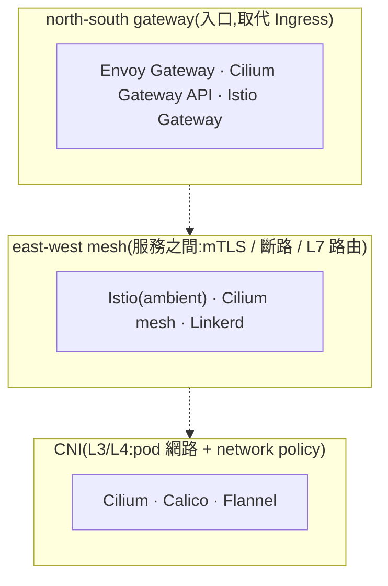

# Day 0: 服務網格與入口閘道的三層地圖

{ align=right width="80" }

> Sprint 2 把封包治理放進了核心——用 eBPF 在 L3/L4 看流量、擋流量。那再往上一層,服務之間的加密、斷路、依 HTTP 內容路由,這些「應用層的事」現在歸誰管?這一章不裝東西,只把 mesh 與 gateway 這一整片地景整理成一張地圖,後面幾天都拿它對照。

!!! abstract "你在課程的哪裡"
    - **來時路**:Sprint 2 教了 eBPF/Cilium 在 L3/L4 的底層治理;Sprint 3 換過 pod 的執行體(WebAssembly)。
    - **今天**:純概念。畫出「CNI / east-west mesh / north-south gateway」三層地圖,搞懂 sidecar 為什麼退場、Cilium 為什麼會跟 Istio 在同一層碰頭、eBPF 到底取代了什麼又沒取代什麼。
    - **接下來**:[Day 1](sprint4-day1-envoy-gateway.md) 動手用 Envoy Gateway 取代 Ingress Nginx(north-south),[Day 2](sprint4-day2-istio-ambient.md) 起 Istio ambient 做服務間 mesh(east-west)。

## 先分清楚兩個方向:north-south 與 east-west

網路流量在叢集裡有兩個方向,整片地景都是照這兩個方向切的:

- **north-south(南北向)**:外面進來、裡面出去的**入口流量**。使用者的請求打進叢集、找到某個服務,走的是這條。舊世界用 **Ingress** 管它。
- **east-west(東西向)**:服務**之間**互相呼叫的流量。訂單服務打帳務服務、帳務服務打風控服務,走的是這條。這條過去多半沒有統一在管——服務直接用 ClusterIP 互打,加密、重試、斷路各自在程式裡自己刻。

這兩個方向要的東西不一樣:north-south 要的是「請求怎麼路由進來」,east-west 要的是「服務互信與韌性」(彼此加密、某個服務掛了不要拖垮全部)。所以它們由不同的東西來管,這就是三層地圖的由來。

## 三層地圖

由下往上讀:最底層 **CNI** 負責 pod 有沒有 IP、封包怎麼在 pod 之間走(這是 Sprint 2 的 Cilium 幹的事);中間 **east-west mesh** 負責服務之間的加密與韌性;最上面 **north-south gateway** 負責入口流量。

**這張圖裡有個名字出現了三次:Cilium。** 它從最底層的 CNI,一路往上長進了 mesh、也長進了 gateway。這件事三年前還不成立。

## Cilium 現在橫跨三層,不只是 CNI

Cilium 起家時是純 CNI——跟 Calico 同一層,管 pod 網路,跟 Istio 那種 mesh 井水不犯河水。它後來往上長,現在是一套橫跨三層的東西:

- **CNI(L3/L4)**:給 pod 配網路、套 network policy——這是它的老本行。
- **mesh(east-west)**:服務之間的加密走 WireGuard/IPsec(在 eBPF 資料面做),身分與 L7 介入用每個節點一個共享的 Envoy。
- **Gateway API(north-south)**:它自己也有一套入口閘道。

所以 east-west 的選型不只 Istio,還有 Cilium——**Cilium 從底層一路長到 east-west,跟純 mesh 的 Istio 在這一層碰頭了**。這個碰頭是 Day 3、Day 4 要實測比較的主戲。

## sidecar 為什麼在退場

現在的 mesh 是從舊的 sidecar mesh 演變來的,先看舊的長怎樣、為什麼被換掉。

早年的 Istio 是 **sidecar 模式**:每一個 pod 旁邊都硬塞一個 Envoy proxy,pod 進出的流量全被這個 sidecar 攔下來加密、路由。功能很強,但代價是**每個 pod 都多背一個 proxy**——記憶體、CPU、啟動時間全部乘上 pod 數量,升級 mesh 還得把每個 pod 重啟一輪。

於是 sidecar 開始退潮:業界統計 sidecar 型 mesh 的採用率從 2023 的 50% 掉到 2024 的 42%(截至 2026-08 的引用數字,非本課實測)。但**退的是 sidecar 這個形態,不是 mesh 這件事**——mesh 整體採用其實還在成長,mTLS、斷路這些功能只是更中心了。取代 sidecar 的是兩條路:

- **Istio ambient**(2024-11 起 GA、2026 已是官方推薦):不再每個 pod 塞 proxy,改成每個**節點**一個輕量的 L4 元件(ztunnel)做加密,需要 L7 時才另起一個共享的 proxy(waypoint)。
- **Cilium**:本來就在核心用 eBPF 做事,不需要 sidecar。

## eBPF 取代了什麼,又沒取代什麼

**eBPF 吃下的是 L4 跟 sidecar 這個形態,沒吃下 L7。**

拆開講:

- **eBPF 拿下的**:L3/L4 的封包治理(負載平衡、network policy、L4 層的加密),這些搬進了核心,快、省、不需要 proxy。sidecar 那種「每個 pod 一個 proxy」的擺法也被它淘汰。
- **eBPF 沒拿下的**:L7——也就是需要看懂 HTTP 內容才能做的事(依 header/path 路由、斷路、重試、流量鏡像)。這些**還是需要一個 Envoy 等級的 proxy**,只是位置從「每個 pod 一個」變成「每個節點一個」或「按需一個」。

所以實際上是**分工**,不是 eBPF 取代 Envoy:eBPF 在核心做 L4,Envoy 在 proxy 做 L7,兩者都脫離了 sidecar。

而且有意思的是,**這三家的 L7 其實都是 Envoy**:

| 東西 | 方向 | L7 資料面 | L4 資料面 |
|---|---|---|---|
| Envoy Gateway | north-south | Envoy | Envoy |
| Cilium mesh | east-west | 每節點共享 Envoy | **eBPF(核心)** |
| Istio ambient | east-west | waypoint(Envoy) | **ztunnel(Rust)** |

三者的 L7 路徑都看得到 Envoy;但 L4 就分家了——Cilium 走 eBPF、Istio 的 ztunnel 是 Rust 寫的。所以你 Day 1 學會的 Envoy 設定思路,到 Day 2、Day 3 是相通的,只是被裝進不同的殼。

## 驗收 checkpoint

這一章沒有指令可跑,驗收是三個問題,答案要點都在上面:

| 驗證 | 判準(答案要點) |
|---|---|
| **第一問** | north-south 與 east-west 各解決什麼?(入口/Ingress 替代 vs 服務間 mTLS/L7) |
| **第二問** | 為什麼 Cilium 會跟 Istio 在 east-west 這層相遇?(Cilium 從 CNI 一路往上長到 mesh) |
| **第三問** | eBPF 取代了什麼、沒取代什麼?(吃下 L4 與 sidecar 形態,L7 仍需 Envoy 級 proxy) |

## 帶得走的東西

- **流量分南北向與東西向,整片地景照這兩個方向切**。north-south 是入口(Envoy Gateway 的地盤),east-west 是服務之間(Istio/Cilium 的地盤),兩者由不同的東西管。
- **Cilium 已經橫跨三層,不再只是 CNI**。它從底層爬上 mesh 與 gateway,所以 east-west 的選型變成「Istio 或 Cilium」,不是「有沒有 mesh」。
- **退場的是 sidecar,不是 mesh**。每個 pod 塞一個 proxy 的成本擋不住,但 mTLS、斷路這些功能反而更中心——只是搬到節點層或按需起。
- **eBPF 沒有吃掉 Envoy,兩者分工**:L4 進核心(eBPF),L7 留在 proxy(Envoy),都脫離 sidecar。
- **三家的 L7 底層都是 Envoy**。學會一套 Envoy 思路,north-south 跟 east-west 都用得上。

## 延伸閱讀

想往下深挖,從這幾份開始:

- **[Istio Ambient vs. Cilium(Istio 官方部落格)](https://istio.io/latest/blog/2024/ambient-vs-cilium/)** —— 官方自己把 ambient(ztunnel/waypoint)與 Cilium(eBPF + per-node Envoy)兩種 sidecar-less 架構攤開比,正是 Day 3/4 要實測的那組對照的紙上版。
- **[Cilium Service Mesh 概念頁](https://docs.cilium.io/en/stable/network/servicemesh/)** —— 看 Cilium 怎麼把 mesh「折進」CNI:L4 在 eBPF、L7 用 per-node Envoy,印證「Cilium 從 CNI 長到 mesh」這件事。
- **[Envoy Gateway 官網](https://gateway.envoyproxy.io/)** —— north-south 那層的主力,Day 1 的工具;它就是「Gateway API 的 Envoy 實作」。

## 下一步

地圖畫好了,從最上面那層開始動手。[Day 1](sprint4-day1-envoy-gateway.md) 用 **Envoy Gateway** 把一條入口流量路由起來,取代舊的 Ingress Nginx,順便解決一件 Ingress 一直做不好的事——HTTP/3。

---

!!! quote ""
    Kubernetes 標誌為 CNCF(Linux Foundation)官方資產,此處作社群教學用途。
