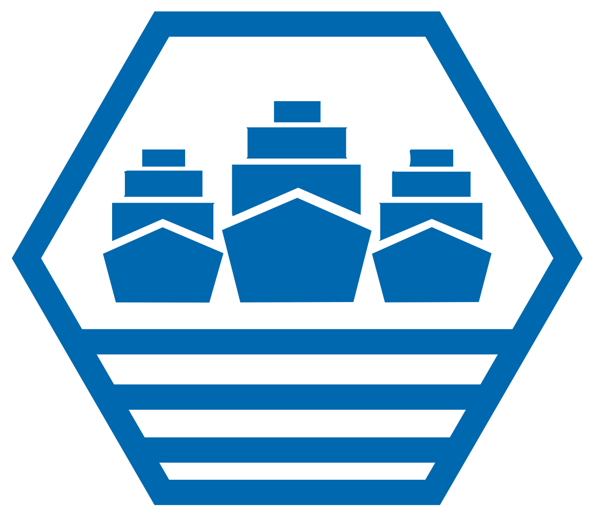
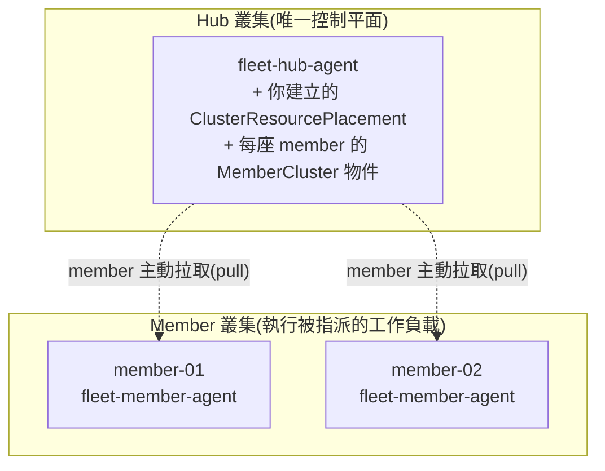

# Day 0: 多叢集是什麼問題,以及 KubeFleet 怎麼管一群叢集

{ align=right width="88" }

> 前三個 sprint 都待在**一座叢集之內**——誰先拿到 GPU、誰能執行什麼系統呼叫、一個 pod 用什麼執行體跑。今天第一次站到叢集**之上**:當你手上不只一座叢集,而是一群,誰來統一管它們?這一章不裝東西、不碰叢集,只把問題與 KubeFleet 的模型講清楚。

!!! abstract "你在課程的哪裡"
    - **Sprint 1–3**:全部發生在單一叢集內——GPU 排程、eBPF 執行期安全、WebAssembly 執行體。前提始終是「就這一座叢集」。
    - **今天**:換一個層級。多叢集是什麼問題,以及 KubeFleet 用什麼架構解它。純概念,每個事實都有官方一手來源。
    - **Day 1**:真的把一個 fleet 建出來——一座 hub、兩座 member,member 加入 fleet。

## 今天要走的路

| 段 | 回答什麼 |
|---|---|
| 一 | 多叢集為什麼是一個問題,而 KubeFleet **官方**說它解什麼(以及不解什麼) |
| 二 | hub-spoke 架構:hub 與 member 各是什麼、member 怎麼加入 |
| 三 | 核心的操作物件:ClusterResourcePlacement(Day 2 才動手,今天只要懂概念) |
| 四 | 一個要先講清楚的立場:KubeFleet 不綁任何雲 |

## 一、多叢集是什麼問題

先講為什麼會有「一群叢集」這回事。單一叢集夠用的時候不需要 fleet;會走到多叢集,通常是這幾種處境:應用要跨多個雲或多個地區部署、要靠近邊緣或落在自己的地端機房、或是把不同環境切成不同叢集。叢集一多,新問題就冒出來:**同一份設定要在每座叢集都套一次、一次更新要安全地推過整群、一個工作負載該落在哪幾座叢集**——這些在單叢集時代不存在。

KubeFleet 官方把它要解的問題**明確定義成三件事**(逐字引自 README 的 Key benefits):

- **集中式、政策驅動的治理**(Centralized policy-driven fleet governance):用一個控制平面,對每座 member 叢集套用一致的政策,不管它們在公有雲、私有機房還是邊緣。
- **帶安全護欄的漸進推展**(Progressive rollouts with safeguards):跨整個 fleet 分階段推更新,每一步做健康檢查,出問題可以暫停或回滾,限制影響範圍。
- **強力的多叢集排程**(Powerful multi-cluster scheduling):依叢集屬性、可用容量、宣告式放置政策,決定工作負載該落在哪些叢集。

官方點名的場景是「叢集散落各地」——多雲、多區(地理分散)、邊緣與地端。

!!! warning "有三件事它不宣稱要解,別掛在它名下"
    直覺上你可能覺得「多叢集不就是為了**合規邊界、藍綠叢集、租戶隔離**嗎」。逐頁核對 KubeFleet 官網與 README(查證日 2026-08-13)——**這三項都不是它列出的動機**,查無一手來源。它們是你**拿它的政策與排程能力去達成的結果**,不是它宣稱要解的問題本身。

    尤其**租戶隔離**要特別小心:KubeFleet 的 MemberCluster 文件明講 fleet 假設叢集之間是**高度互信**(high level of mutual trust)的集合,不是彼此不信任的租戶邊界。拿它當租戶隔離的牆,方向就錯了。

## 二、hub-spoke 架構

KubeFleet 用**輪轂-輪輻(hub-spoke)**的形狀:一座 hub 叢集是唯一的控制平面,其餘每座 member 叢集是輪輻。官方對兩個 agent 的定義:

- **`fleet-hub-agent`**:跑在 hub 上的控制器,管理 hub 上所有 fleet 相關的物件。
- **`fleet-member-agent`**:跑在每座 member 上的控制器,**主動從 hub 拉取**最新的物件,把 member 收斂到期望狀態。

這個「member 主動拉、hub 不主動連 member」的設計叫 **agent-based pull mode**,它有一個實際的好處(官方原文):

> "hub cluster does not need to directly access to the member clusters. Fleet can support the member clusters which only have the outbound network and no inbound network access."

也就是說,member 叢集**只要有出向網路、沒有入向**也能加入 fleet——這對防火牆後、或不想對外開 API server 的叢集很關鍵。

**箭頭是虛線、標「pull」是刻意的**:概念上資源「從 hub 流向 member」,但實際是 member-agent 主動去拉,不是 hub 推過去。

### member 怎麼加入(MemberCluster)

你在 hub 上建一個 `MemberCluster` 物件,代表「這座叢集要加入 fleet」。之後的事 controller 自動做(官方描述,拆成五步):

1. 在 hub 建 `MemberCluster` 物件。
2. hub 的 controller 為這座 member 在 hub 上開一個**專屬命名空間**。
3. 配置權限(role / rolebinding),把這座 member 的存取**鎖在那個命名空間內**。
4. 在該命名空間建一個內部物件 `InternalMemberCluster`;member 端的 agent 依設定的心跳週期回報容量使用等狀態。
5. hub 彙整各 agent 的狀態,把叢集標記為 **`Joined`**。

Day 1 你會親眼看到這五步跑完、`kubectl get membercluster` 出現 `JOINED=True`。

## 三、ClusterResourcePlacement:把資源散到哪些叢集

`ClusterResourcePlacement`(下面簡稱 CRP)是 KubeFleet 最核心的操作物件——**你幾乎所有動作都在 hub 上建 CRP**。它做的事:選取要散佈的資源、決定散到哪些叢集、以及怎麼推展。官方把它拆成三段:

- **選什麼(Resource selection)**:選要從 hub 散到 member 的資源。**選一個 namespace 時,它底下所有物件會一起被散佈**——這一點 Day 2 會直接用到。
- **散到哪些叢集(Placement policy)**,三種選法:
    - **PickAll**(預設):選所有符合條件、已加入且健康的 member。
    - **PickFixed**:選一份寫死的叢集名單。
    - **PickN**:選 N 座,可搭配親和性規則或拓撲分散條件。
- **怎麼推(Strategy)**:更新如何 rollout、資源如何套用到 member 端。

Day 0 只要懂這三段的概念;Day 2 你會用同一個 CRP、只改 policy,把 PickAll / PickN / 依標籤選各驗一次。

**注意 KubeFleet 散的是什麼、不散什麼**:它散的是叢集層級的資源(尤其 namespace 及其內容),**Pod 與 Node 本身是被排除的**(官方 FAQ 明列)。它不決定「一個 pod 怎麼跑」,它決定「哪座叢集收到哪些工作負載」。

## 四、一個要先講清楚的立場:KubeFleet 不綁任何雲

這件事值得單獨拉出來講,因為它決定了這門課教的是什麼。**KubeFleet 是 CNCF 的 Sandbox 開源專案,跑在任何 Kubernetes 上**——官方原話:

> "KubeFleet is a sandbox project of the Cloud Native Computing Foundation (CNCF) that works on any Kubernetes cluster."(README 首句)
>
> "KubeFleet works with any CNCF-certified Kubernetes release **on any cloud, on-premises or on the edge**."(官網首頁)

你可能聽過 **Azure Kubernetes Fleet Manager**。兩者的關係要分清楚:

- **KubeFleet** = CNCF 開源專案,跑在任何 Kubernetes 上,就是本課教的東西。
- **Azure Kubernetes Fleet Manager** = 微軟把 KubeFleet 打包成的**受管服務**,底層跑的是同一份開源程式碼。

**本課教開源 KubeFleet,不教任何雲的專屬服務。** 你在後面幾天學到的 hub-member 模型、CRP、rollout 全部是開源專案的東西,搬到 EKS、GKE、地端叢集都成立。

有一個小細節印證這件事正在發生:KubeFleet 是從微軟的 `Azure/fleet` 捐進 CNCF 的,現在正把命名去 Azure 化——它的 Go 模組本體已經改名成 `github.com/kubefleet-dev/kubefleet`,官方文件對 Azure 完全不提及,只剩少數徽章和範例標籤還帶著舊名字沒清乾淨。**上游中立,而聲明「跟隨上游」的是下游的 Azure 那一側**——所以「教不綁雲的那個」立場站得住。

### 跟 Sprint 1–3 是不同層級的東西

一句話定位:**KubeFleet 站在所有叢集之上,不改任何一座叢集的內部**。對照 Sprint 1–3——那些機制全都待在單叢集**之內**:Kata 換 pod 的執行底座、Cilium 換網路資料面、WebAssembly shim 換 runtime,操作對象都是「一座叢集裡怎麼跑」。KubeFleet 完全不碰節點、不碰 containerd、不碰 RuntimeClass,連 Pod 都不散佈——它管的是「工作負載該落在哪座叢集」。

兩者不是替代關係,是**上下疊放**:你可以在每座 member 叢集內各自用 Sprint 3 學的那套,再用 KubeFleet 決定哪座 member 收到哪些工作負載。

## 驗收 checkpoint

這一章沒有指令可以跑,驗收是三個你要能自己回答的問題:

| 驗證 | 判準 |
|---|---|
| **第一問** | KubeFleet 官方宣稱解決的三件事是什麼?哪三件常見的「多叢集理由」**不是**它宣稱的動機? |
| **第二問** | 為什麼「member 只有出向網路、沒有入向」也能加入 fleet?(提示:誰主動連誰) |
| **第三問** | KubeFleet 與 Azure Kubernetes Fleet Manager 是什麼關係?本課教哪一個、為什麼 |

## 帶得走的東西

- **多叢集的問題是「治理、漸進推展、排程」**,不是自動的「合規/租戶隔離」。後者要靠你自己用它的能力去達成,而且它假設叢集之間高度互信——不是租戶隔離的牆。
- **hub-spoke + pull mode**:一座 hub 當控制平面,member 主動拉。這讓防火牆後、只有出向網路的叢集也能納管。
- **CRP 是你的主要操作物件**,而且幾乎全在 hub 上下。選 namespace 就散整包;三種選法 PickAll / PickFixed / PickN。
- **KubeFleet 不綁雲。** 它是 CNCF 開源專案,Azure Fleet Manager 只是跑它的其中一個受管服務。本課教前者。
- **它是叢集之上的層**,跟前三個 sprint 的叢集之內機制不是替代、是疊放。

## 延伸閱讀

- **[KubeFleet 官網](https://kubefleet.dev/)** —— 首頁一句話定位「any CNCF-certified Kubernetes release on any cloud, on-premises or on the edge」,以及三張 feature 卡(治理/排程/管理)的出處。
- **[KubeFleet components 概念頁](https://kubefleet.dev/docs/concepts/components/)** —— hub-agent 與 member-agent 的定義、agent-based pull mode、「member 只需出向網路」那段的一手來源。
- **[ClusterResourcePlacement 概念頁](https://kubefleet.dev/docs/concepts/crp/)** —— CRP 三段結構(選什麼/散哪裡/怎麼推)與 PickAll/PickFixed/PickN 的官方定義。

## 下一步

今天講的都停在紙上。[Day 1](sprint4-day1-build-fleet.md) 把一個 fleet 真的建出來——一座 hub、兩座 member,用 `MemberCluster` 物件讓它們加入,親眼看 `JOINED` 從 `Unknown` 翻成 `True`。

而 Day 1 有一個環境上的講究:多叢集要好幾座叢集,雲上開好幾座既慢又貴。所以會用一個叫 **kind** 的工具,在一台機器上開好幾座叢集——那是什麼、為什麼撞名 YAML 的欄位,Day 1 開頭會講清楚。

---

!!! quote ""
    KubeFleet 標誌為 CNCF(Linux Foundation)官方資產,此處作社群教學用途。
