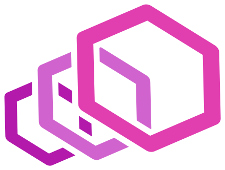
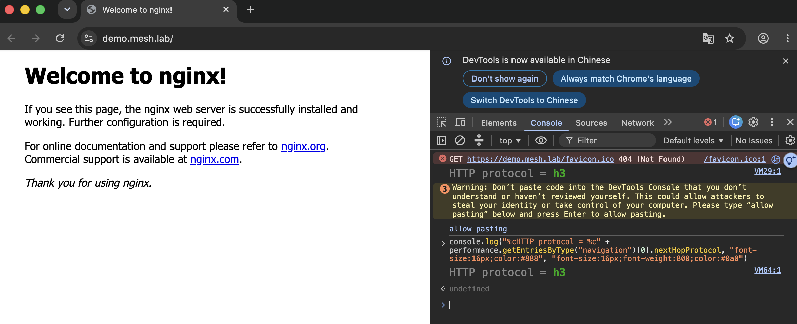

# Day 1: Envoy Gateway 取代 Ingress Nginx——順便把 HTTP/3 開起來

{ align=right width="76" }

> 入口流量以前都交給 Ingress。它把「用哪個 controller、在哪個主機路徑、送到哪個後端」三件事全塞進一個物件,而且新東西(像 HTTP/3)一直很難補上去。今天用 **Envoy Gateway**——Gateway API 的 Envoy 實作——把入口流量重新接一次,並且開起 Ingress 一直做不好的 HTTP/3。

!!! abstract "你在課程的哪裡"
    - **[Day 0](sprint4-day0-mesh-concepts.md)**:畫好三層地圖,知道 north-south(入口)跟 east-west(服務之間)是兩回事。
    - **今天**:動手做 north-south 那層——建一座叢集、裝 Envoy Gateway,用 Gateway API 把一條入口流量路由起來,再把 HTTP/3 開起來。
    - **接下來**:[Day 2](sprint4-day2-istio-ambient.md) 做 east-west——Istio ambient 的服務間 mTLS 與斷路。

## 今天要走的路

| 步驟 | 做什麼 | 對應 |
|---|---|---|
| 1 | 建一座 AKS 叢集,用 BYOCNI 裝上游 Cilium 當 CNI | 整個 Sprint 4 的地基 |
| 2 | 裝 Envoy Gateway,用 Gateway API 三件套路由一條入口流量 | gate:外部請求打到後端 |
| 3 | 開 HTTP/3(QUIC),驗客戶端真的走 h3 | gate:回應走 h3 |

一個先講清楚的詞:**BYOCNI**(Bring Your Own CNI,自帶 CNI)。開 AKS 時微軟預設會幫你裝一個受管的 CNI;BYOCNI 是叫它「什麼都別裝」(`--network-plugin none`),節點先呈 `NotReady`,再由你自己裝上游 Cilium。之所以要這樣,是因為受管版的 Cilium 只開放子集功能,而後面幾天要用到完整上游 Cilium 的 mesh/Gateway API——所以從第一天就自己裝。

### Ingress 與 Gateway API:一份拆成三份

Gateway API 不是 Ingress 的加強版,是把 Ingress 那一份物件**拆成三個各自負責的物件**:

| Ingress 裡的一件事 | Gateway API 對應的物件 |
|---|---|
| `ingressClassName: nginx`(用哪個 controller) | **GatewayClass**(controllerName 指向 Envoy Gateway) |
| host + 入口埠(:80) | **Gateway**(listener) |
| path → backend | **HTTPRoute**(rules) |

拆開的好處是各段可以獨立擁有、獨立授權——平台團隊管 Gateway,應用團隊管自己的 HTTPRoute,不用再共編一份 Ingress。

## 步驟 1: 建 BYOCNI 叢集 + 裝上游 Cilium

叢集建起來時網路外掛是 `none`,節點會先卡在 `NotReady`——這是 BYOCNI 的正常現象,還沒裝 CNI 而已:

```text
prov=Succeeded  power=Running  k8s=1.35.6  networkPlugin=none  containerd=2.3.3-2
aks-nodepool1-31753998-vmss000000   NotReady   ...   containerd://2.3.3-2
```

裝上游 Cilium(這一組設定會一路用到 Day 3,先釘好):

```sh
helm install cilium cilium/cilium --version 1.20.0 --namespace kube-system \
  --set aksbyocni.enabled=true --set nodeinit.enabled=true \
  --set kubeProxyReplacement=true \
  --set k8sServiceHost=<API server FQDN> --set k8sServicePort=443 \
  --set socketLB.hostNamespaceOnly=true \
  --set cni.exclusive=false --set envoyConfig.enabled=true
```

那幾個設定不是隨便挑的:`cni.exclusive=false` 是留位子給 Day 2 的 Istio(讓它的 CNI 掛得上去),`kubeProxyReplacement=true` 是 Day 3 Cilium L7 要的前置。裝完節點就轉 `Ready`:

```text
aks-nodepool1-31753998-vmss000000   Ready   <none>   6m30s   v1.35.6
# cilium status
Cilium:            OK
Envoy DaemonSet:   OK
Cluster Pods:      5/5 managed by Cilium
```

!!! note "kube-proxy 沒有走,而是跟 Cilium 併存"
    設了 `kubeProxyReplacement=true`、Cilium 接手了 kube-proxy 的活,但 AKS 的 `kube-proxy` DaemonSet **仍然在跑**(desired=1)——AKS 不會因為你裝了 Cilium 就把它撤掉。Day 1 這不影響功能,但 Day 3 要純用 Cilium 的 L7 時得回頭確認這件事。

## 步驟 2: Envoy Gateway + Gateway API 三件套

裝好 Envoy Gateway 後,套用三件套(GatewayClass / Gateway / HTTPRoute)。Envoy Gateway 會自動佈一個 Envoy proxy,並替它開一個 Azure LoadBalancer 拿公網 IP:

```text
Gateway eg:    Accepted=True  Programmed=True
HTTPRoute web: Accepted=True  ResolvedRefs=True
envoy-mesh-demo-eg-dd08789d   LoadBalancer   <LB-IP>   80:32421/TCP
```

打進去驗——對的 host 走到 nginx 後端、錯的 host 不被路由:

```console
$ curl -H "Host: demo.mesh.lab" http://<LB-IP>/
HTTP/1.1 200 OK
server: nginx/1.13.6

$ curl -H "Host: nope.invalid" http://<LB-IP>/
wrong-host -> HTTP 404
```

**200 而且 `server: nginx`**,代表請求真的經過 Envoy Gateway、照 HTTPRoute 找到後端;錯 host 拿 404,代表 hostname 比對有生效。第一個 gate 過了。

## 步驟 3: HTTP/3

先講 **HTTP/3** 是什麼、為什麼 Ingress 一直很難:它走的傳輸協定是 **QUIC**,而 QUIC 跑在 **UDP** 上(HTTP/1 和 HTTP/2 是走 TCP)。Ingress Nginx 對 HTTP/3 的支援一直很卡,Envoy Gateway 則是設定一個欄位就開:

```yaml
apiVersion: gateway.envoyproxy.io/v1alpha1
kind: ClientTrafficPolicy
metadata:
  name: enable-http3
spec:
  targetRefs:
    - group: gateway.networking.k8s.io
      kind: Gateway
      name: eg
  http3: {}
```

開了之後,Envoy Gateway 自動在**同一個** LoadBalancer service 上多掛一個 **UDP 443**(給 QUIC 用):

```text
envoy-mesh-demo-eg-dd08789d   LoadBalancer   <LB-IP>   PORTS: 80,443,443  PROTOS: TCP,TCP,UDP
  http-80:      TCP/80
  https-443:    TCP/443
  https-443-h3: UDP/443      ← http3 帶出來的 QUIC port
```

AKS 的 LoadBalancer 有個常見認知:一個 service 不能在同一個埠同時掛 TCP 和 UDP,要拆成兩個 service 共用一個 IP、還得加特別的 annotation。這一版 Envoy Gateway + AKS 不是這樣——**一個 service 就承載 TCP80 / TCP443 / UDP443,Azure 自動配了 IP、也自動放行了 UDP 防火牆**,不用手動繞。

先看 HTTPS(走 TCP 443 的 h2)有沒有廣告 h3。伺服器用一個叫 **alt-svc** 的回應標頭告訴瀏覽器「我這裡也有 h3,你可以升級」:

```console
$ curl -k --http2 --resolve demo.mesh.lab:443:<LB-IP> https://demo.mesh.lab/
HTTP/2 200
alt-svc: h3=":443"; ma=86400          ← 廣告了 HTTP/3
```

再用一顆有 HTTP/3 的 curl 真的連一次(macOS 內建的 `curl 8.7.1` 沒編 h3,見[誠實的差距](#gaps);`brew install curl` 那顆有),`-v` 把整條 h3 攤開:

```console
$ curl --http3 -v --resolve demo.mesh.lab:443:<LB-IP> https://demo.mesh.lab/
* Connected to demo.mesh.lab (<LB-IP>) port 443
* using HTTP/3                    ← 走 HTTP/3
> GET / HTTP/3
< HTTP/3 200                      ← 回應也是 HTTP/3
< server: nginx/1.13.6
< alt-svc: h3=":443"; ma=86400
```

`using HTTP/3`、`GET / HTTP/3`、`HTTP/3 200` 三行,就是客戶端經 QUIC/UDP 443 → Azure LB → Envoy 的 QUIC listener → nginx、一路走 HTTP/3。第二個 gate 過了。

### 瀏覽器要走 h3,得先信任憑證

curl 加 `-k` 就肯對自簽憑證硬走 h3,瀏覽器不會。同一個站,Chrome 強制走 QUIC 時,自簽憑證會直接 `ERR_QUIC_PROTOCOL_ERROR`——瀏覽器對 QUIC 的憑證要求比 TCP 嚴,而且 QUIC 沒有 TCP 那種「仍要前往」可以點。把憑證換成一張本機信任的(例如 mkcert 簽發、把它的 CA 加進系統信任區),Chrome 才走得動 h3。

而且要「**看到**」它走 h3,不能看頁面——h1/h2/h3 載出來的畫面一模一樣。要確認協定有兩個地方:DevTools 的 **Network** 分頁把 **Protocol** 欄叫出來(會顯示 `h3`),或在主控台問瀏覽器自己:

```js
performance.getEntriesByType('navigation')[0].nextHopProtocol   // → "h3"
```

`nextHopProtocol` 是 Navigation Timing API 直接回報「這一頁實際用哪個協定載入」,對 `https://demo.mesh.lab/` 它回 `"h3"`。實際在 Chrome 開這個站、DevTools 主控台跑一次就是下面這樣:



網址列是 `demo.mesh.lab`、頁面是 nginx 預設頁,右邊主控台印出 `HTTP protocol = h3`——同一頁看起來跟 h1/h2 沒兩樣,協定的差別只在這裡讀得出來。

在瀏覽器驗 h3 有兩個前提:憑證要能被信任、而且要看協定(Network 分頁的 Protocol 欄、或主控台的 `nextHopProtocol`)而不是看頁面——這是把 HTTP/3 端到端接起來時最容易漏掉的兩步。

## 驗收 checkpoint

| 驗證 | 判準 | 本課環境的結果 |
|---|---|---|
| 外部請求經 HTTPRoute 到後端 | 對的 host 回 200、錯的 host 不被路由 | `demo.mesh.lab` → 200 nginx;`nope.invalid` → 404 |
| Ingress 規則可對應成 Gateway API | 一條 Ingress 拆成 GatewayClass/Gateway/HTTPRoute 三件 | 對照見 `sprint4-day1-mesh-manifests/` |
| HTTP/3 客戶端走 h3 | `curl --http3` 回 `http_version=3` | `HTTP/3 200`、`alt-svc: h3=":443"` |

## 誠實的差距 {#gaps}

- **系統內建的 curl 沒有 HTTP/3**。macOS 內建 `curl 8.7.1` 只編了 HTTP/2(nghttp2),`curl --http3` 會回「the installed libcurl version doesn't support this」。`brew install curl`(8.21.0,帶 ngtcp2 + nghttp3)那顆有,但它是 keg-only,要用完整路徑 `/opt/homebrew/opt/curl/bin/curl` 或把它加進 `PATH`,不然打到的還是沒 h3 的系統 curl。
- **混合 TCP+UDP 的 LoadBalancer 只驗了會成、沒探邊界**。這一版 AKS + Envoy Gateway 一個 service 就吃下 TCP+UDP 443;但沒有反過來測「換更舊的 AKS 或 Envoy Gateway 版本會不會就得拆兩個 service」。所以「不用繞」這個結論綁在這組版本上。
- **單節點量測**。整座叢集只有一個 D4s_v3 節點,Day 1 夠用;但要拿它量效能(Day 4 的對比),單節點的排程壓力會污染數字,那時得先擴到兩個節點。
- **kube-proxy 併存的後果沒追到底**。設了 `kubeProxyReplacement=true` 但 AKS 的 kube-proxy 還在跑,Day 1 功能正常;這個併存對 Day 3 純 Cilium L7 有沒有影響,留到 Day 3 再確認。

## 帶得走的東西

- **Gateway API 是把 Ingress 一份拆成三份**(GatewayClass / Gateway / HTTPRoute),讓入口流量的三件事各自可獨立擁有與授權。不是換個寫法,是換個權責模型。
- **BYOCNI 是「叫 AKS 別管網路、我自己裝」**,換到的是完整上游 Cilium 的功能,代價是那一層要自己顧。要用受管版沒有的功能,才值得走這條。
- **HTTP/3 的難處在 UDP**:QUIC 跑在 UDP 上,而傳統入口與雲端 LoadBalancer 對「同埠混 TCP/UDP」向來彆扭。Envoy Gateway 一個欄位開起來、AKS 這版又剛好不用繞——但這種「剛好不用繞」要標清楚綁哪個版本,別當成永遠成立。
- **工具鏈自己的 bug,錯誤訊息可能只給底層 traceback**。`az aks create` 吐 Python traceback 時,根因是擴充套件版本,不是叢集建立參數——先比對版本,能省掉在參數上鬼打牆的半小時。

## 延伸閱讀

- **[Envoy Gateway — HTTP/3 任務頁](https://gateway.envoyproxy.io/docs/tasks/traffic/http3/)** —— 今天開 HTTP/3 用的 `ClientTrafficPolicy.http3` 的官方文件,含它對 QUIC listener 的處理。
- **[Kubernetes Gateway API 官網](https://gateway-api.sigs.k8s.io/)** —— GatewayClass / Gateway / HTTPRoute 三件套的規格出處;想理解「為什麼拆三份」讀它的 API concepts。
- **[AKS — Bring your own CNI(BYOCNI)](https://learn.microsoft.com/en-us/azure/aks/use-byo-cni)** —— `--network-plugin none` 的官方說明,以及「叢集我們支援、你的 CNI 你自己顧」的支援邊界。

## 下一步

north-south 這層通了——入口流量走 Envoy Gateway、HTTP/3 也開了。[Day 2](sprint4-day2-istio-ambient.md) 換到 east-west:同一座叢集上起 **Istio ambient**,讓服務**之間**自動 mTLS 加密、再對一個服務設斷路把它壓到跳開。而 Istio 要疊在今天裝的 Cilium 上,那個 `cni.exclusive=false` 的伏筆,Day 2 開頭就收。

---

!!! quote ""
    Envoy 標誌為 CNCF(Linux Foundation)官方資產,此處作社群教學用途。瀏覽器 DevTools 擷圖為本課程實測自製。
