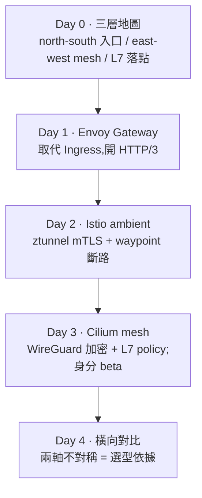

# Day 4: Istio 與 Cilium 橫向對比——eBPF 贏在 L4,Istio 贏在 L7 與身分

{ align=right width="64" }
{ align=right width="64" }

> Day 2 與 Day 3 各自跑完 Istio ambient 與 Cilium mesh 的同一組驗收。今天不動手,把兩邊的實測擺成一張決策表——每一格都追溯到 Day 2、Day 3 或本日的量測。收攏的過程會浮出一件各章各自看不到的事:兩邊的強項落在不同層,選型不是「誰取代誰」,是「你要哪一軸」。

!!! abstract "你在課程的哪裡"
    - **Day 0–3**:mesh 的三層地圖、Envoy Gateway 的 north-south 入口與 HTTP/3、Istio ambient 的 east-west mTLS 與斷路、Cilium mesh 的 WireGuard 加密與 L7 policy。
    - **今天**:不動手。把 Istio 與 Cilium 的加密/身分、L7、資源、延遲、節點侵入擺成一張決策表,每格標實測/查證/推論。為了兩邊都是實測,量 Istio 側時把 Day 3 拆掉的 ambient 暫時裝回、量完卸載還原。
    - **接下來**:Part A(服務網格)到此收尾;Day 5 起 Part B 換一個威脅模型——當節點本身不可信,怎麼讓祕密只在硬體 TEE 裡解開。

## 走過的路(Part A)

Day 2 與 Day 3 刻意做同一組驗收:服務間加密、工作負載身分、一個 L7 介入。做完才發現這三件事在兩邊的成熟度不一樣——今天把差別量出來。

## 對比在同一座叢集、同一個拓樸下量

延遲與資源這種數字,換個環境就不能比。所以本日兩邊都在同一座 2 節點叢集、同一組 client↔web、同一個跨節點拓樸下量。Istio 側的數字是把 ambient 疊在既有的 Cilium 上量的——也就是「Cilium 當 CNI + Istio 當 mesh」這種實際會用的疊法。

### 資源開銷(`kubectl top`,穩態)

| | 元件(每節點一份的標 DS) | CPU | 記憶體 |
|---|---|---|---|
| **Cilium mesh** | cilium(agent)DS | 41–280m | ~200Mi |
| | cilium-envoy DS | 3m | 13Mi(L7 閒置) |
| | cilium-operator | 1–8m | 27–45Mi |
| **Istio ambient**(疊在上面) | ztunnel DS | 3–4m | **2Mi** |
| | istio-cni DS | 2–3m | 17Mi |
| | istiod | 21m | 41Mi |

ztunnel 的記憶體是 **2Mi**——ambient 的資料面比一般印象輕得多(它是 Rust 寫的 L4 proxy)。Cilium agent 的 ~200Mi 要放回脈絡看:它同時是 CNI,L3/L4 資料面全包,這 200Mi 是「你本來就要付的 CNI」,不是 mesh 額外加的。

### 延遲(client→web 跨節點 60 次 `time_total`)

| | 路徑 | avg | p50 | p95 |
|---|---|---|---|---|
| **Cilium** | eBPF L4 + WireGuard | **2.76ms** | 2.62 | 4.37 |
| **Istio ambient** | HBONE mTLS(疊在 Cilium 上) | 3.54ms | 3.12 | 5.59 |

ambient 疊上去多約 **+0.8ms**。差別在轉送層:HBONE 走使用者空間的 ztunnel,Cilium 的加密走核心 eBPF,少一趟 user-space 進出。這 +0.8ms 是「在 Cilium 上再加 Istio ambient」的增量,不是 Istio 脫離任何 CNI 的絕對值。

### 節點侵入度(每節點裝的 DaemonSet)

- **Cilium**:`cilium` + `cilium-envoy`。它擁有 datapath,本身就是 CNI。
- **Istio ambient**:`istio-cni` + `ztunnel`。istio-cni 鏈上既有的 Cilium(靠 `cni.exclusive=false`),ztunnel 攔截 pod 流量導向 HBONE。等於在既有 CNI 上再疊兩個 DaemonSet。

## 決策表

每格標 **實測**(本課量到)/ **查證**(官方文件)/ **推論**(從前兩者推得)。實測格附證據在哪一天。

| 維度 | Istio(ambient) | Cilium mesh | 標註 |
|---|---|---|---|
| 傳輸加密 | HBONE mTLS,ztunnel 攔截 | WireGuard 透明加密,eBPF | 實測([Day 2](sprint4-day2-istio-ambient.md) / [Day 3](sprint4-day3-cilium-mesh.md) 步驟 2) |
| 工作負載身分 | SPIFFE + ztunnel,**GA** | SPIFFE/SPIRE,**beta**;本課 SPIRE 未 ready | 實測(Day 2 / [Day 3](sprint4-day3-cilium-mesh.md) 步驟 4);成熟度 查證 |
| L7 授權(method/path) | waypoint(Envoy) | CNP L7(per-node Envoy) | 實測(Day 2 / [Day 3](sprint4-day3-cilium-mesh.md) 步驟 3) |
| L7 resilience(斷路/重試/切分) | waypoint + DestinationRule,**成熟** | 低階 `CiliumEnvoyConfig`,官方明示**有限** | 實測(Day 2 斷路 trip);Cilium 侷限 查證 |
| 資料面記憶體/節點 | ztunnel 2Mi + istio-cni 17Mi | cilium ~200Mi(含 CNI)+ envoy 13Mi | 實測本日 |
| 控制平面 | istiod 41Mi | cilium-operator 27–45Mi | 實測本日 |
| 延遲(跨節點) | 3.54ms avg | **2.76ms avg** | 實測本日 |
| 節點侵入度 | 疊兩個 DS 在既有 CNI 上 | 是 CNI 本身 | 實測本日 |
| 成熟度 | ambient GA,mTLS 全域一致 | CNI+mesh 同一套、eBPF 可視性強;身分仍 beta | 查證 |

## 三種疊法怎麼選

Cilium 當 CNI 是本課的固定前提(BYOCNI 上游 Cilium)。在這之上,east-west 有三種疊法:

- **Cilium + Cilium mesh**:最輕、延遲最低、CNI 與 mesh 同一套、eBPF 可視性(Hubble)。代價是身分綁定的 mutual-auth 仍 beta、L7 resilience 只有低階 `CiliumEnvoyConfig`。**要輕、要 eBPF 觀測、而且 L7 需求止於授權**,選這條。
- **Cilium + Istio ambient**:Cilium 當 CNI、Istio 當 mesh。ztunnel 極輕、mTLS 與身分是 GA、waypoint 給成熟的 traffic policy。代價是 +0.8ms、多兩個 DaemonSet、istio-cni 要鏈上 Cilium(`cni.exclusive=false`、別開 `bpf.masquerade`、放行 ambient 的 health-probe CIDR)。**要成熟 mTLS/身分,又要斷路/重試/流量切分**,選這條。
- **Cilium + Istio sidecar**:每個 pod 一個 Envoy,最重、但功能最全、最成熟。**需要 sidecar-only 的能力,或處在漸進遷移期**,才走這條。(本課沒有實裝量這條的資源與延遲,決策表對它的陳述是查證與推論,已標明。)

## 主題:兩軸不對稱,不是誰取代誰

把整個 Part A 收成一句:**eBPF(Cilium)把 L3/L4 與傳輸加密做到又輕又快,但成熟的 L7 traffic policy 與 GA 的工作負載身分,Istio 仍領先。** 這兩件事落在不同層,量出來的數字互相印證——

- L4 那一軸:Cilium 延遲低 0.8ms、加密在核心、是 CNI 本身不用另外疊。**這一軸 eBPF 贏。**
- L7 與身分那一軸:Istio 的斷路是成熟的 `DestinationRule`([Day 2](sprint4-day2-istio-ambient.md) 實測到 50 並發壓出斷路)、身分是 GA;Cilium 的斷路等價物是低階 `CiliumEnvoyConfig`、身分還在 beta([Day 3](sprint4-day3-cilium-mesh.md) 的 SPIRE 起不來)。**這一軸 Istio 贏。**

選型的動作,是先問自己「東西向的需求落在哪一軸」,而不是找一個全面勝出的贏家——因為沒有。

## 帶得走的東西

- **加密不等於身分。** Istio 的 mTLS 把兩者打包,Cilium 拆成 WireGuard(加密)加 SPIFFE(身分)兩層;比較時要拆開看,不然會把「有 WireGuard」誤當成「有 mTLS 式身分」。
- **輕重要放回脈絡。** Cilium agent 的 200Mi 是它兼任 CNI 的成本,不是 mesh 的額外開銷;ztunnel 的 2Mi 才是 ambient 疊上去的真實增量。比記憶體數字前先問「這是本來就要付的,還是加上去的」。
- **延遲差距很小、方向很清楚。** +0.8ms 對多數應用不是問題;它值得記住的不是絕對值,是「使用者空間 proxy vs 核心資料面」這個結構差別會在什麼場景放大。
- **選型看軸不看牌。** L4 要輕選 Cilium、L7 與身分要成熟選 Istio,兩軸不對稱本身就是決策依據。

## 誠實的差距

- **數字是單次、小負載、2 節點。** 延遲與資源是一次量測、低並發、兩個節點,給的是量級與方向,不是 SLA。高並發、長時間、更多節點下的表現沒有涵蓋。
- **Cilium 身分綁定是 beta gap。** 決策表「工作負載身分」欄的 Cilium 格,功能面是缺口([Day 3](sprint4-day3-cilium-mesh.md) 步驟 4 的 SPIRE 起不來),此處誠實標明,不當成對等能力。
- **sidecar 疊法沒有實裝量。** 第三種疊法(Cilium + Istio sidecar)的資源與延遲沒有實測,決策表對它以查證/推論陳述。
- **Istio 側延遲含 Cilium WireGuard。** 那 +0.8ms 是疊在 Cilium 上量的增量,不是 Istio 獨立於任何 CNI 的絕對值。

## 延伸閱讀

想把兩邊各自的能力邊界看得更清楚,從官方的 mesh 文件入口開始:

- **[Istio — Ambient Mesh](https://istio.io/latest/docs/ambient/)** —— ztunnel(L4 節點 proxy)與 waypoint(選配的 L7 proxy)的架構與設定,今天 Istio 側量測走的就是這條路。
- **[Cilium — Service Mesh](https://docs.cilium.io/en/stable/network/servicemesh/)** —— Cilium 用 eBPF 加 Envoy 做 L7 traffic management、身分與加密的總覽,含它對斷路/流量切分的支援界定。

## 下一步

Part A 到這裡收尾:north-south 走 Envoy Gateway、east-west 在 Istio 與 Cilium 之間照軸選型——基礎設施接管了傳輸加密與 L7 安全。但這一整套有一個沒被質疑的前提:**節點本身是可信的**。所有加密都在節點的資料面上做、金鑰在節點的記憶體裡、root 進得了節點就看得到明文。Day 5 起的 Part B 換掉這個前提:當節點與雲平台都不該被信任時,怎麼讓祕密只在硬體 TEE 裡解開——這是機密運算要回答的問題。

---

!!! quote ""
    Istio 與 Cilium 標誌為 CNCF(Linux Foundation)官方資產,此處作社群教學用途。資源、延遲、抓包數字擷取自本課程實測。
