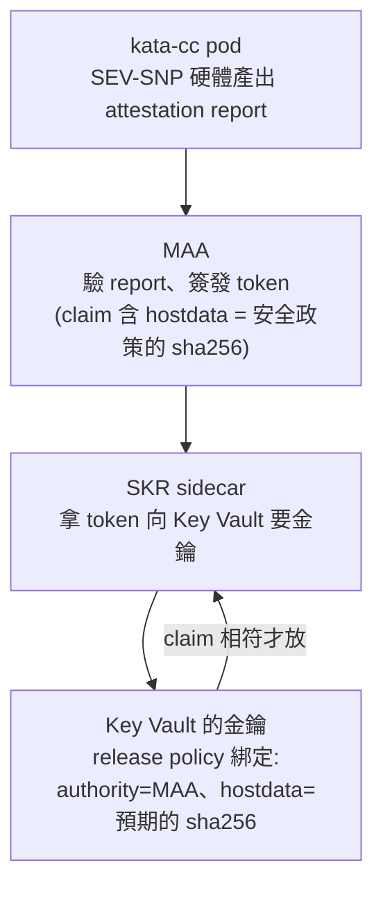

# Day 8: 遠端證明——MAA、SKR 與金鑰釋放政策

{ align=right width="80" }

> [Day 7](sprint4-day7-katacc.md) 的 pod 跑在真的 SEV-SNP 硬體上,但那只是「平台這麼說」。機密運算真正的價值不是「跑起來」,是**證明給遠端看它值得信任,才把祕密交給它**。今天做這件事:一個 pod 只有在硬體證明「我跑著預期的程式碼」時才拿得到金鑰;改一個環境變數,measurement 就變,金鑰立刻拿不到。這一章是整個 Part 2 最重要的一天。

!!! abstract "你在課程的哪裡"
    - **[Day 7](sprint4-day7-katacc.md)**:kata-cc pod 跑在 SEV-SNP 硬體上,取得平台層證據。
    - **今天**:接上 MAA(遠端證明)+ SKR sidecar + Key Vault Premium,做兩次部署對照——符合政策的 pod 拿得到金鑰、篡改過的 pod 被拒絕。
    - **接下來**:[Day 9](sprint4-day9-decision-matrix.md) 收尾——可逆性、成本、AKS kata-cc vs 上游 CoCo 的決策表。

## 證明先行,拿祕密在後

Day 5 說過一句話:機密運算「證明先行,拿祕密在後」。今天把這句話變成一條可運作的鏈:



關鍵在最後一步:金鑰有一份 **release policy**,說「只有在 MAA 簽的 token 裡 `hostdata` 等於**這個確切的值**時才釋放」。而那個 `hostdata` 是 pod 安全政策的 **sha256**(叫 WORKLOAD_MEASUREMENT)。**改任何一個 pod 設定 → 政策變 → sha256 變 → hostdata 不符 → 金鑰不放。** 這就是「祕密綁定到確切工作負載」。

今天四步:建基礎資源 → 建綁定證明的金鑰 → 部署符合的 pod(拿得到)→ 部署篡改的 pod(拿不到)。

## 步驟 1: 基礎資源

kata-cc 的 attestation 靠幾個 Azure 資源接起來:

```bash
# Key Vault Premium(HSM 金鑰)、MAA 證明服務、managed identity
az keyvault create -g <rg> -n <kv> --sku premium --enable-rbac-authorization true
az attestation create -g <rg> -n <maa> -l westeurope      # 慢,別用前景 2 分 timeout,見地雷 1
az identity create -g <rg> -n <mid>

# workload identity:managed identity ↔ 叢集 OIDC ↔ k8s service account
az identity federated-credential create --name skr-fic --identity-name <mid> -g <rg> \
  --issuer "<叢集 OIDC issuer>" --subject "system:serviceaccount:cc-lab:skr-sa" \
  --audience api://AzureADTokenExchange
kubectl create sa skr-sa -n cc-lab
kubectl annotate sa skr-sa -n cc-lab azure.workload.identity/client-id=<mid client id>

# 給 managed identity Key Vault 的密鑰角色
az role assignment create --role "Key Vault Crypto Officer" --assignee-object-id <mid principal> --scope <kv id>
az role assignment create --role "Key Vault Crypto User"    --assignee-object-id <mid principal> --scope <kv id>
```

!!! warning "RBAC「可能要等 24 小時」——但不保證會等"
    官方文件警告 managed identity 的角色指派快取「可能要 24 小時」才生效。本課實測**沒有撞到**——建金鑰即時成功、SKR 放金鑰也即時。但這不保證別人不會遇到;若 Day 8 卡在 `ForbiddenByRbac`,先確認是不是在等這個快取,而不是設定錯。

## 步驟 2: 建一把綁定證明的金鑰

先算出 pod 安全政策的 sha256(WORKLOAD_MEASUREMENT)。用 Day 7 那個 podman 繞道產政策,再在**本機**算 hash(azure-cli 容器裡沒有 `awk`,在容器裡算會對空輸入算出錯的值——[地雷 2](#mine-2)):

```bash
# 政策注入 consumer manifest 後,在 macOS 本機算:
POLICY_B64=$(grep 'agent.policy:' consumer-policy.yaml | sed 's/.*policy: //')
printf '%s' "$POLICY_B64" | base64 -d | shasum -a 256
# → ca8442bb3d17f7d85556b5c21682db11f2313cdbe3db1adcd27c89c3f88e720d
```

建一把 **exportable** 金鑰,release policy 綁定 MAA + `sevsnpvm` + 這個 hash:

```json
{
  "version": "1.0.0",
  "anyOf": [{
    "authority": "https://<maa>.weu.attest.azure.net",
    "allOf": [
      { "claim": "x-ms-attestation-type", "equals": "sevsnpvm" },
      { "claim": "x-ms-sevsnpvm-hostdata", "equals": "ca8442bb…720d" }
    ]
  }]
}
```

```bash
az keyvault key create --vault-name <kv> -n skr-key --kty RSA-HSM --size 3072 \
  --exportable true --policy release-policy.json
```

## 步驟 3: 符合政策的 pod → RELEASED

部署一個 kata-cc pod,裡面兩個容器:**SKR sidecar**(`mcr.microsoft.com/aci/skr`)加一個 app。app 呼叫 SKR 的 `/key/release` 要金鑰;因為預設政策擋 `exec`/`logs`([Day 7 地雷 5](sprint4-day7-katacc.md#mine-5)),app 把結果掛在一個 TCP 埠、從叢集內另讀([地雷 3](#mine-3)):

```console
# app 內部:curl SKR → SKR 取 SEV-SNP report → MAA 簽 token(hostdata=ca8442bb…)
#           → workload identity 呼叫 Key Vault → release policy 相符 → 放金鑰
$ curl http://<service>/          →  RELEASED
```

**RELEASED。** 完整的鏈跑通了:硬體證明 → MAA → 金鑰釋放,而且只因為這個 pod 的 measurement 正好等於金鑰綁定的值。

## 步驟 4: 篡改 → DENIED

現在做「篡改」:同一份工作負載,只給 app 容器**多加一個環境變數 `TAMPER=yes`**。這改變了 pod spec,於是安全政策變、sha256 變:

```console
# 篡改版的政策 hash:
a07958c9891de4f177cf6f1bf207b75d1c6ee78250f8064b968308e730c912b0
# ≠ 金鑰綁定的 ca8442bb…720d
```

篡改版**自己起得起來**(它有自己一致的政策),但要金鑰時:

```console
$ kubectl get pod skr-tampered            →  2/2 Running   （自己的政策相符自己）
$ curl http://<tampered-service>/         →  DENIED
```

**DENIED。** SNP report 的 `hostdata` 是 `a07958c9…`,不等於金鑰 release policy 綁的 `ca8442bb…`,Key Vault 拒絕釋放。**一個環境變數之差,金鑰就拿不到。** 這就是「祕密綁定到確切工作負載」最有力的實證——不是靠信任,是靠硬體證明加密碼學比對。

## 驗收 checkpoint

| 驗證 | 判準 | 本課環境的結果 |
|---|---|---|
| 符合政策 → 拿得到 | measurement 等於金鑰綁定值的 pod,SKR 放金鑰 | `hostdata=ca8442bb…` → **RELEASED** |
| 篡改 → 拿不到 | 改一個 env → measurement 變 → 被拒 | `hostdata=a07958c9…` → **DENIED** |

## 地雷記錄

### 地雷 1:`az attestation create` 慢,前景 2 分 timeout 會誤判失敗 {#mine-1}

**症狀**:前景跑 MAA 建立被 2 分 timeout 砍掉,`attestation show` 一時 `NotFound`,看起來像失敗。
**根因**:MAA 建立就是慢;背景重跑就成功(status `Ready`)。
**判斷準則**:MAA 這類慢操作用背景或長 timeout,別用前景 2 分砍完就當它失敗。

### 地雷 2:azure-cli 容器裡沒有 `awk`,hash 會對空輸入算 {#mine-2}

**症狀**:在 podman 的 azure-cli 容器裡用 `awk` 抽政策算 sha256,拿到 `e3b0c442…`——那是**空字串**的 sha256。
**根因**:`mcr.microsoft.com/azure-cli` 容器沒裝 `awk`,指令靜默失敗、對空輸入算了。
**修法**:hash 改在 macOS 本機從注入的政策 annotation 算(`base64 -d | shasum -a 256`)。**看到 `e3b0c442…` 就知道你算到的是空的。**

### 地雷 3:預設政策擋 exec/logs,結果只能用 TCP Service 讀 {#mine-3}

**根因**:kata-cc 預設政策 `ExecProcessRequest`/`ReadStreamRequest := false`,`kubectl exec`/`logs` 進不去 consumer 看 SKR 結果。
**繞法**:app 自己 curl SKR、把結果(RELEASED/DENIED)用 `nc -l` 掛在 TCP 埠,再從叢集內用 ClusterIP 讀(kata-cc 的 Service 只支援 TCP,剛好符合)。

## 帶得走的東西

- **機密運算的價值是「證明」,不是「加密」本身。** 記憶體加密讓主機讀不到;但真正有用的是「向遠端證明我跑著預期的程式碼,你才把祕密給我」。沒有這一步,加密只是自說自話。
- **祕密綁定到 measurement,而 measurement 綁定到整份工作負載。** release policy 綁的是安全政策的 sha256;改任何一個 pod 設定都會改 sha256。這就是為什麼「改一個 env → 拿不到金鑰」。
- **「起得來」和「拿得到祕密」是兩件事。** 篡改版 pod 自己起得來(它的政策相符自己),但它的 measurement 不符金鑰綁定值,所以拿不到。攻擊者換掉工作負載,pod 能跑,祕密拿不到。
- **控制平面的每一段都可能靜默失敗。** MAA 慢被誤判、容器沒 `awk` 算出空 hash、預設政策擋觀測——每一個都不報大錯,要靠「這個值看起來不對」自己抓。

## 延伸閱讀

想往下深挖,從這幾份開始:

- **[AKS Confidential Containers 部署(含 attestation)](https://learn.microsoft.com/en-us/azure/aks/deploy-confidential-containers-default-policy)** —— SKR sidecar、workload identity、Key Vault release policy 的一手流程;本課的 RELEASED/DENIED 對照就是它的精簡版。
- **[SKR(Secure Key Release)sidecar API](https://github.com/microsoft/confidential-sidecar-containers/blob/main/cmd/skr/README.md)** —— `/key/release` 的請求格式(`maa_endpoint`/`akv_endpoint`/`kid`),步驟 3 的一手依據。
- **[Microsoft Azure Attestation 總覽](https://learn.microsoft.com/en-us/azure/attestation/overview)** —— MAA 驗 SNP report、簽 token 的角色;release policy 的 `authority` 指的就是它。

## 下一步

Part 2 的動手到今天為止:概念(Day 5)、Kata(Day 6)、kata-cc(Day 7)、遠端證明(Day 8)。[Day 9](sprint4-day9-decision-matrix.md) 不動手,把這幾天收成一張決策表——AKS kata-cc 與上游 CoCo 的差別、拆除的可逆性、成本真帳,以及回頭把「主機該不該看得到工作負載」這個對比講完。

---

!!! quote ""
    Kubernetes 標誌為 CNCF(Linux Foundation)官方資產,此處作社群教學用途。
