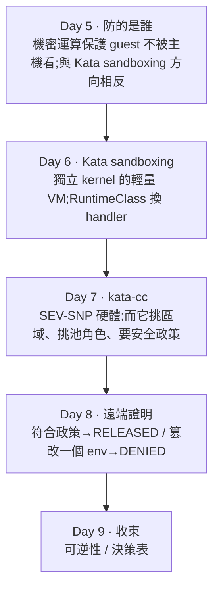

# Day 9: Part 2 總結——AKS kata-cc vs 上游 CoCo 決策表

{ align=right width="80" }

> Part 2 五天做完了:概念、Kata、kata-cc、遠端證明。這一天不動手,把它收成能拿去用的東西——移除節點池的可逆性、AKS kata-cc 跟上游 CoCo 差在哪,最後把「基礎設施該不該看得到工作負載」這個對比講完。這也是整門課的最後一頁。

!!! abstract "你在課程的哪裡"
    - **Day 5–8**:機密運算防誰、Kata sandboxing、kata-cc 機密硬體、遠端證明的金鑰釋放與篡改對照。
    - **今天**:不動手。可逆性、決策表、整季收束。
    - **接下來**:回[課程總覽](../index.md)。

## 走過的路(Part 2)



## 可逆性:移除 kata-cc 池,RuntimeClass 留著

拆除從移除 kata-cc 節點池開始。節點池刪掉之後,RuntimeClass 仍在:

```console
$ kubectl get runtimeclass          # kata-cc 節點池已刪
kata-cc-isolation   kata-cc    ← 還在
kata-vm-isolation   kata       ← 還在
# 剩下的系統節點 handlers:(空)
```

**跟 Sprint 3 Day 8 同一種情況**:RuntimeClass 是叢集層(etcd)物件,移除節點(節點層)不會清它。此時指 `kata-cc-isolation` 的 pod 會卡在「no runtime configured」——handler 在,實作沒了。要真的清乾淨,得 `kubectl delete runtimeclass` 或直接刪整座叢集。

## 決策表:AKS kata-cc vs 上游 CoCo

本課實測的是 **AKS 的 kata-cc**;上游 CoCo(自架)是另一套元件,這裡講解對照、不實作(peer-pods 的「每 pod 一台計費 VM」成本模型危險,刻意避開)。每一格標明是實測還是查證。

| 面向 | AKS kata-cc(實測) | 上游 CoCo(查證) |
|---|---|---|
| 執行底座 | Kata(OpenInfra)+ CoCo(CNCF Incubating) | 同 |
| 遠端證明驗證方 | **MAA**(Day 8 實測) | **Trustee / KBS** |
| 金鑰釋放 | **SKR sidecar + Key Vault release policy**(綁 hostdata,Day 8 實測) | KBS 直接管 secret |
| 產政策工具 | `az confcom katapolicygen`（macOS 沒實作→podman 繞道) | `genpolicy` |
| CoCo Operator | 用不到(AKS 受管) | **已封存(archived,截至 2026-08)**,呼應 Sprint 3 SpinKube 的「元件已死但教學還在教」 |
| peer-pods | 不做(成本模型危險) | 可選 |
| 節點 SKU | `_cc_v5`(SEV-SNP 可巢狀);**東京無、西歐有** | 視自備硬體 |
| 節點 OS | **只支援 AzureLinux** | 視發行版 |

**跨雲硬體對照**見 [Day 7](sprint4-day7-katacc.md)——Azure `_cc_v5` / GCP Confidential VM / AWS Nitro Enclaves / OpenStack 與地端裸機各自的前提;要點是機密運算永遠綁「CPU 有沒有那個硬體功能」,各家包成不同機型與服務名。

## 兩個 Part 收在同一個問題:主機該不該看得到工作負載

把 Sprint 4 兩半並排:

- **Part 1**——eBPF 與 mesh 把**流量邊界**交給基礎設施,而 eBPF 的立場是「從主機**看清楚**工作負載」:看得愈清楚,治理愈有力。
- **Part 2**——kata-cc 與 CoCo 把**記憶體邊界**交給硬體,而 CoCo 的立場是「讓主機**看不到** guest」:主機被列為 untrusted,連記憶體明文都不給。

**兩半對「主機該不該看得到工作負載」的立場正好相反。** 這是把服務網格與機密運算放進同一個 sprint 的回報——它們是同一個問題「基礎設施跟工作負載的信任關係」的兩個極端。而 Day 8 那個「改一個 env 就拿不到金鑰」的實測,是「不靠信任、靠硬體證明」這件事最具體的樣子。

## 帶得走的東西

- **AKS kata-cc 與上游 CoCo 同名不同物。** 一個走 MAA/SKR,一個走 Trustee/KBS;元件對得上但不一樣。看到「Confidential Containers」要先問是哪一套。
- **可逆性的斷點在叢集層與節點層之間。** 移除節點池,RuntimeClass 留在 etcd——跟 Sprint 3 的 shim 一樣。真的清乾淨要動叢集層物件。
- **可見性是能力也是風險——這一季給了兩個相反的極端。** eBPF 把治理建立在看得清楚,CoCo 把安全建立在看不到。哪個對,看你防的是誰。

## 誠實的差距

- **上游 CoCo(Trustee/KBS)純講解,未實機。** 決策表對它的陳述是查證與對照,不是實測。
- **peer-pods 未做**(計畫既定,成本模型危險)。
- **guest 內部 SNP report 未取**(靠 MAA token 的 claim 間接證明),符合計畫不押 `/dev/sev-guest`。
- **Part 1 的 BYOCNI × kata-cc(X0)沒在同一座叢集完整驗**——Kata 半邊 Day 6 驗過,kata-cc 因東京無 `_cc_v5` 換到西歐另建叢集(用預設網路),兩者沒疊在同一座上。

## 延伸閱讀

想往下深挖,從這幾份開始:

- **[AKS Confidential Containers 總覽](https://learn.microsoft.com/en-us/azure/aks/confidential-containers-overview)** —— kata-cc 的完整定位、限制(只支援 AzureLinux、Service 只支援 TCP、啟動較慢、不能用 `latest` tag),決策表很多格的一手依據。
- **[Confidential Containers 專案](https://confidentialcontainers.org/)** —— 上游 CoCo 的 Trustee/KBS 架構,對照 AKS 的 MAA/SKR。
- **[Sprint 3 Day 8:可逆性](sprint3-day8-reversibility.md)** —— 站內連結。RuntimeClass 殘留 etcd 的形狀今天重演,兩章並讀。

## 下一步

Sprint 4 到這裡結束,整門課也到這裡。四個 sprint 走完:GPU 排程(Sprint 1)、eBPF 與執行期安全(Sprint 2)、WebAssembly(Sprint 3)、服務網格與機密運算(Sprint 4)。而最後這一季把一個問題攤到兩個極端——**基礎設施到底該不該看得到工作負載在做什麼**:eBPF 讓主機看得清楚工作負載,CoCo 讓主機讀不到,立場相反。知道自己站哪一邊、防的是誰,比記住任何一條 `az` 指令都有用。

其餘 sprint 的入口在[課程總覽](../index.md)。

---

!!! quote ""
    Kubernetes 標誌為 CNCF(Linux Foundation)官方資產,此處作社群教學用途。
