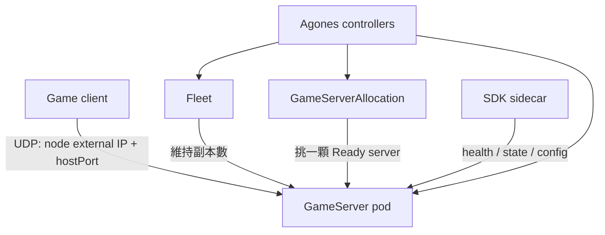
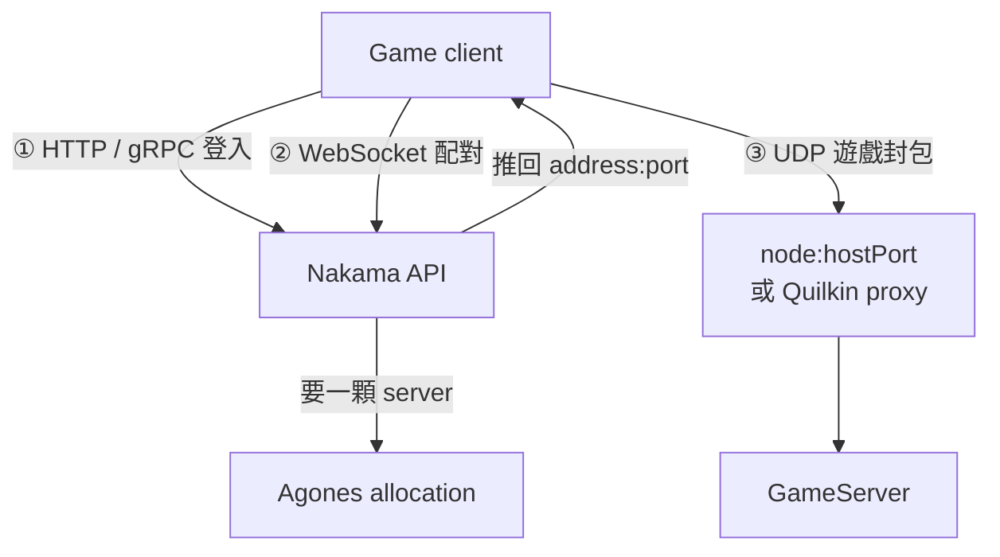

# Day 0: 遊戲伺服器平台概念——dedicated game server、Agones、生態查證

{ align=right width="90" }

> Sprint 5 要把 Kubernetes 用在一種不適合「隨時重排、隨時替換」的工作負載：多人遊戲的 dedicated game server。玩家連上去之後，連線綁在特定 pod、封包多半走 UDP，session 中途被 evict 不是一次平常的重啟。本章先講清楚 game server 跟一般 pod 差在哪，再看 Agones 用哪些 Kubernetes 物件補上 game server 編排需要的語意，最後看玩家端從登入到進入對戰會經過哪些服務。

!!! abstract "你在課程的哪裡"
    - **Sprint 1–4**：已經走過排程、觀測、執行期、服務網格與機密運算，主體多是平台層或無狀態服務。
    - **今天**：弄清楚 dedicated game server 跟一般 pod 差在哪。讀完要能說明一般 Kubernetes 排程為什麼不適合、Agones 三個核心 CRD 的分工，以及怎麼判斷一個開源專案是否還在維護。
    - **Day 1**：把 Agones 裝上 AKS，跑第一顆 `GameServer`，從叢集外用 UDP 直連到 node IP 與 hostPort。

## 為什麼 game server 不是一般 pod

一般 Kubernetes 的預設假設很清楚：服務最好無狀態、可以水平擴展，pod 掛掉或搬到別台節點時，前面用 Service 或 Ingress 接住。這套設計對 HTTP API 很合理，對一場正在進行的遊戲卻不合理。玩家連的是一顆已經持有房間狀態的 game server，換到其他副本就沒有這場對戰。那顆 pod 若被排程器或維護流程任意驅逐，斷掉的是進行中的玩家 session。

UDP 讓這個差異更明顯。Agones quickstart 的連線方式是 client 直接連 node 的外部 IP 與動態 hostPort，文件範例是：

```console
$ nc -u <node-ip> 7190
Hello World !
ACK: Hello World !
```

client 不經過 Service 的 ClusterIP，直接連 `status.address` 與 `status.ports[].port`。排程決策因此不只是找哪裡有 CPU 與記憶體，還決定了玩家接下來綁在哪個 node:port。

Agones 就是為這個問題設計的。官方 overview 把它定義為在 Kubernetes 上部署、執行與擴展 dedicated game server 的函式庫；同一頁把 `GameServer`、`Fleet`、`GameServerAllocation` 列為核心物件，controller 負責管理 CRD，SDK sidecar 負責健康檢查、狀態管理與設定。



`GameServer` 是單一伺服器實例，`Fleet` 是一組同樣規格的 game server，`GameServerAllocation` 則是配對或後端服務要把玩家分配到哪一顆時送出的請求。這三個名詞會從 Day 1 用到 Day 3：先讓一顆 server Ready，再讓 Fleet 維持固定數量，最後用 allocation 把 Ready 的 server 轉成 Allocated。

## 玩家端的連線全貌

上面講的是 server 端怎麼被排程。換到玩家這一側，遊戲 client 從打開遊戲到進入對戰，會依序連到兩種不同的服務，用三種不同的協定：

1. **登入**：client 用 HTTP（REST）或 gRPC 呼叫遊戲後端 Nakama，拿到 session token。這是一來一回的 request/response，跟一般 Web API 沒有差別。
2. **配對**：client 帶著 session token 開一條 WebSocket（Nakama 稱為 realtime socket），送出配對請求，然後在同一條連線上等配對結果。配對可能要等幾秒到幾分鐘，結果由 server 主動推下來，所以用長連線，不反覆輪詢。配對成立後，Nakama 向 Agones 要一顆 server，把 address:port 推回給 client。
3. **遊戲**：client 改用 UDP 把遊戲封包送到那顆 `GameServer`。可以直連 node IP 與 hostPort，也可以先經過 UDP proxy（Day 4 的 Quilkin），由 proxy 依封包裡的 token 轉送。



登入與配對走 TCP，遊戲封包走 UDP，理由不同。登入、配對、儲存資料都需要每一筆請求確實送達，慢個幾十毫秒沒關係，TCP 的重送與順序保證正好適用。對戰中的封包則大多是「角色現在在哪」這種資料：新的一包到了，舊的那包就沒有價值。TCP 遇到掉包時會停下來等重送，後面已經到達的新資料也只能排隊等，玩家看到的就是卡頓。所以即時遊戲多半用 UDP，需要可靠傳送的部分（例如「開槍」事件）由遊戲自己的網路層補上。

每一段各自帶不同的憑證，名稱相近，用途完全不同：

| 憑證 | 誰發的 | 用在哪一段 | 用途 |
|---|---|---|---|
| server key | 遊戲開發者設定在 Nakama 與 client 裡 | ① 登入 | 證明請求來自這款遊戲的 client，換取 session token；不是玩家個人的密碼 |
| session token | Nakama 登入成功後發給玩家 | ① 之後的 API 呼叫、② 開 WebSocket | 代表「這個玩家已登入」，有效期限內每次呼叫都帶著 |
| matchmaker ticket | Nakama 收到配對請求時回給 client | ② 配對 | 代表一筆排隊中的配對請求，取消配對時用它指定是哪一筆 |
| routing token | 平台在分配 server 時產生，交給 client | ③ 遊戲（經 Quilkin 時） | 附在每個 UDP 封包尾端，讓 proxy 知道要轉給哪顆 `GameServer` |

## Agones 的生命週期欄位

Agones `GameServer` reference 給出幾個 Day 1 會直接碰到的欄位。狀態機的主線是 `Scheduled`、`Ready`、`Allocated`、`Shutdown`。`portPolicy` 預設為 `Dynamic`，由系統挑一個空的 hostPort；`Static` 才是使用者指定 hostPort，`Passthrough` 則是讓 containerPort 跟著選到的 hostPort。

健康檢查與 SDK server 也有預設值：

```text
spec.health:
  initialDelaySeconds: 5
  periodSeconds: 5
  failureThreshold: 3

spec.sdkServer:
  grpcPort: 9357
  httpPort: 9358
```

這些數字會決定後面怎麼判讀狀態。尤其是 `portPolicy: Dynamic`：Day 1 的 server 會拿到隨機 hostPort，所以 NSG 不能只放單一 port，要放一段 Agones 使用的 UDP 範圍。

## 判斷開源專案是否還在維護

決定要不要採用一個開源專案之前，先看一手狀態。下表是截至 2026-08 各專案的維護狀態，資料來源為 GitHub API 與 CNCF：

| 專案 | 最新 release | default branch 最後 commit | 狀態（截至 2026-08） |
|---|---|---|---|
| Agones | v1.60.0（2026-08-12），約 6 週一版；CNCF Sandbox（2026-03-23） | 2026-08-24 | 活躍維護 |
| Nakama | v3.40.0（2026-07-13），約每月一版；Heroic Labs 單一公司維護 | 2026-08-25 | 活躍維護 |
| Quilkin | v0.10.1（2026-05-26） | 2026-08-18 | 維護中；官方自述 beta、pre-1.0，API 可能變動 |
| Open Match | v1.8.1（2023-12-13） | 2024-07-10 | 停止維護 |
| Open Match 2 | 尚無正式 release（2024-02 建立） | 2026-01-05 | 開發中，尚無正式 release |
| nakama-unity | v3.21.1（2026-02-13） | — | 維護中，版本落後 server；2026-09-17 發布 v3.22.0 |
| Nakama Python client | 無官方 client；社群 nakama-python 停在 2021 | — | 沒有可用的維護中版本，改用 REST／WebSocket API 直接呼叫 |

截至 2026-08，Agones 與 Nakama 都在活躍維護；Quilkin 也在維護，但仍是 pre-1.0，API 可能變動；Open Match v1 已停止維護，Open Match 2 還沒有正式 release。

## 一條可以重做的查證規則

生態查證不能只看搜尋摘要，也不能只看 repo 有沒有新的 PR。Open Match 就是這個盲點的實例：repo 上仍看得到 PR 與分支活動，但上表的 default branch 最後 commit 停在 2024-07-10，最後一次正式 release 停在 2023-12。

判斷一個開源專案是否還值得採用，至少看兩個訊號：default branch 最後一次有效 commit，以及最後一次正式 release。`pushed_at`、open PR、dependabot 分支與搜尋摘要都只能當線索，不能當結論。

## 地雷記錄

### 地雷 1:repo 有 PR 不代表專案還活著 {#mine-1}

**症狀**：照舊教材或搜尋摘要把 Open Match 當成仍在活躍開發的 matchmaking 選項，甚至因為 repo 上還看得到 PR，就決定在新專案採用它。

**根因**：`pushed_at` 與 open PR 會被任何分支推高，包含相依性更新分支。搜尋摘要看到 repo 有活動，很容易把分支上的零星更新誤判成主線維護。

**修法**：看 default branch 最後 commit 與最後 release。截至 2026-08，Open Match v1 的 default branch 最後 commit 是 2024-07-10，最後發版是 v1.8.1（2023-12-13）；Open Match 2 雖然是接班方向，但尚無正式 release，default branch 最後 commit 是 2026-01-05，還不適合在新專案採用。

## 帶得走的東西

- Dedicated game server 的對戰狀態在 server 自己的記憶體裡，不能像 stateless request 那樣換一個副本接手；玩家的 session 與連線本身就是排程要保護的對象。
- Agones 的主要連線模型是 client 直連 node 外部 IP 與 hostPort，中間沒有 Service。
- `GameServer`、`Fleet`、`GameServerAllocation` 分別回答「一顆 server」、「一組 server」與「把玩家分到哪一顆」。
- 玩家端要走三段：HTTP／gRPC 登入、WebSocket 配對、UDP 遊戲封包；每段的目的地與憑證都不同。
- 判斷專案是否還在維護，看 default branch 最後 commit 與最後 release，不看搜尋摘要。

## 延伸閱讀

想往下深挖，從這幾份開始：

- **[Agones overview](https://agones.dev/site/docs/overview/)** —— Agones 的定位、核心物件與 dedicated game server 的問題範圍。
- **[Agones GameServer reference](https://agones.dev/site/docs/reference/gameserver/)** —— `GameServer` 生命週期、port policy、health 與 SDK server 欄位。
- **[建立第一顆 GameServer](https://agones.dev/site/docs/getting-started/create-gameserver/)** —— 官方 quickstart 的 UDP 直連範例，Day 1 會在 AKS 上照做。
- **[UDP vs. TCP(Gaffer On Games)](https://gafferongames.com/post/udp_vs_tcp/)** —— 遊戲網路程式的經典文章，說明 TCP 掉包時的等待為什麼會讓即時遊戲卡頓。
- **[Agones 進入 CNCF Sandbox](https://www.cncf.io/blog/2026/03/23/agones-moves-to-the-cncf-a-new-era-for-open-source-multiplayer-game-infrastructure/)** —— Agones 治理狀態的時間點來源。
- **[Open Match releases](https://github.com/googleforgames/open-match/releases)** —— 判斷 Open Match v1 停擺時，用來對照最後正式發版。

## 下一步

[Day 1](sprint5-day1-agones-first-gameserver.md) 在 AKS 上安裝 Agones，建立第一顆 `GameServer`，並從叢集外送 UDP 封包拿到 `ACK`。

---

!!! quote ""
    Agones 標誌為 CNCF（Linux Foundation）官方資產，此處作社群教學用途。
