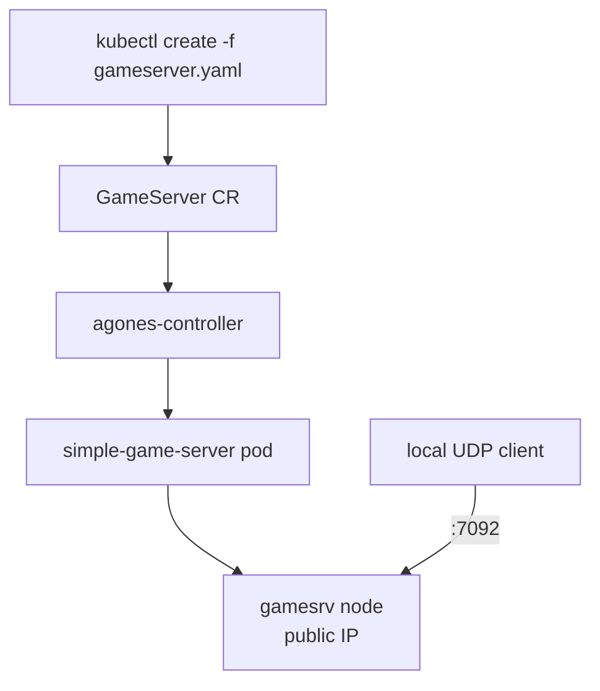

# Day 1: Agones 第一顆 GameServer——安裝、節點公網 IP、UDP 直連

{ align=right width="90" }

> Agones 的玩家連線模型是 client 直連 node IP 與 hostPort。今天在 AKS 上實際跑一次：開一組有節點公網 IP 的 game-server 節點池、安裝 Agones 1.60、建立第一顆 `GameServer`，最後從叢集外用 UDP 送出一行文字並收到 echo。

!!! abstract "你在課程的哪裡"
    - **Day 0**：已經知道 dedicated game server 為什麼不能被當成一般 stateless pod，以及 Agones 三個核心 CRD 的分工。
    - **今天**：裝 Agones、建立第一顆 `GameServer`。驗收：`simple-game-server` 進入 `Ready`，取得 node 公網 IP 與動態 hostPort，外部 UDP client 收到 `ACK: Hello Agones from client`。
    - **Day 2**：把單顆 `GameServer` 提升成 `Fleet`，讓 Agones 維持固定數量的 Ready server。

## Agones 與 GameServer

Deployment 假設 pod 可以隨時被殺掉重建，遊戲伺服器做不到這一點：對戰進行中，玩家的連線綁在**那一顆** pod 上，換一顆就是斷線。Agones 用幾個自訂資源（CRD）把「一台遊戲伺服器」變成 Kubernetes 認得的物件，並管好它從啟動、可以接受玩家連線、被分配給玩家，到結束的整個生命週期。

最小的物件是 `GameServer`。一顆 `GameServer` 對應一個 pod，裡面跑你的遊戲程式，Agones 會自動在旁邊加上 SDK sidecar；遊戲程式透過它告訴 Agones「我準備好了」。Agones 另外做一件 Deployment 不會做的事：在節點上開一個 hostPort，把它記在 `GameServer.status.address` 與 `status.ports`，玩家直接連這組 node IP + port，中間沒有 Service。



game server pod 用 `nodeSelector` 釘在 `role=gameserver` 的節點池，因為這組節點有公網 IP；`portPolicy: Dynamic` 讓 Agones 挑一個 hostPort，外部 client 連的是 `GameServer.status.address` 與 `status.ports[].port`。

**你需要什麼**：

- 一座 AKS 叢集，Kubernetes 版本在 Agones 1.60 支援範圍內（1.34–1.36）。本章的輸出來自 1.34.10。
- 一個有節點公網 IP 的 game-server 節點池（步驟 1）。沒有節點公網 IP，client 就打不到 node:hostPort，只能改走 LoadBalancer 或其他路由層，那是 Day 4 的做法。
- 本機的 `kubectl`、`helm`、`az` 與 `nc`。

動手前用 `kubectl config current-context` 確認 kubectl 指向你的叢集。

## 步驟 1:建立 game-server 節點池

game-server 節點池要有節點公網 IP，並帶上 `role=gameserver` label，讓後面的 `GameServer` 用 `nodeSelector` 排上來：

```console
$ az aks nodepool add -g <RESOURCE-GROUP> --cluster-name <CLUSTER> -n gamesrv \
    --node-count 2 --node-vm-size Standard_D2s_v5 --enable-node-public-ip \
    --labels role=gameserver --mode User
```

`<RESOURCE-GROUP>` 與 `<CLUSTER>` 是你建立 AKS 時用的 resource group 與叢集名稱，可以用 `az aks list -o table` 查到。建好後用 `kubectl get nodes -o wide` 確認 gamesrv 節點的 `EXTERNAL-IP` 欄位有值。

## 步驟 2:安裝 Agones 1.60

Agones 1.60 在 Kubernetes 1.34 上的預設 Helm 安裝會撞到 CRD 驗證問題（見[地雷 1](#mine-1)）。做法是把 CRD 與控制面拆開裝：CRD 用 `kubectl create --validate=false`，Helm release 則關掉 CRD 安裝。

**CRD**：Agones chart 的 5 個 CRD 放在 `templates/crds/`。先加入 Agones 的 Helm repo，再用 `helm template --show-only` 只渲染這 5 個檔案，交給 `kubectl create --validate=false`：

```console
$ helm repo add agones https://agones.dev/chart/stable
$ helm repo update
$ helm template agones agones/agones --version 1.60.0 -n agones-system \
    --show-only templates/crds/fleet.yaml \
    --show-only templates/crds/fleetautoscaler.yaml \
    --show-only templates/crds/gameserver.yaml \
    --show-only templates/crds/gameserverallocationpolicy.yaml \
    --show-only templates/crds/gameserverset.yaml \
  | kubectl create --validate=false -f -
```

用 `create` 是因為它不需要 patch；`--validate=false` 讓 apiserver 不因 CRD 裡那兩個不合法的欄位而拒收。建立成功時會印出 5 行 `customresourcedefinition... created`，對應 `fleets`、`fleetautoscalers`、`gameservers`、`gameserverallocationpolicies`、`gameserversets` 這 5 個 CRD。

**控制面**：用 Helm 安裝，但 chart 不要碰 CRD：

```console
$ helm install agones agones/agones --version 1.60.0 \
    --set agones.crds.install=false \
    -n agones-system --create-namespace --wait
STATUS: deployed
```

裝完後，`kubectl -n agones-system get pods` 應看到 9 顆 pod 全部 `1/1 Running`：`agones-allocator` 3 顆、`agones-controller` 2 顆、`agones-extensions` 2 顆、`agones-ping` 2 顆。

`agones-controller` 處理 `GameServer`、`Fleet` 與 `GameServerSet`。`agones-allocator` 是給叢集外呼叫 allocation 用的 gRPC／REST 服務；在叢集內建立 allocation 時，直接對 Kubernetes API 建立 `GameServerAllocation` 就好，不需要經過它。`agones-ping` 提供讓 client 量測延遲的 ping 服務。

## 步驟 3:建立第一顆 GameServer

[`gameserver.yaml`](https://github.com/DeepWaveLab/CloudNativePracticing/blob/main/labs/sprint5/day1/gameserver.yaml) 的主體如下，映像是 Agones 範例 `simple-game-server:0.43`，容器 port 是 `7654`，hostPort 由 Agones 動態配置：

```yaml
apiVersion: agones.dev/v1
kind: GameServer
metadata:
  generateName: simple-game-server-
spec:
  ports:
    - name: default
      portPolicy: Dynamic
      containerPort: 7654
  template:
    spec:
      nodeSelector:
        role: gameserver
      containers:
        - name: simple-game-server
          image: us-docker.pkg.dev/agones-images/examples/simple-game-server:0.43
          resources:
            requests: {memory: 64Mi, cpu: 20m}
            limits: {memory: 64Mi, cpu: 20m}
```

因為 metadata 用的是 `generateName`，這份檔案要用 `kubectl create`，不能用 `kubectl apply`（見[地雷 2](#mine-2)）：

```console
$ kubectl create -f gameserver.yaml
gameserver.agones.dev/simple-game-server-8vlf6 created
$ kubectl get gameserver -o wide
NAME                       STATE   ADDRESS          PORT   NODE
simple-game-server-8vlf6   Ready   <NODE-IP>   7092   aks-gamesrv-18046246-vmss000000
```

看三個欄位：`STATE` 是 `Ready`，`ADDRESS` 是 game-server 節點的公網 IP，`PORT` 是 Agones 配出的動態 hostPort。

## 步驟 4:放行 Agones 使用的 UDP port range

AKS 節點前面還有 NSG。`GameServer` 已經拿到 hostPort，不代表 Internet 可以打進去。這裡直接放行 `7000-8000/UDP`：

```console
$ az network nsg rule create -g <NODE-RESOURCE-GROUP> \
    --nsg-name <NSG-NAME> -n allow-agones-udp \
    --priority 1000 --direction Inbound --access Allow --protocol Udp \
    --destination-port-ranges 7000-8000 --source-address-prefixes Internet
```

`<NODE-RESOURCE-GROUP>` 是 AKS 自動建立、放節點 VM 的 resource group（名稱以 `MC_` 開頭），可以用 `az aks show -g <RESOURCE-GROUP> -n <CLUSTER> --query nodeResourceGroup -o tsv` 查到；`<NSG-NAME>` 用 `az network nsg list -g <NODE-RESOURCE-GROUP> --query "[].name" -o tsv` 查。

這裡放的是 port range，因為 `portPolicy: Dynamic` 不保證下一顆 server 還是同一個 port。Fleet 與 autoscaler 會陸續建立新的 server，只放單一 port，後面的 server 會隨機連不上。

## 步驟 5:從叢集外用 UDP 直連

回到本機，對 `GameServer` status 回報的 address 與 port 送 UDP 封包：

```console
$ printf 'Hello Agones from client\n' | nc -u -w4 <NODE-IP> 7092
ACK: Hello Agones from client
```

client 沒有打 Kubernetes Service，也沒有打 LoadBalancer，直接打到 node 公網 IP 與 Agones 分配的 hostPort。收到 `ACK` 表示封包穿過 NSG、進到該 node 的 hostPort，最後被 `simple-game-server` 處理。

## 自我檢查

- `kubectl -n agones-system get pods`：controller、extensions、allocator、ping 全部 `1/1 Running`。
- `kubectl get crd | grep agones.dev`：列出 `fleets`、`gameservers`、`gameserversets`、`fleetautoscalers`、`gameserverallocationpolicies` 這 5 個 CRD。
- `kubectl get gameserver -o wide`：`STATE` 是 `Ready`，`ADDRESS` 是 game-server 節點的公網 IP，`PORT` 落在 7000–8000。
- 從本機用 `nc -u` 送到該 address 與 port，收到 `ACK:` 開頭的回應。

## 地雷記錄

### 地雷 1:Agones 1.60 CRD 在 Kubernetes 1.34 預設安裝失敗 {#mine-1}

**症狀**：`helm install agones` 對 `fleets`、`gameservers`、`gameserversets` 三個 CRD 報 `server-side apply failed ... failed to create typed patch object`。改用 `kubectl apply --server-side` 會撞同一個錯；改 `kubectl create` 又會報 `strict decoding error: unknown field "...x-kubernetes-patch-strategy"` 與 `"...x-kubernetes-patch-merge-key"`。

**根因**：這三個 CRD 內嵌 `PodTemplateSpec` schema，帶了 `x-kubernetes-patch-strategy` 與 `x-kubernetes-patch-merge-key`。這些不是合法的 CRD structural schema 擴充；Kubernetes 1.34 apiserver 的嚴格欄位驗證會拒收，server-side apply 也建不出 typed patch。Agones chart 又把 CRD 放在 `templates/crds/`，所以 `--skip-crds` 不會跳過它們。

**修法**：先從 Helm template 抽出 5 個 CRD，用 `kubectl create -f - --validate=false` 建立；接著 `helm install` 加 `--set agones.crds.install=false`，讓 chart 不再碰 CRD。安裝失敗過一次的叢集會留下 cluster-scoped 物件，重裝前要按名字清掉殘留的 PriorityClass、APIService、webhook、ClusterRoleBinding、ServiceAccount、Secret、RoleBinding 與 PDB。

### 地雷 2:kubectl apply 不接受 generateName {#mine-2}

**症狀**：對使用 `metadata.generateName` 的 `GameServer` manifest 下 `kubectl apply`，會得到 `error: cannot use generate name with apply`。

**根因**：`apply` 要能追蹤同一個物件的宣告狀態；`generateName` 的語意是每次建立新物件，沒有固定名稱可讓 apply 對齊。

**修法**：建立這類一次性 `GameServer` 時用 `kubectl create -f gameserver.yaml`。Day 2 的 `Fleet` 有固定 `metadata.name`，就可以回到 `kubectl apply`。

## 帶得走的東西

- Agones 在 AKS 上可以用 UDP 直連模式，但節點池要有公網 IP，NSG 也要放行對應的 UDP port range。
- `portPolicy: Dynamic` 的重點在 Agones 配出的 hostPort；client 連的是 status 裡的 address 與 port。
- 在 Kubernetes 1.34 上，Agones chart 內嵌的 CRD 會讓 `helm install` 直接失敗；CRD 要先另外建立，chart 再關掉 CRD 安裝。
- 有 `generateName` 的物件是「建立新實例」，不能用 `apply` 套用。

## 延伸閱讀

想往下深挖，從這幾份開始：

- **[Agones on Azure Kubernetes Service](https://agones.dev/site/docs/installation/creating-cluster/aks/)** —— 官方的 AKS 建叢集說明，包含 `--enable-node-public-ip` 與 NSG 放行 7000–8000/UDP 的做法。
- **[Install Agones using Helm](https://agones.dev/site/docs/installation/install-agones/helm/)** —— Helm 安裝參數，包括本章用到的 `agones.crds.install`。
- **[建立第一顆 GameServer](https://agones.dev/site/docs/getting-started/create-gameserver/)** —— 對照本章的 `kubectl get gs`、node address、port 與 `nc -u` 連線方式。
- **[Agones releases](https://github.com/googleforgames/agones/releases)** —— 本章使用 `1.60.0`，升級前先看這裡的 release notes。

## 下一步

單顆 `GameServer` 證明了 UDP 直連可用。[Day 2](sprint5-day2-fleet-lifecycle.md) 把這份規格包成 `Fleet`，並驗證刪掉一顆 server 後 Agones 會自動補回來。

---

!!! quote ""
    Agones 標誌為 CNCF（Linux Foundation）官方資產，此處作社群教學用途。
