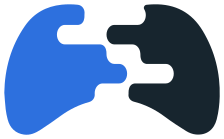
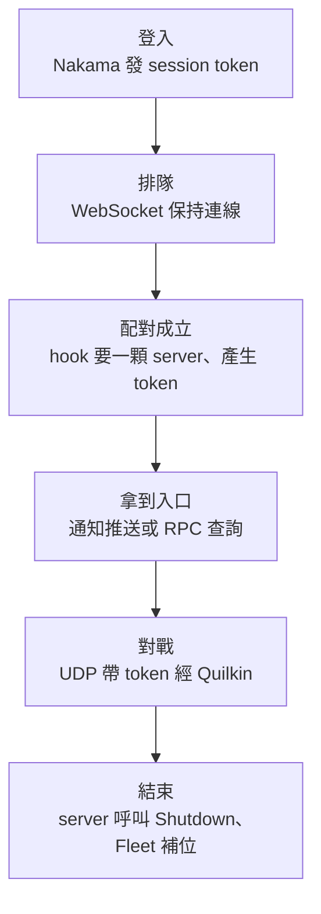

# Day 10: 遊戲伺服器平台總結——十天回顧、實務取捨、沒教的主題

{ align=right width="90" }

> 十天前，Sprint 5 從一個問題開始：為什麼 dedicated game server 不能當成一般的 pod 來管。現在每一段答案都親手跑過：Agones 管 server 的生命週期，Quilkin 讓封包進到正確的 server，Nakama 管玩家身分與配對，最後兩個 Unity 視窗在同一顆 server 上互相看到對方移動。今天不動手：回顧這條路、談實務上怎麼取捨，並列出這門課沒教的部分。

!!! abstract "你在課程的哪裡"
    - **Day 0–9**：從第一顆 GameServer 走到 relay server 上的多人同步。
    - **今天**：不動手。回顧、取捨、沒教的主題。

## 走完十天之後

一場對戰在這套平台上的樣子，現在可以用一張圖講完：

這條路上，平台只在兩個時間點需要知道遊戲的狀況：配對成立時要一顆 server，對戰結束時把它還回去。其他時候三個元件各自運作：Agones 管 GameServer 的生命週期，Quilkin 管 UDP 封包的路由，Nakama 管玩家身分與配對。它們之間只靠 allocation、routing token 與 hook 接起來，所以任何一段都能單獨換掉。[Day 9](sprint5-day9-unity-client.md) 把 echo server 換成 relay 時，Agones 與 Quilkin 的設定沒有改；改的是 Fleet 的名稱與 image、Nakama Lua module 的 allocation selector，以及一個指定 Fleet 名稱的 runtime env。

Day 0 開場的三個說法，十天下來都有了實測結果。

「連線綁在特定 pod」成立，而且不只綁在 pod：玩家拿到的 token 寫在那一顆 GameServer 的 annotation 上，那顆 server 消失，token 就沒有對象了。[Day 8](sprint5-day8-observability-resilience.md) 的節點失效演練裡，Fleet 在 pod 被驅逐後 2 秒內補上了新的 server，但原本那場對戰沒有接續下去，帶著舊 token 的探測一直 timeout 到手動停止。

「封包多半走 UDP」也成立，而且可以說得更精確：登入、排隊、拿入口都走 TCP，這幾步慢一點沒關係，漏一次卻不行；真正走 UDP 的只有對戰中的封包。元件也正好沿著這條線切開：Nakama 管 TCP 那一半，Quilkin 與 GameServer 管 UDP 那一半。

「session 中途被 evict 不是一次平常的重啟」也成立，而且 Kubernetes 本身不會替你擋。Agones 在它看得到的地方保護得很好，Fleet 縮容時一顆 Allocated 都不碰；可是節點直接消失時，玩家 2 秒就斷線，平台要 8 分多鐘才知道。狀態回報得越早，平台反應越快：game server 自己呼叫 `Shutdown()` 是 1 秒，崩潰靠 health check 是 4 秒，節點消失靠 Kubernetes 是分鐘級（都是 Day 8 量到的數字）。所以 game server 應該在對戰結束時主動呼叫 `Shutdown()`，不要等平台透過 health check 或節點狀態發現。

還有一件事在十天裡一再出現：官方範例跟手上的版本對不上。Quilkin 的 relay 範例跑不起來（[Day 4](sprint5-day4-quilkin-udp-proxy.md)）、Agones 的 CRD 過不了新版 Kubernetes 的驗證（[Day 1](sprint5-day1-agones-first-gameserver.md)）、simple-game-server 的 README 描述的行為跟原始碼不同（[Day 8](sprint5-day8-observability-resilience.md)）。遊戲伺服器這一圈的專案迭代很快，Quilkin 到 2026-09 都還是 pre-1.0。照抄之前，先對照同一個版本的原始碼與 changelog。

## 真的要做的時候

先看遊戲本身。卡牌、回合制這類遊戲，每一步都是一次請求、一次回應，對局狀態存在資料庫裡，任何一個副本都能接下一步；這種遊戲用不到 Agones 的 allocation 與生命週期管理，一般的 Deployment 加上 Nakama 的 RPC 應該就夠了。格鬥、射擊、競速這類即時對戰，一場對戰綁在一顆 server 上、每秒幾十個封包，才是這整套架構派上用場的地方。

不必一次全上。玩家還不多的時候，Agones 加上直連節點 IP 就能開始，這是 [Day 1](sprint5-day1-agones-first-gameserver.md) 的做法；等需要固定入口、需要擋掉來路不明的封包，再把 Quilkin 加進來，client 那邊只是把入口從 `address:port` 換成「proxy 位址加 token」。已經有自己帳號與配對系統的團隊，也不必為了 game server 換成 Nakama：在自家配對服務湊齊玩家的那一刻，呼叫 Kubernetes API 建立 `GameServerAllocation`，就是 [Day 6](sprint5-day6-matchmaking.md) 那段 Lua hook 做的事，換成任何語言都是同一個 HTTP 請求。

不論選了哪些元件，下面這些都跑不掉。game server 要在對戰結束時自己呼叫 `Shutdown()`，否則容量不會還回來。監控不能只看 Agones 的 GameServer 計數，要同時看節點是否 Ready，因為節點失聯時那個計數會照舊回報好幾分鐘。client 要把斷線當成正常情況，斷了就回 Nakama 重新排隊或查詢自己被分到哪裡。game server 也要確認加入的人是誰：Day 9 的 relay 只要 token 對就讓人進來，正式環境應該在玩家加入時向後端驗證配對名單。

這些元件都還在快速變動。選型時，讓兩三個候選各跑一次端到端流程，看它們在你的環境裡實際卡在哪裡。

## 這門課沒教的

**遊戲本身的網路同步。** relay 收到位置就轉發，沒有插值、預測、延遲補償，也沒有防作弊。這些是遊戲網路程式的核心，跟平台無關，而且值得一整門課；[Gaffer On Games](https://gafferongames.com/) 的系列文章是很好的起點。

**權威 server。** 要擋作弊，server 必須自己計算遊戲狀態，不能只轉發。常見的做法是用遊戲引擎做 dedicated server build，例如 Unity 搭配 [Agones 的 Unity SDK](https://agones.dev/site/docs/guides/client-sdks/unity/)，由引擎在 server 端跑完整的遊戲邏輯。

**多區域與就近連線。** 玩家分散在各地時，要讓 client 量測到各區域的延遲再選最近的；Agones 內建的 ping service 就是為此設計的，搭配多叢集部署使用。

**spot 回收前的預告。** Azure Spot VM 被回收前，可以透過 Scheduled Events 收到通知（best effort，最多提前 30 秒）。這段時間夠不夠通知玩家、收掉對戰，以及通知沒有送到時怎麼辦，都要另外設計。

**Nakama 的正式維運。** PostgreSQL 高可用、備份還原、TLS、更換預設金鑰、多節點 Nakama，這些主題請見 [Nakama 的官方文件](https://heroiclabs.com/docs/nakama/)。

**matchmaking 的其他路線。** Open Match 是 Nakama 內建 matchmaker 以外常被提到的路，但截至 2026-08，v1 已停止維護、v2 還沒有正式 release，還不適合在新專案採用，值得持續觀察。

## 延伸閱讀

想往下深挖，從這幾份開始：

- **[Agones overview](https://agones.dev/site/docs/overview/)** —— 把這十天用到的 `GameServer`、`Fleet`、`GameServerAllocation` 與 SDK sidecar 放回官方的整體架構裡再看一次。
- **[Gaffer On Games](https://gafferongames.com/)** —— 遊戲網路程式的經典系列：UDP、可靠傳輸、狀態同步，對應「這門課沒教的」第一項。
- **[Agones Unity SDK](https://agones.dev/site/docs/guides/client-sdks/unity/)** —— 往權威 server 走的起點，對應 relay 用到的 `Ready`、`Health`、`Shutdown`。
- **[Nakama 文件](https://heroiclabs.com/docs/nakama/)** —— 正式維運、權威 match、排行榜與其他後端功能。

## 下一步

Sprint 5 到這裡結束。回到[課程總覽](../index.md)，可以看到五個 sprint 各自的主題。

---

!!! quote ""
    Agones 標誌為 CNCF（Linux Foundation）官方資產，此處作社群教學用途。
