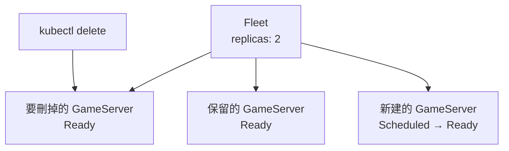

# Day 2: Fleet 生命週期——replicas、狀態機、自動補位

{ align=right width="90" }

> 真實平台不能靠單顆 server 等玩家，要常備一批 Ready server，少一顆就補一顆。今天用 `Fleet` 把 `simple-game-server` 擴成兩顆，觀察 `Scheduled` 到 `Ready` 的狀態機，最後刪掉其中一顆，確認 Fleet controller 會補出新的 server。

!!! abstract "你在課程的哪裡"
    - **Day 1**：Agones 已安裝完成，第一顆 `GameServer` 取得 node 公網 IP 與 hostPort，外部 UDP echo 已驗證。
    - **今天**：把單顆 server 變成 `Fleet`。驗收：`replicas: 2` 維持 2 顆 Ready；刪掉其中一顆後 Fleet 自動補一顆新的，另一顆不受影響。
    - **Day 3**：用 `GameServerAllocation` 從 Ready pool 裡挑一顆轉成 `Allocated`，再用 `FleetAutoscaler` 補回 buffer。

## Fleet 控制的是可用容量

`Fleet` 是 Agones 裡「一組同規格 `GameServer`」的物件。對照 Kubernetes 既有概念，它有點像 Deployment 加 ReplicaSet：你宣告想要幾個副本，controller 負責把實際數量維持回來。差別在於 Deployment 管的是一般 pod，`Fleet` 管的是可以被分配出去的 game server；它看的是 `GameServer` 在 Agones 生命週期裡的狀態，pod 是否 Running 只是其中一步。

遊戲平台通常不等玩家來了才臨時開 server。新 pod 要排程、拉映像、啟動程序、通過 SDK `Ready()`，中間任何一步慢了，玩家就在配對完成後乾等。沒有 `Fleet`，平台就得在玩家上門時才開 server；有了它，平台常備一批 `Ready` server，少一顆補一顆，後端或 matchmaker 隨時有容量可以拿。

在 `Fleet` 裡，`Scheduled` 表示 Agones 已經替 `GameServer` 建立 pod 並安排到節點；`Ready` 表示遊戲程式已透過 SDK 告訴 Agones 可以接玩家；`Allocated` 表示這顆 server 已經被一次 allocation 拿走，不能再分給下一組玩家；`Shutdown` 則是遊戲結束或控制面收掉時的狀態。



## 步驟 1:建立 replicas 為 2 的 Fleet

先刪掉 Day 1 建立的 `GameServer`（`kubectl delete gameserver <名稱>`），讓清單裡只剩 Fleet 產生的 server。

[`fleet.yaml`](https://github.com/DeepWaveLab/CloudNativePracticing/blob/main/labs/sprint5/day2/fleet.yaml) 沿用 Day 1 的 `simple-game-server:0.43` 與 `portPolicy: Dynamic`，差別是外層改成 `Fleet`，並指定 `replicas: 2`：

```yaml
apiVersion: agones.dev/v1
kind: Fleet
metadata:
  name: simple-game-server
spec:
  replicas: 2
  template:
    spec:
      ports:
        - name: default
          portPolicy: Dynamic
          containerPort: 7654
      template:
        spec:
          nodeSelector:
            role: gameserver
          containers:
            - name: simple-game-server
              image: us-docker.pkg.dev/agones-images/examples/simple-game-server:0.43
              resources:
                requests: {memory: 64Mi, cpu: 20m}
                limits: {memory: 64Mi, cpu: 20m}
```

套用後，Fleet 立刻回報 desired、current 與 ready 都是 2：

```console
$ kubectl apply -f fleet.yaml
fleet.agones.dev/simple-game-server created
$ kubectl get fleet simple-game-server -o wide
NAME                 SCHEDULING   DESIRED   CURRENT   ALLOCATED   READY   AGE
simple-game-server   Packed       2         2         0           2       4s
```

`SCHEDULING` 是 `Packed`，代表 Agones 以 packed strategy 放置 game server，盡量把 server 集中在少數節點上。

## 步驟 2:確認兩顆 GameServer 都 Ready

查 `GameServer` 可以看到 Fleet 產生的兩顆實例：

```console
$ kubectl get gameserver
simple-game-server-ql5ws-cmk28   Ready   7113
simple-game-server-ql5ws-fbkn4   Ready   7040
```

名稱是 Fleet 名稱加上兩段隨機尾碼，port 各自不同。下一步刪掉其中一顆；下面刪的是 `cmk28`，照做時換成你清單裡的名稱。

## 步驟 3:刪掉一顆 GameServer

直接刪掉 `cmk28`：

```console
$ kubectl delete gameserver simple-game-server-ql5ws-cmk28
gameserver "...cmk28" deleted
```

幾秒後再查：

```console
$ kubectl get gameserver
simple-game-server-ql5ws-fbkn4   Ready       7040    ← 沒被刪的那顆
simple-game-server-ql5ws-qdsfl   Scheduled   7358    ← Fleet 新建的，正在轉 Ready
```

被刪的 `cmk28` 消失；沒被刪的 `fbkn4` 名稱與 port 都沒變；Fleet controller 建立一顆新的 `qdsfl` 補回 desired replicas，它先進 `Scheduled`，再轉成 `Ready`。Fleet 不會重啟被刪的那顆。

Fleet 維持的是副本數，補回來的實例會換一個新名稱；沒被刪的 server 也不會因為補位而被重建。後者對遊戲平台很重要：玩家已經連上的 server，不能因為 Fleet 在補別的 server 就受到影響。

要精準量補位時間時，不要只看一次 `kubectl wait --for=jsonpath readyReplicas=2` 的結果。刪除的瞬間，終止中的那顆可能還算在 ready 數裡，所以 wait 會短暫命中 2，接著才掉到 1，再由新 server 補回。改用連續取樣。

## 自我檢查

- `kubectl get fleet simple-game-server`：`DESIRED`、`CURRENT`、`READY` 都是 2，`ALLOCATED` 是 0。
- `kubectl get gameserver`：兩顆都是 `Ready`，名稱都以 `simple-game-server-` 開頭，後面接隨機尾碼。
- 刪掉其中一顆後再查：被刪的那顆消失，出現一顆名稱不同的新 GameServer，由 `Scheduled` 轉成 `Ready`。
- 沒被刪的那顆，名稱與 port 都跟刪除前一樣。

## 帶得走的東西

- `Fleet` 維持的是 Ready 容量，不綁定某一顆 server 的名稱。
- `Scheduled → Ready` 是 Agones 自己的 `GameServer` 狀態機，不等同於 pod phase。
- 刪掉一顆 server 後，Fleet 會補出新 server；沒被刪的 server 不會一起重建。
- 量補位時間要連續取樣，單次 `kubectl wait` 可能在舊 pod 終止中時提早命中。

## 延伸閱讀

想往下深挖，從這幾份開始：

- **[Fleet Specification](https://agones.dev/site/docs/reference/fleet/)** —— `Fleet` 的完整欄位，包括 `replicas`、`scheduling` 與更新策略。
- **[Quickstart: Create a Game Server Fleet](https://agones.dev/site/docs/getting-started/create-fleet/)** —— 官方的 Fleet 操作範例，可以對照本章的建立與補位流程。
- **[Agones GameServer reference](https://agones.dev/site/docs/reference/gameserver/)** —— 查 `Scheduled`、`Ready`、`Allocated`、`Shutdown` 各狀態的定義。

## 下一步

[Day 3](sprint5-day3-allocation-autoscaler.md) 送出 `GameServerAllocation`，從 Ready pool 挑一顆轉成 `Allocated`，再讓 `FleetAutoscaler` 補回 2 顆 Ready buffer。

---

!!! quote ""
    Agones 標誌為 CNCF（Linux Foundation）官方資產，此處作社群教學用途。
