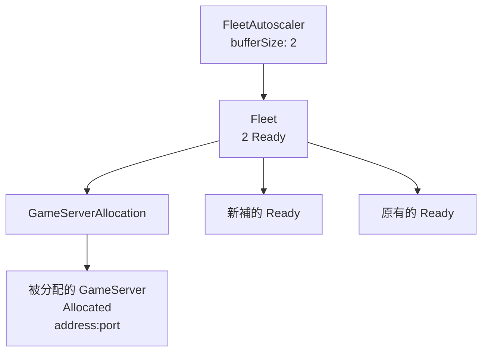

# Day 3: Allocation 與 autoscaler——GameServerAllocation、buffer、受保護狀態

{ align=right width="90" }

> 玩家不會自己挑 pod。平台的下一步是由後端或 matchmaker 送出 allocation 請求，拿到一組可連線的 IP 與 port。今天用 `GameServerAllocation` 把一顆 Ready server 轉成 `Allocated`，再用 `FleetAutoscaler` 的 buffer policy 補回 Ready 容量。

!!! abstract "你在課程的哪裡"
    - **Day 2**：`simple-game-server` Fleet 已維持 2 顆 Ready；刪掉一顆後會自動補出新的。
    - **今天**：送出 `GameServerAllocation` 並啟用 buffer autoscaler。驗收：allocation 選中的那顆轉成 `Allocated` 並回傳 address 與 port；Fleet replicas 從 2 補到 3，保持 1 顆 Allocated 加 2 顆 Ready。
    - **Day 4**：在 allocation 前面加 UDP proxy，讓玩家不用直接拿 node IP 與 hostPort。

## Allocation 把 Ready 容量變成玩家入口

`GameServerAllocation` 是後端或 matchmaker 丟給 Agones 的一次性請求，意思是「從符合條件的 `GameServer` 裡挑一顆可用的 server」。挑選與標記在同一個操作裡完成，同一顆不會同時被兩個請求拿走。成功後，它除了物件名稱，還會回 `status.address` 與 `status.ports`；這組 address:port 就是玩家端接下來要連的入口。

`Allocated` 是這套流程的關鍵狀態。server 一旦被 allocation 拿走，就不應再分給下一組玩家，也不應被 autoscaler 當成閒置容量縮掉。少了這個狀態，平台只能看到「pod 還活著」，卻不知道它是不是已經承載一場對戰；縮容或重複分配都會發生，而且從資料上看起來一切正常，壞掉的是玩家體驗。

`FleetAutoscaler` 的 buffer policy 跟一般 HPA 不同。HPA 多半看 CPU、記憶體或自訂指標來調整副本數；buffer policy 看的是「還剩幾顆 Ready server 可以立刻分配」，跟 server 忙不忙無關。當 allocated 數量增加，buffer policy 會把 replicas 拉高，維持固定的閒置庫存。



## 步驟 1:建立 buffer 為 2 的 FleetAutoscaler

[`fleetautoscaler.yaml`](https://github.com/DeepWaveLab/CloudNativePracticing/blob/main/labs/sprint5/day3/fleetautoscaler.yaml) 指向 Day 2 的 `simple-game-server` Fleet，policy 使用 `Buffer`：

```yaml
apiVersion: autoscaling.agones.dev/v1
kind: FleetAutoscaler
metadata:
  name: simple-game-server-autoscaler
spec:
  fleetName: simple-game-server
  policy:
    type: Buffer
    buffer:
      bufferSize: 2
      minReplicas: 0
      maxReplicas: 10
```

套用後查 Fleet 狀態。目前沒有 allocated server，原本的 2 顆 Ready 已經滿足 buffer：

```console
$ kubectl apply -f fleetautoscaler.yaml
fleetautoscaler.autoscaling.agones.dev/simple-game-server-autoscaler created
```

`kubectl get fleet simple-game-server` 的 DESIRED 到 READY 四欄（節錄）：

```text
NAME                 DESIRED   CURRENT   ALLOCATED   READY
simple-game-server   2         2         0           2
```

`bufferSize: 2` 不是固定 replicas 等於 2，而是「扣掉 Allocated 之後，還要留 2 顆 Ready」。所以一旦分配出去一顆，desired replicas 就會變成 3。

## 步驟 2:送出 GameServerAllocation

[`gameserverallocation.yaml`](https://github.com/DeepWaveLab/CloudNativePracticing/blob/main/labs/sprint5/day3/gameserverallocation.yaml) 只用 selector 指向 `simple-game-server` Fleet：

```yaml
apiVersion: allocation.agones.dev/v1
kind: GameServerAllocation
spec:
  selectors:
    - matchLabels:
        agones.dev/fleet: simple-game-server
```

用 `kubectl create` 建立一次性 allocation，並直接把回傳欄位印出來：

```console
$ kubectl create -f gameserverallocation.yaml \
    -o jsonpath='STATE={.status.state} GS={.status.gameServerName} ADDR={.status.address}:{.status.ports[0].port}'
STATE=Allocated  GS=simple-game-server-ql5ws-fbkn4  ADDR=<NODE-IP>:7040
```

後端要交給玩家端的就是這三個欄位：狀態是 `Allocated`，server 是 `simple-game-server-ql5ws-fbkn4`，連線位置是 `<NODE-IP>:7040`。被選中的這顆從 Ready pool 被拿走，不再是可分配的庫存。

## 步驟 3:等待 autoscaler 補回 Ready buffer

allocation 之後，Ready 少了一顆。`FleetAutoscaler` 經過一次 reconcile，把 replicas 拉到 3：

```console
$ kubectl get fleet simple-game-server -o wide    # 下面節錄 DESIRED 到 AGE 欄
NAME                 DESIRED   CURRENT   ALLOCATED   READY   AGE
simple-game-server   3         3         1           2       104s
$ kubectl get gameserver
simple-game-server-ql5ws-cpqgc   Ready       7263    ← buffer 新補
simple-game-server-ql5ws-fbkn4   Allocated   7040    ← 受保護,未被縮掉
simple-game-server-ql5ws-qdsfl   Ready       7358
```

最後有 3 顆 server：`fbkn4` 是 Allocated，`qdsfl` 是原本留下來的 Ready，`cpqgc` 是 buffer 新補出來的 Ready。

Day 2 的 `replicas: 2` 是固定宣告；裝上 autoscaler 後，replicas 改由 buffer policy 決定：allocated 數量是 0 時 desired 是 2，變成 1 時 desired 就是 3。這是 game server pool 常見的容量模型：已分配出去的 server 不算庫存，庫存是 Ready。autoscaler 另外補新的 Ready server，已分配出去的那顆維持 Allocated。

補位不是同步完成的，要等 autoscaler 下一次 reconcile，再加上新 server 的排程與啟動。監控或測試腳本要把這段延遲算進去，不要在 allocation 回應後立刻檢查 Ready 數。

## 自我檢查

- `kubectl get fleetautoscaler`：出現 `simple-game-server-autoscaler`。
- allocation 的回應裡，`STATE` 是 `Allocated`，並帶有一顆具名的 GameServer 與 address:port。
- 等幾秒後 `kubectl get fleet simple-game-server`：`ALLOCATED` 是 1、`READY` 是 2，`DESIRED` 比 allocation 前多 1。
- `kubectl get gameserver`：被 allocation 選中的那顆仍是 `Allocated`，沒有被縮掉。

## 帶得走的東西

- `GameServerAllocation` 是後端向 Agones 要 server 的 API，回傳的是玩家可用的 address 與 port。
- `Allocated` 表示 server 已被拿走，不會進入下一次分配，也不會被當成閒置容量縮掉。
- `FleetAutoscaler` 的 buffer policy 補的是 Ready 庫存，所以 allocated 越多，desired replicas 會跟著增加。
- 判斷 pool 是否健康時，要同時看 `ALLOCATED` 與 `READY`，只看 `CURRENT` 會漏掉可分配容量。

## 延伸閱讀

想往下深挖，從這幾份開始：

- **[GameServerAllocation Specification](https://agones.dev/site/docs/reference/gameserverallocation/)** —— allocation 的 selector、回傳的 `status` 欄位，以及 Day 4 會用到的 `metadata`。
- **[Fleet Autoscaler Specification](https://agones.dev/site/docs/reference/fleetautoscaler/)** —— `Buffer` policy 的 `bufferSize`、`minReplicas`、`maxReplicas`，以及其他 policy 類型。
- **[Quickstart: Create a Fleet Autoscaler](https://agones.dev/site/docs/getting-started/create-fleetautoscaler/)** —— 官方的 buffer autoscaler 操作範例。
- **[Allocator Service](https://agones.dev/site/docs/advanced/allocator-service/)** —— 需要從叢集外呼叫 allocation 時的 gRPC／REST 入口；在叢集內直接建立 `GameServerAllocation` 時用不到。

## 下一步

[Day 4](sprint5-day4-quilkin-udp-proxy.md) 在這個直連模型前面加上 Quilkin UDP proxy，讓玩家不必直接拿 node IP 與 hostPort，由 proxy 依 token 決定封包送往哪顆 server。

---

!!! quote ""
    Agones 標誌為 CNCF（Linux Foundation）官方資產，此處作社群教學用途。
