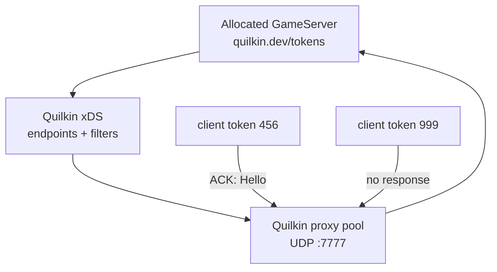

# Day 4: Quilkin UDP proxy——xDS、token routing、錯誤 token 阻擋

{ align=right width="88" }

> 到 Day 3 為止，玩家拿到的是 node IP 與 hostPort。今天在這條直連路徑前面加上 Quilkin：client 改打同一個 UDP LoadBalancer，由 Quilkin 依封包裡的 token 轉送到被分配的 `GameServer`。驗收除了封包能通，也要確認帶錯 token 的封包會被擋下。

!!! abstract "你在課程的哪裡"
    - **Day 3**：`GameServerAllocation` 已能把一顆 Ready server 轉成 `Allocated`，並回傳 node IP 與 hostPort。
    - **今天**：在 Agones 前面加 Quilkin xDS control plane 與 proxy pool。驗收：正確 token 經 Quilkin LB 連到 allocated `GameServer`，錯誤 token 無回應。
    - **Day 5**：把遊戲後端補上來，部署 Nakama 與 PostgreSQL，先驗 REST 認證與 storage 讀寫。

## Quilkin 是什麼，為什麼要在 game server 前面放 proxy

Quilkin 是 Embark Studios 維護的 UDP proxy，放在遊戲 client 與 dedicated game server 之間。截至 2026-09，Quilkin 仍是 pre-1.0，API 還會變動，舊文件與範例不能直接照抄；但它補上了 Day 1–3 直連模型的幾個缺口：client 不必直接看到 node IP、入口可以固定在一個 UDP LoadBalancer、proxy 可以做存取控制與量測，後端換 server 的細節也能留在控制面處理。

直連模型下，Day 3 的 allocation 回傳的是 node IP 與 hostPort，代表玩家知道叢集節點的位置，而且每顆 server 都是不同的 node:hostPort。沒有 proxy，節點位置就直接暴露給玩家，也沒有地方擋掉來路不明的封包。Quilkin 把入口改成「client 固定打 proxy，proxy 再轉給 allocated `GameServer`」。封包仍是 UDP，由 proxy 依 token 指定轉給哪一顆 server，不像 Kubernetes Service 隨機挑一個 pod。

xDS 是 Envoy 生態常用的動態設定協定：proxy 從控制面取得 endpoint 與 filter 設定。Quilkin 的 xDS control plane 會看 Agones 裡被 allocation 標上 token 的 `GameServer`，把它們轉成 proxy 可用的 endpoint；同時讀 ConfigMap 裡的 filter chain。token routing 的做法是：封包尾端帶一段 token，proxy 先把 token 擷取出來，再靠它決定這包要送到哪顆 game server。

本章採用 Quilkin 的 non-transparent UDP proxy 模型，也就是 client 知道自己連的是 proxy，並在封包裡附上 token。client 不再直接拿 Agones 回傳的 node IP 與 hostPort，改打 Quilkin Service 的 `EXTERNAL-IP:7777`。proxy 收到封包後，Capture filter 先抓封包尾端 3 bytes 當 token，並把 token 從 payload 移除；TokenRouter 再用 token 找到對應 endpoint。

xDS control plane 要同時開兩個 provider：`--provider.k8s.agones` 把 Allocated `GameServer` 轉成 endpoint，`--provider.k8s` 讀 ConfigMap 裡的 Capture 與 TokenRouter filters。少開任何一個，路由就不完整（見[地雷 3](#mine-3)）。

本章使用 Quilkin image `ghcr.io/embarkstudios/quilkin:0.10.0-3d8eaef`，也就是官方 xDS 範例指定的版本。這版 image 的 CLI 已經改成 flag 形式，舊文件或範例裡的 `relay`、`agent`、`proxy`、`manage` 子指令不能直接照抄。用這版 image 起一顆一次性 pod 執行 `--help`，會看到子指令只剩三個，其餘功能全部是 `--service.*` 與 `--provider.*` flag（下面節錄 Commands 段）：

```console
$ kubectl run quilkin-help --rm -i --restart=Never \
    --image=ghcr.io/embarkstudios/quilkin:0.10.0-3d8eaef -- --help
Commands:
  generate-config-schema  Generates JSON schema files for known filters
  qcmp
  help
```

這裡用 xDS 架構：一顆 `quilkin-manage-agones` 提供 xDS，三顆 `quilkin-proxies` 對外收 UDP。Quilkin 官方另有一套 relay 範例，和這版 image 的 CLI 對不上，照著部署會撞到[地雷 1](#mine-1) 與[地雷 2](#mine-2)。



## 步驟 1:部署 Quilkin xDS control plane

control plane 的關鍵是同時啟用 Kubernetes provider 與 Agones provider。下面節錄 Deployment 的 args 與 image，完整 manifest（含 ServiceAccount、RBAC 與 Service）見 [`xds-control-plane.yaml`](https://github.com/DeepWaveLab/CloudNativePracticing/blob/main/labs/sprint5/day4/xds-control-plane.yaml)：

```yaml
apiVersion: apps/v1
kind: Deployment
metadata:
  labels:
    role: xds
  name: quilkin-manage-agones
spec:
  template:
    spec:
      containers:
        - name: quilkin
          args:
            - --service.xds
            - --provider.k8s
            - --provider.k8s.agones
          image: ghcr.io/embarkstudios/quilkin:0.10.0-3d8eaef
```

同一份 manifest 也帶入 filter ConfigMap。Capture 抓 suffix 3 bytes，`remove: true` 表示轉送給 game server 前會把 token 從 payload 剝掉：

```yaml
apiVersion: v1
kind: ConfigMap
metadata:
  name: quilkin-xds-filter-config
  labels:
    quilkin.dev/configmap: "true"
data:
  quilkin.yaml: |
    version: v1alpha1
    filters:
      - name: quilkin.filters.capture.v1alpha1.Capture
        config:
          suffix:
            size: 3
            remove: true
      - name: quilkin.filters.token_router.v1alpha1.TokenRouter
```

用 `kubectl apply -f xds-control-plane.yaml` 部署。control plane pod 要到 `1/1 Running`；下一步的 proxy 部署好之後，它們的 log 應出現 `Connected to management server` 與 `entering xDS stream loop`，表示已從 control plane 取得 xDS 設定。

## 步驟 2:部署 UDP proxy pool

proxy pool 對外開 UDP `7777`，並向 control plane 取 xDS 設定。下面是節錄，完整 manifest 見 [`xds-proxy-pool.yaml`](https://github.com/DeepWaveLab/CloudNativePracticing/blob/main/labs/sprint5/day4/xds-proxy-pool.yaml)：

```yaml
apiVersion: apps/v1
kind: Deployment
metadata:
  labels:
    role: proxy
  name: quilkin-proxies
spec:
  replicas: 3
  template:
    spec:
      containers:
        - name: quilkin
          image: ghcr.io/embarkstudios/quilkin:0.10.0-3d8eaef
          args:
            - --service.udp
            - --provider.xds.endpoints=http://quilkin-manage-agones
          ports:
            - containerPort: 7777
              protocol: UDP
---
apiVersion: v1
kind: Service
metadata:
  name: quilkin-proxies
spec:
  ports:
    - port: 7777
      protocol: UDP
      targetPort: 7777
  selector:
    role: proxy
  type: LoadBalancer
```

用 `kubectl apply -f xds-proxy-pool.yaml` 部署，三顆 proxy 都要到 `1/1 Running`。查看 Service 取得對外入口：

```console
$ kubectl get svc quilkin-proxies
quilkin-proxies   LoadBalancer   10.0.32.213   <LB-IP>   7777:32477/UDP
```

從這一步開始，client 的固定入口是 `EXTERNAL-IP` 欄位的位址加上 port 7777，不再是 Day 1–3 的 node IP 與 hostPort。

## 步驟 3:用 allocation annotation 帶入 token

Quilkin 的 Agones provider 會讀 `GameServer` metadata 裡的 `quilkin.dev/tokens` annotation，值是 token 的 base64。這裡沿用官方範例的 token：`NDU2` 是 `456` 的 base64。完整檔案見 [`gameserverallocation-token.yaml`](https://github.com/DeepWaveLab/CloudNativePracticing/blob/main/labs/sprint5/day4/gameserverallocation-token.yaml)：

```yaml
apiVersion: allocation.agones.dev/v1
kind: GameServerAllocation
spec:
  selectors:
    - matchLabels:
        agones.dev/fleet: simple-game-server
  metadata:
    annotations:
      quilkin.dev/tokens: NDU2
```

建立 allocation 後，Agones 回傳一顆 allocated server，這顆 `GameServer` 上也帶著 annotation：

```console
$ kubectl create -f gameserverallocation-token.yaml \
    -o jsonpath='STATE={.status.state} GS={.status.gameServerName} ADDR={.status.address}:{.status.ports[0].port}'
STATE=Allocated  GS=simple-game-server-ql5ws-b5xr7  ADDR=<NODE-IP>:7499
$ kubectl get gameserver simple-game-server-ql5ws-b5xr7 -o jsonpath='{.metadata.annotations.quilkin\.dev/tokens}'
NDU2
```

`kubectl logs deploy/quilkin-manage-agones` 可以看到 control plane 把這顆 server 轉成 endpoint：log 裡依序會有 `providers=["agones","k8s"]`、`applying server <NODE-IP>:7499 tokens=["NDU2"]`，以及 `InitDone old_num_endpoints=0 new_num_endpoints=1`。`new_num_endpoints=1` 表示 proxy 現在有一個可轉送的目標。

## 步驟 4:驗正確 token 與錯誤 token

正確 token `456` 放在 payload 尾端。Quilkin 收到 `Hello456` 後，Capture 會剝掉 `456`，所以 game server 收到的是 `Hello`：

```console
$ printf 'Hello456' | nc -u -w4 <LB-IP> 7777
ACK: Hello
```

錯 token `999` 必須沒有回應：

```console
$ printf 'Hello999' | nc -u -w3 <LB-IP> 7777
```

指令在 3 秒 timeout 後結束，stdout 沒有任何內容。

正向與負向兩個測試都要做。只驗 `ACK` 會漏掉最嚴重的失效模式：proxy 仍然轉發 UDP，但 TokenRouter 根本沒有載入（[地雷 3](#mine-3)）。

## 自我檢查

- `kubectl get pods -l role=xds` 與 `kubectl get pods -l role=proxy`：control plane 1 顆、proxy 3 顆，全部 `1/1 Running`。
- `kubectl get svc quilkin-proxies`：類型是 `LoadBalancer`，`EXTERNAL-IP` 有值，port 是 `7777/UDP`。
- `kubectl logs deploy/quilkin-manage-agones`：出現 `providers=["agones","k8s"]`，以及帶 token 的 endpoint。
- 帶正確 token 送到 LB，收到的 `ACK:` 後面不含 token；帶錯誤 token 送出，沒有任何回應。

## 地雷記錄

### 地雷 1:relay 範例的 Service 同時選到 relay 與 agent {#mine-1}

**症狀**：照官方 relay quickstart 部署時，proxies 連 `quilkin-relay-agones:7800` 出現 transport error；用 `kubectl logs deploy/quilkin-relay-agones` 看到的可能是 agent log，訊息包含 `Found 2 pods, using pod/quilkin-agones-agent…`。

**根因**：`relay-control-plane.yaml` 裡 relay 與 agent 兩個 Deployment 都貼 `role: xds`，Service selector 也是 `role: xds`。agent 不聽 7800/7900，卻被放進 endpoint。

**修法**：relay 與 agent 用不同 label，例如 `role: relay` 與 `role: agent`，Service 只選 relay。xDS 範例只有一個 `role: xds` Deployment，沒有這個問題。

### 地雷 2:relay 範例的子指令與 image CLI 對不上 {#mine-2}

**症狀**：relay 與 agent pod 進入 `CrashLoopBackOff`，log 顯示 `error: unrecognized subcommand 'relay'` 或 `error: unrecognized subcommand 'agent'`。

**根因**：`relay-control-plane.yaml` 還在用舊式子指令，但同一份範例指定的 image `0.10.0-3d8eaef` 已改成 flag 式 CLI，`quilkin --help` 只剩 `generate-config-schema`、`qcmp`、`help` 三個子指令。

**修法**：改用 `examples/agones-xonotic-xds/`，或把 relay/agent manifest 改成 `--service.*` 與 `--provider.*` flags。Quilkin pre-1.0 的範例與 CLI 需要一起驗，不只看 image tag。

### 地雷 3:xDS 只開 Agones provider 會變成沒有存取控制的轉發器 {#mine-3}

**症狀**：pod 全 Ready、endpoint 也有 token，UDP 封包能通；但 `Hello456` 回 `ACK: Hello456`，代表 token 沒被剝掉，`Hello999` 也回 `ACK: Hello999`，代表錯 token 也被放行。整個過程沒有錯誤訊息。

**根因**：官方 xDS 範例的 `xds-control-plane.yaml` 只帶 `--service.xds --provider.k8s.agones`。這會 watch `GameServer` 產生 endpoint，但不讀 filter ConfigMap，proxy `/config` 會看到 `FILTERS []`。反過來只開 `--provider.k8s` 則有 filters、沒有 endpoint。兩者要同時開。

**修法**：control plane args 改成 `--service.xds --provider.k8s --provider.k8s.agones`。驗收時 proxy `/config` 必須同時有 endpoints 與 filters，並且一定要做負向測試：錯誤 token 必須無回應。

## 帶得走的東西

- Quilkin 讓 client 固定打 UDP LoadBalancer，再由 token 決定要轉到哪顆 allocated `GameServer`。
- `--provider.k8s.agones` 與 `--provider.k8s` 是互補關係：前者給 endpoint，後者給 filters。
- Capture 的 `remove: true` 可以用回應內容驗證；`ACK: Hello` 表示 token 沒送進 game server payload。
- 安全性元件的驗收要包含負向測試，否則「能通」可能只是失去控管的轉發。

## 正式環境還要補的

token 要由 matchmaker 或認證服務隨機產生，在 allocation 時寫進 annotation，不能用固定值。多個 endpoint、多組 token 同時存在，以及 token 重複時的路由行為，上線前要另外驗證。

## 延伸閱讀

想往下深挖，從這幾份開始：

- **[Quilkin Agones Provider](https://embarkstudios.github.io/quilkin/main/book/providers/agones.html)** —— 查 `quilkin.dev/tokens` annotation、Agones endpoint 與 filter ConfigMap 的來源。
- **[Quilkin with Agones and Xonotic xDS quickstart](https://embarkstudios.github.io/quilkin/main/book/deployment/quickstarts/agones-xonotic-xds.html)** —— 對照本章的 xDS control plane、proxy `/config` 與 token routing 流程。
- **[Quilkin changelog](https://github.com/EmbarkStudios/quilkin/blob/main/CHANGELOG.md)** —— 對照 `relay`、`agent`、`proxy`、`manage` 子指令移除後的 CLI 變更。
- **[Agones third party examples: Quilkin](https://agones.dev/site/docs/third-party-content/examples/)** —— Agones 官方把 Quilkin 放在第三方整合案例，說明它在 dedicated game server 路由與存取控制中的位置。

## 下一步

[Day 5](sprint5-day5-nakama-postgres.md) 部署 Nakama 與 PostgreSQL，補上玩家帳號與狀態儲存，先把後端的 REST 認證與 storage 讀寫跑通。

---

!!! quote ""
    Quilkin 吉祥物為 Embark Studios 之官方資產，此處作社群教學用途。
