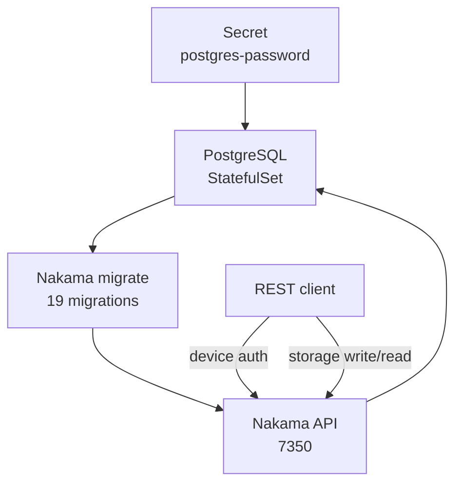

# Day 5: Nakama 與 PostgreSQL——migrate、REST auth、storage

{ align=right width="72" }

> UDP 封包怎麼進到正確的 `GameServer`，Day 4 已經處理完。今天補上遊戲後端：Nakama 負責帳號、session 與 storage，PostgreSQL 負責資料庫。部署完成後要確認：Nakama 能完成 migration、REST device auth 能拿到 session token、storage 寫入後能讀回同一筆內容。

!!! abstract "你在課程的哪裡"
    - **Day 4**：Quilkin proxy pool 已能用 token routing 把正確封包送到 allocated `GameServer`，錯 token 無回應。
    - **今天**：在 AKS 上部署單副本 PostgreSQL 與 Nakama 3.40.0。驗收：`migrate up` 套用 19 個 migration，HTTP healthcheck 200，REST auth 與 storage roundtrip 成功。
    - **Day 6**：把 Nakama matchmaker 接到 Agones allocation，讓兩個 realtime client 配到同一顆 `GameServer`。

## Nakama 是什麼，為什麼需要 PostgreSQL

Nakama 是 Heroic Labs 維護的開源遊戲後端伺服器，常見能力包含帳號、session、storage、好友、排行榜、即時訊息與 matchmaker。它跟前幾天的 Agones game server 分工不同：Nakama 管玩家身分、社交關係、長期狀態與配對入口；`GameServer` 管一場正在進行的對戰。玩家先登入 Nakama、排隊等配對，配對成立後再拿到 Agones 分配的遊戲伺服器 endpoint（對應 [Day 0](sprint5-day0-game-server-concepts.md) 玩家端連線的 ① 與 ②）。

這些後端資料不能只放在 pod 記憶體裡。帳號、session、storage object、好友與排行榜都需要可靠儲存，所以 Nakama 啟動時必須連到 PostgreSQL 或 CockroachDB。單節點部署用 PostgreSQL 最簡單；CockroachDB 適合需要多區域寫入的情況。

### Nakama 對 client 開哪些介面

Nakama 啟動後會聽四個 port，client 會用到的只有前兩個：

| port | 介面 | 給誰用 |
|---|---|---|
| 7350 | HTTP API gateway：REST（`/v2/...`）與 realtime WebSocket（`/ws`） | 遊戲 client |
| 7349 | gRPC API，內容與 7350 的 REST 相同 | 遊戲 client 或其他後端服務 |
| 7351 | 管理介面（console）的 HTTP gateway | 營運人員 |
| 7348 | 管理介面的 gRPC | 營運人員 |

同一個 7350 上有兩種用法。REST 與 gRPC 是一來一回的 request/response，適合登入、讀寫 storage、查好友這類「client 問、server 答」的操作。realtime WebSocket 是長連線，server 可以隨時主動把訊息推給 client，配對結果、聊天訊息、通知都走這條。配對必須開 WebSocket，因為 Nakama 的 matchmaker 只接受 socket 連著的玩家，socket 一斷，排隊中的配對請求也會一起取消。

內建 API 不夠用時，遊戲後端的自訂邏輯用 **RPC** 對外開放。開發者在 server runtime（Lua、Go 或 TypeScript）裡用 `register_rpc` 註冊一個函式，client 就能用 REST（`POST /v2/rpc/<函式名稱>`）、gRPC 或 realtime socket 呼叫它，例如「領取每日獎勵」「查詢自訂排行榜」。RPC 在 Nakama 裡指的是「client 主動呼叫 server 端自訂函式」；Day 6 用的 hook 則相反，是 server 在特定事件（例如配對成立）發生時自動執行的函式，client 不會直接呼叫它。

manifest 裡的 Service 開了 7349、7350、7351，但類型是 `ClusterIP`，都沒有對外。驗證時用 `kubectl port-forward` 把 7350 接到本機。

### 為什麼要先跑 migrate

`migrate up` 是 Nakama 提供的資料庫 schema migration 指令，官方文件的說明是 Creates and updates the database schema to the latest version required by Nakama。如果 schema 還沒準備好就直接啟動 server，pod 就算 Running，auth 與 storage API 也可能因為缺少資料表而失敗。官方 Docker Compose 範例會先跑 `nakama migrate up`，再啟動 Nakama server；在 Kubernetes 裡用 initContainer 表達同一件事。

migrate 與 server 都用 `--database.address` 指定資料庫，格式是 `username:password@address:port/dbname`。這個格式要特別注意：它看起來像一般字串，但中間包含帳號與密碼；密碼若含 `/`、`+`、`=` 等字元，又沒有 URL encoding，就可能被錯誤解析（見[地雷 1](#mine-1)）。



## 步驟 1:建立 namespace 與 DB Secret

Secret 建立方式如下。密碼只放在 Kubernetes Secret，不寫進 manifest。

```bash
kubectl create namespace nakama
kubectl -n nakama create secret generic nakama-db \
  --from-literal=postgres-password="$(openssl rand -hex 24)"
```

這裡刻意用 `-hex 24`，讓密碼只含十六進位字元，避開 `database.address` 的 URL-like 解析風險。完整症狀與修法見[地雷 1](#mine-1)。

## 步驟 2:部署單副本 PostgreSQL

PostgreSQL manifest 使用 `StatefulSet`、`ClusterIP Service` 與 4Gi PVC。下面是節錄，完整檔案（含 Namespace、ServiceAccount 與 Service）見 [`postgres.yaml`](https://github.com/DeepWaveLab/CloudNativePracticing/blob/main/labs/sprint5/day5/postgres.yaml)：

```yaml
apiVersion: apps/v1
kind: StatefulSet
metadata:
  name: postgres
  namespace: nakama
spec:
  serviceName: postgres
  replicas: 1
  template:
    spec:
      containers:
        - name: postgres
          image: postgres:16-alpine
          env:
            - name: POSTGRES_DB
              value: nakama
            - name: POSTGRES_USER
              value: postgres
            - name: POSTGRES_PASSWORD
              valueFrom:
                secretKeyRef:
                  name: nakama-db
                  key: postgres-password
          volumeMounts:
            - name: data
              mountPath: /var/lib/postgresql/data
  volumeClaimTemplates:
    - metadata:
        name: data
      spec:
        resources:
          requests:
            storage: 4Gi
```

用 `kubectl apply -f postgres.yaml` 部署。因為步驟 1 已經用 `kubectl create` 建過 namespace，這時會印出 `resource namespaces/nakama is missing the kubectl.kubernetes.io/last-applied-configuration annotation` 的警告；這只是提示，不影響部署。想避開的話，步驟 1 改用 `kubectl create namespace nakama --save-config`。

部署後，PostgreSQL 與 PVC 狀態如下：

```text
$ kubectl -n nakama get pods,sts,svc,pvc -o wide
NAME                          READY   STATUS    RESTARTS   AGE     IP            NODE                              NOMINATED NODE   READINESS GATES
pod/postgres-0                1/1     Running   0          2m38s   10.244.1.86   aks-system-26490877-vmss000001    <none>           <none>

NAME                        READY   AGE     CONTAINERS   IMAGES
statefulset.apps/postgres   1/1     2m38s   postgres     postgres:16-alpine

NAME               TYPE        CLUSTER-IP    EXTERNAL-IP   PORT(S)                      AGE     SELECTOR
service/postgres   ClusterIP   10.0.36.156   <none>        5432/TCP                     2m38s   app.kubernetes.io/name=postgres

NAME                                    STATUS   VOLUME                                     CAPACITY   ACCESS MODES   STORAGECLASS   VOLUMEATTRIBUTESCLASS   AGE     VOLUMEMODE
persistentvolumeclaim/data-postgres-0   Bound    pvc-<pvc-uuid>   4Gi        RWO            default        <unset>                 2m38s   Filesystem
```

## 步驟 3:部署 Nakama 3.40.0 並跑 migrate

Nakama Deployment 有一個 `migrate` initContainer 與一個 `nakama` 主容器，兩者使用同一個 DB address。下面節錄兩個容器的啟動指令，完整檔案（含 ServiceAccount、Service 與 Secret 的引用）見 [`nakama.yaml`](https://github.com/DeepWaveLab/CloudNativePracticing/blob/main/labs/sprint5/day5/nakama.yaml)：

```yaml
initContainers:
  - name: migrate
    image: heroiclabs/nakama:3.40.0
    command:
      - /bin/sh
      - -ec
    args:
      - |
        DB_ADDR="postgres:${POSTGRES_PASSWORD}@postgres.nakama.svc.cluster.local:5432/nakama"
        /nakama/nakama migrate up --database.address "$DB_ADDR"
containers:
  - name: nakama
    image: heroiclabs/nakama:3.40.0
    command:
      - /bin/sh
      - -ec
    args:
      - |
        DB_ADDR="postgres:${POSTGRES_PASSWORD}@postgres.nakama.svc.cluster.local:5432/nakama"
        exec /nakama/nakama --name nakama-0 --database.address "$DB_ADDR" --logger.level INFO --session.token_expiry_sec 7200
```

用 `kubectl apply -f nakama.yaml` 部署。migrate log 顯示 schema 套用完成，重點是 `Successfully applied migration` 與 `count`：

```text
$ kubectl -n nakama logs deployment/nakama -c migrate --tail=200
{"level":"info","ts":"2026-09-02T02:30:13.597Z","caller":"server/db.go:142","msg":"Database information","version":"PostgreSQL 16.15 on x86_64-pc-linux-musl, compiled by gcc (Alpine 15.2.0) 15.2.0, 64-bit"}
{"level":"info","ts":"2026-09-02T02:30:13.597Z","caller":"migrate/migrate.go:109","msg":"Applying database migrations","limit":-1}
{"level":"info","ts":"2026-09-02T02:30:14.476Z","caller":"migrate/migrate.go:116","msg":"Successfully applied migration","count":19}
```

主容器接著啟動 HTTP API，看到 `Startup done` 就可以連線：

```text
$ kubectl -n nakama logs deployment/nakama -c nakama --tail=120
{"level":"info","ts":"2026-09-02T02:30:15.210Z","caller":"main.go:145","msg":"Node","name":"nakama-0","version":"3.40.0+d4d92f9","runtime":"go1.26.5","cpu":2,"proc":2}
{"level":"info","ts":"2026-09-02T02:30:15.240Z","caller":"server/db.go:142","msg":"Database information","version":"PostgreSQL 16.15 on x86_64-pc-linux-musl, compiled by gcc (Alpine 15.2.0) 15.2.0, 64-bit"}
{"level":"info","ts":"2026-09-02T02:30:15.262Z","caller":"server/api.go:329","msg":"Starting API server gateway for HTTP requests","port":7350}
{"level":"info","ts":"2026-09-02T02:30:15.580Z","caller":"main.go:243","msg":"Startup done"}
```

確認 Nakama pod 是 Ready，Service 開出 7349、7350、7351：

```text
NAME                          READY   STATUS    RESTARTS   AGE     IP            NODE                              NOMINATED NODE   READINESS GATES
pod/nakama-5fc787f857-qpkfh   1/1     Running   0          2m15s   10.244.2.3    aks-gamesrv-18046246-vmss000003   <none>           <none>

NAME               TYPE        CLUSTER-IP    EXTERNAL-IP   PORT(S)                      AGE     SELECTOR
service/nakama     ClusterIP   10.0.174.16   <none>        7349/TCP,7350/TCP,7351/TCP   2m16s   app.kubernetes.io/name=nakama
```

## 步驟 4:用 port-forward 驗 HTTP API

用 port-forward 把 7350 接到本機，打 healthcheck：

```text
$ kubectl -n nakama port-forward service/nakama 7350:7350
Forwarding from 127.0.0.1:7350 -> 7350
Forwarding from [::1]:7350 -> 7350

$ curl -i -sS http://127.0.0.1:7350/healthcheck
HTTP/1.1 200 OK
Cache-Control: no-store, no-cache, must-revalidate
Content-Type: application/json
Grpc-Metadata-Content-Type: application/grpc
Vary: Accept-Encoding
Date: Wed, 02 Sep 2026 02:30:58 GMT
Content-Length: 2

{}
```

HTTP 200 表示 API gateway 已經可以從本機經 port-forward 連到。

## 步驟 5:REST device auth 與 storage roundtrip

先用 server key 走 Basic auth，建立 device account 並取得 session token。`defaultkey` 是 Nakama 預設的 server key；device id 可以是任何唯一字串：

```text
$ curl -sS -w '\nHTTP_STATUS:%{http_code}\n' \
  -X POST 'http://127.0.0.1:7350/v2/account/authenticate/device?create=true' \
  --user 'defaultkey:' \
  -H 'Content-Type: application/json' \
  -d '{"id":"sprint5-day5-<device-uuid>"}'

{
  "created": true,
  "token": "<redacted>",
  "refresh_token": "<redacted>"
}
HTTP_STATUS:200

$ curl -sS -w '\nHTTP_STATUS:%{http_code}\n' \
  -H 'Authorization: Bearer <redacted>' \
  'http://127.0.0.1:7350/v2/account'

{
  "user": {
    "id": "<user-id>",
    "username": "SnkYKrmmZC",
    "create_time": "2026-09-02T02:31:40Z"
  },
  "wallet": "{}"
}
HTTP_STATUS:200
```

接著寫入一筆 storage object：

```text
$ curl -sS -w '\nHTTP_STATUS:%{http_code}\n' \
  -X PUT 'http://127.0.0.1:7350/v2/storage' \
  -H 'Authorization: Bearer <redacted>' \
  -H 'Content-Type: application/json' \
  -d '{
    "objects": [
      {
        "collection": "day5",
        "key": "gate",
        "value": "{\"sprint\":5,\"day\":5,\"gate\":\"storage-roundtrip\",\"nonce\":\"20260902T023140Z-<nonce>\"}",
        "permission_read": 1,
        "permission_write": 1
      }
    ]
  }'

{
  "acks": [
    {
      "collection": "day5",
      "key": "gate",
      "version": "dfcdf4139104b7e3adf60672e5dac2c0",
      "user_id": "<user-id>",
      "create_time": "2026-09-02T02:31:40.962190Z",
      "update_time": "2026-09-02T02:31:40.962190Z"
    }
  ]
}
HTTP_STATUS:200
```

再用同一個 user id 讀回：

```text
$ curl -sS -w '\nHTTP_STATUS:%{http_code}\n' \
  -X POST 'http://127.0.0.1:7350/v2/storage' \
  -H 'Authorization: Bearer <redacted>' \
  -H 'Content-Type: application/json' \
  -d '{
    "object_ids": [
      {
        "collection": "day5",
        "key": "gate",
        "user_id": "<user-id>"
      }
    ]
  }'

{
  "objects": [
    {
      "collection": "day5",
      "key": "gate",
      "user_id": "<user-id>",
      "value": "{\"day\": 5, \"gate\": \"storage-roundtrip\", \"nonce\": \"20260902T023140Z-<nonce>\", \"sprint\": 5}",
      "version": "dfcdf4139104b7e3adf60672e5dac2c0",
      "permission_read": 1,
      "permission_write": 1,
      "create_time": "2026-09-02T02:31:40Z",
      "update_time": "2026-09-02T02:31:40Z"
    }
  ]
}
HTTP_STATUS:200
```

讀回的 `value` 欄位順序與空白都和寫入時不同，不能直接比字串。比對時先把寫入與讀回的 `value` 都解析成 JSON，再比內容；兩邊相同，才算 storage 真的存進去又讀得回來，這比只看 `HTTP_STATUS:200` 可靠。

## 自我檢查

- `kubectl -n nakama get pods,pvc`：`postgres-0` 與 Nakama pod 都是 `1/1 Running`，PVC 是 `Bound`。
- `kubectl -n nakama logs deployment/nakama -c migrate`：出現 `Successfully applied migration`。
- port-forward 後 `curl -i http://127.0.0.1:7350/healthcheck`：回 `HTTP/1.1 200 OK`。
- device auth 回 `HTTP_STATUS:200` 並帶 `token`；用這個 token 寫入一筆 storage 後讀回，解析後的內容與寫入時相同。

## 地雷記錄

### 地雷 1:base64 密碼放進 `database.address` 會有解析風險 {#mine-1}

**症狀**：PostgreSQL 已 Ready，Service endpoint 也存在，但 Nakama `migrate` initContainer 長時間停在 Running、沒有任何 log；PostgreSQL `pg_stat_activity` 看不到 Nakama 連線。

**根因**：推定是密碼字元集的問題。用 `openssl rand -base64 24` 產生的 DB 密碼可能含 `/`、`+`、`=`；Nakama `database.address` 是 `username:password@address:port/dbname` 形式，未做 URL encoding 時，特殊字元可能讓連線字串解析失敗。

**修法**：Secret 用 `openssl rand -hex 24` 產生，或對密碼做 URL encoding。已經用含特殊字元的密碼部署過的話，可以保留原密碼、在 `database.address` 裡改用 URL encoding 後的密碼，再重啟 Nakama；練習環境也可以直接刪掉 `nakama` namespace 重建（PVC 裡的資料會一起刪掉）。改完後看 migrate log 是否出現 `Successfully applied migration`。凡是密碼要塞進 URL-like 字串，都要先確認字元集或明確做 encoding。

## 帶得走的東西

- Nakama 在 Kubernetes 裡可以用 initContainer 表達「先 migrate，再啟 server」。
- `database.address` 是 URL 形式的連線字串；密碼字元集會影響它能不能被正確解析。
- Nakama 的 7350 同時提供 REST 與 realtime WebSocket；一來一回的操作走 REST，需要 server 主動推播的走 WebSocket，自訂邏輯用 RPC 開給 client。
- `ClusterIP` 加 port-forward 就能驗 REST API，不必先把 Nakama 對外開放。
- 驗 storage 要比對讀回內容與寫入內容，只看 HTTP 200 不夠。

## 正式環境還要補的

正式環境要規劃 PostgreSQL 的高可用、備份還原與升級流程；Nakama 預設的 `socket.server_key`、session key 與 console key 要換掉（server log 會警告這些是 insecure default）；還要用 NetworkPolicy 限制誰能連 PostgreSQL，並設好對外入口與 TLS。

多個 client 同時寫同一筆 storage object 時，還要處理 version conflict，並確認 `permission_read`、`permission_write` 的權限行為符合預期。

## 延伸閱讀

想往下深挖，從這幾份開始：

- **[Nakama Docker install](https://heroiclabs.com/docs/nakama/getting-started/install/docker/)** —— 官方 Docker Compose 範例展示 PostgreSQL、`migrate up` 與 healthcheck 的啟動順序。
- **[Nakama commands](https://heroiclabs.com/docs/nakama/getting-started/commands/)** —— 查 `migrate up` 與 `database.address` 的 CLI 語意。
- **[Nakama storage collections](https://heroiclabs.com/docs/nakama/concepts/storage/collections/)** —— 對照本章 storage write/read 的 collection、key、value 模型。
- **[Nakama storage permissions](https://heroiclabs.com/docs/nakama/concepts/storage/permissions/)** —— 查 `permission_read` 與 `permission_write` 欄位的權限語意。
- **[Nakama server framework](https://heroiclabs.com/docs/nakama/server-framework/introduction/)** —— 查 `register_rpc` 的註冊方式，以及 RPC 透過 REST、gRPC、realtime socket 呼叫的路徑。
- **[Nakama v3.40.0 release](https://github.com/heroiclabs/nakama/releases/tag/v3.40.0)** —— 本章使用的 Nakama server 版本來源。

## 下一步

Nakama 已能登入與存資料，下一章把它接回 Agones。[Day 6](sprint5-day6-matchmaking.md) 會用 Nakama 內建 matchmaker 湊兩個 realtime client，並在 `matchmaker_matched` hook 裡建立 `GameServerAllocation`。

---

!!! quote ""
    Nakama 標誌為 Heroic Labs 之官方資產，此處作社群教學用途。
