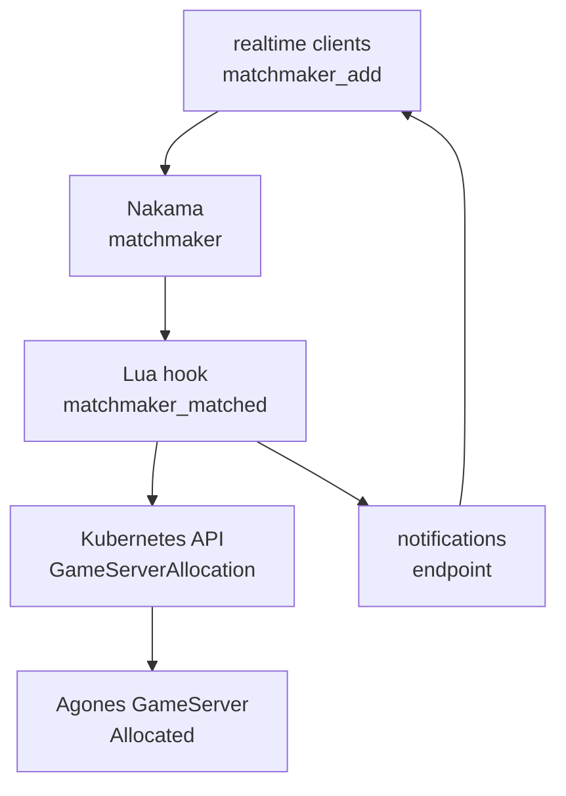

# Day 6: Matchmaking 串接——Lua runtime、GameServerAllocation、realtime client

{ align=right width="72" }

> 到 Day 5 為止，玩家能登入 Nakama、能存資料，但還沒有人把玩家送到遊戲伺服器。今天補上這段：兩個 client 進同一個 matchmaker pool，Nakama 在配對成立時執行 `matchmaker_matched` hook，hook 向 Kubernetes API 建立 `GameServerAllocation`，再把同一組 endpoint 推給兩個 client。

!!! abstract "你在課程的哪裡"
    - **Day 5**：Nakama 3.40.0 與 PostgreSQL 已部署完成，REST device auth 與 storage 讀寫通過。
    - **今天**：新增 Lua runtime module 與 RBAC，讓 Nakama hook 呼叫 Agones allocation。驗收：兩個 realtime client 都收到 `matchmaker_matched` 與 allocation 通知，通知裡的 endpoint 相同，而且 Fleet 裡有一顆 server 從 Ready 轉成 Allocated。
    - **Day 7**：用一支 Python client 把登入、配對、RPC 與 UDP 經 Quilkin 連進 GameServer 從頭走一次。

## Matchmaking 與 allocation 是兩件事

Nakama 內建的 matchmaker 負責湊人：把符合條件的玩家湊成一組，讓每個 client 都收到同一場配對成立的事件。Agones 負責分配 server：從 Ready pool 裡挑一顆 `GameServer`，把它轉成 `Allocated`，並回傳玩家可以連線的 address:port。只完成湊人，玩家還不知道要連去哪裡；只做 allocation，平台也不知道這顆 server 要交給哪一組玩家。兩者中間要有一段程式把它們接起來。

Nakama server runtime 就是放這段程式的地方。它是跑在 Nakama 裡的自訂後端邏輯，可以用 Lua、Go 或 JavaScript/TypeScript 寫；module 在 Nakama 啟動時載入，用 hook 掛到特定事件上。`matchmaker_matched` hook 剛好是接 Agones 的位置：Nakama 已經決定哪些玩家湊成同一組，但 client 還需要同一組遊戲伺服器 endpoint。

hook 要建立 `GameServerAllocation`，就是呼叫 Kubernetes API。Kubernetes API 不會因為請求來自叢集內就自動信任它；Nakama pod 必須帶著 ServiceAccount token，並且透過 RBAC 被授權在 Agones Fleet 所在 namespace 建立 `gameserverallocations`。這裡的 RBAC 只開 create allocation，hook 能請求分配 server，但不能列出或修改 `GameServer`。



### 配對結果怎麼回到 client

client 在這一章只做兩件事：開 realtime WebSocket、送 `matchmaker_add`。之後不再主動發問，而是在同一條 socket 上等 server 推訊息下來。它會收到兩則訊息：

- **`matchmaker_matched`**：Nakama 內建的配對成立事件，列出同組有哪些玩家。
- **code `6006` 的 notification**：本章 Lua hook 自己送出的通知，內容是 Agones 分配到的 `address`、`port` 與 `GameServer` 名稱。`6006` 是本章自訂的通知代碼，client 靠它分辨「這是 server endpoint」。

把 endpoint 送回 client 還有另一種做法：client 收到 `matchmaker_matched` 後，主動呼叫一支自訂 RPC 去問「我該連哪裡」。這裡選 notification，因為配對成立的時間點由 server 決定，由 server 主動推比 client 事後來問少一次來回；notification 標成 persistent 時也會存進資料庫，client 斷線重連後還能用 list notifications API 補拿。

`matchmaker_matched` 裡也有一個 `token` 欄位，但它和 Day 4 的 Quilkin routing token 無關。這個 token 是給 Nakama 自己的多人對戰（client relayed match）用的，client 拿它呼叫 match join，就能加入一場由 Nakama 轉送訊息的對戰。對戰跑在 Agones 的 dedicated game server 上時，不走 Nakama match，這個 token 用不到，client 真正要用的是 notification 裡的 address:port。

## 步驟 1:授權 Nakama 建立 GameServerAllocation

RBAC 只開 `create gameserverallocations`，而且 Role 放在 Agones Fleet 所在的 `default` namespace（完整檔案：[rbac.yaml](https://github.com/DeepWaveLab/CloudNativePracticing/blob/main/labs/sprint5/day6/rbac.yaml)）：

```yaml
apiVersion: rbac.authorization.k8s.io/v1
kind: Role
metadata:
  name: nakama-gameserverallocation-create
  namespace: default
rules:
  - apiGroups:
      - allocation.agones.dev
    resources:
      - gameserverallocations
    verbs:
      - create
---
apiVersion: rbac.authorization.k8s.io/v1
kind: RoleBinding
metadata:
  name: nakama-gameserverallocation-create
  namespace: default
roleRef:
  apiGroup: rbac.authorization.k8s.io
  kind: Role
  name: nakama-gameserverallocation-create
subjects:
  - kind: ServiceAccount
    name: nakama
    namespace: nakama
```

套用後用 `kubectl auth can-i` 驗授權：

```text
$ kubectl auth can-i create gameserverallocations.allocation.agones.dev --as=system:serviceaccount:nakama:nakama -n default
yes
```

這個權限只夠 hook 請求分配，改不了 Agones 的其他物件。

## 步驟 2:掛入 Lua runtime module

Lua module 放在 ConfigMap `nakama-agones-matchmaker` 裡（完整檔案：[nakama-module-configmap.yaml](https://github.com/DeepWaveLab/CloudNativePracticing/blob/main/labs/sprint5/day6/nakama-module-configmap.yaml)）。主線是四步：讀 ServiceAccount token、POST `GameServerAllocation`、從回應取 `status.address` 與 `status.ports[].port`、把 endpoint 通知給 matched users。呼叫 Kubernetes API 的部分：

```lua
local function allocate_gameserver(context)
  local token = context.env and context.env["K8S_TOKEN"] or nil
  if token == nil or token == "" then
    error("K8S_TOKEN runtime env is missing")
  end

  local allocation_body = nk.json_encode({
    apiVersion = "allocation.agones.dev/v1",
    kind = "GameServerAllocation",
    spec = {
      selectors = {
        {
          matchLabels = {
            ["agones.dev/fleet"] = "simple-game-server",
          },
        },
      },
    },
  })

  local headers = {
    ["Authorization"] = "Bearer " .. token,
    ["Content-Type"] = "application/json",
    ["Accept"] = "application/json",
  }

  local code, _, body = nk.http_request(
    "https://kubernetes.default.svc/apis/allocation.agones.dev/v1/namespaces/default/gameserverallocations",
    "POST",
    headers,
    allocation_body,
    5000,
    true
  )
```

`nk.http_request` 的最後一個參數 `true` 會略過 TLS 驗證，只適合 lab。回應的 `status.state` 不是 `Allocated`、或缺 address 與 port 時，完整版會直接 `error()`，讓 Nakama log 留下原因。

配對成立後，hook 對每個 matched user 送 persistent notification：

```lua
local function matchmaker_matched(context, matched_users)
  nk.logger_info(string.format("sprint5-day6 matchmaker_matched users=%d", #matched_users))

  local allocation = allocate_gameserver(context)
  local content = {
    address = allocation.address,
    port = allocation.port,
    gameserver = allocation.gameserver,
    endpoint = string.format("%s:%s", allocation.address, tostring(allocation.port)),
  }

  for _, entry in ipairs(matched_users) do
    nk.notification_send(
      entry.presence.user_id,
      "sprint5-day6-allocation",
      content,
      6006,
      "",
      true
    )
  end

  return ""
end

nk.register_matchmaker_matched(matchmaker_matched)
```

Deployment 要開 pod 內的 ServiceAccount token，並把 ConfigMap 的 `main.lua` 用 `subPath` 掛成單檔（完整檔案：[nakama-deployment.yaml](https://github.com/DeepWaveLab/CloudNativePracticing/blob/main/labs/sprint5/day6/nakama-deployment.yaml)）：

```yaml
spec:
  serviceAccountName: nakama
  automountServiceAccountToken: true
  containers:
    - name: nakama
      args:
        - |
          DB_ADDR="postgres:${POSTGRES_PASSWORD}@postgres.nakama.svc.cluster.local:5432/nakama"
          K8S_TOKEN="$(cat /var/run/secrets/kubernetes.io/serviceaccount/token)"
          exec /nakama/nakama --name nakama-0 --database.address "$DB_ADDR" --logger.level INFO --session.token_expiry_sec 7200 --runtime.path /nakama/data/modules --runtime.env "K8S_TOKEN=${K8S_TOKEN}"
      volumeMounts:
        - name: runtime-modules
          mountPath: /nakama/data/modules/main.lua
          subPath: main.lua
          readOnly: true
```

`automountServiceAccountToken: true` 要寫在 pod spec，因為 Day 5 的 ServiceAccount 關掉了自動掛載；漏掉會撞到[地雷 1](#mine-1)。用 `subPath` 是為了避免 Nakama 掃到 ConfigMap 投影目錄裡的同一份 Lua 檔兩次，見[地雷 2](#mine-2)。

## 步驟 3:確認 Nakama 載入 module 並註冊 hook

重啟後，Nakama log 必須同時出現 module 載入、module count 與 hook registration：

```text
$ kubectl -n nakama logs deployment/nakama -c nakama --tail=120
{"level":"info","ts":"2026-09-05T05:18:32.957Z","caller":"server/runtime.go:671","msg":"Initialising runtime","path":"/nakama/data/modules"}
{"level":"info","ts":"2026-09-05T05:18:32.958Z","caller":"server/runtime_lua.go:119","msg":"Initialising Lua runtime provider","path":"/nakama/data/modules"}
{"level":"info","ts":"2026-09-05T05:18:32.962Z","caller":"server/runtime_lua_nakama.go:2373","msg":"sprint5-day6 Agones matchmaker module loaded","runtime":"lua"}
{"level":"info","ts":"2026-09-05T05:18:32.963Z","caller":"server/runtime_lua.go:1288","msg":"Lua runtime modules loaded"}
{"level":"info","ts":"2026-09-05T05:18:32.963Z","caller":"server/runtime.go:771","msg":"Found runtime modules","count":1,"modules":["main.lua"]}
{"level":"info","ts":"2026-09-05T05:18:32.963Z","caller":"server/runtime.go:2657","msg":"Registered Lua runtime Matchmaker Matched function invocation"}
{"level":"info","ts":"2026-09-05T05:18:33.313Z","caller":"main.go:243","msg":"Startup done"}
```

要看的是 `count=1`。若顯示 `count=2` 並載入兩次同名 module，通常是整個 ConfigMap 目錄被掛進 runtime path。Nakama rollout 之後，先前開著的 port-forward 會失效，重開一次再測 client，見[地雷 3](#mine-3)。

## 步驟 4:送兩個 realtime client 進 matchmaker

配對成立時 hook 要分配一顆 server，所以 `simple-game-server` Fleet 至少要有 1 顆 Ready。

測試 client（[mm_client.py](https://github.com/DeepWaveLab/CloudNativePracticing/blob/main/labs/sprint5/day6/mm_client.py)）做三件事：REST device auth、WebSocket 送 `matchmaker_add`、等待 `matchmaker_matched` 與 code `6006` notification。它用 Python 的 `websockets` 套件開 realtime socket（`pip install websockets`），下面只列等待訊息的迴圈。結束條件要兩者都滿足：

```python
while time.monotonic() < deadline and (endpoint is None or matched is None):
    raw = await asyncio.wait_for(socket.recv(), timeout=max(1, deadline - time.monotonic()))
    message = json.loads(raw)

    if "matchmaker_matched" in message:
        matched = message["matchmaker_matched"]

    for notification in message.get("notifications", {}).get("notifications", []):
        content = notification.get("content", {})
        if isinstance(content, str):
            content = json.loads(content)
        if notification.get("code") == 6006:
            endpoint = content
```

只等 notification 就離線的話，會漏掉配對事件，見[地雷 4](#mine-4)。

Nakama hook 收到配對事件後建立 allocation：

```text
$ kubectl -n nakama logs deployment/nakama -c nakama --since=3m | grep 'sprint5-day6'
{"level":"info","ts":"2026-09-05T05:18:32.962Z","caller":"server/runtime_lua_nakama.go:2373","msg":"sprint5-day6 Agones matchmaker module loaded","runtime":"lua"}
{"level":"info","ts":"2026-09-05T05:19:17.964Z","caller":"server/runtime_lua_nakama.go:2370","msg":"sprint5-day6 matchmaker_matched users=2","runtime":"lua","mode":"matchmaker"}
{"level":"info","ts":"2026-09-05T05:19:18.203Z","caller":"server/runtime_lua_nakama.go:2370","msg":"sprint5-day6 allocation response {\"address\":\"<NODE-IP>\",\"gameserver\":\"simple-game-server-ql5ws-qknrb\",\"port\":7170,\"state\":\"Allocated\"}","runtime":"lua","mode":"matchmaker"}
{"level":"info","ts":"2026-09-05T05:19:18.211Z","caller":"server/runtime_lua_nakama.go:2370","msg":"sprint5-day6 allocated gameserver=simple-game-server-ql5ws-qknrb endpoint=<NODE-IP>:7170 users=2","runtime":"lua","mode":"matchmaker"}
```

兩個 client 都收到同一組 endpoint，summary 顯示 `same_endpoint=true`：

```text
$ python3 mm_client.py
client-a: auth user_id=<user-a> token=<redacted>
client-b: auth user_id=<user-b> token=<redacted>
client-a: ws {"cid": "client-a", "matchmaker_ticket": {"ticket": "<ticket-a>"}}
client-b: ws {"cid": "client-b", "matchmaker_ticket": {"ticket": "<ticket-b>"}}
client-b: ws {"notifications": {"notifications": [{"code": 6006, "content": "{\"address\":\"<NODE-IP>\",\"endpoint\":\"<NODE-IP>:7170\",\"gameserver\":\"simple-game-server-ql5ws-qknrb\",\"port\":7170}", "create_time": "2026-09-05T05:19:18Z", "id": "<notif-b>", "persistent": true, "sender_id": "<system-sender>", "subject": "sprint5-day6-allocation"}]}}
client-b: ws {"matchmaker_matched": {"self": {"presence": {"session_id": "<session-b>", "user_id": "<user-b>", "username": "WxTuzBAMQU"}}, "ticket": "<ticket-b>", "token": "<redacted>", "users": [{"presence": {"session_id": "<session-b>", "user_id": "<user-b>", "username": "WxTuzBAMQU"}}, {"presence": {"session_id": "<session-a>", "user_id": "<user-a>", "username": "MXqRJCrXaj"}}]}}
client-a: ws {"notifications": {"notifications": [{"code": 6006, "content": "{\"address\":\"<NODE-IP>\",\"endpoint\":\"<NODE-IP>:7170\",\"gameserver\":\"simple-game-server-ql5ws-qknrb\",\"port\":7170}", "create_time": "2026-09-05T05:19:18Z", "id": "<notif-a>", "persistent": true, "sender_id": "<system-sender>", "subject": "sprint5-day6-allocation"}]}}
client-a: ws {"matchmaker_matched": {"self": {"presence": {"session_id": "<session-a>", "user_id": "<user-a>", "username": "MXqRJCrXaj"}}, "ticket": "<ticket-a>", "token": "<redacted>", "users": [{"presence": {"session_id": "<session-b>", "user_id": "<user-b>", "username": "WxTuzBAMQU"}}, {"presence": {"session_id": "<session-a>", "user_id": "<user-a>", "username": "MXqRJCrXaj"}}]}}
SUMMARY {"endpoint": "<NODE-IP>:7170", "results": [{"allocation": {"address": "<NODE-IP>", "endpoint": "<NODE-IP>:7170", "gameserver": "simple-game-server-ql5ws-qknrb", "port": 7170}, "client": "client-a", "matched": {"self": {"presence": {"session_id": "<session-a>", "user_id": "<user-a>", "username": "MXqRJCrXaj"}}, "ticket": "<ticket-a>", "token": "<redacted>", "users": [{"presence": {"session_id": "<session-b>", "user_id": "<user-b>", "username": "WxTuzBAMQU"}}, {"presence": {"session_id": "<session-a>", "user_id": "<user-a>", "username": "MXqRJCrXaj"}}]}, "notifications_count": 1, "user_id": "<user-a>"}, {"allocation": {"address": "<NODE-IP>", "endpoint": "<NODE-IP>:7170", "gameserver": "simple-game-server-ql5ws-qknrb", "port": 7170}, "client": "client-b", "matched": {"self": {"presence": {"session_id": "<session-b>", "user_id": "<user-b>", "username": "WxTuzBAMQU"}}, "ticket": "<ticket-b>", "token": "<redacted>", "users": [{"presence": {"session_id": "<session-b>", "user_id": "<user-b>", "username": "WxTuzBAMQU"}}, {"presence": {"session_id": "<session-a>", "user_id": "<user-a>", "username": "MXqRJCrXaj"}}]}, "notifications_count": 1, "user_id": "<user-b>"}], "same_endpoint": true}
```

注意 notification 比 `matchmaker_matched` 先到：hook 在 Nakama 送出 matched 事件之前執行，所以 client 不能假設先後順序。

跑完後用 `kubectl get gs -o wide` 確認：通知裡那顆 `GameServer` 已從 Ready 轉成 Allocated，address:port 與 client 收到的一致，Fleet 也補出一顆新的 Ready。

## 自我檢查

- `kubectl auth can-i create gameserverallocations.allocation.agones.dev --as=system:serviceaccount:nakama:nakama -n default`：回 `yes`。
- Nakama 啟動 log：`Found runtime modules` 的 `count` 是 1，且有 `Registered Lua runtime Matchmaker Matched function invocation`。
- 兩個 client 的輸出：各自都有 `matchmaker_matched` 與 code `6006` 的 notification，summary 是 `same_endpoint: true`。
- Nakama log 過濾 `sprint5-day6`：有一行 `allocation response`，`state` 是 `Allocated`。
- client 跑完後 `kubectl get gs`：通知裡那顆 `GameServer` 從 Ready 轉成 Allocated，address:port 與通知相同；Fleet 補出一顆新的 Ready。

## 地雷記錄

### 地雷 1:ServiceAccount 關閉 automount 時 pod 內沒有 token 檔 {#mine-1}

**症狀**：改完 Deployment 後 Nakama pod 進入 `CrashLoopBackOff`；container log 只有 `cat: /var/run/secrets/kubernetes.io/serviceaccount/token: No such file or directory`。

**根因**：Day 5 的 `ServiceAccount nakama` 設定 `automountServiceAccountToken: false`。Deployment 沒有覆蓋時，pod 不會掛 Kubernetes API token，hook 因此拿不到 token 傳給 Lua runtime。

**修法**：保留 ServiceAccount 本身較安全的預設，在 Nakama 的 pod spec 明確加上 `automountServiceAccountToken: true`。只有需要 in-cluster API 呼叫的 workload 才開 token mount。

### 地雷 2:ConfigMap 整個目錄掛 runtime path 會讓 Lua 載入兩次 {#mine-2}

**症狀**：Nakama 可啟動，但 log 出現兩次 `sprint5-day6 Agones matchmaker module loaded`；`Found runtime modules` 顯示 `count=2`，包含 ConfigMap timestamp 目錄下的 `main.lua`。

**根因**：Kubernetes ConfigMap volume 以 symlink 與 timestamp 目錄實作更新。Nakama runtime 掃描 `/nakama/data/modules` 時，把投影目錄裡的實體檔也納入，導致同一份 Lua 被掃到兩次。

**修法**：用 `subPath` 將 ConfigMap 的 `main.lua` 掛成單一檔案到 `/nakama/data/modules/main.lua`，並用 Deployment annotation 變更觸發 rollout。凡是 runtime 會掃整個目錄的系統，都要小心 ConfigMap 投影目錄。

### 地雷 3:rollout 後舊 port-forward 會綁到已關閉的 pod {#mine-3}

**症狀**：client REST device auth 失敗，錯誤為 `Remote end closed connection without response`；port-forward log 顯示 `network namespace ... is closed`。

**根因**：port-forward 在 Deployment rollout 前建立，底層連到已被刪除的舊 pod。Service 名稱沒變，不代表既有 port-forward session 會自動換到新 pod。

**修法**：每次 Nakama rollout 後重開 `kubectl -n nakama port-forward svc/nakama 7350:7350`。client 失敗時先看 port-forward session，再追 Nakama API。

### 地雷 4:client 只等 notification 會漏掉配對事件 {#mine-4}

**症狀**：兩個 client 都印出 allocation 通知，輸出裡卻沒有 `matchmaker_matched` 事件。

**根因**：client 腳本收到 allocation 通知後立刻離線，沒有等待 matchmaker 的配對事件；通知又比配對事件先到。這樣只能證明 hook 送過通知，不能證明 client 端真的收到配對成立訊號。

**修法**：client 的結束條件改成同時收到 `matchmaker_matched` 與 code `6006` 通知才結束，不依賴兩者的先後順序。

## 帶得走的東西

- Nakama matchmaker 負責湊人，Agones allocation 負責挑 server，中間用 server runtime hook 接起來；hook 做的事就是一個帶 ServiceAccount token 的 HTTP POST。
- in-cluster API 呼叫要同時有 pod 掛上的 ServiceAccount token、RBAC 授權與正確的 API 路徑；少一個，錯誤各不相同。
- runtime module 載入要看 module count 與 hook registration，server 能啟動不代表 hook 有掛上。
- 配對結果由 server 經 realtime socket 主動推給 client，而且可能比配對事件先到；`matchmaker_matched` 的 `token` 是 Nakama match 用的，連 game server 用的是通知裡的 address:port。

## 正式環境還要補的

這裡的 hook 呼叫 Kubernetes API 時略過了 TLS 驗證（`insecure=true`），正式環境要改成驗證叢集 CA。allocation 失敗時也只會在 Nakama log 留下錯誤，client 收不到任何通知；上線前要補重試，以及把失敗回報給 client 的機制。

## 延伸閱讀

想往下深挖，從這幾份開始：

- **[Nakama Lua runtime](https://heroiclabs.com/docs/nakama/server-framework/lua-runtime/)** —— 查 Lua module 載入、runtime API 與 hook 寫法。
- **[Nakama configuration](https://heroiclabs.com/docs/nakama/getting-started/configuration/)** —— 對照本章用 `--runtime.env` 把 Kubernetes token 傳入 Lua context 的做法。
- **[Nakama matchmaker](https://heroiclabs.com/docs/nakama/concepts/multiplayer/matchmaker/)** —— 查 realtime matchmaker、`matchmaker_add` 與 matched event 的語意。
- **[Nakama notifications](https://heroiclabs.com/docs/nakama/concepts/notifications/)** —— 對照本章用 code `6006` persistent notification 把 allocation 結果送回 client。
- **[Agones access API](https://agones.dev/site/docs/guides/access-api/)** —— 查從 Kubernetes API 建立 `GameServerAllocation` 與讀取 allocation status 的路徑。

## 下一步

到這裡，玩家可以登入 Nakama、進 matchmaker，並拿到 Agones 分配的 `GameServer` endpoint。[Day 7](sprint5-day7-python-client-e2e.md) 換到玩家那一側，用一支只靠 Python 標準函式庫的 client 走完登入、配對、RPC 查詢，再把 UDP 封包經 Quilkin 送進分配到的 GameServer。

---

!!! quote ""
    Nakama 標誌為 Heroic Labs 之官方資產，此處作社群教學用途。
