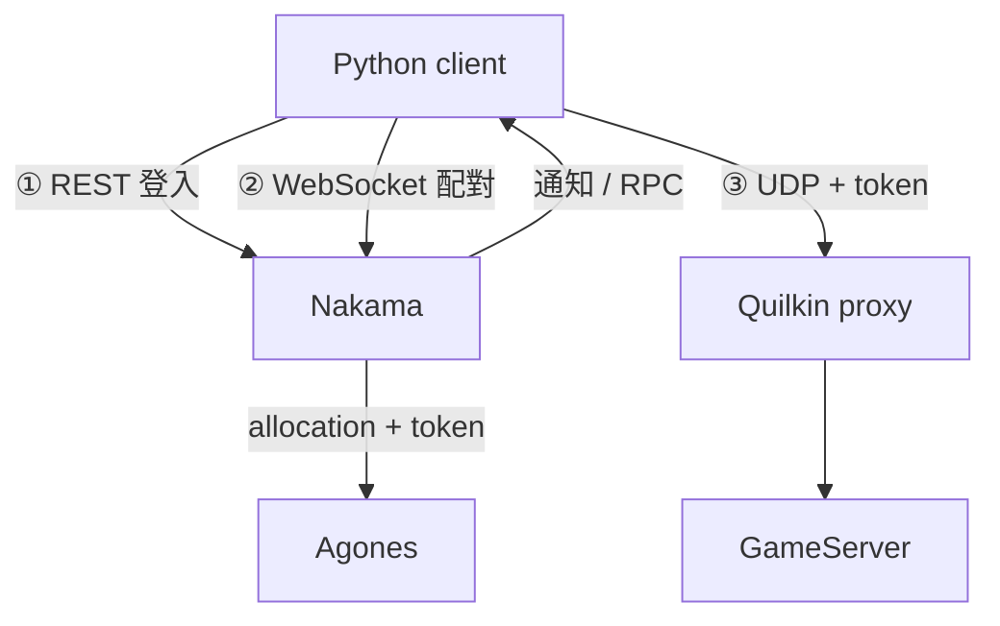

# Day 7: Python client 端到端——登入、配對、RPC、UDP 經 Quilkin 連進 GameServer

{ align=right width="72" }

> Day 4 到 Day 6 各自驗過玩家連線的一段：Quilkin 用 token 轉送 UDP、Nakama 登入、matchmaker 拿到 server endpoint。但 Day 6 交給 client 的仍是 node IP 與 hostPort，沒有 routing token，玩家連不到 Quilkin 後面的 server。今天把缺的那一段補上：配對成立時由後端產生 routing token、寫進 allocation，再用一支只靠 Python 標準函式庫的 client，從登入一路走到收到 GameServer 的回應。

!!! abstract "你在課程的哪裡"
    - **Day 6**：Nakama matchmaker hook 呼叫 Agones allocation，兩個 client 收到同一組 endpoint。
    - **今天**：部署帶 routing token 與 RPC 的 Nakama module，跑兩個 Python player。驗收：兩人配到同一顆 GameServer、收到同一個 token；RPC 查到的 assignment 與通知相同；UDP 帶 token 經 Quilkin 收到 `ACK`，錯 token 沒有回應；再配對一次時分到另一顆 Ready 的 server、拿到不同的 token，結果同樣通過。
    - **Day 8**：在已能配對與分配 server 的平台上，加入觀測與韌性演練。

## 玩家端三段連線接成一條路

Day 0 把玩家端的連線分成三段：登入、配對、遊戲封包。前幾天缺的是第二段和第三段之間的交接：Day 6 的 hook 只把 `address:port` 交給 client，Day 4 的 Quilkin 卻要求封包帶著 routing token。今天的 Nakama module 在配對成立時多做三件事：

1. **產生 routing token**，放進 `GameServerAllocation` 的 `metadata.annotations["quilkin.dev/tokens"]`。Agones 在分配的同時把這個 annotation 寫到被選中的 GameServer 上，Quilkin 的 xDS control plane 看到之後，就知道帶這個 token 的封包要轉給哪顆 server。
2. **把 assignment 存進 Nakama storage**，內容是 GameServer 名稱、Quilkin endpoint 與 token，每位玩家各一筆。
3. **用兩種方式把 assignment 交給 client**：配對當下用 notification 主動推送；另外註冊一支 RPC `get_assignment`，client 斷線重連或漏接通知時，可以自己來問。



為了隔離下一章的節點關機演練，這裡建立一個帶 taint 的專用節點池，並在 `nakama-lab` namespace 部署獨立的 Nakama 與 PostgreSQL，Day 5–6 那套不受影響。完整檔案在 [labs/sprint5/day7/](https://github.com/DeepWaveLab/CloudNativePracticing/tree/main/labs/sprint5/day7)。

## 步驟 1:建立演練節點池與演練 Fleet

節點池帶 label `role=gameserver-lab` 與 taint `sprint5-lab=true:NoSchedule`，只有明確宣告 toleration 的 pod 會排上去；和 Day 1 的 gamesrv 一樣要開節點公網 IP。`<RESOURCE-GROUP>` 是叢集所在的資源群組，`<CLUSTER>` 是叢集名稱，用 `az aks list -o table` 就能看到兩者：

```console
$ az aks nodepool add -g <RESOURCE-GROUP> --cluster-name <CLUSTER> -n gslab \
    --node-count 1 --node-vm-size Standard_D2s_v5 --enable-node-public-ip \
    --labels role=gameserver-lab --node-taints sprint5-lab=true:NoSchedule --mode User
```

Fleet 沿用 Day 2 的 `simple-game-server:0.43`，差別在 `nodeSelector` 與 `tolerations`（完整檔案：[lab-fleet.yaml](https://github.com/DeepWaveLab/CloudNativePracticing/blob/main/labs/sprint5/day7/lab-fleet.yaml)）：

```yaml
apiVersion: agones.dev/v1
kind: Fleet
metadata:
  name: lab-game-server
spec:
  replicas: 2
  template:
    spec:
      ports:
        - name: default
          portPolicy: Dynamic
          containerPort: 7654
      template:
        spec:
          nodeSelector:
            role: gameserver-lab
          tolerations:
            - key: sprint5-lab
              operator: Equal
              value: "true"
              effect: NoSchedule
          containers:
            - name: simple-game-server
              image: us-docker.pkg.dev/agones-images/examples/simple-game-server:0.43
              resources:
                requests: {memory: 64Mi, cpu: 20m}
                limits: {memory: 64Mi, cpu: 20m}
```

這個 Fleet 不掛 `FleetAutoscaler`，replicas 固定為 2：allocation 不會提高 Fleet 的目標數量，每分配一顆，Ready 就少一顆。Fleet 會在步驟 2 和其他 manifest 一起套用。

## 步驟 2:部署 nakama-lab 與權限

`nakama-lab` 的 manifest 由 Day 5 的 `postgres.yaml` 與 `nakama.yaml` 改出（完整檔案：[nakama-lab.yaml](https://github.com/DeepWaveLab/CloudNativePracticing/blob/main/labs/sprint5/day7/nakama-lab.yaml)），差別有四點：

- namespace 改成 `nakama-lab`，PostgreSQL 也在同一個 namespace 另建一份。
- Nakama 與 PostgreSQL 都加上步驟 1 節點池的 `nodeSelector` 與 `tolerations`。
- Nakama 的 ServiceAccount token 要 mount，並用 `--runtime.env` 傳入 `K8S_TOKEN` 與 `QUILKIN_ENDPOINT`，做法與 Day 6 相同。
- Lua module 由 ConfigMap `nakama-lab-module` 以 subPath 掛到 `/nakama/data/modules/main.lua`，避開 [Day 6 的地雷 2](sprint5-day6-matchmaking.md#mine-2)。

建立 namespace 後，DB 密碼依 [Day 5 的地雷 1](sprint5-day5-nakama-postgres.md#mine-1) 用 hex 產生；Quilkin 的對外入口放進 ConfigMap，由 Nakama 啟動時讀取：

```console
$ kubectl create namespace nakama-lab
$ kubectl -n nakama-lab create secret generic nakama-db --from-literal=postgres-password="$(openssl rand -hex 24)"
$ kubectl -n nakama-lab create configmap nakama-lab-env --from-literal=quilkin-endpoint=<LB-IP>:7777
```

RBAC 與 Day 6 一樣只開 `default` namespace 的 create `gameserverallocations`，subject 換成 `nakama-lab` 的 ServiceAccount（完整檔案：[rbac-lab.yaml](https://github.com/DeepWaveLab/CloudNativePracticing/blob/main/labs/sprint5/day7/rbac-lab.yaml)）：

```yaml
apiVersion: rbac.authorization.k8s.io/v1
kind: Role
metadata:
  name: nakama-lab-gameserverallocation-create
  namespace: default
rules:
  - apiGroups: [allocation.agones.dev]
    resources: [gameserverallocations]
    verbs: [create]
---
apiVersion: rbac.authorization.k8s.io/v1
kind: RoleBinding
metadata:
  name: nakama-lab-gameserverallocation-create
  namespace: default
roleRef:
  apiGroup: rbac.authorization.k8s.io
  kind: Role
  name: nakama-lab-gameserverallocation-create
subjects:
  - kind: ServiceAccount
    name: nakama
    namespace: nakama-lab
```

四份 manifest 一起套用（Lua module 的 ConfigMap 內容見步驟 3）：

```console
$ kubectl apply -f nakama-lab-module.yaml -f rbac-lab.yaml -f nakama-lab.yaml -f lab-fleet.yaml
configmap/nakama-lab-module created
role.rbac.authorization.k8s.io/nakama-lab-gameserverallocation-create created
rolebinding.rbac.authorization.k8s.io/nakama-lab-gameserverallocation-create created
serviceaccount/postgres created
service/postgres created
statefulset.apps/postgres created
serviceaccount/nakama created
service/nakama created
deployment.apps/nakama created
fleet.agones.dev/lab-game-server created
```

## 步驟 3:寫 Lua module——token、allocation、storage、RPC

module 的骨架沿用 Day 6，改了三處（完整檔案：[nakama-lab-module.yaml](https://github.com/DeepWaveLab/CloudNativePracticing/blob/main/labs/sprint5/day7/nakama-lab-module.yaml)）。第一處是產生 routing token，並寫進 allocation 的 metadata：

```lua
local TOKEN_ALPHABET = "abcdefghijkmnpqrstuvwxyz23456789"

local function new_routing_token()
  local hex = string.gsub(nk.uuid_v4(), "-", "")
  local out = {}
  for i = 1, 3 do
    local n = tonumber(string.sub(hex, i * 2 - 1, i * 2), 16) % #TOKEN_ALPHABET + 1
    out[i] = string.sub(TOKEN_ALPHABET, n, n)
  end
  return table.concat(out)
end
```

```lua
local body = nk.json_encode({
  apiVersion = "allocation.agones.dev/v1",
  kind = "GameServerAllocation",
  spec = {
    selectors = { { matchLabels = { ["agones.dev/fleet"] = "lab-game-server" } } },
    metadata = { annotations = { ["quilkin.dev/tokens"] = nk.base64_encode(routing_token) } },
  },
})
```

token 長度是 3，因為 Day 4 的 Capture filter 設定為從封包尾端取 3 bytes。字母表拿掉了容易看錯的 `l`、`o`、`0`、`1`。`allocate_gameserver` 改成回傳 GameServer 名稱、address 與 port 三個值，headers 與錯誤處理和 Day 6 相同。

第二處在 `matchmaker_matched` hook：分配完成後，把 assignment 寫進每位玩家自己的 storage，再送 code `6006` 的 persistent notification：

```lua
local function matchmaker_matched(context, matched_users)
  local routing_token = new_routing_token()
  local gameserver, address, port = allocate_gameserver(context, routing_token)
  local assignment = {
    gameserver = gameserver,
    proxy = context.env["QUILKIN_ENDPOINT"],
    routing_token = routing_token,
    direct = string.format("%s:%s", address, tostring(port)),
  }

  local writes = {}
  for _, entry in ipairs(matched_users) do
    table.insert(writes, {
      collection = "assignment",
      key = "current",
      user_id = entry.presence.user_id,
      value = assignment,
      permission_read = 1,
      permission_write = 0,
    })
  end
  nk.storage_write(writes)

  for _, entry in ipairs(matched_users) do
    nk.notification_send(entry.presence.user_id, "sprint5-assignment", assignment, 6006, "", true)
  end
  return nil
end
```

`permission_read = 1` 表示只有物件擁有者能讀，`permission_write = 0` 表示 client 不能改寫，只有 server runtime 能寫。

第三處是 RPC。`get_assignment` 讀取呼叫者自己的那筆 assignment 回傳：

```lua
local function get_assignment(context, payload)
  local objects = nk.storage_read({ { collection = "assignment", key = "current", user_id = context.user_id } })
  if #objects == 0 then
    return nk.json_encode({ found = false })
  end
  local value = objects[1].value
  value.found = true
  return nk.json_encode(value)
end

nk.register_matchmaker_matched(matchmaker_matched)
nk.register_rpc(get_assignment, "get_assignment")
```

`context.user_id` 由 Nakama 從 session token 解出，client 無法指定別人的 user id。

## 步驟 4:確認 module 載入與 Fleet 就緒

Nakama 啟動 log 要同時看到 module 數量、RPC 與 hook 的註冊：

```text
{"level":"info","ts":"2026-09-29T02:50:23.721Z","caller":"server/runtime.go:771","msg":"Found runtime modules","count":1,"modules":["main.lua"]}
{"level":"info","ts":"2026-09-29T02:50:23.721Z","caller":"server/runtime.go:795","msg":"Registered Lua runtime RPC function invocation","id":"get_assignment"}
{"level":"info","ts":"2026-09-29T02:50:23.722Z","caller":"server/runtime.go:2657","msg":"Registered Lua runtime Matchmaker Matched function invocation"}
{"level":"info","ts":"2026-09-29T02:50:24.077Z","caller":"main.go:243","msg":"Startup done"}
```

演練 Fleet 有 2 顆 Ready，都在專用節點池上：

```text
NAME                          STATE   ADDRESS        PORT   NODE
lab-game-server-s7xfm-g4fk2   Ready   <NODE-IP>      7245   aks-gslab-97904148-vmss000000
lab-game-server-s7xfm-g9p9n   Ready   <NODE-IP>      7444   aks-gslab-97904148-vmss000000
```

Nakama 仍是 `ClusterIP`，用 port-forward 接到本機。接到本機的 17350，client 也用這個 port：

```console
$ kubectl -n nakama-lab port-forward svc/nakama 17350:7350
$ curl -s -o /dev/null -w '%{http_code}\n' http://127.0.0.1:17350/healthcheck
200
```

## 步驟 5:只用標準函式庫寫 client

截至 2026-08，Python 沒有仍在維護的 Nakama client（社群的 nakama-python 停在 2021）。這支 client（[game_client.py](https://github.com/DeepWaveLab/CloudNativePracticing/blob/main/labs/sprint5/day7/game_client.py)）直接呼叫 Nakama 的 REST 與 WebSocket API，只用 `urllib`、`socket`、`json` 等標準函式庫，不必安裝第三方套件。每位 player 的流程：

1. **登入**：`POST /v2/account/authenticate/device?create=true`，用 server key 走 Basic auth，拿到 session token。
2. **開 realtime socket**：連到 `/ws?token=<session token>&format=json`。
3. **排隊**：送 `{"matchmaker_add": {"min_count": 2, "max_count": 2, "query": "*"}}`，一直收訊息，直到 `matchmaker_matched` 與 code `6006` 的 notification 都收到。
4. **RPC**：`POST /v2/rpc/get_assignment`，帶 `Authorization: Bearer <session token>`，比對回傳內容與 notification 是否相同。
5. **UDP**：把 `hello-<player>` 接上 routing token，送到 Quilkin endpoint，等 `ACK`；再用錯的 token `zz0` 送一次，預期收不到回應。

標準函式庫沒有 WebSocket，client 自己實作最小的 RFC 6455：HTTP Upgrade 握手、client 送出的 frame 一律加 mask、回應 server 的 ping。送 frame 的部分：

```python
def _send_frame(self, opcode, payload):
    mask = os.urandom(4)
    header = bytes([0x80 | opcode])
    n = len(payload)
    if n < 126:
        header += bytes([0x80 | n])
    elif n < 65536:
        header += bytes([0x80 | 126]) + struct.pack("!H", n)
    else:
        header += bytes([0x80 | 127]) + struct.pack("!Q", n)
    masked = bytes(b ^ mask[i % 4] for i, b in enumerate(payload))
    self.sock.sendall(header + mask + masked)
```

呼叫 RPC 時要注意 body 的格式：Nakama REST 的 RPC body 是「一個 JSON 字串」，不是 JSON 物件。空參數要送 `"{}"`（含引號），回應的 `payload` 也是字串，要再 `json.loads` 一次。換成任何 client 都會遇到這一點：

```python
status, rpc = http_json("POST", f"{api}/v2/rpc/get_assignment", "{}", bearer=token)
rpc_value = json.loads(rpc["payload"])
```

UDP 的部分把 token 接在 payload 後面：

```python
routing_token = assignment["routing_token"].encode()
good = udp_roundtrip(assignment["proxy"], f"hello-{name}".encode() + routing_token, args.udp_timeout)
bad = udp_roundtrip(assignment["proxy"], f"hello-{name}".encode() + b"zz0", args.udp_timeout)
```

兩個 player 各開一個 thread 同時跑，最後印出 `SUMMARY`，五項都為 true 時 exit code 為 0。

## 步驟 6:跑兩個 player

```console
$ python3 game_client.py --port 17350
player-b: login http=200 created=True
player-a: login http=200 created=True
player-a: matchmaker ticket received
player-b: matchmaker ticket received
player-a: notification 6006 gameserver=lab-game-server-s7xfm-g4fk2 proxy=<LB-IP>:7777
player-a: matchmaker_matched users=2
player-b: notification 6006 gameserver=lab-game-server-s7xfm-g4fk2 proxy=<LB-IP>:7777
player-b: matchmaker_matched users=2
player-a: rpc get_assignment http=200 found=True gameserver=lab-game-server-s7xfm-g4fk2
player-b: rpc get_assignment http=200 found=True gameserver=lab-game-server-s7xfm-g4fk2
player-b: udp via proxy with token -> 'ACK: hello-player-b'
player-a: udp via proxy with token -> 'ACK: hello-player-a'
player-b: udp via proxy with wrong token -> None
player-a: udp via proxy with wrong token -> None
SUMMARY {"errors": [], "same_gameserver": true, "same_token": true, "rpc_matches": true, "udp_ack_ok": true, "wrong_token_blocked": true, ...}
```

兩人配到同一顆 `g4fk2`，token 都是 `v47`。通知比 `matchmaker_matched` 先到，因為 hook 在 Nakama 送出 matched 事件之前執行；client 的結束條件是兩者都收到，不依賴先後順序，也避開了 [Day 6 的地雷 4](sprint5-day6-matchmaking.md#mine-4)。

再執行一次 client。這次 allocation 選到另一顆 Ready 的 GameServer，hook 也產生了不同的 token，五項仍全部為 true：

```text
SUMMARY {"errors": [], "same_gameserver": true, "same_token": true, "rpc_matches": true, "udp_ack_ok": true, "wrong_token_blocked": true, "results": {"player-a": {"gameserver": "lab-game-server-s7xfm-g9p9n", "proxy": "<LB-IP>:7777", "routing_token": "ysz", ...
```

這個 Fleet 沒有掛 `FleetAutoscaler`，兩次配對用掉 2 顆 Ready 之後就沒有可分配的 server；要再配對，先刪掉 Allocated 讓 Fleet 補回（步驟 8），或照 [Day 3](sprint5-day3-allocation-autoscaler.md) 掛 buffer autoscaler。正式環境要用後者。

## 步驟 7:從 GameServer 這一側對照

client 收到 `ACK` 只能證明「有 server 回應」。要確認封包真的進了被分配的那一顆，從 GameServer 這一側看：

```console
$ kubectl get gs lab-game-server-s7xfm-g4fk2 \
    -o jsonpath='{.status.state} {.metadata.labels.agones\.dev/fleet} tokens={.metadata.annotations.quilkin\.dev/tokens}'
Allocated lab-game-server tokens=djQ3
$ echo -n v47 | base64
djQ3
$ kubectl logs lab-game-server-s7xfm-g4fk2 -c simple-game-server | grep hello
2026/09/29 02:50:54 Received packet from <PROXY-EGRESS-IP>:1025: hello-player-b
2026/09/29 02:50:54 Received UDP: hello-player-b
2026/09/29 02:50:54 Received packet from <PROXY-EGRESS-IP>:1026: hello-player-a
2026/09/29 02:50:54 Received UDP: hello-player-a
```

這顆 server 屬於 `lab-game-server` 且是 `Allocated`；annotation 是 `v47` 的 base64；收到的是 `hello-player-a` 而不是 `hello-player-av47`，表示 Quilkin 的 Capture filter 已經把 token 剝掉。封包來源是 proxy 的出口 IP，game server 看不到玩家的真實位址。

## 步驟 8:收尾

`simple-game-server` 不會自己結束，兩顆 Allocated 要手動刪，Fleet 會補回 Ready：

```console
$ kubectl delete gs lab-game-server-s7xfm-g4fk2 lab-game-server-s7xfm-g9p9n
gameserver.agones.dev "lab-game-server-s7xfm-g4fk2" deleted
gameserver.agones.dev "lab-game-server-s7xfm-g9p9n" deleted
```

```text
NAME                          STATE   ADDRESS        PORT   NODE
lab-game-server-s7xfm-2gcfx   Ready   <NODE-IP>      7114   aks-gslab-97904148-vmss000000
lab-game-server-s7xfm-4cl5c   Ready   <NODE-IP>      7356   aks-gslab-97904148-vmss000000
```

## 自我檢查

- `nakama-lab` 的 Nakama 啟動 log：`Found runtime modules` 的 `count` 是 1，並且有 `id":"get_assignment"` 與 `Matchmaker Matched` 兩行註冊。
- `python3 game_client.py --port 17350` 的 `SUMMARY`：`same_gameserver`、`same_token`、`rpc_matches`、`udp_ack_ok`、`wrong_token_blocked` 五項都是 true，exit code 0。
- 對被分配的 GameServer 查 `jsonpath`：狀態 `Allocated`，`quilkin.dev/tokens` 等於 `echo -n <token> | base64` 的結果。
- 該 GameServer 的 log：收到的 payload 是 `hello-player-a`，尾端沒有 token；來源 IP 是 proxy 的出口，不是你的機器。
- 再跑一次 client：分到另一顆 Ready 的 GameServer、token 不同，五項仍為 true。

## 帶得走的東西

- routing token 由後端在配對成立時產生，寫進 allocation metadata；Agones、Quilkin、client 三方拿到的是同一個值，client 不需要知道任何 node IP。
- 配對結果用 notification 主動推送、用 RPC 讓 client 補拿，兩條路讀的是同一份 storage；client 斷線重連時靠 RPC 找回自己的 server。
- RPC 只能讀到 `context.user_id` 自己的資料，這個 id 由 session token 決定，client 無法冒用別人。
- Nakama REST 的 RPC body 與回應 `payload` 都是 JSON 字串，要多編碼、解碼一次。
- 要確認封包真的進了被分配的那顆 server，除了 client 收到的回應，還要看 server 端的 annotation 與 log。

## 正式環境還要補的

這支 client 的 WebSocket 是最小實作：只處理文字 frame、ping 與 close，沒有 TLS，也不處理壓縮等擴充。正式的遊戲 client 應該用 Nakama 官方 SDK 或成熟的 WebSocket 函式庫。

Nakama 要有對外入口與 TLS，不能靠 port-forward。routing token 只有 3 個字元、32 個字母，共 32768 種組合，要改成足夠長的隨機值，並處理碰撞、對戰結束後的失效與回收。

## 延伸閱讀

想往下深挖，從這幾份開始：

- **[Agones GameServerAllocation reference](https://agones.dev/site/docs/reference/gameserverallocation/)** —— `spec.metadata` 的 labels 與 annotations 會在分配當下寫到 GameServer 上。
- **[Nakama matchmaker](https://heroiclabs.com/docs/nakama/concepts/multiplayer/matchmaker/)** —— matchmaker 只接受保持 socket 連線的玩家，這是 client 必須先開 realtime socket 再排隊的原因。
- **[RFC 6455 The WebSocket Protocol](https://datatracker.ietf.org/doc/html/rfc6455)** —— client frame 必須加 mask、握手與 ping/pong 的規格，對照步驟 5 的最小實作。

## 下一步

一支 Python client 已經能從登入走到收到 GameServer 的回應。[Day 8](sprint5-day8-observability-resilience.md) 回到平台這一側，量測 GameServer 以四種方式結束時的狀態轉移，以及 metrics 何時跟上。

---

!!! quote ""
    Nakama 標誌為 Heroic Labs 之官方資產，此處作社群教學用途。
