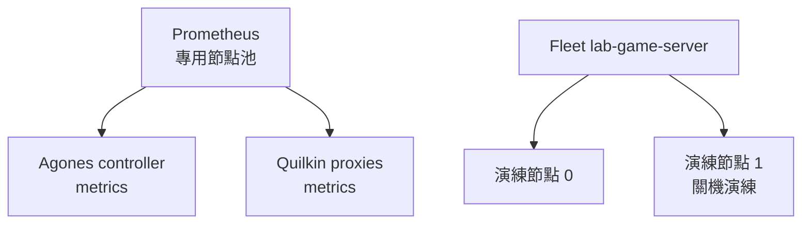

# Day 8: 觀測與韌性——Agones 與 Quilkin metrics、shutdown、crash、節點失效

{ align=right width="90" }

> 玩家已經能配對、拿到 server endpoint、把封包送進 GameServer。接下來要回答的是：server 消失時會發生什麼事，平台又看得到多少。今天先用 Prometheus 抓 Agones controller 與 Quilkin proxy 的 metrics，再讓 GameServer 以四種方式結束：遊戲主動收掉、程序崩潰、Fleet 縮容、整台節點消失。每一種都記下狀態轉移花了幾秒，以及 metrics 何時跟上。

!!! abstract "你在課程的哪裡"
    - **Day 7**：Python client 走完登入、配對、RPC，UDP 帶 token 經 Quilkin 收到 GameServer 的回應。
    - **今天**：在專用的演練節點池上部署 Prometheus，並做四場演練。驗收：metrics 裡的 Ready 數與 kubectl 一致；`EXIT` 與 `CRASH` 之後 Fleet 都補回 Ready，並記下秒數；縮容時 Allocated 不被刪；節點消失後量出探測中斷、NotReady、Unhealthy、補位四個時間點。
    - **Day 9**：用 Unity 的 nakama-unity SDK 重做同一條流程，再加上 relay server 做多人畫面同步。

## GameServer 有四種結束方式

Day 2 看過 Fleet 補位，但那次是手動 `kubectl delete`。正式環境裡，一顆 GameServer 結束的原因通常是下面四種之一，Agones 對每一種的反應不同：

| 結束方式 | 誰觸發 | GameServer 狀態 | 玩家端 |
|---|---|---|---|
| 遊戲主動收掉 | 遊戲程式呼叫 SDK `Shutdown()` | `Shutdown`，隨後刪除 | 對戰已經結束，正常收場 |
| 程序崩潰 | 遊戲程序異常結束或停止回報 health | `Unhealthy`，Fleet 刪掉並補新的 | 對戰中斷 |
| Fleet 縮容 | 營運人員或 autoscaler 調低 replicas | 只刪 `Ready`，`Allocated` 保留 | 進行中的對戰不受影響 |
| 節點消失 | VM 關機、硬體故障、雲端回收 | 等 pod 被驅逐後才變 `Unhealthy` | 對戰中斷，而且要過一段時間平台才知道 |

前三種都由 Agones 自己的 controller 判斷，反應以秒計。第四種要先等 Kubernetes 發現節點失聯、再把 pod 驅逐掉，Agones 才看得到變化；這段時間裡，GameServer 的狀態欄位仍停在節點消失前的樣子。

觀測也會受這個延遲影響。Agones controller 的 `agones_gameservers_count` 依 Fleet 與狀態分組回報 GameServer 數量，資料來源是 GameServer 物件本身，沒有去探測 server 活著沒有。節點死掉但物件還沒更新的那段時間，metrics 也會照舊回報。

節點失效演練會關掉整台 VM，所以演練 Fleet 放在帶 taint 的專用節點池上，只有明確宣告 toleration 的 pod 會排上去。關機前要確認目標節點上沒有演練以外的工作負載，例如正式 Fleet、Quilkin proxy 或 Nakama。



本章的完整檔案在 [labs/sprint5/day8/](https://github.com/DeepWaveLab/CloudNativePracticing/tree/main/labs/sprint5/day8)。

## 步驟 1:部署 Prometheus，抓 Agones 與 Quilkin

Prometheus 用單一 Deployment 部署在 `monitoring-lab` namespace，同樣靠 `nodeSelector` 與 toleration 跑在專用節點池上，image 是 `prom/prometheus:v3.5.0`（完整檔案：[prometheus-lab.yaml](https://github.com/DeepWaveLab/CloudNativePracticing/blob/main/labs/sprint5/day8/prometheus-lab.yaml)）。它需要列出 pod 才能找到抓取目標，所以在 `agones-system` 與 `default` 各給一組只讀 pods 的 Role，subject 是 `monitoring-lab` 的 ServiceAccount `prometheus`：

```yaml
apiVersion: rbac.authorization.k8s.io/v1
kind: Role
metadata:
  name: prometheus-lab-discovery
  namespace: agones-system
rules:
  - apiGroups: [""]
    resources: [pods]
    verbs: [get, list, watch]
```

抓取設定如下。兩個 job 都用 `kubernetes_sd_configs` 直接抓 pod，不經過 Service；原因見[地雷 1](#mine-1) 與[地雷 2](#mine-2)：

```yaml
global:
  scrape_interval: 5s
scrape_configs:
  - job_name: agones-controller
    kubernetes_sd_configs:
      - role: pod
        namespaces:
          names: [agones-system]
    relabel_configs:
      - source_labels: [__meta_kubernetes_pod_label_agones_dev_role]
        regex: controller
        action: keep
      - source_labels: [__meta_kubernetes_pod_ip]
        target_label: __address__
        replacement: "$1:8080"
      - source_labels: [__meta_kubernetes_pod_name]
        target_label: pod
  - job_name: quilkin-proxies
    fallback_scrape_protocol: PrometheusText0.0.4
    kubernetes_sd_configs:
      - role: pod
        namespaces:
          names: [default]
    relabel_configs:
      - source_labels: [__meta_kubernetes_pod_label_role]
        regex: proxy
        action: keep
      - source_labels: [__meta_kubernetes_pod_ip]
        target_label: __address__
        replacement: "$1:8000"
      - source_labels: [__meta_kubernetes_pod_name]
        target_label: pod
```

Agones controller 的 metrics 在 port 8080，Quilkin proxy 的在 admin port 8000。把 Prometheus 的 9090 port-forward 到本機，打開 Targets 頁（或查 `/api/v1/targets`），應看到 2 個 `agones-controller` target 與 3 個 `quilkin-proxies` target 都是 `up`。

接著查 `agones_gameservers_count{fleet_name="lab-game-server",type="Ready"}`。結果應等於 Ready 的顆數，這裡是 2；而且只有 leader 那個 controller pod 有這個 series，原因見[地雷 2](#mine-2)。

同一時間 kubectl 看到的也是 2 顆 Ready：

```text
NAME                          STATE   ADDRESS        PORT   NODE
lab-game-server-s7xfm-2gcfx   Ready   <NODE-IP>      7114   aks-gslab-97904148-vmss000000
lab-game-server-s7xfm-4cl5c   Ready   <NODE-IP>      7356   aks-gslab-97904148-vmss000000
```

Quilkin 則提供封包、丟包與 endpoint 數量等 23 個 `quilkin_` 開頭的 series，例如 `quilkin_packets_total`（依 `event` 分成 read 與 write）、`quilkin_packets_dropped_total` 與 `quilkin_active_endpoints`。這些計數從 proxy 啟動後就開始累積，包含 proxy 收到的所有流量。本次查到其中一顆 proxy 的 read 是 614、write 是 1，dropped 卻有 1363；另一顆的 dropped 是 15868。

`quilkin_packets_dropped_total` 遠大於成功轉送的數量。token 不對或沒帶 token 的封包都算在這裡；proxy 的 LoadBalancer IP 對 Internet 開放，這個數字本來就不會是 0。

## 步驟 2:graceful shutdown——送 `EXIT`

後面三場演練都用一份只指定 Fleet 的 allocation（[gsa-lab.yaml](https://github.com/DeepWaveLab/CloudNativePracticing/blob/main/labs/sprint5/day8/gsa-lab.yaml)），用 `kubectl create -f gsa-lab.yaml` 分配：

```yaml
apiVersion: allocation.agones.dev/v1
kind: GameServerAllocation
spec:
  selectors:
    - matchLabels:
        agones.dev/fleet: lab-game-server
```

另開一個終端機持續觀察演練 Fleet 的 GameServer 狀態，每行加上 UTC 時間：

```console
$ kubectl get gs -l agones.dev/fleet=lab-game-server -w --no-headers \
    -o custom-columns=NAME:.metadata.name,STATE:.status.state,NODE:.status.nodeName,DEL:.metadata.deletionTimestamp \
    | while read -r line; do echo "$(date -u +%H:%M:%S) $line"; done
```

最後一欄是 `deletionTimestamp`，`<none>` 表示還沒開始刪除。

在原本的終端機分配一顆，再對它的 address:port 送 UDP `EXIT`：

```console
$ kubectl create -f gsa-lab.yaml -o jsonpath='{.status.gameServerName} {.status.address} {.status.ports[0].port}'
lab-game-server-s7xfm-2gcfx <NODE-IP> 7114
$ printf 'EXIT' | nc -u -w2 <NODE-IP> 7114
ACK: EXIT
```

觀察視窗這段時間的輸出（`EXIT` 在 02:56:09 送出）：

```text
02:56:09 lab-game-server-s7xfm-2gcfx   Allocated   aks-gslab-97904148-vmss000000   <none>
02:56:10 lab-game-server-s7xfm-2gcfx   Shutdown    aks-gslab-97904148-vmss000000   <none>
02:56:10 lab-game-server-s7xfm-2gcfx   Shutdown    aks-gslab-97904148-vmss000000   2026-09-29T02:56:10Z
02:56:10 lab-game-server-s7xfm-bsn92   PortAllocation                                   <none>
02:56:10 lab-game-server-s7xfm-bsn92   Creating                                         <none>
02:56:10 lab-game-server-s7xfm-bsn92   Starting                                         <none>
02:56:10 lab-game-server-s7xfm-bsn92   Scheduled        aks-gslab-97904148-vmss000000   <none>
02:56:11 lab-game-server-s7xfm-bsn92   Scheduled        aks-gslab-97904148-vmss000000   <none>
02:56:11 lab-game-server-s7xfm-2gcfx   Shutdown         aks-gslab-97904148-vmss000000   2026-09-29T02:56:10Z
02:56:12 lab-game-server-s7xfm-bsn92   RequestReady     aks-gslab-97904148-vmss000000   <none>
02:56:12 lab-game-server-s7xfm-bsn92   Ready            aks-gslab-97904148-vmss000000   <none>
```

`simple-game-server` 收到 `EXIT` 後呼叫 SDK `Shutdown()`，本次量到 1 秒內狀態轉成 `Shutdown`，Agones 刪掉這顆 server，Fleet 再補出 `bsn92`，前後 3 秒。正式的遊戲 server 在對戰結束時也應該走這條路：由遊戲自己宣告「這場結束了」，Agones 就不必等 health check 失敗才發現。

## 步驟 3:crash——送 `CRASH`

`CRASH` 讓程序直接結束，不經過 SDK。同樣先分配一顆再送：

```console
$ kubectl create -f gsa-lab.yaml -o jsonpath='{.status.gameServerName} {.status.address} {.status.ports[0].port}'
lab-game-server-s7xfm-4cl5c <NODE-IP> 7356
$ printf 'CRASH' | nc -u -w2 <NODE-IP> 7356
```

觀察視窗的輸出（`CRASH` 在 02:57:06 送出）：

```text
02:57:06 lab-game-server-s7xfm-4cl5c   Allocated   aks-gslab-97904148-vmss000000   <none>
02:57:10 lab-game-server-s7xfm-4cl5c   Unhealthy   aks-gslab-97904148-vmss000000   <none>
02:57:10 lab-game-server-s7xfm-48427   PortAllocation                                   <none>
02:57:10 lab-game-server-s7xfm-4cl5c   Shutdown         aks-gslab-97904148-vmss000000   <none>
02:57:10 lab-game-server-s7xfm-48427   Creating                                         <none>
02:57:10 lab-game-server-s7xfm-4cl5c   Shutdown         aks-gslab-97904148-vmss000000   2026-09-29T02:57:10Z
02:57:10 lab-game-server-s7xfm-48427   Starting                                         <none>
02:57:10 lab-game-server-s7xfm-4cl5c   Shutdown         aks-gslab-97904148-vmss000000   2026-09-29T02:57:10Z
02:57:10 lab-game-server-s7xfm-48427   Scheduled        aks-gslab-97904148-vmss000000   <none>
02:57:11 lab-game-server-s7xfm-48427   Scheduled        aks-gslab-97904148-vmss000000   <none>
02:57:12 lab-game-server-s7xfm-48427   RequestReady     aks-gslab-97904148-vmss000000   <none>
02:57:12 lab-game-server-s7xfm-48427   Ready            aks-gslab-97904148-vmss000000   <none>
```

送出 `CRASH` 後 client 收不到回應，程序在回 ACK 之前就結束了。本次量到 4 秒後 Agones 把它標成 `Unhealthy`，事件是：

```text
Warning   Unhealthy        gameserver/lab-game-server-s7xfm-4cl5c   Issue with Gameserver pod
Normal    Shutdown         gameserver/lab-game-server-s7xfm-4cl5c   Deletion started
```

Agones 對 `Unhealthy` 的處理是直接刪掉再補一顆新的，不重啟。對玩家來說，這場對戰已經中斷；平台能做的只是盡快補回可分配的容量。

## 步驟 4:縮容時 Allocated 不會被刪

先分配一顆，再把 Fleet 直接縮到 0：

```console
$ kubectl create -f gsa-lab.yaml -o jsonpath='{.status.gameServerName}'
lab-game-server-s7xfm-48427
$ kubectl scale fleet lab-game-server --replicas=0
fleet.agones.dev/lab-game-server scaled
$ kubectl get fleet lab-game-server
NAME              SCHEDULING   DESIRED   CURRENT   ALLOCATED   READY   AGE
lab-game-server   Packed       0         1         1           0       8m40s
$ kubectl get gs -l agones.dev/fleet=lab-game-server
NAME                          STATE       ADDRESS     PORT   NODE                            AGE
lab-game-server-s7xfm-48427   Allocated   <NODE-IP>   7156   aks-gslab-97904148-vmss000000   85s
```

觀察視窗裡，縮容指令送出後 1 秒，Ready 的那顆就被收掉：

```text
02:58:10 lab-game-server-s7xfm-bsn92   Shutdown    aks-gslab-97904148-vmss000000   <none>
02:58:10 lab-game-server-s7xfm-bsn92   Shutdown    aks-gslab-97904148-vmss000000   2026-09-29T02:58:10Z
02:58:10 lab-game-server-s7xfm-bsn92   Shutdown    aks-gslab-97904148-vmss000000   2026-09-29T02:58:10Z
```

`DESIRED 0` 但 `CURRENT 1`：Fleet 只刪掉 Ready 的 `bsn92`，Allocated 的 `48427` 留著，等遊戲自己結束。replicas 調到低於 allocated 數量時，進行中的對戰不會被收掉。

演練後刪掉剛才分配的 GameServer。replicas 先維持 0，下一步要從 0 開始排。

## 步驟 5:節點失效

### 準備：把 Allocated server 放在會被關掉的節點上

節點池擴成 2 台：

```console
$ az aks nodepool scale -g <RESOURCE-GROUP> --cluster-name <CLUSTER> -n gslab --node-count 2
```

```text
NAME                            STATUS   ROLES    AGE   VERSION
aks-gslab-97904148-vmss000000   Ready    <none>   12m   v1.34.10
aks-gslab-97904148-vmss000001   Ready    <none>   43s   v1.34.10
```

Fleet 的 scheduling 是 `Packed`，新的 GameServer 會優先擠到已經有 GameServer 的節點。為了讓演練對象落在節點 1，先 `kubectl cordon` 節點 0，再把 replicas 從 0 設成 1，確認新的 GameServer 排在節點 1 且 Ready 之後，才 `uncordon`。接著分配這顆 server，並依 Day 4 的做法在 allocation metadata 帶上 Quilkin token `k7x`（[gsa-lab-token.yaml](https://github.com/DeepWaveLab/CloudNativePracticing/blob/main/labs/sprint5/day8/gsa-lab-token.yaml)）：

```yaml
apiVersion: allocation.agones.dev/v1
kind: GameServerAllocation
spec:
  selectors:
    - matchLabels:
        agones.dev/fleet: lab-game-server
  metadata:
    annotations:
      quilkin.dev/tokens: azd4   # base64("k7x")
```

把 replicas 設回 2，再看兩顆 GameServer 的 `NODE` 欄位。`Packed` 傾向把新 server 排到已經有 server 的節點，這次第二顆也落在節點 1；若它落在節點 0，關機演練一樣成立，只是被影響的只有 Allocated 那顆：

```text
NAME                          STATE       ADDRESS       PORT   NODE
lab-game-server-s7xfm-bq5kq   Allocated   <NODE-IP>     7061   aks-gslab-97904148-vmss000001
lab-game-server-s7xfm-qlr4x   Ready       <NODE-IP>     7001   aks-gslab-97904148-vmss000001
```

關機前列出節點 1 上的所有 pod。除了 kube-proxy、CNI 這類每台節點都有的 DaemonSet pod，應用程式應該只有演練用的 GameServer，沒有 Nakama、PostgreSQL、Prometheus 或其他服務：

```console
$ kubectl get pods -A -o wide --field-selector spec.nodeName=<要關的節點>
```

### 模擬玩家：每秒一次 UDP 探測

在本機用一支小腳本模擬玩家，每秒經 Quilkin 送一個帶 token 的封包，0.8 秒內沒回應就記一次 timeout（完整檔案：[probe.py](https://github.com/DeepWaveLab/CloudNativePracticing/blob/main/labs/sprint5/day8/probe.py)；參數依序是 proxy 位址、port、token、持續秒數）。主迴圈如下：

```python
s = socket.socket(socket.AF_INET, socket.SOCK_DGRAM); s.settimeout(0.8)
while time.time() < end:
    i += 1; t0 = time.time()
    s.sendto(f"seq{i}".encode() + token, (host, port))
    try:
        data, _ = s.recvfrom(1024); res = "ok " + data.decode().strip()
    except socket.timeout:
        res = "timeout"
    print(time.strftime("%H:%M:%S", time.gmtime(t0)), f"seq{i}", res, flush=True)
    time.sleep(max(0, 1 - (time.time() - t0)))
```

```console
$ python3 probe.py <LB-IP> 7777 k7x 900
```

### 關掉節點 1 的 VM

節點池的 VM 在 AKS 自動建立的 node resource group 裡，是一組 VMSS。`<NODE-RESOURCE-GROUP>` 用 `az aks show -g <RESOURCE-GROUP> -n <CLUSTER> --query nodeResourceGroup -o tsv` 查，`<VMSS-NAME>` 用 `az vmss list -g <NODE-RESOURCE-GROUP> -o table` 查（名稱裡帶著節點池名 `gslab`）。deallocate 節點 1 那台 instance：

```console
$ az vmss deallocate -g <NODE-RESOURCE-GROUP> \
    -n <VMSS-NAME> --instance-ids 1 --no-wait
```

把探測、節點狀態、GameServer 狀態與事件依時間排在一起：

```text
03:01:24 lab-game-server-s7xfm-bq5kq   Allocated   aks-gslab-97904148-vmss000001
03:01:24 lab-game-server-s7xfm-qlr4x   Ready       aks-gslab-97904148-vmss000001
03:01:34 deallocate vmss instance 1 (aks-gslab-97904148-vmss000001)
03:01:35 seq12 ok ACK: seq12
03:01:36 seq13 timeout
03:02:29 aks-gslab-97904148-vmss000001   NotReady
         Warning NodeNotReady pod/lab-game-server-s7xfm-bq5kq  Node is not ready
~03:09:50 Normal TaintManagerEviction pod/lab-game-server-s7xfm-bq5kq  Marking for deletion
03:10:02 lab-game-server-s7xfm-bq5kq   Unhealthy   aks-gslab-97904148-vmss000001
03:10:02 lab-game-server-s7xfm-qlr4x   Unhealthy   aks-gslab-97904148-vmss000001
         Normal SuccessfulDelete gameserverset/lab-game-server-s7xfm  Deleted gameserver in state Unhealthy
03:10:02 lab-game-server-s7xfm-8tjjh   Scheduled   aks-gslab-97904148-vmss000000
03:10:04 lab-game-server-s7xfm-lcl44   Ready       aks-gslab-97904148-vmss000000
03:10:04 lab-game-server-s7xfm-8tjjh   Ready       aks-gslab-97904148-vmss000000
probe: 12 ok / 553 timeout
```

整理成四個時間點（本次量到的數字，不是保證值）：

| 事件 | 時間 | 距離關機 |
|---|---|---|
| 玩家端探測第一次失敗 | 03:01:36 | 2 秒 |
| 節點轉成 `NotReady` | 03:02:29 | 55 秒 |
| pod 被驅逐，兩顆 GameServer 轉成 `Unhealthy` | 03:10:02 | 8 分 28 秒 |
| 存活節點補回 2 顆 Ready | 03:10:04 | 8 分 30 秒 |

玩家端 2 秒就斷線，平台過了 8 分多鐘才把這兩顆 server 算成失效。中間的等待來自 Kubernetes 的 taint-based eviction：節點失聯後會被加上 `node.kubernetes.io/unreachable`，pod 預設容忍這個 taint 300 秒，時間到了才被驅逐。演練結束時節點上的 taint 與 GameServer pod 的預設 toleration：

```text
node.kubernetes.io/unreachable=NoSchedule 2026-09-29T03:02:29Z
node.kubernetes.io/unreachable=NoExecute 2026-09-29T03:02:29Z
node.cloudprovider.kubernetes.io/shutdown=NoSchedule
node.kubernetes.io/out-of-service=NoExecute
---
node.kubernetes.io/not-ready NoExecute 300
node.kubernetes.io/unreachable NoExecute 300
```

本次實測的驅逐時間比 NotReady 加 300 秒又晚了約 2 分 20 秒，節點上也多了 `out-of-service` 與 `cloudprovider shutdown` 兩個 taint。估算節點失效要多久才會被平台發現時，不要只拿 300 秒去算，要用自己環境實測的時間。

### 這段時間 metrics 看到什麼

Prometheus 以 30 秒為一格查 `agones_gameservers_count{fleet_name="lab-game-server"}`，只列數值有變化的時間點：

```text
03:01:23 Allocated 1
03:10:23 Allocated 0
03:01:23 Ready 1
03:10:23 Ready 2
```

節點在 03:01:34 就已經關機，但 `Allocated=1` 與 `Ready=1` 一直維持到 03:10。這 9 分鐘內，看這組 metrics 的人會以為還有一場對戰在進行、還有一顆 server 可以分配；實際上兩者都不存在。

最後，Allocated 的 `bq5kq` 被刪掉後沒有任何東西接手。Fleet 補的是兩顆新的 Ready server，不會把對戰搬過去；帶著 token `k7x` 的探測一直 timeout 到手動停止。玩家端要能自己偵測斷線並重新配對。

## 步驟 6:移除失效節點，拆掉演練環境

用 `delete-machines` 移除已關機的那台節點（就是上面時間線裡 NotReady 的那台），節點池回到 1 台：

```console
$ az aks nodepool delete-machines -g <RESOURCE-GROUP> --cluster-name <CLUSTER> -n gslab \
    --machine-names <NODE-NAME>
```

```text
NAME                              STATUS   ROLES    AGE   VERSION    AGENTPOOL
aks-gamesrv-18046246-vmss000006   Ready    <none>   27m   v1.34.10   gamesrv
aks-gamesrv-18046246-vmss000007   Ready    <none>   27m   v1.34.10   gamesrv
aks-gslab-97904148-vmss000000     Ready    <none>   24m   v1.34.10   gslab
aks-system-26490877-vmss000003    Ready    <none>   27m   v1.34.10   system
```

演練做完後，把演練環境拆掉：依序刪除 `monitoring-lab` namespace 與它在 `agones-system`、`default` 的兩組 Role/RoleBinding、Fleet `lab-game-server`、`nakama-lab` namespace、`nakama-lab-gameserverallocation-create` Role/RoleBinding，最後刪節點池：

```console
$ az aks nodepool delete -g <RESOURCE-GROUP> --cluster-name <CLUSTER> -n gslab
```

## 自我檢查

- Prometheus `/api/v1/targets`：兩個 agones-controller target 與三個 quilkin-proxies target 都是 `up`。
- 查 `agones_gameservers_count{fleet_name="lab-game-server",type="Ready"}`：數值等於 `kubectl get gs` 裡 Ready 的顆數；只有 leader 那顆 controller pod 有這個 series。
- 對 Allocated 的 server 送 `EXIT`／`CRASH`：`EXIT` 轉 `Shutdown`、`CRASH` 轉 `Unhealthy`，兩者都被刪掉並由 Fleet 補回 Ready（本次量到 3 秒與 6 秒）。
- 1 顆 Allocated 時 `kubectl scale fleet lab-game-server --replicas=0`：Fleet 顯示 `DESIRED 0 / CURRENT 1 / ALLOCATED 1 / READY 0`，Allocated 那顆還在。
- 關掉 Allocated 所在的節點：探測在幾秒內開始 timeout；節點先轉 `NotReady`，GameServer 要等 pod 被驅逐才轉 `Unhealthy`（本次量到 8 分 28 秒）；Fleet 在存活節點補回 Ready，探測不會恢復。

## 地雷記錄

### 地雷 1:Prometheus 3 拒收 Quilkin 的 metrics {#mine-1}

**症狀**：quilkin-proxies 的三個 target 都是 `down`，錯誤訊息是 `non-compliant scrape target sending blank Content-Type and no fallback_scrape_protocol specified for target`。

**根因**：Quilkin 0.10 的 admin `/metrics` 回應沒有帶 `Content-Type`。Prometheus 3.x 不再把這種回應自動當成文字格式處理。

**修法**：在 Quilkin 的 scrape job 加上 `fallback_scrape_protocol: PrometheusText0.0.4`，Prometheus 遇到空白或無效的 Content-Type 時改用這個格式解析。

### 地雷 2:透過 Service 抓 Agones controller，GameServer 計數時有時無 {#mine-2}

**症狀**：用 `agones-controller-metrics-service:8080` 當抓取目標，target 顯示 `up`，卻查不到 `agones_gameservers_count`，只有 `agones_k8s_client_*` 這類通用 metrics。

**根因**：Agones controller 跑 2 個副本，用 leader election（lease `agones-controller-lock`）決定由哪一個處理 GameServer；GameServer 相關的 metrics 只有 leader 會輸出。Service 會把 scrape 分到任一副本，分到 standby 時就沒有這些 series。分別直接抓兩個 pod，leader 回傳 16 行 `agones_gameservers_count`，standby 回傳 0 行。

**修法**：改用 `kubernetes_sd_configs` 找出每個 controller pod 直接抓取（需要 `agones-system` 內 pods 的 get/list/watch 權限）。查詢時不必指定 pod，只有 leader 那個 pod 會有這些 series。

### 地雷 3:simple-game-server 的 README 對 `EXIT` 的描述過時 {#mine-3}

**症狀**：README 寫 `EXIT` 會呼叫 `os.Exit(0)` 讓程序結束，照這個描述，預期 GameServer 會像 crash 一樣變成 `Unhealthy`；實測卻是 1 秒內進入 `Shutdown`。

**根因**：Agones `release-1.60.0` 的 `examples/simple-game-server` 原始碼裡，`EXIT` 呼叫的是 SDK `s.Shutdown()`，程序等 Agones 刪 pod、收到 SIGTERM 後才結束。README 沒有跟著更新。

**修法**：以原始碼為準：`EXIT` 是 graceful shutdown，`CRASH` 才是程序直接結束。範例程式的行為要看對應版本的原始碼，README 只能當線索。

## 帶得走的東西

- 對戰結束時由遊戲自己呼叫 SDK `Shutdown()`，Agones 本次量到 1 秒內就知道；靠 health check 發現崩潰要多等幾秒；節點消失則要等到 pod 被驅逐，本次量到超過 8 分鐘。
- `agones_gameservers_count` 反映的是 GameServer 物件的狀態，不是 server 的存活。節點失聯期間它照舊回報，容量監控要搭配節點 Ready 狀態一起看。
- Fleet 縮容只刪 Ready；Allocated 要等遊戲自己結束，這是進行中的對戰不被營運動作打斷的保證。
- 節點失效時，Fleet 補的是新容量，原本的對戰不會接續；斷線重連與重新配對是 client 與後端的責任。
- 會關掉節點的演練放在帶 taint 的專用節點池上；關機前確認目標節點上的應用程式只有演練用的 GameServer，影響才只限於演練 Fleet。

## 正式環境還要補的

Azure Spot VM 被回收前，可以透過 Scheduled Events 收到通知，但通知是 best effort，最多提前 30 秒；平台要處理通知沒有及時送到、剩下的時間不夠結束對戰的情況。用關機模擬的節點失效沒有這段通知。節點維護（`kubectl drain`）、PodDisruptionBudget、Agones 的 `Reserved` 狀態與 `gracefulTerminationDelaySec`，也都會影響 Allocated server 在節點離開時的行為，上線前要各自演練。

監控這一側，Prometheus 要有多副本與持久化儲存，再加上儀表板與告警規則；Quilkin 的計數預設包含 proxy 收到的所有流量，要依 token 或 GameServer 拆開看，得另外規劃。

## 延伸閱讀

想往下深挖，從這幾份開始：

- **[Agones metrics](https://agones.dev/site/docs/guides/metrics/)** —— 列出 `agones_gameservers_count` 等 controller metrics 的意義，以及用 Prometheus 抓取的方式。
- **[Agones health checking](https://agones.dev/site/docs/guides/health-checking/)** —— 說明 GameServer 何時轉成 `Unhealthy`，以及 Fleet 刪除並替換 Unhealthy server 的規則。
- **[Kubernetes taints and tolerations](https://kubernetes.io/docs/concepts/scheduling-eviction/taint-and-toleration/)** —— taint-based eviction 與 `not-ready`、`unreachable` 預設 300 秒 toleration 的來源。
- **[Prometheus configuration](https://prometheus.io/docs/prometheus/latest/configuration/configuration/)** —— 查 `fallback_scrape_protocol` 的可用值，對應地雷 1。
- **[simple-game-server 原始碼（release-1.60.0）](https://github.com/googleforgames/agones/blob/release-1.60.0/examples/simple-game-server/main.go)** —— `EXIT`、`CRASH` 與 `automaticShutdownDelaySec` 的實際行為，對應地雷 3。

## 下一步

[Day 9](sprint5-day9-unity-client.md) 改用 Unity 的 nakama-unity SDK 重做同一條流程，再用自寫的 relay server 讓兩個 Unity 視窗互相看到對方移動。

---

!!! quote ""
    Agones 標誌為 CNCF（Linux Foundation）官方資產，此處作社群教學用途。
