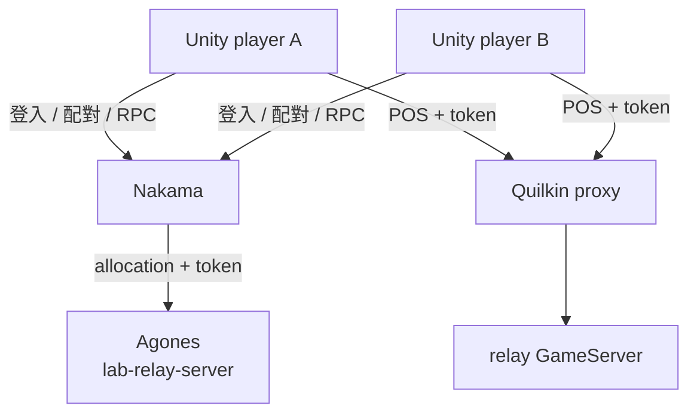
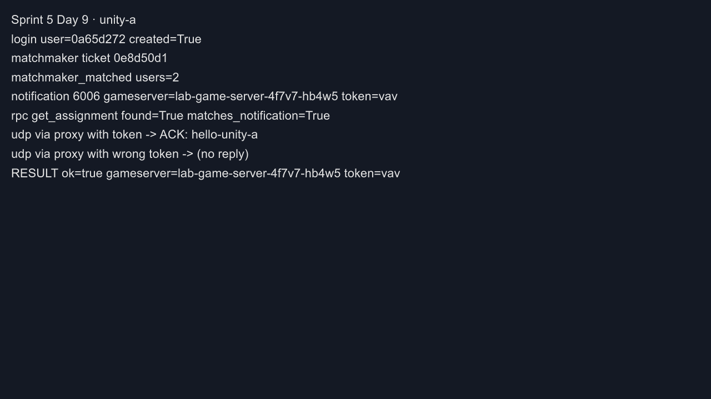
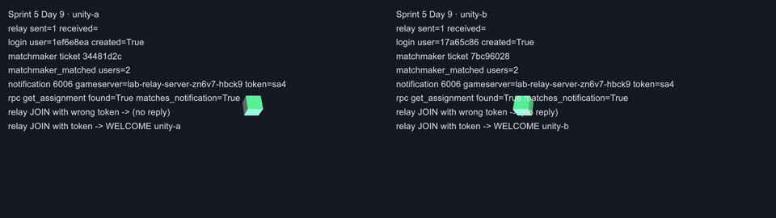
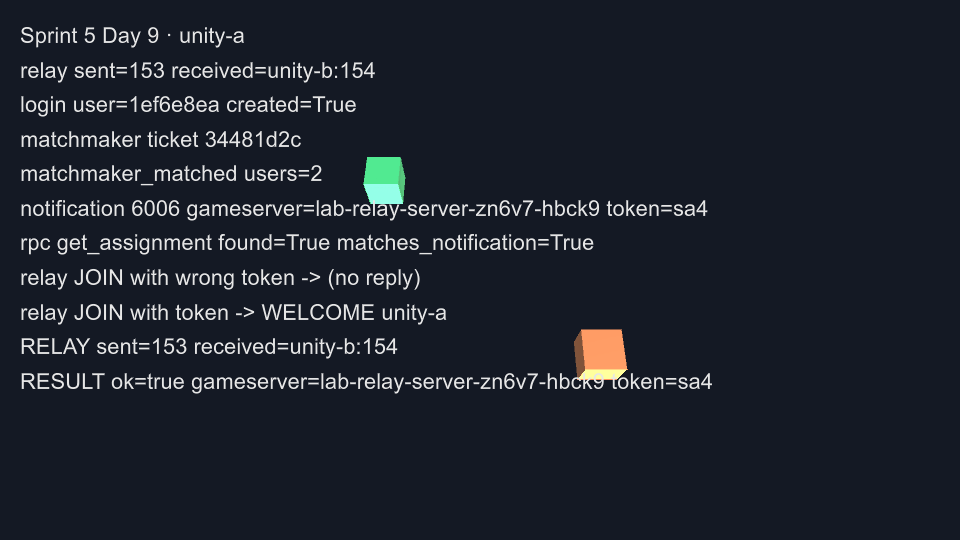
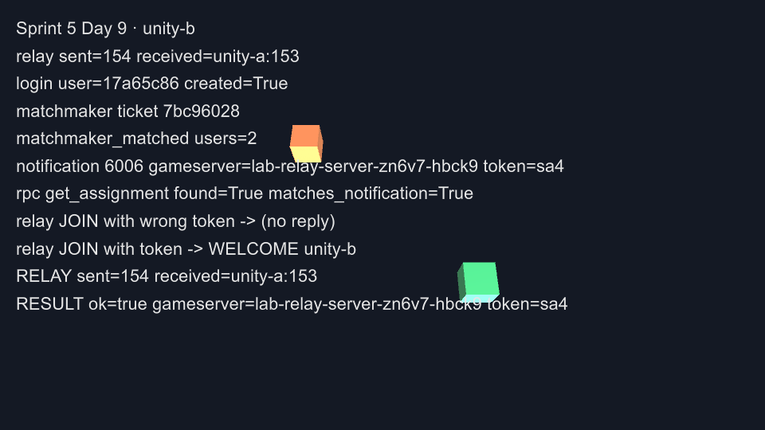

# Day 9: Unity client——nakama-unity SDK、CLI build、relay server 多人同步

{ align=right width="72" }

> Day 7 用 Python 證明了玩家端三段連線接得起來，但遊戲 client 實際上多半用遊戲引擎寫。今天分兩部分。Part 1 用 Unity 與 Nakama 官方的 nakama-unity SDK 重做 Day 7 的流程，整個專案從建立、加套件、build 到執行都用 Unity 的命令列完成。Part 2 讓畫面真的動起來：自己寫一個小型 relay server 放進 Agones，兩個 Unity 視窗互相看得到對方的角色在移動。

!!! abstract "你在課程的哪裡"
    - **Day 7**：Python client 走完登入、配對、RPC，UDP 帶 token 經 Quilkin 收到 GameServer 的回應。
    - **今天**：Part 1 用 nakama-unity v3.22.0 做兩個 Unity player，驗收同 Day 7；Part 2 部署 Go 寫的 relay server，驗收：兩個 player 在 10 秒內各自收到對方一半以上的位置封包，兩人離開後 relay 自己呼叫 SDK `Shutdown()`。
    - **Day 10**：回顧這十天、談實務上怎麼取捨，並列出這門課沒教的主題。

## Unity client 與 relay server 各自負責什麼

Part 1 的 Unity client 做的事跟 Day 7 的 Python client 完全一樣，只是改用 SDK：

| 步驟 | Day 7 Python（直接打 API） | Day 9 Unity（nakama-unity SDK） |
|---|---|---|
| 登入 | `POST /v2/account/authenticate/device` | `client.AuthenticateDeviceAsync()` |
| 開 realtime socket | 手寫 WebSocket 握手與 frame | `client.NewSocket()` + `ConnectAsync()` |
| 排隊 | 送 `matchmaker_add` JSON | `socket.AddMatchmakerAsync("*", 2, 2)` |
| 收配對結果 | 自己解析訊息類型 | `ReceivedMatchmakerMatched`、`ReceivedNotification` 事件 |
| RPC | body 要送 JSON 字串 | `client.RpcAsync(session, "get_assignment", "{}")` |
| UDP 經 Quilkin | `socket` | `System.Net.Sockets.UdpClient` |

SDK 省掉的是 WebSocket 與訊息格式的細節；UDP 那一段 SDK 不管，因為遊戲封包本來就不經過 Nakama。

到 Part 1 為止，Fleet 裡跑的仍是 `simple-game-server`。它收到什麼就原樣回給送的人，不會轉給同一場的另一個玩家，所以就算 Unity 畫了兩個角色，A 也看不到 B 在動。Part 2 換成一個會轉發的 relay server：每個玩家送來的位置，轉給同一顆 server 上的其他玩家。其他元件都不變，Nakama 照樣負責登入、配對與 allocation，Quilkin 照樣用 token 轉送。

「relay」在 Nakama 的文件裡還有另一個意思，兩者要分清楚：

| | Nakama client relayed multiplayer | 本章的 relay server |
|---|---|---|
| 遊戲封包走哪裡 | Nakama 的 realtime socket（WebSocket，TCP） | UDP，經 Quilkin 到 Agones 上的 GameServer |
| server 是誰 | Nakama 本身轉發 | 一顆由 Agones 管理的 dedicated server |
| 生命週期 | 跟著 Nakama 的 match | 跟著 GameServer：`Ready` → `Allocated` → `Shutdown` |

本章用後者：relay 部署成 Agones 的 GameServer，分配與生命週期都由 Agones 管理，Day 8 看過的 shutdown、補位與節點失效行為也都適用。



Unity 這一側全程用命令列操作，不開 Editor 的畫面，同樣的步驟可以放進 CI 或沒有螢幕的機器上重跑。Unity 的執行檔有兩種用法：Editor 加上 `-batchmode` 可以建專案、匯入套件、執行自訂的 build 方法；build 出來的 player 則可以用 `-logFile` 把 `Debug.Log` 寫到檔案，也可以加 `-batchmode -nographics` 在沒有畫面的情況下執行。player 的 log 記下每一步的結果，截圖用 `ScreenCapture.CaptureScreenshot()` 從 player 裡直接輸出。

## 開始之前

Part 1 需要 Day 7 的演練環境：演練節點池、`nakama-lab`（含 `get_assignment` 的 module）與 `lab-game-server` Fleet。Day 8 結尾已經拆掉，照 [Day 7 步驟 1–2](sprint5-day7-python-client-e2e.md) 重新建立。Part 2 再部署 relay Fleet，並把 allocation selector 切到 relay。

本機需要 Unity 6000.3.19f1（batchmode 也需要已啟用的授權，Personal 即可）。nakama-unity 用 v3.22.0，2026-09-17 發布，截至 2026-09 是最新版。Part 2 另外需要一個叢集拉得到 image 的 container registry；image 在 ACR 上 build，本機不需要 Docker。完整檔案在 [labs/sprint5/day9/](https://github.com/DeepWaveLab/CloudNativePracticing/tree/main/labs/sprint5/day9)。

## Part 1：用 nakama-unity 重做玩家流程

### 步驟 1:用命令列建專案並加入 nakama-unity

`UNITY` 指向 Unity 執行檔（macOS 的 Hub 安裝路徑如下）。先建空專案：

```console
$ UNITY=/Applications/Unity/Hub/Editor/6000.3.19f1/Unity.app/Contents/MacOS/Unity
$ $UNITY -batchmode -nographics -createProject cnp-day9-unity -logFile day9-create.log -quit
$ echo $?
0
```

batchmode 需要已啟用的授權，建專案的 log 裡會看到授權類型：

```text
[Licensing::Module] License group:
  Product: Unity Personal Version
```

官方 README 提供用 git URL 加入套件的方式，直接改 `Packages/manifest.json`，版本釘在 tag（完整檔案：[manifest.json](https://github.com/DeepWaveLab/CloudNativePracticing/blob/main/labs/sprint5/day9/manifest.json)）：

```json
"com.heroiclabs.nakama-unity": "https://github.com/heroiclabs/nakama-unity.git?path=/Packages/Nakama#v3.22.0"
```

下次用 batchmode 開這個專案時，Package Manager 會自動抓下套件。

### 步驟 2:寫 client

`Assets/Scripts/Day9Client.cs`（完整檔案：[Day9Client.cs](https://github.com/DeepWaveLab/CloudNativePracticing/blob/main/labs/sprint5/day9/Day9Client.cs)）是一個掛在場景物件上的 MonoBehaviour。參數從命令列讀取（`-player`、`-nakamaPort`、`-screenshot` 等），這樣同一個 build 可以用不同身分跑兩次。主要流程：

```csharp
var client = new Client("http", host, port, "defaultkey", UnityWebRequestAdapter.Instance);
var session = await client.AuthenticateDeviceAsync($"sprint5-day9-{playerName}-{Guid.NewGuid():N}");
Log($"login user={session.UserId.Substring(0, 8)} created={session.Created}");

var socket = client.NewSocket();
var matched = new TaskCompletionSource<IMatchmakerMatched>();
var assigned = new TaskCompletionSource<Assignment>();
socket.ReceivedMatchmakerMatched += m => matched.TrySetResult(m);
socket.ReceivedNotification += n =>
{
    if (n.Code == 6006) assigned.TrySetResult(JsonUtility.FromJson<Assignment>(n.Content));
};
await socket.ConnectAsync(session);

var ticket = await socket.AddMatchmakerAsync("*", 2, 2);
```

跟 Day 7 一樣，要同時等到 `matchmaker_matched` 與 6006 通知才往下走，兩者的先後順序不固定：

```csharp
var timeout = Task.Delay(TimeSpan.FromSeconds(60));
if (await Task.WhenAny(Task.WhenAll(matched.Task, assigned.Task), timeout) == timeout)
{
    throw new TimeoutException($"matched={matched.Task.IsCompleted} assignment={assigned.Task.IsCompleted}");
}
```

RPC 由 SDK 處理字串編碼，回傳的 `Payload` 是 JSON 字串：

```csharp
var rpc = await client.RpcAsync(session, "get_assignment", "{}");
var fromRpc = JsonUtility.FromJson<Assignment>(rpc.Payload);
```

`Assignment` 的欄位名稱必須跟 Day 7 Lua module 寫入的 key 一致（`gameserver`、`proxy`、`routing_token`、`direct`），`JsonUtility` 才解析得到。UDP 那一段用 `UdpClient`，把 token 接在 payload 後面，3 秒內沒回應就當成被擋下：

```csharp
var bytes = Encoding.UTF8.GetBytes(payload);
await udp.SendAsync(bytes, bytes.Length, parts[0], int.Parse(parts[1]));
var receive = udp.ReceiveAsync();
if (await Task.WhenAny(receive, Task.Delay(3000)) != receive) return null;
```

每一步都呼叫 `Log()`，同時寫進 `Debug.Log`（進 player log）與畫面上 `OnGUI` 顯示的文字。`OnGUI` 的白字壓在預設天空盒的地平線亮帶上不易辨識，client 啟動時把攝影機背景設成深色純色（`CameraClearFlags.SolidColor`）。

### 步驟 3:用 `-executeMethod` build macOS player

Editor script `Assets/Editor/Day9Build.cs`（完整檔案：[Day9Build.cs](https://github.com/DeepWaveLab/CloudNativePracticing/blob/main/labs/sprint5/day9/Day9Build.cs)）做三件事：建一個場景、放一個掛著 `Day9Client` 的物件、build 出 macOS player。

```csharp
public static void BuildMac()
{
    var scene = EditorSceneManager.NewScene(NewSceneSetup.DefaultGameObjects, NewSceneMode.Single);
    var client = new GameObject("Day9Client").AddComponent<Day9Client>();
    client.localMaterial = CreateMaterial("Assets/Materials/Local.mat", new Color(0.2f, 0.8f, 0.4f));
    client.remoteMaterial = CreateMaterial("Assets/Materials/Remote.mat", new Color(0.95f, 0.45f, 0.2f));
    System.IO.Directory.CreateDirectory("Assets/Scenes");
    EditorSceneManager.SaveScene(scene, ScenePath);

    PlayerSettings.fullScreenMode = FullScreenMode.Windowed;
    PlayerSettings.runInBackground = true;

    var report = BuildPipeline.BuildPlayer(new BuildPlayerOptions
    {
        scenes = new[] { ScenePath },
        locationPathName = "Build/Day9Client.app",
        target = BuildTarget.StandaloneOSX,
        options = BuildOptions.None,
    });
    Debug.Log($"[day9-build] result={report.summary.result} size={report.summary.totalSize} errors={report.summary.totalErrors}");
    EditorApplication.Exit(report.summary.result == UnityEditor.Build.Reporting.BuildResult.Succeeded ? 0 : 1);
}
```

兩個 material 是 Part 2 要用的，原因見[地雷 1](#mine-1)。`runInBackground` 要打開，否則兩個視窗同時跑時，失去焦點的那個會暫停更新。

```console
$ $UNITY -batchmode -nographics -projectPath cnp-day9-unity -executeMethod Day9Build.BuildMac -logFile day9-build.log
$ echo $?
0
```

```text
com.heroiclabs.nakama-unity@https://github.com/heroiclabs/nakama-unity.git?path=/Packages/Nakama#v3.22.0 (location: .../Library/PackageCache/com.heroiclabs.nakama-unity@903c3cd9c59d)
Build Finished, Result: Success.
[day9-build] result=Succeeded size=107192976 errors=0
```

log 裡可能出現 `Error: Access token is unavailable; failed to update`。只要授權仍解析為 Personal、build 結果是 `Succeeded`，就可以繼續。

### 步驟 4:跑兩個 player

啟動 player 前，確認 `lab-game-server` Fleet 有 Ready 的 server，並把 `nakama-lab` 的 Nakama port-forward 到本機 17350（`kubectl -n nakama-lab port-forward svc/nakama 17350:7350`）。A 開視窗並在結束前截圖，B 用 `-batchmode -nographics` 在背景跑：

```console
$ APP=cnp-day9-unity/Build/Day9Client.app/Contents/MacOS/Day9Client
$ $APP -logFile player-a.log -player unity-a -nakamaPort 17350 -screenshot player-a.png \
    -screen-width 1280 -screen-height 720 -screen-fullscreen 0 &
$ $APP -batchmode -nographics -logFile player-b.log -player unity-b -nakamaPort 17350 &
```

兩個 player 都以 exit code 0 結束。從兩份 log 挑出 client 印的狀態行（下面節錄登入到結果的部分）：

```console
$ grep -hF '[day9]' player-a.log player-b.log
[day9] unity-a: login user=3509bbe2 created=True
[day9] unity-a: matchmaker ticket 90e22260
[day9] unity-a: matchmaker_matched users=2
[day9] unity-a: notification 6006 gameserver=lab-game-server-4f7v7-ddw75 token=wrb
[day9] unity-a: rpc get_assignment found=True matches_notification=True
[day9] unity-a: udp via proxy with token -> ACK: hello-unity-a
[day9] unity-a: udp via proxy with wrong token -> (no reply)
[day9] unity-a: RESULT ok=true gameserver=lab-game-server-4f7v7-ddw75 token=wrb
[day9] unity-b: login user=ee99bee2 created=True
[day9] unity-b: matchmaker ticket b791dbb6
[day9] unity-b: matchmaker_matched users=2
[day9] unity-b: notification 6006 gameserver=lab-game-server-4f7v7-ddw75 token=wrb
[day9] unity-b: rpc get_assignment found=True matches_notification=True
[day9] unity-b: udp via proxy with token -> ACK: hello-unity-b
[day9] unity-b: udp via proxy with wrong token -> (no reply)
[day9] unity-b: RESULT ok=true gameserver=lab-game-server-4f7v7-ddw75 token=wrb
```

GameServer 這一側的對照跟 Day 7 步驟 7 相同：

```console
$ kubectl get gs lab-game-server-4f7v7-ddw75 \
    -o jsonpath='{.status.state} {.metadata.labels.agones\.dev/fleet} tokens={.metadata.annotations.quilkin\.dev/tokens}'
Allocated lab-game-server tokens=d3Ji
$ echo -n wrb | base64
d3Ji
$ kubectl logs lab-game-server-4f7v7-ddw75 -c simple-game-server | grep 'Received UDP'
2026/09/29 05:02:25 Received UDP: hello-unity-b
2026/09/29 05:02:25 Received UDP: hello-unity-a
```

再執行一次配對，這次分到另一顆 Ready 的 GameServer，兩個 player 一樣是 `RESULT ok=true`。player A 視窗的截圖：



## Part 2：relay server 與多人畫面同步

### 步驟 5:用 Go 寫 relay server

relay server 用 Go 加 Agones Go SDK（v1.60.0）寫（完整檔案：[relay-server/main.go](https://github.com/DeepWaveLab/CloudNativePracticing/blob/main/labs/sprint5/day9/relay-server/main.go)），協定是三種純文字訊息：

| 訊息 | 意思 | relay 的反應 |
|---|---|---|
| `JOIN <player>` | 玩家加入 | 用來源位址記下這個玩家，回 `WELCOME <player>` |
| `POS <player> <seq> <x> <z>` | 玩家目前的位置 | 原樣轉給其他所有玩家 |
| `BYE <player>` | 玩家離開 | 從名單移除 |

client 送出的每個封包尾端都帶著 routing token，Quilkin 轉送前已經剝掉，所以 relay 收到的是乾淨的訊息。轉發的核心：

```go
case "POS":
	p, ok := r.peers[key]
	if !ok {
		return
	}
	p.lastSeen = time.Now()
	for otherKey, other := range r.peers {
		if otherKey == key {
			continue
		}
		r.send(other.addr, msg)
		r.forwarded[p.name+"->"+other.name]++
		if n := r.forwarded[p.name+"->"+other.name]; n == 1 || n%50 == 0 {
			log.Printf("relay %s->%s count=%d last=%q", p.name, other.name, n, msg)
		}
	}
```

`key` 是封包的來源位址（IP:port）。所有玩家都經過 Quilkin 進來，來源 IP 都是 proxy 的出口 IP，relay 靠 port 分辨是哪個玩家。回傳給玩家的封包也送到這個位址，Quilkin 會把它轉回對應的 client。

跟 Agones 的互動有四個：啟動後呼叫 `Ready()`；每 2 秒呼叫 `Health()`；用 `WatchGameServer()` 得知自己被分配；對戰結束時呼叫 `Shutdown()`。結束的條件是被分配之後，所有玩家都已離開，或 60 秒沒有收到任何封包：

```go
func (r *relay) shouldShutdown() bool {
	r.mu.Lock()
	defer r.mu.Unlock()
	if !r.allocated || r.lastPkt.IsZero() {
		return false
	}
	return len(r.peers) == 0 || time.Since(r.lastPkt) > idleTimeout
}
```

這就是 Day 8 步驟 2 講的 graceful shutdown：由 game server 自己宣告對戰結束，Agones 不必等 health check 失敗。

### 步驟 6:build image 並部署 relay Fleet

image 用 multi-stage Dockerfile，最終層是 distroless（完整檔案：[relay-server/Dockerfile](https://github.com/DeepWaveLab/CloudNativePracticing/blob/main/labs/sprint5/day9/relay-server/Dockerfile)）：

```dockerfile
FROM golang:1.26 AS build
WORKDIR /src
COPY go.mod go.sum ./
RUN go mod download
COPY main.go ./
RUN CGO_ENABLED=0 GOOS=linux go build -trimpath -ldflags="-s -w" -o /relay .

FROM gcr.io/distroless/static-debian12:nonroot
COPY --from=build /relay /relay
EXPOSE 7654/udp
ENTRYPOINT ["/relay"]
```

用 ACR Tasks 在雲端 build，不需要本機 Docker：

```console
$ az acr build -r <ACR-NAME> -t cnp-day9-relay:0.1.0 --platform linux/amd64 .
```

```text
    repository: cnp-day9-relay
    tag: 0.1.0
    digest: sha256:bb1dff40c35c8c41b0b62d35a90b95fc5af20c34e515db166d3ec8aeed3a7463
Run ID: cef was successful after 1m21s
```

前提是叢集要有權限拉這個 registry 的 image，可以用 `az aks check-acr -g <RESOURCE-GROUP> -n <CLUSTER> --acr <ACR-NAME>.azurecr.io` 確認；沒有權限時，授權方式見 [AKS 與 Azure Container Registry 整合](https://learn.microsoft.com/en-us/azure/aks/cluster-container-registry-integration)。接著 Fleet 由 Day 7 的 `lab-game-server` 改出（完整檔案：[relay-fleet.yaml](https://github.com/DeepWaveLab/CloudNativePracticing/blob/main/labs/sprint5/day9/relay-fleet.yaml)）：名稱改成 `lab-relay-server`、container 改用 relay image，port 仍是 7654。

Nakama 這一側改兩處。第一處是 Lua module：allocation selector 原本寫死 `lab-game-server`，改成從 runtime env 讀（完整檔案：[nakama-lab-module.yaml](https://github.com/DeepWaveLab/CloudNativePracticing/blob/main/labs/sprint5/day9/nakama-lab-module.yaml)）：

```lua
selectors = { { matchLabels = { ["agones.dev/fleet"] = context.env["FLEET_NAME"] } } },
```

第二處是 Nakama 啟動參數，加上 `--runtime.env "FLEET_NAME=lab-relay-server"`（[nakama-lab.yaml](https://github.com/DeepWaveLab/CloudNativePracticing/blob/main/labs/sprint5/day9/nakama-lab.yaml)）。套用修改後的 module 與 Deployment，等 Nakama rollout 完成；Nakama 的 pod 換過之後，原本的 port-forward 會失效，要重開一次（見 [Day 6 地雷 3](sprint5-day6-matchmaking.md#mine-3)）。部署 relay Fleet 後，兩顆 relay 都 Ready：

```text
NAME                           STATE   ADDRESS         PORT   NODE
lab-relay-server-zn6v7-5k8cb   Ready   <NODE-IP>       7020   aks-gslab-29120627-vmss000000
lab-relay-server-zn6v7-7rxkc   Ready   <NODE-IP>       7843   aks-gslab-29120627-vmss000000
```

relay 的 log 第一行是 `relay listening on :7654, marked Ready`，代表它已經呼叫過 `Ready()`。

### 步驟 7:client 加上 relay 模式

client 加一個 `-relay <秒數>` 參數。拿到 assignment 之後，改走 relay 流程：先用錯的 token 送一次 `JOIN` 確認被擋下，再用正確 token 加入，然後每 50 毫秒送一次自己的位置，讓方塊繞著圓心轉。兩個 player 的相位差半圈，畫面上會在圓的兩端：

```csharp
while (Time.realtimeSinceStartup - start < relaySeconds)
{
    var t = Time.realtimeSinceStartup - start;
    var pos = new Vector3(Mathf.Cos(t * 1.5f + phase) * 4f, 0.5f, Mathf.Sin(t * 1.5f + phase) * 4f);
    local.transform.position = pos;
    sent++;
    var msg = Encoding.UTF8.GetBytes($"POS {playerName} {sent} {pos.x:F2} {pos.z:F2}" + token);
    await udp.SendAsync(msg, msg.Length);
    if (framesDir != null && t >= nextShot)
    {
        ScreenCapture.CaptureScreenshot(System.IO.Path.Combine(framesDir, $"frame-{frame++:D3}.png"));
        nextShot += 0.25f;
    }
    await Task.Delay(50);
}
```

同時另一個迴圈接收對方的 `POS`，更新代表對方的方塊位置，並分別計數：

```csharp
var f = Encoding.UTF8.GetString(receive.Result.Buffer).Trim().Split(' ');
if (f.Length < 5 || f[0] != "POS" || f[1] == playerName) continue;
receivedFrom[f[1]] = receivedFrom.TryGetValue(f[1], out var n) ? n + 1 : 1;
var x = float.Parse(f[3], System.Globalization.CultureInfo.InvariantCulture);
var z = float.Parse(f[4], System.Globalization.CultureInfo.InvariantCulture);
Avatar(f[1], false).transform.position = new Vector3(x, 0.5f, z);
```

時間到了送 `BYE`，最後判定：收到對方的封包數至少是自己送出數的一半，才算 `RESULT ok=true`。解析座標時固定用 `InvariantCulture`，避免系統語系把小數點當成逗號。

### 步驟 8:兩個視窗互相看到

這一步兩個 player 都開視窗，各自每 0.25 秒存一張畫面：

```console
$ $APP -logFile relay-a.log -player unity-a -nakamaPort 17350 -relay 10 -frames frames-a -screenshot relay-a.png \
    -screen-width 960 -screen-height 540 -screen-fullscreen 0 &
$ $APP -logFile relay-b.log -player unity-b -nakamaPort 17350 -relay 10 -frames frames-b -screenshot relay-b.png \
    -screen-width 960 -screen-height 540 -screen-fullscreen 0 &
```

兩個 player 都以 exit code 0 結束：

```console
$ grep -hF '[day9]' relay-a.log relay-b.log | grep -E 'notification|JOIN|RELAY|RESULT'
[day9] unity-a: notification 6006 gameserver=lab-relay-server-zn6v7-hbck9 token=sa4
[day9] unity-a: rpc get_assignment found=True matches_notification=True
[day9] unity-a: relay JOIN with wrong token -> (no reply)
[day9] unity-a: relay JOIN with token -> WELCOME unity-a
[day9] unity-a: RELAY sent=153 received=unity-b:154
[day9] unity-a: RESULT ok=true gameserver=lab-relay-server-zn6v7-hbck9 token=sa4
[day9] unity-b: notification 6006 gameserver=lab-relay-server-zn6v7-hbck9 token=sa4
[day9] unity-b: rpc get_assignment found=True matches_notification=True
[day9] unity-b: relay JOIN with wrong token -> (no reply)
[day9] unity-b: relay JOIN with token -> WELCOME unity-b
[day9] unity-b: RELAY sent=154 received=unity-a:153
[day9] unity-b: RESULT ok=true gameserver=lab-relay-server-zn6v7-hbck9 token=sa4
```

10 秒內雙方各送出約 150 個位置，也收到對方約 150 個，沒有掉包。想把兩個視窗的逐格畫面左右並排成 GIF，可以用 ffmpeg：

```console
$ ffmpeg -framerate 4 -i frames-a/frame-%03d.png -framerate 4 -i frames-b/frame-%03d.png \
    -filter_complex "[0:v]scale=480:-1[a];[1:v]scale=480:-1[b];[a][b]hstack=inputs=2,split[s0][s1];[s0]palettegen=max_colors=64[p];[s1][p]paletteuse=dither=bayer" \
    -loop 0 relay-two-players.gif
```



綠色方塊是自己，橘色是對方。A 視窗裡的橘色方塊，就是 B 視窗裡的綠色方塊，位置互相對應。結束時兩個視窗的畫面：





relay server 這一側的 log 與 GameServer 狀態：

```text
2026/09/29 05:18:00 relay listening on :7654, marked Ready
2026/09/29 05:29:26 state Allocated tokens=c2E0
2026/09/29 05:29:31 join player=unity-a from=<PROXY-EGRESS-IP>:1026 peers=1
2026/09/29 05:29:31 join player=unity-b from=<PROXY-EGRESS-IP>:1028 peers=2
2026/09/29 05:29:31 relay unity-a->unity-b count=1 last="POS unity-a 1 4.00 0.00"
2026/09/29 05:29:31 relay unity-b->unity-a count=1 last="POS unity-b 1 -4.00 0.00"
2026/09/29 05:29:34 relay unity-a->unity-b count=50 last="POS unity-a 50 0.49 -3.97"
2026/09/29 05:29:37 relay unity-b->unity-a count=100 last="POS unity-b 100 3.87 1.03"
2026/09/29 05:29:41 relay unity-a->unity-b count=150 last="POS unity-a 150 -1.92 3.51"
2026/09/29 05:29:41 relay unity-b->unity-a count=150 last="POS unity-b 150 1.73 -3.61"
2026/09/29 05:29:41 bye player=unity-a peers=1
2026/09/29 05:29:41 bye player=unity-b peers=0
2026/09/29 05:29:42 session ended, calling SDK Shutdown
```

```text
05:29:26 lab-relay-server-zn6v7-hbck9   Allocated
05:29:42 lab-relay-server-zn6v7-hbck9   Shutdown
05:29:42 lab-relay-server-zn6v7-q6b8f   PortAllocation
05:29:44 lab-relay-server-zn6v7-q6b8f   Ready
```

對照 relay 的 log：

- `c2E0` 是 `sa4` 的 base64，跟 client 收到的 token 相同。
- 兩個玩家的來源都是同一個 proxy 出口 IP，port 分別是 1026 與 1028。relay 看不到玩家的真實 IP，只能用 port 分辨。
- 兩人都 `bye` 之後 1 秒，relay 呼叫 SDK `Shutdown()`，GameServer 轉成 `Shutdown`，Fleet 在 2 秒內補出新的 Ready。這個 relay 能自己收尾，不像 `simple-game-server` 要手動刪。

### 步驟 9:收尾

relay 在對戰結束時會自己呼叫 `Shutdown()`，不需要手動刪 GameServer。不再使用時，依序刪掉 `lab-game-server` Fleet、`lab-relay-server` Fleet、`nakama-lab` namespace、`nakama-lab-gameserverallocation-create` Role/RoleBinding，最後刪掉演練節點池：

```console
$ az aks nodepool delete -g <RESOURCE-GROUP> --cluster-name <CLUSTER> -n gslab
```

## 自我檢查

- `-executeMethod Day9Build.BuildMac` 的 log：`Build Finished, Result: Success.`，`errors=0`。
- 兩個 player 的 log（Part 1）：同一個 `gameserver=` 與 `token=`；`matches_notification=True`；帶 token 收到 `ACK`、錯 token `(no reply)`；`RESULT ok=true`，exit 0。
- `az acr build` 與 relay Fleet：build `successful`；`kubectl get gs` 有 2 顆 `lab-relay-server-*` Ready，log 有 `marked Ready`。
- 兩個 player 的 log（Part 2）：`WELCOME <player>`；`RELAY received` 至少是自己 `sent` 的一半（本次量到約 153/154）；兩個視窗都看得到對方的方塊。
- relay server 的 log 與 `kubectl get gs -w`：兩個 `join` 來自同一個 IP、不同 port；兩個 `bye` 之後 `calling SDK Shutdown`，GameServer 轉 `Shutdown`，Fleet 補出新 Ready。

## 地雷記錄

### 地雷 1:執行期建立的方塊在 player build 裡變成洋紅色 {#mine-1}

**症狀**：用 `GameObject.CreatePrimitive(PrimitiveType.Cube)` 在執行期建出方塊，再設定 `material.color`，build 出來的 player 裡方塊全部顯示成洋紅色，顏色設定沒有作用。

**根因**：這是 built-in render pipeline 的專案，build 時 Unity 只打包場景與資產實際引用到的 shader。場景裡沒有任何物件用到 Standard shader，它就被剝掉了；執行期才建的方塊找不到 shader，顯示成 Unity 代表「shader 錯誤」的洋紅色。

**修法**：在 build script 裡用 `new Material(Shader.Find("Standard"))` 建成 material 資產，指派給場景中 `Day9Client` 的序列化欄位，讓 Standard shader 因為被引用而打包進去；執行期改用 `sharedMaterial` 套上這兩個 material。另一個做法是把 shader 加進 Graphics Settings 的 [Always Included Shaders](https://docs.unity3d.com/6000.3/Documentation/Manual/class-GraphicsSettings.html)。

## 帶得走的東西

- 換成 SDK，省掉的是 WebSocket 與訊息格式的細節；登入、配對、RPC、UDP 帶 token 這條路本身跟 Day 7 一模一樣。
- Unity 可以完全用命令列操作：Editor 的 `-batchmode -executeMethod` 負責建專案與 build，player 的 `-logFile` 把執行結果寫進檔案，`ScreenCapture` 可以在沒人看著時存下畫面。
- 要讓玩家看到彼此，game server 必須轉發；echo server 只能證明連得上，證明不了多人。
- 經 Quilkin 進來的封包來源都是 proxy 的 IP，game server 靠 port 分辨玩家，看不到玩家的真實位址。
- game server 在對戰結束時自己呼叫 SDK `Shutdown()`，Fleet 會自動補回容量，營運端不需要清理。

## 正式環境還要補的

WebGL、iOS、Android 的網路 API 限制各不相同，要上這些平台得分別驗證。Nakama 要有對外入口與 TLS，不能靠 port-forward。兩個 player 在同一台機器上時網路條件相同，收發數字不能代表真實玩家的網路狀況。

relay 是純轉發：不驗證位置是否合理，也不檢查 `JOIN` 的玩家是不是這場配對名單上的人。正式環境要在玩家加入時，由 relay 以 server-to-server 的方式呼叫 Nakama RPC 查詢配對名單。client 也要補上玩家輸入、插值、預測與延遲補償。

要擋作弊，server 必須自己計算遊戲狀態，不能只轉發。一個做法是用 Unity 做 dedicated server build（需要另外安裝 Dedicated Server Build Support 模組），搭配 Agones 的 Unity SDK 呼叫 `Ready()`、`Health()`、`Shutdown()`。

## 延伸閱讀

想往下深挖，從這幾份開始：

- **[nakama-unity](https://github.com/heroiclabs/nakama-unity)** —— 官方 Unity client 的安裝方式（含 git URL 釘版本）與 session、socket、RPC 的用法範例。
- **[Unity Editor 命令列參數](https://docs.unity3d.com/6000.3/Documentation/Manual/EditorCommandLineArguments.html)** —— `-batchmode`、`-createProject`、`-executeMethod`、`-logFile` 的說明，對照步驟 1 與步驟 3。
- **[Unity Player 命令列參數](https://docs.unity3d.com/6000.3/Documentation/Manual/PlayerCommandLineArguments.html)** —— player 的 `-batchmode`、`-nographics`、`-logFile` 與 `-screen-*` 視窗參數。
- **[Agones Go SDK](https://agones.dev/site/docs/guides/client-sdks/go/)** —— relay server 用到的 `Ready`、`Health`、`Shutdown` 等生命週期呼叫。
- **[Agones Unity SDK](https://agones.dev/site/docs/guides/client-sdks/unity/)** —— 用 Unity 寫 dedicated server 時對應的 SDK 與安裝方式。
- **[Nakama client relayed multiplayer](https://heroiclabs.com/docs/nakama/concepts/multiplayer/relayed/)** —— Nakama 內建的轉發式多人模式，與本章 Agones 上的 relay server 對照。

## 下一步

[Day 10](sprint5-day10-decision-matrix.md) 不動手：回顧這十天的架構怎麼接起來、實務上什麼情況值得用 Agones 與 Quilkin、後端用 Nakama 還是自建，並列出這門課刻意沒教的主題。

---

!!! quote ""
    Nakama 標誌為 Heroic Labs 之官方資產，此處作社群教學用途。
