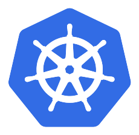

# Sprint 4 · 服務網格與機密運算

基礎設施接管應用層的兩件事:一是服務之間的傳輸與 L7 安全(服務網格),二是工作負載自己的記憶體機密性(機密運算)。這門課在 AKS 上把這兩塊各實測一輪,寫成可照抄的 runbook。**Part 1(服務網格,Day 0–4)已完成**:Envoy Gateway 的 north-south 入口與 HTTP/3、Istio ambient 與 Cilium 兩條 east-west mesh 照軸選型。**Part 2(機密運算,Day 5–9)已完成**:Kata 沙箱、SEV-SNP 的 kata-cc、遠端證明讓祕密只在證明過的 pod 裡解開(改一個 env 就拿不到)。每一章的指令與輸出都來自真實跑過的驗證紀錄。

[{ width="72" }](https://gateway.envoyproxy.io/)
&nbsp;&nbsp;&nbsp;&nbsp;
[{ width="76" }](https://istio.io/latest/docs/ambient/)
&nbsp;&nbsp;&nbsp;&nbsp;
[{ width="76" }](https://cilium.io/)

*Part 1 的三套:Envoy Gateway(north-south 入口)、Istio ambient 與 Cilium(兩條 east-west mesh)。*

整季走同一座 AKS 叢集,BYOCNI 上游 Cilium 當 CNI。Part 1 在一般節點池上跑、接續 Sprint 2 的 eBPF;Part 2 換一個威脅模型——當節點與雲平台都不該被信任時,加密與金鑰不能再放在節點的記憶體裡。

## Part 1 · 服務網格(Day 0–4,已完成)

-   { width="44" }

    **Day 0 · [服務網格與入口閘道的三層地圖](../runbook/sprint4-day0-mesh-concepts.md)**

    ---

    north-south 入口、east-west mesh、L7 落點三層先分清楚:eBPF 拿下 L3/L4 之後,mesh 這層還負責什麼。

-   { width="44" }

    **Day 1 · [Envoy Gateway 取代 Ingress + HTTP/3](../runbook/sprint4-day1-envoy-gateway.md)**

    ---

    用 Gateway API 三件套把入口流量重接一次,並開起 Ingress 一直做不好的 HTTP/3——在瀏覽器 DevTools 上驗到協定真的是 h3。

-   { width="44" }

    **Day 2 · [Istio ambient east-west mesh](../runbook/sprint4-day2-istio-ambient.md)**

    ---

    ztunnel 的 HBONE 隧道做到服務間自動 mTLS 加 SPIFFE 身分,waypoint 上設一條斷路、50 並發壓出 28 筆 503。

-   { width="44" }

    **Day 3 · [Cilium east-west mesh](../runbook/sprint4-day3-cilium-mesh.md)**

    ---

    換 Cilium 自己的 mesh 做同一組驗收:WireGuard 傳輸加密(抓包 2412 個密文封包、0 明文)、L7 policy、以及誠實面對還在 beta 的身分綁定。

-   { width="36" }
    { width="36" }

    **Day 4 · [Istio 與 Cilium 橫向對比](../runbook/sprint4-day4-istio-vs-cilium.md)**

    ---

    同一座叢集、同一個拓樸量出兩邊的資源、延遲、節點侵入,收成一張決策表。結論:eBPF 贏在 L4,Istio 贏在 L7 與身分。

## Part 2 · 機密運算(Day 5–9,已完成)

Confidential Containers 需要 SEV-SNP 的 `_cc_v5` 機密硬體,而東京沒賣、只能換區另建叢集——這個現實本身就是 Part 2 的第一課。

-   { width="44" }

    **Day 5 · [機密運算防的是誰](../runbook/sprint4-day5-confidential-concepts.md)**

    ---

    機密運算保護 guest 不被主機看,跟一般 Kata 沙箱「保護主機不被 guest 害」方向相反;而它跟 eBPF「從主機看清楚工作負載」的立場也正好相反。

-   { width="44" }

    **Day 6 · [Kata Pod Sandboxing](../runbook/sprint4-day6-kata-sandboxing.md)**

    ---

    pod 跑進獨立 kernel 的輕量 VM(`.mshv`),又是那條 RuntimeClass → handler → shim 鏈;自管 Cilium 接住 AzureLinux Kata 節點。

-   { width="44" }

    **Day 7 · [kata-cc:SEV-SNP 機密硬體](../runbook/sprint4-day7-katacc.md)**

    ---

    pod 跑在真 SEV-SNP 硬體上,而它挑區域、挑池角色、要安全政策——五顆地雷,外加各家雲的機密硬體對照。

-   { width="44" }

    **Day 8 · [遠端證明:讓祕密只在 TEE 裡解開](../runbook/sprint4-day8-attestation.md)**

    ---

    符合政策的 pod 拿得到金鑰、改一個 env → measurement 變 → 被拒。機密運算真正重要的:證明先行,拿祕密在後。

-   { width="44" }

    **Day 9 · [總結與決策表](../runbook/sprint4-day9-decision-matrix.md)**

    ---

    可逆性、成本、AKS kata-cc vs 上游 CoCo 決策表;收束兩個 Part 對「主機該不該看得到工作負載」的相反立場。

## 這個 sprint 的貫穿問題

Part 1 的每一套加密,金鑰都在節點的記憶體裡、root 進得了節點就看得到明文。Part 2 換掉這個前提:當節點本身不可信,加密要往硬體挪。兩個 Part 合起來回答一件事——基礎設施能替應用扛下多少安全責任,以及扛不下的那部分長什麼樣。

從 [Day 0](../runbook/sprint4-day0-mesh-concepts.md) 開始。

---

!!! quote ""
    Envoy、Istio、Cilium、Kubernetes 標誌為 CNCF(Linux Foundation)官方資產,此處皆作社群教學用途。
